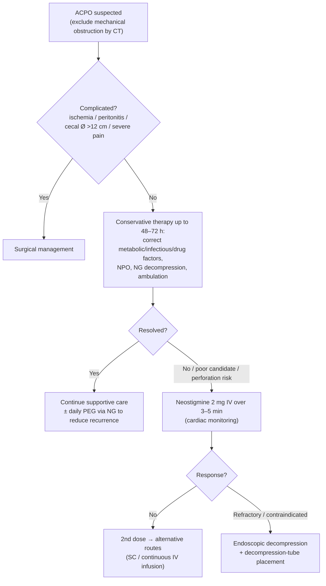

# Acute Colonic Pseudo-Obstruction (Ogilvie's Syndrome)

Massive **colonic dilatation without mechanical obstruction**, from altered autonomic regulation of colonic motility (colonic atony). Synonymous with **Ogilvie's syndrome**. Almost always arises in hospitalized/postoperative or acutely ill patients.

## Contents
- [[#Assessment]]
  - [[#Establishing the Diagnosis]]
  - [[#Severity Assessment]]
- [[#Differential Diagnosis]]
- [[#Diagnostics]]
- [[#Therapeutics]]

## Assessment

### Establishing the Diagnosis
- Clinical picture: abdominal distention, pain, nausea/vomiting, obstipation in a hospitalized/postsurgical or acutely ill patient
- **Mechanical obstruction must be excluded** before the diagnosis is made
- Risk factors: recent surgery (especially orthopedic/cardiac), trauma, infection, electrolyte derangement, opioids/anticholinergics, neurologic disease
- Incidence ~100 per 100,000 hospitalized patients

### Severity Assessment
- **Cecal diameter** is the key risk marker — perforation risk rises with cecal diameter **>10–12 cm** and with distention duration **>6 days**
- ~10% have some degree of right-colon ischemia; spontaneous perforation risk ~3–25%, with up to ~50% mortality once perforation occurs
- "Complicated" = ischemia, peritonitis, cecal diameter >12 cm, or significant abdominal pain

## Differential Diagnosis
*Workup: see [[nausea-and-vomiting]] for the broader obstruction/ileus evaluation.*
- Mechanical large-bowel obstruction ([[colorectal-cancer|malignancy]], stricture) — primary exclusion
- [[colonic-volvulus]] (sigmoid or cecal) — mechanical twist
- Postoperative ileus
- [[toxic-megacolon|Toxic megacolon]] ([[clostridioides-difficile]], [[ulcerative-colitis]])

## Diagnostics
- **Contrast-enhanced CT** — preferred; excludes mechanical obstruction and assesses cecal diameter/ischemia (plain films cannot always distinguish functional from mechanical)
- Plain abdominal film — shows colonic dilatation; serial films track cecal diameter
- Water-soluble contrast enema — alternative to exclude distal mechanical obstruction
- Labs: electrolytes (Mg, K, Ca, phosphate), assess infection, review medications

## Therapeutics

**Stepwise algorithm ([[asge-2020-acpo-volvulus|ASGE 2020]]):**

*Figure — ACPO management algorithm. ([[asge-2020-acpo-volvulus]])*

**Conservative therapy (first-line, uncomplicated):** identify and discontinue predisposing factors (e.g. opioids), correct fluid/electrolyte disorders, NPO, NG-tube decompression, ambulation, treat infection. Success 77–96%; reassess cecal diameter serially.

**Neostigmine** (anticholinesterase) — pharmacologic agent of choice when conservative therapy fails (up to 72 h), patient is not a candidate, or at perforation risk:
- Dose **2 mg IV over 3–5 min** with **continuous cardiovascular monitoring** (bradycardia/asystole risk); atropine at bedside
- Effective in ~85–94%; non-response associated with male sex, younger age, postsurgical status, electrolyte imbalance
- No response → **second dose**; refractory to bolus → **subcutaneous or continuous IV infusion**
- **Absolute contraindications:** mechanical bowel/urinary obstruction, known hypersensitivity
- **Relative contraindications:** bradycardia, asthma, renal insufficiency, [[peptic-ulcer-disease|peptic ulcer disease]], recent MI, acidosis
- **Daily PEG via NG tube** reduces recurrence

**Endoscopic decompression** ([[colonoscopy]] with decompression-tube placement) — alternative when neostigmine is unsuitable or fails:
- Initial + sustained decompression achieved in up to ~95%; ~2% perforation risk, ~1% mortality
- Exclude perforation with a plain film within hours before the procedure (esp. if fever, leukocytosis, worsening pain)
- **Decompression-tube placement** reduces recurrence — ~40% recurrence risk when no tube is placed

**Surgery** — for peritonitis, ischemia, perforation, clinical deterioration, or **cecal diameter >12 cm**. Options: surgically placed cecostomy, percutaneous cecostomy, or subtotal colectomy; surgical mortality up to ~44% with ischemic/perforated bowel, so nonoperative management is preferred where feasible.

## See Also
[[colonic-volvulus]], [[colonoscopy]], [[chronic-idiopathic-constipation]], [[nausea-and-vomiting]], [[clostridioides-difficile]]

---

## Sources

1. [[asge-2020-acpo-volvulus|ASGE 2020: Role of Endoscopy in the Management of Acute Colonic Pseudo-Obstruction and Colonic Volvulus]]
