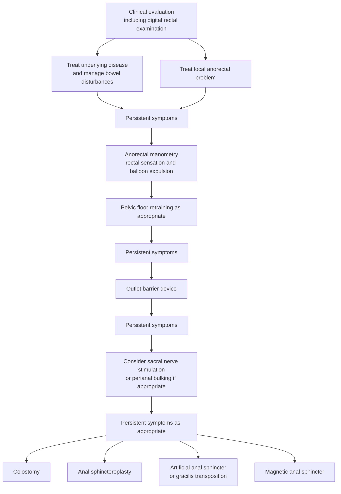

## Contents
- [[#Assessment]]
  - [[#Establishing the Diagnosis]]
  - [[#Severity Assessment]]
- [[#Differential Diagnosis]]
- [[#Diagnostics]]
  - [[#Initial Assessment (All Patients)]]
  - [[#Anorectal Physiology (for patients not responding to conservative measures)]]
- [[#Therapeutics]]
  - [[#Stepwise Pathway]]
  - [[#Step 1: Conservative Management]]
  - [[#Step 2: Biofeedback (Pelvic Floor Rehabilitation)]]
  - [[#Step 3: Advanced Interventions]]
  - [[#Treatment Costs]]
- [[#See Also]]
- [[#Sources]]

---

## Assessment

### Establishing the Diagnosis

**Fecal incontinence (FI)** = involuntary loss of solid or liquid feces (including staining of underwear); the broader term **anal incontinence** includes involuntary flatus.

- **Diagnostic threshold changed in [[rome-v-2026-dgbi|Rome V]] (2026):** FI ([[disorders-of-gut-brain-interaction|disorder of gut-brain interaction (DGBI)]] category **F1**) now requires **"two or more episodes of uncontrolled passage of fecal material"**, replacing Rome IV's qualitative **"recurrent uncontrolled passage"** — the stated purpose is to give the diagnosis an explicit **threshold frequency**. [[rome-v-2026-dgbi]]
  - Rome V does not state the **time window** over which the ≥2 episodes must occur.
- **Rome V also added anorectal sensory dysfunction disorders (F4)** alongside FI: **F4b rectal hypersensitivity** presents with **increased urge to defecate** and prolonged/frequent toilet times, and **F4a rectal hyposensitivity** with a blunted urge — both are diagnosed by **rectal sensitivity testing** and treated with **balloon sensory training**, so an abnormal rectal sensation on anorectal manometry (ARM) is a treatable finding, not an incidental one. Overview and the criteria gap: [[defecation-disorders]]. [[rome-v-2026-dgbi]]

**Prevalence:** 2.2–25% community; ~9% age-adjusted in US. **Significantly underreported** — physicians must actively ask, particularly in patients with predisposing conditions.

**Key history elements:**

- Type (urge vs. passive vs. staining)
- Frequency and amount (small/medium/large)
- Presence of urgency
- Associated symptoms ([[chronic-diarrhea|diarrhea]], [[chronic-idiopathic-constipation|constipation]])
- Obstetric history (vaginal delivery, tears, forceps)
- Neurologic conditions, prior pelvic/anorectal surgery, radiation

**Pathophysiology:**

- **Urge FI:** Unable to hold stool after sensation; reduced squeeze pressure (external sphincter weakness)
- **Passive FI:** Unaware of incontinence episode; reduced resting tone (internal sphincter weakness); low rectal sensation

### Severity Assessment

Severity is graded from **symptom burden** (type, frequency, and amount of leakage; urgency), **impact on quality of life**, and **response to conservative management** — together with patient age, probable etiology, and test availability these determine which diagnostic tests are done and when to escalate ([[acg-2021-anorectal-disorders]]).

**Factors predicting worse outcomes:** older age, diarrhea-predominant bowel habits, rectal urgency, more severe FI, multiple comorbidities.

> The guidelines name the FI severity instruments (Cleveland Clinic/Wexner score, Fecal Incontinence Severity Index) without printing their items or point values; score from the original instruments.

---

## Differential Diagnosis

*Workup of the bowel-habit driver — overflow FI from impaction, and the constipation-associated FI treated with fiber: see [[chronic-constipation]]. The FI-specific stepwise evaluation is under [[#Diagnostics]] below.*

| Cause | Key Features |
|-------|-------------|
| Obstetric sphincter injury | Women; history of vaginal delivery, instrumental delivery, tears; sphincter defects on endoanal ultrasound (US) or magnetic resonance imaging (MRI) |
| Neurogenic FI | Spinal cord injury, multiple sclerosis, diabetes peripheral neuropathy, pudendal neuropathy |
| [[inflammatory-bowel-disease\|inflammatory bowel disease (IBD)]] | Diarrhea urgency in [[crohns-disease\|Crohn's]] proctitis or [[ulcerative-colitis\|ulcerative colitis (UC)]]; specific treatment of IBD may improve FI |
| [[rectal-prolapse\|Rectal prolapse]] | Visible prolapse; associated with FI and constipation |
| Overflow incontinence | Fecal impaction with liquid feces leaking around; rectal exam reveals impaction |
| [[radiation-proctopathy\|Radiation proctopathy]] | History of pelvic radiation; radiation proctitis with urgency |
| Scleroderma | Dysmotility, malabsorption; distinctive manometry pattern |
| Post-surgical (sphincter disruption) | Prior anorectal surgery, [[hemorrhoids\|hemorrhoidectomy]], fistulotomy, lateral internal sphincterotomy (LIS) |

---

## Diagnostics

### Initial Assessment (All Patients)

- **Bristol Stool Form Scale + bowel diary** — characterize stool consistency and frequency; soft/liquid stools worsen FI
- **Digital rectal examination (DRE):** assess resting and squeeze tone, palpate for masses, check for fecal impaction, assess pelvic floor motion during simulated defecation
- **Laboratory:** complete blood count (CBC), thyroid function if diarrhea-prominent or systemic features
- **Structural endoscopic evaluation:** all FI patients should undergo flexible sigmoidoscopy or [[colonoscopy]] as indicated by age, family history, and prior endoscopic evaluation — to exclude mucosal disease (IBD, [[colorectal-cancer|neoplasia]], radiation proctopathy). *(American Society for Gastrointestinal Endoscopy (ASGE) 2010)* [[asge-2010-anorectal-disorders]]

### Anorectal Physiology (for patients not responding to conservative measures)

- **[[anorectal-manometry|ARM]]:** resting and squeeze pressures; rectal sensation; rectal compliance; key parameters for biofeedback targeting
- **Rectal balloon expulsion test (BET):** assess evacuation dynamics; relevant if constipation co-exists
- **Endoanal ultrasound (EAUS):** best modality for visualizing sphincter defects (internal sphincter clearly delineated); identifies disruption amenable to sphincteroplasty
- **Pelvic floor MRI:** superior to EAUS for external sphincter atrophy and scar; also identifies rectocele, enterocele, levator defects; preferable if surgery being considered
- **Needle electromyography (EMG) of anal sphincter:** consider if clinically suspected neurogenic weakness; low clinical significance alone due to poor reliability

---

## Therapeutics

### Stepwise Pathway

A stepwise approach should be followed; conservative therapies **benefit approximately 25% of patients** and are tried first (**AGA 2017 Best Practice Advice 1**) ([[aga-2017-surgical-device-fecal-incontinence]]).

*Figure 1 — Algorithm for the diagnosis and management of fecal incontinence. ([[aga-2017-surgical-device-fecal-incontinence]])*

**Escalation thresholds:**

- **SNS** — after a **3-month or longer** trial of conservative measures *and* biofeedback, for **moderate or severe** FI without contraindications (Best Practice Advice 4). The guideline does not say whether the 3 months counts conservative therapy, biofeedback, or both combined.
- **Major anatomic defects** (rectovaginal fistula, full-thickness [[rectal-prolapse|rectal prolapse]], fistula in ano, cloaca-like deformity) are **rectified with surgery** rather than worked through this ladder (Best Practice Advice 9).

### Step 1: Conservative Management

**American College of Gastroenterology (ACG) 2021 Rec 1 (Strong / low):** *antidiarrheal drugs when FI is accompanied by diarrhea.* The named agents [[acg-2021-anorectal-disorders]]:

- **[[loperamide|Loperamide]]** — first-line, most evidence; reduces stool frequency and urgency
- **Diphenoxylate with atropine** — alternative antidiarrheal
- **Bile salt binding agents** — cholestyramine or **colesevelam**; relevant with [[bile-acid-diarrhea|bile acid malabsorption]] (post-cholecystectomy, ileal disease)
- **Anticholinergic agents** — a separate class from clonidine in the guideline's own list
- **Clonidine** — read the evidence before using it: in women with FI, clonidine **did not improve continence in all comers** and only **tended** to improve it in women **with diarrhea**
- Cochrane (13 randomized controlled trials (RCTs), 473 participants; 7 tested loperamide, diphenoxylate + atropine, or codeine): symptoms better than placebo in **4 trials** — improved/restored continence, reduced urgency, more formed stools, fewer pads. In 2 of those 4, **more patients reported adverse effects** (constipation, abdominal pain, diarrhea, headache, nausea)

**Loperamide dosing for FI** ([[aga-2017-surgical-device-fecal-incontinence]]): **2 mg tablets — start 1 tablet 30 minutes before breakfast**, titrate as necessary **up to 16 mg/d**.

> ACG 2021 names the antidiarrheal agents without dose, interval, or duration; the regimen above is AGA 2017's. Doses for the other named agents are still not given by either guideline.

**What an optimal conservative trial contains** — many patients labelled refractory have not had one (Best Practice Advice 1) ([[aga-2017-surgical-device-fecal-incontinence]]):

1. Meticulous characterization of bowel habits, the circumstances surrounding FI (relationship to meals and activity), and prior FI treatment
2. With diarrhea — dietary history for **poorly absorbed sugars** (sorbitol, fructose), then a trial of elimination
3. Loperamide as above; fiber to improve stool consistency; **cholestyramine or colesevelam** (bile-salt malabsorption is common in idiopathic diarrhea); anticholinergics and clonidine as alternatives
4. With constipation — laxatives plus anorectal testing for evacuation disorders. **Fecal seepage** specifically = an evacuation disorder with overflow of retained rectal stool → [[biofeedback-therapy|pelvic floor biofeedback]] directed at the evacuation disorder; **rectal cleansing with a small enema or tap water** reduces leakage

**Dietary counseling:**

- Identify and reduce dietary triggers (foods with incompletely digested sugars, caffeine)
- Low–fermentable oligosaccharides, disaccharides, monosaccharides, and polyols (FODMAP) diet: 65% of patients reported improvement in uncontrolled audit; prospective RCTs needed
- High-fiber diet if constipation-associated FI

### Step 2: Biofeedback (Pelvic Floor Rehabilitation)

**Strong/Moderate recommendation (ACG 2021):**

- [[biofeedback-therapy|Biofeedback]] recommended for patients not controlled by education + conservative measures
- **3 components:** (i) patient education on diarrhea/constipation causes; (ii) antidiarrheal medication; (iii) pelvic floor exercises (Kegel-type) with visual or auditory feedback
- With proper teaching and follow-up: up to 20% of patients may not need further treatment
- Biofeedback > pelvic floor exercises alone (RCT data); targets squeeze strength, endurance, and sensory-motor coordination
- Limitations: labor-intensive; requires trained therapist; motivation-dependent; less effective with central nervous system (CNS) disease, short-term memory loss, dementia

### Step 3: Advanced Interventions

**Anal plugs, vaginal balloons** (Conditional/Very Low): mechanical barrier devices; difficult to tolerate but acceptable in selected patients; adjunct role

**Injectable bulking agents** (Conditional/Low):

- Dextranomer in stabilized hyaluronic acid (NASHA Dx): ≥50% reduction in FI episodes in 52% vs 31% (placebo) in RCT; FDA-approved
- Perianal injection under anoscopic guidance

**[[sacral-nerve-stimulation|Sacral nerve stimulation]] (SNS) — Strong/Low:**

- For **moderate to severe FI failing conservative measures, biofeedback, and low-risk interventions**
- Mechanism: peripheral stimulation of the **S3 or S4 nerve roots** in the sacral foramina → modulates colorectal/pelvic floor neural circuits
- **Two-stage:** patients whose symptoms respond to **temporary SNS for 2–3 weeks** get the device implanted in the abdomen
- **Who was studied — the entry criteria of the pivotal North American multicenter trial (n=133)** [[acg-2021-anorectal-disorders]]:
  - **>2 incontinent episodes per week for >6 months**, *or* **>12 months after childbirth**
  - **and** failed, or not a candidate for, conservative therapy
- **Who was excluded — the operative contraindication list:** chronic diarrhea · large sphincter defects · chronic [[inflammatory-bowel-disease|inflammatory bowel disease]] · visible sequelae of pelvic radiation · active anal inflammation · neurologic disease such as clinically significant peripheral neuropathy or **complete spinal cord injury**
- **Results:** temporary-SNS success **90%**. At **3 years**, **86%** of implanted patients had a **≥50% reduction** in incontinent episodes/week (therapeutic success) and **40% achieved complete continence**; episodes fell from **9.4/wk at baseline to 1.7 at 12 months**, with improvement in all 4 FI-QoL scales at 12/24/36 months
- **SNS has no measurable effect on anorectal function tests** — the benefit is symptomatic, and the pivotal study was uncontrolled
- Device complications at 60 months: **61% device-related adverse events** — implant site pain **28%**, paresthesias **15%**, change in sensation of stimulation **12%**, infection **10%**. Counsel carefully
- **Not for constipation:** 3 RCTs showed no benefit of SNS in constipation of any type, and with the 61% long-term complication rate ACG recommends against it there

**Anal sphincteroplasty (Conditional/Low):**

- For patients with documented acute external sphincter injury (e.g., post-obstetric tear)
- Short-term improvement in 85%; deteriorates to ~50% at 40–60 months
- Best performed shortly after recognized injury; delayed repair less durable
- Generally recognized shortly after vaginal delivery in women with sphincter disruption and persisting symptoms

**[[ostomy-management|End stoma]] (Conditional):**

- Last resort for severe FI not responding to other treatments
- Significant quality of life (QoL) improvement reported in selected patients who accept stoma
- Median QoL score (scale 0–10) = 8 for ability to live with stoma
- 83% felt stoma restricted their life little or not at all

**Magnetic anal sphincter (AGA 2017 Best Practice Advice 11)** — interlinked titanium beads with magnetic cores encircling the external sphincter; beads separate during defecation. Last-line, after barrier devices, bulking, SNS, sphincteroplasty and colostomy ([[aga-2017-surgical-device-fecal-incontinence]]):

- **36 mo: 57% achieved ≥50% reduction in FI episodes**
- **20% explanted** (infection, erosion, or lack of effect); 1 further patient needed a stoma for obstructed defecation
- **40% had moderate or severe complications** — the guideline states this inside the recommendation itself
- US FDA approval is via the **humanitarian device exemption** process, based on 35 patients
- vs artificial sphincter (n=20 matched): shorter surgical time (62 vs 97 min) and stay (4.5 vs 10 d); no difference in early complications

**Artificial bowel sphincter / dynamic graciloplasty (Best Practice Advice 8)** — considered only after barrier devices, SNS, bulking, sphincteroplasty and colostomy have failed or are unsuitable:

- Artificial sphincter (n=52, 85 devices, mean follow-up >5 y): **full continence seldom achieved, 14% device-related infection, 32% explantation**
- Dynamic graciloplasty success (≥50% reduction): **62% at 12 mo, 55% at 18 mo, 56% at 2 y**; systematic review 42–85%; infection 28%, stimulator malfunction 15%, leg pain 13%

> **ACG 2021 and AGA 2017 disagree here.** ACG 2021 calls dynamic graciloplasty's morbidity and mortality unacceptable and does not use it; AGA 2017 keeps it as a last-line option. **ACG 2021 governs this page** as the newer guideline. AGA 2017 itself notes that no clinical trials of the procedure have been published in recent years, suggesting it is not performed routinely.

**Radiofrequency anal sphincter remodeling (SECCA)** — temperature-controlled radiofrequency (**465 kHz, 2–5 W**) to the anorectal junction; **not routinely recommended** (ACG 2021):

- **Manometry and endoanal ultrasound show no change** after the procedure
- Review of 10 studies, 220 patients: FI improved in **55–80%**; **complications in 20%**
- No randomized controlled trials; FDA-approved since 2002. AGA 2017 describes the procedure but issues **no recommendation on it either way**

**Percutaneous tibial nerve stimulation (PTNS) — should not be used (Best Practice Advice 5):**

- Uncontrolled studies reported 52–82% achieving ≥50% reduction, but the **large multicenter RCT found transcutaneous stimulation no better than sham**
- SNS was significantly better than medical treatment but **not significantly better than PTNS** in head-to-head RCTs

### Treatment Costs

2013 US dollars ([[aga-2017-surgical-device-fecal-incontinence]]):

| Treatment | Cost (range) |
|---|---|
| Conservative treatment | **$2584** ($2067–$3101) |
| [[biofeedback-therapy\|Biofeedback]], 3-month trial | **$796** ($638–$955) |
| Dextranomer (physician + procedure) | **$5181** ($3165–$7197) |
| [[sacral-nerve-stimulation\|SNS]] | **$35,818** ($28,654–$42,982) |

---

## See Also
[[defecation-disorders]], [[proctalgia-syndromes]], [[chronic-constipation]], [[chronic-idiopathic-constipation]], [[chronic-diarrhea]], [[hemorrhoids]], [[anal-fissure]], [[rectal-prolapse]], [[radiation-proctopathy]], [[colorectal-cancer]], [[sacral-nerve-stimulation]], [[biofeedback-therapy]], [[anorectal-manometry]], [[loperamide]], [[bile-acid-diarrhea]], [[ostomy-management]], [[inflammatory-bowel-disease]], [[crohns-disease]], [[ulcerative-colitis]], [[enterotoxigenic-e-coli]]

---

## Sources

1. [[acg-2021-anorectal-disorders|ACG 2021 Clinical Guidelines: Management of Benign Anorectal Disorders]]
2. [[asge-2010-anorectal-disorders|ASGE 2010: The Role of Endoscopy in Patients With Anorectal Disorders]]
3. [[rome-v-2026-dgbi|Disorders of Gut–Brain Interaction and the Rome V Process]]
4. [[aga-2017-surgical-device-fecal-incontinence|Surgical Interventions and the Use of Device-Aided Therapy for the Treatment of Fecal Incontinence and Defecatory Disorders]]
