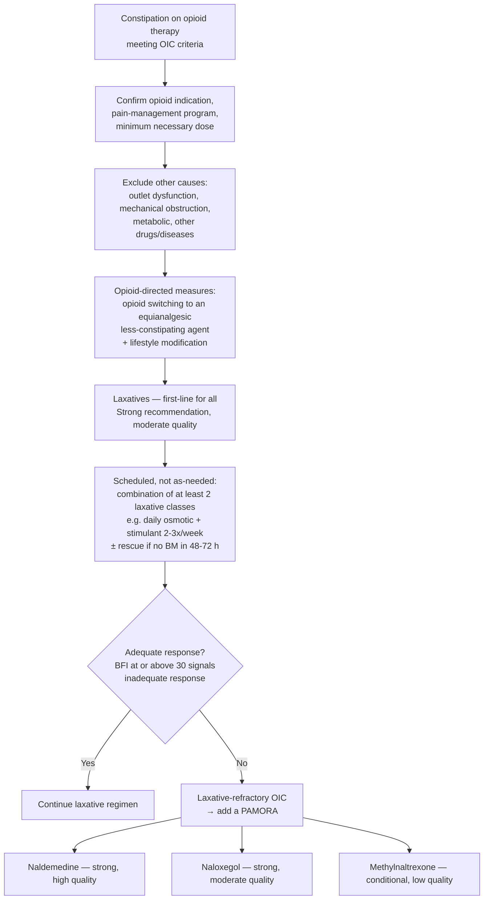

## Contents
- [[#Assessment]]
  - [[#Establishing the Diagnosis]]
  - [[#Severity Assessment]]
- [[#Differential Diagnosis]]
- [[#Diagnostics]]
- [[#Therapeutics]]
  - [[#Treatment sequence]]
  - [[#Step 1: Opioid-directed and lifestyle measures]]
  - [[#Step 2: Laxatives — first-line for every patient]]
  - [[#Step 3: PAMORAs for laxative-refractory OIC]]
  - [[#Agents with no AGA recommendation]]
  - [[#What the evidence does not answer]]
- [[#See Also]]
- [[#Sources]]

---

## Assessment

### Establishing the Diagnosis

**Opioid-induced constipation (OIC)** = constipation that is a result of opioid therapy. Distinct from other constipation because it arises from the direct pharmacologic effects of opioids on the gut, and therefore deserves dedicated medical management [[aga-2019-opioid-induced-constipation]].

- **Mechanism:** three opioid receptor classes mediate GI effects — **μ, δ, κ**. κ-receptors in the stomach and small intestine, μ-receptors in the small intestine and proximal colon. OIC occurs primarily via **enteric μ-receptor activation** → increased tonic non-propulsive contractions in small and large intestine, increased colonic fluid absorption, stool desiccation. Opioids also **raise the minimum rectal sensory threshold** and **increase anal sphincter tone**. Net result: harder stool, less frequent and less effective defecation.
- **Epidemiology:** affects an estimated **40%–80%** of patients on chronic opioid therapy; some degree of constipation is near universal on opioids. ~9–12 million Americans have chronic pain annually; **4%–5%** of the US population uses prescription opioids regularly.
- **OIC vs opioid-induced bowel dysfunction (OIBD):** OIBD is the wider set of GI adverse effects of opioid therapy — constipation, [[gerd|gastroesophageal reflux disease]], [[nausea-and-vomiting|nausea and vomiting]], [[abdominal-bloating-and-distention|bloating]], and abdominal pain.
- **Category:** [[rome-v-2026-dgbi|Rome V]] keeps OIC as a **separate bowel-DGBI category (C6)**, not a subtype of [[chronic-idiopathic-constipation|chronic constipation]].

**Rome IV symptom criteria**, as reproduced by [[aga-2019-opioid-induced-constipation]] — **new or worsening symptoms of constipation when initiating, changing, or increasing opioid therapy**, which must include **≥2** of:

1. Straining **>25%** of defecations
2. Lumpy or hard stools **>25%** of defecations
3. Sensation of incomplete evacuation **>25%** of defecations
4. Sensation of anorectal obstruction/blockage **>25%** of defecations
5. Manual maneuvers to facilitate **>25%** of defecations (e.g. digital evacuation, support of the pelvic floor)
6. Fewer than **3 spontaneous bowel movements (SBM) per week**

**Consensus definition** (broader, any-one-of): "a change when initiating opioid therapy from baseline bowel habits that is characterized by any of the following: **reduced bowel movement frequency, development or worsening of straining** to pass bowel movements, **a sense of incomplete rectal evacuation, or harder stool consistency**."

> Both definitions capture **not only stool frequency but also stool consistency and difficulty with defecation** — a patient still passing stools daily but straining harder since the opioid was started meets the definition. OIC is defined variably in the literature and some studies use no explicit definition at all.

### Severity Assessment

**Bowel Function Index (BFI)** — simplified **3-question** tool validated in the OIC population; each item scored **0–100** for the **last 7 days**; **total = mean of the 3 scores** [[aga-2019-opioid-induced-constipation]].

| Item | Question | Scale |
|---|---|---|
| 1 | Ease of defecation over the last 7 days, 0 to 100 | 0 = easy or no difficulty · 100 = severe difficulty |
| 2 | Feeling of incomplete bowel evacuation over the last 7 days, 0 to 100 | 0 = not at all · 100 = very strong |
| 3 | Constipation over the last 7 days, 0 to 100 | 0 = not at all · 100 = very strong |

- **BFI ≥30** is consistent with **clinically significant constipation**, and is the consensus cutoff for identifying patients who have **inadequately responded to first-line laxatives** and would benefit from **escalation of therapy**.
- The **Patient Assessment of Constipation Symptoms** is another validated symptom measure used in OIC studies, but may be less practical in clinic.

**"Laxative refractory" is the other severity label, and it is the gate to PAMORA therapy.** See [[#Step 2: Laxatives — first-line for every patient]] for the operational criteria.

---

## Differential Diagnosis

*Workup: see [[chronic-constipation]].*

Before attributing constipation to the opioid, explore and exclude other causes and contributors [[aga-2019-opioid-induced-constipation]]:

| Alternative / contributor | What points to it |
|---|---|
| **Pelvic outlet dysfunction** — see [[defecation-disorders]] | Symptoms of dyssynergic defecation, e.g. a sensation of incomplete evacuation |
| **Mechanical obstruction** | Alarm symptoms — blood in stool, accompanying weight loss |
| **Metabolic abnormalities** | Comorbid illness on medical history |
| **Other diseases or medications** | Full review of comorbidities and regular medication use |
| [[chronic-idiopathic-constipation\|Chronic idiopathic constipation]] | Constipation predating opioid initiation, with no worsening on initiating/escalating the opioid |

---

## Diagnostics

The diagnosis is **clinical**. [[aga-2019-opioid-induced-constipation]] addresses medical management only — it does not cover the diagnostic evaluation of OIC, psychological therapy, alternative medicine, surgery, or devices, and its diagnostic guidance is narrative rather than graded. The structural and physiologic workup (endoscopy, [[anorectal-manometry|ARM]] + balloon expulsion, transit testing, defecography) lives on [[chronic-constipation]].

**History to take in suspected OIC:**

- **Defecation patterns** and **stool consistency**
- **Dietary patterns**
- **Symptoms of dyssynergic defecation** (e.g. a sensation of incomplete evacuation)
- **Alarm symptoms** — blood in stool, accompanying weight loss
- **Medical history** for comorbid illnesses and **regular medication use**

**Before treating, confirm the opioid itself is appropriate:** that the indication for opioid therapy is valid, that the patient is in a pain management program (ideally with a pain specialist), and that the **minimum necessary opioid dose** is being taken. Patients on chronic opioid therapy must have a clear understanding of the risks of long-term opioid treatment, which include death due to drug misuse and abuse.

---

## Therapeutics

### Treatment sequence

### Step 1: Opioid-directed and lifestyle measures

**Opioid-directed** (narrative, ungraded) [[aga-2019-opioid-induced-constipation]]:

- **Opioid switching** — change to an **equianalgesic dose of an alternative, less-constipating opioid**.
- **Oral or parenteral morphine** preparations may induce **more** constipation than **transdermal opioids such as fentanyl**.
- **Combination opioid agonist/antagonist agents** (e.g. oxycodone + naloxone) are associated with **lower risk of constipation** than pure opioid agonists in chronic pain — but these were not addressed by the technical review or by any graded recommendation, so no AGA position exists on them.

**Lifestyle modifications are an appropriate first step for all those with constipation:**

- Increasing **fluid intake**
- **Regular moderate exercise** as tolerated
- **Toileting as soon as possible in response to the urge to defecate**

### Step 2: Laxatives — first-line for every patient

> **1a. In patients with OIC, the AGA recommends use of laxatives as first-line agents.** *Strong recommendation, moderate-quality evidence.* [[aga-2019-opioid-induced-constipation]]

Laxatives are very safe, widely available over the counter, and inexpensive — the cost and safety profile drove the strong recommendation despite only moderate-quality efficacy data.

| Class | Examples | Mechanism |
|---|---|---|
| **Osmotic** | PEG, [[lactulose\|lactulose]], magnesium citrate, magnesium hydroxide | Draw water into intestine to hydrate and soften stool |
| **Stimulant** | Bisacodyl, sodium picosulfate, senna | Irritate sensory nerve endings to stimulate colonic motility and reduce colonic water absorption |
| **Detergent / surfactant stool softener** | Docusate | Allow water and lipids to penetrate the stool to hydrate and soften fecal material |
| **Lubricant** | Mineral oil | Lubricate the lining of the gut to facilitate defecation |

- **Agents with demonstrated efficacy** in OIC and chronic idiopathic constipation trials: **PEG** (osmotic), **bisacodyl** and **sodium picosulfate** (stimulants).
- **Fiber has a limited role in OIC** — it is a bulking agent that does not affect colonic motility; useful mainly in persons with fiber-deficient diets. Soluble fiber (psyllium, calcium polycarbophil, methylcellulose; dietary oats, certain fruits and vegetables) is more effective for constipation than insoluble fiber.
- **Enemas** are occasionally prescribed as rescue therapy but are not used as regularly as other laxative classes, because of convenience, patient preference, and safety concerns.
- There is **little evidence that routine use of stimulant laxatives is harmful to the colon**, despite widespread concern to the contrary.

**How the regimen must be run before calling it a failure** [[aga-2019-opioid-induced-constipation]]:

- **Scheduled, not "as needed."** Scheduled use is required before deciding that alternative OIC therapy is necessary.
- **A combination of at least 2 types of laxatives** before escalating therapy. Worked example given: **daily osmotic laxative + a stimulant laxative at least 2–3 times per week.**
- **"Inadequate laxative response"** as used in OIC studies = **moderate or severe symptoms of constipation despite laxatives from ≥1 laxative class for a minimum of 4 days over a 2-week period**.
- **Rescue therapy** in OIC trials was offered when there was **no bowel movement within a specified time, usually 48–72 hours** — most commonly **oral bisacodyl or bisacodyl suppositories**.
- Strong **RCT-level evidence for any particular laxative combination or titration regimen is lacking**; the above is the panel's favoured approach.

*Laxative starting doses and maximums are not printed by this guideline; the dose table for the same agents in chronic idiopathic constipation is on [[chronic-idiopathic-constipation]].*

### Step 3: PAMORAs for laxative-refractory OIC

[[pamoras|Peripherally acting μ-opioid receptor antagonists]] block gut μ-opioid receptors without entering the CNS, restoring enteric nervous system function — class pharmacology and the individual agents' properties are on that page.

| Agent | AGA statement | Strength · quality | Efficacy in the pooled trials | Safety / practical limits |
|---|---|---|---|---|
| **Naldemedine** | **2a.** "In patients with laxative refractory OIC, the AGA recommends naldemedine over no treatment." | **Strong · High** | 4 RCTs, >2400 patients. ≥3 SBM/week in **~52%** vs **35%** placebo; **RR 1.51 (95% CI 1.32–1.72)**. At 52 weeks (COMPOSE 3), **~1 more SBM/week** than placebo (0.95 more; 95% CI 0.57–1.33 more) | AEs leading to discontinuation **RR 1.44 (95% CI 1.03–2.03)** — infection, abdominal pain, diarrhea, flatulence, nausea, back pain — but only **2 more per 100 treated** in absolute terms, below the clinically meaningful harm threshold. The **only** prescription agent here with **52-week safety data**. Use may be limited by **cost** |
| **Naloxegol** | **2b.** "In patients with laxative refractory OIC, the AGA recommends naloxegol over no treatment." | **Strong · Moderate** | Response (3 SBM/week **and** ≥1 more than baseline, for ≥3 of the final 4 weeks of 12) in **41.9%** vs **29.4%** placebo → **13 more responders per 100 (95% CI 6–21 more)**; **RR 1.43 (95% CI 1.19–1.71)** | Generalized or upper abdominal pain, diarrhea, nausea, headache, flatulence (**RR 2.33; 95% CI 1.62–3.35**). Two deaths in the safety study, **1 in each arm**, neither considered study-drug related. Evidence rated down for imprecision. **Use should be judicious given cost** |
| **Methylnaltrexone** | **2c.** "In patients with laxative refractory OIC, the AGA suggests methylnaltrexone over no treatment." | **Conditional · Low** | 5 RCTs, but only 3 used **≥3 rescue-free BM/week** (the FDA-recommended outcome) and only 2 studied non-cancer pain. **RR 1.43 (95% CI 1.21–1.68)** = 43% improvement, **16 more patients per 100** achieving the outcome. "Laxation response" (a BM **within 4 hours** of the dose) **RR 3.16 (95% CI 2.18–4.58)** | No statistically significant increase in AEs leading to discontinuation. Quality rated down for **indirectness, inconsistency, imprecision**. **High cost relative to other agents**; the **subcutaneous** formulation may be an advantage in some situations |

- **Class safety caveat:** avoid PAMORAs in conditions that **compromise the blood–brain barrier**, because of the potential for **serious withdrawal or reversal of anesthesia**.
- **Dosing:** AGA 2019 does not print doses for naldemedine, naloxegol, or methylnaltrexone.

### Agents with no AGA recommendation

> **3a. In patients with OIC, the AGA makes no recommendation for the use of [[lubiprostone|lubiprostone]].** *No recommendation, evidence gap.*
> **4a. In patients with OIC, the AGA makes no recommendation for the use of [[prucalopride|prucalopride]].** *No recommendation, evidence gap.*

"No recommendation" is a formal GRADE category here, used when confidence in the effect estimate is so low that any recommendation would be speculative. **It is not a recommendation against the drug** — and it applies to the OIC population specifically; both agents carry positive recommendations in chronic idiopathic constipation, which explicitly excluded OIC patients ([[aga-acg-2023-constipation]]).

| Agent | Trial regimen the guideline prints | Result | Why the evidence failed |
|---|---|---|---|
| **Lubiprostone** — chloride-channel secretagogue; bicyclic fatty acid derived from prostaglandin E1, activates apical membrane chloride channels → chloride-rich fluid secretion; accelerates intestinal and colonic transport **without significantly affecting colonic motility or sensation** | **24 μg twice daily with meals and 8 ounces of fluid, for 12 weeks**; 3 phase 3 RCTs in adults with non-cancer pain on **stable opiate doses ≥30 days** before enrollment | SBM response **RR 1.15 (95% CI 0.97–1.37)**; **38%** vs **32.7%** placebo; **0.6–0.8 more SBMs**. **No meaningful change in quality of life.** AEs leading to discontinuation **6.4%** vs **3.0%** — diarrhea, nausea, abdominal pain, headache, vomiting | Low quality: **selective reporting bias** across studies and **imprecision** |
| **Prucalopride** — selective **5-HT₄** agonist; activates the 5-HT₄ receptor → increased colonic motility and accelerated transit | **2 mg or 4 mg** vs placebo for **4 weeks** (phase 2, 196 patients), plus a 12-week trial terminated early by the manufacturer | Response in **126/216 (58.3%)** vs **62/149 (41.6%)** placebo; **RR 1.36 (95% CI 1.08–1.70)**. SBM frequency change from baseline **2.2 (2 mg)** and **2.5 (4 mg)** vs **1.5** placebo. Discontinuation for AEs **8/130 (6.2%)** vs **7/66 (10.6%)**; abdominal pain and nausea most common | Rated down for **suspected publication bias** (the terminated 2014 trial was never published) and **imprecision**. Continued development of highly selective 5-HT₄ agonists in OIC is warranted |

### What the evidence does not answer

Gaps the AGA panel named as research priorities [[aga-2019-opioid-induced-constipation]]:

- Contemporary **RCT-level data on laxatives in OIC are scarce**, as are data comparing laxatives with newer agents, or on **combining** laxatives with prescription OIC medications.
- **Long-term** data are limited — most trials ran **4–12 weeks** despite OIC being a chronic condition.
- **No comparative effectiveness** studies between the OIC drugs, and **no cost-effectiveness** data, which matters most for the newer, expensive agents.
- Additional studies are needed to establish the benefit of lubiprostone and prucalopride in OIC.

---

## See Also

[[chronic-constipation]], [[chronic-idiopathic-constipation]], [[pamoras]], [[lubiprostone]], [[prucalopride]], [[lactulose]], [[defecation-disorders]], [[irritable-bowel-syndrome]], [[disorders-of-gut-brain-interaction]], [[abdominal-bloating-and-distention]], [[anorectal-manometry]], [[ibd-pain-management]]

---

## Sources

1. [[aga-2019-opioid-induced-constipation|American Gastroenterological Association Institute Guideline on the Medical Management of Opioid-Induced Constipation]]
2. [[aga-acg-2023-constipation|AGA-ACG 2023 Pharmacologic Management of Chronic Idiopathic Constipation]]
3. [[rome-v-2026-dgbi|Rome V: Disorders of Gut–Brain Interaction]]
3. [[rome-v-2026-dgbi|Disorders of Gut–Brain Interaction and the Rome V Process]]
