## Assessment

### Establishing the Diagnosis

**CDI is a clinical diagnosis** — compatible symptoms (typically acute diarrhea following antibiotics) **plus** supportive laboratory testing. An organism alone never makes the diagnosis. [[aga-2026-cdiff-adults]]

**Who to test:** Only patients with ≥3 unformed stools in 24 hours with unexplained new-onset diarrhea. Do NOT test patients with formed stool. Test of cure (retesting after treatment in asymptomatic patients) is not recommended — C. difficile shedding persists up to 4 weeks after symptom resolution.

**Preferred two-step testing algorithm:**

1. **Step 1 — highly sensitive test:** NAAT (PCR or LAMP) OR GDH antigen EIA
   - NAAT: sensitivity 95–96%, specificity 94–98%; detects toxin B gene but not free toxin; cannot distinguish colonization from active infection
   - GDH: sensitivity 94–96%, specificity 90–96%; NPV ~100%; does not distinguish toxigenic from nontoxigenic strains
2. **Step 2 — highly specific test:** Toxin A/B EIA
   - Sensitivity 57–83%, specificity 99%; detects free toxin; can distinguish colonization from active infection

**Interpreting results:**

- NAAT/GDH positive + toxin EIA positive → CDI confirmed
- NAAT/GDH negative + toxin EIA negative → CDI unlikely
- NAAT/GDH positive + toxin EIA negative (discordant) → consider colonization vs. CDI with toxin below detection limit; NAAT+/toxin− patients have CDI-related complications rarely and clinical course similar to those without CDI even untreated
  - **Do not withhold treatment on a negative toxin alone if clinical suspicion is high** — the toxin assay can be falsely negative from low fecal toxin levels or improper sample collection/processing. [[aga-2026-cdiff-adults]]

**Why not NAAT alone:** NAAT positivity in colonized (asymptomatic) patients is common — CDI rates rose artificially after NAAT adoption, and asymptomatic carriers may equal or exceed true CDI cases in some settings. NAAT-only testing therefore risks over-treating colonization. Colonization prevalence [[aga-2026-cdiff-adults]]:

| Setting | Asymptomatic colonization |
|---|---|
| Healthy community adults | 4%–15% |
| Hospitalized patients | 3%–21% |
| Long-term care residents | up to 50% |

**When to suspect non-CDI diagnosis in test-positive patient:** Lack of response to vancomycin in non-severe cases; chronic intermittent or nonprogressive diarrhea; alternating constipation; [[postinfectious-ibs|post-infection IBS]] pattern after treated CDI episode.

### Severity Assessment

**Classify every hospitalized patient as nonsevere, severe, or fulminant at diagnosis** — severity sets the drug, the route, and the recurrence-prevention plan. Outpatient CDI is more likely nonsevere; order severity labs case-by-case there. [[aga-2026-cdiff-adults]]

| Severity | Criteria |
|---|---|
| **Non-severe** | WBC <15,000 cells/mm³ AND creatinine below the severe threshold |
| **Severe** | WBC >15,000 cells/mm³ **OR** creatinine **>1.5 mg/dL** *(IDSA 2018 absolute cutoff)* **or >1.5 × premorbid baseline** *(ratio — accepted by [[aga-2026-cdiff-adults\|AGA 2026]])* |
| **Fulminant** | Severe CDI criteria PLUS: hypotension/shock OR ileus OR megacolon |

> **Which creatinine rule — both are current.** The **2010** IDSA rule used the **ratio** (≥1.5× above baseline). The **2018** update replaced it with the **absolute >1.5 mg/dL** because a baseline is often unavailable at diagnosis, while acknowledging the absolute cutoff is **not helpful in underlying renal disease** ([[acg-2021-cdiff]]). The newer [[aga-2026-cdiff-adults|AGA 2026 CPU]] states the criterion as **>1.5 × baseline** and accepts **either** form. Practical reading: use the ratio when a premorbid creatinine exists (especially in CKD), the absolute cutoff when it does not.

Severe disease is not only a treatment trigger — it marks **increased risk of recurrence and poor outcomes**, which is what pulls microbiota restoration therapy earlier (see *Recurrent CDI*). [[aga-2026-cdiff-adults]]

Additional markers of severe/poor-outcome disease (not formal criteria): low serum albumin, fecal calprotectin >2,000 µg/g, peripheral eosinopenia, fever >38.5°C (rare, ~1% of severe CDI), pseudomembranes on [[colonoscopy]], NAP1/BI/027 strain. Note the fulminant criteria could **not** be validated in the VA database study (it could not separate ileus from megacolon). [[acg-2021-cdiff]]

### Classification / Typing

- **Initial CDI:** First confirmed episode
- **Recurrent CDI (rCDI):** Recurrence of diarrhea + confirmatory positive test (NAAT or toxin EIA) within 8 weeks after treatment of a prior episode. Approximately 20% of patients recur after an initial episode; rates of further recurrences increase significantly after each episode. ~90% of recurrences fall inside the 8-week window, but events up to **1 year** after completing therapy are also treated as recurrence/reinfection. [[aga-2026-cdiff-adults]]
- **Fulminant CDI:** Severe criteria plus hemodynamic instability (hypotension/shock), ileus, or megacolon — requires ICU-level management and early surgical consultation. Occurs in **1%–3%** of all CDI cases; mortality **30%–40%**, higher with surgery or multiple comorbidities. **Pseudomembranes are universally present** in the authors' experience — their absence should prompt a search for an alternative cause of the syndrome. [[aga-2026-cdiff-adults]]

---

## Differential Diagnosis

*Workup: see [[acute-diarrhea]].*

- Infectious colitis (bacterial: [[salmonella-infection|Salmonella]], [[campylobacter-infection|Campylobacter]], [[shigellosis|Shigella]], Shiga toxin–producing *E. coli* (STEC) — **not** to be treated with antimicrobials, unlike the others; viral: [[norovirus]], CMV in immunocompromised). *(For the watery, noninvasive pathotype see [[enterotoxigenic-e-coli|ETEC]].)*
- [[inflammatory-bowel-disease|Inflammatory bowel disease]] flare ([[ulcerative-colitis]], [[crohns-disease]]) — note: CDI colonization is common in IBD and concurrent CDI + IBD flare must be distinguished from CDI alone or IBD alone
- [[microscopic-colitis|Microscopic colitis]] (collagenous or lymphocytic)
- Antibiotic-associated diarrhea without CDI (disrupted microbiome, osmotic)
- Post-infection [[irritable-bowel-syndrome|irritable bowel syndrome]] (occurs in ~25% after treated CDI; C. difficile shedding may persist)
- [[colon-ischemia|Ischemic colitis]]
- Medication-induced diarrhea

---

## Diagnostics

**Stool testing:** Two-step algorithm as described above (NAAT or GDH → toxin EIA). All testing modalities valid only on unformed stool. In patients with ileus, rectal swabs for PCR may be useful.

**Do NOT test:**

- Formed stool
- Asymptomatic patients (test of cure)
- Patients with <3 unformed stools per 24 hours in the absence of other clinical concern

**When to retest after treatment (the threshold matters):** only for a relapse of **≥3 watery stools per day, sustained ≥2 days or worsening, and consistent with prior episodes**. Confirm with laboratory testing rather than treating empirically — a positive test is also often required for insurance approval of fecal microbiota–based therapy. If testing is negative or discordant, work up other causes ([[postinfectious-ibs|post-infection IBS]]). [[aga-2026-cdiff-adults]]

**Colonoscopy/imaging role:**

- Pseudomembranes on colonoscopy are diagnostic for CDI and predict severe disease; however, patients with IBD often lack pseudomembranes (show mucopurulent exudate instead), complicating severity assessment
- CT abdomen/pelvis: useful in fulminant disease to assess colitis severity, megacolon, perforation
- Colonic biopsy (for microscopic colitis or IBD) when diagnosis is uncertain after negative or discordant CDI tests

**Labs:** CBC (WBC), BMP (creatinine), albumin in hospitalized patients; lactate in suspected fulminant disease

![[cdiff-2021-testing-algorithm-07.png|700x976]]
*Figure 1 — Proposed CDI testing algorithm (two-step: GDH or NAAT → Toxin EIA). ([[acg-2021-cdiff]])*

---

## Therapeutics

### Overall Pathway

```mermaid
flowchart TD
    A["Confirmed CDI"] --> B{"Fulminant?<br/>shock / ileus / megacolon"}
    B -->|"Yes"| C["High-dose vancomycin + IV metronidazole<br/>± rectal vancomycin if ileus"]
    C --> D{"Response at 48 h?"}
    D -->|"No"| E["FMT via lower endoscopy, or colectomy"]
    D -->|"Yes"| F["Narrow to vancomycin monotherapy<br/>total 10-14 days"]
    B -->|"No"| G["Fidaxomicin (preferred) or vancomycin, 10 days"]
    G --> H{"Loose stools halved<br/>by day 3-5?"}
    H -->|"No"| I["Reconsider diagnosis:<br/>other infection, IBD, IBS"]
    H -->|"Yes"| J["Stop; no test of cure"]
    J --> K{"Recurrence?"}
    K -->|"First recurrence"| L["Switch class: vancomycin<br/>taper-pulse or fidaxomicin EXTEND"]
    K -->|"Second recurrence"| M["Fecal microbiota-based therapy"]
    L --> M
    F --> M
```

*Figure 2 — CDI management pathway, recreated from the narrative of [[aga-2026-cdiff-adults]] (its Figures 2A–C could not be extracted). Doses, thresholds, and eligibility criteria are in the sections below.*

### Choosing Initial Therapy (nonfulminant)

**[[aga-2026-cdiff-adults|AGA 2026]] favors fidaxomicin first-line for *all* nonfulminant CDI**, not only high-recurrence-risk patients — narrower spectrum, preserves anaerobic commensals, **6%–11% fewer recurrences** than vancomycin. Vancomycin remains acceptable; choose by shared decision-making around recurrence risk, dosing convenience, access, and cost.

| Agent | Regimen | Place |
|---|---|---|
| **Fidaxomicin** | 200 mg PO BID × 10 days | Preferred first-line, any nonfulminant severity |
| **Vancomycin** | 125 mg PO QID × 10 days | Acceptable alternative |
| **Metronidazole** | 500 mg PO TID × 10 days | **Do not use outside fulminant disease** |

- Fidaxomicin efficacy: clinical cure noninferior to vancomycin (mITT 88.2% vs 85.8%; per-protocol 92.1% vs 89.8%); Cochrane symptomatic cure **without** recurrence at 1 month **71% vs 61%** (RR 1.17, 95% CI 1.07–1.27). A **generic fidaxomicin is FDA-approved**, easing access. [[aga-2026-cdiff-adults]]
- ACG's supporting data: 30-day recurrence **13% vs 26.6%** with vancomycin; higher drug cost but similar cost-effectiveness once recurrences are counted. The margin is largest where recurrence risk is highest — older age, prior CDI, concomitant systemic antibiotics. [[acg-2021-cdiff]]
- **Practical:** QID vancomycin doses may be taken during **waking hours** — patients do not need to wake overnight for exact q6h dosing.

> **Contradiction (surfaced) — metronidazole.** [[acg-2021-cdiff]] permits metronidazole 500 mg TID × 10 days for younger low-comorbidity outpatients in cost-constrained settings. The newer same-tier [[aga-2026-cdiff-adults|AGA 2026 CPU]] states metronidazole **should not be used outside fulminant disease** (higher recurrence; inferior in older, hospitalized, and multimorbid patients). This page asserts the 2026 position; the ACG low-risk carve-out is superseded.

**Assessing response — the decision point at day 3–5:** expect at least a **50% reduction in loose/liquid bowel movements per day within 3 days, and no later than 5 days**. If not achieved, look for another explanation (inadequate response, another infection, or a noninfectious cause such as [[irritable-bowel-syndrome|IBS]]) rather than simply extending therapy. [[aga-2026-cdiff-adults]]

**Adjuncts and what not to give:**

- **Cholestyramine and other bile acid–binding agents:** not as monotherapy and **not concurrently** with oral vancomycin or fidaxomicin — they bind the antibiotic and have no activity against CDI. **Psyllium fiber** may be used to bulk stools **after recovery**. [[aga-2026-cdiff-adults]]
- **Antimotility agents ([[loperamide]]):** contraindicated in untreated CDI, fulminant CDI, and severe colonic IBD. Not suggested; if used, only **after anti-CDI therapy has started** and for the shortest duration — theoretical risk of toxin retention and [[toxic-megacolon|toxic megacolon]]. [[aga-2026-cdiff-adults]]
- [[rifaximin|Rifaximin]] and tigecycline have insufficient evidence; not currently recommended. [[acg-2021-cdiff]]

### Severe Initial CDI

- Vancomycin 125 mg PO QID × 10 days (strong recommendation)
- Fidaxomicin 200 mg PO BID × 10 days (ACG: conditional — very low quality evidence for severe disease, excluded from pivotal trials; [[aga-2026-cdiff-adults|AGA 2026]] makes no severity carve-out and favors fidaxomicin for all nonfulminant disease)
- Metronidazole is NOT recommended for severe CDI — inferior to vancomycin in RCTs; delays in switching from metronidazole to vancomycin increase length of stay, AKI, and reduce cure rates; vancomycin reduces 30-day mortality vs metronidazole (15.3% vs 19.8%)

Higher doses of vancomycin (>125 mg QID) are not recommended for severe CDI — 125 mg QID achieves fecal levels >1,000× the MIC; no benefit demonstrated with higher doses.

Severe (but nonfulminant) CDI that stays refractory — **hospitalized with ongoing diarrhea and persistent leukocytosis after 5–7 days of oral vancomycin 125 mg q6h** — should also be considered for [[fmt|FMT]]; there is no standard definition, and this is the [[aga-2026-cdiff-adults|AGA 2026]] authors' working one.

### Fulminant CDI

**Medical therapy (multidisciplinary approach: GI, ID, critical care, surgery):**

- **Triple therapy from the start** — all three components, not sequential escalation ([[aga-2026-cdiff-adults]]):

| Component | Dose | When |
|---|---|---|
| Vancomycin, oral/enteral | **500 mg q6h** | All fulminant CDI, **at least the first 48 h** (ACG: 48–72 h) |
| Metronidazole, **IV** | **500 mg q8h** | All fulminant CDI — IV metronidazole is secreted into the colon, giving intracolonic exposure |
| Vancomycin, **rectal** | **500 mg q6h** (ACG: in 100 mL NS) | **Add if ileus is present** — oral delivery to the colon is impaired |

- **Rationale for the high dose is delivery, not proven benefit:** observational data do not show a clinical advantage to 500 mg over standard dosing; the intent is adequate colonic exposure. [[aga-2026-cdiff-adults]]
- **De-escalation:** after clinical response, **typically 3–5 days**, narrow to vancomycin **125 mg QID monotherapy**. Total duration **minimum 10 days; 14 days favored**. [[aga-2026-cdiff-adults]]
- **Avoid empiric non-CDI antibiotics** — they worsen dysbiosis. If a coinfection (pneumonia, intra-abdominal, bacteremia) genuinely requires antibiotics, treat it with ID input and **continue low-dose suppressive vancomycin 125 mg daily or BID** alongside. [[aga-2026-cdiff-adults]]
- Adequate volume resuscitation; monitor renal function and urine output closely
- Low threshold for cross-sectional imaging (CT) to assess megacolon or perforation
- **If no response or worsening at 48 hours** ([[acg-2021-cdiff]]: 48–72 h) of aggressive medical therapy → reassess with the multidisciplinary team and consider [[fmt|FMT]] **or colectomy**. [[aga-2026-cdiff-adults]]

**FMT for refractory severe/fulminant CDI:**

- Consider FMT after 48–72 hours of maximal medical therapy failure, especially when patient is a poor surgical candidate (strong recommendation, low quality evidence). [[aga-2024-fmt|AGA 2024]] frames the same window as **generally within 2–5 days of initiating CDI treatment** *(Rec 3, conditional/very low)*; the **same eligibility gate applies** (no FMT with perforation, obstruction, or severe immunocompromise — see Recurrent CDI above)
- **First dose via [[colonoscopy]] or flexible sigmoidoscopy** — it confirms the diagnosis and grades severity; there is **no evidence for the FDA-approved products** (live-jslm, spores live-brpk) in severe/fulminant disease, and insufficient evidence for enema or capsule delivery here. [[aga-2024-fmt]]
- **Multi-dose, and the donor material is specified:** use **fresh directed donors or institutional stool banks**, delivered by lower endoscopy; most patients need **2–3 administrations** of liquid FMT to clear the acute infection. Oral vancomycin may be **held on the day of FMT** but is otherwise continued after it. [[aga-2026-cdiff-adults]]
- **After colitis resolves — the step-down, in full** ([[aga-2026-cdiff-adults]]; consistent with [[aga-2024-fmt]]): vancomycin **125 mg QID to a total of 14 days**, then **125 mg once or twice daily** as suppression, continued until a **final fecal microbiota–based therapy is given as an outpatient** (colonoscopy, capsule, or enema) to prevent recurrence.
- Sequential FMT protocol: colonoscopy every 3–5 days until complete pseudomembrane resolution; continue vancomycin 125 mg q6h (or fidaxomicin 200 mg q12h) between FMTs while pseudomembrane persists
- **Track response by** pseudomembranes on endoscopy (the most informative marker), plus resolution of diarrhea, leukocytosis, and CRP. [[aga-2026-cdiff-adults]]
- Do not use nasoenteric tube for FMT in severe/fulminant CDI (aspiration risk)
- **Also not advised with bowel perforation, obstruction, or high-grade colonic stricture**; caution in severe immunocompromise. [[aga-2026-cdiff-adults]]
- 100% cure rate for severe CDI, 87% for fulminant CDI in retrospective series using pseudomembrane-driven sequential protocol
- FMT has been associated with dramatically reduced CDI-related colectomy rates and mortality reduction (43.2% → 12.1% in one series)

**Surgical therapy:**

- Indications: colonic perforation, [[toxic-megacolon|toxic megacolon]], ischemia, or failure to respond to maximal medical therapy
- Options (surgeon's judgment based on clinical circumstances and patient tolerance):
  - Total colectomy with [[ostomy-management|end ileostomy]] + stapled rectal stump — traditional approach; removes infected colon; allows eventual stoma closure
  - Diverting loop ileostomy + intraoperative colonic lavage (8 L PEG) + 10 days postoperative intraluminal vancomycin through ileostomy — less physiologically demanding; adjusted mortality lower (17.2% vs 39.7% in matched cohort)
- Avoid delaying surgery too long — increased postoperative mortality with late intervention; also avoid operating too early under assumption that diversion is low-risk

### Recurrent CDI

**Definition:** Recurrence of diarrhea + confirmatory positive test within 8 weeks of completing prior anti-CDI therapy.

**First recurrence — switch drug class from the one that failed** ([[aga-2026-cdiff-adults]]):

| Initial treatment | First-recurrence options |
|---|---|
| **Fidaxomicin** | Vancomycin **taper/pulse**, *or* fidaxomicin **EXTEND** pulsed protocol |
| **Vancomycin** | Fidaxomicin — standard 10-day (200 mg PO BID) *or* **EXTEND** pulsed |

- **Vancomycin taper/pulse (AGA 2026 example):** 125 mg QID × 14 d → 125 mg BID × 14 d → 125 mg daily × 14 d → 125 mg **every third day** × 14 d.
  - *[[acg-2021-cdiff|ACG 2021]] example differs:* 125 mg QID × 10–14 d → BID × 7 d → daily × 7 d → every 2–3 days × 8 weeks *(strong recommendation, very low quality)*. Both are explicitly examples; AGA notes taper dose/duration varies by practice, and that **tapers beyond 60 days are unstudied and unlikely to add benefit**.
- **Fidaxomicin EXTEND pulsed protocol:** 200 mg PO BID on **days 1–5**, then 200 mg once daily **on alternate days, days 7–25**.
- ACG data for the class switch: fidaxomicin after vancomycin/metronidazole prevents a second recurrence better than vancomycin (**19.7% vs 35.5%**) *(conditional, moderate)*.
- Do NOT use metronidazole for recurrent CDI; limit metronidazole to one lifetime course (neurotoxicity risk with repeated use)
- **Bridge for patients with ongoing recurrence risk** (continuing systemic antibiotics, cytotoxic chemotherapy): after the 10-day course, continue **suppressive vancomycin 125 mg daily**, then taper off or move to microbiota restoration once those treatments finish. [[aga-2026-cdiff-adults]]
- **Start the recurrence conversation here, not later:** counsel on the increased risk of further episodes and pre-position the plan — lab slip/collection material for testing, and a vancomycin or fidaxomicin refill available at the pharmacy. [[aga-2026-cdiff-adults]]

**Second or further recurrence — FMT:**

> **Eligibility gate — check immune status before offering any fecal microbiota–based therapy** ([[aga-2024-fmt|AGA 2024]], all conditional / very low). The recommendation *flips* on the stratum:
> - **Immunocompetent** → **for** fecal microbiota–based therapy (conventional FMT or an FDA-approved product) after completing standard-of-care antibiotics *(Rec 1)*
> - **Mildly / moderately immunocompromised** → **for conventional FMT only** *(Rec 2)*. There is **insufficient evidence for fecal microbiota live-jslm or spores live-brpk in *any* immunocompromised patient** — do not substitute the products here.
> - **Severely immunocompromised** → **against all fecal microbiota–based therapies** *(Rec 2)*. The criteria that define "severe" (active cytotoxic therapy, CAR-T/HCT **while neutropenic**, *any* neutropenia, severe primary immunodeficiency, advanced/untreated HIV) are on [[fmt]] — read them before offering FMT.
> - Also contraindicated with **bowel perforation or obstruction.**
> - [[aga-2026-cdiff-adults|AGA 2026]] names the severe-immunocompromise triggers it applies here: **cytotoxic chemotherapy, recent stem cell transplant, ANC <500/µL, advanced or untreated HIV (CD4 <200/mm³)**. Because that state is usually **transient**, the preferred move is to **defer** microbiota therapy and continue suppressive vancomycin rather than abandon it.

- **Timing / washout** ([[aga-2024-fmt|AGA 2024]]): give **after completing** the antibiotic course — fecal microbiota–based therapy **prevents recurrence, it does not treat active CDI**. **Bridge with suppressive vancomycin (at least 125 mg daily)** until the therapy is approved and accessible, then stop anti-CDI antibiotics **1–3 days before conventional FMT** (**1 day** if a bowel purge is given, **3 days** if not); [[aga-2026-cdiff-adults|AGA 2026]] gives the window as **1–4 days**. Efficacy is diminished in patients needing frequent or long-term systemic antibiotics.
- **When to offer earlier than the third episode:** after the **second recurrence (third episode)** is the usual trigger, but consider it sooner in patients at high risk of a morbid recurrence — recovered from **severe, fulminant, or particularly treatment-refractory CDI**, or with significant comorbidities. [[aga-2024-fmt]]
  - **[[aga-2026-cdiff-adults|AGA 2026]] gives the operative high-risk criteria:** age **>65 years**, **immunocompromised**, or **resident of a skilled nursing facility** — any of these, or a prior episode that was severe / required hospitalization / was prolonged or difficult to treat, justifies microbiota restoration after an **initial infection or first recurrence**. Per product labeling, both FDA-approved products are approved **regardless of the number of recurrences**.
- **Access constraints are part of the decision:** the FDA prohibits use of stool-bank donor material outside an investigational new drug application, and cost/insurance criteria limit the approved products — which is why the suppressive-vancomycin bridge exists. [[aga-2026-cdiff-adults]]
- FMT strongly recommended (strong recommendation, moderate quality)
- Preferred delivery: colonoscopy or oral capsules (both strong recommendations); enema if others unavailable (conditional, lower efficacy)
  - Colonoscopy and capsules are equivalent in efficacy (96.2% vs 96.2% in one RCT)
  - Enema has lower efficacy than colonoscopic or capsule delivery in meta-analyses
- Repeat FMT if recurrence within 8 weeks of initial FMT (conditional); most FMT failures occur within 4 weeks; <5% fail a second FMT
- Before repeat FMT: restart anti-CDI antibiotics to control symptoms; consider colonoscopic delivery if initial FMT was by enema or capsule

**Oral microbiome therapeutic — SER-109 (fecal microbiota spores, live):**

- Purified **Firmicutes spores** given orally (4 capsules/day × 3 days) *after* standard-of-care antibiotics have resolved symptoms; restores secondary bile-acid profile that inhibits C. difficile spore germination
- **ECOSPOR III RCT** [[feuerstadt-2022-ser109-cdiff]]: 8-week recurrence **12% vs 40%** with placebo (RR 0.32, 95% CI 0.18–0.58); benefit consistent across age and prior antibiotic (vancomycin/fidaxomicin); safety similar to placebo (mostly mild GI events)
- FDA-approved 2023 as the first orally administered fecal microbiota spore product to prevent recurrent CDI — a defined-consortium alternative to conventional donor-stool FMT

**Bezlotoxumab (adjunct to prevent recurrence) — no longer commercially available:**

> **Not currently actionable.** [[aga-2026-cdiff-adults|AGA 2026]] states bezlotoxumab **is no longer commercially available**, which supersedes [[acg-2021-cdiff|ACG 2021]] Rec 19. The criteria below are retained for reference (and because they define who is "high risk for recurrence" more generally), not as a current treatment option.

- Single **weight-based IV infusion** given **during** a course of anti-CDI treatment (half-life 19 days). *(ACG gives no mg/kg — the guideline says only "single weight-based intravenous infusion".)* [[acg-2021-cdiff]]
- **Rec 19: consider BEZ in patients at high risk of recurrence** *(conditional, moderate)*. The guideline does not define "high risk" in the recommendation itself; the **four predefined subgroups in which benefit was greatest** are the operative criteria [[acg-2021-cdiff]]:
  - **Age ≥65 years**
  - **Currently experiencing a recurrent episode of CDI**
  - **Immunocompromised**
  - **Severe CDI**
- **Greatest absolute benefit — a combination, not a single factor:** patients with **both a history of CDI *and* severe CDI** (absolute difference in recurrence **−35.7%**, 95% CI −60.5% to −2.8%)
- NNT = 10 overall; NNT = 6 in **each** of two separate subgroups — age ≥65, **and** ≥1 CDI episode within the past 6 months (the guideline reports these as two subgroups, not as a combined stratum). [[acg-2021-cdiff]]
- Equally effective against the hypervirulent **NAP1/BI/027** strain (recurrence 23.6% BEZ vs 34% placebo)
- Do NOT use with a **history of heart failure** — heart-failure incidence 2% vs 1% in phase 3, and among CHF patients BEZ had more treatment-emergent AEs (83.9% vs 70.2%), serious AEs (53.4% vs 48%), and deaths (19.5% vs 12.5%); **use with caution** in severe underlying cardiovascular comorbidity. There are **no absolute contraindications**. [[acg-2021-cdiff]]
- **No significant benefit over placebo in patients with *no* risk factors for recurrence** (20.9% vs 18.8%) — and post hoc, **patients <65 years derived no significant benefit *whether or not* they had additional risk factors**
- **IBD is not itself a qualifying risk factor** — the post hoc IBD subgroup (n=44) only trended toward benefit, so there is insufficient evidence to give bezlotoxumab for IBD **in the absence of the risk factors listed above**. [[acg-2021-cdiff]]

**Suppressive vancomycin (secondary prophylaxis in multiply recurrent CDI):**

- **Who:** patients with **multiple recurrent episodes** who are **not candidates** for fecal microbiota–based therapy — ongoing comorbidities, limited life expectancy, ongoing/frequent systemic antibiotics, pregnancy, severe immunosuppression, active chemotherapy, extreme frailty, or lack of access — **or** who have **failed multiple courses** of it. [[aga-2026-cdiff-adults]] (ACG Rec 17, conditional / very low, is the same population.)
- **Regimen:** oral vancomycin **125 mg once daily**, prolonged/indefinite in selected patients.
- **The numbers that drive it** [[aga-2026-cdiff-adults]]:
  - After multiple recurrences, further recurrence **without** intervention exceeds **40%**
  - Recurrence exceeds **30% after stopping** vancomycin prophylaxis — hence "ongoing" rather than time-limited in some patients
  - **No emergence of vancomycin-resistant enterococci** observed
  - Systemic absorption negligible: **no detectable serum levels in 98%** of patients, even with renal insufficiency → negligible ototoxicity risk
- Fecal microbiota–based therapy remains more effective and should be pursued whenever feasible; suppression is the fallback, not the first choice.

**Oral vancomycin prophylaxis (OVP) during systemic antibiotics — reversed:**

> **Contradiction (surfaced).** [[acg-2021-cdiff|ACG 2021]] Rec 18 conditionally recommends OVP 125 mg once daily during subsequent systemic antibiotics, continued until **5 days after** they finish, in a **combination** high-risk group: **(age ≥65 years *or* significant immunocompromise)** *and* **hospitalized for severe CDI within the past 3 months**. The newer same-tier [[aga-2026-cdiff-adults|AGA 2026 CPU]] (BPA 12) advises **against** vancomycin during systemic antibiotics to prevent CDI. This page asserts the 2026 position.
>
> **Why AGA reversed it:** the only RCT found **no statistically significant difference** in recurrent CDI with OVP; the 13.5% absolute reduction it observed was in an **underpowered** trial. Prior guideline support rested on conditional, low-quality evidence. The ACG pooled observational data (13 studies, 9,258 patients: future CDI **13.3% with OVP vs 21.9% without**, OR 0.34, 95% CI 0.20–0.59) is exactly the observational signal the RCT failed to confirm.
>
> **What to do instead** [[aga-2026-cdiff-adults]]: close observation for diarrhea during and after antibiotics, with **prompt testing and treatment** if CDI recurs — a **standing order for C. difficile testing** expedites the workup. The underlying risk is real: additional antibiotics within 60 days of nosocomial CDI carry **~5× the recurrence risk**, and with age ≥65 plus prior severe CDI, recurrence after antibiotics reaches **87%** ([[acg-2021-cdiff]]) — AGA's answer to that risk is surveillance, not prophylaxis. Note [[aga-2026-cdiff-ibd|AGA 2026's IBD-specific CPU]] still says OVP *may be considered* in IBD patients with prior CDI receiving systemic antibiotics.

### Prevention

**Antibiotic stewardship:**

- Restricting high-risk antimicrobials and minimizing unnecessary antibiotics is the most effective prevention strategy for CDI in healthcare settings; effective in both outbreak and non-outbreak settings
- **Counsel every patient with a CDI history specifically** — tell other clinicians they have had CDI, and require an indication for any antibiotic course. Prophylactic antibiotics are **no longer routinely recommended before dental procedures** for most patients with prosthetic joints or certain heart conditions. Patients should still take **appropriately indicated** antibiotics and should not fear them. [[aga-2026-cdiff-adults]]

**[[probiotics|Probiotics]] — not advised:**

- NOT recommended for primary CDI prevention in patients receiving antibiotics (ACG conditional, moderate quality)
- NOT recommended for secondary CDI prevention (against recurrence) (ACG strong recommendation, very low quality)
- Evidence base: predominantly from meta-analyses of small heterogeneous trials; high-quality trial data (PLACIDE: n=3,000) showed no benefit; only S. boulardii showed signal in very small subgroups; probiotics may impede normal microbiome recolonization after antibiotics
- **[[aga-2026-cdiff-adults|AGA 2026]] agrees and extends it:** probiotics are not advised to prevent an **initial or recurrent** CDI, and have not shown benefit in multiply recurrent disease. See [[probiotics]] for the contradiction with the older AGA 2020 probiotics guideline, which conditionally favored named formulations for CDI prevention.

**Diet and prebiotics instead of probiotics** ([[aga-2026-cdiff-adults]]):

- Advise a **healthy, varied, high-fiber diet** (as tolerated) with fruits and vegetables supplying **both soluble and insoluble fiber** — a **low-fiber diet after antibiotics prolongs susceptibility** to CDI, with corresponding perturbation of microbiota and bile-acid composition.
- **Avoid ultra-processed foods**; do **not** prescribe "bland" or clear-liquid diets during CDI.
- **Psyllium** may be used to bulk stools after recovery (see *Choosing Initial Therapy*).

**PPIs/Antisecretory therapy — evaluate the indication, then stop or continue; do not dose-reduce:**

- Do NOT routinely discontinue [[proton-pump-inhibitors|PPIs]] in CDI patients when there is an appropriate indication (ACG strong recommendation; [[aga-2026-cdiff-adults|AGA 2026]] BPA 13 concurs). If **no** indication exists, discuss cessation. **There is no evidence supporting a dose reduction** — it is a binary decision.
- Association between PPIs and CDI risk is small compared with major CDI risk factors (antibiotics, age, healthcare exposure); discontinuation risks untreated acid-related disease
- The data behind "small" [[aga-2026-cdiff-adults]]: pooled observational recurrent CDI **24% in PPI users vs 18% in nonusers**; the largest RCT (>17,000 patients, 3 years) found **no significant increase** (11 vs 4 cases; **NNH 1800** with daily pantoprazole); recent meta-analyses found no significant difference vs placebo, H2RA, or [[potassium-competitive-acid-blockers|P-CAB]]. Mechanism if real: enhanced spore survival in a less acidic stomach plus altered colonization resistance.

**Infection control (per IDSA/SHEA guidelines, not formally GRADE-rated in ACG guideline):**

- Isolate patients with suspected or confirmed CDI
- Contact precautions (gown + gloves) for all care interactions
- Hand hygiene with soap and water (alcohol-based hand sanitizers less effective against C. difficile spores)
- Not required for asymptomatic carriers

**Household counseling (to prevent reinfection)** — most useful for patients with multiple recurrences who may be re-exposed to spores at home. [[aga-2026-cdiff-adults]] (Table 1)

| Domain | Advice |
|---|---|
| **Hand hygiene** | Alcohol-based sanitizers are **ineffective against spores** — mechanical handwashing with **soap and water** is essential, especially after the bathroom and before meals |
| **Environmental cleaning** | Spores survive **up to 6 months** on surfaces and resist alcohol, drying, and temperature. Use an EPA-approved sporicidal agent (e.g. **diluted bleach, 1 part bleach : 9 parts water**) on high-touch areas (toilets, faucets, doorknobs) with **≥10 min contact time**. Dry bedding and clothes on **high heat**; professional cleaning for soiled carpets/upholstery |
| **Household practices** | Remove **shoes at the door** (soles carry spores); wipe **pet paws**; asymptomatic pets and **children <2 years** may harbor toxigenic strains; wash produce thoroughly under running water (root vegetables and leafy greens can be vectors) |
| **Risk to others** | Household relative risk is increased but **absolute risk is <5%** — reassure that healthy family members with intact microbiota are unlikely to be affected. **Separate bathrooms are not necessary** if the bathroom is regularly disinfected |

Patients become **less contagious once diarrhea resolves** — formed stool spreads far fewer spores.

### Special Populations

**IBD ([[ulcerative-colitis]], [[crohns-disease]]):**

- Test all IBD patients with acute flare + diarrhea (strong recommendation); CDI risk **4.8-fold** higher in IBD (Manitoba population study); recurrent CDI **32% vs 24%** vs the general population — i.e. IBD patients are **33% more likely** to recur (the 33% is the relative increase, not the event rate). [[acg-2021-cdiff]], corroborated by [[aga-2026-cdiff-ibd]]
- Use two-step algorithm — colonization is common in IBD; NAAT alone will over-diagnose
- Vancomycin 125 mg QID × minimum 14 days (longer than standard 10-day course) — reduces readmissions and lengths of stay vs metronidazole; longer courses (21–42 days) reduce recurrence further
- Do NOT hold immunosuppressive IBD therapy — continue maintenance therapy; if no improvement at 3 days, escalate IBD therapy
- FMT for rCDI in IBD: 79–91% success for CDI; 7–25% may experience IBD worsening; FMT is safe and well-tolerated in IBD overall. **Keep the two indications separate:** [[aga-2024-fmt|AGA 2024]] suggests **against conventional FMT as a treatment for [[ulcerative-colitis|UC]], [[crohns-disease|CD]], or [[pouchitis]] itself, except in a clinical trial** *(Recs 4–6)* — recurrent/severe/fulminant CDI **in** an IBD patient is still managed by Recs 1–3
- IBD patients rarely have pseudomembranes on endoscopy (mucopurulent exudate instead) — limits endoscopic severity assessment

*Newer dedicated guidance — [[aga-2026-cdiff-ibd|AGA 2026 CPU on CDI in IBD]]:*

- **Initial CDI in IBD → prefer fidaxomicin** (lower recurrence rates; vancomycin if fidaxomicin unavailable/cost-prohibitive); **metronidazole should not be used** (newer same-tier guidance — see Contradiction note below)
- **Duration/regimen (AGA 2026, Table 1):** typically **10 days**; consider the **fidaxomicin EXTEND regimen — 200 mg PO BID × 5 days, then 200 mg once every other day on days 7–25**. Alternatives: **prolonged vancomycin 21–42 days** for initial infection, or **vancomycin taper-pulse** for complicated/recurrent cases
- Use a **multistep toxin-based assay** (NAAT alone over-diagnoses colonization, which is common in IBD)
- Exclude/treat CDI in patients with an **end ileostomy or [[pouchitis|ileo-anal pouch]]** and worsening diarrhea; retest if diarrhea recurs after successful treatment
- Strongly consider **hospitalization** for severe colitis/systemic toxicity (>6 BM/day, severe pain, marked leukocytosis, hemodynamic instability, sepsis)
- **Continue immunosuppressive IBD therapy** during acute CDI (immunomodulators, biologics, small molecules; steroids may be continued/initiated if concern for concurrent moderate–severe flare, with close monitoring) — **no class or mechanism of action has a differential CDI risk**, so choose the therapy best for the IBD *(Best Practice Advice 6)*
  - **Exception — fulminant CDI:** consider a **temporary hold of nonessential immunosuppressants** until there is some clinical improvement of the CDI
- If symptoms persist **48–72 h** after starting CDI treatment → endoscopic evaluation for IBD activity **and exclude CMV**
- **Loperamide** may be considered when inflammation/infection are improving but diarrhea persists
- After **≥1 recurrence** → offer microbiome-based therapy: FDA-approved fecal microbiota live-jslm (RBL), fecal microbiota spores live-brpk (VOS), or unapproved FMT
- **No probiotics** for primary or secondary prevention
- Consider **oral vancomycin prophylaxis** as secondary prevention in those with prior CDI receiving systemic antibiotics

> **Contradiction (surfaced):** [[acg-2021-cdiff]] lists vancomycin 125 mg QID (≥14 days) as IBD first-line, whereas the newer [[aga-2026-cdiff-ibd|AGA 2026 CPU]] prefers **fidaxomicin** for initial CDI in IBD. As the newer same-tier guideline, fidaxomicin-preferred is what this page asserts; the ACG vancomycin pathway remains acceptable when fidaxomicin is unavailable/cost-prohibitive.

**Pregnancy/peripartum/lactation:**

- Vancomycin first-line (key concept); metronidazole frequently fails in pregnancy (50% treatment change in one study), with concerns about adverse neonatal outcomes
- Fidaxomicin: reserve for vancomycin failures until more pregnancy data available
- FMT: avoid during pregnancy; defer to postpartum
- Breastfeeding: vancomycin safe (minimal systemic absorption, large MW, minimal breast milk transfer); fidaxomicin use with caution; metronidazole secreted in breast milk (infant receives up to 24% of maternal dose)

**Immunocompromised patients:**

- Vancomycin or fidaxomicin first-line (key concept); avoid metronidazole
- **Fecal microbiota–based therapy is gated by the degree of immunocompromise, not simply permitted** — conventional FMT only if mildly/moderately immunocompromised; **against any such therapy if severely immunocompromised** (criteria on [[fmt]]). [[aga-2024-fmt]]
- Organ transplant recipients have ~9× higher CDI risk than baseline hospitalization risk
- OVP highly effective in allogeneic hematopoietic stem cell recipients (0% CDI on prophylaxis vs 20% without)

---

## See Also

[[acute-diarrhea]], [[ulcerative-colitis]], [[crohns-disease]], [[inflammatory-bowel-disease]], [[colonoscopy]], [[salmonella-infection]], [[campylobacter-infection]], [[shigellosis]], [[enterotoxigenic-e-coli]], [[norovirus]], [[irritable-bowel-syndrome]], [[postinfectious-ibs]], [[microscopic-colitis]], [[colon-ischemia]], [[toxic-megacolon]], [[ostomy-management]], [[pouchitis]], [[fmt]], [[probiotics]], [[loperamide]], [[rifaximin]], [[proton-pump-inhibitors]], [[potassium-competitive-acid-blockers]]

---

## Sources

1. [[acg-2021-cdiff|ACG 2021: Prevention, Diagnosis, and Treatment of Clostridioides difficile Infections]]
2. [[aga-2024-fmt|AGA Clinical Practice Guideline: Fecal Microbiota-Based Therapies for Select GI Diseases (2024)]]
3. [[aga-2026-cdiff-adults|AGA Clinical Practice Update on Management of Clostridioides difficile Infection in Adults: Expert Review (2026)]]
4. [[aga-2026-cdiff-ibd|AGA Clinical Practice Update on Management of Clostridioides difficile Infection in Inflammatory Bowel Disease: Expert Review (2026)]]
5. [[feuerstadt-2022-ser109-cdiff|SER-109, an Oral Microbiome Therapy for Recurrent C. difficile Infection (ECOSPOR III, NEJM 2022)]]
