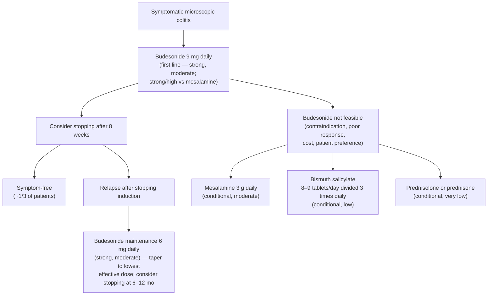

> **Histologic thresholds are not stated on this page.** Collagenous and lymphocytic colitis are separated only on biopsy, but [[aga-2016-microscopic-colitis]] addresses medical management only and explicitly does not cover diagnosis — it gives no collagen band thickness and no intraepithelial lymphocyte count. Treatment is the same for both subtypes, so the distinction does not change management.

## Contents
- [[#Assessment]]
  - [[#Establishing the Diagnosis]]
  - [[#Who to Scope — Deciding When to Look for It]]
  - [[#Classification / Typing]]
- [[#Differential Diagnosis]]
- [[#Diagnostics]]
- [[#Therapeutics]]
  - [[#Induction of Clinical Remission]]
  - [[#Maintenance of Clinical Remission]]
  - [[#Ongoing or Refractory Symptoms]]
  - [[#Recommended Against]]
- [[#See Also]]
- [[#Sources]]

## Assessment

- Microscopic colitis is a cause of **chronic watery diarrhea** caused by inflammation in the colon and **diagnosed by colonic biopsy**; it comprises two subtypes — **collagenous colitis** and **lymphocytic colitis** — distinguished only by **histology**. [[asge-2010-diarrhea]], [[aga-2016-microscopic-colitis]]
- **Predilection for age ≥60**; **female predominance in collagenous colitis**. Reported prevalence **48–219 per 100,000**. [[aga-2016-microscopic-colitis]]
- Accounts for **~10% of chronic-diarrhea referrals** [[asge-2010-diarrhea]]; occurs in **7.5% of patients undergoing evaluation for chronic diarrhea** [[aga-2016-microscopic-colitis]].
- **Not associated with increased mortality**, and there is no evidence that persistent histologic inflammation portends [[colorectal-cancer|colorectal cancer]] or need for surgery — symptoms nonetheless impair quality of life. This is why the treatment goal is **symptom relief and quality of life with minimal drug toxicity**, not histologic healing. [[aga-2016-microscopic-colitis]]

### Establishing the Diagnosis

- **The colonoscopic appearance is typically normal** — the diagnosis is histologic, so a normal-looking mucosa does **not** exclude it. [[asge-2010-diarrhea]]
- **Distribution is patchy → random biopsies of BOTH the right and left colon are required, even when the mucosa is normal.** *(ASGE Rec 2, low quality)* [[asge-2010-diarrhea]]
  - **Left-sided-only sampling (e.g. flexible sigmoidoscopy alone) can miss the diagnosis.** Sigmoidoscopy is an alternative option but may miss right-sided organic disease; in chronic diarrhea overall, **colonoscopy out-yields sigmoidoscopy 39% vs 22%** (P = .009) and is more cost-effective. [[asge-2010-diarrhea]]
  - *The counter-argument in the same guideline:* in one retrospective series of 809 patients, **>99% of abnormal pathology (and most microscopic colitis) was identifiable on distal colonic biopsies** — but multiple other studies show patchy distribution, which is why right **and** left sampling is the recommendation. [[asge-2010-diarrhea]]
- Diagnostic yield of [[colonoscopy]] in chronic diarrhea is **7–32%**; **IBD and microscopic colitis are the most common findings.** [[asge-2010-diarrhea]], [[acg-2016-acute-diarrhea]]

### Who to Scope — Deciding When to Look for It

The common indication "colonoscopy to rule out microscopic colitis" in suspected [[irritable-bowel-syndrome|IBS-D]] is **not** justified across the board; the guideline names the risk factors that do justify it. [[acg-2020-ibs]]

| | Criteria |
|---|---|
| **Higher risk of microscopic colitis → colonoscopy supported** | **Age >60**, **female sex**, and **more intense diarrhea** (all three named together) |
| **Routine colonoscopy NOT justified** | IBS symptoms **<45 years** with **no alarm features** *(conditional recommendation; low quality of evidence)* |
| **≥45 years** | A **recent negative colonoscopy** (for [[colorectal-cancer-screening\|CRC screening]] or other indication) should mitigate the need for repeat colonoscopy for IBS symptoms **in the absence of new alarm features** |

- **Symptom criteria cannot exclude it:** **32.5% of patients with microscopic colitis meet Rome criteria for IBS-D**, and others meet Rome criteria for [[disorders-of-gut-brain-interaction|functional diarrhea]]. A positive Rome-based IBS diagnosis therefore does not rule microscopic colitis out. [[acg-2020-ibs]]

### Classification / Typing

- Two subtypes — **lymphocytic** and **collagenous** colitis. **Medical management is identical:** outcomes did not differ between the subtypes in the AGA technical review, so the guideline's recommendations **do not distinguish between them**. [[aga-2016-microscopic-colitis]]

## Differential Diagnosis

*Workup: see [[chronic-diarrhea]].*

- [[inflammatory-bowel-disease|IBD]] — the other most common colonoscopic finding in chronic diarrhea ([[ulcerative-colitis]], [[crohns-disease]]). [[asge-2010-diarrhea]]
- [[celiac-disease|Celiac disease]] — the association runs **both ways**. Concurrent celiac disease and microscopic colitis are common, so in a patient with **established microscopic colitis who does not respond to treatment**, check **celiac serology and/or [[upper-endoscopy|upper endoscopy]] with proximal small-bowel biopsy** (minimum **4 duodenal biopsy specimens**). [[asge-2010-diarrhea]] Conversely, **microscopic colitis is part of the systematic workup for nonresponsive celiac disease** (persistent symptoms despite 6–12 months of a gluten-free diet). [[acg-2022-celiac]]
- [[irritable-bowel-syndrome|IBS]] — normal mucosa in both; only biopsy separates them. **Rome criteria overlap heavily** (32.5% of microscopic colitis meets Rome IBS-D criteria), so the two cannot be separated symptomatically. [[acg-2020-ibs]]
- [[small-intestinal-bacterial-overgrowth|SIBO]], [[exocrine-pancreatic-insufficiency|pancreatic insufficiency]], lactose/fructose intolerance — co-listed in the nonresponsive-celiac differential. [[acg-2022-celiac]]
- Eosinophilic gastroenteritis, Whipple's disease. [[acg-2016-acute-diarrhea]]
- **Prep- and drug-induced mimics:** sodium phosphate preps can cause mucosal changes mimicking IBD (usually distinguishable on histology); NSAIDs can cause terminal-ileal changes mimicking Crohn's. [[asge-2010-diarrhea]]

## Diagnostics

| Test | Role |
|---|---|
| **Colonoscopy with random right + left colon biopsies** | **Required** — establishes the diagnosis; patchy disease, normal-appearing mucosa *(Rec 2, low)* [[asge-2010-diarrhea]] |
| **Terminal ileum intubation** | Recommended during chronic-diarrhea colonoscopy *(Rec 3, moderate)*; routine biopsy of a normal-appearing TI is low yield (0–4.2%) [[asge-2010-diarrhea]] |
| **Flexible sigmoidoscopy alone** | Alternative, but **may miss right-sided disease** [[asge-2010-diarrhea]] |
| **Stool / laboratory testing** | First-line before endoscopy in chronic diarrhea *(Rec 1)* [[asge-2010-diarrhea]] |
| **Celiac serology ± EGD with ≥4 duodenal biopsies** | Consider in **established microscopic colitis not responding to treatment** — concurrent celiac disease is common [[asge-2010-diarrhea]] |
| **Rome symptom criteria** | **Cannot exclude the diagnosis** — 32.5% of microscopic colitis meets Rome IBS-D criteria [[acg-2020-ibs]] |
| **Biopsies if sigmoidoscopy is done instead of colonoscopy** | Take specimens from the **descending colon in addition to the rectosigmoid** — rectosigmoid specimens alone may not reveal the disease [[aga-2016-microscopic-colitis]] |
| **Follow-up colonoscopy to assess histologic response** | **Generally not necessary.** Exception: in residual symptoms after budesonide, **normal** colonic biopsies suggest coexisting IBS or celiac disease [[aga-2016-microscopic-colitis]] |

## Therapeutics

*All therapy below is from [[aga-2016-microscopic-colitis]] and applies to **symptomatic** microscopic colitis of either subtype. Strength/quality labels are the guideline's own GRADE ratings.*

### Induction of Clinical Remission

| Agent | Dose / duration | Rating | Notes |
|---|---|---|---|
| **[[corticosteroids-ibd\|Budesonide]] — first line** | **9 mg daily**; consider **cessation after 8 weeks** | **Strong, moderate** vs no treatment; **strong, high** vs mesalamine | >2× as likely to achieve clinical remission vs no treatment over an average of **7–13 days** (RR 2.52; 95% CI 1.45–4.4); nearly 2× clinical and histologic remission vs mesalamine, with **no significant difference in adverse events**. Serious adverse events low. **~1/3 remain symptom-free after stopping and need no maintenance.** Expensive — alternatives may be considered if cost decides |
| **[[mesalamine-5-asa\|Mesalamine]]** | **3 g daily** | **Conditional, moderate** | Only **when budesonide is not feasible**. Benefit uncertain (OR 0.74; 95% CI 0.44–1.24 vs no treatment, not significant). Appropriate for contraindication to, poor response to, or strong preference against budesonide. **Cost is similar to budesonide**, so cost is unlikely to be the deciding factor |
| **Bismuth salicylate** | **8–9 tablets daily, divided 3 times daily** | **Conditional, low** | Only when budesonide is not feasible. Small RCT: **7/7 responded vs 0/7** controls. Second-line alternative for contraindications to corticosteroids or when cost decides. Significant **pill burden** in older patients; long-term salicylate/bismuth toxicity unknown |
| **Prednisolone (or prednisone)** | Dose not specified by the guideline | **Conditional, very low** | Only when budesonide is not feasible. 22% response among 9 patients vs 0/3 controls. **Should not be used first line in most cases**; considerably **cheaper** than budesonide. Consider in **refractory symptoms after budesonide**, once coexisting etiologies such as celiac disease are excluded |

### Maintenance of Clinical Remission

- **Offer maintenance only to patients who relapse after stopping induction therapy** — not to everyone who responds. *(Strong, moderate)*
- **[[corticosteroids-ibd\|Budesonide]] 6 mg daily for 6 months** → **66% lower relative risk of clinical relapse** (RR 0.34; 95% CI 0.19–0.6); also maintained histologic response and quality of life.
  - Alternative dosing with similar efficacy: **3 mg daily alternating with 6 mg daily over 12 months**.
  - Maintenance may **start at 6 mg** but is commonly **tapered to the lowest effective dose** in practice.
- **Cessation of maintenance can be considered after 6–12 months.**
- **Bone health:** systemic bioavailability of budesonide is low, but **prolonged use may predispose to bone loss** — consider osteoporosis prevention and screening in anyone requiring maintenance.

### Ongoing or Refractory Symptoms

- **Reconsider the diagnosis first** — look for coexisting causes of chronic diarrhea, especially celiac disease; residual bowel symptoms may reflect coexisting or postinflammatory **functional bowel disorders** (IBS).
- **Review drug triggers** that may precipitate microscopic colitis: **NSAIDs, [[proton-pump-inhibitors|PPIs]], and SSRIs.**
- **Corticosteroid-refractory disease is not addressed by the guideline** — no trial data exist. Very limited case-series evidence suggests **[[thiopurines|azathioprine and 6-mercaptopurine]]** and **[[anti-tnf-agents|anti-TNF agents]]** may benefit these patients.
- **Untested but called for by the guideline:** trials of lower-cost options such as antidiarrheal agents (e.g. [[loperamide]]) and **cholestyramine monotherapy** — the panel makes no statement on cholestyramine alone because no trial has evaluated it.

### Recommended Against

| Intervention | Rating | Basis |
|---|---|---|
| **Cholestyramine + mesalamine** combination (vs mesalamine alone) | Conditional **against**, low | Single RCT showed no incremental clinical benefit; cholestyramine also interferes with absorption of other medications — a feasibility problem in older patients with polypharmacy |
| ***Boswellia serrata*** | Conditional **against**, low | 44% of 16 improved vs 27% of 15 on placebo (not significant); no quality-of-life difference; **adverse events more frequent**; no standardized formulation |
| **[[probiotics\|Probiotics]]** | Conditional **against**, low | Small RCT (*Lactobacillus acidophilus*, *Bifidobacterium animalis*, *lactis*) vs no treatment — uncertain benefit for remission, histologic response, and quality of life |

## See Also

[[chronic-diarrhea]], [[colonoscopy]], [[upper-endoscopy]], [[irritable-bowel-syndrome]], [[celiac-disease]], [[inflammatory-bowel-disease]], [[ulcerative-colitis]], [[crohns-disease]], [[small-intestinal-bacterial-overgrowth]], [[exocrine-pancreatic-insufficiency]], [[acute-diarrhea]], [[disorders-of-gut-brain-interaction]], [[corticosteroids-ibd]], [[mesalamine-5-asa]], [[probiotics]], [[proton-pump-inhibitors]], [[thiopurines]], [[anti-tnf-agents]], [[loperamide]], [[colorectal-cancer]]

---

## Sources

1. [[aga-2016-microscopic-colitis|AGA Institute Guideline on the Medical Management of Microscopic Colitis (2016)]]
2. [[asge-2010-diarrhea|ASGE Guideline: The Role of Endoscopy in the Management of Patients With Diarrhea (2010)]]
3. [[acg-2016-acute-diarrhea|ACG 2016: Diagnosis, Treatment, and Prevention of Acute Diarrheal Infections in Adults]]
4. [[acg-2020-ibs|ACG 2020 Clinical Guideline: Management of Irritable Bowel Syndrome]]
5. [[acg-2022-celiac|ACG 2022: Diagnosis and Management of Celiac Disease]]
