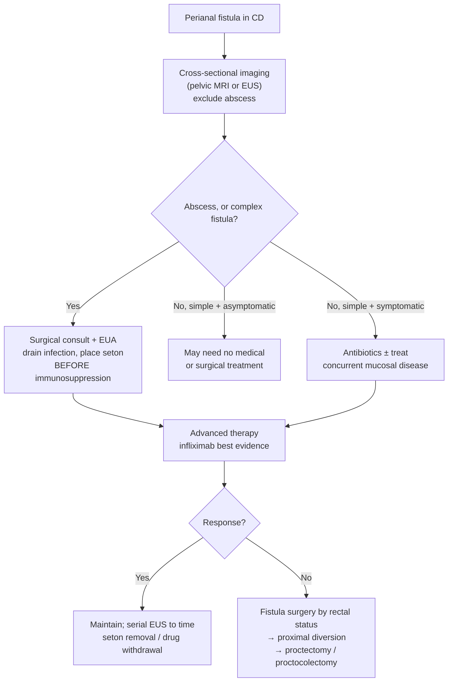

Penetrating Crohn's disease (CD) of the perianal region: a tract from the anorectum to the perineal skin, ± abscess. Fistulas occur in **~1/3 of patients with CD**, and the **perianal location is the most common**; **~25%** develop a perirectal complication (fistula and/or perirectal abscess) ([[acg-2025-crohns|American College of Gastroenterology (ACG) 2025]]). Management is **simultaneously surgical and medical** — drainage of infection comes first, advanced therapy second. Frequency, cumulative-risk and natural-history figures: [[crohns-disease|Crohn's disease → Natural History Key Facts]].

---

## Contents
- [[#Assessment]]
  - [[#Establishing the Diagnosis]]
  - [[#Severity Assessment]]
  - [[#Classification: Simple vs Complex]]
- [[#Differential Diagnosis]]
- [[#Diagnostics]]
  - [[#Perianal Imaging]]
  - [[#Examination Under Anesthesia]]
  - [[#Assessing the Rectum and Luminal Disease]]
- [[#Therapeutics]]
  - [[#Sequence]]
  - [[#Drainage and Setons]]
  - [[#Antibiotics]]
  - [[#Advanced Therapy]]
  - [[#Ineffective Drugs]]
  - [[#Fistula Surgery]]
  - [[#Refractory Disease: Diversion and Proctectomy]]
  - [[#Internal (Non-Perianal) Fistulas]]
  - [[#Treatment Targets and Monitoring]]
- [[#See Also]]
- [[#Sources]]

---

## Assessment

### Establishing the Diagnosis

- Clinical: perianal drainage, pain, induration; an actively **draining** tract defines "active" fistula in the trials ([[aga-2021-crohns-pharm|American Gastroenterological Association (AGA) 2021]]).
- **Before any advanced therapy is started, exclude a pyogenic complication (abscess) with cross-sectional imaging.** Abscess present → treat first with **drainage**, before biologic therapy or immunosuppression. Smaller abscesses may not require surgical drainage. ([[acg-2025-crohns]] key concept (KC) 50)
- Imaging of the perianal area serves two jobs: identify disease that **requires surgical intervention** to heal, and **classify** all disease present — both before and after medical therapy.
- Perianal disease can be the **first manifestation of CD**, preceding the luminal diagnosis.

### Severity Assessment

Perianal fistulizing disease is itself a **severity marker**, not a separate grading scale — no ingested source supplies a numeric perianal severity index.

| Framework | Where perianal disease sits |
|---|---|
| [[acg-2025-crohns\|ACG 2025]] severity bands | **Mild CD excludes it by definition** — mild means no severe endoscopic lesions, strictures, fistulizing **or perianal** disease. Fistulizing/perianal disease places the patient in **moderate–severe**; an abscess places the patient in **severe/fulminant** |
| ACG 2025 high-risk features (KC 7) | **Perianal/severe rectal disease** is one of the named predictors of progressive disease burden, alongside young age at diagnosis, extensive bowel involvement, ileal/ileocolonic involvement, extraintestinal manifestations at diagnosis, penetrating or stenosing phenotype |
| [[aga-2021-crohns-pharm\|AGA 2021]] contributors to severe disease | **Fistula and/or perianal abscess** listed with large/deep mucosal lesions, strictures, prior resections (especially segments >40 cm), stoma, extensive disease, anemia, elevated C-reactive protein, low albumin |

- Scoring systems for **disease activity and fibrosis** on perianal imaging exist and predict treatment outcome, but **ACG 2025 names none of them and gives no cut-points** — stratify from the anatomy (simple vs complex) and the presence of sepsis instead.

### Classification: Simple vs Complex

**This classification drives the whole pathway — treatments differ between the two categories** ([[acg-2025-crohns]]).

| | Defining criteria |
|---|---|
| **Simple** | **Distal to the dentate line** · located **primarily in the anal sphincter region** · **single tract** |
| **Complex** | **Transsphincteric, suprasphincteric, or intersphincteric** in location · **may have multiple tracts** · or involves the **anal sphincter or vagina** · or is **accompanied by an abscess** |

- **Combination rule:** an otherwise simple-looking fistula **with an abscess**, or one **involving the vagina**, is managed as **complex** — it must be drained of infection.
- **Asymptomatic simple** perianal fistulas may require **no medical or surgical treatment**.
- Pelvic sepsis from untreated fistulizing disease leads to **tissue destruction of the perianal area including the anal sphincter**, plus more extensive perineal, gynecologic and genitourinary complications — the reason drainage precedes everything.

---

## Differential Diagnosis

*Perianal drainage in a patient with CD is first sorted by **what is draining and from where**, because the answer changes the operation:*

| Entity | Distinguishing features |
|---|---|
| **Perianal/perirectal abscess** | Pyogenic collection on cross-sectional imaging; must be **drained before immunosuppression**; may coexist with a fistula and makes it complex |
| **Simple perianal fistula** | Distal to the dentate line, single tract, minimal sphincter involvement — the only group in which antibiotics are primary therapy |
| **Complex perianal fistula** | Trans-/supra-/intersphincteric, multiple tracts, sphincter or vaginal involvement, or abscess |
| **Rectovaginal fistula** | Vaginal passage of gas/stool; treated medically first, then excision + tissue interposition ± mucosal advancement flap |
| **Enterovesical / colovesical fistula** | **Recurrent symptomatic urinary tract infection (UTI)** — an indication for surgery, especially with pyelonephritis |
| **Enteroenteric fistula** | Usually asymptomatic sequela of luminal inflammation; large ones (stomach→ileum, mid/proximal small bowel→colon) cause diarrhea, malnutrition, or [[small-intestinal-bacterial-overgrowth\|small intestinal bacterial overgrowth (SIBO)]] |
| **Intra-abdominal abscess** | Suspected → cross-sectional imaging of **abdomen and pelvis**; >2 cm → antibiotics + drainage with immunosuppression held ([[acg-2025-crohns]] rec 35) |

- ACG 2025 and AGA 2021 address perianal fistula **as a complication of established CD**; neither supplies a differential for cryptoglandular or other non-Crohn's perianal fistula.

---

## Diagnostics

### Perianal Imaging

| Modality | Role | Accuracy |
|---|---|---|
| [[endoscopic-ultrasound\|Endoscopic ultrasound (EUS)]] | Characterize and classify perianal fistulizing CD; **serial EUS guides therapeutic decisions — when to remove the seton and when to discontinue medical therapy** | **>90%** accuracy for diagnosis of perianal fistulizing disease |
| Pelvic magnetic resonance imaging (MRI) | Same role — characterize perianal CD and perirectal abscesses | **Comparable** accuracy to EUS |
| Computed tomography enterography (CTE) and magnetic resonance enterography (MRE) | Detect **abscess** preoperatively | **>90%** |
| [[intestinal-ultrasound\|Intestinal ultrasound (IUS)]] | Noninvasive, radiation-free assessment of intra-abdominal complications of CD | — |
| Computed tomography (CT) | **Directs abscess drainage** preoperatively → lower rate of postdrainage complications | — |

- **ACG 2025 does not rank pelvic MRI above EUS** — it states the two have comparable accuracy and offers either (KC 33). [[asge-2015-ibd|ASGE 2015]] *suggests* EUS for characterizing and managing fistulous perianal CD **in conjunction with other imaging modalities** *(low quality)*.
- Intra-abdominal abscess suspected → **cross-sectional imaging of the abdomen and pelvis** ([[acg-2025-crohns]] KC 34).

### Examination Under Anesthesia

- **Symptomatic or complex fistulae → surgical consultation for examination under anesthesia (EUA)**, which may be needed for **surgical drainage, fistula surgery, and/or seton placement, before initiation of advanced therapy** ([[acg-2025-crohns]]).
- EUA classifies the tract, drains sepsis, and establishes drainage with a seton in one setting.

### Assessing the Rectum and Luminal Disease

- **The presence or absence of active mucosal involvement in the rectum decides the operation** (see [[#Fistula Surgery]]) — document rectal mucosal status before referring for fistulotomy or a flap.
- Luminal disease is assessed and treated concurrently; antibiotic therapy for simple perianal fistula is given **with treatment of concurrent mucosal disease**.

---

## Therapeutics

### Sequence

### Drainage and Setons

- **Any fistula with an abscess, and any complex fistula (anal sphincter, vagina, or multiple tracts), should be drained of infection.** ([[acg-2025-crohns]])
- **Setons are the most common method** — they allow continued drainage of infection from the inflammatory fistula tracts, and **should be placed before initiation of immunosuppression** (KC 50: to facilitate drainage and **increase treatment effectiveness**).
- **Seton + infliximab** demonstrates, versus either alone: better overall **fistula healing response**, **longer duration of fistula closure**, **prevention of repeated abscess**, and **lower overall fistula recurrence rate**.
- AGA 2021 explicitly **excluded surgical management from its scope** — the drainage/seton guidance is ACG 2025's.

### Antibiotics

| Drug | Dose | Duration |
|---|---|---|
| Metronidazole | **10–20 mg/kg/day by mouth (PO)** | **4–8 weeks** |
| Ciprofloxacin | **500 mg PO twice daily** | **4–8 weeks** |
| Levofloxacin | **500–750 mg PO once daily** | **4–8 weeks** |

- **As primary therapy — simple fistulas only.** Antibiotics may be used for **simple, superficial perianal fistulas with minimal penetration of sphincter musculature**, together with treatment of concurrent mucosal disease. Imidazoles can be considered as primary therapy for simple perianal fistulas ([[acg-2025-crohns]] KC 49).
- **As an adjunct — add to an anti–tumor necrosis factor (TNF) agent.** ACG 2025 rec 26 *suggests* **antibiotics combined with infliximab or adalimumab to improve clinical response** in perianal fistulizing CD *(conditional, very low)*. Antibiotics also treat the **pelvic sepsis** associated with more complex fistulas.
- **Antibiotics rarely replace the need for surgical drainage when an abscess is present.**
- **Evidence:** two randomized controlled trials (RCTs) of an anti-TNF agent (infliximab or adalimumab) **plus ciprofloxacin for 12 weeks** were significantly more effective than the anti-TNF alone for fistula closure over 12–18 weeks — **relative risk (RR) 0.42 (95% confidence interval [CI] 0.26–0.68)**. Antibiotic **monotherapy** was tested in a single 3-arm RCT of 25 patients (ciprofloxacin vs metronidazole vs placebo) and did not beat placebo for induction of fistula remission — **RR 0.94 (0.67–1.33)**. ([[aga-2021-crohns-pharm]])
- ⚠ **The two guidelines differ in force here.** AGA 2021 rec 11 **recommends** biologic + antibiotic over biologic alone *(strong, moderate certainty)* and rec 10C **suggests against antibiotics alone** in fistula without abscess *(conditional, low)*. ACG 2025, newer, downgrades the combination to a **suggestion** *(conditional, very low)* and **permits imidazole monotherapy for simple fistulas**. ACG 2025's positions are the ones stated above.

### Advanced Therapy

**Do not start before infection is drained.**

| Agent | [[acg-2025-crohns\|ACG 2025]] — induction of remission of perianal fistulizing CD | [[aga-2021-crohns-pharm\|AGA 2021]] |
|---|---|---|
| **Infliximab** | **Recommend** (rec 24) — **strong, moderate** level of evidence | **Recommend** over no treatment for **induction *and* maintenance** of fistula remission (rec 10A) — **strong, moderate** certainty |
| Adalimumab | *Suggest* (rec 25) — conditional, **low** | *Suggest* over no treatment for induction **or** maintenance (rec 10B) — conditional, low |
| [[vedolizumab]] | *Suggest* (rec 27) — conditional, **very low** | *Suggest* (rec 10B) — conditional, low |
| Ustekinumab ([[il-23-and-il-12-23-inhibitors\|anti-interleukin (IL)-12/23]]) | *Suggest* (rec 28) — conditional, **very low** | *Suggest* (rec 10B) — conditional, low |
| Upadacitinib ([[jak-inhibitors\|Janus kinase (JAK) inhibitor]]) | *Suggest* (rec 29) — conditional, **very low** | Not addressed (predates the drug's CD indication) |
| Certolizumab pegol | **Not recommended for perianal fistula** — ACG 2025 *suggests infliximab over certolizumab pegol*, on systematic review and network meta-analysis showing it is **not as effective as infliximab** | Rec 10B comment: evidence suggests it **may not be effective** for induction of fistula remission |

**Infliximab dosing in the fistula trials** ([[acg-2025-crohns]]):

- **Induction: 5 mg/kg at weeks 0, 2, and 6** → complete cessation of drainage from perianal fistulae in most patients in the initial RCT.
- **Maintenance: 5 mg/kg every 8 weeks** — confirmed in a subsequent large RCT for **maintenance of complete closure and of response**.
- Infliximab may also maintain response of **rectovaginal** fistula closure.
- Full dosing/route/biosimilar/immunogenicity parameters: [[anti-tnf-agents]].

**What the trial evidence actually shows** ([[aga-2021-crohns-pharm]] — fistula-closure RR, <1 favors drug):

| Agent | Evidence base | Fistula closure | Certainty |
|---|---|---|---|
| Infliximab | **Only drug with a dedicated fistula RCT** — 94 patients with symptomatic draining fistula, closure within 18 wk | **RR 0.52 (0.34–0.78)** | Moderate |
| Adalimumab | Subgroup of 2 RCTs, 77 patients; complete closure within 4 wk | RR 1.08 (0.93–1.27) — **not effective** | — |
| Certolizumab pegol | Subgroup of 2 RCTs, 165 patients | RR 1.01 (0.80–1.27) — no benefit | Very low |
| Vedolizumab | Subgroup of a single RCT, 165 patients, within 14 wk | RR 0.81 (0.63–1.04) | Very low |
| Ustekinumab | Pooled analysis, 4 induction trials, 238 patients | RR 0.85 (0.73–1.99) | Low |

- Adalimumab is nevertheless *suggested* on **indirect** evidence of luminal efficacy; in ACG 2025's reading, a meta-analysis of published studies supports adalimumab for fistulizing CD, and fistula response/remission was met as a **secondary** endpoint in a large adalimumab maintenance trial. **Perianal fistula closure was not a primary endpoint of any adalimumab or certolizumab pegol study.**
- **Vedolizumab:** the ENTERPRISE phase-4 trial enrolled 32 patients with moderate-to-severe active CD and ≥1 actively draining fistula — **>64% achieved fistula closure and 46% had reduced fistula drainage by week 30**.
- **Upadacitinib:** post hoc analysis of the CD trials — more upadacitinib-treated patients had **cessation of drainage and fistula closure** during induction and maintenance versus placebo.
- **Ustekinumab and certolizumab pegol:** efficacy suggested only by post hoc analysis; **no controlled study shows unequivocal benefit** in fistulizing CD.
- **Maintenance data for the biologics in fistulizing disease are limited**, and **[[thiopurines|thiopurine]] data were too limited for AGA 2021 to make any recommendation** — a genuine evidence gap, not a negative recommendation.
- **Neither guideline addresses local mesenchymal stem cell therapy for perianal fistula.**
- Where mucosal involvement of the rectum is present, ACG 2025 pairs a seton with **concomitant initiation of an advanced therapy — vedolizumab, anti-ILs, anti-TNF-α agents, or JAK inhibitors, with the best evidence supporting infliximab**.

### Ineffective Drugs

- **[[mesalamine-5-asa|Mesalamine]] and [[corticosteroids-ibd|corticosteroids]] are ineffective treatments for fistulizing CD.** ([[acg-2025-crohns]])

### Fistula Surgery

**The rectum decides the operation** ([[acg-2025-crohns]]):

| Rectal mucosa | Fistula | Approach |
|---|---|---|
| **No active mucosal involvement** | **Simple** | May respond well to **fistulotomy or mucosal advancement flap surgery** |
| **Active mucosal involvement** | Any | **Seton rather than fistulotomy**, with **concomitant initiation of advanced therapy** |

- **Surgical advancement flaps improve long-term healing rates in combination with an anti-TNF agent.**

### Refractory Disease: Diversion and Proctectomy

- **Significant refractory disease → proximal diversion** may be necessary to include rectal and/or perianal healing. After diversion, **initiating a new therapy such as an anti-TNF ± an immunomodulator may promote healing of the perineal disease**.
- ⚠ **A systematic review suggests the long-term success of a diverting ostomy for perianal CD is very low** — counsel accordingly.
- **Very severe scenarios → proctectomy or total proctocolectomy with a permanent stoma** ([[ostomy-management|stoma care]]).

### Internal (Non-Perianal) Fistulas

*AGA 2021 restricted itself to perianal fistula: drug-therapy data for other fistula types were almost entirely lacking. The guidance below is ACG 2025's.*

- **Internal fistulas remain more difficult to treat.** Limited clinical trial data exist; most derive from the early infliximab studies including the ACCENT II trial, which included patients with **rectovaginal** fistulae.
- **Infliximab with or without an immunomodulator tends to be recommended as the initial treatment approach before surgery.** The goal of medical therapy is to **heal the inflamed bowel mucosa and thereby enable surgical intervention**.
- **Rectovaginal:** surgical options include excision of the fistula and interposition of healthy tissue between rectum and vagina. **Any active infection must be treated and resolved before attempting repair.** After fistula excision, a mucosal advancement flap can then be performed.
- **Enterovesical / colovesical:** **recurrent symptomatic UTI is an indication for surgery**, especially if associated with pyelonephritis. Surgery usually involves **resection of involved inflamed bowel and closure of the bladder defect**.
- **Enteroenteric:** generally asymptomatic, forming as sequelae of luminal inflammatory activity, and typically **do not require surgical management**. Larger symptomatic internal fistulas (e.g., stomach to ileum; mid or proximal small bowel to colon) can cause **diarrhea, malnutrition, or SIBO** and may need nutritional support ([[nutrition-in-ibd]]) plus medical and surgical intervention.
- **High-output fistula typically mandates surgical intervention** — proximal bowel diversion, bowel segment resection, or surgical fistula closure. Historically these **do not close spontaneously with medical therapy**.
- **Intra-abdominal abscess >2 cm:** antibiotics **plus** a drainage procedure, with **immunosuppression held until drainage is achieved**, radiographically or surgically *(conditional, low — [[acg-2025-crohns]] rec 35)*. Patients who develop an abdominal abscess should undergo **surgical resection**, although some respond to medical therapy after radiologically guided drainage (KC 59).

### Treatment Targets and Monitoring

- **Fistula response = >50% closure on clinical assessment**; the maintenance endpoint in the pivotal infliximab trial was **maintenance of complete closure and of response** ([[acg-2025-crohns]]).
- **With standard medical therapy there is a high relapse rate of fistulous drainage** — plan for maintenance, not a course.
- **Serial EUS examinations may be used to guide therapeutic intervention, including seton removal and discontinuation of medical therapy.**
- **Do not treat to an anti-TNF trough target for fistula healing.** Higher anti-tumor necrosis factor (anti-TNF) drug levels are *suggested* to associate with better fistula-healing rates across numerous trials, but the quality is limited by subjective outcomes and observational design, and **there are no high-quality interventional data** ([[acg-2025-crohns]]). The general loss-of-response trough targets — a separate question — live on [[anti-tnf-agents]].
- Neither guideline sets a numeric perianal imaging target or a surveillance interval for repeat perianal imaging.

---

## See Also

[[crohns-disease]], [[inflammatory-bowel-disease]], [[ulcerative-colitis]], [[endoscopic-ultrasound]], [[intestinal-ultrasound]], [[anti-tnf-agents]], [[vedolizumab]], [[il-23-and-il-12-23-inhibitors]], [[jak-inhibitors]], [[thiopurines]], [[mesalamine-5-asa]], [[corticosteroids-ibd]], [[therapeutic-drug-monitoring-ibd]], [[ostomy-management]], [[nutrition-in-ibd]], [[small-intestinal-bacterial-overgrowth]], [[ibd-pain-management]], [[treat-to-target-ibd]]

---

## Sources

1. [[acg-2025-crohns|ACG 2025: Management of Crohn's Disease in Adults]]
2. [[aga-2021-crohns-pharm|AGA Clinical Practice Guidelines on the Medical Management of Moderate to Severe Luminal and Perianal Fistulizing Crohn's Disease (2021)]]
3. [[asge-2015-ibd|ASGE Guideline: The Role of Endoscopy in Inflammatory Bowel Disease (2015)]]
