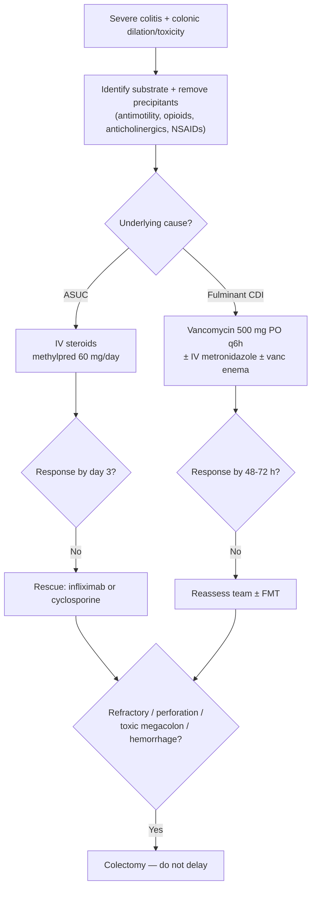

Life-threatening total or segmental **colonic dilation with systemic toxicity**, complicating severe colitis — most often fulminant [[clostridioides-difficile|C. difficile]] infection or acute severe [[ulcerative-colitis]] (ASUC) (also [[crohns-disease|Crohn's]] colitis, [[colon-ischemia|ischemic]], and other infectious colitis). A **surgical emergency**: toxic megacolon, colonic perforation, severe refractory hemorrhage, or failure of maximal medical therapy are indications for [[ulcerative-colitis|colectomy]]. Occurs in <5% of ASUC.

## Contents
- [[#Assessment]]
  - [[#Establishing the Diagnosis]]
  - [[#Severity Assessment]]
- [[#Differential Diagnosis]]
- [[#Diagnostics]]
- [[#Therapeutics]]

## Assessment

### Establishing the Diagnosis

Toxic megacolon = **colonic dilation + systemic toxicity** in a patient with severe colitis. Diagnosis is clinical + radiographic; assess the underlying colitis in parallel.

- **Assess actively.** All ASUC patients should be assessed for the presence of toxic megacolon during admission (ACG UC key concept). In fulminant [[clostridioides-difficile|CDI]], maintain a **low threshold for cross-sectional imaging** to assess colitis severity and **rule out megacolon or perforation**.
- **Radiographic dilation (decision-critical):** on plain abdominal film, colonic dilation defined as **transverse colon diameter > 5.5 cm** predicts a worse outcome (ACG UC).
  - Other severe-colitis film features: thickened colonic wall, loss of haustration, mucosal islands (edematous mucosa surrounded by ulceration), and **≥3 dilated gas-filled small-bowel loops** (high likelihood of medical-therapy nonresponse and colectomy).
- **Systemic toxicity** — the same signs that define severe/fulminant colitis (see Severity Assessment): tachycardia, fever, anemia, elevated inflammatory markers; in fulminant CDI, hypotension/shock or ileus.
- **Physical exam:** abdominal distension, tenderness, rebound, guarding, tympany, ileus.

> **Decision gap flagged:** neither ingested source (ACG 2025 UC, ACG 2021 C. difficile) states a formal consensus/Jalan diagnostic criteria set for toxic megacolon (e.g. colonic dilation ≥6 cm *plus* a defined number of systemic toxicity criteria). The **> 5.5 cm transverse-colon** figure above is presented by ACG UC as a poor-outcome predictor in severe colitis, not as an explicit toxic-megacolon cut-point. The classic ≥6 cm threshold is **not** in an ingested source and is deliberately not supplied here — flag for a dedicated source.

### Severity Assessment

Toxic megacolon sits at the severe end of two underlying-disease severity frameworks. Identify and grade the substrate:

**Acute severe UC (ASUC) — definition (ACG UC):**
- **≥6 bowel movements/day** PLUS **≥1 systemic sign of toxicity:**

| Systemic toxicity sign | Threshold |
|---|---|
| Tachycardia | present |
| Fever | present (temp > 38 °C predicts steroid failure) |
| Anemia | hemoglobin < 10.5 g/dL |
| Elevated inflammatory markers | ESR > 30 mm/hr |

- ASUC substrate for toxic megacolon corresponds to the **Fulminant** column of the ACG UC Activity Index (>10 stools/day, continuous bleeding, transfusion-requiring anemia, [[ibd-endoscopic-scoring|MES]] 3, UCEIS 7–8) — see [[ulcerative-colitis]].

**CDI severity (ACG C. difficile):**

| Class | Criteria |
|---|---|
| Non-severe | neither WBC ≥15,000/mm³ nor Cr >1.5 mg/dL |
| Severe | WBC ≥15,000/mm³ **OR** serum Cr >1.5 mg/dL |
| Fulminant | severe CDI criteria **PLUS** hypotension/shock **OR** ileus **OR** megacolon |

- **Toxic megacolon is the "megacolon" limb that upgrades severe CDI to fulminant CDI.**

**Predictors of steroid failure / colectomy in ASUC** (drive escalation timing):
- **Oxford (Travis) index** — the most widely recognized: on **day 3 of IV corticosteroids**, **>8 bowel movements**, *or* **3–8 BM together with CRP >45 mg/L** → colectomy in **85%**. For contrast, colectomy occurred in **40%** of partial responders and **5%** of complete responders.
- **Ho index:** integrates BM frequency + colonic dilation + hypoalbuminemia. *(Component point values / colectomy-risk cut-point are not reproduced in the ingested sources — flagged, not filled.)*
- Additional: **ESR >75 mm/hr**, **temp >38 °C**, hypoalbuminemia, **UCEIS ≥7** (higher PPV for colectomy than MES 3), deep colonic ulceration on endoscopy.

## Differential Diagnosis

*Workup of the presenting acute severe/bloody diarrheal illness: see [[acute-diarrhea]]. No diagnostic schema is specific to colonic dilation with toxicity — the rest of the workup follows the underlying colitis.*

Underlying etiologies of toxic megacolon named in ingested sources:
- Acute severe [[ulcerative-colitis]] / [[inflammatory-bowel-disease|IBD]] flare
- [[crohns-disease|Crohn's]] colitis
- Fulminant [[clostridioides-difficile|C. difficile]] infection
- Other infectious colitis
- [[colon-ischemia|Ischemic colitis]]
- **Superimposed infection to exclude:** CDI (test all ASUC) and **CMV colitis** (biopsy at endoscopy; affects up to a third of steroid-refractory ASUC).

**Precipitants to identify and remove:** antimotility agents ([[loperamide]] — retained toxin is the theoretical mechanism; the patients who died or had complications were given antimotility agents **alone, without an appropriate antibiotic**. Avoid in **untreated** CDI and in **fulminant** infection; once anti-CDI therapy is running they can be used safely as needed), opioids and anticholinergics (may precipitate colonic dilation and toxicity; associated with infection and mortality), and NSAIDs (linked to IBD hospitalizations and relapse in up to a third of patients — avoid in ASUC).

## Diagnostics

- **Plain abdominal radiograph** — first-line for dilation: transverse colon >5.5 cm, thickened wall, loss of haustration, mucosal islands, ≥3 dilated gas-filled small-bowel loops.
- **Cross-sectional CT** — restrict to suspected extraluminal complication or perforation, and newly diagnosed patients where CD vs UC is unclear; low threshold in fulminant CDI to rule out megacolon/perforation.
- **Endoscopy** — **flexible sigmoidoscopy within 72 h (preferably 24 h)** of admission, minimal insufflation by an experienced operator, to grade inflammation and biopsy for CMV. **Avoid full [[colonoscopy]]** in severe inflammation — associated with higher rates of colonic dilation and perforation.
- **Labs:** CBC (WBC ≥15,000 = severe CDI; anemia Hgb <10.5), serum creatinine (>1.5 = severe CDI), **albumin** (hypoalbuminemia predicts steroid failure; <2.5 g/dL → intensify infliximab), CRP and ESR.
- **C. difficile testing** in all ASUC — two-step algorithm (NAAT/GDH → toxin EIA); UC + CDI carries 4-fold higher mortality and higher colectomy rates.

## Therapeutics

**Supportive (all causes):**
- Multidisciplinary team — critical care, GI, ID, with **early surgical involvement**; ICU monitoring; aggressive **volume resuscitation** and electrolyte correction, attention to renal function/urine output.
- **Pharmacologic DVT prophylaxis** (LMWH) in ASUC — safe even with active UC bleeding.
- **Stop precipitants:** antimotility agents, opioids, anticholinergics, NSAIDs.
- **No routine broad-spectrum antibiotics** in ASUC (no benefit in RCTs; raises CDI risk) — restrict to suspected extraluminal complication/systemic toxicity. **No TPN / bowel rest** (no benefit); encourage enteral nutrition unless toxicity/surgery imminent.

**ASUC substrate:**
- **IV corticosteroids:** methylprednisolone 60 mg/day **OR** hydrocortisone 100 mg TID–QID.
- **Day-3 assessment:** if inadequate response, **rescue with infliximab or cyclosporine**. Choice by provider experience, prior immunomodulator/anti-TNF failure, and albumin; if albumin <2.5 g/dL, consider infliximab **dose intensification (10 mg/kg)**. Insufficient data to use tofacitinib/upadacitinib after IVCS or infliximab failure in ASUC.
- Treat **CMV colitis** if identified in refractory disease — ganciclovir **IV then oral, 14-day course** (response ~**70%**); **valganciclovir** may be appropriate in selected patients. Do **not** withhold colitis therapy while treating CMV, and **do not defer colectomy** to complete the antiviral course in nonresponders.

**Fulminant CDI substrate:**
- **Vancomycin 500 mg PO q6h** × first 48–72 h; if improving, step down to **125 mg q6h × additional 10 days**.
- **Add IV metronidazole 500 mg q8h** (conditional) — particularly if ileus impairs oral drug delivery.
- **If ileus: add vancomycin enemas 500 mg in 100 mL saline q6h** (conditional).
- Reassess at 48–72 h with the multidisciplinary team if no improvement.
- **[[fmt|FMT]]** for severe/fulminant CDI **refractory to antibiotic therapy**, particularly in **poor surgical candidates** *(strong recommendation, low quality)* — sequential protocol until pseudomembrane resolution.
- **No routine role** for adjunctive IV immunoglobulin or bedside PEG colonic lavage; fidaxomicin has no data in fulminant CDI.

**Surgery — indications (do not delay; delayed surgery → poor outcomes):**
- **Toxic megacolon, colonic perforation, severe refractory hemorrhage, or medical refractoriness** (ACG UC key concept 54); multiorgan dysfunction.
- Fulminant CDI failing/unresponsive to maximal medical therapy.
- Infliximab/cyclosporine exposure does **not** increase postoperative complications — do not defer needed surgery on that basis.

**Surgical procedure:**
- **ASUC:** subtotal or total colectomy with [[ostomy-management|end ileostomy]] is the preferred operation.
- **Fulminant CDI:** total colectomy with end ileostomy + stapled rectal stump, **OR** diverting loop ileostomy with **antegrade colonic lavage (8 L PEG via the distal limb)** + **intraluminal vancomycin × 10 days postoperatively** — choice per clinical circumstances, surgical tolerance, and surgeon judgment.
  - **Avoid partial colectomy** — 16% reoperation rate for persistent sepsis requiring further resection. Total colectomy carried a mortality OR of **0.7** (0.49–0.99) vs continued medical therapy; the loop-ileostomy approach reported lower mortality than historical total-colectomy controls (**19% vs 50%**).
  - Postoperative mortality after total colectomy is higher in patients who preoperatively have **acute renal failure, vasopressor requirement, or mechanical ventilation** — an argument for operating *before* those develop.

## See Also

[[ulcerative-colitis]], [[crohns-disease]], [[clostridioides-difficile]], [[colon-ischemia]], [[inflammatory-bowel-disease]], [[colonoscopy]], [[diverticulitis]], [[ibd-endoscopic-scoring]], [[ostomy-management]], [[fmt]], [[loperamide]], [[acute-diarrhea]]

---

## Sources

1. [[acg-2025-uc|ACG 2025: Ulcerative Colitis in Adults (Guideline Update)]]
2. [[acg-2021-cdiff|ACG Clinical Guideline: Prevention, Diagnosis, and Treatment of Clostridioides difficile Infections (2021)]]
