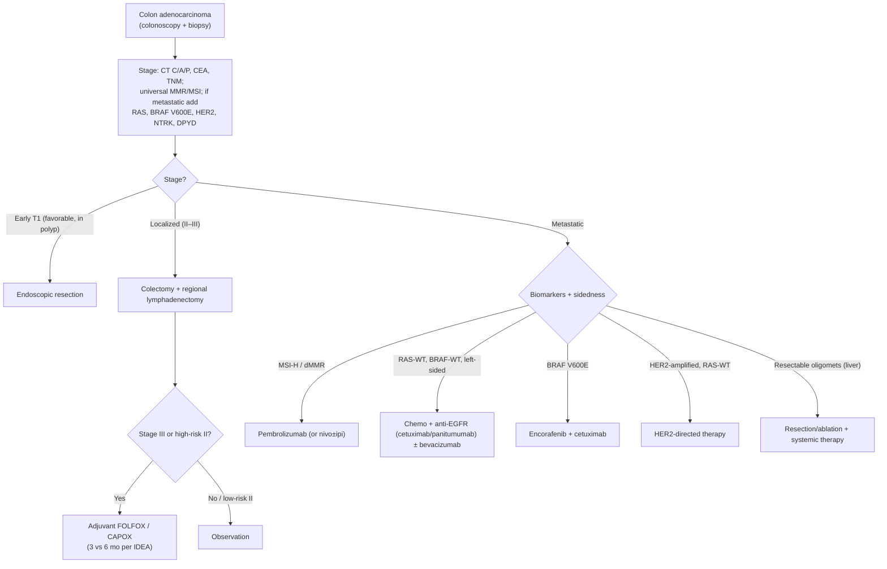

*Screening is covered in [[colorectal-cancer-screening]] and in detail below (FIT). Hereditary syndromes: [[lynch-syndrome]], [[familial-adenomatous-polyposis]], [[peutz-jeghers-syndrome]], [[juvenile-polyposis-syndrome]], [[cowden-syndrome]], [[serrated-polyposis-syndrome]]. Polyp management: [[polypectomy-emr]] and [[colonoscopy]].*

## Assessment

### Establishing the Diagnosis

- [[colonoscopy|Colonoscopy]] with biopsy is the diagnostic standard
- CT C/A/P + CEA for staging
- MRI pelvis + [[endoscopic-ultrasound|EUS]] for rectal cancer local staging

### Severity Assessment / Staging

- TNM 8th edition
- Stage I–IV; LN status drives adjuvant therapy

## Differential Diagnosis

- [[inflammatory-bowel-disease|IBD]]-associated dysplasia, large adenoma, [[gastroenteropancreatic-neuroendocrine-tumors|neuroendocrine tumor]], lymphoma, anal canal SCC, metastatic disease

## Diagnostics

- [[colonoscopy|Colonoscopy]], biopsy, CT, MRI rectum, CEA, MMR/MSI testing (Lynch screen), BRAF/KRAS/NRAS for metastatic

## Therapeutics

- Surgery (segmental resection, TME for rectal), endoscopic resection for early CRC (T1)
- Adjuvant chemo (FOLFOX/CAPOX) for stage III, high-risk stage II
- Neoadjuvant chemoradiation or total neoadjuvant therapy (TNT) for locally advanced rectal cancer
- Metastatic: FOLFOX/FOLFIRI ± bevacizumab/cetuximab; immunotherapy for MSI-H

### Oncologic Management (NCCN 2026)

Per [[nccn-2026-colon-cancer]]. **Universal MMR/MSI testing** is recommended for all colon cancers (Lynch screening — see [[lynch-syndrome]] — and immunotherapy candidacy). For metastatic disease, profile **RAS (KRAS/NRAS), BRAF V600E, HER2 (ERBB2), and NTRK**; **DPYD** testing informs fluoropyrimidine toxicity risk before treatment.

**Localized disease** is treated with endoscopic resection (selected favorable T1 cancers) or colectomy with regional lymphadenectomy (≥12 nodes for adequate staging). **Adjuvant FOLFOX or CAPOX** is given for stage III and high-risk stage II disease, with duration (3 vs 6 months) **risk-stratified per IDEA**; MSI-H stage II tumors generally do not benefit from single-agent fluoropyrimidine.

**Metastatic therapy is biomarker- and sidedness-directed:**

- **Anti-EGFR (cetuximab/panitumumab)** only for **RAS-wild-type, BRAF-wild-type, left-sided** primaries.
- **Bevacizumab** added to chemotherapy backbones broadly.
- **BRAF V600E** → **encorafenib + cetuximab**.
- **MSI-H/dMMR** → **pembrolizumab** first-line (or nivolumab ± ipilimumab).
- **HER2-amplified, RAS-wild-type** → HER2-directed therapy (trastuzumab + tucatinib/pertuzumab, or trastuzumab deruxtecan).
- **KRAS G12C** → G12C inhibitor (adagrasib/sotorasib) + anti-EGFR in later lines.
- **Resectable oligometastatic disease** (especially liver-limited) → curative-intent resection/ablation integrated with systemic therapy.



*Algorithm — NCCN colon cancer management, recreated in original form (not an NCCN figure). ([[nccn-2026-colon-cancer]])*

### Endoscopic Staging & Management (ASGE 2013)

[[asge-2013-crc-staging-management]] — endoscopic-specific guidance, complementary to NCCN.

- **EUS for rectal staging:** preoperative locoregional [[endoscopic-ultrasound|EUS]] guides therapy. T-staging sensitivity 80–96%, specificity 75–98% (T0–T3); T-accuracy generally higher than other cross-sectional imaging. Nodal staging modest (67% sens, 78% spec) — not significantly better than CT/MRI. EUS-FNA samples suspicious perirectal nodes. Goal: separate T1–2N0 from T3/N1–2 (latter gets chemoradiation).
- **Malignant polyp — endoscopic vs surgical:**
  - **Endoscopic** management for pedunculated polyps with cancer confined to submucosa of polyp/stalk **and favorable histology**.
  - **Surgery** for any malignant polyp with **unfavorable histology**, for sessile/flat neoplasia with submucosal invasion, or for sessile/flat lesions found malignant after **piecemeal** resection (if surgical candidate).
  - Attempt EMR only if complete resection is anticipated (see [[polypectomy-emr]]).
  - **Early (T1) CRC, AGA 2025:** suspected T1 CRC should be removed **en bloc** ([[endoscopic-submucosal-dissection|ESD]] preferred; eFTR for select <2 cm with deep SMI). For high-risk T1 CRC surgery is standard, but >80% have no LNM at surgery — individualize against operative morbidity; deep submucosal invasion *as a solitary feature* carries only ~2.6% LNM risk. Detailed criteria, LNM data, and post-resection surveillance: [[polypectomy-emr]].
- **Malignant colonic obstruction:** endoscopic options are SEMS, tumor debulking, or decompression tube. Colonic SEMS as **bridge to surgery** → single-stage elective surgery succeeds in 60–85%. SEMS major adverse events: obstruction, migration, perforation. Obtain early surgical consultation even after successful decompression; avoid endoscopy with peritoneal signs or suspected perforation.

---

## Post-Resection Surveillance

[[usmstf-2015-crc-surveillance]]

> Applies to TNM stages I–III (curative-intent resection). Hereditary syndromes ([[lynch-syndrome]], [[familial-adenomatous-polyposis]], [[serrated-polyposis-syndrome]]) follow their own surveillance intervals — these recommendations do not apply to them.

### Epidemiology of Post-Resection Risk

- Up to 40% of patients with locoregional CRC develop recurrent cancer; 90% occur within 5 years
- Cumulative incidence of metachronous CRC: ~0.3–0.35%/year, lifelong
- ~30% of metachronous cancers occur within 2 years of surgery
- In a Netherlands registry study (n=5,157 CRC patients), metachronous cancers attributed to: missed lesions 43%, nonadherence 43%, incomplete resection 5.4%, de novo only 5.4%
- Surveillance colonoscopy associated with improved overall survival (OR=0.73, Cochrane meta-analysis; HR=0.75, 11-RCT meta-analysis) but NOT improved cancer-specific mortality
- Increased intensity of colonoscopy frequency does not improve survival beyond the standard schedule and may increase harm

### Universal Lynch Syndrome Testing

- Per USMSTF 2014 and confirmed in this guideline: all CRCs should be studied for evidence of [[lynch-syndrome]] (MMR/MSI tumor testing)
- Patients with known or suspected [[lynch-syndrome|Lynch syndrome]] must follow Lynch-specific surveillance intervals, not those below

### Step 1 — Perioperative Clearing Colonoscopy

**Strong recommendation, low-quality evidence** [[usmstf-2015-crc-surveillance]]

- Perform a **high-quality colonoscopy preoperatively** whenever feasible
- If colonoscopy is incomplete due to **malignant obstruction**, defer to **3–6 months postoperatively** (3-month lower limit allows postoperative recovery)
- Goals: (1) detect synchronous cancers (prevalence 0.7–7%); (2) detect and completely resect precancerous polyps
- For obstructive CRC precluding complete colonoscopy: use **CT colonography (CTC)** as the best alternative; double-contrast barium enema is acceptable if CTC unavailable (*Strong recommendation, moderate-quality evidence*)
  - However, choose colonoscopy (not CTC) for the first **postoperative** examination in cases where CTC was used perioperatively — CTC misses flat, diminutive, and serrated lesions that may be clinically significant in CRC patients
- **[[serrated-polyposis-syndrome|Serrated polyposis syndrome]] (SPS):** Actively consider this diagnosis when multiple and/or large serrated lesions are found — [[serrated-polyposis-syndrome]] requires more frequent colonoscopy intervals

### Step 2 — First Postoperative Surveillance Colonoscopy

**Strong recommendation, low-quality evidence** [[usmstf-2015-crc-surveillance]]

- **1 year after surgery** (or 1 year after the perioperative clearing colonoscopy, whichever is later)
- Applies to both colon and rectal cancer

### Step 3 — Subsequent Surveillance Intervals

**Strong recommendation, low-quality evidence** [[usmstf-2015-crc-surveillance]]

| Timepoint | Interval from Surgery | Notes |
|---|---|---|
| 1st surveillance | **1 year** after surgery or perioperative colonoscopy | |
| 2nd surveillance | **3 years** after surgery (4 years from perioperative scope) | If 1-year exam negative |
| 3rd surveillance | **5 years** later (9 years from surgery) | If 2nd exam negative |
| Subsequent | **Every 5 years** | Until benefit outweighed by diminished life expectancy |

- If **neoplastic polyps detected** at any examination: shorten interval per published post-polypectomy guidelines (see [[colonoscopy]])
- Surveillance continues lifelong or until age/comorbidity outweigh benefit
- **These intervals do not apply to patients with [[lynch-syndrome]]**

### Post-Resection Surveillance Summary Schedule

```
Perioperative clearing colonoscopy
    ↓  (1 year)
Year 1 surveillance colonoscopy
    ↓  (3 years, i.e., 4 years from surgery)
Year 4 surveillance colonoscopy
    ↓  (5 years, i.e., 9 years from surgery)
Year 9 surveillance colonoscopy
    ↓  (every 5 years thereafter)
Lifelong q5y until benefit < risk
```

### Additional Considerations for Rectal Cancer

**Weak recommendation, low-quality evidence** [[usmstf-2015-crc-surveillance]]

**Rectal cancer has higher propensity for local recurrence than colon cancer.** >80% of anastomotic recurrences in compiled studies involved rectal or distal colon cancer.

**High-risk patients** — those meeting ANY of the following criteria are at increased risk for local recurrence:

1. Surgery **without** total mesorectal excision (TME)
2. Transanal local excision (transanal excision or transanal endoscopic microsurgery / TEM)
3. Endoscopic submucosal dissection (ESD) for rectal cancer
4. Locally advanced rectal cancer that did **not** receive neoadjuvant chemoradiation + TME

**For high-risk rectal patients:** Local surveillance with **flexible sigmoidoscopy or EUS every 3–6 months for the first 2–3 years after surgery**, in addition to the standard colonoscopic surveillance schedule above.

- EUS can detect extraluminal recurrence before intraluminal endoscopic findings; allows FNA of suspicious nodes/lesions; ~10% of rectal cancer recurrences are diagnosed by EUS only
- No RCTs compare sigmoidoscopy vs. EUS or determine ideal intervals
- Optimal luminal surveillance requires multidisciplinary collaboration (GI, colorectal surgery, oncology)

### Fecal Testing in Post-Resection Surveillance

**Insufficient evidence statement** [[usmstf-2015-crc-surveillance]]

- **Do not recommend routine use of FIT or fecal DNA** for surveillance after CRC resection (insufficient evidence)
- FIT showed earlier detection in one study (n=1,736) but applicability to post-resection surveillance unclear
- Fecal DNA abnormalities clear from stool after resection; role in post-CRC surveillance not yet investigated

---

## FIT Screening for CRC — Primary Screening (Average-Risk)

[[usmstf-2016-fit-screening]] | [[acg-2021-crc-screening]]

> This section covers FIT as a primary screening modality for average-risk individuals. For post-polypectomy and post-resection surveillance, see above.

### Overview and Rationale

Fecal immunochemical tests (FITs) measure human hemoglobin directly in stool using antibodies against the globin moiety. Unlike guaiac-based FOBT (gFOBT), FIT:

- Is not confounded by dietary peroxidase activity — **no dietary restriction required** (Strong; Moderate)
- Requires fewer samples (typically 1 vs. 3 for gFOBT)
- Has superior sensitivity for CRC and advanced neoplasia
- Has superior adherence (~20% higher participation than gFOBT in RCTs and meta-analyses)

Both ACG 2021 and USMSTF 2021 position annual FIT as a **co-equal preferred non-invasive screening modality** alongside colonoscopy. [[acg-2021-crc-screening]]

### FIT Performance Characteristics — Single Application

**For CRC (meta-analysis of 19 studies, asymptomatic average-risk adults):** [[usmstf-2016-fit-screening]]

- Pooled sensitivity: **~79%** (95% CI, 0.69–0.86)
- Pooled specificity: **~94%** (95% CI, 0.92–0.95)
- With colonoscopy as reference standard only: sensitivity 77%, specificity 94%
- OC FIT CHEK (large US study, n=9,989): sensitivity 74%, specificity 96%

**For advanced adenoma (single application):** [[usmstf-2016-fit-screening]]

- Sensitivity: **~20–30%** across studies (range 6–56% depending on brand and cut-off)
- Specificity: **~94–97%** for commonly used cut-offs
- Implication: single-application FIT is a poor screen for advanced adenomas; repeated annual application is required to meaningfully accumulate detection of precancerous lesions

**Summary from USMSTF 2016:** "With 1-time application, FIT tests are approximately 80% sensitive for cancer detection and approximately 20–30% sensitive for advanced neoplasia detection. To enhance advanced adenoma detection, repeated applications of FIT are required." — **Strong recommendation; moderate-quality evidence.**

### Threshold (Hemoglobin Cut-off Value)

| Cut-off range | Effect on sensitivity (CRC) | Effect on specificity | Positivity rate (1-sample) |
|---|---|---|---|
| <20 µg Hgb/g feces | 0.86 (95% CI, 0.75–0.92) | 0.91 (0.89–0.93) | 5.3–14.2% |
| 20–50 µg/g | Intermediate | Intermediate | 1.4–7.5% |
| >50 µg/g | 0.67 (95% CI, 0.59–0.74) | 0.96 (0.94–0.98) | Lower |

- **Task Force favors cut-off ≤20 µg/g** as best combination of sensitivity and specificity — **Weak recommendation; low-quality evidence** [[usmstf-2016-fit-screening]]
- The 20 µg/g threshold is also the threshold of the most commonly available US quantitative FIT (OC-Sensor Diana / OC-Auto Micro 80, Polymedco)
- Individuals with fecal hemoglobin >177 µg/g are ~4x more likely to harbor advanced neoplasia (OR 3.80; 95% CI, 3.07–4.71)

### Qualitative vs. Quantitative FIT

- **Quantitative FIT preferred** over qualitative — **Weak recommendation; low-quality evidence** [[usmstf-2016-fit-screening]]
- Rationale: automated reading, adjustable thresholds, better quality control
- Pooled sensitivity: quantitative 77% vs. qualitative 85% for CRC; specificity similar (~94% both)
- FDA-cleared quantitative systems in the US (as of 2016): OC-Auto Micro 80, OC-Sensor Diana (Polymedco), i-Chroma (Boditech)

### Number of Samples

- **1-sample annual approach is suggested** — **Weak recommendation; low-quality evidence** [[usmstf-2016-fit-screening]]
- 2-sample FIT associated with higher advanced neoplasia detection in some studies (4.1% vs. 3.1%), but 1-sample is simpler and cost-effectiveness modeling (MISCAN-Colon) favored 1-sample annually
- Pooled sensitivities for CRC: 1-sample 0.79, 2-sample 0.77, 3-sample 0.80 — no meaningful difference by sample number

### Interval

- **Annual** — consistent with gFOBT RCT data demonstrating mortality reduction with annual (not biennial) screening
- Programmatic annual gFOBT reduces CRC-related mortality by up to 33%
- Optimal interval for FIT not established by RCT; annual interval recommended by analogy and cost-effectiveness modeling

### FIT vs. gFOBT

- FIT superior to gFOBT for both CRC detection and advanced neoplasia detection — **Strong recommendation; high-quality evidence** [[usmstf-2016-fit-screening]]
- Meta-analysis: adherence RR 1.16 (95% CI, 1.03–1.30); advanced neoplasia detection RR 2.28 (95% CI, 1.68–3.10)
- FIT sensitivity for CRC ~2x gFOBT (73.3% vs. 33.3%) with similar specificity (>95%)

### Follow-up of a Positive FIT

- **Colonoscopy is the recommended test for follow-up of a positive FIT** in screen-eligible individuals — **Strong recommendation; moderate-quality evidence** [[usmstf-2016-fit-screening]]
- CT colonography and colon [[capsule-endoscopy|capsule endoscopy]] have been evaluated but have limitations (sensitivity, specificity, and access issues)
- **A positive FIT + negative colonoscopy should NOT prompt upper GI evaluation** in the absence of signs/symptoms of upper GI pathology or iron-deficiency anemia — **Weak recommendation; very low quality evidence**
- **A positive FIT in a patient with a recent negative colonoscopy** (before due for repeat): generally offer repeat colonoscopy — **Weak recommendation; low-quality evidence**
- PPV for cancer from positive FIT: 2.9–7.8% (range across programs, round 1); PPV for advanced neoplasia: 33–54% (round 1)

### Practical Considerations

| Issue | Recommendation | Strength | Evidence |
|---|---|---|---|
| Dietary/medication adjustment | Not required — instruct patients explicitly | Strong | Moderate |
| Sample collection | Spontaneously passed stool; NOT in-office DRE sample | Weak | Very Low |
| Sample return time | Up to 10 days does not significantly affect performance; encourage return within 24h | Weak | Very Low |
| Ambient temperature during mailing | Need not adjust distribution/mailing based on temperature | Weak | Low |
| Seasonal timing | No strong evidence of clinically meaningful seasonal effect; adhere to manufacturer storage specs | Weak | Low |

### Programmatic Quality Targets (USMSTF 2016)

| Metric | Target |
|---|---|
| FIT completion rate among those offered testing | ≥60% |
| Proportion of returned FITs unprocessable by lab | <5% |
| Colonoscopy completion rate for FIT-positive individuals | ≥80% |
| ADR on follow-up colonoscopy (using ≤20 µg/g threshold) | >45% in men; >35% in women |

*Note: ADR targets for FIT-positive colonoscopies are higher than the general screening ADR benchmarks (≥25% overall per ACG 2021) because the pre-test probability of adenoma is enriched in FIT-positive individuals.*

### Conflict with 2021 Guidelines

The ACG 2021 and USMSTF 2021 guidelines do not supersede the FIT-specific operational guidance in this 2016 document. Where the guidelines differ on topics covered by both:

- **Screening start age:** Use 2021 values (age 45–50; see [[colorectal-cancer-screening]])
- **Modality ranking:** 2021 guidelines position colonoscopy and FIT as co-equal preferred options; 2016 document predates this framing but is consistent with it
- **FIT performance data, cut-off recommendations, programmatic quality targets:** 2016 document remains the primary source — no conflicting 2021 data on these specific points

## See Also

[[colorectal-cancer-screening]], [[colonoscopy]], [[polypectomy-emr]], [[lynch-syndrome]], [[familial-adenomatous-polyposis]], [[serrated-polyposis-syndrome]], [[endoscopic-ultrasound]], [[colonoscopy-surveillance]], [[inflammatory-bowel-disease]], [[gastroenteropancreatic-neuroendocrine-tumors]], [[endoscopic-submucosal-dissection]], [[capsule-endoscopy]]

---

## Sources

1. [[acg-2015-hereditary-gi-cancer|ACG 2015: Genetic Testing and Management of Hereditary Gastrointestinal Cancer Syndromes]]
2. [[usmstf-2015-crc-surveillance|USMSTF 2015: Colonoscopy Surveillance after Colorectal Cancer Resection]]
3. [[usmstf-2016-fit-screening|USMSTF 2016 — Recommendations on Fecal Immunochemical Testing to Screen for Colorectal Neoplasia]]
4. [[acg-2021-crc-screening|ACG 2021 Colorectal Cancer Screening Guidelines]]
5. [[nccn-2026-colon-cancer|NCCN Clinical Practice Guidelines in Oncology: Colon Cancer (Version 2.2026)]]
6. [[asge-2013-crc-staging-management|ASGE 2013: Role of Endoscopy in the Staging and Management of Colorectal Cancer]]
7. [[aga-2025-endoscopic-resection-crc|AGA Clinical Practice Update on Endoscopic Resection for Early Colorectal Cancer: Commentary (2025)]]
