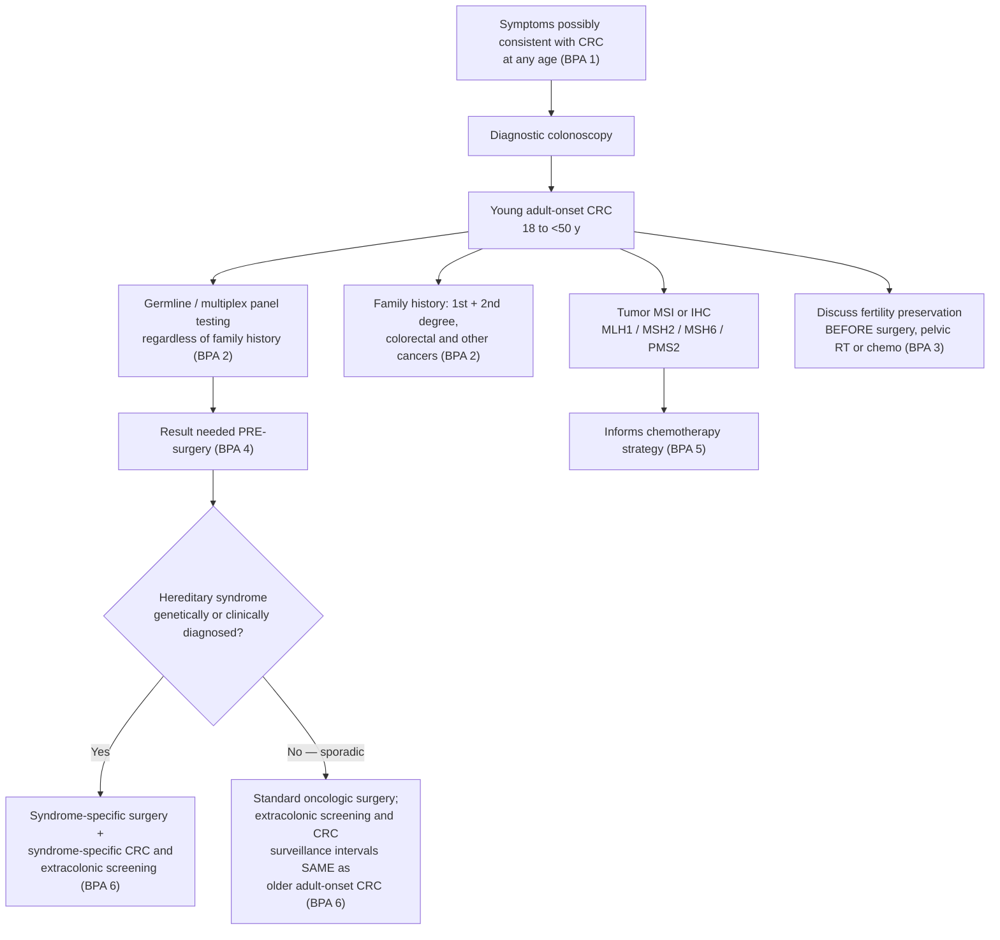

*Defined by [[aga-2020-young-adult-onset-crc|AGA 2020]] as **CRC diagnosed in individuals 18 – <50 years of age**. This page carries only what is **specific to young onset**: the symptom-triggered diagnostic rule, the germline-testing yield and timing, fertility preservation, and the surveillance de-escalation. Shared staging, oncologic therapy, and post-resection surveillance intervals live on [[colorectal-cancer]]; the average-risk **screening start age** is a separate question, settled on [[colorectal-cancer-screening]].*

## Contents
- [[#Assessment]]
  - [[#Establishing the Diagnosis]]
  - [[#Severity Assessment]]
  - [[#Classification / Typing]]
- [[#Differential Diagnosis]]
- [[#Diagnostics]]
  - [[#Tumor Testing — Universal MSI / IHC]]
  - [[#Family History (BPA 2)]]
  - [[#Germline Testing — Who, Which Route, and When]]
  - [[#Molecular Features]]
- [[#Therapeutics]]
  - [[#Surgical Management]]
  - [[#Chemotherapy — What Not to Escalate]]
  - [[#Fertility Preservation (BPA 3)]]
  - [[#Post-Treatment Surveillance (BPA 6)]]
  - [[#Survivorship]]
- [[#Epidemiology and Risk Factors]]
  - [[#Incidence]]
  - [[#Racial and Ethnic Differences]]
  - [[#Risk Factors]]
- [[#Text-Extraction Caveats]]
- [[#See Also]]
- [[#Sources]]

---

## Assessment

### Establishing the Diagnosis

**The operative rule is diagnostic, not a screening rule.** [[aga-2020-young-adult-onset-crc|AGA 2020]] **BPA 1**: with the rising incidence of CRC before 50 years of age, **diagnostic evaluation of the colon and rectum is encouraged for all patients, irrespective of age**, who present with symptoms that may be consistent with CRC — *"including but not limited to"*:

| Symptom prompting diagnostic colon/rectal evaluation at any age |
|---|
| Rectal bleeding |
| Weight loss |
| Change in bowel habit |
| Abdominal pain |
| [[iron-deficiency-anemia\|Iron deficiency anemia]] |

The CPU states the principle plainly: *"The signs and symptoms that prompt health care providers to consider a diagnostic colon exam for a person over 50 should prompt a diagnostic [[colonoscopy|colonoscopy]] exam for the person <50 years of age."*

**Why this rule exists — the diagnosis is late:**

- **70% of sporadic young adult–onset CRC patients have no family history of CRC** → not eligible for high-risk screening → **the majority present with symptoms**.
- **Diagnosis is delayed an average of 6 months** vs older patients. Contributors named by the CPU: low patient awareness of alarm symptoms; **low clinical suspicion by health care providers**; inadequate or absent health care access.
- CRC is *"often clinically silent in its earliest stages"* regardless of age of onset.

> ⚠ **Do not read BPA 1 as a screening statement.** It governs the **symptomatic** young adult. Screening of *asymptomatic* adults under 50 was, at the time of this CPU, not recommended in the US outside known hereditary syndromes — and the 45-vs-50 start age is settled by newer tier-1 sources on [[colorectal-cancer-screening]], not here.

### Severity Assessment

Staging itself is TNM — see [[colorectal-cancer]]. What differs in young onset is **stage at presentation** and **histology**:

| Feature | Young adult–onset | Older adult–onset |
|---|---|---|
| **Stage III or IV at presentation**, patients <50 y | **61%** | ~50% |
| **Stage III or IV at presentation**, patients <30 y | **76%** | ~50% |
| **Signet ring cell histology** | at least **3%–13%** ⚠ | **<1%** of all CRC |
| Differentiation | More likely **poorly differentiated** | — |
| Site | More likely **distal colon and rectum** | — |

- Signet ring cell histology is most likely to be present in the **youngest** patients (the CPU's age qualifier is **30 years of age**, with the comparison operator lost in text extraction — see [[#Text-Extraction Caveats]]).

### Classification / Typing

**The clinically operative split is sporadic vs hereditary** — it determines the surgical option (BPA 4), the chemotherapy strategy (BPA 5), and the entire surveillance plan (BPA 6).

| | Share of young adult–onset CRC | What it changes |
|---|---|---|
| **Germline pathogenic mutation** (hereditary) | **~20%** — *"roughly 1 in 5"* | Syndrome-specific surgery; syndrome-specific CRC **and** extracolonic surveillance |
| — of which **[[lynch-syndrome\|Lynch syndrome]]** | **about half** of the germline-positive group | Most common hereditary cause |
| **Sporadic** | **~80%** | Standard oncologic surgery; **surveillance identical to older-onset CRC** |

**Hereditary syndromes that cause young adult–onset CRC** (as characterized in this CPU; gene-specific lifetime cancer risks, surveillance ages/intervals and prophylactic-surgery options are tabulated once, on [[aga-2020-young-adult-onset-crc|the source page's Table 1]] — not repeated here):

| Syndrome | Gene(s) / inheritance | Feature that identifies it |
|---|---|---|
| **[[lynch-syndrome\|Lynch syndrome]]** | MMR genes; autosomal dominant | Most common cause; MSI CRC; ↑ endometrial, gastric, ovarian, small bowel, renal pelvis, ureteral cancer |
| **[[familial-adenomatous-polyposis\|FAP]]**, classic | *APC*; autosomal dominant | Second most common hereditary cause; **hundreds to thousands** of adenomas; **nearly 100% CRC risk by 40 years of age** without prophylactic total colectomy/proctocolectomy |
| **FAP, attenuated** | *APC*; autosomal dominant | **<100 polyps**; lower risk for, and later age of onset of, CRC |
| **[[mutyh-associated-polyposis\|MYH-associated polyposis (MAP)]]** | *MUTYH*; autosomal **recessive** | Clinically resembles attenuated FAP — homozygous base-excision-repair loss may lead to *APC* mutations |
| **NTHL1-associated polyposis (NAP)** | *NTHL1*; autosomal recessive | Polyp onset typically **in the 40s**, burden generally **under 50 polyps**, but cancer risk significantly increased with **most CRC arising under 60 years of age** |
| **Polymerase proofreading–associated polyposis (PAPP)** | *POLE*, *POLD1*; autosomal dominant | Young adult–onset CRC and polyposis — **may arise even in the absence of polyposis** |
| **Familial CRC syndrome X** | none identified | Meets Amsterdam or Bethesda criteria but **no germline MMR mutation**. ⚠ In one young adult–onset series meeting **Amsterdam II** criteria without Lynch syndrome, **60% had germline *[[brca-pathogenic-variants\|BRCA2]]* mutations** |

---

## Differential Diagnosis

*Workup of the presenting symptom: see [[acute-lower-gi-bleeding]] for rectal bleeding and [[colorectal-polyposis]] for a young patient found to have multiple polyps.*

- [[colorectal-cancer|Older adult–onset CRC]] — same tumour, different pre-test probability, different surveillance obligations (BPA 6)
- [[lynch-syndrome]] and the polyposis syndromes above — must be actively excluded, not assumed absent
- [[inflammatory-bowel-disease|IBD]] — both a **risk factor** for young adult–onset CRC and a cause of overlapping symptoms (rectal bleeding, change in bowel habit)
- [[hemorrhoids]] — the benign attribution that drives the 6-month diagnostic delay when rectal bleeding in a young adult is not investigated

---

## Diagnostics

### Tumor Testing — Universal MSI / IHC

- **Tumor testing for MSI, or IHC for MLH1, MSH2, MSH6 and PMS2, should be done on all young adult–onset CRC** as a screen for [[lynch-syndrome|Lynch syndrome]].
- The CPU extends the same requirement to **all CRC regardless of age of onset**; that statement and its two rationales (prognostic in stage I–II, predictive of immunotherapy response in stage IV) are held once, on [[colorectal-cancer]] → *Universal Lynch Syndrome Testing*.
- **Nothing about being under 50 relaxes this** — the 20% germline yield below is the reason it matters most here.

### Family History (BPA 2)

- Obtain family history of **colorectal *and other* cancers** in **first- *and* second-degree relatives**. Both the degree range and the inclusion of extracolonic cancers are the point.
- The CPU names the failure mode: *"subpar family history ascertainment including failure to inquire about family history of extracolonic cancers and age of cancer onset"* limits early recognition of at-risk individuals.

### Germline Testing — Who, Which Route, and When

- **Who: all of them.** BPA 2 asks clinicians to discuss genetic evaluation with germline genetic testing **regardless of family history** — justified by the 20% germline yield.
- **Which route — two acceptable options, and the CPU does not pick one:**

| Route | Basis for selection | Best suited to |
|---|---|---|
| **Targeted** genes by phenotype | NCCN-outlined features: family history of hereditary CRC, other cancer syndromes, the patient's **polyp burden and histology** | Patients who clearly fit one syndrome |
| **Multiplex gene panel** (direct germline testing) | No phenotypic gating | Patients who **do not fit clinical criteria for one** hereditary syndrome, whose criteria **fit more than one** syndrome, or who have **no or a limited family history** of cancer |

  - ⚠ **The trade-off is explicit:** testing more genes increases the chance of finding **variants of unknown significance**, or a pathogenic variant with **no clear management guideline** — which *"may lead to confusion for the patient and the provider."* Hence *"early integration of genetic counselors and genetic specialists."*
  - Data on universal genetic testing in CRC are **limited**; the argument for broader panels is extrapolated from breast, pancreas and prostate cancer, where guideline-based testing has been shown to under-detect.
- **When — this is BPA 4 and it is a timing rule: the pre-surgical period.** Results are needed **before the operation** because *"surgical options vary depending upon the presence and type of known hereditary syndrome."* A germline result returned post-operatively cannot change the operation that was already performed.

### Molecular Features

- Compared with older adult–onset distal colon and rectal cancers (350-tumor series), young adult–onset tumors showed **high frequencies of somatic mutations in histone modifier genes**, **higher tumor mutation burden**, and a **greater proportion of MSI**.
- **Deficient MMR** arises either from germline mutation in *MLH1*, *MSH2*, *MSH6* or *PMS2* (= Lynch syndrome) or from **promoter hypermethylation — most commonly *MLH1* — seen in up to 20% of sporadic colon cancers**.
- **MACS** (microsatellite and chromosome stable) — deficient-MMR tumours are typically chromosomally stable; of microsatellite-stable CRCs, roughly half are chromosomally unstable and half are MACS. MACS tumours often arise in the **distal colon and rectum** and are **less immunogenic** (fewer tumour-infiltrating lymphocytes). Young adults with MACS CRC **may be more likely to have a family history of CRC** without an identified genetic cause.
- **Less frequent** in young adult–onset CRC: **BRAF V600E** and **APC** mutations. **More frequent**: somatic *MYCBP2*, *BRCA2*, *PHLPP1*, *TOPORS*, *ATR*; and **LINE-1 hypomethylation**.
- **Consensus molecular subtyping (CMS)** — patients **40 years of age** and under ⚠ are more likely to have **CMS1 (MSI/immune)** or **CMS2 (canonical APC/β-catenin)** than CMS3 (metabolic) or CMS4 (mesenchymal). CMS is prognostic for overall and progression-free survival and **predictive of chemotherapy response and survival benefit in stage III**.

---

## Therapeutics

> **There are no consensus guidelines** for the surgical and chemotherapeutic management of young adult–onset CRC arising **outside** a known hereditary condition. The CPU says so directly — recommendations *"vary, and there are no consensus guidelines currently available."* Treat any young-onset-specific protocol claim as unsupported.

*Pathway assembled from the text of Best Practice Advice 1–6 of [[aga-2020-young-adult-onset-crc]].*

> ⚠ **This pathway is assembled from the advice-statement text, not reproduced from the CPU's own figure.** The CPU's **Figure 1, "Management of young adult–onset colorectal cancer patients"** (p. 2419), is not shown here; any branch or ordering that exists only inside Figure 1 is missing from this page.

### Surgical Management

- **In syndromic patients**, surgery *"not only treats the index CRC, but also considers prevention of other syndromic malignancies."*
  - Pre-operative assessment = **stage-appropriate clinical staging of the index CRC** *plus* **comprehensive screening of other organs at high risk of malignancy** from the underlying syndrome.
  - Syndrome-specific operations (ileorectostomy, IPAA colectomy, prophylactic hysterectomy, etc.) and their triggers are tabulated on [[aga-2020-young-adult-onset-crc|the source page's Table 1]]; for Lynch specifically, the operative decision is developed on [[lynch-syndrome]].
- **In sporadic young adult–onset CRC — do not escalate.** *"More aggressive surgery to extend surgical resection beyond standard oncological guidelines… was not recommended because of the potential risk for overtreatment."*

### Chemotherapy — What Not to Escalate

| Question | What the CPU states |
|---|---|
| **Adjuvant chemo for stage I–II?** | Young patients are **more likely to receive it**, but survival for stage I–II young adult–onset CRC *"was not better than that of stage-matched older-onset CRC patients who did not receive chemotherapy"* — and only **slightly improved for stage III and IV** |
| **Adjuvant chemo for MSI stage II?** | **Recommended against.** Multiple studies show a more favourable prognosis for MSI tumours among stage II and III cases; *"this recommendation still applies to young-onset CRC patients"* |
| **Oxaliplatin duration** | Classical **6 months** limited to **larger primaries (T4)** and **abundant nodal involvement (N2)**; **3 months** for the rest of stage III, because of **high rates of neuropathy** |
| **More intensive chemotherapy generally?** | **Not recommended** — risk of overtreatment. Side effects weigh more heavily in a young population with *"potential longer impacts upon their quality of life"* |
| **Role of genetic results** | **BPA 5** — use **germline *and* somatic** genetic testing results to inform chemotherapeutic strategy; choice of chemotherapy is influenced by somatic mutations characteristic of some hereditary syndromes |

- ⚠ **Countervailing data, reported in the same CPU:** another study found young adult–onset patients were more likely to have **>12 lymph nodes examined**, to **receive systemic therapy (chemotherapy or immunotherapy) within 6 months of diagnosis**, and to have a **reduced risk of CRC-specific death** compared with older-onset CRC. The CPU presents both findings without reconciling them.

### Fertility Preservation (BPA 3)

**BPA 3: present the role of fertility preservation *prior to* cancer-directed therapy — surgery, pelvic radiation, *or* chemotherapy.** The discussion must happen before any of the three, not before chemotherapy alone.

- **Surgery for CRC does not appear to negatively impact fertility** on current evidence.
- **Chemotherapy carries a moderate risk of impaired fertility**, dependent on **type, dose and duration** — this is what warrants the discussion.

| | Options named by the CPU |
|---|---|
| **Men** | **Cryopreserved sperm banking** before gonadotoxic chemotherapy — recommended, but **not universally offered** to cancer patients |
| **Women** | **Embryo cryopreservation** — the **most established** option |
| | **Unfertilized oocyte cryopreservation** — for women **without a partner**, who do not want donor sperm, or whose beliefs do not allow freezing of embryos |
| | **Ovarian tissue cryopreservation with later transplantation** — ⚠ **not yet approved beyond use in clinical trials**, but has the potential to restore fertility **even in young girls who have not yet ovulated** |
| | **Ovarian translocation away from radiation fields** |
| | **GnRH agonist** to prevent chemotherapy-induced ovarian failure |

*The last two are named as "2 more components of a complete discussion about fertility preservation."*

### Post-Treatment Surveillance (BPA 6)

**BPA 6 is a de-escalation — young age is not itself a reason to surveil more intensively.**

| Patient | CRC surveillance | Extracolonic screening |
|---|---|---|
| **Genetically or clinically diagnosed hereditary CRC syndrome** | **Syndrome-specific** | **Syndrome-specific** — offered **only** to this group |
| **Sporadic young adult–onset CRC** | **Same intervals as older adult–onset CRC** → see [[colorectal-cancer]] post-resection surveillance and [[colonoscopy-surveillance]] | **Same as older adult–onset CRC** |

### Survivorship

- Because more young adult–onset patients present with **stage III/IV disease requiring multimodality therapy**, they *"likely face higher risks for long-term treatment-related sequelae."*
- Even long-term survivors face **ongoing functional deficits and symptoms**, and have **disproportionately reported worse anxiety, body image, and embarrassment with bowel movements**.
- Survivorship needs therefore **differ from older-onset patients and require long-term attention** — the one domain in which the CPU asks for *more*, not less.

---

## Epidemiology and Risk Factors

### Incidence

- **US incidence rose 51%** in people **18 to <50 years of age** over the past 30 years; over the same period incidence in **older-onset CRC fell 20%** and its **mortality fell 34%**.
- Young adult–onset CRC incidence **9.2–12.2 per 100,000**, vs **40 per 100,000** for people **50 years of age** and over ⚠.
- **11% of colon cancers and 18% of rectal cancers** occur in young adults; projected to **1 in 10 colon and 1 in 5 rectal cancers by 2030**.
- **75% of young adult–onset CRC currently arises in people 40 to <50 years of age** — even though projections put the steepest *future* increases in ages **18–34**.
- Significantly more likely to arise in the **rectum and distal colon** than the proximal colon; **rectal and distal colon tumours account for the overall rise**.
- The **inflection point** — young rising, old falling — occurred in the **1990s**, coincident with adoption of average-risk CRC screening.
- **Global.** Across 36 countries (2008–2012) incidence rose in **19** (range **3.5/100,000 in India to 12.9/100,000 in Korea**) and fell in only **3** — Italy, Austria, Lithuania — **2 of which endorse CRC screening beginning in the fourth decade** (**44 years of age in Italy**, **40 years of age in Austria**).

### Racial and Ethnic Differences

*Reported as observed disparities in the CPU's own categories; no mechanism is offered.*

| Group | Finding |
|---|---|
| **Non-Hispanic White (NHW)** | **Largest relative increase** in incidence 2000–2014 (**47%**), largely attributable to rectal cancer (**2.7 → 4.5 per 100,000**, 2000–2010) |
| **African American (AA), not classified by Hispanic ethnicity** | **Highest overall incidence (12.7 per 100,000** vs **11.0** for NHW) and highest incidence of **both distal and proximal** colon cancer; rectal cancer rose only **3.4 → 4 per 100,000**. In the **40 to <50 y** band: **29 vs 23 per 100,000** (AA vs NHW) |
| **AA survival** | Lower overall survival, higher cancer-specific death — **HR 1.35 colon**, **1.51 rectal/rectosigmoid**. Proximal colon survival improved for NHW (**50%** in 1992–1996 → **70%** in 2010–2014) but **stayed at 55% and did not improve** for AA individuals. Stage IV overall survival poorer in AA individuals. Young-onset **rectal** cancer survival was *similar* between AA and NHW, due to significant survival gains in both Hispanic and non-Hispanic AA individuals |
| **Hispanic** | Incidence rising **15% annually** in the **20–29 y** band; present on average **10 years earlier** than NHW individuals; overall survival **not significantly different** from NHW |

### Risk Factors

**Established associations:**

- **[[inflammatory-bowel-disease|IBD]]**
- Harbouring a **pathogenic germline mutation** for a known hereditary cancer syndrome
- **History of irradiation**

**Family history — the numbers that make the history worth taking:**

| Family history | Odds ratio for young adult–onset CRC |
|---|---|
| Any **first-degree relative** with CRC | **4.50** |
| **Sibling** with CRC | **11.68** (highest) |
| **Parent** with CRC | **3.75** |

**Environmental and behavioural associations** (named as *likely to relate*, in the context of high-income and transitioning economies adopting a Westernised lifestyle):

- Higher-calorie, **meat-predominant**, **lower fruit- and vegetable-based** diet
- Higher **body mass index**
- **Decreased activity level**
- **Excessive sedentary time** measured as hours of television watching — **particularly for rectal cancer**
- ⚠ **Site-specific caveat:** high BMI **in childhood or young adulthood** is associated with increased **colon** cancer risk **but not rectal** cancer risk.

---

## Operator Caveats

Three comparison operators in the source are marked ⚠ above because the exact operator could not be confirmed from the article text; the intended operator is inferred from context. Verify against the published article before relying on the exact operator:

| Location on this page | As read | Almost certainly |
|---|---|---|
| Signet ring cell histology, age qualifier | `CRC patients 30 years of age` | `≤30 years of age` |
| CMS1/CMS2 subtype association, age qualifier | `CRC patients 40 years of age` | `≤40 years of age` |
| Comparator incidence denominator | `40 per 100,000 for people 50 years of age` | `≥50 years of age` |

The inference is grammatical: each affected phrase is incomplete without an operator (*"most likely to be present in CRC patients __ 30 years of age"*), while `<` appears intact elsewhere (`<50`, `<30`, `<1%`, `<100 polyps`).

The signet-ring proportion is rendered here as **3%–13%**; two cells of the source's Table 1 carry the same uncertainty — see [[aga-2020-young-adult-onset-crc|the source page]].

The **definition itself** is not in doubt: *"CRC diagnosed in individuals 18 - <50 years of age."*

---

## See Also

[[colorectal-cancer]], [[colorectal-cancer-screening]], [[lynch-syndrome]], [[familial-adenomatous-polyposis]], [[mutyh-associated-polyposis]], [[peutz-jeghers-syndrome]], [[juvenile-polyposis-syndrome]], [[serrated-polyposis-syndrome]], [[colorectal-polyposis]], [[brca-pathogenic-variants]], [[colonoscopy]], [[colonoscopy-surveillance]], [[acute-lower-gi-bleeding]], [[iron-deficiency-anemia]], [[inflammatory-bowel-disease]], [[hemorrhoids]]

---

## Sources

1. [[aga-2020-young-adult-onset-crc|AGA 2020 Clinical Practice Update: Young Adult–Onset Colorectal Cancer Diagnosis and Management]]
