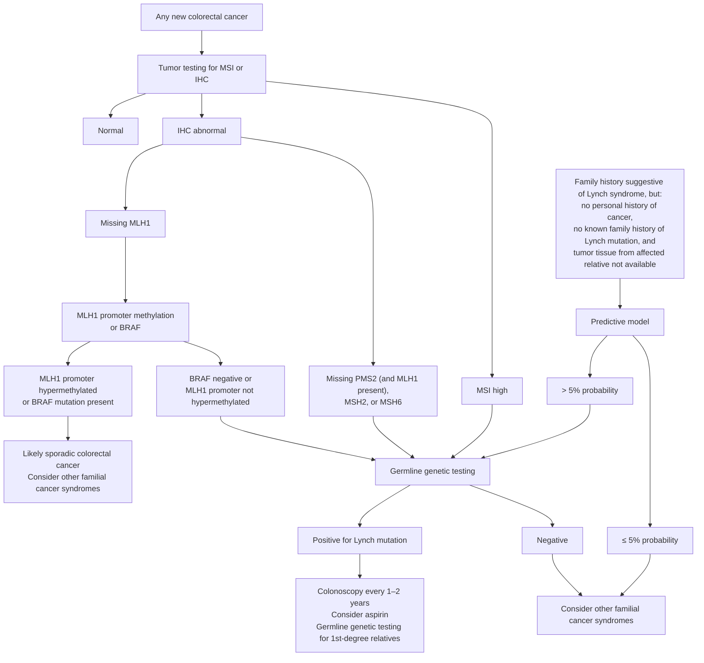

## Contents
- [[#Assessment]]
  - [[#Establishing the Diagnosis]]
  - [[#Severity Assessment]]
  - [[#Classification / Typing]]
- [[#Differential Diagnosis]]
- [[#Diagnostics]]
  - [[#Tumor Testing]]
  - [[#Germline Testing]]
  - [[#Relevant Risk Prediction Tools]]
- [[#Therapeutics]]
  - [[#Colorectal Cancer Surveillance and Prevention]]
  - [[#Extracolonic Cancer Surveillance]]
  - [[#Chemoprevention]]
  - [[#Advanced/Metastatic Disease]]
  - [[#Genetic Counseling]]
- [[#See Also]]
- [[#Sources]]

## Assessment

### Establishing the Diagnosis

Lynch syndrome (LS), formerly hereditary nonpolyposis [[colorectal-cancer|colorectal cancer]] (HNPCC), is the most common hereditary CRC syndrome. It is an autosomal-dominant condition caused by pathogenic germline variants in the DNA mismatch repair (MMR) genes: **MLH1**, **MSH2**, **MSH6**, **PMS2**, or the MSH2-inactivating **EPCAM** deletion.

- Accounts for **2–3%** of all CRC; estimated general-population prevalence **1 in 440** [[aga-2015-lynch-syndrome]] (2–4% and ~1 in 279 per [[usmstf-2014-lynch-syndrome]]; 1–3% per [[acg-2015-hereditary-gi-cancer]]). Frequently underdiagnosed
- Lifetime cumulative incidence **up to 80% for CRC** and **up to 60% for endometrial cancer**, plus excess stomach, small intestine, pancreas, biliary tract, ovary, urinary tract, and brain cancer [[aga-2015-lynch-syndrome]]. Gene-specific figures under [[#Severity Assessment]]

**Universal tumor screening of every newly diagnosed CRC** — *Strong recommendation, moderate quality of evidence* [[aga-2015-lynch-syndrome]]; concordant in [[acg-2015-hereditary-gi-cancer]] and [[usmstf-2014-lynch-syndrome]]:

- **IHC or MSI — either is acceptable.** AGA 2015 makes **no recommendation** between IHC, MSI, or both: sensitivities and specificities are comparable, so the choice follows local expertise and availability. ACG/USMSTF favor **IHC** as the first test — see [[#Tumor Testing]]
- **Test elderly patients too** — historically excluded for lower yield, but LS does present in the elderly and the result may matter greatly to younger relatives; cost-effectiveness analyses support testing every age [[aga-2015-lynch-syndrome]]
- A system for **systematic follow-up of every positive result** must be in place before universal testing begins; IHC interpretation requires trained, experienced pathologists [[aga-2015-lynch-syndrome]]
- **MSI sensitivity is gene-dependent: 80–91%** for MLH1/MSH2 mutations but only **55–77%** for MSH6/PMS2 — a negative MSI result is least reassuring in the low-penetrance genes. MSI-H prevalence in population-based CRC series **7–19%**. (Head-to-head sensitivity/specificity for MSI vs IHC vs the clinical models: table under [[#Relevant Risk Prediction Tools]])

**AGA clinical decision support tool** — two entry points: any new CRC, and a suggestive family history in someone with no personal cancer [[aga-2015-lynch-syndrome]]:

**Shortcuts past the predictive model** [[aga-2015-lynch-syndrome]]:

- **First-degree relative carries a known LS mutation** → offer germline testing for **that specific mutation**; no model needed
- **No known family mutation but tumor tissue from an affected relative is available** → start by testing **that tumor**
- Patients already at high risk (e.g. meeting the highly specific Amsterdam criteria) may proceed **directly to germline testing** without a risk prediction model

Germline testing of MLH1, MSH2, MSH6, PMS2, and/or EPCAM (or the gene indicated by IHC) is indicated for MMR deficiency without BRAF mutation or MLH1 hypermethylation, a known family mutation, or a predicted mutation probability above the model threshold.

**Clinical criteria (historical)**:

- **Amsterdam criteria I** — the original 1990 International Collaborative Group criteria; **colorectal cancer only**. *All* must be present ([[acg-2015-hereditary-gi-cancer]] Table 4; [[usmstf-2014-lynch-syndrome]] Table 5):
  - **≥3 relatives with colorectal cancer**, **one a first-degree relative of the other two**
  - **≥2 successive generations** affected
  - **≥1** of the CRCs diagnosed **before age 50**
  - **FAP excluded**
  - Tumours **verified by pathologic examination**
- **Amsterdam criteria II** — same five-part structure, with **one change**: the qualifying tumour widens from CRC alone to **any LS-associated cancer** (CRC, endometrial, small bowel, ureter/renal pelvis). All must be present: ≥3 relatives with an LS-associated cancer, **one a first-degree relative of the other two**; ≥2 successive generations affected; ≥1 relative diagnosed <50; FAP excluded in the CRC case(s) (if any); tumors verified pathologically whenever possible
  - Both are **highly specific but poorly sensitive** — Amsterdam II misses ~4 in 5 LS families (sensitivity 0.22, specificity 0.98; see [[#Relevant Risk Prediction Tools]]), which is why universal tumour testing replaced criteria-driven referral
- **Revised Bethesda guidelines** — test the tumour for MSI if **any one** applies ([[acg-2015-hereditary-gi-cancer]] Table 3):

| # | Situation |
|---|---|
| 1 | CRC diagnosed **<50 years** |
| 2 | **Synchronous or metachronous** colorectal or other LS-related tumour*, **regardless of age** |
| 3 | CRC with **MSI-high histology**† diagnosed **<60 years** |
| 4 | CRC + **≥1 first-degree relative** with an LS-related cancer, **one of the cancers diagnosed <50** |
| 5 | CRC + **≥2 first- or second-degree relatives** with LS-related cancer, **any age** |

  - \* **LS-related cancers** = colorectal, endometrial, gastric, ovarian, pancreas, ureter and renal pelvis, biliary tract, brain (usually glioblastoma), small intestinal, plus sebaceous gland adenomas and keratoacanthomas
  - † **MSI-high histology** = tumour-infiltrating lymphocytes, Crohn's-like lymphocytic reaction, mucinous/signet-ring differentiation, **or** medullary growth pattern

- **3-question colorectal cancer risk assessment tool** — a "yes" to **any** question triggers a full family-history evaluation ([[acg-2015-hereditary-gi-cancer]] Table 3, adapted from Kastrinos *et al.*):
  1. Do you have a **first-degree relative** (mother, father, brother, sister, child) diagnosed **before age 50** with colon/rectal cancer, **or** cancer of the uterus, ovary, stomach, small intestine, urinary tract (kidney, ureter, bladder), bile ducts, pancreas, or brain?
  2. Have **you** had colon/rectal cancer **or** colon/rectal polyps diagnosed **before age 50**?
  3. Do you have **≥3 relatives** with a history of colon or rectal cancer (parents, siblings, children, grandparents, aunts, uncles, cousins)?
- **PREMM1,2,6 and MMRpro models** — quantify mutation probability when the criteria above are equivocal or the family history is the only clue; thresholds and head-to-head performance under [[#Relevant Risk Prediction Tools]]

### Severity Assessment

Risk stratification is **gene-specific** (cumulative CRC risks by age 70) [[acg-2015-hereditary-gi-cancer]]:

| Gene | Male CRC risk | Female CRC risk | Average age of diagnosis |
|---|---|---|---|
| MLH1/MSH2 | 27–74% | 22–61% | 27–60 years |
| MSH6 | 22–69% | 10–30% | 50–63 years |
| PMS2 | ~20% | ~15% | 47–66 years |
| Sporadic | 4.8% | 4.8% | 69 years |

MSH6 and PMS2 carriers have later onset and lower penetrance than MLH1/MSH2 carriers. Consideration may be given to starting [[colonoscopy]] at age 25–30 in MSH6/PMS2 carriers.

### Classification / Typing

LS is classified by the causative gene. Share of LS families and the identifying molecular feature (penetrance numbers are under [[#Severity Assessment]] and [[#Extracolonic Cancer Surveillance]] — not repeated here) [[usmstf-2014-lynch-syndrome]]:

| Gene | Share of LS families | Identifying feature |
|---|---|---|
| **MLH1** + **MSH2** | together **up to 90%** of mutations | MLH1 loss requires BRAF V600E / methylation testing to exclude sporadic silencing |
| **MSH6** | **~10%** | Later onset of colorectal *and* endometrial cancer than the other MMR genes |
| **PMS2** | **6%** of all LS families | Historically under-detected — multiple **PMS2 pseudogenes** confound genetic diagnostics |
| **EPCAM** deletion | — | Terminal-codon deletion silences **MSH2** in EPCAM-expressing tissue → **MSH2 protein lost on IHC**. Deletion sparing the MSH2 promoter gives a **colon-only** phenotype; deletion including critical promoter portions gives a full LS phenotype |

---

## Differential Diagnosis

*Workup: see [[colorectal-polyposis]].*

- **Sporadic MMR-deficient CRC** — somatic MLH1 methylation with BRAF V600E; excluded by BRAF/methylation testing
- **Lynch-like syndrome** — somatic biallelic MMR inactivation in tumor; no germline mutation found; managed similarly to LS
- **[[bmmrd-syndrome]] (Constitutional mismatch repair deficiency / CMMRD)** — *biallelic* germline MMR mutations, autosomal recessive (both parents are obligate LS carriers); childhood-onset CRC, brain tumours and haematologic malignancy; café-au-lait macules; MMR protein loss on IHC in **normal as well as tumour** tissue (unlike LS). Criteria and paediatric surveillance schedule on that page. [[usmstf-2017-bmmrd]]
- [[familial-adenomatous-polyposis]] — fewer polyps in LS; FAP excluded per Amsterdam criteria
- [[mutyh-associated-polyposis]] — recessive; phenotypically overlaps with AFAP
- **[[serrated-polyposis-syndrome|Serrated polyposis syndrome]]** — sporadic MMR loss possible

---

## Diagnostics

### Tumor Testing

- **IHC** (preferred): MLH1/MSH2/MSH6/PMS2 protein expression on preoperative biopsy specimen if possible; protein staining easier to perform widely than MSI PCR
- **MSI PCR** — grading is by the **proportion of markers unstable** [[usmstf-2014-lynch-syndrome]]:
  - **MSI-high** = **≥30%** of markers unstable
  - **MSI-low** = **<30%** unstable (significance controversial; sometimes MSH6 germline, more often somatic MSH3 inactivation, which is common and not inherited)
  - **MS-stable** = **no** markers unstable
  - MSI is present in **>90%** of colon cancers in LS and in **12%** of sporadic CRC (somatic MLH1 hypermethylation). Most LS CRCs are MSI-high. MSI and IHC results are highly correlated (performance figures above)
- **Second-stage testing when MLH1 protein is lost** — BRAF V600E **or** MLH1 promoter methylation, rather than proceeding directly to germline testing *(Conditional recommendation, very low quality of evidence* [[aga-2015-lynch-syndrome]]*)*:
  - **~75%** of CRCs with absent MLH1 on IHC are **sporadic**, not LS [[aga-2015-lynch-syndrome]]; 68% of sporadic MMR-deficient tumors carry BRAF V600E and almost no LS tumors do [[acg-2015-hereditary-gi-cancer]]
  - **Either** test positive — BRAF mutation **or** promoter hypermethylation → LS is extremely unlikely; manage as likely sporadic
  - MLH1 absent **without** BRAF mutation **and without** hypermethylation → proceed to germline testing
  - Not perfectly specific: BRAF mutation and MLH1 hypermethylation also occur in some LS patients, so the second stage misses LS in **no more than 10% of cases, likely substantially fewer** [[aga-2015-lynch-syndrome]] — the trade accepted to spare the sporadic majority the cost and anxiety of germline testing
- IHC pattern guides germline gene to test:
  - MLH1/PMS2 co-loss → test MLH1 first (after BRAF/methylation)
  - MSH2/MSH6 co-loss → test MSH2 (including EPCAM deletion analysis)
  - MSH6 isolated loss → test MSH6
  - PMS2 isolated loss → test PMS2

### Germline Testing

- Sequencing + deletion/duplication analysis of MLH1, MSH2, MSH6, PMS2, EPCAM
- Multi-gene panel testing now widely available; may be preferred when differential is broad
- If index case tumor unavailable: germline testing of unaffected at-risk individual when PREMM score ≥5%
- Negative germline result does not definitively exclude LS if phenotype is compelling
- **CRC diagnosed under 50 — test regardless of family history.** In [[early-onset-colorectal-cancer|young adult–onset CRC]] (18 – <50 y), germline testing is advised **whether or not there is a family history**, by targeted genes on phenotype *or* by multiplex panel; LS is the **most common** hereditary cause found ([[aga-2020-young-adult-onset-crc]] BPA 2). Two timing/yield points that change management live on that page: the result is needed **pre-operatively** because it determines which operation is offered (BPA 4), and **70%** of sporadic young-onset CRC patients have **no** family history — so a negative family history is not a reason to defer testing

### Relevant Risk Prediction Tools

**Head-to-head performance for diagnosing LS** — [[usmstf-2014-lynch-syndrome]] Table 7:

| Strategy | Sensitivity (range) | Specificity (range) |
|---|---|---|
| Amsterdam II criteria | 0.22 (0.13–0.67) | 0.98 (0.97–1.0) |
| Revised Bethesda guidelines | 0.82 (0.78–0.91) | 0.77 (0.75–0.79) |
| MMRpredict | 0.69 (0.68–0.75) | 0.90 (0.86–0.94) |
| MMRpro | 0.89 (0.60–1.0) | 0.85 (0.60–1.0) |
| **PREMM1,2,6** | **0.90 (0.60–1.0)** | **0.67 (0.60–1.0)** |
| MSI (tumor) | 0.85 (0.75–0.93) | 0.90 (0.87–0.93) |
| IHC (tumor) | 0.83 (0.75–0.89) | 0.89 (0.68–0.95) |

- **PREMM1,2,6** (<http://premm.dfci.harvard.edu>) — **inputs: proband sex; personal and/or family history of colorectal, endometrial, or other LS-associated cancers**. Outputs a specific estimate of the probability of an MLH1, MSH2, or MSH6 mutation. Best sensitivity, worst specificity of the three models. **≥5% cutoff** is the cost-effective threshold for proceeding to germline testing.
- **MMRpredict** — sex, age at CRC diagnosis, tumor location (proximal vs distal), synchronous/metachronous CRC, endometrial cancer in any FDR, age at CRC diagnosis in FDRs. Best specificity.
- **MMRpro** — personal and family history of colorectal and endometrial cancer, ages at diagnosis, and MMR molecular testing results when available; also projects future cancer risk in presymptomatic carriers. Downloadable software at <http://www4.utsouthwestern.edu/breasthealth/cagene/>.
- **When to use a model at all** — in a person with a suggestive family history but **no personal history of cancer**, offer a risk prediction model rather than doing nothing, **and** rather than proceeding directly to germline testing *(both Conditional recommendations, very low quality of evidence* [[aga-2015-lynch-syndrome]]*)*. The point is to avoid resource use in low-risk individuals, so the recommendation is itself conditional on the cost of genetic testing.
  - **PREMM1,2,6 or MMRpro** — the evidence cannot support preferring one over the other
  - **MMRpredict does not apply here** — it predicts a mutation in a patient with *known* cancer and requires details of that cancer
  - Evidence graded very low: the models were validated mainly in people **with** a personal cancer history, so applying them to unaffected individuals is indirect
- **The >5% threshold carries an age qualifier.** The cost-effectiveness analysis behind it modelled **universal application to 25-year-olds**; in middle-aged adults, and as genetic testing gets cheaper, the appropriate threshold is **lower** [[aga-2015-lynch-syndrome]]. Above threshold → offer germline testing for MLH1, MSH2, MSH6, and PMS2.
- **3-question CRC risk assessment tool** — a quick initial screen for busy practice; "yes" to all 3 identified 95% of germline-mutation carriers (cumulative sensitivity 77%).
- Caveat: **specificity of both MSI and IHC falls with increasing age** because somatic MLH1 hypermethylation becomes more prevalent — above age 70, reflex BRAF testing on MLH1 loss is what separates sporadic from germline.

> The PREMM1,2,6 regression coefficients / point weights are not printed in the guideline (they are in the Kastrinos 2011 model paper), so the score cannot be hand-calculated from this page — use the online calculator.

---

## Therapeutics

### Colorectal Cancer Surveillance and Prevention

**Colonoscopy screening** [[acg-2015-hereditary-gi-cancer]]:

- **Rec 1:** in individuals at risk for or affected with LS, colonoscopy **at least every 2 years, beginning between ages 20 and 25** *(Strong recommendation; moderate quality of evidence for screening, very low quality for annual surveillance and for the age of initiation)*
- Age **25–30** may be appropriate start for MSH6/PMS2 carriers given later onset
- **Annual colonoscopy** should be considered in confirmed mutation carriers
- Observational cohorts: **62% fewer CRCs** in screened at-risk relatives (Järvinen) and an estimated **72% decrease in death from CRC** in those undergoing surveillance (Dove-Edwin)

[[aga-2015-lynch-syndrome|AGA 2015]] on the same two decisions — *whether* and *how often*:

| Decision | Statement | Strength · quality |
|---|---|---|
| Surveillance colonoscopy vs nothing | Recommended in persons with LS | **Strong** · moderate |
| Interval | Every **1 to 2 years** vs less frequent intervals | Conditional · low |

- **When to start:** age **20–25 years**, **or 5 years before the youngest age of CRC diagnosis in an affected family member — whichever comes first**
- **Effect size** (technical review meta-analysis): decreased burden of CRC **OR 0.23 (95% CI 0.13–0.41)** and decreased CRC mortality **OR 0.06 (95% CI 0.00–0.93)**
- Cost-effectiveness modelling: frequent surveillance of gene carriers **added 7 years of life expectancy**, and **cost less than no surveillance**
- **Why 1–2 years and not gene-tailored:** the best interval is unknown and no study has directly compared intervals, but most CRCs found in LS patients under surveillance are detected on a 1–2 year cycle and usually at a treatable stage. MLH1, MSH2, MSH6, and PMS2 carry different long-term risks, yet **no data directly guide a mutation-specific interval or start age** — which is why the 25–30 start in MSH6/PMS2 above is an option rather than a rule
- **Why the short interval:** LS patients develop few (usually <10) early-onset adenomas, but the adenoma–carcinoma sequence is accelerated — **polyp-to-cancer dwell time ~35 months vs 10–15 years sporadically**. Precursor lesions are often proximal, sometimes flat, with villous features, high-grade dysplasia, and tumor-infiltrating lymphocytes

**Surgical management of CRC** [[acg-2015-hereditary-gi-cancer]]:

- **Rec 2:** **colectomy with ileorectal anastomosis (IRA)** is the preferred treatment for LS patients with colon cancer or colonic neoplasia not controllable by endoscopy. **Segmental colectomy is an option in patients unsuitable for total colectomy *if* regular postoperative surveillance is conducted** *(Conditional; moderate quality)*
- Rationale — metachronous CRC risk after less-than-extensive surgery:

| After | 10 y | 20 y | 30 y |
|---|---|---|---|
| Segmental / partial resection | **16%** | **41%** | — |
| Proctectomy for rectal cancer (n=79, Win *et al.*) | **19%** | **47%** | **69%** |
| Extensive colectomy | **0–3.4%** (overall) | | |

  - Across studies the **10-year** cumulative risk after partial colectomy is **16–19%**, even under vigilant colonoscopic surveillance [[usmstf-2014-lynch-syndrome]] — which is why total proctocolectomy + IPAA is an option to discuss in LS **rectal** cancer
- **Consideration for less extensive surgery** should be given in patients **older than 60–65 years** and those with **underlying sphincter dysfunction** *(Strong; level III evidence / GRADE moderate)* [[usmstf-2014-lynch-syndrome]] — note NCCN and the Mallorca group recommend colectomy + IRA **with no deference to patient age**
- Prophylactic colectomy may be discussed with confirmed mutation carriers who have endoscopically normal colons, particularly in high-penetrance families
- Life expectancy modeling: total colectomy preferred over hemicolectomy at ages 27 and 47; hemicolectomy may be comparable at age 67

### Extracolonic Cancer Surveillance

**Endometrial and ovarian cancer** [[acg-2015-hereditary-gi-cancer]]:

- Cumulative endometrial cancer risk: MLH1/MSH2 14–54%; MSH6 16–71%; PMS2 ~15%; average age 48–54
- Cumulative ovarian cancer risk: 3.4–22%; average age 42–54
- Annual **endometrial biopsy** + **transvaginal ultrasound** starting age **30–35** (Conditional/VLow)
- **Hysterectomy and bilateral salpingo-oophorectomy** should be offered to women who have finished childbearing, optimally at age **40–45** years (Conditional/Low)
- Retrospective data: 0% uterine/ovarian cancer in the surgical group vs. 33% and 5.5% respectively in the nonsurgical group at mean follow-up
- Endometrial sampling is more sensitive than TVUS alone for detecting premalignant lesions

**Gastric and duodenal cancer** [[acg-2015-hereditary-gi-cancer]]:

- Lifetime [[gastric-adenocarcinoma|gastric cancer]] risk: 0.2–13%; average age 49–55 (highest in East Asian populations)
- Baseline **[[upper-endoscopy|EGD]] with gastric biopsy** at age **30–35** years; **[[helicobacter-pylori-infection|H. pylori]]** eradication when found (Conditional/VLow)
- Ongoing gastric surveillance every **3–5 years** may be considered if FH of gastric or duodenal cancer (Conditional/VLow)
- Small bowel cancer risk 0.4–12%; consider extended duodenoscopy in select individuals

**Urinary tract cancer** [[acg-2015-hereditary-gi-cancer]]:

- Risk 0.2–25.5% (highest in MSH2 carriers); average age 52–57
- Evidence for urinary screening is limited; urine cytology has poor sensitivity (29%)
- NCCN recommends consideration of annual **urinalysis**; no proven screening benefit established
- Screening beyond population recommendations for urinary tract, pancreas, prostate, and breast is not recommended unless there is a specific FH (Conditional/Low)

**[[pancreatic-cancer|Pancreatic cancer]]** [[acg-2015-hereditary-gi-cancer]]:

- **9- to 11-fold** relative risk vs general population (ACG 2015 Table 12). Two cohorts: SIR **10.7** (95% CI 2.7–47.7) with a **10-year cumulative risk 0.95%**; and an **8.6-fold** increase (95% CI 4.7–15.7) with **cumulative risk 3.7% by age 70**. A third cohort using dedicated histologic review found **no** excess risk
- Because LS carries a *lower* relative risk than [[peutz-jeghers-syndrome|PJS]]/[[fammm-syndrome|FAMMM]]/[[hereditary-pancreatitis|hereditary pancreatitis]], **surveillance is limited to carriers with a first- or second-degree relative affected by pancreatic cancer** *(Conditional; very low)* — and should be done at experienced centres, ideally under research conditions
- When performed: **[[endoscopic-ultrasound|EUS]] and/or MRI annually, starting age 50** — or **10 years younger than the earliest pancreatic cancer in the family** *(ACG 2015 Rec 23)*. See [[pancreatic-cancer-screening]]
- **The newer [[asge-2022-pancreatic-cancer-screening|ASGE 2022]] guideline confirms both the restriction and the age** — its start-age statement is written for "**Lynch syndrome *with* a first- or second-degree relative with pancreatic cancer**," at **age 50 or 10 years earlier than the youngest relative with pancreatic cancer** *(Rec 6h)*, screened **annually** *(Rec 4; conditional, very low)*. LS is also one of the settings in which **EUS may be preferred** as the screening modality, because it can be combined with the screening EGD/colonoscopy the patient is already due *(Rec 2)*
- [[usmstf-2014-lynch-syndrome]] states routine pancreatic screening is **not** recommended (benefit unestablished at this magnitude of risk); ACG 2015 is the newer source and its conditional criteria govern this page

**CNS / sebaceous neoplasms**:

- Brain/CNS tumors (usually glioblastoma): 1.2–3.7% lifetime risk
- Sebaceous neoplasms (Muir-Torre syndrome variant): ~9% risk; presence of sebaceous adenoma or keratoacanthoma should prompt LS evaluation

### Chemoprevention

**Aspirin** [[acg-2015-hereditary-gi-cancer]]:

- CAPP2 randomized placebo-controlled trial, 2×2 design (resistant starch 30 g/d and aspirin **600 mg/d** for ≤4 years); **693 randomized between aspirin and placebo** (727 to starch vs placebo)
- At mean follow-up 29 months: **no** effect of aspirin, starch, or both on incidence of colorectal neoplasia
- Longer follow-up (mean 55.7 months), intention-to-treat, time to first CRC: HR **0.63** (95% CI 0.35–1.13, P=0.12) — did not reach significance for CRC alone
- All LS cancers (colorectal, endometrial, ovarian, pancreatic, small bowel, **gallbladder, ureter, stomach, kidney**, and brain), ITT: HR **0.65** (95% CI 0.42–1.00, P=0.05); no excess adverse events vs placebo
- CAPP3 trial ongoing to establish optimal dose and duration
**Where the guidelines land — three readings of one trial:**

- **[[aga-2015-lynch-syndrome|AGA 2015]] suggests aspirin be offered for cancer prevention in patients with LS** *(Conditional recommendation, low quality of evidence)*. It reads CAPP2 as showing decreased CRC incidence **beyond colonoscopy surveillance alone — incidence rate ratio 0.56 (95% CI 0.32–0.99)** — plus a trend toward fewer other cancers. Downgraded for imprecision; **no mortality data** support long-term aspirin therapy (very low quality for that outcome)
  - **Harms:** **1% excess GI bleeding** and **<1% excess stroke** vs placebo — neither statistically significant
  - **Dose and frequency are unknown.** The 600 mg/d tested is a high dose and the risk–benefit balance is uncertain, so individualize by the patient's own risk of adverse events. Cost-effectiveness of aspirin chemoprevention in LS has never been studied
- **[[acg-2015-hereditary-gi-cancer|ACG 2015]]** concludes from the same trial that aspirin may decrease risk but the evidence **is not sufficiently robust to recommend standard use** *(Conditional/Moderate)* — it reports the intention-to-treat HR 0.63, whose confidence interval crosses 1
- **[[usmstf-2017-bmmrd|USMSTF 2017]]** cites the same trial as a **>60% reduction in CRC incidence** among those who took aspirin **for at least 2 years**; see [[bmmrd-syndrome]]

**Lifestyle factors**:

- Colorectal adenoma risk by smoking status (n=386 LS patients under surveillance): **current smokers HR 6.1 vs past smokers 3.0 vs never smokers 1.0**
- [[obesity|Excess body weight]] (BMI **>25 kg/m²**) — adenoma **HR 8.7** vs normal weight, in **men** with LS; no elevated risk found in women

### Advanced/Metastatic Disease

- **Pembrolizumab** (anti-PD-1) is FDA-approved for advanced MSI-H/dMMR tumors regardless of tissue of origin — directly relevant to LS-associated cancers
- Lynch syndrome tumors are MSI-H/dMMR by definition → high tumor mutational burden → favorable immunotherapy response
- **[[nccn-2026-colon-cancer|NCCN 2026]] for MSI-H/dMMR metastatic colon cancer: pembrolizumab first-line, or nivolumab ± ipilimumab.** The same guideline is why every colon cancer gets MMR/MSI tested — the one test serves both LS screening and immunotherapy selection
- **Adjuvant caveat:** **MSI-H stage II tumors generally do not benefit from single-agent fluoropyrimidine adjuvant therapy** [[nccn-2026-colon-cancer]] — the MMR result changes adjuvant treatment, not just the genetic referral. Full oncologic staging and systemic-therapy framework lives on the colorectal cancer page

### Genetic Counseling

- All genetic testing should occur in the context of pre- and post-test counseling [[usmstf-2014-lynch-syndrome]]
- Once a pathogenic variant is identified in the proband, all at-risk relatives should be offered mutation-specific testing (Strong, Level III, GRADE Moderate)
- 14-component informed consent framework includes: GINA protections, VUS implications, psychological impact, data privacy, insurance implications, reproductive options, implications for blood relatives, and right not to know [[usmstf-2014-lynch-syndrome]]
---

## See Also

[[colorectal-polyposis]], [[bmmrd-syndrome]], [[familial-adenomatous-polyposis]], [[mutyh-associated-polyposis]], [[colorectal-cancer]], [[early-onset-colorectal-cancer]], [[colorectal-cancer-screening]], [[colonoscopy]], [[upper-endoscopy]], [[peutz-jeghers-syndrome]], [[serrated-polyposis-syndrome]], [[gastric-adenocarcinoma]], [[pancreatic-cancer]], [[pancreatic-cancer-screening]], [[endoscopic-ultrasound]], [[helicobacter-pylori-infection]], [[fammm-syndrome]], [[hereditary-pancreatitis]], [[obesity]]

---

## Sources

1. [[acg-2015-hereditary-gi-cancer|ACG 2015: Genetic Testing and Management of Hereditary Gastrointestinal Cancer Syndromes]]
2. [[aga-2015-lynch-syndrome|American Gastroenterological Association Institute Guideline on the Diagnosis and Management of Lynch Syndrome]]
3. [[usmstf-2014-lynch-syndrome|Genetic Evaluation and Management of Lynch Syndrome: A Practice Guideline from the American College of Gastroenterology]]
4. [[usmstf-2017-bmmrd|USMSTF 2017: Recommendations on Surveillance and Management of Biallelic Mismatch Repair Deficiency (BMMRD) Syndrome]]
5. [[asge-2022-pancreatic-cancer-screening|ASGE Guideline on Screening for Pancreatic Cancer in Individuals with Genetic Susceptibility: Summary and Recommendations (2022)]]
6. [[nccn-2026-colon-cancer|NCCN Clinical Practice Guidelines in Oncology: Colon Cancer (Version 2.2026)]]
7. [[aga-2020-young-adult-onset-crc|AGA 2020 Clinical Practice Update: Young Adult–Onset Colorectal Cancer Diagnosis and Management]]
