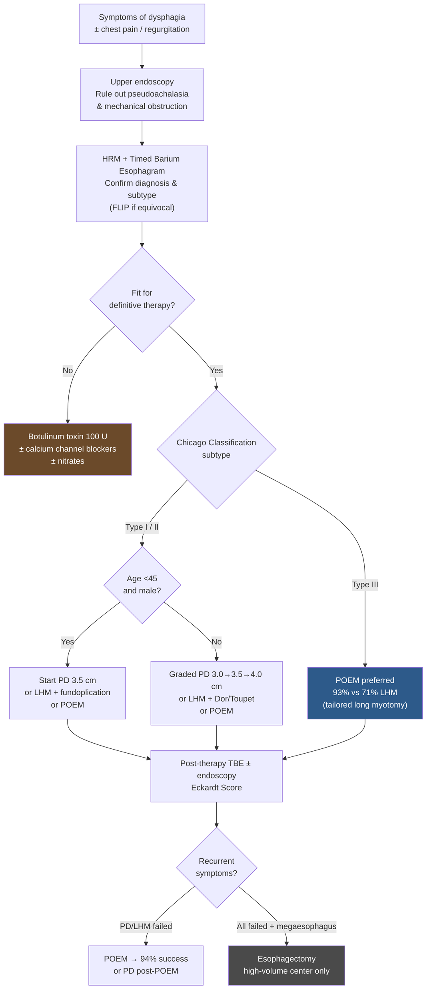

## Assessment

### Establishing the Diagnosis

**Clinical presentation:**

- Progressive dysphagia to both solids and liquids (key distinguishing feature from mechanical obstruction)
- Regurgitation of undigested food
- Chest pain, heartburn (27–42% — frequently misdiagnosed as [[gerd|GERD]])
- Weight loss / nutritional deficiency

> **Recommendation:** Patients suspected of [[gerd|GERD]] who do not respond to acid-suppressive therapy should be evaluated for achalasia. (Strong; Very low evidence)

**Always perform [[upper-endoscopy|upper endoscopy]] first** to rule out pseudoachalasia from obstructing mass (especially in elderly with significant short-term weight loss → cross-sectional imaging ± [[endoscopic-ultrasound|EUS]]).

**How the diagnosis is actually made** ([[acg-2020-achalasia]]) — the three tests are *not* interchangeable criteria; they sit in sequence:

1. **Suggestive** — endoscopy (retained saliva/food, dilated esophagus, puckered/tight GEJ requiring more-than-usual pressure to traverse) and/or barium esophagram (dilated esophagus, "bird beaking" at the GEJ, retained barium at 1–5 min on TBE). *In the appropriate clinical setting*, either of these can raise the diagnosis.
2. **Confirmatory** — [[high-resolution-manometry|HRM]] is the **gold standard**: impaired EGJ relaxation (elevated integrated relaxation pressure, IRP) plus absent/disordered peristalsis. Esophagram is complementary when manometry is equivocal or non-classic.

> **Recommendation:** Use esophageal pressure topography (HRM) over conventional line tracing for the diagnosis of achalasia. (Strong; High evidence)
>
> - HRM has superior inter-rater agreement (k=0.57 vs 0.32) and 3.4x lower odds of incorrect diagnosis vs conventional manometry

**[[flip-panometry|FLIP (Functional Lumen Imaging Probe)]]:** Complementary tool when HRM is equivocal or not tolerated — see [[#FLIP (Functional Lumen Imaging Probe)]] under Diagnostics. Role still evolving.

### Severity Assessment

**Eckardt Score (ES) — the standard severity/response metric.** Built from the 3 cardinal symptoms — **dysphagia, regurgitation, chest pain** — plus **weight loss** as a marker of the ability to maintain nutrition.

| Property | Value |
|---|---|
| Components | Dysphagia, regurgitation, chest pain, weight loss — **all 4 equally weighted** |
| Per-item range | **0–3** each |
| Cumulative range | **0–12** |
| **Treatment success** | **ES ≤3** (ES >3 = suboptimal outcome) |

- Standard metric in almost all achalasia treatment trials; preferred over the Vantrappen classification and the Modified Achalasia Dysphagia Score — but that preference rests on **expert opinion**.
- Limitations: the **dysphagia component dominates** the total, and post-treatment bolus retention is somewhat discordant with the ES. ([[acg-2020-achalasia]], [[asge-2020-achalasia]])
- How to use it for failure assessment is under [[#Post-Therapy Monitoring and Retreatment]].

> **Decision gap (corpus-blocked):** the **per-item anchors** — what earns 0 vs 1 vs 2 vs 3 for each of dysphagia, regurgitation, chest pain (symptom frequency) and weight loss (kg) — are **not printed in any ingested source**; ACG 2020 and ASGE 2020 both describe the score's structure only. The score therefore cannot be *computed* from this page. Needed: Eckardt VF, Aignherr C, Bernhard G. Predictors of outcome in patients with achalasia treated by pneumatic dilation. *Gastroenterology* 1992.

### Classification / Typing (Chicago Classification — clinically essential)

> **Recommendation:** Classify achalasia subtypes to inform prognosis and treatment choice. (Conditional; Low evidence)

All subtypes share **impaired EGJ relaxation**; distinguished by esophageal body pattern:

| Subtype | Prevalence | Pattern | Outcomes | Treatment Implication |
|---------|-----------|---------|----------|----------------------|
| **Type I** | 20–40% | 100% aperistalsis, **no** panesophageal pressurization | Good ([[heller-myotomy\|LHM]] 81%, PD comparable) | PD, LHM, or [[poem\|POEM]] |
| **Type II** | 50–70% (most common) | 100% aperistalsis + **panesophageal pressurization >30 mmHg** | Best outcomes of all subtypes | PD, LHM, or [[poem\|POEM]] — any works well |
| **Type III** | 5% (least common) | **Spastic contractions** ± panesophageal pressurization | Worst with LES-only therapies (LHM 71%, PD 40%) | POEM preferred (93% success); tailored long myotomy |

![[achalasia-2020-chicago-subtypes-05.png|700x183]]
*Figure 2 — High-resolution manometry of achalasia phenotypes. Type I (left): aperistalsis without esophageal pressurization. Type II (middle): aperistalsis with panesophageal pressurization. Type III (right): premature/spastic contractions. ([[acg-2020-achalasia]])*

Disease progresses: Type III → Type II → Type I as esophagus dilates over time.

---

## Differential Diagnosis

*Workup: see [[dysphagia]].*

- **Pseudoachalasia** — malignancy at GEJ ([[gastric-adenocarcinoma|gastric]], [[esophageal-cancer|esophageal cancer]], metastatic); shorter history, older age, rapid weight loss → EUS or CT
- GERD with peptic stricture
- [[eosinophilic-esophagitis|Eosinophilic esophagitis]] — rings/furrows/exudate; ≥15 eos/hpf on biopsy
- [[distal-esophageal-spasm|Distal esophageal spasm (DES)]] — Type III achalasia shares features; differentiated on HRM
- Jackhammer esophagus / [[hypercontractile-esophagus|hypercontractile esophagus]]
- [[esophagogastric-junction-outflow-obstruction|EGJOO]] — elevated IRP but preserved (or only partially disordered) peristalsis; a manometric finding with many mimics, not a diagnosis in itself
- [[esophageal-dysfunction-systemic-disease|Scleroderma esophagus]] (absent peristalsis but low LES pressure)
- Chagas disease (secondary achalasia from T. cruzi — clinically indistinguishable)
- **Secondary ("mimic") achalasia** — consider infectious/inflammatory causes at initial evaluation: recent COVID infection, Chagas risk, and eosinophilic/mast-cell disease; achalasia is hypothesized to be autoimmune (↑ odds of autoimmune conditions, OR up to 3.6). (AGA 2024)

---

## Diagnostics

### HRM (High-Resolution Manometry)

Gold standard. Use esophageal pressure topography. Reports IRP (integrated relaxation pressure) and body pattern. The [[chicago-classification-v4|Chicago Classification]] defines the subtypes — ACG 2020 references CC v3.0; the current framework (manufacturer-specific IRP thresholds, subtype criteria) is **CC v4.0** ([[chicago-v4-2021-esophageal-dysmotility]]).

### Timed Barium Esophagram (TBE)

Barium column height measured at 1, 2, and 5 minutes after large barium bolus ingestion. Pre-treatment: retained barium. Post-treatment success: complete emptying at 1 minute. **Best predictor of long-term outcome post-dilation** (superior to symptom scores).

### Upper Endoscopy

- Rules out pseudoachalasia / mechanical obstruction (**always perform**)
- Findings: retained saliva/food, dilated esophagus, puckered/tight GEJ
- Post-therapy: assess for GERD-related esophagitis or stricture

### FLIP (Functional Lumen Imaging Probe)

Simultaneous cross-sectional area + pressure → EGJ distensibility index. Performed during endoscopy under [[endoscopy-sedation|sedation]]. All 70 manometry-confirmed achalasia patients had reduced EGJ distensibility on FLIP. Useful in:

- Equivocal manometry with high clinical suspicion
- Patients who cannot tolerate manometry
- Pre- and post-treatment assessment

---

## Therapeutics

> All treatments are **palliative** — reduce LES hypertonicity, improve esophageal emptying, prevent dilation. No cure exists.

### Treatment Algorithm

![[achalasia-2020-treatment-algorithm-15.png|700x396]]
*Figure 8 — Diagnostic and treatment algorithm for achalasia. FLIP: functional lumen imaging probe; HRM: high-resolution manometry; PPI: proton pump inhibitor. ([[acg-2020-achalasia]])*

### Pneumatic Dilation (PD)

- Graded Rigiflex balloon dilators: 3.0 → 3.5 → 4.0 cm
- Performed under sedation ± fluoroscopy; all patients must be surgical candidates (in case of perforation)
- Initial 3.0 cm → reassess at 4–6 weeks; advance size if still symptomatic
- **Young men (<45y):** Start at 3.5 cm or consider LHM/POEM (thicker LES musculature → worse PD response)
- Predictors of favorable PD response: age >45y, female sex, non-dilated esophagus, LES pressure post-PD <10 mmHg
- **Perforation risk:** overall reported 1.9% (range 0–10%); **median 1.9% (range 0–16%) in experienced hands** (operators with >100 patients treated). Requires surgery if large/mediastinal contamination
- Do NOT perform routine post-dilation gastrograffin esophagram; reserve for clinical suspicion of perforation
- GERD occurs in 15–35% post-PD → [[proton-pump-inhibitors|PPI]] therapy

> **Recommendation:** Serial PD is the most effective non-surgical treatment. Superior to botulinum toxin. Equivalent to LHM at 5 years. (Strong; High evidence)

> **Newer guidance — [[sages-2024-poem|SAGES 2024 update]] (conditional):** **POEM over PD** for adults with achalasia; **POEM or LHM** — either acceptable, selection individualized (POEM especially advantageous for type III / spastic disease). Where the two differ, the 2024 update supersedes the 2020 ACG framing of PD as the preferred non-surgical option; counsel on post-POEM reflux.

### Laparoscopic Heller Myotomy (LHM)

- Divides circular muscle fibers of LES; preferred laparoscopic approach
- **Always add an [[antireflux-surgery|antireflux procedure]].** Post-myotomy GERD frequency is similar across surgical approaches **without** fundoplication — thoracotomy 29%, laparotomy 28%, thoracoscopy 28%, **laparoscopy 31%** — and adding fundoplication drops it to **thoracotomy 14%, laparotomy 8%, laparoscopy 9%** (no fundoplication data after thoracoscopic myotomy).
  - Confirmed in a double-blind RCT: abnormal acid exposure on pH monitoring in **47% without** an antireflux procedure vs **9% with** a posterior Dor fundoplication (**RR 0.11**, 95% CI 0.02–0.59).
- **Dor or Toupet fundoplication** — both acceptable (Conditional; Moderate evidence); Toupet may offer slightly better QoL
- Efficacy: 89% symptom improvement (range 77–100%)
- Type I/II: 81–92% success; Type III: 71% (inferior to POEM)
- Decreasing efficacy with longer follow-up (89% at 6 months → 57% at 6 years in one series)

> **Recommendation:** POEM and LHM result in comparable symptomatic improvement. (Strong; Moderate evidence)

### Per-Oral Endoscopic Myotomy (POEM)

- Endoscopic submucosal tunnel → myotomy via [[endoscopic-submucosal-dissection|ESD]] knife; minimum 6 cm into esophagus + 2 cm below SCJ onto cardia
- Myotomy length tailored to spastic segment (especially Type III) — key advantage over LHM
- Success: >90% in prospective cohorts; 92% at 2 years in the Ponds RCT; equivalent to LHM (83% vs 82%)
- **Type III: 93% success vs 71% for LHM** (Conditional; Low evidence)
- **Higher GERD incidence:** 39% abnormal pH monitoring vs 17% for LHM; 29% erosive esophagitis. AGA 2024 CPU: abnormal acid exposure **41–56%**, esophagitis **41–65%**; **~¼ asymptomatic** → symptoms alone insufficient
- Empiric acid suppression in immediate post-POEM period, continue **≥3–6 months**; [[ambulatory-reflux-monitoring|objective reflux testing]] **6–12 months** post-POEM (off-PPI if GERD in question; on-PPI if GERD established or esophagitis [[reflux-testing|LA grade]] ≥B)
- Screen post-POEM patients for erosive esophagitis and [[barretts-esophagus|Barrett's esophagus]]
- Advise patients lifelong PPI may be needed
- See [[poem]] for full pre/postprocedure management, myotomy tailoring, and same-day-discharge criteria

> **Recommendation:** POEM is associated with higher GERD incidence compared to LHM + fundoplication or PD. Consider lifelong acid suppression and surveillance for erosive esophagitis/BE. (Strong; Moderate evidence)

### Botulinum Toxin Injection

- 100 U injected above SCJ in 0.5–1 mL aliquots using sclerotherapy needle
- Symptom relief: 78.7% at 30 days → 70% at 3 months → 53% at 6 months → **40.6% at 12 months**
- Short-lived; 46.6% require additional injections; 30% need more definitive therapy
- Previous BT does not significantly affect POEM outcomes but may increase fibrosis risk with LHM (conflicting data)

> **Recommendation:** Botulinum toxin is first-line therapy only for patients **unfit for definitive therapy**. (Strong; Moderate evidence)

### Pharmacotherapy

- Calcium channel blockers (nifedipine 10–30 mg SL before meals) and nitrates (isosorbide dinitrate 5 mg SL before meals)
- Symptom improvement 0–87%; short duration of action; frequent dosing with significant side effects
- **Reserved for patients who cannot undergo PD/LHM/POEM AND have failed botulinum toxin**

> **Recommendation:** PD is superior to pharmacotherapy in relieving symptoms and physiologic parameters of esophageal emptying. (Strong; Very low evidence)

### Self-Expanding Metal Stents (SEMS)

> **Recommendation:** Recommend against stent placement for long-term dysphagia management in achalasia. (Strong; Low evidence)

### Esophagectomy

- Reserved for **end-stage achalasia** (megaesophagus, sigmoid esophagus) who have failed all other interventions
- High complication rate (pneumonia 10%); mortality ~2% at high-volume centers
- Gastric interposition is first-choice esophageal substitute
- Consider LHM before esophagectomy if incomplete myotomy and favorable anatomy

### Post-Therapy Monitoring and Retreatment

**Assessment of treatment failure:**

- Do NOT use ES or HRM alone to define failure
- Use **TBE as first-line test** for continued/recurrent symptoms (Strong; Very low evidence)

**Failed LHM or POEM → PD:** Safe and effective (89% success post-LHM, comparable post-POEM). (Strong; Moderate evidence)

**Failed PD or LHM → POEM:** Safe option; 94% clinical success post-LHM at 12 months. (Strong; Low evidence) AGA 2024 CPU: POEM may be superior to PD after failed initial POEM/LHM — RCT after failed LHM showed **POEM 62% vs PD 27%** success, no difference in esophagitis/reflux/adverse events.

**Failed PD + POEM → LHM:** Consider if incomplete myotomy and favorable anatomy (before esophagectomy). (Strong; Very low evidence)

### Cancer Surveillance

- Achalasia → **28x HR for esophageal squamous cell carcinoma**; ~1 cancer per 300 patient years; [[esophageal-adenocarcinoma|adenocarcinoma]] risk also elevated (but lower). (AGA 2024 CPU cites a 9314-patient cohort with **HR 4.6** [95% CI 2.3–9.2] for esophageal cancer overall)
- Despite elevated risk, >400 endoscopies needed to detect one cancer; poor survival once detected
- **Do NOT recommend routine endoscopic surveillance** for esophageal carcinoma (Strong; Low evidence)
- Some experts favor surveillance every 3 years after 10–15 years of disease; individualize decision

---

## See Also

[[dysphagia]], [[high-resolution-manometry]], [[flip-panometry]], [[poem]], [[chicago-classification-v4]], [[distal-esophageal-spasm]], [[hypercontractile-esophagus]], [[esophagogastric-junction-outflow-obstruction]], [[gerd]], [[eosinophilic-esophagitis]], [[esophageal-dysfunction-systemic-disease]], [[upper-endoscopy]], [[heller-myotomy]], [[esophageal-cancer]], [[esophageal-adenocarcinoma]], [[reflux-testing]], [[ambulatory-reflux-monitoring]], [[antireflux-surgery]], [[endoscopic-submucosal-dissection]], [[barretts-esophagus]], [[proton-pump-inhibitors]], [[endoscopic-ultrasound]], [[endoscopy-sedation]]

---

## Sources

1. [[acg-2020-achalasia|ACG 2020: Diagnosis and Management of Achalasia]]
2. [[asge-2020-achalasia|ASGE Guideline: Management of Achalasia (2020)]]
3. [[sages-2021-poem|SAGES Guidelines for the Use of Peroral Endoscopic Myotomy (POEM) for the Treatment of Achalasia (2021)]]
4. [[sages-2024-poem|SAGES Guideline Update: Peroral Endoscopic Myotomy (POEM) for Achalasia (2024)]]
5. [[aga-2024-poem-advances|AGA Clinical Practice Update on Advances in Per-Oral Endoscopic Myotomy (POEM) and Remaining Questions—What We Have Learned in the Past Decade: Expert Review (2024)]]
6. [[aga-2024-esophageal-immunity-infection|AGA Clinical Practice Update on Esophageal Dysfunction Due to Disordered Immunity and Infection: Expert Review (2024)]]
7. [[chicago-v4-2021-esophageal-dysmotility|Chicago Classification v4.0: Esophageal Motility Disorders]]
