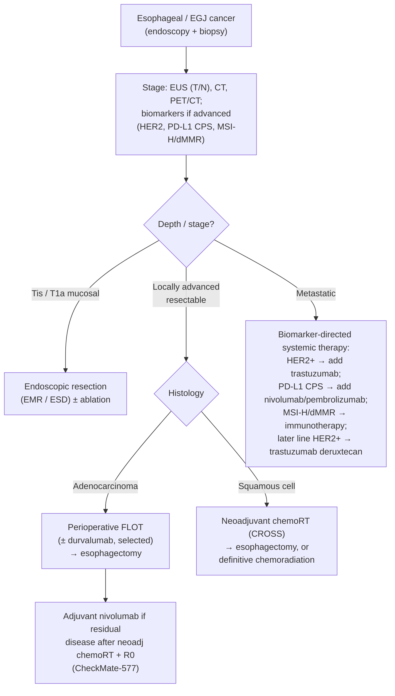

## Assessment

### Establishing the Diagnosis

Esophageal and esophagogastric junction (EGJ) cancers present most often with progressive solid-food dysphagia, weight loss, odynophagia, and [[iron-deficiency-anemia|iron-deficiency anemia]] — a classic alarm-feature presentation that mandates prompt [[upper-endoscopy|endoscopy]] with biopsy. Diagnosis is histologic; staging follows with endoscopic ultrasound ([[endoscopic-ultrasound|EUS]]) for T and N assessment, CT of chest/abdomen, and PET/CT to detect distant disease.

### Classification / Typing

Two dominant histologies drive distinct pathways ([[nccn-2026-esophageal-egj-cancer]]):

- **Adenocarcinoma** — distal esophagus/EGJ; arises through the metaplasia–dysplasia sequence from [[barretts-esophagus|Barrett's esophagus]]; risk factors [[gerd|GERD]], [[obesity]], male sex. See [[esophageal-adenocarcinoma]].
- **Squamous cell carcinoma (SCC)** — more often mid/upper esophagus; risk factors smoking, alcohol, [[achalasia]], caustic injury, tylosis. SCC is more radiosensitive and more frequently managed with definitive chemoradiation.

EGJ tumors (Siewert classification) straddle the esophageal and [[gastric-adenocarcinoma|gastric]] pathways and share systemic-therapy biomarkers.

### Staging

TNM staging is histology-specific. Depth of invasion separates endoscopically curable disease (Tis/T1a mucosal) from disease requiring surgery or chemoradiation (T1b and deeper). For advanced/metastatic disease, biomarker testing — **HER2 (ERBB2), PD-L1 CPS, and MSI-H/dMMR** — is integral to therapy selection.

## Differential Diagnosis

*Workup: see [[dysphagia]].*

[[gerd|Peptic stricture]] and other benign strictures, [[eosinophilic-esophagitis|eosinophilic esophagitis]], [[achalasia]] and other motility disorders, esophageal [[gastrointestinal-stromal-tumor|GIST]] or other [[subepithelial-lesion|subepithelial lesions]], [[barretts-esophagus|Barrett's]] with dysplasia, and extrinsic compression.

## Diagnostics

Endoscopy with biopsy establishes histology; EUS assesses T/N stage (and enables FNA of suspicious nodes); CT and PET/CT assess distant spread. Biomarker testing (HER2, PD-L1 CPS, MSI-H/dMMR) is performed on advanced/metastatic tumors to direct systemic therapy.

## Therapeutics

Stage-directed per [[nccn-2026-esophageal-egj-cancer]]:

- **Early (Tis/T1a, mucosal):** endoscopic resection ([[endoscopic-eradication-therapy|EMR/ESD]]) ± ablation.
- **Locally advanced resectable:** neoadjuvant/perioperative therapy then esophagectomy — perioperative **FLOT** (adenocarcinoma) or neoadjuvant **chemoradiation (CROSS-type)** followed by surgery. Adjuvant **nivolumab** is an option after neoadjuvant chemoradiation + R0 resection with residual disease (CheckMate-577). In v3.2026, adding **durvalumab to perioperative FLOT** is positioned for selected adenocarcinoma (clinically node-negative; PD-L1 CPS <1 as category 2B; diffuse-type EGJ as category 2B) per MATTERHORN — with no demonstrated survival advantage in diffuse-type disease.
- **Definitive chemoradiation:** for SCC and for patients who are not surgical candidates.
- **Metastatic:** biomarker-directed systemic therapy — first-line **trastuzumab** added to chemotherapy for HER2-overexpressing adenocarcinoma; **nivolumab or pembrolizumab** added by PD-L1 CPS; immunotherapy for MSI-H/dMMR; **trastuzumab deruxtecan** in later lines for HER2-positive disease.

### NCCN Treatment Algorithm

*Algorithm — NCCN esophageal/EGJ cancer management, recreated in original form (not an NCCN figure). ([[nccn-2026-esophageal-egj-cancer]])*

## See Also

[[esophageal-adenocarcinoma]], [[gastric-adenocarcinoma]], [[barretts-esophagus]], [[dysphagia]], [[gerd]], [[achalasia]], [[upper-endoscopy]], [[endoscopic-ultrasound]], [[endoscopic-eradication-therapy]]

---

## Sources

1. [[nccn-2026-esophageal-egj-cancer|NCCN Clinical Practice Guidelines in Oncology: Esophageal and Esophagogastric Junction Cancers (Version 3.2026)]]
