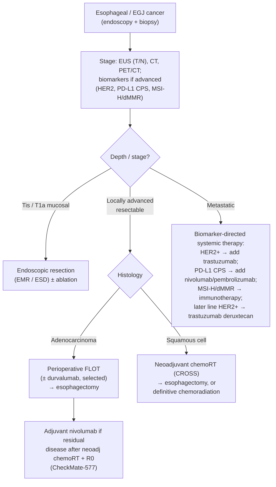

## Assessment

### Establishing the Diagnosis

- **Presentation:** progressive solid-food dysphagia, weight loss, odynophagia, [[iron-deficiency-anemia|iron-deficiency anemia]] — a classic alarm-feature presentation that mandates prompt [[upper-endoscopy|endoscopy]] with biopsy.
- Diagnosis is **histologic**; staging follows (see [[#Diagnostics]]).

### Severity Assessment (AJCC 8th ed. TNM staging)

Depth of invasion separates endoscopically curable disease (Tis/T1a mucosal) from disease requiring surgery or chemoradiation (T1b and deeper). Stage groups are **histology-specific** (separate tables for SCC and adenocarcinoma) and differ for clinical (cTNM), pathologic (pTNM), and post-neoadjuvant (ypTNM) staging; **grade (G)** and — for SCC — **tumor location** enter the pathologic stage groups ([[nccn-2026-esophageal-egj-cancer]], AJCC 8th ed. 2017).

| T — primary tumor | Definition |
|---|---|
| Tis | High-grade dysplasia — malignant cells confined to the epithelium by the basement membrane |
| T1 | Invades lamina propria, muscularis mucosae, or submucosa |
| T1a | Invades lamina propria or muscularis mucosae |
| T1b | Invades submucosa |
| T2 | Invades muscularis propria |
| T3 | Invades adventitia |
| T4a | Invades pleura, pericardium, azygos vein, diaphragm, or peritoneum |
| T4b | Invades other adjacent structures — aorta, vertebral body, or airway |

| N / M / G | Definition |
|---|---|
| N0 / N1 / N2 / N3 | No regional nodes / **1–2** nodes / **3–6** nodes / **≥7** nodes |
| M0 / M1 | No distant metastasis / distant metastasis |
| G1 / G2 / G3 | Well / moderately / poorly differentiated or undifferentiated |

**SCC location** (by epicenter of the tumor): **Upper** = cervical esophagus to lower border of the azygos vein; **Middle** = lower border of azygos vein to lower border of the inferior pulmonary vein; **Lower** = lower border of inferior pulmonary vein to the stomach, including the EGJ.

**Clinical stage groups (cTNM) — the stage that drives the pretreatment decision.** Note the two histologies group differently at the same T/N (e.g. cT2N1: stage II for SCC, stage III for adenocarcinoma):

| Stage | Squamous cell carcinoma | Adenocarcinoma |
|---|---|---|
| 0 | Tis N0 | Tis N0 |
| I | T1 N0–1 | T1 N0 |
| IIA | — | T1 N1 |
| IIB | — | T2 N0 |
| II | T2 N0–1; T3 N0 | — |
| III | T3 N1; T1–3 N2 | T2 N1; T3 N0–1; T4a N0–1 |
| IVA | T4 N0–2; any T N3 | T1–4a N2; T4b N0–2; any T N3 |
| IVB | Any T, any N, **M1** | Any T, any N, **M1** |

*All rows are M0 except stage IVB. Pathologic (pTNM) and post-neoadjuvant (ypTNM) groupings differ from the above and additionally require **grade (G)** — and, for SCC, **tumor location** — to assign the stage.*

### Classification / Typing

Two dominant histologies drive distinct pathways ([[nccn-2026-esophageal-egj-cancer]]):

- **Adenocarcinoma** — distal esophagus/EGJ; arises through the metaplasia–dysplasia sequence from [[barretts-esophagus|Barrett's esophagus]]; risk factors [[gerd|GERD]], [[obesity]], male sex. See [[esophageal-adenocarcinoma]].
- **Squamous cell carcinoma (SCC)** — more often mid/upper esophagus; risk factors smoking, alcohol, [[achalasia]], caustic injury, tylosis. SCC is more radiosensitive and more frequently managed with definitive chemoradiation.

EGJ tumors straddle the esophageal and gastric pathways and share systemic-therapy biomarkers. **Siewert type (I / II / III, by tumor epicenter relative to the EGJ) decides which guideline governs treatment** — types I and II are treated as esophageal/EGJ cancer, type III as gastric cancer; the cm-criteria table is on [[gastric-adenocarcinoma]].

## Differential Diagnosis

*Workup: see [[dysphagia]].*

[[gerd|Peptic stricture]] and other benign strictures, [[eosinophilic-esophagitis|eosinophilic esophagitis]], [[achalasia]] and other motility disorders, esophageal [[gastrointestinal-stromal-tumor|GIST]] or other [[subepithelial-lesion|subepithelial lesions]], [[barretts-esophagus|Barrett's]] with dysplasia, and extrinsic compression.

## Diagnostics

- **[[upper-endoscopy|EGD]] with biopsy** — establishes histology.
- **[[endoscopic-ultrasound|EUS]]** — T and N stage; enables FNA of suspicious nodes. (For early [[barretts-esophagus|Barrett's]]-associated lesions, EUS is *not* used to separate T1a from T1b — resection histology is; see [[esophageal-adenocarcinoma]].)
- **CT chest/abdomen + PET/CT** — distant spread.
- **Biomarker testing on advanced/metastatic tumors** — HER2 (ERBB2), PD-L1 CPS, MSI-H/dMMR. Positivity cutoffs ([[nccn-2026-esophageal-egj-cancer]]):
  - **HER2-positive** = **IHC 3+**, or **IHC 2+ with ISH/FISH-positive**.
  - **PD-L1–positive** = **CPS ≥1**; **≥100 tumor cells** must be present for the stained slide to be adequate. Line-of-therapy CPS gates are in [[#Therapeutics]].

## Therapeutics

Stage-directed per [[nccn-2026-esophageal-egj-cancer]]:

- **Early (Tis/T1a, mucosal):** endoscopic resection ([[endoscopic-mucosal-resection|EMR]] / [[endoscopic-submucosal-dissection|ESD]]) ± ablation — see [[endoscopic-eradication-therapy]]. **Which of EMR vs ESD turns on histology and lesion size** ([[asge-2023-esd]], all Conditional / low quality):

| Lesion | Recommendation |
|---|---|
| Squamous dysplasia / early ESCC, well-differentiated, nonulcerated, no submucosal invasion, **>15 mm** | **ESD over EMR** |
| Same, **≤15 mm** | No recommendation either way — **either ESD or EMR** |
| Squamous dysplasia / early well-differentiated nonulcerated ESCC without submucosal invasion | **Against surgery**, whenever possible |
| Early EAC (T1) or nodular [[barretts-esophagus\|Barrett's]] dysplasia, well-differentiated, nonulcerated, **>20 mm** | **ESD over EMR** |
| Same, **≤20 mm** | No recommendation either way — **either ESD or EMR** |

  Note the size thresholds differ by histology — **15 mm for squamous, 20 mm for adenocarcinoma** — and both are recommendations about *technique*, not about whether to resect endoscopically at all (that is set by depth; see [[esophageal-adenocarcinoma]]).
- **Locally advanced resectable:** neoadjuvant/perioperative therapy then esophagectomy — perioperative **FLOT** (adenocarcinoma) or neoadjuvant **chemoradiation (CROSS-type)** followed by surgery. Adjuvant **nivolumab** is an option after neoadjuvant chemoradiation + R0 resection with residual disease (CheckMate-577). In v3.2026, adding **durvalumab to perioperative FLOT** is positioned for selected adenocarcinoma (clinically node-negative; PD-L1 CPS <1 as category 2B; diffuse-type EGJ as category 2B) per MATTERHORN — with no demonstrated survival advantage in diffuse-type disease.
- **Definitive chemoradiation:** for SCC and for patients who are not surgical candidates.
- **Metastatic:** biomarker-directed systemic therapy — first-line **trastuzumab** added to chemotherapy for HER2-overexpressing adenocarcinoma; immunotherapy for MSI-H/dMMR **independent of PD-L1 status**; **trastuzumab deruxtecan** (category 1) in later lines for HER2-positive disease.

  **PD-L1 CPS thresholds — the number and the *line of therapy* both matter:**

| Setting | Threshold | Strength |
|---|---|---|
| Add a checkpoint inhibitor to **first-line** chemotherapy (adenocarcinoma/EGJ **and** SCC) | **CPS ≥1** | Category 1 for SCC; for adenocarcinoma/EGJ, recommended at CPS ≥1 but **category 1 only at CPS ≥5** |
| **Second-line or subsequent** pembrolizumab monotherapy, **esophageal SCC only** | **CPS ≥10** | Category 1 |

  **CPS and tumor area positivity (TAP) score have high concordance and may be used interchangeably** (v3.2026 revision) — so a lab reporting TAP ≥1% satisfies the CPS ≥1 gate.

### NCCN Treatment Algorithm

*Algorithm — NCCN esophageal/EGJ cancer management, recreated in original form (not an NCCN figure). ([[nccn-2026-esophageal-egj-cancer]])*

## See Also

[[esophageal-adenocarcinoma]], [[gastric-adenocarcinoma]], [[barretts-esophagus]], [[dysphagia]], [[gerd]], [[achalasia]], [[upper-endoscopy]], [[endoscopic-ultrasound]], [[endoscopic-eradication-therapy]], [[endoscopic-mucosal-resection]], [[endoscopic-submucosal-dissection]], [[subepithelial-lesion]], [[gastrointestinal-stromal-tumor]], [[iron-deficiency-anemia]], [[obesity]]

---

## Sources

1. [[nccn-2026-esophageal-egj-cancer|NCCN Clinical Practice Guidelines in Oncology: Esophageal and Esophagogastric Junction Cancers (Version 3.2026)]]
2. [[asge-2023-esd|ASGE Guideline: ESD for Early Esophageal and Gastric Cancer (2023)]]
