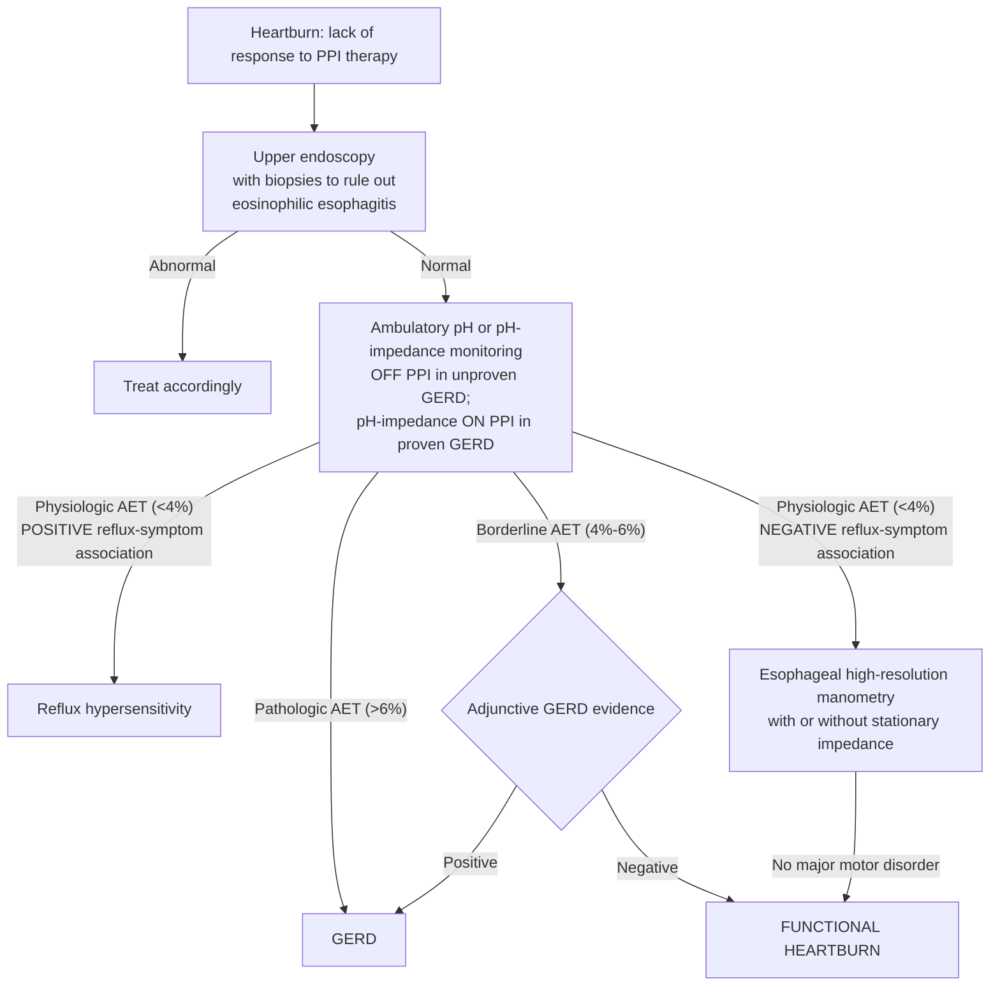

## Contents
- [[#Assessment]]
  - [[#Establishing the Diagnosis]]
  - [[#Severity Assessment]]
  - [[#Classification / Typing]]
- [[#Differential Diagnosis]]
- [[#Diagnostics]]
  - [[#Upper Endoscopy with Biopsies]]
  - [[#High-Resolution Manometry]]
  - [[#Ambulatory Reflux Monitoring]]
  - [[#Borderline Acid Exposure (AET 4%–6%)]]
  - [[#Diagnostic Algorithm]]
- [[#Therapeutics]]
  - [[#What Not to Do]]
  - [[#Neuromodulators — First-Line]]
  - [[#Behavioral and Complementary Therapy]]
  - [[#Lifestyle]]
  - [[#Prognosis and Monitoring]]
- [[#See Also]]
- [[#Sources]]

## Assessment

### Establishing the Diagnosis

Retrosternal burning **without** pathologic acid exposure, **without** a major motor disorder, **without** mucosal pathology, and **without** a reflux–symptom association. All six domains must be satisfied — the diagnosis is one of positive exclusion, not of PPI failure alone.

| Domain | Requirement |
|---|---|
| **Symptom** | Troublesome retrosternal burning pain/discomfort **≥2×/week for the previous 3 months**, persisting despite **maximal (double-dose)** [[proton-pump-inhibitors\|PPI]] taken appropriately **before meals** |
| **Endoscopy + esophageal biopsies** | Normal — no erosive esophagitis, [[barretts-esophagus\|Barrett's esophagus]], [[eosinophilic-esophagitis\|eosinophilic esophagitis]], stricture, web, pill esophagitis, or neoplasia |
| **[[high-resolution-manometry\|HRM]]** | No **major** esophageal motor disorder. A **minor** disorder ([[ineffective-esophageal-motility\|IEM]]) does **not** preclude the diagnosis, provided reflux disease is excluded |
| **Acid exposure time (AET)** | **Physiologic — AET <4%** in the distal esophagus (AET is reliably normal below 4% and abnormal above 6%) |
| **Reflux–symptom association** | **Negative on BOTH indices** — symptom index (SI) positive if **>50%**; symptom association probability (SAP) positive if **≥95%**. Both must be negative |
| **Which study, off or on PPI** | **Unproven GERD** → pH or pH-impedance **off** anti-secretory medication. **Proven GERD** → pH-impedance **on** double-dose PPI |

- **Both indices negative, not one.** A single negative index with the other positive does not establish the diagnosis, and there is **no consensus on which index governs when SI and SAP disagree**.
- Clinical description of heartburn — by a physician or a validated questionnaire — has only **modest sensitivity and specificity** against objective reflux evidence or PPI response; the diagnosis cannot be made on symptom character.

### Severity Assessment

No severity grading system is applied to functional heartburn. What is graded instead is **impact**: symptom burden and quality-of-life impairment drive how aggressively to investigate and treat. The three stated treatment goals are symptom improvement and ideally resolution, prevention of recurrence, and improvement of health-related quality of life.

### Classification / Typing

Two forms, separated by whether GERD was ever objectively proven — the distinction decides whether the PPI is stopped or kept.

| Type | Defining criteria | PPI handling |
|---|---|---|
| **Functional heartburn (isolated)** | No conclusive GERD evidence at any point; physiologic AET **off** therapy with negative SI and SAP | **Attempt to discontinue PPI** is warranted |
| **Functional heartburn overlapping proven GERD** (Rome IV) | History of proven GERD — **positive pH study, erosive esophagitis, Barrett's esophagus, or esophageal ulcer** — **plus** heartburn persisting on maximal PPI **plus** pH-impedance **on** PPI showing physiologic AET **and** negative SI and SAP for **both acid and weakly acidic** reflux events | **PPI may be maintained** while targeted functional-heartburn therapy is started |

---

## Differential Diagnosis

*Workup: see [[dyspepsia]].*

**The three-way discrimination** — all with normal endoscopy, separated only by acid burden and symptom association:

| Acid exposure time | SI / SAP | Diagnosis |
|---|---|---|
| **AET >6%** (pathologic) | either | **[[gerd\|NERD / true refractory GERD]]** |
| **AET <4%** (physiologic) | **both positive** | **Reflux hypersensitivity** |
| **AET <4%** (physiologic) | **both negative** | **Functional heartburn** |

Reflux hypersensitivity is the near neighbour, not a variant: same normal endoscopy, same physiologic acid burden, opposite symptom association. It is the one entity in this table whose symptoms *do* track reflux events, and it is classified with the functional esophageal disorders rather than with GERD.

Other conditions that produce PPI-refractory retrosternal burning and are excluded by the workup above:

| Condition | Distinguishing feature |
|---|---|
| [[eosinophilic-esophagitis\|Eosinophilic esophagitis]] | Prevalence **does not exceed 8%** in refractory heartburn, but adequate biopsy sampling is required before the diagnosis of functional heartburn can be made |
| Erosive esophagitis | Prevalence **<10%** in PPI-refractory patients; when found it indicates poorly controlled acid reflux or true refractory GERD |
| [[achalasia\|Achalasia]] | Heartburn reported in **up to 35%**; may be suspected at endoscopy but requires HRM — the reason manometry is mandatory rather than optional |
| Stricture, web, pill esophagitis, neoplasia | Structural findings on endoscopy |
| [[irritable-bowel-syndrome\|IBS]] and functional dyspepsia | Frequently coexist and **negatively impact symptom response to therapy**; concurrent functional GI disorders and somatization should be considered |

---

## Diagnostics

Testing is sequential and each step is required — the diagnosis cannot be assigned on a negative pH study alone.

### Upper Endoscopy with Biopsies

- **First step.** Indicated in heartburn that fails an adequate empiric [[proton-pump-inhibitors\|PPI]] trial, to exclude other esophageal and gastric disease.
- [[upper-endoscopy\|EGD]] **with esophageal biopsies** — biopsies are not optional; adequate sampling is what excludes [[eosinophilic-esophagitis|EoE]] and satisfies the definition.

### High-Resolution Manometry

- Excludes **major** esophageal motor disorders, which can themselves cause heartburn and chest pain.
- Also localizes the proximal border of the LES for placement of pH and pH-impedance catheters.
- A **minor** motor disorder such as [[ineffective-esophageal-motility\|IEM]] does not preclude functional heartburn once reflux disease is excluded.

### Ambulatory Reflux Monitoring

- **Which study depends on whether GERD was ever proven** — off anti-secretory therapy in unproven GERD (prior esophagitis, Barrett's, peptic stricture, or a prior positive pH study define "proven"); **on** double-dose PPI with impedance in proven GERD.
- **Off therapy the added value of impedance over pH alone is relatively limited.** On therapy, impedance is what permits detection of weakly acidic reflux.
- **Yield of on-therapy pH-impedance in proven GERD:** a relationship between symptoms and **acid** reflux in **10%**, and with **weakly acidic** reflux in **30%–40%**; studies are **negative in 50%–60%**.
- **Prolonged (48- or 96-hour) wireless pH monitoring** increases the likelihood of detecting reflux disease; **worst-day analysis** gives the highest diagnostic yield and reduces the proportion of patients labelled functional heartburn.
- Threshold definitions, modality selection, and the SI/SAP formulas live on [[ambulatory-reflux-monitoring]]; indications for objective testing are on [[reflux-testing]].
- Patients must be instructed on **how to use the event marker** and to fill the symptom diary accurately — symptom-association analysis is only as good as the marking.

### Borderline Acid Exposure (AET 4%–6%)

When AET falls in the borderline band, or SI and SAP are discrepant, the case turns on **adjunctive reflux evidence**. Their **absence** — the full set below — indicates the possibility of functional heartburn; presence of adjunctive evidence points to GERD.

| Adjunctive metric | Value favouring functional heartburn |
|---|---|
| Esophageal biopsies | Normal |
| **Mean nocturnal baseline impedance (MNBI)** | **>2292 ohms** (low MNBI **<2292 ohms** is a surrogate marker of reflux-induced altered mucosal integrity and favours reflux) |
| **Post-reflux swallow-induced peristaltic wave (PSPW) index** | **>0.61** (reflects integrity of primary peristalsis stimulated by reflux episodes) |
| Reflux–symptom association | Negative |
| Reflux episode count | **<40** episodes |
| EGJ and esophageal body motor profile on HRM | Normal |

Both MNBI and the PSPW index may prove helpful in refractory heartburn, but more data are needed on inter-observer reproducibility, normal values, and relevant cut-offs before these metrics can be recommended for clinical use.

### Diagnostic Algorithm

*Figure 1 — Evaluation of persisting heartburn despite maximal acid suppression. Functional heartburn coexists with GERD in patients with proven GERD otherwise fulfilling criteria for functional heartburn. ([[aga-2020-functional-heartburn]])*

---

## Therapeutics

Acid suppression is not the ladder. Neuromodulators are, with behavioral and complementary therapy alongside; a subset of patients requires **more than one modality** for acceptable symptom control.

| Category | Options |
|---|---|
| **Lifestyle modifications** | Improved sleep experience |
| **Pharmacotherapy** | Tricyclic antidepressants; selective serotonin reuptake inhibitors; [[tegaserod\|tegaserod]]; histamine-2 receptor antagonists; melatonin |
| **Alternative / complementary medicine** | Acupuncture |
| **Psychological intervention** | Hypnotherapy |

### What Not to Do

- **[[proton-pump-inhibitors\|PPIs]] have no therapeutic value** in functional heartburn — the sole exception being proven GERD that overlaps with it. Where no conclusive GERD evidence exists, **an attempt to discontinue PPI therapy is warranted**; where overlap is demonstrated on endoscopy and/or reflux monitoring, PPI can be **maintained** while targeted therapy is started.
- **[[antireflux-surgery\|Anti-reflux surgery]] and endoscopic GERD treatment modalities have no therapeutic benefit and should not be recommended.** Normal preoperative esophageal acid exposure is itself a risk factor for poor outcome after surgical fundoplication.

### Neuromodulators — First-Line

Despite the limited number of trials, neuromodulators are considered to have a therapeutic role, especially as **first-line therapy**; they are of benefit as primary therapy in functional heartburn, or as **add-on** therapy where it overlaps with proven GERD. They alter neuronal function without acting as neurotransmitters, with a primary central action and a minor secondary peripheral action on esophageal pain.

| Class | Drug | Dose | n | Outcome |
|---|---|---|---|---|
| TCA | Imipramine | 25 mg/d | 83 | No difference from placebo in symptom relief; improved QOL |
| SSRI | Fluoxetine | 20 mg/d | 144 | Improvement in percentage of heartburn-free days |
| Serotonin agonist (5-HT4) | [[tegaserod\|Tegaserod]] | 6 mg bid | 42 | Decreased frequency of heartburn, regurgitation, and distress |
| H2RA | Ranitidine | 150 mg | 18 | Decrease in esophageal sensitivity |
| Miscellaneous anxiolytics, sedatives, hypnotics | Melatonin | 6 mg bid | 60 | Improved GERD-HRQOL |

- **TCA dosing — "low and slow":** start at the **lowest** dose and increase by **weekly increments of the same dose** to a goal of **50–75 mg daily**. Commonly given **at bedtime** — the somnolence improves the sleep experience and augments the analgesic effect.
- **Fluoxetine** is the only SSRI studied: 20 mg daily as add-on in patients with persisting heartburn and negative endoscopy who failed standard-dose once-daily omeprazole, vs double-dose omeprazole vs add-on placebo — heartburn-free days median **35.7 vs 7.14 vs 7.14** (*P* < .001 for both comparisons). The superior effect was seen **only in the subset with a normal pH test**.
- **Tegaserod** 6 mg twice daily for **14 days**: higher tolerated balloon pressures (*P* = .04) and maximum wall tension (*P* = .0004); decreased frequency of heartburn (*P* = .004), regurgitation (*P* = .048), and distress from regurgitation (*P* = .039).
- **H2RAs are the exception to "anti-reflux drugs don't work"** — ranitidine 150 mg daily decreases chemoreceptor sensitivity to esophageal acid perfusion, an independent **esophageal pain-modulatory** effect rather than an acid effect. Certain brands of ranitidine became subject to a US FDA recall for contamination with agents that may have a carcinogenic effect; the endorsement is of the **class**.
- **Melatonin** 6 mg **at bedtime for 3 months** improved GERD-HRQOL vs nortriptyline 25 mg (*P* = .0015) and vs placebo (*P* < .0001). The trial table records the dose as 6 mg twice daily; the text describes 6 mg at bedtime.

### Behavioral and Complementary Therapy

- **Acupuncture and hypnotherapy** may have benefit as **monotherapy**, or as **adjunctive** therapy combined with other modalities.
  - Acupuncture: 30 heartburn patients failing standard-dose PPI randomised to add-on acupuncture (**10 sessions over 4 weeks**) vs double-dose PPI — significant decrease in mean daytime heartburn, night-time heartburn, and acid regurgitation scores vs double-dose PPI; mean general health score improved only in the acupuncture arm. What proportion of participants had functional heartburn alone vs overlapping GERD is unclear.
  - Hypnotherapy: 9 patients, **7 weekly** esophageal-directed sessions — well tolerated, with significant improvement in heartburn symptoms, visceral anxiety, and quality of life, and a trend toward improvement in catastrophizing.
- Pharmacologic neuromodulation and/or referral to a **behavioral therapist** for hypnotherapy, **cognitive behavioral therapy**, **diaphragmatic breathing**, and relaxation strategies is advised in functional heartburn and in reflux disease associated with esophageal hypervigilance, reflux hypersensitivity, and/or behavioral disorders ([[aga-2022-personalized-gerd]]). These are administered by clinical health psychologists or other mental health professionals with specialized training.

### Lifestyle

- Only **improved night-time sleep** has supporting evidence, and it is limited. Increases in stressful activity, loud noise, and sleep deprivation increase perception of esophageal symptoms; sleep disturbance is particularly common as heartburn and regurgitation increase in severity and frequency.
- Patients reporting **predictable, repetitive** triggering by specific foods or physical activities may benefit from avoiding those triggers.
- There is **no conclusive evidence** that further lifestyle modifications have a role in functional heartburn, in contrast to [[gerd|GERD]].

### Prognosis and Monitoring

- No long-term pathologic consequences, but substantially **reduced quality of life** — the burden is functional, not organic.
- Because 24-hour monitoring can miss abnormal acid exposure through day-to-day variation, long-term GERD complications ([[barretts-esophagus\|Barrett's esophagus]], peptic stricture) can occasionally emerge in patients labelled functional heartburn. This is anticipated to be **rare**.
- Mechanistic background that explains the treatment ladder: esophageal mucosal afferent nerves are **deeply localized** in functional heartburn (as in healthy volunteers) rather than superficially localized as in NERD; balloon distension shows a similar degree of visceral hypersensitivity in the **esophagus and the rectum**, supporting a generalized increase in perception of visceral stimuli. There is a high likelihood of **anxiety and other affective disorders**. Acid does not trigger functional heartburn symptoms.

---

## See Also

[[gerd]], [[dyspepsia]], [[disorders-of-gut-brain-interaction]], [[ambulatory-reflux-monitoring]], [[reflux-testing]], [[high-resolution-manometry]], [[upper-endoscopy]], [[eosinophilic-esophagitis]], [[achalasia]], [[ineffective-esophageal-motility]], [[barretts-esophagus]], [[proton-pump-inhibitors]], [[tegaserod]], [[antireflux-surgery]], [[irritable-bowel-syndrome]], [[extraesophageal-reflux]]

---

## Sources

1. [[aga-2020-functional-heartburn|AGA Clinical Practice Update on Functional Heartburn: Expert Review (2020)]]
2. [[aga-2022-personalized-gerd|AGA Clinical Practice Update on the Personalized Approach to the Evaluation and Management of GERD: Expert Review (2022)]]
