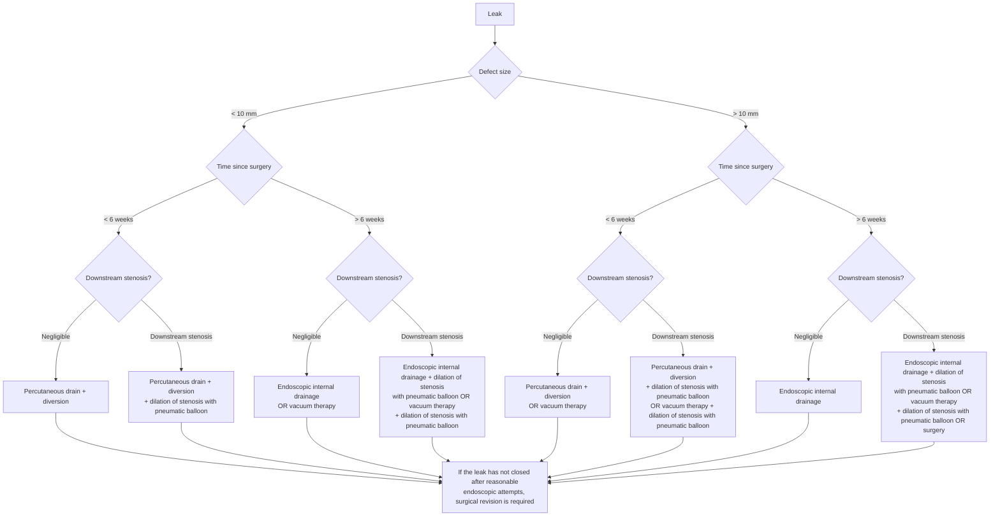

## Contents
- [[#Assessment]]
  - [[#Establishing the Diagnosis]]
  - [[#Severity Assessment]]
  - [[#Classification / Typing]]
- [[#Differential Diagnosis]]
- [[#Diagnostics]]
- [[#Therapeutics]]
  - [[#Management Algorithm]]
  - [[#Diversion with Stents]]
  - [[#Internal Drainage]]
  - [[#Salvage and Surgery]]
- [[#See Also]]
- [[#Sources]]

---

## Assessment

### Establishing the Diagnosis

- Leak through a surgical staple line after [[bariatric-surgery|bariatric/metabolic surgery]] — most commonly along the staple line of the **proximal stomach immediately below the angle of His** after sleeve gastrectomy (SG), and at the **gastrojejunal (GJ) anastomosis** after Roux-en-Y gastric bypass (RYGB).
- After SG, surgeons may leave a small fundal pouch or "dog ear" in this area to avoid stapling too close to the esophagus.
- **Mechanism — why it is a late, pressure-driven event, not a technical failure at the table:**
  - Ischemia from take-down of the short gastric arteries.
  - Mismatch in staple-height selection against the thinner wall of the gastric fundus.
  - **Downstream stenosis at the incisura angularis.**
  - High intraluminal pressure in a poorly compliant sleeve.
- Consequently **most leaks are not present at the completion of the operation** and develop over subsequent weeks, often in the setting of downstream stenosis. Therapy must target the propagating stenosis as well as the leak itself.
- [[aga-2021-early-complications-bariatric-surgery|American Gastroenterological Association (AGA) 2021]] does not define imaging or endoscopic diagnostic criteria for a leak; it is a management document.

### Severity Assessment

- No severity score exists for this diagnosis. The three variables that drive management are **defect size, interval since surgery, and the presence of downstream stenosis** (below).
- Response to therapy is judged by the **ability to tolerate diet** and a **decrease in the size of the perigastric cavity** — *not* by a decrease in the size of the leak orifice.
- Worsening clinical state with an enlarging cavity = gastric luminal pressure is not sufficiently lower than the perigastric collection, usually from persistent downstream stenosis.

### Classification / Typing

| Axis | Strata | Why it decides |
|---|---|---|
| **Defect size** | **<10 mm** vs **>10 mm** | Larger orifices favor septotomy over double pigtail stents |
| **Interval since surgery** | **<6 weeks** (early/acute) vs **>6 weeks** (mature) | Endoscopic approaches are generally **more successful for early and acute leaks**; attempts to close the leak site may not be ideal after 6 weeks, when it is mature and epithelialized, so internal drainage ("keeping the fistula open") **may be a superior approach** to closing the orifice |
| **Downstream stenosis** | **Negligible** vs **present** | Stenosis must be dilated or stented or internal drainage cannot work |

---

## Differential Diagnosis

*Workup of the postoperative syndromes this presents within: see [[gastric-outlet-obstruction]].*

Other early (<90 day) complications of bariatric/metabolic surgery ([[bariatric-surgery]] carries their management):

- **[[upper-gi-bleeding|Upper gastrointestinal hemorrhage]]** — staple lines, or an acute marginal ulcer after RYGB.
- **Acute luminal obstruction** — postoperative edema or hematoma at the anastomosis; severe torsion of the gastric lumen.
- **Functional stenosis** at the incisura angularis or proximal stomach — the precipitant and propagator of leaks, and a diagnosis in its own right.
- **Gastropleural fistula** — a contraindication to internal drainage as a sole strategy.
- Comorbid conditions mimicking or complicating the picture: nutrient deficiencies, infection, pulmonary embolism, depression and anxiety.

---

## Diagnostics

- **Flexible endoscopy is the principal method** of diagnosing and treating this and most other bariatric surgical complications.
- Endoscopy is appropriate in the **immediate, early, and late** postoperative periods, the decision turning on **hemodynamic stability** rather than the interval from surgery.
- Technique in the fresh postoperative stomach: **carbon dioxide insufflation**; minimize pressure along fresh staple lines when advancing into the small bowel; if the patient is critically ill or the endoscopist lacks experience with the scenario, perform the endoscopy **in the operating room with a surgeon present** (preferably the operating surgeon).
- **Perforation suspected during dilation and the view is obscured** → inject contrast to flood the stomach and assess for extravasation.
- Screen every patient for comorbid medical (nutrient deficiencies, infection, pulmonary embolism) and psychological (depression, anxiety) conditions — detail and thresholds on [[bariatric-surgery]].

---

## Therapeutics

**The goal is not initial closure of the leak site.** It is to make intragastric pressure lower than pressure in the perigastric collection so contents drain preferentially into the stomach and the leak closes by **secondary intention** ([[aga-2021-early-complications-bariatric-surgery]], Best Practice Advice 7). Oral contents likewise flow down the stomach rather than against a pressure gradient through the leak.

**Why primary closure fails.** Historically treatment aimed at percutaneous drainage (interventional radiology or surgical) followed by endoscopic closure of the leak — endoscopic suturing and over-the-scope clip (OTSC). **Recurrent leak is frequent when primary-closure methods are used in isolation**, for three reasons:

- **Poor integrity of the tissue surrounding the leak**, from ischemia and inflammation.
- **Difficulty obtaining a perpendicular endoscopic view** of the leak for optimal repair.
- **Failure to address high intraluminal pressure** caused by downstream gastric stenosis or anastomotic stricture.

Care is delivered **multidisciplinary** — interventional radiology and bariatric/metabolic surgery co-managing, with **daily communication** advised.

### Management Algorithm

*Figure 1 — endoscopic management of leaks following bariatric surgeries. ([[aga-2021-early-complications-bariatric-surgery]])*

- Dilation of the downstream stenosis uses large pneumatic balloons — full technique, sizes, and pressures on [[bariatric-surgery]]; general principles on [[pneumatic-dilation]].

### Diversion with Stents

- Self-expandable metallic stent (SEMS) plus percutaneous drainage is useful for **early** leaks: it permits early commencement of diet and, with longer stents, addresses downstream gastric stenosis.
- **Fully covered SEMS (FCSEMS):** must be secured to reduce migration; diversion may be suboptimal because the seal is not watertight and oral contents pass alongside the stent.
- **Partially covered SEMS (PCSEMS):** negate migration and leakage-alongside concerns, but removal is challenging. Use a **maximum diameter of 18 mm in the body** of the stent and a **maximum dwell of 3–4 weeks**.
- **PCSEMS removal:** invert the stent by grasping its terminal end and pulling with sufficient force; or place a larger-diameter (**20-mm body**) FCSEMS inside the PCSEMS and remove **both 1 week later**.
- Regardless of stent type, tissue invagination and ulceration at the distal aspect of the stent often cause poor tolerability.

### Internal Drainage

**Do not use internal drainage as a sole strategy when any of these is present:** a disorganized perigastric collection, high intragastric pressure secondary to downstream stenosis, or a gastropleural fistula. Once the cavity has emptied it contracts until obliterated.

Adjuncts before or alongside any of the three techniques:

- **Infected debris in the perigastric cavity** → necrosectomy expedites clinical improvement; perform **every 2 weeks until the cavity is clean**.
- **Percutaneous drain already in place and the patient is not responding** in a timely manner → aggressive lavage of the collection via the drain **every 4–6 hours**. A drain left on continuous free drainage lowers perigastric pressure and *prevents* internal drainage, so it must be **clamped and opened only for lavage**.
- Nutrition is provided **parenterally** during vacuum therapy.

| Technique | Materials / intervals | Best suited to |
|---|---|---|
| **Double pigtail stents** through the leak | **7F × 3 cm or 7F × 5 cm** (short, small-caliber, to limit gastric and extragastric damage); 1 or 2 stents depending on orifice size; **routine exchange every 2–4 weeks** until the cavity has contracted and is too small to accommodate a stent (**usually <2 cm**) | Small-caliber tract connecting the leak to the collection. Frequent exchanges also give repeat chances to treat downstream stenosis or a GJ anastomotic stricture |
| **Septotomy** (as for a Zenker's diverticulum) — cut the septum along the staple line to the **base** of the perigastric cavity to equalize gastric and perigastric pressures | **Cautery-enhanced through-the-scope (TTS) scissors** are the current best accessory; ideally the entire septum is cut in a single session. Bleeding at the staple line is rare; safe **as long as the cut does not extend beyond the base of the cavity** | Large leak orifices, and collections in immediate proximity to the stomach — may be superior to double pigtail stenting here |
| **Endoscopic vacuum therapy (EVT)** — sponge on a nasogastric tube, **success rates exceeding 80%** | **Intracavitary:** sponge placed through the leak orifice into the cavity; negative pressure drains infection and improves tissue perfusion; a traditional sponge must be **replaced every 3 days** to avoid adherence to tissue. **Handmade open-pore film drainage system** (gauze wrapped around a nasogastric tube, then wrapped in thin plastic film) is smaller, less adhesive, reduces tissue ingrowth and bleeding on removal, and is **replaced every 7 days**. **Intraluminal:** sponge sits in the gastric lumen overlying the leak — **avoids the need to dilate the leak orifice to place the sponge system when the defect is small** | Increasingly used. Offered in both the <6-week and >6-week arms of the algorithm above; AGA 2021 gives no head-to-head comparison against the other two techniques |

### Salvage and Surgery

- **Cardiac septal occluder** across the leak site where none of the above succeeds — experience is limited, and it is unclear whether the occluder will embed in the digestive tract as it does in the vascular one.
- **Offer surgery as well**, since by this point several weeks or months may have passed since leak diagnosis. Three commonly proposed revision operations: **fistulojejunostomy**, **conversion of SG to RYGB (without gastrectomy)**, and **total or near-total gastrectomy with esophagojejunal anastomosis**.
- **Direct surgical repair of the chronic leak site is rarely effective and is not advised.**
- If the leak has not closed after reasonable endoscopic attempts, **surgical revision is required**.

---

## See Also

[[bariatric-surgery]], [[obesity]], [[endoscopic-bariatric-therapies]], [[upper-gi-bleeding]], [[gastric-outlet-obstruction]], [[pneumatic-dilation]], [[endoscopic-management-of-perforation]], [[upper-endoscopy]]

---

## Sources

1. [[aga-2021-early-complications-bariatric-surgery|AGA Clinical Practice Update on Evaluation and Management of Early Complications After Bariatric/Metabolic Surgery: Expert Review (2021)]]
