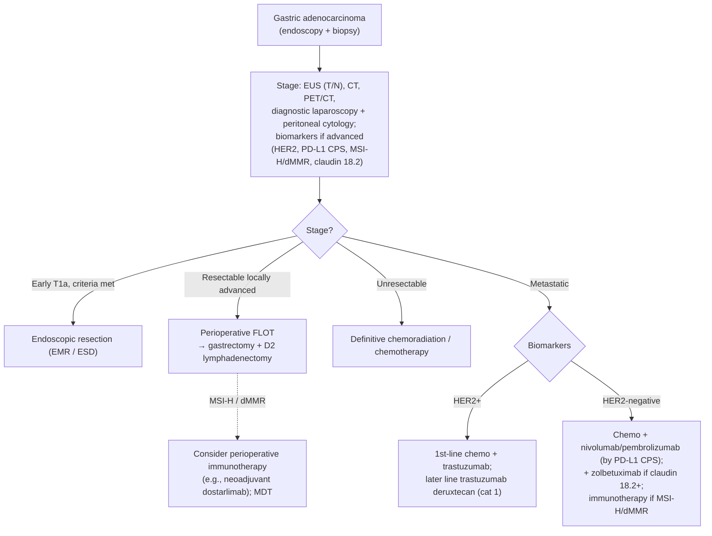

## Assessment

### Establishing the Diagnosis

Gastric adenocarcinoma often presents late with weight loss, early satiety, epigastric pain, anemia, or obstruction; alarm features warrant prompt [[upper-endoscopy|endoscopy]] with biopsy. Major risk factors include [[helicobacter-pylori-infection|H. pylori]] infection, the precursor cascade of [[atrophic-gastritis|atrophic gastritis]] → [[gastric-intestinal-metaplasia|intestinal metaplasia]] → dysplasia ([[gastric-premalignant-conditions|gastric premalignant conditions]]), smoking, high-salt diet, and hereditary syndromes including [[hereditary-diffuse-gastric-cancer|hereditary diffuse gastric cancer (CDH1)]]. Diagnosis is histologic via endoscopic biopsy. [[nccn-2026-gastric-cancer]]

### Classification / Typing

Histologic (Lauren) types — **intestinal** (gland-forming, associated with the H. pylori/atrophic-gastritis cascade) and **diffuse** (poorly cohesive/signet-ring, including linitis plastica; associated with CDH1 and a worse prognosis). Diffuse-type biology is relevant to systemic-therapy selection (e.g., diffuse-type EGJ adenocarcinoma did not benefit from added durvalumab in MATTERHORN).

### Staging

Staging combines [[endoscopic-ultrasound|EUS]] (T/N), CT, PET/CT, and **diagnostic laparoscopy with peritoneal cytology** for locally advanced disease to exclude occult peritoneal spread. For advanced/metastatic disease, biomarker testing — **HER2 (ERBB2), PD-L1 CPS, MSI-H/dMMR, and claudin 18.2** — is integral to treatment selection.

## Differential Diagnosis

*Workup: see [[dyspepsia]].*

[[gastric-premalignant-conditions|Gastric premalignant lesions]]/dysplasia, gastric lymphoma (MALT), [[gastrointestinal-stromal-tumor|GIST]] and other [[subepithelial-lesion|subepithelial lesions]], gastric [[gastroenteropancreatic-neuroendocrine-tumors|neuroendocrine tumors]], [[peptic-ulcer-disease|benign gastric ulcer]] (always biopsy to exclude malignancy), and metastatic disease.

## Diagnostics

Endoscopy with biopsy for histology; EUS for locoregional staging; CT/PET for distant disease; diagnostic laparoscopy + peritoneal cytology for locally advanced tumors. Biomarker panel (HER2, PD-L1 CPS, MSI-H/dMMR, claudin 18.2) on advanced/metastatic tumors directs systemic therapy.

- Biopsy adequacy: obtain **≥7 biopsy samples** of a gastric mass or the heaped-up edges of an ulcer suspicious for malignancy. [[asge-2015-gastric-premalignant]]

## Therapeutics

Stage-directed per [[nccn-2026-gastric-cancer]]:

- **Early (selected T1a):** endoscopic resection ([[polypectomy-emr|EMR]]/[[endoscopic-submucosal-dissection|ESD]]) when size/histology/depth criteria are met; otherwise gastrectomy.
- **Resectable locally advanced:** **perioperative chemotherapy (FLOT preferred)** with **gastrectomy and D2 lymphadenectomy**. Perioperative/neoadjuvant immunotherapy is considered for **MSI-H/dMMR** tumors (multidisciplinary; **dostarlimab** added as a neoadjuvant option). Gastrectomy remains standard even after radiologic/endoscopic complete response to neoadjuvant immunotherapy, outside prospective organ-preservation trials; if non-operative management is pursued for MSI-H/dMMR disease, immunotherapy continues for **at least 1 year**.
- **Unresectable:** definitive chemoradiation/chemotherapy.
- **Palliation of malignant gastric outlet obstruction:** endoscopically placed **self-expanding metal stent (SEMS)** for patients with poor performance status or nonoperable anatomy. [[asge-2015-gastric-premalignant]]
- **Metastatic:** HER2-overexpressing (IHC 3+, or IHC 2+ with ISH/FISH+) → add **trastuzumab** to first-line chemotherapy; HER2-negative → fluoropyrimidine + platinum with **nivolumab or pembrolizumab** by PD-L1 CPS, and **zolbetuximab** for claudin 18.2-positive tumors. Later line: **fam-trastuzumab deruxtecan** (category 1) for HER2-positive disease; ramucirumab-based regimens, taxanes, irinotecan, and trifluridine/tipiracil otherwise.

### NCCN Treatment Algorithm

*Algorithm — NCCN gastric cancer management, recreated in original form (not an NCCN figure). ([[nccn-2026-gastric-cancer]])*

## See Also

[[gastric-premalignant-conditions]], [[gastric-intestinal-metaplasia]], [[atrophic-gastritis]], [[helicobacter-pylori-infection]], [[hereditary-diffuse-gastric-cancer]], [[esophageal-cancer]], [[gastrointestinal-stromal-tumor]], [[gastroenteropancreatic-neuroendocrine-tumors]], [[upper-endoscopy]], [[endoscopic-ultrasound]]

---

## Sources

1. [[nccn-2026-gastric-cancer|NCCN Clinical Practice Guidelines in Oncology: Gastric Cancer (Version 3.2026)]]
2. [[asge-2015-gastric-premalignant|ASGE Guideline: The Role of Endoscopy in the Management of Premalignant and Malignant Conditions of the Stomach (2015)]]
