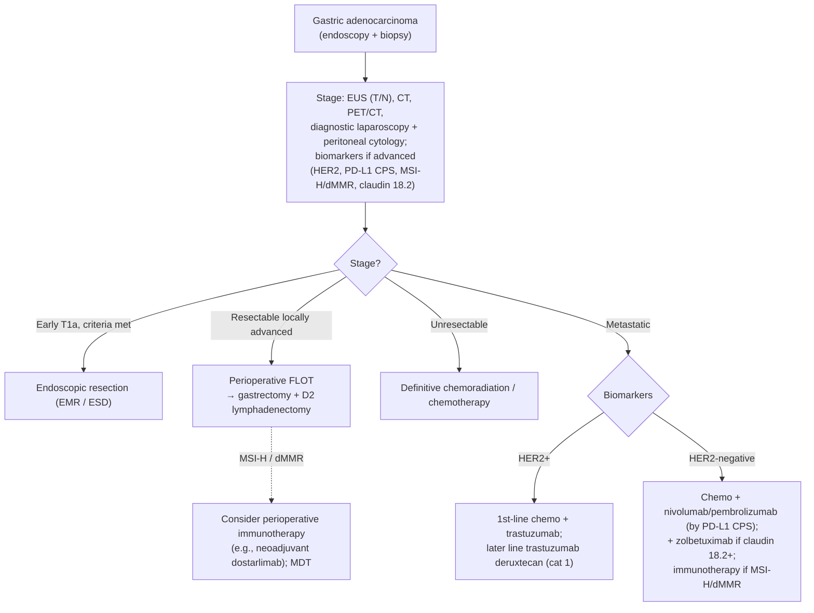

## Contents
- [[#Assessment]]
  - [[#Establishing the Diagnosis]]
  - [[#Severity Assessment (AJCC 8th ed. TNM staging)]]
  - [[#Classification / Typing]]
- [[#Differential Diagnosis]]
- [[#Diagnostics]]
  - [[#Biomarker Testing]]
- [[#Therapeutics]]
  - [[#NCCN Treatment Algorithm]]
- [[#See Also]]
- [[#Sources]]

## Assessment

### Establishing the Diagnosis

- **Presentation:** often late — weight loss, early satiety, epigastric pain, [[iron-deficiency-anemia|anemia]], obstruction. Alarm features warrant prompt [[upper-endoscopy|endoscopy]] with biopsy; diagnosis is histologic. [[nccn-2026-gastric-cancer]]
- **Risk factors:** [[helicobacter-pylori-infection|H. pylori]] infection; the precursor cascade of [[atrophic-gastritis|atrophic gastritis]] → [[gastric-intestinal-metaplasia|intestinal metaplasia]] → dysplasia ([[gastric-premalignant-conditions|gastric premalignant conditions]]); smoking; high-salt diet; hereditary syndromes including [[hereditary-diffuse-gastric-cancer|hereditary diffuse gastric cancer (CDH1)]]
- Who to screen and how to survey precursor lesions: see [[gastric-cancer-screening]]

### Severity Assessment (AJCC 8th ed. TNM staging)

Stage is assigned from the staging workup in [[#Diagnostics]]; for advanced/metastatic disease, biomarker status drives treatment selection ([[#Biomarker Testing]]).

Depth of invasion separates endoscopically curable disease (Tis/T1a mucosal) from disease requiring gastrectomy or systemic therapy. Stage groups differ for clinical (cTNM), pathologic (pTNM), and post-neoadjuvant (ypTNM) staging ([[nccn-2026-gastric-cancer]], AJCC 8th ed. 2017):

| T — primary tumor | Definition |
|---|---|
| Tis | Carcinoma in situ — intraepithelial tumor without invasion of the lamina propria; high-grade dysplasia |
| T1a | Invades **lamina propria or muscularis mucosae** |
| T1b | Invades **submucosa** |
| T2 | Invades **muscularis propria** (extension into the gastrocolic/gastrohepatic ligaments or omentum **without** perforation of the visceral peritoneum is still T3; perforation → T4) |
| T3 | Penetrates **subserosal connective tissue** without invasion of the visceral peritoneum or adjacent structures |
| T4a | Invades the **serosa** (visceral peritoneum) |
| T4b | Invades **adjacent structures/organs** (spleen, transverse colon, liver, diaphragm, pancreas, abdominal wall, adrenal, kidney, small intestine, retroperitoneum) |

*Intramural extension to duodenum or esophagus is **not** an adjacent structure — classify by the greatest depth of invasion at any of those sites.*

| N / M / G | Definition |
|---|---|
| N0 / N1 / N2 / N3 | No regional nodes / **1–2** nodes / **3–6** nodes / **≥7** nodes (**N3a** = 7–15; **N3b** = ≥16) |
| M0 / M1 | No distant metastasis / distant metastasis |
| G1 / G2 / G3 | Well / moderately / poorly differentiated or undifferentiated |

**Clinical stage groups (cTNM) — the stage that drives the pretreatment decision** (all M0 except IVB):

| Stage | cT / cN |
|---|---|
| 0 | Tis N0 |
| I | T1 N0; T2 N0 |
| IIA | T1 N1–3; T2 N1–3 |
| IIB | T3 N0; T4a N0 |
| III | T3 N1–3; T4a N1–3 |
| IVA | T4b, any N |
| IVB | Any T, any N, **M1** |

*Pathologic (pTNM) and post-neoadjuvant (ypTNM) groupings differ from the clinical groups — pTNM subdivides IA/IB and IIIA/IIIB/IIIC using N3a vs N3b. Use the pTNM/ypTNM tables in [[nccn-2026-gastric-cancer]] for resected specimens.*

### Classification / Typing

**Histologic (Lauren) types:**

- **Intestinal** — gland-forming; associated with the H. pylori/atrophic-gastritis cascade
- **Diffuse** — poorly cohesive/signet-ring, including linitis plastica; associated with CDH1 and a worse prognosis. Diffuse-type biology is relevant to systemic-therapy selection (e.g., diffuse-type EGJ adenocarcinoma did not benefit from added durvalumab in MATTERHORN)

**Siewert classification — assess in *all* adenocarcinomas involving the EGJ, because it decides which guideline governs treatment** [[nccn-2026-gastric-cancer]]:

| Siewert type | Tumor epicenter relative to the EGJ | Treated as |
|---|---|---|
| **I** | 1–5 cm **above** the EGJ (lower esophagus; often associated with [[barretts-esophagus\|Barrett esophagus]]) | [[esophageal-cancer\|Esophageal/EGJ cancer]] guidelines |
| **II** | Within **1 cm above to 2 cm below** the EGJ (true carcinoma of the cardia) | Esophageal/EGJ cancer guidelines |
| **III** | **2–5 cm below** the EGJ (subcardial), infiltrating the EGJ and lower esophagus | **Gastric** cancer guidelines |

## Differential Diagnosis

*Workup: see [[dyspepsia]].*

[[gastric-premalignant-conditions|Gastric premalignant lesions]]/dysplasia, [[gastric-malt-lymphoma|gastric lymphoma (MALT)]], [[gastrointestinal-stromal-tumor|GIST]] and other [[subepithelial-lesion|subepithelial lesions]], gastric [[gastroenteropancreatic-neuroendocrine-tumors|neuroendocrine tumors]], [[peptic-ulcer-disease|benign gastric ulcer]] (always biopsy to exclude malignancy), and metastatic disease.

## Diagnostics

- **[[upper-endoscopy|EGD]] with biopsy** — establishes histology. Biopsy adequacy: obtain **≥7 biopsy samples** of a gastric mass or the heaped-up edges of an ulcer suspicious for malignancy. [[asge-2015-gastric-premalignant]]
- **[[endoscopic-ultrasound|EUS]]** — locoregional T and N stage.
- **CT + PET/CT** — distant disease.
- **Diagnostic laparoscopy with peritoneal cytology** — in locally advanced disease, to exclude occult peritoneal spread before committing to a curative-intent plan. [[nccn-2026-gastric-cancer]]

### Biomarker Testing

Every systemic-therapy recommendation below is conditional on one of these cutoffs, so the cutoff is the decision — what counts as "positive" ([[nccn-2026-gastric-cancer]]):

| Biomarker | "Positive" defined as | When to test |
|---|---|---|
| **HER2 (ERBB2)** | **IHC 3+**, or **IHC 2+ with ISH/FISH-positive** | Advanced/metastatic disease |
| **PD-L1 (CPS)** | **CPS ≥1**. CPS = PD-L1–stained cells (tumor cells, lymphocytes, macrophages) ÷ total viable tumor cells × 100. **≥100 tumor cells** must be present for the slide to be evaluable | Universal IHC testing in all newly diagnosed patients who are candidates for a PD-1/PD-L1 inhibitor; CLIA-approved lab, companion diagnostic assay |
| **TAP score** | **TAP ≥1%** — visual determinant of positivity (stained tumor + immune cells ÷ whole tumor area) rather than cell counting. **CPS and TAP have high concordance and may be used interchangeably** (v3.2026), so TAP ≥1% satisfies the CPS ≥1 gate. TPS is **not** used in these guidelines | As for CPS |
| **Claudin 18.2 (CLDN18.2)** | **≥75% of viable tumor cells** with **moderate-to-strong membranous staining (2+ or 3+ intensity)** by qualitative IHC on FFPE tissue | Untreated unresectable locally advanced, recurrent, or metastatic disease when **zolbetuximab** is being considered |
| **MSI-H / dMMR** | By IHC/PCR/NGS as per assay | Advanced disease (directs immunotherapy); also triggers consideration of perioperative immunotherapy |

## Therapeutics

Stage-directed per [[nccn-2026-gastric-cancer]]:

- **Early (selected T1a) — ESD vs EMR vs surgery is decided by differentiation, ulceration, histologic type, and size** ([[asge-2023-esd]], all recommendations Conditional / low quality):

| Lesion | Recommendation |
|---|---|
| Well- or moderately differentiated, **nonulcerated, intestinal-type** early GAC **<20 mm** | **No recommendation for or against** [[endoscopic-submucosal-dissection\|ESD]] vs [[endoscopic-mucosal-resection\|EMR]] — either is acceptable |
| Well- or moderately differentiated, nonulcerated, intestinal-type early GAC **20–30 mm** | **ESD over EMR** (en-bloc resection) |
| Well- or moderately differentiated, intestinal-type early GAC **≤30 mm** | **Against surgery** — resect endoscopically |
| **Poorly differentiated** early GAC, **any size** | **Surgical evaluation over endoscopic approaches** |

  The **absolute** ESD indication is mucosal (T1a) adenocarcinoma/HGD, **intestinal type, ≤2 cm**; expanded criteria add intestinal-type G1/G2 of any size without ulceration, intestinal-type G1/G2 with submucosal invasion <500 µm, intestinal-type G1/G2 ≤3 cm with ulceration, and diffuse-type G3/G4 ≤2 cm without ulceration. [[asge-2023-esd]]
- **Resectable locally advanced:** **perioperative chemotherapy (FLOT preferred)** with **gastrectomy and D2 lymphadenectomy**. Perioperative/neoadjuvant immunotherapy is considered for **MSI-H/dMMR** tumors (multidisciplinary; **dostarlimab** added as a neoadjuvant option). Gastrectomy remains standard even after radiologic/endoscopic complete response to neoadjuvant immunotherapy, outside prospective organ-preservation trials; if non-operative management is pursued for MSI-H/dMMR disease, immunotherapy continues for **at least 1 year**.
- **Unresectable:** definitive chemoradiation/chemotherapy.
- **Palliation of malignant [[gastric-outlet-obstruction|gastric outlet obstruction]]:** endoscopically placed **self-expanding metal stent (SEMS)** for patients with poor performance status or nonoperable anatomy. [[asge-2015-gastric-premalignant]]
- **Metastatic / unresectable — biomarker-directed** (positivity cutoffs in [[#Biomarker Testing]]). Backbone is a fluoropyrimidine + platinum (**oxaliplatin preferred over cisplatin** — lower toxicity):

| Biomarker result | First-line addition | Category |
|---|---|---|
| **HER2-positive** | **Trastuzumab** added to fluoropyrimidine + platinum | Category 1 with cisplatin |
| HER2-positive **and CPS ≥1** | Trastuzumab **+ pembrolizumab** | Category 1 |
| **HER2-negative, CPS ≥1** | Add **nivolumab**, **pembrolizumab**, or **tislelizumab** | Category 2A at CPS ≥1; **category 1 only at CPS ≥5** |
| **HER2-negative, CLDN18.2-positive** | Add **zolbetuximab** | Category 1 |
| **MSI-H/dMMR** (independent of PD-L1) | Pembrolizumab, dostarlimab, or nivolumab + ipilimumab — alone or with chemotherapy | — |

  Later line: **fam-trastuzumab deruxtecan** (category 1) for HER2-positive disease; ramucirumab-based regimens, taxanes, irinotecan, and trifluridine/tipiracil otherwise.

### NCCN Treatment Algorithm

*Algorithm — NCCN gastric cancer management, recreated in original form (not an NCCN figure). ([[nccn-2026-gastric-cancer]])*

## See Also

[[gastric-premalignant-conditions]], [[gastric-intestinal-metaplasia]], [[atrophic-gastritis]], [[gastric-cancer-screening]], [[helicobacter-pylori-infection]], [[hereditary-diffuse-gastric-cancer]], [[juvenile-polyposis-syndrome]], [[peutz-jeghers-syndrome]], [[familial-adenomatous-polyposis]], [[lynch-syndrome]], [[esophageal-cancer]], [[esophageal-adenocarcinoma]], [[gastric-malt-lymphoma]], [[barretts-esophagus]], [[gastrointestinal-stromal-tumor]], [[subepithelial-lesion]], [[gastroenteropancreatic-neuroendocrine-tumors]], [[endoscopic-submucosal-dissection]], [[endoscopic-mucosal-resection]], [[gastric-outlet-obstruction]], [[dyspepsia]], [[upper-endoscopy]], [[endoscopic-ultrasound]], [[iron-deficiency-anemia]]

---

## Sources

1. [[nccn-2026-gastric-cancer|NCCN Clinical Practice Guidelines in Oncology: Gastric Cancer (Version 3.2026)]]
2. [[asge-2015-gastric-premalignant|ASGE Guideline: The Role of Endoscopy in the Management of Premalignant and Malignant Conditions of the Stomach (2015)]]
3. [[asge-2023-esd|ASGE Guideline: ESD for Early Esophageal and Gastric Cancer (2023)]]
