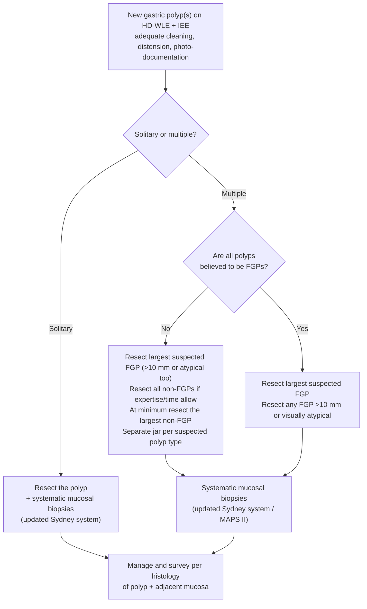

Raised **epithelial lesions of the gastric mucosa** arising from mucosal hyperplasia, adenoma, fundic gland proliferation, or enterochromaffin-like (ECL) cell proliferation. Core principle: evaluate **both the polyp and the surrounding/background mucosa**, since field changes ([[helicobacter-pylori-infection|H. pylori]] gastritis, [[atrophic-gastritis|autoimmune/atrophic gastritis]], [[gastric-intestinal-metaplasia|GIM]]) drive malignant risk and surveillance.

## Contents
- [[#Assessment]]
  - [[#Establishing the Diagnosis]]
  - [[#Severity Assessment]]
  - [[#Classification / Typing]]
- [[#Differential Diagnosis]]
- [[#Diagnostics]]
- [[#Therapeutics]]
  - [[#Resection]]
  - [[#Management Algorithm — Newly Detected Polyps]]
  - [[#Background Mucosa and Acid Suppression]]
  - [[#Surveillance]]
- [[#See Also]]
- [[#Sources]]

## Assessment

### Establishing the Diagnosis

- **Resect at index endoscopy.** All newly detected **solitary** polyps should be resected at the index exam — diagnostic *and* therapeutic in one step (rather than biopsy-then-return).
- **Histology is the diagnosis** — polyps are biopsied or resected for definitive histopathology; endoscopic appearance alone cannot distinguish dysplastic/early cancerous polyps.
- **Systematic mucosal sampling** at the index exam whenever a solitary polyp or a suspected non-FGP is seen: **updated Sydney System** or **MAPS II** protocol. Sydney zones — antrum lesser (A1) and greater (A2) curves, incisura (A3), body lesser (B1) and greater (B2) curves; biopsies may be directed by appearance within each zone; **≥2 jars** (antrum, body) plus a **separate jar for any targeted lesion**. The topographic pattern of inflammation/atrophy/GIM distinguishes H. pylori-related from autoimmune gastritis.
- **H. pylori status** in every case: biopsy-based when sampling is available; otherwise **serology, urea breath test, or stool antigen** ([[test-and-treat|test and treat]]). ⚠ The serology option is narrow and conflicts with the H. pylori guideline: [[helicobacter-pylori-infection|ACG 2024]] recommends **against serology in low-prevalence populations** absent a high pre-test probability, and treats only a **non-serological** positive as an indication to treat. AGA 2026 is the newer source and permits serology **only when biopsy sampling is unavailable** — so prefer UBT or stool antigen whenever either is obtainable.
- **Labs are of limited value:** gastrin adds nothing diagnostically in most polyp patients; pepsinogen I:II ratio is unavailable in most US labs; **no noninvasive biomarker** screens or monitors gastric polyps/dysplasia or separates low- from high-risk patients. Serum gastrin + parietal cell antibodies belong to the autoimmune-gastritis workup (existing autoimmune disease, unexplained [[iron-deficiency-anemia|iron-deficiency anemia]], pernicious anemia, family history).
- **Miss rate matters:** neoplastic lesions missed at [[upper-endoscopy|upper endoscopy]] and diagnosed as cancer within 3 years — **4.7%–11.3%**; subtle mucosal lesions surrounding GIM predict interval early cancer.

### Severity Assessment

Risk is driven by four inputs, not by the polyp's name alone:

| Input | Higher risk |
|---|---|
| **Size** | >10 mm (surveillance/PPI decisions); **>20 mm** (predicts early gastric cancer in adenomas; refer for advanced resection) |
| **Dysplasia** | Low-grade → 1-y follow-up; high-grade → 6-mo follow-up (see [[#Surveillance]]) |
| **Background mucosa** | AG and/or GIM confirmed on adjacent mucosa → surveillance advised |
| **Burden / syndromic context** | **Mucosal carpeting** = FGPs from fundus to antrum without intervening normal mucosa (>20 polyps); [[familial-adenomatous-polyposis\|FAP]]/GAPPS |

- **Multiple FGPs at age 20–40 (or in childhood) in a patient not on a PPI → consider [[familial-adenomatous-polyposis|FAP]]** (>80% of syndromic patients have FGPs, typically within the first 3 decades; syndromic FGPs are smaller, morphologically subtler, and not associated with parietal cell hyperplasia). FAP's phenotypic spectrum is broader than classic massive colonic polyposis — consider genetic evaluation.
- **Anemia** occurs more often with GHPs, GAs, or G-NETs.

### Classification / Typing

Different polyp types **coexist** in 2%–3% of patients (FGP is the most common synchronous finding; GAs often accompany GHPs). Each type carries a characteristic background mucosa — **if multiple types are present, manage per the highest-grade polyp**.

| Type | Prevalence | Site / number / appearance | Background / association | Malignant potential |
|---|---|---|---|---|
| **Fundic gland polyp (FGP)** | 47%–77% of polyps where GHPs are uncommon | Body/fundus; multiple, sessile, usually <1 cm, glassy surface | [[proton-pump-inhibitors\|PPI]]-associated or sporadic; FAP/GAPPS; surrounding mucosa usually normal, non-inflamed | Dysplasia **<1% sporadic**; **25%–46%** (table: up to 48%) in FAP-associated; high in GAPPS. Adenocarcinoma progression in up to 15% of FAP cases; LGD→HGD/cancer progression slow (~4% over mean 6 y in FAP) |
| **Gastric hyperplastic polyp (GHP)** | 17%–55% of polyps; common where H. pylori is prevalent | Antrum > body; single or multiple; sessile or pedunculated, <20 mm; surface erosions if larger | Chronic gastritis (H. pylori-related or autoimmune) | Dysplasia ~**4%**; malignant transformation **0.8%–10%**; neoplastic polyps tend to be **>20 mm**. Adjacent mucosa may harbor dysplasia at similar or higher rates than the polyp |
| **Gastric adenoma (GA)** | 1%–10% of polyps | Antrum > body; usually single, flat or sessile, <20 mm | Chronic gastritis (H. pylori-related or autoimmune) | [[gastric-adenocarcinoma\|Adenocarcinoma]] precursor — progression **3%–4% low-grade**, **5%–30% high-grade**; risk ↑ >20 mm and with villous histology. Variants: intestinal (56%) and foveolar (41%) most common. **Exception:** foveolar-type "raspberry-like" GA in the H. pylori-naïve stomach — very low to nonexistent risk |
| **Pyloric gland adenoma** | <3% of polyps | Body > antrum; usually single; sessile, pedunculated, or mass-like; **1–10 cm** | Autoimmune gastritis; 2nd most common polyp in FAP; also [[lynch-syndrome\|Lynch syndrome]] and [[juvenile-polyposis-syndrome\|juvenile polyposis]] | High-grade dysplasia in **42%**; progression **12%–30%** (adenocarcinoma reported 12%–47%). ↑ with size, tubulo-villous architecture, autoimmune gastritis |
| **Oxyntic gland adenoma** | Rare | Body; polypoid or raised-flat; solitary; 2–20 mm, typically <10 mm | Adjacent mucosa usually normal | Slow-growing low-grade malignancy; large polyps and mucous-neck-cell differentiation more likely to progress; endoscopic resection usually sufficient |
| **[[gastroenteropancreatic-neuroendocrine-tumors\|G-NET]]** | Up to 2% of polyps | Body > antrum. Types 1/2: polyps/nodules, sharply outlined, ± central depression, often multiple yellowish nodules; type 3 may be multifocal or solitary. **Size: type 1 ≤2 cm, type 2 ≤1 cm, type 3 >2 cm** | **Type 1** (>70% of G-NETs): body atrophy/GIM with ECL-cell proliferation ([[atrophic-gastritis\|autoimmune gastritis]], pernicious anemia, achlorhydria, hypergastrinemia). **Type 2:** MEN-1/gastrinoma (Zollinger-Ellison), hypertrophic mucosa with ECL hyperplasia. **Type 3:** normal surrounding mucosa, no hypergastrinemia | Limited metastatic rate for types 1–2 (type 2 has high recurrence risk); **type 3 (~15% of G-NETs)** larger, mass-like, **worst prognosis**. Lesions >2 cm carry higher metastatic risk |
| **Hamartomatous polyps** — [[juvenile-polyposis-syndrome\|juvenile]], [[peutz-jeghers-syndrome\|Peutz–Jeghers]], [[cowden-syndrome\|Cowden]], Cronkhite–Canada | Rare | Juvenile: body > antrum, pedunculated/sessile, 2–20 mm. PJ: any site, lobulated on a short broad stalk, 1–3 cm. Cowden: small sessile, multiple. Cronkhite–Canada: sessile/flat with diffuse mucosal thickening | Polyps elsewhere in the GI tract; PJ skin changes; Cowden esophageal glycogenic acanthosis + colorectal polyps; Cronkhite–Canada alopecia, nail atrophy, hyperpigmentation, vitiligo | Juvenile up to **14%** (higher in polyposis); PJ **2%–3%**; Cowden low; Cronkhite–Canada very rare. Histologically similar to GHP — clinical + endoscopic correlation required |

**Epidemiology:** US prevalence ~**6.35%** of patients biopsied at endoscopy (77% FGP, 17% GHP, 0.69% GA, 0.1% inflammatory fibroid) and **7.72% FGP / 1.79% GHP / 0.09% GA / 0.06% type-1 G-NET** in a later series; 70%–94% of Western gastric polyps are FGPs or GHPs. Subtypes have shifted toward **sporadic FGPs** as H. pylori prevalence falls and PPI use rises (Beijing 2004→2013: GHP 65%→15%, FGP 19%→77%). GA/GHP/G-NET prevalence rises with age; **FGP prevalence falls after age 60**. FGP risk is **inversely** associated with gastric atrophy, H. pylori, and GIM, and positively with [[gerd|GERD]] and PPI use.

## Differential Diagnosis

*Workup of a gastric bump that arises **beneath** the mucosa (normal overlying mucosa, no epithelial polyp) belongs to [[subepithelial-lesion]]; this page covers raised **epithelial/mucosal** polyps.*

- Between polyp types — the differential is the [[#Classification / Typing]] table: FGP vs GHP vs GA (intestinal, foveolar, pyloric gland, oxyntic gland variants) vs G-NET vs hamartomatous polyp.
- **Hamartomatous polyp vs GHP** — considerable histologic overlap; distinguish by clinical and endoscopic context (polyps elsewhere, syndromic stigmata).
- **Raspberry-like foveolar adenoma in the H. pylori-naïve stomach** — looks neoplastic, behaves benignly.
- Background-mucosa disease driving the polyps: [[helicobacter-pylori-infection|H. pylori gastritis]], [[atrophic-gastritis|autoimmune/atrophic gastritis]], [[gastric-intestinal-metaplasia|GIM]], reactive gastropathy — see [[gastric-premalignant-conditions]].
- Polyposis syndromes: [[familial-adenomatous-polyposis|FAP]], GAPPS, [[juvenile-polyposis-syndrome|juvenile polyposis]], [[peutz-jeghers-syndrome|Peutz–Jeghers]], [[cowden-syndrome|Cowden]], Cronkhite–Canada.

## Diagnostics

- **HD-WLE** with adequate distension, mucus clearance, and **photo-documentation** of gastric landmarks, lesions, and mucosal alterations. HD-WLE **alone is suboptimal** for atrophy/GIM and for distinguishing dysplastic/early cancerous polyps.
- **Image-enhanced endoscopy (IEE) / virtual chromoendoscopy** — NBI, blue laser imaging (BLI), linked color imaging (LCI), ± magnification. Improves detection and characterization of dysplastic lesions and abnormal mucosa; **LCI highlights the purple color of GIM**. Guideline-endorsed for assessing/staging atrophic and metaplastic change and targeting dysplasia — but underused in the US.
- **Simplified NBI classification of abnormal gastric mucosa** (Pimentel-Nunes validation study):

| Pattern | Appearance | Histology | Performance |
|---|---|---|---|
| **A** | Regular vessels with circular mucosa | Normal | Accuracy 83% (95% CI 75%–90%) |
| **B** | Tubulo-villous mucosa | GIM | Accuracy 84%; LR+ 4.75 |
| **C** | Irregular vessels and mucosa | Dysplasia | Accuracy 95% (95% CI 90%–99%); LR+ 44.33 |

- **"Light-blue crest" sign** — moderate reliability (κ 0.49) but **87% specific** for GIM. **Variable vascular density** is the best feature for H. pylori-related gastritis (accuracy 70%).
- **Vessel-plus-surface classification** for early gastric cancer: irregular microvascular and/or microsurface pattern **plus a demarcation line**. Magnifying BLI vs NBI — demarcation line sensitivity 96.1% vs 98.1%; irregular microvessels 95.1% vs 96.2%; irregular microsurface seen in 97.1% (BLI) vs 78.8% (NBI).
- **Kimura–Takemoto** (atrophy) and **EGGIM** (GIM) classifications exist but are not routinely applied in the US; interobserver reliability is moderate and experience-dependent. Until IEE skills are widespread, **meticulous inspection plus random and targeted biopsies per established protocols remain essential**. AI-assisted IEE is emerging ([[artificial-intelligence-endoscopy]]).
- ⚠ **Figure gap:** the source's Figure 1 (representative HD-WLE/IEE + histology images of each polyp type) has **not** been captured — figure extraction tooling (PyMuPDF/`pdftoppm`) is unavailable in this environment. Endoscopic-appearance images are required by the Style Guide for a look-and-diagnose entity; flagged for a pass with working tooling.

## Therapeutics

### Resection

Technique follows **size**, plus presumed pathology, location, and endoscopist expertise:

| Polyp size | Technique |
|---|---|
| **≤3 mm** | Biopsy (cold forceps) **or** cold snare [[polypectomy\|polypectomy]] |
| **4–9 mm** | Cold snare polypectomy **or** [[endoscopic-mucosal-resection\|EMR]] |
| **≥10 mm** | EMR or [[endoscopic-submucosal-dissection\|ESD]], depending on size, location, appearance — consider referral to an endoscopist with resection expertise |
| **>20 mm** | **Referral advised** to an endoscopist experienced in advanced resection (a >20 mm pedunculated polyp can still come out en bloc by EMR) |

- **Forceps have a hard ceiling:** polyps **≥4 mm should not be resected with forceps**; in polyps ≥5 mm, forceps cannot reliably establish underlying neoplasia (4 prospective studies). Cold-forceps use ≤3 mm is extrapolated from colon data (noninferior to cold snare for complete resection of ≤3 mm colonic polyps, and faster).
- **ESD is reserved** for polyps in which neoplasia is diagnosed or strongly suspected (Korean series of 282 gastric adenomas: complete resection **96%**, bleeding **1.4%**, no perforations; **size >20 mm predicted early gastric cancer**).
- **Adverse events:** EMR bleeding ~**7%** (nearly all managed endoscopically), perforation rare; cold snare noninferior to EMR for adverse events and safe/effective for 3–8 mm FGPs.
- **Tattooing is not routine** for diagnostic or therapeutic gastric polypectomy — optional for the site of an incompletely resected large polyp, a suspected malignant polyp, or when surgery/EMR/ESD follow-up is planned.
- **Multiple polyps of varied size:** resect the **largest**; sample or resect the smaller ones. **Separate specimen jars per suspected polyp type.**
- *Older thresholds (superseded where they conflict — [[asge-2015-gastric-premalignant|ASGE 2015]]):* polypectomy when feasible for **FGP ≥1 cm, hyperplastic ≥0.5 cm, adenoma of any size**, with systematic sampling of surrounding nonpolypoid mucosa when multiple hyperplastic/adenomatous polyps are present.

### Management Algorithm — Newly Detected Polyps

*Applies to countries with low H. pylori prevalence and common PPI use (e.g. the US), in patients without a known genetic cancer syndrome.*

*Figure — proposed management strategy for newly visualized gastric polyps, recreated from Figure 2 of [[aga-2026-gastric-polyps]] (figure screenshot unavailable — see figure gap above).*

### Background Mucosa and Acid Suppression

- **[[test-and-treat|Test and treat]] [[helicobacter-pylori-infection|H. pylori]] in all patients with adenomatous or hyperplastic polyps.** Eradication is associated with **59% (95% CI 43%–75%) reduction in GHP prevalence after treatment** and **79% (95% CI 72%–86%) after successful eradication**, and with regression of GHPs, improvement in atrophic gastritis, and lower gastric cancer risk.
- **Suspected GIM or atrophic gastritis in the surrounding mucosa → targeted biopsies per existing protocols** (see [[gastric-intestinal-metaplasia]], [[gastric-premalignant-conditions]]).
- **PPIs need not be stopped** when fundic gland hyperplasia-related polyps are documented in a patient with a **valid** PPI indication; for patients **without** a clear indication, deprescribing is beneficial and should be systematic. PPI use carries a **1.5- to 2.5-fold** increase in FGP risk (**up to 5-fold with ≥12 months** of use; another meta-analysis 1.43 [1.24–1.64] fixed-effects, 2.45 [1.24–4.83] random-effects); some association is confounded by age, sex, and endoscopy indication.
- **[[potassium-competitive-acid-blockers|P-CABs]] behave similarly** — VISION trial: hyperplastic polyp prevalence **3.7% → 14.7% over 3 years** after starting a P-CAB; >3-fold higher HP risk with P-CAB use >1 year; case reports of regression after discontinuation.

### Surveillance

Keyed to **polyp histology + size + dysplasia + background mucosa**. If multiple polyp types are present, follow the advice for the **highest-grade** polyp.

| Polyp histology / characteristics | Endoscopic surveillance interval | Other management |
|---|---|---|
| **FGP** <10 mm, no dysplasia \* | None | — |
| FGP >10 mm, no dysplasia \* | **1 y** | Discontinue PPI therapy |
| FGP mucosal carpeting (>20 polyps) \* | **1 y** | Discontinue PPI; consider evaluation for familial polyposis syndrome |
| FGP with dysplasia \* | **HGD 6 mo; LGD 1 y** | Evaluate for familial polyposis syndrome |
| **Hyperplastic** <10 mm, no dysplasia | Not clearly indicated if all polyps resected | Ensure H. pylori negativity; if gastric premalignant conditions present, follow AGA advice |
| Hyperplastic >10 mm, no dysplasia | **1 y** | (Resection advised for GHPs >10 mm) |
| Hyperplastic with dysplasia | **HGD 6 mo; LGD 1 y** | |
| **Adenoma** (intestinal-type, pyloric gland, oxyntic gland) | **HGD every 6 mo; LGD every 1 y; then annually thereafter** | Ensure complete removal of the index adenoma; consider referral for advanced resection; ensure H. pylori negativity; follow AGA advice if premalignant conditions present |
| **G-NET type 1 or 2** | **<2 cm: every 1–2 y.** ≥2 cm: refer to an oncologic center with expertise | If autoimmune gastritis present, follow existing AGA advice; if type 2, evaluate for the source of inappropriate gastrin production |
| **G-NET type 3** | Referral to an oncologic center with expertise | — |

\* Advice pertains to patients **without** a known genetic cancer syndrome.

- **Incomplete resection or biopsy-only:** repeat endoscopy within **3 months** (high-grade dysplasia) or **6 months** (low-grade dysplasia).
- **Adjacent mucosa with GIM and/or atrophic gastritis** → endoscopic surveillance advised. Targeted biopsies **every 3 years** are considered for persistent H. pylori infection, advanced atrophic gastritis with **incomplete** GIM, or mild/focal GIM with a **family history of gastric cancer**; biopsies from **antrum and corpus at a minimum**. Surveillance duration is undetermined.
- ⚠ **Do not intensify surveillance for ethnicity or family history alone** — although both associate with gastric cancer risk, the frequency of surveillance should not be altered on those grounds; there is little evidence the association is mediated by anything other than gastric mucosal status. (Population-level risk stratification for screening lives on [[gastric-cancer-screening]].)

## See Also

[[gastric-intestinal-metaplasia]], [[atrophic-gastritis]], [[gastric-premalignant-conditions]], [[gastric-adenocarcinoma]], [[gastric-cancer-screening]], [[helicobacter-pylori-infection]], [[familial-adenomatous-polyposis]], [[upper-endoscopy]], [[polypectomy]], [[endoscopic-mucosal-resection]], [[endoscopic-submucosal-dissection]], [[gastroenteropancreatic-neuroendocrine-tumors]], [[subepithelial-lesion]], [[test-and-treat]], [[proton-pump-inhibitors]], [[potassium-competitive-acid-blockers]]

---

## Sources

1. [[aga-2026-gastric-polyps|AGA Clinical Practice Update on Management of Gastric Polyps: Expert Review]]
2. [[asge-2015-gastric-premalignant|ASGE Guideline: The Role of Endoscopy in the Management of Premalignant and Malignant Conditions of the Stomach (2015)]]
