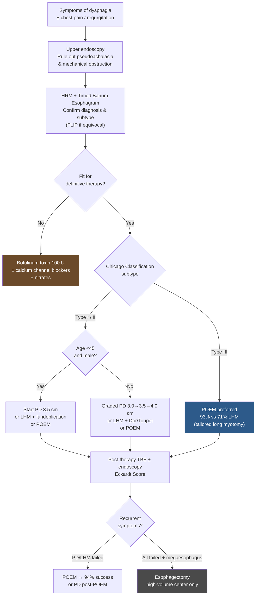

# Achalasia

## Contents
- [[#Assessment]]
  - [[#Establishing the Diagnosis]]
  - [[#Classification / Typing (Chicago Classification — clinically essential)]]
- [[#Differential Diagnosis]]
- [[#Diagnostics]]
  - [[#HRM (High-Resolution Manometry)]]
  - [[#Timed Barium Esophagram (TBE)]]
  - [[#Upper Endoscopy]]
  - [[#FLIP (Functional Lumen Imaging Probe)]]
  - [[#Eckardt Score (ES)]]
- [[#Therapeutics]]
  - [[#Treatment Algorithm]]
  - [[#Pneumatic Dilation (PD)]]
  - [[#Laparoscopic Heller Myotomy (LHM)]]
  - [[#Per-Oral Endoscopic Myotomy (POEM)]]
  - [[#Botulinum Toxin Injection]]
  - [[#Pharmacotherapy]]
  - [[#Esophagectomy]]
  - [[#Post-Therapy Monitoring and Retreatment]]
  - [[#Cancer Surveillance]]

---

Esophageal motility disorder characterized by **aberrant peristalsis and insufficient LES relaxation** due to selective loss of inhibitory neurons in the myenteric plexus. Excitatory neurons (ACh) are preserved; inhibitory neurons (VIP, NO) are lost → unopposed cholinergic activity → failure of LES relaxation and aperistalsis. Incurable; all treatments are palliative.

- Incidence: 0.03–1.63/100,000/yr; prevalence 1.8–12.6/100,000
- 20,000–40,000 affected in the US; equal sex distribution; peak onset age 30–60

---

## Assessment

### Establishing the Diagnosis

**Clinical presentation:**
- Progressive dysphagia to both solids and liquids (key distinguishing feature from mechanical obstruction)
- Regurgitation of undigested food
- Chest pain, heartburn (27–42% — frequently misdiagnosed as GERD)
- Weight loss / nutritional deficiency

> **Recommendation:** Patients suspected of GERD who do not respond to acid-suppressive therapy should be evaluated for achalasia. (Strong; Very low evidence)

**Always perform upper endoscopy first** to rule out pseudoachalasia from obstructing mass (especially in elderly with significant short-term weight loss → cross-sectional imaging ± EUS).

**Diagnostic criteria (any 2 of 3):**
1. Endoscopic: retained saliva, puckered/tight GEJ requiring pressure to traverse, dilated esophagus
2. Barium esophagram: dilated esophagus with "bird beaking" at GEJ, retained barium at 1–5 min (TBE)
3. HRM: elevated integrated relaxation pressure (IRP) + absent/disordered peristalsis — **gold standard**

> **Recommendation:** Use esophageal pressure topography (HRM) over conventional line tracing for the diagnosis of achalasia. (Strong; High evidence)
> - HRM has superior inter-rater agreement (k=0.57 vs 0.32) and 3.4x lower odds of incorrect diagnosis vs conventional manometry

**FLIP (Functional Lumen Imaging Probe):** Approved tool measuring EGJ distensibility index. Complementary in equivocal cases or patients who cannot tolerate manometry. Performed during endoscopy under sedation. All 70 manometry-confirmed achalasia patients had reduced EGJ distensibility on FLIP. Role still evolving.

### Classification / Typing (Chicago Classification — clinically essential)

> **Recommendation:** Classify achalasia subtypes to inform prognosis and treatment choice. (Conditional; Low evidence)

All subtypes share **impaired EGJ relaxation**; distinguished by esophageal body pattern:

| Subtype | Prevalence | Pattern | Outcomes | Treatment Implication |
|---------|-----------|---------|----------|----------------------|
| **Type I** | 20–40% | 100% aperistalsis, **no** panesophageal pressurization | Good (LHM 81%, PD comparable) | PD, LHM, or POEM |
| **Type II** | 50–70% (most common) | 100% aperistalsis + **panesophageal pressurization >30 mmHg** | Best outcomes of all subtypes | PD, LHM, or POEM — any works well |
| **Type III** | 5% (least common) | **Spastic contractions** ± panesophageal pressurization | Worst with LES-only therapies (LHM 71%, PD 40%) | POEM preferred (93% success); tailored long myotomy |

Disease progresses: Type III → Type II → Type I as esophagus dilates over time.

---

## Differential Diagnosis

- **Pseudoachalasia** — malignancy at GEJ (gastric, esophageal cancer, metastatic); shorter history, older age, rapid weight loss → EUS or CT
- GERD with peptic stricture
- Eosinophilic esophagitis (see [[eosinophilic-esophagitis]])
- Distal esophageal spasm (DES) — Type III achalasia shares features; differentiated on HRM
- Jackhammer esophagus / hypercontractile esophagus
- Scleroderma esophagus (absent peristalsis but low LES pressure)
- Chagas disease (secondary achalasia from T. cruzi — clinically indistinguishable)

---

## Diagnostics

### HRM (High-Resolution Manometry)
Gold standard. Use esophageal pressure topography. Reports IRP (integrated relaxation pressure) and body pattern. Chicago Classification v3.0 defines subtypes.

### Timed Barium Esophagram (TBE)
Barium column height measured at 1, 2, and 5 minutes after large barium bolus ingestion. Pre-treatment: retained barium. Post-treatment success: complete emptying at 1 minute. **Best predictor of long-term outcome post-dilation** (superior to symptom scores).

### Upper Endoscopy
- Rules out pseudoachalasia / mechanical obstruction (**always perform**)
- Findings: retained saliva/food, dilated esophagus, puckered/tight GEJ
- Post-therapy: assess for GERD-related esophagitis or stricture

### FLIP (Functional Lumen Imaging Probe)
Simultaneous cross-sectional area + pressure → EGJ distensibility index. Useful in:
- Equivocal manometry with high clinical suspicion
- Patients who cannot tolerate manometry (performed under sedation during endoscopy)
- Pre- and post-treatment assessment

### Eckardt Score (ES)
Symptom score: dysphagia + regurgitation + chest pain + weight loss (each 0–3); range 0–12. ES >3 = suboptimal outcome. Standard outcome measure but limited by dysphagia component dominating; **do not use ES or HRM alone to define treatment failure** — use TBE.

---

## Therapeutics

> All treatments are **palliative** — reduce LES hypertonicity, improve esophageal emptying, prevent dilation. No cure exists.

### Treatment Algorithm

![[achalasia-2020-treatment-algorithm-15.png]]
*Figure 8 — Diagnostic and treatment algorithm for achalasia. FLIP: functional lumen imaging probe; HRM: high-resolution manometry; PPI: proton pump inhibitor. ([[acg-2020-achalasia]])*

### Pneumatic Dilation (PD)

- Graded Rigiflex balloon dilators: 3.0 → 3.5 → 4.0 cm
- Performed under sedation ± fluoroscopy; all patients must be surgical candidates (in case of perforation)
- Initial 3.0 cm → reassess at 4–6 weeks; advance size if still symptomatic
- **Young men (<45y):** Start at 3.5 cm or consider LHM/POEM (thicker LES musculature → worse PD response)
- Predictors of favorable PD response: age >45y, female sex, non-dilated esophagus, LES pressure post-PD <10 mmHg
- **Perforation risk:** 1.9% median (range 0–16%); requires surgery if large/mediastinal contamination
- Do NOT perform routine post-dilation gastrograffin esophagram; reserve for clinical suspicion of perforation
- GERD occurs in 15–35% post-PD → PPI therapy

> **Recommendation:** Serial PD is the most effective non-surgical treatment. Superior to botulinum toxin. Equivalent to LHM at 5 years. (Strong; High evidence)

### Laparoscopic Heller Myotomy (LHM)

- Divides circular muscle fibers of LES; preferred laparoscopic approach
- **Always add antireflux procedure:** reduces GERD from 29–31% (myotomy alone) to 8–9% (with fundoplication)
- **Dor or Toupet fundoplication** — both acceptable (Conditional; Moderate evidence); Toupet may offer slightly better QoL
- Efficacy: 89% symptom improvement (range 77–100%)
- Type I/II: 81–92% success; Type III: 71% (inferior to POEM)
- Decreasing efficacy with longer follow-up (89% at 6 months → 57% at 6 years in one series)

> **Recommendation:** POEM and LHM result in comparable symptomatic improvement. (Strong; Moderate evidence)

### Per-Oral Endoscopic Myotomy (POEM)

- Endoscopic submucosal tunnel → myotomy via ESD knife; minimum 6 cm into esophagus + 2 cm below SCJ onto cardia
- Myotomy length tailored to spastic segment (especially Type III) — key advantage over LHM
- Success: >90% in prospective cohorts; 92% at 2 years in the Ponds RCT; equivalent to LHM (83% vs 82%)
- **Type III: 93% success vs 71% for LHM** (Conditional; Low evidence)
- **Higher GERD incidence:** 39% abnormal pH monitoring vs 17% for LHM; 29% erosive esophagitis
- Screen post-POEM patients for erosive esophagitis and Barrett's esophagus
- Advise patients lifelong PPI may be needed

> **Recommendation:** POEM is associated with higher GERD incidence compared to LHM + fundoplication or PD. Consider lifelong acid suppression and surveillance for erosive esophagitis/BE. (Strong; Moderate evidence)

### Botulinum Toxin Injection

- 100 U injected above SCJ in 0.5–1 mL aliquots using sclerotherapy needle
- Symptom relief: 78.7% at 30 days → 70% at 3 months → 53% at 6 months → **40.6% at 12 months**
- Short-lived; 46.6% require additional injections; 30% need more definitive therapy
- Previous BT does not significantly affect POEM outcomes but may increase fibrosis risk with LHM (conflicting data)

> **Recommendation:** Botulinum toxin is first-line therapy only for patients **unfit for definitive therapy**. (Strong; Moderate evidence)

### Pharmacotherapy

- Calcium channel blockers (nifedipine 10–30 mg SL before meals) and nitrates (isosorbide dinitrate 5 mg SL before meals)
- Symptom improvement 0–87%; short duration of action; frequent dosing with significant side effects
- **Reserved for patients who cannot undergo PD/LHM/POEM AND have failed botulinum toxin**

> **Recommendation:** PD is superior to pharmacotherapy in relieving symptoms and physiologic parameters of esophageal emptying. (Strong; Very low evidence)

### Self-Expanding Metal Stents (SEMS)

> **Recommendation:** Recommend against stent placement for long-term dysphagia management in achalasia. (Strong; Low evidence)

### Esophagectomy

- Reserved for **end-stage achalasia** (megaesophagus, sigmoid esophagus) who have failed all other interventions
- High complication rate (pneumonia 10%); mortality ~2% at high-volume centers
- Gastric interposition is first-choice esophageal substitute
- Consider LHM before esophagectomy if incomplete myotomy and favorable anatomy

### Post-Therapy Monitoring and Retreatment

**Assessment of treatment failure:**
- Do NOT use ES or HRM alone to define failure
- Use **TBE as first-line test** for continued/recurrent symptoms (Strong; Very low evidence)

**Failed LHM or POEM → PD:** Safe and effective (89% success post-LHM, comparable post-POEM). (Strong; Moderate evidence)

**Failed PD or LHM → POEM:** Safe option; 94% clinical success post-LHM at 12 months. (Strong; Low evidence)

**Failed PD + POEM → LHM:** Consider if incomplete myotomy and favorable anatomy (before esophagectomy). (Strong; Very low evidence)

### Cancer Surveillance

- Achalasia → **28x HR for esophageal squamous cell carcinoma**; ~1 cancer per 300 patient years; adenocarcinoma risk also elevated (but lower)
- Despite elevated risk, >400 endoscopies needed to detect one cancer; poor survival once detected
- **Do NOT recommend routine endoscopic surveillance** for esophageal carcinoma (Strong; Low evidence)
- Some experts favor surveillance every 3 years after 10–15 years of disease; individualize decision
