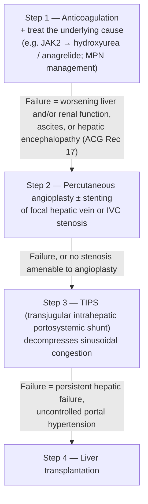

## Assessment

### Establishing the Diagnosis

Budd-Chiari syndrome (BCS) is defined by obstruction of hepatic venous outflow, which may occur at the level of the hepatic venules, hepatic veins, or the suprahepatic inferior vena cava (IVC). The obstruction causes sinusoidal congestion, centrilobular necrosis, and ultimately [[portal-hypertension|portal hypertension]] and hepatic failure if untreated.

**Epidemiology** [[aasld-2021-vascular-pvt]]: rare, mainly young patients (**median age 46 y**); incidence **<1 per million person-years** (range 0.17–0.88) and prevalence **1.40–7.69 per million**. [[acg-2020-hepatic-mesenteric-circulation]] reports 0.5–2 per million in Western countries vs the highest prevalence, **5–7 per million, in Asia**.

**Presentation** — ranges from asymptomatic to acute liver failure, with the **chronic** form the most common presentation ([[acg-2020-hepatic-mesenteric-circulation]]):

- **Acute BCS**: sudden-onset right upper quadrant or epigastric pain, hepatomegaly, rapidly progressive [[ascites]], and [[jaundice]]. **Acute liver failure arises when thrombosis is extensive and rapidly formed** [[aasld-2021-vascular-pvt]]
- **Subacute BCS**: weeks to months course; abdominal discomfort, ascites, splenomegaly, gradual hepatic dysfunction
- **Chronic BCS**: [[cirrhosis|cirrhosis]], established [[portal-hypertension|portal hypertension]], relatively compensated; caudate lobe hypertrophy (drains directly into IVC) is characteristic
- **~15%–20% are asymptomatic** and diagnosed incidentally — usually partial thrombosis with decompressive collaterals, atrophy of the affected segments and hypertrophy of the well-drained ones ([[aasld-2021-vascular-pvt]]; ACG gives ~20%)

**Frequency of findings at diagnosis** [[aasld-2021-vascular-pvt]]: ascites **83%**, hepatomegaly **67%**, abdominal pain **61%**; oesophageal varices detected in **>50%**. Typical labs: bilirubin and aminotransferase elevation, prolonged PT in severe cases; **ascitic fluid protein is characteristically high**. IVC obstruction (thrombus or compression by a hypertrophied caudate lobe) adds abdominal wall varices, lower-limb edema, or ulcers.

**Primary vs secondary ([[baveno-viii-2026-portal-hypertension|Baveno VIII]] 8.21–8.23):** BCS is any obstruction of the hepatic venous outflow tract from the small hepatic veins to the IVC–right atrial junction — and **BCS is the preferred designation for *any* hepatic venous outflow tract obstruction** (8.22; Baveno VII 8.7 said "any *primary*" HVOTO). It is **secondary** when the mechanism is **extrinsic compression *or endoluminal neoplastic/parasitic obstruction***, and **primary** otherwise (8.23). ⚠ **Baveno VIII adds the endoluminal limb** — VII 8.8 named only extrinsic compression by a benign or malignant tumour, which left endoluminal tumour thrombus and parasitic obstruction unclassified.

**Diagnostic rules (Baveno VIII 8.24–8.27):** presentation is extremely diverse, so consider BCS in **any** patient with acute, acute-on-chronic, or chronic liver disease (8.24). Diagnosis = demonstration of **venous luminal obstruction**, or **hepatic vein collaterals plus absence of patent hepatic veins** (8.25).

- **Radiologically confirmed BCS needs no [[liver-biopsy|liver biopsy]]** (8.26) — VIII states positively what VII 8.11 stated as a prohibition
- **Biopsy *is* necessary when cross-sectional imaging fails to demonstrate large hepatic vein obstruction**, to confirm **small hepatic vein** BCS (8.27)

**Key diagnostic features:**

- Caudate lobe hypertrophy (spares caudate because it has separate hepatic veins draining directly to IVC)
- Absent or reversed hepatic venous flow on Doppler
- Characteristic "comma-shaped" or enlarged caudate lobe on cross-sectional imaging

**Underlying etiology.** How often a prothrombotic disorder is found differs slightly between the two ingested guidelines: **~75%** of patients ([[aasld-2021-vascular-pvt]], 2021) vs **at least 1 thrombotic disorder in 79%–84%** ([[acg-2020-hepatic-mesenteric-circulation]], 2020). **Two or more** coexist in **≥35%** (AASLD) / **25%–46%** (ACG), and **no risk factor is found in 15%–30%** (AASLD).

Prevalences below are the HVT/BCS column of [[aasld-2021-vascular-pvt]] **Table 7** (patients *without* cirrhosis):

| Cause | Prevalence in BCS | Note |
|---|---|---|
| Myeloproliferative neoplasm (MPN) — polycythemia vera, ET, primary myelofibrosis | **41%** (ACG: "about half") | Most common in Western patients; frequently **masked by hypersplenism**. Platelet count **>200,000/µL together with splenomegaly >15 cm** in severe portal hypertension has significant positive predictive value |
| Antiphospholipid syndrome | **10%** | Isolated anticardiolipin antibodies have low specificity in symptomatic liver disease |
| Paroxysmal nocturnal hemoglobinuria (PNH) | **7%** | Uncommon presentation |
| Oral contraceptives or recent pregnancy | **23%** | Over-represented in Western patients |
| Behçet disease | **2%–3%** | Major cause in the Mediterranean region; IVC involvement common |
| [[celiac-disease\|Celiac disease]] | **1%** | Over-represented in North Africa |
| Protein C deficiency / protein S deficiency / antithrombin deficiency | **5% / 4% / 1%** | Plasma levels are non-specific in liver dysfunction — see workup caveats under [[#Diagnostics]] |
| Factor V Leiden | **8% population prevalence in Europeans** (not a BCS-specific rate) | Over-represented in Western patients; molecular diagnosis |
| Factor II (prothrombin) G20210A | **3% population prevalence in Europeans** (not a BCS-specific rate) | Role uncertain in BCS |
| Tumor invasion (IVC) | — | [[hepatocellular-carcinoma\|HCC]], renal cell carcinoma, adrenal carcinoma → **secondary** BCS by the Baveno VIII definition above (endoluminal neoplastic obstruction is the limb VIII added) |
| Membranous obstruction / segmental stenosis of IVC | — | ~10% of Western cases but **>80% in China**; in Chinese isolated-IVC and combined types prothrombotic disorders are uncommon and cases are linked to low socioeconomic status and abdominal infection |

> Because two or more risk factors are so common, **investigation for secondary prothrombotic factors is required even when one conspicuous thrombophilia has already been found** (ACG KC 16); hematology consultation is recommended (ACG KC 19).

### Severity Assessment

**Prognostic scores do not decide management.** [[baveno-viii-2026-portal-hypertension|Baveno VIII]] 8.36: *"The currently available prognostic BCS scores should not determine individual patient management alone, but can be used for research purposes."* (LoE 3, strong.) **Child-Pugh** and **MELD** still apply when cirrhosis is present (the CTP point table, the MELD 3.0 formula, and the MELD-variant comparison live on [[cirrhosis]]).

> ⚠ **This resolves a standing contradiction on this page, against Baveno VII.** [[baveno-vii-2022-portal-hypertension|Baveno VII]] 8.24–8.25 endorsed the **BCS-TIPS prognostic index**, with a **score >7** as a trigger to consider **liver transplantation before [[tips|TIPS]] placement**. [[acg-2020-hepatic-mesenteric-circulation]] KC 26 said the opposite — that "prognostic scoring systems are not helpful in guiding choice of therapy," noting the **Rotterdam score** is validated for *intervention-free* but not *transplant-free* survival and "should not be used to dictate treatment in individual patients." **Baveno VIII now agrees with ACG.** The BCS-TIPS index >7 rule is **withdrawn as a management trigger**; transplant is instead considered for **uncontrolled clinical manifestations despite the stepwise approach** and for BCS presenting as acute liver failure.
>
> **Decision gap — component point values.** No ingested source prints the component variables or point values of the **BCS-TIPS prognostic index** or the **Rotterdam score**, so neither can be computed from this wiki. This gap now matters less, since Baveno VIII restricts both to research use. Do not reconstruct them from memory.

Key predictors of poor outcome: [[hepatic-encephalopathy|hepatic encephalopathy]], [[ascites]] refractory to medical therapy, liver failure (coagulopathy, jaundice, INR >1.5), failure to respond to anticoagulation + angioplasty within weeks.

**HCC risk** — elevated, and occurs **without cirrhosis**, but the ingested estimates differ by population and design:

| Estimate | Source |
|---|---|
| Pooled **prevalence 15.4%** (95% CI **6.8%–26.7%**) across 16 studies (12 Asian, 2 African, 1 European/North American), excluding concomitant viral hepatitis — significant heterogeneity | [[acg-2020-hepatic-mesenteric-circulation]] |
| **Cumulative incidence 4%** in a European cohort (n=97, median follow-up 5 y) | [[acg-2020-hepatic-mesenteric-circulation]] |
| **Cumulative incidence 6% at 7 years** (French cohort); risk appears higher with **long-term IVC obstruction** | [[aasld-2021-vascular-pvt]] |

**~40% of BCS patients develop nodular liver lesions** during follow-up; benign ones are typically **multiple (>10), small (<4 cm), hypervascular and disseminated**, and **~25% of them carry a hepatic-adenoma phenotype** (distinct immunohistochemistry from conventional [[hepatocellular-adenoma|adenomas]]). Surveillance mechanics are under *Therapeutics → HCC Surveillance*.

---

## Differential Diagnosis

*Workup: see [[ascites]] for the ascites/portal-hypertension arm and [[abnormal-liver-chemistries]] for the aetiologic liver-test evaluation.*

- **Sinusoidal obstruction syndrome (SOS/VOD)** — occurs after hematopoietic SCT or exposure to pyrrolizidine alkaloids; histologically identical to BCS but no hepatic vein thrombosis on imaging; caudate preserved
- **Right heart failure / constrictive pericarditis** — elevated JVP, prominent v-waves, hepatojugular reflux; IVC and hepatic vein not occluded; doppler shows pulsatile hepatic venous flow
- **[[portal-vein-thrombosis]]** — obstruction at portal level, not hepatic outflow; caudate not spared; hepatomegaly less prominent initially
- **[[acute-liver-failure|Acute liver failure]] from other causes** — viral hepatitis, drugs, AFLP; hepatic veins patent on Doppler

---

## Diagnostics

**Imaging (first-line)** [[acg-2020-hepatic-mesenteric-circulation]]:

- **Doppler ultrasound**: first-line (Conditional, Low evidence); **sensitivity >75%** in experienced hands [[aasld-2021-vascular-pvt]]. Findings: thrombus, non-visualisation of the hepatic vein or its transformation into a flowless cord, collateral veins, absent or reversed hepatic venous flow, caudate lobe hypertrophy, and a **caudate vein >3 mm** in diameter
- **Contrast-enhanced CT** or **MRI**: obtain to **assess thrombus extension, rule out tumour thrombus, determine response to anticoagulation, evaluate indeterminate hepatic nodules, and whenever suspicion is high despite a negative/inconclusive Doppler** (Conditional, Low evidence). CT/MR additionally show rapid contrast clearance from the caudate lobe and patchy enhancement from uneven portal perfusion; [[mri-mrcp|MRCP]] when bile duct involvement suspected
- **Hepatic venography** — reserved for uncertain cases; the typical sign is a **"spider web"** collateral pattern

**Thrombophilia workup** — required in every BCS patient, but **not every test is indicated in every patient**; arrange with a hematologist ([[aasld-2021-vascular-pvt]] Table 8):

| Test | Who | Caveats |
|---|---|---|
| **JAK2 V617F** | All BCS without a major provoking factor | **Do it even if the CBC is unremarkable** — occult MPN is frequent. Identifies ~86% of the MPN cases |
| **CALR mutation** | If JAK2 negative | Much less common; PPV is significant with **platelets >200,000/µL + spleen >15 cm** in severe portal hypertension |
| **Bone marrow biopsy** | If JAK2 **and** CALR negative but clinical concern persists (e.g. thrombocytosis, suspicion of polycythemia vera) | Confirms occult MPN |
| **Antiphospholipid antibodies** — anticardiolipin, anti-β2-glycoprotein-1 (solid-phase IgG and IgM), lupus anticoagulant | All BCS without a major provoking factor | Solid-phase assays **may be drawn in the acute phase**; **lupus anticoagulant must NOT be** (acute changes and anticoagulation interfere). Clinically significant if **>40 GPL or MPL units, or >99th percentile**. Diagnosis of the syndrome requires **persistence on repeat testing ≥12 weeks** later |
| **PNH flow cytometry** | All BCS without a major provoking factor | Higher index of suspicion with hemolytic anemia and/or cytopenias |
| **Heritable thrombophilia** — factor V Leiden, prothrombin gene polymorphism, protein C, protein S, antithrombin | **Not routinely recommended** | Results do not generally change management; **protein C/S and antithrombin fall in acute thrombosis and liver dysfunction** and may not reflect an inherited deficiency |

> **Contradiction on inherited thrombophilia testing.** [[acg-2020-hepatic-mesenteric-circulation]] KC 16 calls for investigation of **acquired *and inherited*** thrombotic conditions in all BCS patients; [[aasld-2021-vascular-pvt]] (2021, newer) says heritable-thrombophilia testing is **not routinely recommended** because it does not change management. The page follows AASLD for the panel and ACG for the "look for a second factor even after finding the first" rule.

*Provoking-factor exception:* the workup above is **not required after recent major abdominal surgery/trauma or significant intra-abdominal inflammation**, and generally not in pre-existing cirrhosis ([[aasld-2021-vascular-pvt]] Table 8).

**[[liver-biopsy|Liver biopsy]]**: usually not required if imaging is diagnostic; histology shows centrilobular congestion, sinusoidal dilation, hepatocyte necrosis in pericentral zones; useful when SOS vs. BCS uncertain.

**[[hcc-surveillance|HCC surveillance]]**: begins at diagnosis — modality, interval, and nodule characterisation are under *Therapeutics → HCC Surveillance* below.

---

## Therapeutics

### Stepwise Management Algorithm

Management follows a defined stepwise approach — escalate to the next step only when current therapy is insufficient [[acg-2020-hepatic-mesenteric-circulation]]:

**Evidence** (Strong, Moderate — ACG Rec 17): in the largest prospective multicentre European study (n=157, median follow-up 5 y) the stepwise approach gave **overall survival 77%**; **88.5%** received long-term anticoagulation and **44% needed no invasive intervention at all**. Angioplasty and/or thrombolysis was the initial invasive step in 14%, of whom 64% still escalated to TIPS or LT [[acg-2020-hepatic-mesenteric-circulation]]. With **medical therapy alone, only one quarter of patients are alive at 5 years** [[aasld-2021-vascular-pvt]] — which is what makes timely escalation, not indefinite medical management, the point of the algorithm.

### Step 1 — Anticoagulation

- **Therapeutic anticoagulation should be initiated as soon as possible after diagnosis and continued long-term, *including after [[liver-transplantation|liver transplantation]]*** ([[baveno-viii-2026-portal-hypertension]] 8.32). Baveno VII 8.19 said only "long-term anticoagulation should be given to all patients with primary BCS" — VIII adds the **urgency** ("as soon as possible") and the **post-transplant** continuation
- **Start with LMWH, then transition to an oral anticoagulant** (8.5). **Avoid unfractionated heparin** (HIT risk); reserve it for GFR <30 mL/min or a pending invasive procedure
- **DOACs may be the primary oral choice** in vascular liver disease (8.6) — unless there is **double/triple-positive antiphospholipid syndrome**, **pregnancy**, **Child-Pugh C–equivalent liver dysfunction**, or **GFR <30 mL/min**. Anticoagulant choice should **not** be driven by which vascular liver disease it is (8.4), and the regimen should be **revisited regularly in a multidisciplinary team** against liver function, kidney function, and adherence (8.7)
- **Do not delay anticoagulation for endoscopic variceal prophylaxis** (8.10); **EVL is safe on LMWH or VKA**, with **no data for DOACs** (8.11)
- Initiate anticoagulation in all BCS patients without contraindications (Strong, Moderate evidence)
- Anticoagulation should be **indefinite** in most patients given persistent thrombophilia
- Treat underlying MPN: hydroxyurea (or anagrelide for ET); phlebotomy + aspirin for polycythemia vera; does not replace anticoagulation
- Antiphospholipid syndrome: indefinite VKA (target INR 2–3); DOACs associated with higher thrombotic recurrence in APLS
- **Pregnancy and contraception:** the Baveno VIII vascular-liver-disease rules apply — non-oestrogen contraception, oral anticoagulants replaced by therapeutic-dose LMWH once pregnancy is detected, variceal screening in the second trimester, propranolol for prophylaxis, and vaginal delivery preferred if platelets >20 G/L (8.15–8.20). One home: [[porto-sinusoidal-vascular-disorder|PSVD/NCPF → Therapeutics]] and [[liver-disease-in-pregnancy]]

**What counts as "improvement" before escalating** ([[baveno-viii-2026-portal-hypertension]] 8.35): a **combination** of — decreasing rate of ascites formation; decreasing serum bilirubin; decreasing serum creatinine; and/or decreasing INR when elevated (or rising factor V on vitamin K antagonists). **Assess it periodically, e.g. at 2-weekly intervals** — Baveno VIII adds the interval, which Baveno VII 8.23 left open, so "no improvement on medical therapy" is now a judgement made on a schedule rather than at an arbitrary point. **Actively assess for venous stenoses suitable for percutaneous recanalisation and treat them accordingly** (8.33).

### Step 2 — Angioplasty / Stenting

- For short-segment stenosis or web/membrane in hepatic vein or IVC
- Achieves recanalization and restores hepatic venous drainage
- More common indication in membranous obstruction (East Asian / African patients)
- Balloon dilation ± metallic stenting

### Step 3 — TIPS

- Preferred when no focal stenosis amenable to angioplasty, or when angioplasty fails
- Decompresses hepatic sinusoids → reduces congestion and allows hepatocyte recovery
- **[[tips|TIPS]]** patency important: use covered (PTFE) stents
- Post-TIPS: continue anticoagulation; monitor for encephalopathy
- Bridges to [[liver-transplantation|liver transplantation]] if needed

### Step 4 — Liver Transplantation

- Triggered by **uncontrolled clinical manifestations despite the stepwise approach**, by cirrhotic BCS failing all other measures, or by uncontrolled portal hypertension. **No longer triggered by a prognostic score** — see *Severity Assessment*
- **BCS presenting as [[acute-liver-failure|acute liver failure]]:** consider **urgent transplantation**, and perform **salvage TIPS if possible, independently of listing** ([[baveno-viii-2026-portal-hypertension]] 8.37)
- Post-transplant: **anticoagulation continues after transplantation** (8.32) — thrombophilia persists
- Post-transplant MPN management continues; consider discussion with hematology about stem cell transplant in MPN context

### HCC Surveillance

**[[baveno-viii-2026-portal-hypertension|Baveno VIII]] 8.28–8.30** — [[focal-liver-lesions|hepatic nodules]] in chronic BCS are frequent and **most often benign**, but HCC also occurs:

- **Monitor with periodic imaging *and* AFP at a 6-month interval**, "similar to HCC surveillance in cirrhosis" (8.29). ⚠ Baveno VII 8.15 said it was "still unclear" whether ultrasound or MRI should be used for periodic screening; Baveno VIII drops that uncertainty and anchors the interval to standard [[hcc-surveillance|HCC surveillance]]
- **AFP >15 ng/mL should raise suspicion for HCC** (8.29) — **new numeric threshold**; Baveno VII named AFP as part of surveillance without a cut-off
- **[[li-rads|LI-RADS]] cannot be applied in BCS** (8.30, new). Use **MRI with hepatobiliary contrast agents** to distinguish benign from malignant lesions, and obtain **histological confirmation** for lesions suspected of being HCC
- US + AFP every 6 months in all BCS patients (Conditional, Low evidence) [[acg-2020-hepatic-mesenteric-circulation]] — concordant
- Do **not** defer surveillance for absence of fibrosis — the elevated risk is independent of cirrhosis (see *Severity Assessment*)
- If HCC found: standard staging and treatment; however, transplant may be needed if LT is planned for BCS anyway

---

## See Also

[[portal-vein-thrombosis]], [[porto-sinusoidal-vascular-disorder]], [[hepatocellular-carcinoma]], [[acute-liver-failure]], [[liver-transplantation]], [[cirrhosis-hemostasis]], [[portal-hypertension]], [[tips]], [[hepatic-encephalopathy]], [[ascites]], [[jaundice]], [[hcc-surveillance]], [[liver-biopsy]], [[mri-mrcp]], [[focal-liver-lesions]], [[li-rads]], [[cirrhosis]], [[variceal-upper-gi-bleeding]], [[liver-disease-in-pregnancy]]

---

## Sources

1. [[baveno-viii-2026-portal-hypertension|Baveno VIII — Advancing Consensus in Portal Hypertension (2026)]]
2. [[acg-2020-hepatic-mesenteric-circulation|ACG Clinical Guideline: Disorders of the Hepatic and Mesenteric Circulation]]
3. [[baveno-vii-2022-portal-hypertension|Baveno VII — Renewing Consensus in Portal Hypertension (2022)]]
4. [[aasld-2021-vascular-pvt|AASLD Practice Guidance: Vascular Liver Disorders, Portal Vein Thrombosis, and Procedural Bleeding in Cirrhosis (2021)]]
