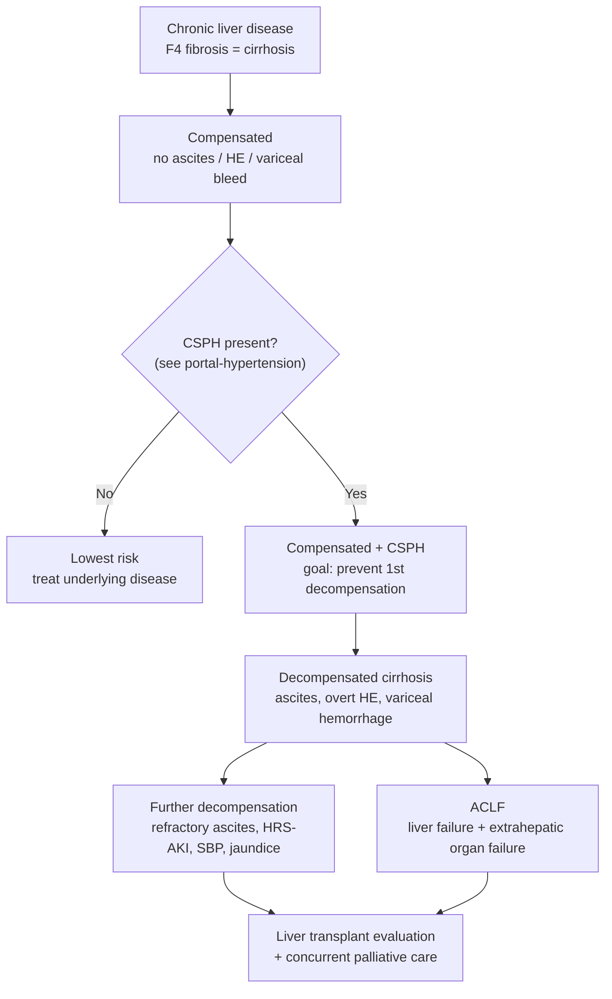

## Contents
- [[#Assessment]]
  - [[#Establishing the Diagnosis]]
  - [[#Severity Assessment]]
  - [[#Classification / Typing]]
  - [[#Recompensation (Baveno VIII)]]
- [[#Differential Diagnosis]]
- [[#Diagnostics]]
- [[#Therapeutics]]
  - [[#Complication Map]]
  - [[#Treat the Underlying Liver Disease]]
  - [[#Nutrition, Frailty, and Sarcopenia]]
  - [[#Hemostasis and Periprocedural Management]]
  - [[#Perioperative Risk]]
  - [[#Palliative Care]]
  - [[#Liver Transplantation]]
- [[#See Also]]
- [[#Sources]]

---

## Assessment

### Establishing the Diagnosis

- **Cirrhosis = stage F4 fibrosis.** For staging purposes fibrosis is collapsed to: significant fibrosis ≥F2, advanced fibrosis F3–4, **cirrhosis F4** [[aasld-2024-nilda-blood]]
- **[[liver-biopsy|Liver biopsy]] is the reference standard — but an imperfect one:** sampling, classification, and spectrum bias; mortality ~1/10,000–1/12,000; major bleeding 0.04%–0.01%. Because of biopsy error, an ideal noninvasive test's AUROC usually does not exceed 0.9 [[aasld-2024-nilda-blood]]
- **Most cirrhosis is now diagnosed noninvasively.** [[noninvasive-liver-disease-assessment|NILDA]] is the standard route — a cheap first-line blood test (FIB-4) rules out advanced fibrosis, and a confirmatory imaging test or ELF rules it in when FIB-4 ≥1.3. Thresholds and confounders live on the [[noninvasive-liver-disease-assessment|NILDA]] page [[aasld-2024-nilda-blood]]
- **When fibrosis stage is unknown in known liver disease,** FIB-4 and/or [[liver-stiffness-measurement|elastography]] may be used to identify patients likely to have advanced fibrosis/cirrhosis — which changes surgical planning and perioperative management [[acg-2025-perioperative-cirrhosis]]
- **Clinical/endoscopic/imaging shortcut:** clinical decompensation, gastroesophageal varices on endoscopy, or portosystemic collaterals / hepatofugal flow on imaging are each sufficient to diagnose clinically significant portal hypertension — see [[portal-hypertension|portal hypertension]] for the CSPH and cACLD framework [[aasld-2023-portal-hypertension]]

**Caveats that degrade noninvasive staging** [[aasld-2024-nilda-blood]]:

- **Insufficient evidence** to stage fibrosis with blood-based NILDA in [[alcohol-associated-liver-disease|ALD]] or chronic cholestatic disease ([[primary-biliary-cholangitis|PBC]]/[[primary-sclerosing-cholangitis|PSC]]) (ungraded statement)
- **[[chronic-hepatitis-b|HBV]]:** cutoffs derived in [[hepatitis-c|HCV]] give higher false-negative rates for advanced fibrosis/cirrhosis
- **Post-SVR / on antiviral therapy:** markers containing aminotransferases track inflammation, not fibrosis, and underestimate stage; no validated post-SVR thresholds exist
- **Platelet-based scores** (FIB-4, APRI, NFS) are confounded by splenectomy and by non–portal-hypertensive thrombocytopenia

### Severity Assessment

Scores mix liver-disease severity, non-hepatic patient factors, and (for surgery) operation-specific factors. Each has benefits and limitations and is used **alongside clinical judgment**, not instead of it [[acg-2025-perioperative-cirrhosis]].

**Variables comprising commonly used cirrhosis risk scores** (ACG 2025, Table 4) [[acg-2025-perioperative-cirrhosis]]:

| Domain | CTP score | MELD-Na | Mayo risk score | VOCAL-Penn Score |
|---|---|---|---|---|
| **Liver disease severity** | Total bilirubin, albumin, INR, [[ascites]], [[hepatic-encephalopathy\|encephalopathy]] | Total bilirubin, INR, creatinine, sodium | Total bilirubin, INR, creatinine, etiology of cirrhosis | Albumin, total bilirubin, platelet count, [[nafld-masld\|MASLD]] |
| **Nonhepatic patient factors** | — | — | Age, ASA score | Age, BMI, MASLD, ASA score |
| **Surgery-specific factors** | — | — | — | Type of surgery; emergency vs elective; laparoscopic vs open (major abdominal surgery) |

*MASLD is believed to serve as a surrogate for cardiovascular and metabolic risk factors affecting surgical risk. VOCAL-Penn is the only score incorporating surgery-specific factors.*

**Child-Turcotte-Pugh (CTP) score — operative point table** ([[nccn-2026-hcc]]):

| Parameter | 1 point | 2 points | 3 points |
|---|---|---|---|
| [[hepatic-encephalopathy\|Encephalopathy]] (grade) | None | 1–2 | 3–4 |
| [[ascites\|Ascites]] | Absent | Slight | Moderate |
| Albumin (g/dL) | >3.5 | 2.8–3.5 | <2.8 |
| Bilirubin (mg/dL) | <2 | 2–3 | >3 |
| &nbsp;&nbsp;• for primary biliary cholangitis | <4 | 4–10 | >10 |
| INR | <1.7 | 1.7–2.3 | >2.3 |
| &nbsp;&nbsp;*(or* prothrombin time, sec over control) | <4 | 4–6 | >6 |

**Class A = 5–6 points** (good operative risk); **Class B = 7–9** (moderate); **Class C = 10–15** (poor) ([[nccn-2026-hcc]]).

**MELD score — the current (MELD 3.0) formula**, printed by [[nccn-2026-hcc]] under the heading "MELD SCORE" and sourced there to the OPTN 2024 liver-allocation briefing:

**MELD** = 1.33 (if female) + [4.56 × logₑ(bilirubin)] + [0.82 × (137−Na)] − [0.24 × (137−Na) × logₑ(bilirubin)] + [9.09 × logₑ(INR)] + [11.14 × logₑ(creatinine)] + [1.85 × (3.5−albumin)] − [1.83 × (3.5−albumin) × logₑ(creatinine)] + 6

> ⚠ **This formula is *not* MELD-Na — read the score name literally.** [[aasld-ast-2025-liver-transplant-candidate-evaluation]] states that since 2013 the MELD score "has undergone several adjustments to account for the excess risk of **hyponatremia, female sex, and malnutrition** on mortality," and calls **MELD-Na "the precursor to the most recent version of MELD"** (MELD 3.0). The formula above carries all three of those adjustments — sodium, a female-sex constant, and albumin — so it is the **most recent iteration (MELD 3.0)**, not MELD-Na. **MELD-Na** comprises bilirubin, INR, creatinine, and sodium only (see the variable table above); it has no albumin or sex term, and its coefficients are not in any ingested source.

**ALBI grade** (bilirubin + albumin only; no subjective ascites/encephalopathy): score = [log₁₀ bilirubin (µmol/L) × 0.66] + [albumin (g/L) × −0.085]. **Grade 1 ≤ −2.60; Grade 2 > −2.60 to ≤ −1.39; Grade 3 > −1.39** ([[nccn-2026-hcc]]).

> ⚠ **Decision gap — which MELD, and which of them can actually be computed here.** The variants are **not interchangeable**; they differ by several points around exactly the cutoffs that decide management, so substituting one for another changes the decision.
>
> | Variant | Variables | Formula available on this wiki? | Decisions that use it |
> |---|---|---|---|
> | **MELD 3.0** (current allocation score) | Bilirubin, INR, creatinine, sodium, albumin, female sex | **Yes** — above ([[nccn-2026-hcc]]) | LT referral threshold ([[liver-transplantation\|LT]]); [[hepatic-encephalopathy\|HE]] |
> | **MELD-Na** | Bilirubin, INR, creatinine, sodium | **No** | ALD transplant referral (MELD-Na ≥21, [[alcohol-associated-liver-disease\|ALD]]); [[acg-2025-perioperative-cirrhosis\|ACG]] surgical risk table |
> | **Original MELD** | Bilirubin, INR, creatinine | **No** | Severe alcohol-associated hepatitis (**original MELD >20**, explicitly *not* MELD-Na — [[alcohol-associated-liver-disease\|ALD]]); [[tips\|TIPS]] selection and futility thresholds |
>
> For the two variants with no formula here, use an external calculator or ingest the Kamath 2001 (original MELD) and the MELD-Na derivation papers. **Do not reconstruct the coefficients from memory.**

**Key severity anchors:**

- **Low-risk band:** very low MELD (**6–9**) and CTP (**5–6**) with no CSPH and no hepatic decompensation → limited excess risk of adverse surgical events [[acg-2025-perioperative-cirrhosis]]
- **Degree of [[portal-hypertension|portal hypertension]] is one of the most important risk factors** — decompensation (ascites, encephalopathy, bleeding varices) and clinical manifestations of CSPH (varices without bleeding, portosystemic collaterals) are strongly associated with adverse outcomes [[acg-2025-perioperative-cirrhosis]]
- **In critical illness, MELD is not the right tool:** scores accounting for hepatic *and* extrahepatic organ failures (NACSELD, CLIF-C, AARC) are recommended **over MELD/MELD-Na** to assess prognosis — see [[acute-on-chronic-liver-failure|ACLF]] [[aasld-2024-aclf]]

### Classification / Typing

**Compensated vs decompensated** is the primary clinical division. **Decompensation = [[ascites]], encephalopathy, or bleeding varices** [[acg-2025-perioperative-cirrhosis]].

*The [[hepatic-venous-pressure-gradient|HVPG]] thresholds, the cACLD concept, and the LSM/platelet "Rule of Five" that subdivide the compensated stage are detailed on [[portal-hypertension]].*

**Baveno VIII stage definitions** [[baveno-viii-2026-portal-hypertension]]:

| Stage | Definition |
|---|---|
| **Compensated** | Absence of **current or past** decompensation (3.1); subdivided by presence/absence of CSPH (3.2a). The main therapeutic goal in the CSPH substage is to **prevent decompensation** (3.2e) |
| **Decompensated (first decompensation)** | Clinically evident [[ascites]] **or hepatic hydrothorax** caused by portal hypertension, [[variceal-upper-gi-bleeding\|variceal bleeding]], and/or overt [[hepatic-encephalopathy\|HE]] (**West Haven grade ≥II**) (3.3) |
| **Further decompensation** | Event-specific — see the table below (4.1). Higher mortality than first decompensation |
| **Recompensation** | See [[#Recompensation (Baveno VIII)]] |

**Further decompensation — the operative definition (Baveno VIII 4.1).** Baveno VII 7.1 listed the qualifying events in one block; Baveno VIII makes what counts depend on **which** event came first:

| Index decompensation | Further decompensation is… |
|---|---|
| **Ascites** | ≥3 large-volume paracenteses within 1 year, **or** [[spontaneous-bacterial-peritonitis\|SBP]], **or** [[aki-in-cirrhosis\|HRS-AKI]], **or** a second decompensating event (CSPH-related bleeding, overt HE, or [[jaundice\|jaundice]]) |
| **Variceal bleeding** | CSPH-related **re-bleeding**, **or** a second decompensating event (ascites, overt HE, or jaundice) |
| **Overt HE** | **Recurrent** overt HE, **or** a second decompensating event (ascites, bleeding, or jaundice) |
| **≥2 decompensating events already** | Any combination of ascites, PH-related bleeding, overt HE and/or jaundice |

- ⚠ **Baveno VII's "bleeding-alone" carve-out is gone.** VII 7.1c said that in a patient presenting with bleeding alone, ascites/HE/jaundice counted **only if they developed after recovery** from the bleed, not around the time of it. Baveno VIII's bleeding row has no such timing qualifier; validating the prognostic weight of events within 5 days of an AVB is instead a research-agenda item (RA4.1).
- **Not decompensation** (3.4a — VII said only that data were "insufficient"): **minimal ascites or ascites detectable only on imaging**, **covert HE**, and **occult bleeding from portal hypertensive gastroenteropathy**. Imaging-only ascites may nonetheless carry decreased survival (3.4b). **Isolated jaundice** in non-cholestatic aetiologies may be the first clinical manifestation in a minority, but its definition and prognostic implications remain unsettled (3.5).
- **Jaundice as the sole manifestation of further decompensation** demands an **immediate, exhaustive search for a precipitant** — bacterial infection (even if asymptomatic), alcohol-related hepatitis, viral or autoimmune hepatitis flare, [[drug-induced-liver-injury|DILI]], or biliary obstruction (6.25).

**Precipitants of decompensation** (Baveno VIII 3.6–3.13): superimposed acute liver injury — alcohol-related hepatitis, acute HEV/HAV/HBV, HBV flares, [[autoimmune-hepatitis|autoimmune hepatitis]], [[drug-induced-liver-injury|DILI]] — can precipitate decompensation **and/or [[acute-on-chronic-liver-failure|ACLF]]** (3.7); [[hepatocellular-carcinoma|HCC]] development raises the risk of decompensation and/or death (3.6); **surgery, especially major surgery**, precipitates decompensation and/or ACLF in patients with CSPH, with risk rising as portal hypertension worsens (3.13); bacterial infections do the same in compensated patients with CSPH (3.10). Diabetes and overweight/obesity are frequent comorbidities that worsen prognosis (3.8). **Periodontal disease** is associated with a higher risk of decompensation (3.12), and regular dental/periodontal care may lower it (3.23). Data on sarcopenia and frailty in the *compensated* stage remain inconclusive (3.9).

### Recompensation (Baveno VIII)

**Recompensation is a stage transition, not a histological one.** It defines cirrhosis that has moved from a decompensated back to a compensated stage **after aetiologic therapy**, so the term applies **only to patients who developed overt decompensating events** (7.1). It is **not** cirrhosis regression, which means histological reversal from cirrhotic to non-cirrhotic architecture (7.2). Recompensation carries a significantly lower risk of death and HCC than remaining decompensated (7.3). [[baveno-viii-2026-portal-hypertension]]

**All of the following are required (7.4):**

| # | Criterion | What changed from [[baveno-vii-2022-portal-hypertension\|Baveno VII]] |
|---|---|---|
| **a** | **Removal, control or suppression of the primary aetiology/aetiologies** | Adds "control" alongside removal/suppression |
| **b** | **Resolution of ascites on imaging off diuretics**, and **no clinical evidence of HE off lactulose / [[rifaximin\|rifaximin]] / LOLA** — unless those drugs are indicated for a non-ascites or non-HE condition | Adds the imaging standard, LOLA, and the "indicated for something else" exemption |
| **c** | After variceal bleeding: **absence of recurrent variceal bleeding, regardless of ongoing carvedilol/cNSBB therapy** | VII was silent on whether being on an NSBB disqualified; VIII says explicitly that it does not |
| **d** | Criteria a–c fulfilled for **>6 consecutive months** | **Halved from ≥12 months** |
| **e** | Liver function tests improved into the **Child-Turcotte-Pugh A5/A6** range | Replaces VII's unquantified "stable improvement in albumin, INR, bilirubin" |

**Aetiologic cure/control is defined per aetiology (7.5)** — evidence exists only for these three: **[[alcohol-associated-liver-disease|ALD]]** = sustained alcohol abstinence; **[[chronic-hepatitis-b|HBV]]** = sustained HBV-DNA suppression; **[[hepatitis-c|HCV]]** = sustained virological response. For [[primary-biliary-cholangitis|PBC]], [[autoimmune-hepatitis|AIH]], [[hepatitis-d|HDV]], and hereditary liver diseases the equivalent definitions are a research-agenda gap (RA7.2) — **do not extrapolate**.

**Corollaries:**

- **Not recompensation** (7.6, 7.7): ascites resolved *on* diuretics; absence of HE *on* lactulose/rifaximin/LOLA. Baveno VIII then says what to do about it — **withdraw the diuretic, and withdraw the HE medication, once aetiologic cure/control is achieved and synthetic function has reached CTP A laboratory criteria** — and re-assess.
- **[[tips|TIPS]] does not disqualify.** Baveno VIII 7.8 states that **patients with TIPS may achieve recompensation** if all 7.4 criteria are met — a change from Baveno VII 7.25, which read as excluding the post-TIPS patient. What still does *not* count is resolution of ascites **alone**, or absence of rebleeding **alone**, after TIPS.
- **Predictors of *not* recompensating (7.9–7.12):** higher CTP and MELD at decompensation, presence of further decompensation, high-risk varices, longer time from decompensation to aetiological therapy, and the type/number of decompensating events.
- **Follow-up does not stop.** Recompensated patients stay under **hepatology follow-up at 6-monthly intervals** (7.13) and **continue regular [[hcc-surveillance|HCC surveillance]]** (7.14) — the HCC risk is lower than in the decompensated, not absent.
- **[[spontaneous-bacterial-peritonitis|SBP]] antibiotic prophylaxis should be discontinued on recompensation** (6.22).
- **CSPH may resolve, but must be proven before stopping the NSBB** — thresholds and the "measure off the drug" rule are on [[portal-hypertension]] (7.15–7.19).

---

## Differential Diagnosis

*Workup: see [[abnormal-liver-chemistries]]. Noncirrhotic causes of portal hypertension ([[porto-sinusoidal-vascular-disorder|PSVD]] — the umbrella term now covering idiopathic PH and nodular regenerative hyperplasia — [[portal-vein-thrombosis|portal vein thrombosis]], [[budd-chiari-syndrome|Budd-Chiari syndrome]], congestive hepatopathy, schistosomiasis) are differentiated on [[portal-hypertension]].*

**Distinguish cirrhosis from:**

- **[[acute-liver-failure|Acute liver failure]]** — a distinct entity with **no preceding chronic liver disease**, versus [[acute-on-chronic-liver-failure|ACLF]], which is acute deterioration *on* chronic liver disease [[aasld-2024-aclf]]
- **Advanced fibrosis (F3) without cirrhosis** — the intermediate NILDA zone; up to one-third of patients fall in the indeterminate band and need confirmatory testing [[aasld-2024-nilda-blood]]

**Etiologic differential — which chronic liver disease caused it:**

| Category | Entities |
|---|---|
| Hepatocellular | [[hepatitis-c\|HCV]], [[chronic-hepatitis-b\|HBV]], [[nafld-masld\|MASLD/NAFLD]], [[alcohol-associated-liver-disease\|ALD]] [[aasld-2024-nilda-blood]] |
| Cholestatic | [[primary-sclerosing-cholangitis\|PSC]], [[primary-biliary-cholangitis\|PBC]] [[aasld-2024-nilda-blood]] |
| Reversible insults worth treating pre-op | [[chronic-hepatitis-b\|Hepatitis B]], [[hepatitis-c\|hepatitis C]], [[autoimmune-hepatitis\|autoimmune hepatitis]] [[acg-2025-perioperative-cirrhosis]] |

*Fibrosis staging also applies in [[hereditary-hemochromatosis]] and [[wilson-disease]]; see [[noninvasive-liver-disease-assessment]].*

---

## Diagnostics

| Test | Role in cirrhosis |
|---|---|
| **FIB-4 (± APRI, NFS)** | First-line rule-out of advanced fibrosis; rule-in at high values; initial triage of abnormal liver chemistries [[aasld-2024-nilda-blood]] |
| **Elastography (VCTE/MRE) or ELF** | Confirmatory rule-in when FIB-4 ≥1.3; LSM also stages cACLD and CSPH [[aasld-2024-nilda-blood]], [[aasld-2024-nilda-portal-htn]] |
| **Platelet count** | Combined with LSM for noninvasive CSPH staging; also a component of VOCAL-Penn [[aasld-2024-nilda-portal-htn]], [[acg-2025-perioperative-cirrhosis]] |
| **Spleen stiffness measurement (SSM)** | Adds discrimination in the indeterminate zone; less affected by acute injury than LSM [[aasld-2024-nilda-portal-htn]] |
| **[[liver-biopsy\|Liver biopsy]]** | Reserved for diagnostic uncertainty; imperfect reference standard [[aasld-2024-nilda-blood]] |
| **[[upper-endoscopy\|Upper endoscopy]]** | Variceal screening — can often be deferred when LSM <15 kPa with platelets >150 ×10⁹/L [[aasld-2024-nilda-portal-htn]] |
| **Cross-sectional imaging** | Identifies portosystemic collaterals and complications of portal hypertension; supports preoperative CSPH assessment [[acg-2025-perioperative-cirrhosis]] |
| **Diagnostic paracentesis** | All new-onset [[ascites]]: PMN count, total protein, albumin (SAAG), culture [[aasld-2021-ascites-sbp-hrs]] |
| **HVPG** | Gold standard for portal pressure; consider when LSM ~14–25 kPa without decompensation and confirming absence of CSPH would change management [[acg-2025-perioperative-cirrhosis]] |

**Do not use** blood-based NILDA to follow progression, stability, or regression of histologic fibrosis stage over time (ungraded statement) [[aasld-2024-nilda-blood]].

**Once cirrhosis is established,** patients above the advanced-fibrosis threshold should be referred for [[hcc-surveillance|HCC surveillance]] [[aasld-2024-nilda-blood]].

---

## Therapeutics

### Complication Map

Each complication has its own page; this hub only routes to them.

| Complication | Page | Anchor point |
|---|---|---|
| Portal hypertension, varices, NSBB/carvedilol | [[portal-hypertension]] | CSPH, cACLD, "Rule of Five", primary prophylaxis |
| Acute variceal hemorrhage | [[variceal-upper-gi-bleeding]] | Vasoactive therapy + antibiotics, EVL, preemptive [[tips\|TIPS]] |
| Ascites, refractory ascites, hyponatremia | [[ascites]] | Sodium restriction, diuretics, LVP + albumin |
| Spontaneous bacterial peritonitis | [[spontaneous-bacterial-peritonitis]] | PMN >250/mm³, empiric antibiotics, albumin, prophylaxis |
| AKI / hepatorenal syndrome | [[aki-in-cirrhosis]] | HRS-AKI criteria, vasoconstrictor + albumin |
| Overt and covert encephalopathy | [[hepatic-encephalopathy]] | Lactulose, [[rifaximin]], precipitant workup |
| Hepatocellular carcinoma | [[hepatocellular-carcinoma]], [[hcc-surveillance]] | Surveillance, [[focal-liver-lesions\|lesion characterization]] |
| Portal vein thrombosis | [[portal-vein-thrombosis]] | Anticoagulation decisions |
| Acute-on-chronic liver failure | [[acute-on-chronic-liver-failure]] | Organ-failure scores, ICU management |
| Pulmonary vascular complications | [[hepatopulmonary-syndrome-portopulmonary-hypertension]] | Hypoxemia, portopulmonary hypertension |
| Rebalanced hemostasis | [[cirrhosis-hemostasis]] | INR does not predict bleeding |
| Malnutrition, frailty, sarcopenia | [[nutrition-in-liver-disease]] | Calorie/protein targets, late-evening snack |
| Antibiotic prophylaxis | [[antibiotic-prophylaxis-cirrhosis]] | SBP and post-hemorrhage prophylaxis |

### Treat the Underlying Liver Disease

- **Lifestyle modification and treatment of the underlying liver disease should be prioritized** to prevent progression to CSPH and decompensation [[aasld-2023-portal-hypertension]]
- Treating reversible hepatic insults ([[chronic-hepatitis-b|HBV]], [[hepatitis-c|HCV]] with [[direct-acting-antivirals|DAAs]], [[autoimmune-hepatitis|AIH]]) in advance of elective surgery may mitigate operative risk [[acg-2025-perioperative-cirrhosis]]
- **Strict alcohol and tobacco cessation** in patients considered for elective surgery may reduce liver-related adverse events and postoperative complications, including infection, wound complications, and ICU admission [[acg-2025-perioperative-cirrhosis]]
- Stay current with routine cirrhosis care before elective surgery: HCC screening, optimization of [[ascites]] and [[hepatic-encephalopathy|HE]], variceal screening and/or bleeding prophylaxis, and SBP prophylaxis when indicated [[acg-2025-perioperative-cirrhosis]]

### Nutrition, Frailty, and Sarcopenia

Malnutrition, sarcopenia, and frailty are **very common and potentially modifiable** risk factors for adverse outcomes in cirrhosis [[acg-2025-perioperative-cirrhosis]]. Screening tools, calorie/protein targets, and the late-evening-snack rationale live on [[nutrition-in-liver-disease]] [[aasld-2021-malnutrition-cirrhosis]].

**Preoperative-specific targets** [[acg-2025-perioperative-cirrhosis]]:

- High calorie **30–35 kcal/kg/day** and high protein **1.25–1.5 g/kg/day**, initiated ideally **≥2 weeks before surgery**; nutrition consultation and [[enteral-access|nasoenteric feeding]] may be required
- **Prehabilitation** programs may be considered before elective surgery in cirrhosis-related frailty and sarcopenia — improved functional status may reduce postoperative complications

> **Note — differing calorie targets.** AASLD 2021 sets a general cirrhosis target of **≥35 kcal/kg/day** [[aasld-2021-malnutrition-cirrhosis]], while ACG 2025 specifies **30–35 kcal/kg/day** for preoperative optimization [[acg-2025-perioperative-cirrhosis]]. The contexts differ (general care vs. pre-elective-surgery), and both are guideline-tier; the numbers overlap rather than conflict outright.

### Hemostasis and Periprocedural Management

*Full physiology and periprocedural rules: [[cirrhosis-hemostasis]].*

- **Cirrhosis affects both prothrombotic and antithrombotic pathways**; the net hemostatic effect is **not accurately reflected** by PT/INR, aPTT, or platelet count [[acg-2025-perioperative-cirrhosis]]. INR should not be used to gauge bleeding risk [[aasld-2024-aclf]]
- **PT/INR is not independently associated with procedural bleeding** in cirrhosis; vitamin K or blood products to correct INR before major surgery have not been shown to reduce bleeding risk [[acg-2025-perioperative-cirrhosis]]
- **Very low platelet counts (<50–75/μL as printed)** are independently associated with procedural bleeding and adverse postoperative outcomes — though this may reflect severity of liver dysfunction and portal hypertension rather than thrombocytopenia itself (Key concept 6) [[acg-2025-perioperative-cirrhosis]]
  - ⚠ **The source's platelet units are internally inconsistent** — ACG 2025 prints the same threshold three ways: "<50,000 K/mm³" (Rec 2), "<50 K/mm³" (Key concept 19), and "<50–75/μL" (Key concept 6). The operative number is a platelet count of **50 K/mm³ (= 50,000/μL)**; the "K" and the "/μL" forms are typesetting variants of it, not different thresholds. Quoted here as printed rather than silently normalised.
- **Hospitalized patients should receive standard VTE pharmacologic prophylaxis** — cirrhosis is not protective against venous thromboembolism [[aga-2021-cirrhosis-coagulation]]
- Viscoelastic testing (e.g., thromboelastography), **if available**, may be considered to guide perioperative coagulopathy management rather than relying on traditional markers alone (Key concept 18) [[acg-2025-perioperative-cirrhosis]]
- **If viscoelastic testing is *not* available:** it is reasonable to **correct severe thrombocytopenia (<50 K/mm³) before major surgery** (Key concept 19) — this is the fallback rule that decides whether to transfuse/treat when TEG/ROTEM cannot be obtained [[acg-2025-perioperative-cirrhosis]]

> **Contradiction to surface — thrombopoietin receptor agonists.** [[aga-2021-cirrhosis-coagulation]] (2021) **suggests against** routine TPO receptor agonists solely to raise platelets before most procedures. [[acg-2025-perioperative-cirrhosis]] (2025) **recommends** TPO receptor agonists dosed to baseline platelet count in cirrhosis with **severe thrombocytopenia (<50,000/mm³) undergoing invasive procedures** (strong recommendation, moderate quality). Both are guideline-tier; the **newer ACG 2025 statement governs this page** for the severe-thrombocytopenia/invasive-procedure scenario, while the AGA position still stands for routine use in stable patients before low-risk procedures.

### Perioperative Risk

*Anchored to [[acg-2025-perioperative-cirrhosis]].*

- Comprehensive surgical risk assessment requires **liver-related factors + non-liver comorbidities + surgery-specific factors**; individualized estimation is best done with a validated cirrhosis-specific calculator (VOCAL-Penn) plus clinical judgment
- **Rec 1 (conditional, very low quality):** in compensated cirrhosis with unclear CSPH, use **LSM + platelet count** to rule in CSPH using recommended thresholds, plus cross-sectional imaging for portosystemic collaterals/PH complications
- **Rec 2 (strong, moderate quality):** in severe thrombocytopenia (<50,000 K/mm³) undergoing invasive procedures, use **TPO receptor agonists** dosed to baseline platelet count
- **Rec 3 (conditional, very low quality):** in cirrhosis + CSPH with an alternative [[tips|TIPS]] indication (e.g., refractory ascites), consider **preoperative TIPS**
- **Rec 4 (conditional, very low quality):** for **major hepatic surgery**, refer to a high-volume liver surgery and/or transplant center when feasible
- **Cholecystectomy:** laparoscopic approach generally favored in CTP A and B; most **CTP class C** patients have prohibitive risk and may benefit from supportive care and alternative drainage (percutaneous cholecystostomy, [[eus-guided-gallbladder-drainage|endoscopic drainage]], gallbladder aspiration)
- **[[bariatric-surgery|Bariatric surgery]]** can be safely performed in selected patients with well-compensated cirrhosis; **laparoscopic sleeve gastrectomy is the procedure of choice** (Key concept 25; see [[obesity]]). In [[liver-transplantation|LT]] candidates with a bariatric indication, **sleeve gastrectomy before or at the time of transplantation** may be considered based on center expertise — data for bariatric surgery *after* LT are limited (Key concept 26)
- **Nonhepatic comorbidities require independent assessment** — they affect postoperative mortality in cirrhosis and are not captured by CTP/MELD (Key concept 8); **preoperative frailty assessment** further informs risk (Key concept 13)
- **Abdominal hernia:** surgical consultation after optimizing ascites control for elective repair may reduce incarceration or spontaneous rupture requiring higher-risk emergent repair
- **Preoperative [[liver-transplantation|transplant]] evaluation** in selected elective patients — proposed trigger is projected **90-day postoperative mortality >15%** (estimable from VOCAL-Penn)

### Palliative Care

*Anchored to [[aasld-2022-palliative-cirrhosis]].*

- **Introduce palliative care early and concurrently**, at any disease stage, **including in transplant candidates** — not reserved for end of life
- Symptom-based management of the cirrhosis symptom burden: pain (avoid hepatotoxic/renally-cleared agents and NSAIDs), pruritus, [[hepatic-encephalopathy|HE]], muscle cramps, ascites-related discomfort, dyspnea, depression/anxiety, poor sleep
- **Advance care planning**, goals-of-care discussions, and caregiver support are core components
- Use both **primary palliative care** (delivered by the hepatology team) and **specialty palliative care** referral for complex needs
- Disease-directed care such as transplant evaluation and listing **does not preclude** palliative care delivery or specialty consultation [[aasld-2024-aclf]]

### Liver Transplantation

*Candidacy, evaluation, and post-transplant care: [[liver-transplantation]].*

- Refer for transplant evaluation at **grade 2 or 3 [[ascites]]** [[aasld-2021-ascites-sbp-hrs]]
- **Urgent** transplant evaluation for all patients with HRS-AKI [[aasld-2021-ascites-sbp-hrs]]
- **Expedited transplant** may be indicated in selected [[acute-on-chronic-liver-failure|ACLF]]/critically ill patients, but there is **equipoise** regarding which predictors identify acceptable outcomes; futility decisions should rest on candidacy for expedited transplant, available resources, and potential reversibility of ACLF [[aasld-2024-aclf]]

---

## See Also

[[portal-hypertension]], [[porto-sinusoidal-vascular-disorder]], [[ascites]], [[spontaneous-bacterial-peritonitis]], [[hepatic-encephalopathy]], [[variceal-upper-gi-bleeding]], [[hepatocellular-carcinoma]], [[hcc-surveillance]], [[aki-in-cirrhosis]], [[acute-on-chronic-liver-failure]], [[acute-liver-failure]], [[portal-vein-thrombosis]], [[budd-chiari-syndrome]], [[cirrhosis-hemostasis]], [[nutrition-in-liver-disease]], [[liver-transplantation]], [[noninvasive-liver-disease-assessment]], [[liver-biopsy]], [[abnormal-liver-chemistries]], [[hepatopulmonary-syndrome-portopulmonary-hypertension]], [[alcohol-associated-liver-disease]], [[nafld-masld]], [[chronic-hepatitis-b]], [[hepatitis-c]], [[hepatitis-d]], [[primary-biliary-cholangitis]], [[primary-sclerosing-cholangitis]], [[autoimmune-hepatitis]], [[hereditary-hemochromatosis]], [[wilson-disease]], [[upper-endoscopy]], [[tips]], [[rifaximin]], [[direct-acting-antivirals]], [[antibiotic-prophylaxis-cirrhosis]], [[focal-liver-lesions]], [[obesity]], [[bariatric-surgery]], [[liver-stiffness-measurement]], [[hepatic-venous-pressure-gradient]], [[eus-guided-gallbladder-drainage]], [[jaundice]], [[drug-induced-liver-injury]], [[enteral-access]]

---

## Sources

1. [[aasld-2023-portal-hypertension|AASLD 2023 Practice Guidance on Portal Hypertension and Varices in Cirrhosis]]
2. [[aasld-2024-nilda-blood|AASLD 2024 Practice Guideline: Blood-Based Noninvasive Liver Disease Assessment (NILDA) of Hepatic Fibrosis and Steatosis]]
3. [[aasld-2024-nilda-portal-htn|AASLD Practice Guideline: Noninvasive Assessment of Portal Hypertension (2024)]]
4. [[acg-2025-perioperative-cirrhosis|ACG Clinical Guideline: Perioperative Risk Assessment and Management in Cirrhosis (2025)]]
5. [[aasld-2021-ascites-sbp-hrs|AASLD 2021: Diagnosis, Evaluation, and Management of Ascites, SBP, and HRS in Cirrhosis]]
6. [[aasld-2021-malnutrition-cirrhosis|AASLD Practice Guidance: Malnutrition, Frailty, and Sarcopenia in Cirrhosis (2021)]]
7. [[aasld-2024-aclf|AASLD 2024 Practice Guidance on Acute-on-Chronic Liver Failure]]
8. [[aga-2021-cirrhosis-coagulation|AGA Clinical Practice Guideline: Coagulation Disorders in Cirrhosis (2021)]]
9. [[aasld-2022-palliative-cirrhosis|AASLD Practice Guidance: Palliative Care and Symptom-Based Management for Decompensated Cirrhosis (2022)]]
10. [[nccn-2026-hcc|NCCN Clinical Practice Guidelines in Oncology: Hepatocellular Carcinoma (Version 1.2026)]]
11. [[baveno-viii-2026-portal-hypertension|Baveno VIII — Advancing Consensus in Portal Hypertension (2026)]]
12. [[baveno-vii-2022-portal-hypertension|Baveno VII — Renewing Consensus in Portal Hypertension (2022)]]
13. [[aasld-ast-2025-liver-transplant-candidate-evaluation|AASLD AST 2025: Practice Guideline on Adult Liver Transplantation — Candidate Evaluation]]
