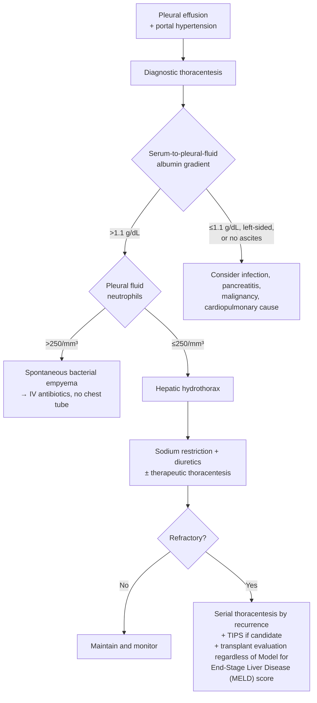

*Hepatic hydrothorax (HH): a transudative pleural effusion occurring in [[portal-hypertension|portal hypertension]] without another cause (heart failure, lung disease, malignancy). Ascitic fluid migrates from the peritoneal cavity through diaphragmatic defects, drawn across by negative intrathoracic pressure at inspiration. Prevalence in [[cirrhosis|cirrhosis]] 4%–12%.*

## Contents
- [[#Assessment]]
  - [[#Establishing the Diagnosis]]
  - [[#Severity Assessment]]
  - [[#Classification / Typing]]
- [[#Differential Diagnosis]]
- [[#Diagnostics]]
  - [[#Pleural Fluid Analysis]]
  - [[#Spontaneous Bacterial Empyema (SBE)]]
- [[#Therapeutics]]
  - [[#First-Line Medical Therapy]]
  - [[#Therapeutic Thoracentesis]]
  - [[#Refractory Hepatic Hydrothorax]]
  - [[#What Not To Do]]
  - [[#Liver Transplantation]]
- [[#See Also]]
- [[#Sources]]

## Assessment

### Establishing the Diagnosis

- Pleural effusion + portal hypertension, **with other causes excluded** — heart failure, lung disease, malignancy, infection, pancreatitis ([[aga-2025-ascites-cirrhosis]], [[aasld-2021-ascites-sbp-hrs]]).
- **Serum-to-pleural-fluid albumin gradient >1.1 g/dL suggests HH.**
- Diagnostic thoracentesis is what excludes the alternatives — needed in any new effusion in cirrhosis.
- **Typically unilateral and right-sided.** In a series of 77 patients: right 73%, left 17%, bilateral 10%.
- **9% had no clinical [[ascites|ascites]]** — absence of ascites does not exclude HH, but should raise suspicion for another cause.

### Severity Assessment

- **Prognosis is worse than the MELD score predicts** — the central management point.
  - 90-day mortality after hospitalization with HH **74%**, despite mean MELD 14 (which predicts 6%–8%) ([[aasld-2021-ascites-sbp-hrs]]).
  - 1-year mortality **20%–50%**; HH is independently associated with higher mortality than ascites regardless of MELD, with **>4-fold increased mortality vs refractory ascites** ([[aga-2025-ascites-cirrhosis]]).
- **HH causes symptoms at much lower fluid volumes than ascites** — dyspnea rather than distention; smaller effusions still warrant drainage.
- Complications: spontaneous bacterial empyema, progressive respiratory failure, trapped lung, and thoracentesis complications (pneumothorax, bleeding).

### Classification / Typing

| Category | Definition | Implication |
|---|---|---|
| Hepatic hydrothorax | Transudative pleural effusion in portal hypertension, other causes excluded | Sodium restriction + diuretics; drain if symptomatic |
| **Refractory HH** | HH **unresponsive to salt restriction and diuretic therapy**, requiring therapeutic thoracentesis ([[aga-2025-ascites-cirrhosis]] Table 1) | Serial thoracentesis + [[tips\|transjugular intrahepatic portosystemic shunt (TIPS)]] + transplant evaluation |
| Spontaneous bacterial empyema (SBE) | Pleural fluid neutrophils **>250/mm³** in HH, with or without positive culture, no alternative infectious source | IV antibiotics; **chest tube still contraindicated** |

- **First decompensating event.** Clinically evident ascites **or hepatic hydrothorax** caused by portal hypertension counts as a first decompensation, alongside variceal bleeding and overt [[hepatic-encephalopathy|hepatic encephalopathy]] (West Haven grade ≥II) — [[baveno-viii-2026-portal-hypertension|Baveno VIII]] 3.3 (LoE 2).

## Differential Diagnosis

*Workup: see [[ascites]].*

Reconsider the diagnosis — and look harder for another cause — when the albumin gradient is **≤1.1 g/dL**, the effusion is **left-sided**, or there is **no ascites** ([[aasld-2021-ascites-sbp-hrs]]):

- Parapneumonic effusion / pleural infection
- Pancreatic pleural effusion
- Malignant effusion
- Cardiopulmonary causes — heart failure, lung disease ([[aga-2025-ascites-cirrhosis]])
- [[hepatopulmonary-syndrome-portopulmonary-hypertension|Hepatopulmonary syndrome and portopulmonary hypertension]] — other cirrhosis-related causes of hypoxemia, which coexist rather than substitute
- Spontaneous bacterial empyema — a complication of HH, not an alternative to it

## Diagnostics

### Pleural Fluid Analysis

- **Tap every hospitalized patient with cirrhosis and new-onset HH — even with no signs of infection**, because of the risk of spontaneous bacterial empyema (SBE) ([[aga-2025-ascites-cirrhosis]]). Also tap hospitalized HH with symptoms, hepatic encephalopathy, or unexplained liver decompensation.
- **AASLD's trigger is narrower:** tap when there is **no ascites**, or when diagnostic paracentesis has already excluded [[spontaneous-bacterial-peritonitis|spontaneous bacterial peritonitis (SBP)]] but bacterial infection is still suspected ([[aasld-2021-ascites-sbp-hrs]] Guidance Statement [GS] 37). AGA 2025 is newer and broader — tap on admission.
- Send: **polymorphonuclear (PMN) leukocyte count**, culture, pleural albumin + **simultaneous serum albumin**.
- **Inoculate culture bottles at the bedside, before the first antibiotic dose** — aerobic *and* anaerobic, **≥10 mL** per bottle raises sensitivity to **>90%**; draw blood cultures at the same time ([[aasld-2021-ascites-sbp-hrs]]).
- **Pleural fluid protein may exceed that of the concurrent ascites** (hydrostatic pressure gradient) — a higher protein than the ascites does **not** argue against HH.
- **No prophylactic platelet or plasma transfusion** before the tap; post-drainage bleeding is rare even with coagulopathy or thrombocytopenia ([[aasld-2021-ascites-sbp-hrs]], [[aga-2025-ascites-cirrhosis]]).
- Culture and cytology results are also the **documentation a transplant exception requires** — see *Liver Transplantation*.

### Spontaneous Bacterial Empyema (SBE)

- **Treat as per SBP** — AASLD states this explicitly, so the SBP regimen applies ([[aasld-2021-ascites-sbp-hrs]]).
- **PMN >250/mm³ → start intravenous (IV) antibiotics empirically, before cultures return** (GS 40).
- **Community-acquired → IV third-generation cephalosporin** (GS 41); the stated example is **cefotaxime 2 g q12h**, where multidrug-resistant organisms (MDRO) are not prevalent.
- **Health care–associated/nosocomial, recent broad-spectrum exposure, or sepsis/septic shock on admission → broad-spectrum first line** (GS 42). MDRO regimens live on [[spontaneous-bacterial-peritonitis]].
- **Duration 5–7 days.**
- **Repeat the tap at 2 days to confirm response.** A fall in PMN of **<25% from baseline = non-response** → broaden coverage and evaluate for secondary bacterial peritonitis (GS 43). The repeat tap may be skipped if an organism was isolated, is susceptible to the drug given, and the patient is improving.
- **Prophylaxis against SBE has not been studied** — the SBP prophylaxis regimens are not validated here.
- AASLD scopes **albumin 1.5 g/kg day 1 + 1 g/kg day 3** (GS 44) and the nonselective beta-blocker hold (GS 45) to **SBP, not SBE**; neither is stated for SBE.

## Therapeutics

### First-Line Medical Therapy

- **Sodium restriction + diuretics at the lowest effective dose**, escalated against symptoms, weight, urine output and electrolytes/renal function; dietitian referral; identify and treat the trigger of decompensation ([[aga-2025-ascites-cirrhosis]] Best Practice Advice [BPA] 1).
- **Sodium <2,000 mg/day** ([[aga-2025-ascites-cirrhosis]]) — AASLD states the same ceiling as **2 g / 90 mmol/day**.
- **Mineralocorticoid receptor antagonist + loop diuretic together, in a 40:100 furosemide:spironolactone ratio** — better natriuresis with normokalemia than spironolactone alone or sequential dosing. Start **spironolactone 100 mg each morning** (long half-life; evening dosing causes nocturia) **+ furosemide 40 mg daily**. Amiloride or eplerenone if spironolactone-intolerant — **less effective** ([[aga-2025-ascites-cirrhosis]]). Full titration and maximum doses: [[ascites]].
- **Daily weights** — target **0.5 kg/day** loss without peripheral edema, up to **1 kg/day** with edema.
- **Fluid restriction is not needed** absent significant hyponatremia ([[aga-2025-ascites-cirrhosis]]); AASLD puts the trigger at **serum sodium ≤125 mmol/L**.
- **Do not over-restrict the diet** — these patients are often malnourished: **≥35 kcal/kg/day** (non-obese), protein **1.2–1.5 g/kg**, micronutrient repletion.
- Concurrent ascites: large-volume paracentesis (LVP) with IV [[albumin|albumin]] may improve ventilatory function, **but thoracentesis is generally still required** ([[aasld-2021-ascites-sbp-hrs]]).
- **Intermittent albumin infusion in HH has no supporting data** — AASLD calls benefit only *plausible* if albumin improves ascites control. Baveno VIII 6.10 (long-term albumin off TIPS) is scoped to recurrent/refractory **ascites**, not hydrothorax.

### Therapeutic Thoracentesis

- **Dyspnea and/or hypoxemia → therapeutic thoracentesis**, both for symptom relief and to re-expand the underlying lung ([[aga-2025-ascites-cirrhosis]] BPA 3). Also for symptomatic or recurrent effusions despite sodium restriction + diuretics.
- **Refractory HH → thoracentesis at a frequency guided by recurrence** (BPA 5); AASLD's first-line is sodium restriction + diuretics **plus thoracentesis as required** (GS 30).
- Cirrhosis with respiratory failure from hydrothorax or tense ascites → **therapeutic thoracentesis/paracentesis is recommended** ([[aasld-2024-aclf]] GS 18, ungraded) — alongside working up the other cirrhosis-related pulmonary comorbidities.
- **There is no upper volume limit** — no data guide the maximum pleural volume to remove in one session. The **>5 L / albumin 6–8 g per liter** rule is stated for paracentesis only; do not transfer it to the chest.
- **Fluid reaccumulates fast** — repeated taps are the norm.
- **Riskier than thoracentesis for other effusions** — bleeding, infection, pneumothorax, re-expansion pulmonary edema; **bleeding from chest wall portosystemic collaterals is rare but can be catastrophic**. Complication and death risk **rise with each repeat tap** ([[aga-2025-ascites-cirrhosis]]) — which is the argument for moving to definitive therapy.

### Refractory Hepatic Hydrothorax

| Option | Who | Source |
|---|---|---|
| Serial therapeutic thoracentesis | Frequency guided by recurrence (BPA 5) | [[aga-2025-ascites-cirrhosis]] |
| TIPS — **second-line** | Selected refractory HH (GS 31); refractory/recurrent HH "best treated with TIPS or LT" | [[aasld-2021-ascites-sbp-hrs]] |
| TIPS | Refractory to standard medical treatment → **should be considered** (6.7; LoE 3, strong) | [[baveno-viii-2026-portal-hypertension]] |
| TIPS referral | Well-selected refractory ascites, HH, volume overload or hyponatremia → **refer** (BPA 7) | [[aga-2025-ascites-cirrhosis]] |
| Indwelling tunneled pleural catheter | Only if **no response to medical therapy AND not a TIPS candidate** — carefully selected, with caution (GS 32) | [[aasld-2021-ascites-sbp-hrs]] |

- **Discuss TIPS and liver transplantation (LT) together, not sequentially**, in recurrent/refractory ascites or hydrothorax ([[baveno-viii-2026-portal-hypertension]] 6.4; LoE 2, strong).
- **Age ≥70 y is not a bar** — TIPS may be considered case-by-case on benefit/risk in selected older adults (Baveno VIII 6.8; LoE 3, weak). AGA 2025 phrases it as **caution >70 y or MELD >18** — caution, not contraindication.
- **HCC is not an absolute contraindication** to TIPS for refractory HH **unless the tumor lies along the TIPS trajectory**; better decompensation control may open access to oncologic treatment (Baveno VIII 4.15; LoE 3, weak).
- **TIPS candidacy thresholds** (full table: [[tips]]) — absolute contraindications congestive heart failure, severe pulmonary hypertension, uncontrolled hepatic encephalopathy, sepsis; **avoid if ejection fraction <50%, severe diastolic/valvular dysfunction, or right ventricular systolic pressure >45 mm Hg**; echocardiography beforehand. **Hepatic encephalopathy in up to 50% post-TIPS**; cardiac decompensation in up to 20% within 1 year ([[aga-2025-ascites-cirrhosis]]).
- **Indwelling tunneled pleural catheter — the numbers:** infection **4.5%**, fluid reaccumulation **20%**, spontaneous pleurodesis **31%** ([[aasld-2021-ascites-sbp-hrs]]). **Frequent drainage risks protein depletion and malnutrition.** AGA 2025 frames them as palliation for non-transplant candidates, or a **bridge to transplant where wait times are short**.
- **Video-assisted thoracoscopic surgery (VATS) repair of diaphragmatic defects has been reported**; no recommendation is made for or against it ([[aasld-2021-ascites-sbp-hrs]]).
- If **balloon-occluded retrograde transvenous obliteration (BRTO)** is being considered for gastric varices: new or worsened ascites **or hydrothorax requiring intervention in ~15% within 1 year** (present on imaging in 35%–40%) ([[aga-2021-bleeding-gastric-varices]]).

### What Not To Do

- **No chest tube — including for SBE.** High morbidity, clinical deterioration leading to death or to urgent TIPS/LT, and fistula formation ([[aasld-2021-ascites-sbp-hrs]] GS 32, [[aga-2025-ascites-cirrhosis]]). "Empyema" implies drainage; the tube still does not go in.
- **No chemical pleurodesis** — often produces loculated collections; not recommended.
- **No prophylactic platelet or plasma transfusion** before thoracentesis.
- **No routine fluid restriction** absent significant hyponatremia.
- Cirrhosis with ascites generally: **avoid nonsteroidal anti-inflammatory drugs, angiotensin-converting enzyme inhibitors and angiotensin receptor blockers** (GS 10); **avoid aminoglycosides** where possible (GS 11). Detail: [[ascites]].

### Liver Transplantation

- **Consider every patient with HH for LT** ([[aasld-2021-ascites-sbp-hrs]] GS 33) — the reason is the mortality gap: outcome is worse than MELD predicts.
- **Refer for LT evaluation regardless of MELD** ([[aga-2025-ascites-cirrhosis]] BPA 4).
- Further decompensation → evaluate for LT (Baveno VIII 6.1; LoE 1, strong); **pursue etiologic cure/control even at that stage** — it improves survival (6.2; LoE 2, strong).
- **MELD exception.** The Organ Procurement and Transplantation Network offers **no standard MELD exception for HH**; **nonstandard exceptions may be granted individually** to patients meeting criteria ([[aga-2025-ascites-cirrhosis]]). AASLD 2021 presents the same criteria as additional LT priority that *is* granted — AGA 2025 is newer and is what the page asserts.

  Criteria — adult LT candidate with **chronic, recurrent, confirmed HH, infectious and malignant causes excluded**, all documented ([[aasld-2021-ascites-sbp-hrs]] Table 8):

  | Requirement | Detail |
  |---|---|
  | Thoracentesis burden | **≥1 thoracentesis >1 L weekly over the last 4 weeks** — date and volume of each reported |
  | Fluid character | Transudative by **pleural–serum albumin gradient ≥1.1** *and* by cell count |
  | Heart failure | **Excluded**, with objective evidence |
  | Culture | **Negative on 2 separate occasions** |
  | Cytology | **Benign on 2 separate occasions** |
  | TIPS | A **contraindication to TIPS**, specified |
  | Diuretics | **Diuretic refractory** |

- An indwelling tunneled pleural catheter may serve as a **bridge to transplant where wait times are short** ([[aga-2025-ascites-cirrhosis]]).

---

## See Also

[[ascites]], [[cirrhosis]], [[portal-hypertension]], [[spontaneous-bacterial-peritonitis]], [[tips]], [[liver-transplantation]], [[albumin]], [[hepatopulmonary-syndrome-portopulmonary-hypertension]], [[acute-on-chronic-liver-failure]], [[hepatic-encephalopathy]], [[aki-in-cirrhosis]], [[hepatocellular-carcinoma]]

---

## Sources

1. [[aasld-2021-ascites-sbp-hrs|AASLD 2021: Diagnosis, Evaluation, and Management of Ascites, SBP, and HRS in Cirrhosis]]
2. [[aga-2025-ascites-cirrhosis|AGA Clinical Practice Update on the Management of Ascites, Volume Overload, and Hyponatremia in Cirrhosis: Expert Review]]
3. [[baveno-viii-2026-portal-hypertension|Baveno VIII — Advancing Consensus in Portal Hypertension (2026)]]
4. [[aasld-2024-aclf|AASLD 2024 Practice Guidance on Acute-on-Chronic Liver Failure]]
5. [[aga-2021-bleeding-gastric-varices|AGA Clinical Practice Update on Management of Bleeding Gastric Varices: Expert Review]]
