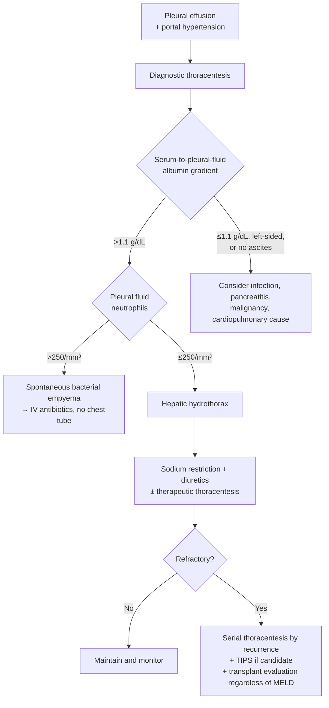

*Hepatic hydrothorax (HH): a transudative pleural effusion occurring in [[portal-hypertension|portal hypertension]] without another cause (heart failure, lung disease, malignancy). Ascitic fluid migrates from the peritoneal cavity through diaphragmatic defects, drawn across by negative intrathoracic pressure at inspiration. Prevalence in [[cirrhosis|cirrhosis]] 4%–12%.*

## Contents
- [[#Assessment]]
  - [[#Establishing the Diagnosis]]
  - [[#Severity Assessment]]
  - [[#Classification / Typing]]
- [[#Differential Diagnosis]]
- [[#Diagnostics]]
  - [[#Pleural Fluid Analysis]]
  - [[#Spontaneous Bacterial Empyema (SBE)]]
- [[#Therapeutics]]
  - [[#First-Line Medical Therapy]]
  - [[#Therapeutic Thoracentesis]]
  - [[#Refractory Hepatic Hydrothorax]]
  - [[#What Not To Do]]
  - [[#Liver Transplantation]]
- [[#See Also]]

## Assessment

### Establishing the Diagnosis

- Pleural effusion + portal hypertension, **with other causes excluded** — heart failure, lung disease, malignancy, infection, pancreatitis ([[aga-2025-ascites-cirrhosis]], [[aasld-2021-ascites-sbp-hrs]]).
- **Serum-to-pleural-fluid albumin gradient >1.1 g/dL suggests HH.**
- Diagnostic thoracentesis is what excludes the alternatives — needed in any new effusion in cirrhosis.
- **Typically unilateral and right-sided.** In a series of 77 patients: right 73%, left 17%, bilateral 10%.
- **9% had no clinical [[ascites|ascites]]** — absence of ascites does not exclude HH, but should raise suspicion for another cause.

### Severity Assessment

- **Prognosis is worse than the Model for End-Stage Liver Disease (MELD) score predicts** — the central management point.
  - 90-day mortality after hospitalization with HH **74%**, despite mean MELD 14 (which predicts 6%–8%) ([[aasld-2021-ascites-sbp-hrs]]).
  - 1-year mortality **20%–50%**; HH is independently associated with higher mortality than ascites regardless of MELD, with **>4-fold increased mortality vs refractory ascites** ([[aga-2025-ascites-cirrhosis]]).
- **HH causes symptoms at much lower fluid volumes than ascites** — dyspnea rather than distention; smaller effusions still warrant drainage.
- Complications: spontaneous bacterial empyema, progressive respiratory failure, trapped lung, and thoracentesis complications (pneumothorax, bleeding).

### Classification / Typing

| Category | Definition | Implication |
|---|---|---|
| Hepatic hydrothorax | Transudative pleural effusion in portal hypertension, other causes excluded | Sodium restriction + diuretics; drain if symptomatic |
| **Refractory HH** | HH **unresponsive to salt restriction and diuretic therapy**, requiring therapeutic thoracentesis ([[aga-2025-ascites-cirrhosis]] Table 1) | Serial thoracentesis + [[tips\|TIPS]] + transplant evaluation |
| Spontaneous bacterial empyema (SBE) | Pleural fluid neutrophils **>250/mm³** in HH, with or without positive culture, no alternative infectious source | IV antibiotics; **chest tube still contraindicated** |

- **First decompensating event.** Clinically evident ascites **or hepatic hydrothorax** caused by portal hypertension counts as a first decompensation, alongside variceal bleeding and overt [[hepatic-encephalopathy|hepatic encephalopathy]] (West Haven grade ≥II) — [[baveno-viii-2026-portal-hypertension|Baveno VIII]] 3.3 (LoE 2).

## Differential Diagnosis

*Workup: see [[ascites]].*

Reconsider the diagnosis — and look harder for another cause — when the albumin gradient is **≤1.1 g/dL**, the effusion is **left-sided**, or there is **no ascites** ([[aasld-2021-ascites-sbp-hrs]]):

- Parapneumonic effusion / pleural infection
- Pancreatic pleural effusion
- Malignant effusion
- Cardiopulmonary causes — heart failure, lung disease ([[aga-2025-ascites-cirrhosis]])
- [[hepatopulmonary-syndrome-portopulmonary-hypertension|Hepatopulmonary syndrome and portopulmonary hypertension]] — other cirrhosis-related causes of hypoxemia, which coexist rather than substitute
- Spontaneous bacterial empyema — a complication of HH, not an alternative to it
