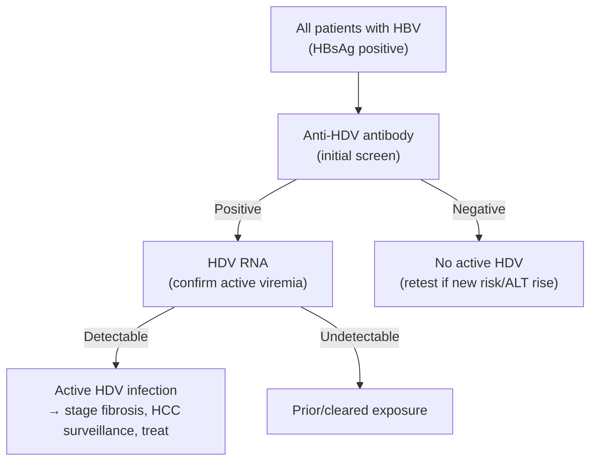

# Hepatitis D (Delta)

Hepatitis delta virus (HDV) is a defective RNA virus that replicates **only in the presence of [[chronic-hepatitis-b|HBV]]** (it requires HBsAg to assemble). It is the most aggressive form of viral hepatitis — concurrent HDV substantially increases the risk of [[cirrhosis|cirrhosis]], [[hepatocellular-carcinoma|HCC]], and liver-related mortality versus HBV monoinfection.

---

## Contents
- [[#Assessment]]
  - [[#Establishing the Diagnosis]]
  - [[#Severity Assessment]]
- [[#Differential Diagnosis]]
- [[#Diagnostics]]
- [[#Therapeutics]]

---

## Assessment

### Establishing the Diagnosis

- **Two patterns:**
  - **Coinfection** — simultaneous acute HBV + HDV; usually self-limited, low chronicity.
  - **Superinfection** — HDV acquired on existing [[chronic-hepatitis-b|chronic hepatitis B]]; high rate of chronic HDV, accelerated fibrosis, may present as a flare/decompensation.
- **Who to test — universal screening (AGA 2025):** test **all patients with HBV/HBsAg** for HDV (aligns with EASL, APASL, WHO 2024; one-time universal testing is cost-effective). *Note: this extends beyond prior AASLD risk-based testing.*
- **Retest** patients with ongoing risk behaviors, residence in high-prevalence areas, or new ALT elevation / hepatic decompensation.

### Severity Assessment

- Assess for **cirrhosis** with [[noninvasive-liver-disease-assessment|noninvasive testing]] — **VCTE** (AUROC 0.90; ≥14.0 kPa: sens 0.78, spec 0.86, NPV 0.93) and **FIB-4** (AUROC 0.88); APRI 0.83.
- **[[hcc-surveillance|HCC surveillance]] in all HDV patients** given elevated risk (see [[hepatocellular-carcinoma]]).

---

## Differential Diagnosis

*Workup: see [[abnormal-liver-chemistries]]; HDV itself is confirmed serologically/virologically — see Diagnostics.*

- [[chronic-hepatitis-b|Chronic hepatitis B]] monoinfection (HDV requires HBV — always coexists)
- [[hepatitis-c]]
- [[autoimmune-hepatitis]]
- [[alcohol-associated-liver-disease|Alcohol-associated]] / [[nafld-masld|metabolic]] liver disease
- [[drug-induced-liver-injury|Drug-induced liver injury]]

---

## Diagnostics

**Testing cascade (AGA 2025):**

- **Initial test:** anti-HDV antibody. **~50–70% of anti-HDV–positive patients have detectable HDV RNA** (active infection).
- **Confirm viremia:** reflex **HDV RNA** in all anti-HDV–positive patients. **Double-reflex** laboratory protocols (anti-HDV on all HBsAg+, HDV RNA on all anti-HDV+) dramatically raise cascade completion (anti-HDV testing 8% → 93% with automated reflex).
- **Not advised:** HDV antigen and anti-HDV IgM (limited availability, sensitivity, and specificity).
- US HDV RNA testing is **send-out** (Quest, ARUP, LabCorp, CDC); assay variability is a recognized limitation.

> **Care gap:** HDV testing rates among people with CHB are low (often <11%), and many anti-HDV–positive patients never complete HDV RNA testing — a major reason HDV is underdiagnosed.

---

## Therapeutics

### Current (US-available)

- **Pegylated interferon-α (peg-IFN-α-2a/2b)** — the **only US-available** therapy.
  - 48-week SVR **23%–57%**; **relapse ~50%** even after prolonged therapy (can recur up to 9 years later). Responders have improved survival and fewer liver-related events.
  - **Contraindicated** in advanced liver disease and major extrahepatic disease; significant **neuropsychiatric and hematologic** toxicity.
  - Per AASLD HBV guidance: peg-IFN-α weekly for **12 months** for elevated HDV RNA + elevated ALT.
- **Nucleos(t)ide analogue** — add if HBV DNA is elevated (controls HBV; **no direct anti-HDV activity**). See [[chronic-hepatitis-b]].
- Close post-treatment surveillance (labs + imaging) given the high relapse rate.

### Emerging / investigational

| Agent | Mechanism | Status | Notes |
|-------|-----------|--------|-------|
| **Bulevirtide** | NTCP (viral entry) inhibitor; daily SC | EMA-approved (2 mg, 2020); US **expanded-access only** (NCT06780579, compensated cirrhosis) | MYR-301: 45%–48% on-treatment response at 48 wk; combination with peg-IFN raised post-treatment undetectable HDV RNA to 46% vs 12% (MYR-204) |
| **Brelovitug (BJT-778)** | Anti-HBsAg monoclonal antibody | Phase 2b/3 | 67% combined response at 24 wk |
| **Tobevibart + elebsiran** | Anti-HBsAg mAb + siRNA | Phase 3 (SOLSTICE/ECLIPSE) | ~50% ALT normalization, 100% ≥2-log HDV RNA decline at 24 wk |
| **Lonafarnib** | Farnesyltransferase (prenylation) inhibitor | Phase 3 | Oral; usually with ritonavir ± peg-IFN |

---

## See Also

[[chronic-hepatitis-b]], [[hepatitis-c]], [[hepatocellular-carcinoma]], [[hcc-surveillance]], [[abnormal-liver-chemistries]], [[noninvasive-liver-disease-assessment]], [[autoimmune-hepatitis]], [[drug-induced-liver-injury]], [[liver-transplantation]], [[nutrition-in-liver-disease]]

---

## Sources

1. [[aga-2025-hepatitis-delta|AGA Clinical Practice Update on Management of Hepatitis Delta: Commentary (2025)]]
