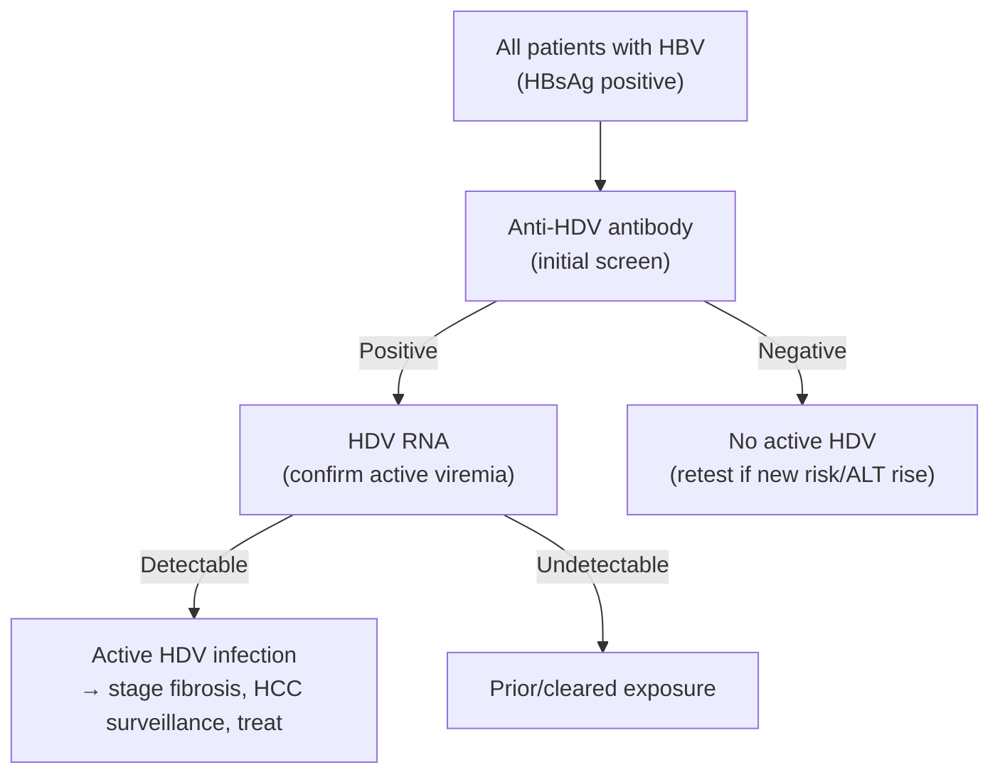

Hepatitis delta virus (HDV) is a defective RNA virus that occurs **only in the setting of [[chronic-hepatitis-b|HBV]] infection** (it requires HBsAg to assemble), as coinfection or superinfection. Concurrent HDV is a **particularly aggressive** infection — it substantially increases the risk of [[cirrhosis]], [[hepatocellular-carcinoma|HCC]], and liver-related mortality versus HBV monoinfection [[aga-2025-hepatitis-delta]].

**Magnitude of excess risk vs CHB alone** (meta-analysis of 12 studies, viremic HDV):

| Outcome | Risk ratio (95% CI) |
|---|---|
| Compensated cirrhosis | 1.74 (1.24–2.45) |
| Decompensated cirrhosis | 3.82 (1.60–9.10) |
| HCC | 2.97 (1.87–4.70) |
| Liver-related mortality | 3.78 (2.18–6.56) |

US Veterans Affairs cohort (adjusted HRs): HCC 3.61 (2.35–5.54), hepatic decompensation 2.36 (1.50–3.70), liver-related mortality 1.89 (1.25–2.86), all-cause mortality 1.52 (1.20–1.93).

---

## Contents
- [[#Assessment]]
  - [[#Establishing the Diagnosis]]
  - [[#Severity Assessment]]
- [[#Differential Diagnosis]]
- [[#Diagnostics]]
- [[#Therapeutics]]
  - [[#Current (US-available)]]
  - [[#Emerging / investigational]]
- [[#See Also]]
- [[#Sources]]

---

## Assessment

### Establishing the Diagnosis

- **Two patterns:**
  - **Coinfection** — simultaneous acute HBV + HDV; usually self-limited, low chronicity.
  - **Superinfection** — HDV acquired on existing [[chronic-hepatitis-b|chronic hepatitis B]]; high rate of chronic HDV, accelerated fibrosis, may present as a flare/decompensation.
- **Who to test — universal screening (AGA 2025):** test **all patients with HBV/HBsAg** for HDV (aligns with EASL, APASL, WHO 2024; one-time universal testing is cost-effective). *This extends beyond prior AASLD risk-based testing.*
- **Prior AASLD risk-based criteria (what universal screening replaces)** — anti-HDV Ab in [[chronic-hepatitis-b|CHB]] patients who are:
  - HIV-positive
  - People who inject drugs
  - Men who have sex with men
  - At risk of acquiring sexually transmitted diseases
  - Immigrants from areas of high HDV endemicity — Africa (West Africa, horn of Africa); Asia (Central/Northern Asia, Vietnam, Mongolia, Pakistan, Japan, Taiwan); Pacific Islands (Kiribati, Nauru); Middle East; Eastern Europe (Eastern Mediterranean, Turkey); South America (Amazonian basin); Greenland
  - AASLD additionally suggested considering testing in CHB with **persistently low HBV DNA + elevated ALT**
  - *Applying these criteria did not improve real-world testing rates — in a 41,658-veteran HBsAg-positive cohort only 10.7% completed any HDV test, with no difference among those meeting AASLD risk criteria.*
- **Retest** patients with ongoing risk behaviors, residence in high-prevalence areas, or new liver test elevation / hepatic decompensation.

### Severity Assessment

- Assess for **cirrhosis** with [[noninvasive-liver-disease-assessment|noninvasive testing]] — **[[liver-stiffness-measurement|VCTE]]** is most accurate (AUROC 0.90) vs **FIB-4** 0.88 and APRI 0.83.
  - **VCTE ≥14.0 kPa** for cirrhosis in HDV: sens 0.78, spec 0.86, **NPV 0.93, PPV 0.64**.
- **[[hcc-surveillance|HCC surveillance]] in all HDV patients** given elevated risk (see [[hepatocellular-carcinoma]]).

---

## Differential Diagnosis

*Workup: see [[abnormal-liver-chemistries]]; HDV itself is confirmed serologically/virologically — see Diagnostics.*

- [[chronic-hepatitis-b|Chronic hepatitis B]] monoinfection (HDV requires HBV — always coexists)
- [[hepatitis-c]]
- [[autoimmune-hepatitis]]
- [[alcohol-associated-liver-disease|Alcohol-associated]] / [[nafld-masld|metabolic]] liver disease
- [[drug-induced-liver-injury|Drug-induced liver injury]]

---

## Diagnostics

**Testing cascade (AGA 2025):**

- **Initial test:** anti-HDV antibody. **~50–70% of anti-HDV–positive patients have detectable HDV RNA** (active infection).
- **Confirm viremia:** reflex **HDV RNA** in all anti-HDV–positive patients. **Double-reflex** laboratory protocols (anti-HDV on all HBsAg+, HDV RNA on all anti-HDV+) dramatically raise cascade completion (anti-HDV testing 8% → 93% with automated reflex).
- **Not advised:** HDV antigen and anti-HDV IgM (limited availability, sensitivity, and specificity). HDV antigen is only transiently detectable in *acute* infection and is undetectable in chronic infection, because it forms immune complexes with anti-HDV.
- US HDV RNA testing is **send-out** (Quest, ARUP, LabCorp, CDC); assay variability is a recognized limitation.

> **Care gap:** HDV testing rates among people with CHB are low (often <11%), and many anti-HDV–positive patients never complete HDV RNA testing — a major reason HDV is underdiagnosed.

---

## Therapeutics

### Current (US-available)

**Endpoint definitions** (used by every trial below — the FDA-specified endpoints):

- **On-treatment response** = ≥2-log decline in HDV RNA **and/or** ALT normalization.
- **SVR** = **undetectable HDV RNA off treatment** (for peg-IFN, assessed at 6 months post-treatment).

**Who to treat, and with what:**

- **Pegylated interferon-α (peg-IFN-α-2a/2b)** — the **only US-available** therapy; weekly SC.
  - **Indication (AASLD HBV guidance): elevated HDV RNA *and* elevated ALT → peg-IFN-α weekly for 12 months.**
    - ⚠ **Decision gap — neither input is quantified, and neither is the dose.** [[aga-2025-hepatitis-delta]] reproduces this recommendation verbatim as "elevated HDV RNA levels and elevated ALT" with **no IU/mL threshold and no ×ULN or U/L threshold**, and gives peg-IFN's route and frequency ("weekly SC injection") but **no µg dose**. So the page's central treatment trigger cannot be applied to a specific patient, and the drug cannot be prescribed, from an ingested source. Contrast the NA rule two bullets down, where EASL *does* give a number. Ingest the AASLD HBV guidance (for the trigger) and the peg-IFN label (for the dose) to close this — **do not supply either from memory.**
  - 48-week SVR **23%–57%** (undetectable HDV RNA + normal ALT in 21%–50% at 48 wk); treatment >2 y may raise response rates. **Relapse ~50%** even after prolonged therapy, up to **9 years** after completing therapy. Responders have improved survival and fewer liver-related events.
  - **Contraindicated** in advanced liver disease and in major extrahepatic disease; significant **neuropsychiatric and hematologic** toxicity limits use.
- **Nucleos(t)ide analogue (NA)** — controls HBV only; **no efficacy against HDV**. See [[chronic-hepatitis-b]].
  - AASLD: add an NA **if HBV DNA is elevated** — again unquantified in [[aga-2025-hepatitis-delta]].
  - **EASL sets an explicit threshold:** NA therapy only in patients with **HBV DNA >2000 IU/mL and/or cirrhosis**.
- **After treatment:** close ongoing laboratory *and* imaging surveillance, given the ~50% relapse rate.

### Emerging / investigational

| Agent | Mechanism / route | Status | Efficacy at wk 24/48 | SVR (undetectable HDV RNA off Rx) |
|---|---|---|---|---|
| **Bulevirtide** (Gilead) | NTCP (sodium taurocholate co-transporting polypeptide) receptor blocker — blocks viral entry; **daily SC** | **EMA-approved 2 mg since 2020**; not FDA-approved — US access is the **10 mg expanded-access program** for chronic HDV with **compensated cirrhosis** (NCT06780579). Optimal duration undefined | MYR-301 (144-wk phase 3, 2 mg vs 10 mg): on-treatment response at 48 wk **45% (2 mg)** / **48% (10 mg)**; longer treatment raises response further | 18% combined response and 16% undetectable HDV RNA at wk 48 post-treatment |
| **Bulevirtide + peg-IFN** | Combination; finite duration | MYR-204 phase 2b | — | **46%** undetectable HDV RNA 24 wk post-treatment (**bulevirtide 10 mg** arm) vs **12%** bulevirtide alone → finite therapy may be considered in select patients |
| **Brelovitug (BJT-778)** | Anti-HBsAg monoclonal antibody; SC every 1–4 wk | Phase 2b/3 | 67% ≥2-log HDV RNA decline + ALT normalization at 24 wk | No SVR data |
| **Tobevibart + elebsiran** (VIR) | Anti-HBsAg mAb + siRNA; 2 SC injections every 2–4 wk | Phase 3 (SOLSTICE; global **ECLIPSE** launching) | 47% combined response at 24 wk; ~50% ALT normalization, **100% ≥2-log HDV RNA decline**, 41% target-not-detected — TND rose to ~83% in the small 48-wk subgroup | No SVR data |
| **Lonafarnib** | Farnesyltransferase (prenylation) inhibitor; **oral BID**, ± ritonavir ± peg-IFN-α-2a | Phase 3 | 10%–19% ≥2-log HDV RNA decline + ALT normalization at 48 wk | 14%–26% combined response, 6%–23% undetectable at wk 24 post-Rx |
| **Peg-IFN-λ** | Liver-targeted peg-IFN; weekly SC | Phase 3 — **discontinued** | — | — |
| **Nucleic acid polymer (REP2139)** | Blocks HBV subviral particle assembly → inhibits HDV replication; weekly SC ± peg-IFN | Phase 2 / compassionate use in Europe | 73% ≥2-log HDV RNA decline, 61% HDV RNA negative | — |

*Table 1, [[aga-2025-hepatitis-delta]].*

---

## See Also

[[chronic-hepatitis-b]], [[hepatitis-c]], [[hepatocellular-carcinoma]], [[hcc-surveillance]], [[abnormal-liver-chemistries]], [[noninvasive-liver-disease-assessment]], [[autoimmune-hepatitis]], [[drug-induced-liver-injury]], [[alcohol-associated-liver-disease]], [[nafld-masld]], [[liver-transplantation]], [[nutrition-in-liver-disease]], [[liver-stiffness-measurement]], [[cirrhosis]]

---

## Sources

1. [[aga-2025-hepatitis-delta|AGA Clinical Practice Update on Management of Hepatitis Delta: Commentary (2025)]]
