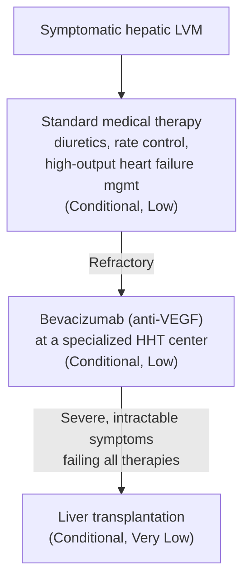

## Contents
- [[#Assessment]]
  - [[#Establishing the Diagnosis]]
  - [[#Severity Assessment]]
- [[#Differential Diagnosis]]
- [[#Diagnostics]]
- [[#Therapeutics]]
  - [[#Hepatic Vascular Malformations (LVMs)]]
  - [[#GI Bleeding in HHT]]

## Assessment

HHT (Osler-Weber-Rendu syndrome) is an autosomal dominant vascular disorder causing AVMs and telangiectasias in skin, mucosa, lungs, brain, liver, and GI tract.

- Prevalence: **1:5,000–1:8,000** ([[acg-2020-hepatic-mesenteric-circulation]])
- Hepatic vascular malformations (LVMs): present in **32–73%** of HHT patients
- Symptomatic liver disease: only **1–8%** — the large majority of hepatic LVMs are never clinically relevant, which is why screening is not recommended

### Establishing the Diagnosis

> **Decision gap — criteria not in an ingested source.** The ingested sources do not state the clinical diagnostic criteria for HHT itself (the Curaçao criteria: epistaxis, mucocutaneous telangiectasias, visceral AVMs, first-degree relative). [[acg-2020-hepatic-mesenteric-circulation]] addresses only the **hepatic/GI management** of already-diagnosed HHT. Do not infer the criteria from this page — an HHT-specific source is needed.

Route into the diagnosis that *is* sourced here:

- **Via [[juvenile-polyposis-syndrome|JPS]] genetics** — a ***SMAD4*** mutation carries JPS–HHT overlap. Every *SMAD4* carrier must be screened for HHT, **including a cardiovascular exam** ([[acg-2015-hereditary-gi-cancer]]). JPS is caused by *SMAD4* or *BMPR1A* mutations (~60% of clinically defined JPS); evaluate for both ([[aga-2022-hamartomatous-polyposis]]).

### Severity Assessment

- Sourced content defines severity **functionally, not by a score** — management keys off whether hepatic LVMs are *symptomatic* (high-output heart failure, [[portal-hypertension|portal hypertensive]] complications, biliary ischemia) vs. asymptomatic, and off failure of standard medical therapy.
- No graded severity classification for HHT liver disease appears in the ingested sources.

## Differential Diagnosis

*Workup: see [[small-bowel-bleeding]] for the diagnostic approach to the GI bleeding presentation.*

- [[angioectasia]] — sporadic GI angioectasias produce the same bleeding phenotype without the AVM/telangiectasia syndrome
- Other vascular disorders of the hepatic circulation covered by the same guideline: [[budd-chiari-syndrome]], [[portal-vein-thrombosis]], [[mesenteric-artery-aneurysm]]

> **Gap:** the ingested sources do not provide a formal differential diagnosis for HHT; the entries above are the adjacent entities those sources address, not a sourced DDx list.

## Diagnostics

| Setting | Recommendation | Strength | Evidence |
|---|---|---|---|
| Asymptomatic HHT | **Do NOT** routinely screen for hepatic LVMs | Strong | Low |
| Symptomatic hepatic LVMs | Contrast **CT** or **[[mri-mrcp\|MRI/MRCP]]** | Strong | Low |

*([[acg-2020-hepatic-mesenteric-circulation]])*

## Therapeutics

### Hepatic Vascular Malformations (LVMs)

Stepwise — escalate only on failure of the prior step:

- Standard medical therapy is **first-line** for symptomatic hepatic LVMs (Conditional, Low)
- **Bevacizumab** (anti-VEGF) for refractory symptomatic LVMs — must be administered at **specialized HHT centers** (Conditional, Low)
- [[liver-transplantation|Liver transplantation]] for refractory HHT liver disease with severe, intractable symptoms (Conditional, Very Low)

> **Gap:** the ingested source names bevacizumab but gives **no dose, interval, or duration**.

### GI Bleeding in HHT

- Recurrent GI telangiectasia-related bleeding (often small bowel/gastric)
- Standard medical therapy first; **bevacizumab** for nonresponders at specialized centers (Conditional, Low)

---

## See Also

[[juvenile-polyposis-syndrome]], [[angioectasia]], [[small-bowel-bleeding]], [[portal-vein-thrombosis]], [[budd-chiari-syndrome]], [[mesenteric-artery-aneurysm]], [[liver-transplantation]], [[portal-hypertension]], [[mri-mrcp]], [[primary-sclerosing-cholangitis]]

---

## Sources

1. [[acg-2020-hepatic-mesenteric-circulation|ACG Clinical Guideline: Disorders of the Hepatic and Mesenteric Circulation]]
2. [[acg-2015-hereditary-gi-cancer|ACG 2015: Genetic Testing and Management of Hereditary Gastrointestinal Cancer Syndromes]]
3. [[aga-2022-hamartomatous-polyposis|US Multi-Society Task Force Guideline: GI Hamartomatous Polyposis Syndromes (2022)]]
