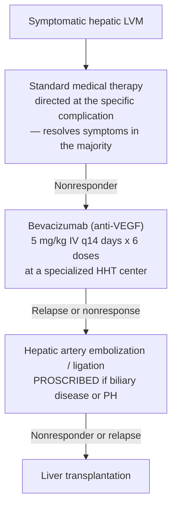

## Contents
- [[#Assessment]]
  - [[#Establishing the Diagnosis]]
  - [[#Severity Assessment]]
- [[#Differential Diagnosis]]
- [[#Diagnostics]]
- [[#Therapeutics]]
  - [[#Standard Therapy — by Presentation]]
  - [[#Targeted Therapy — Escalation Ladder]]
  - [[#GI Bleeding in HHT]]
- [[#See Also]]
- [[#Sources]]

## Assessment

HHT (Osler-Weber-Rendu disease) — autosomal dominant disorder of widespread cutaneous, mucosal, and visceral telangiectases. ([[acg-2020-hepatic-mesenteric-circulation]])

- Prevalence **1 in 5,000–8,000**
- Genetics: ≥80% have a heterozygous mutation in **endoglin (*ENG*)** or **activin receptor-like kinase type 1 (*ALK-1* / *ACVRL1*)** — TGF-β family receptors expressed in vascular endothelium. ***SMAD4*** mutation → combined **HHT + [[juvenile-polyposis-syndrome|juvenile polyposis]]** syndrome
- **Liver vascular malformations (LVMs)** on imaging in **55%** of patients with definite HHT (3 large cohorts). Symptomatic liver involvement is more common in **HHT-2** (the *ALK-1*/*ACVRL1* type)

**Three shunt types** (dual hepatic blood supply), each with a different clinical presentation:

| Shunt | Typical presentation |
|---|---|
| Hepatic artery → hepatic vein (**most common**) | High-output heart failure (HOHF) |
| Hepatic artery → portal vein | [[portal-hypertension\|Portal hypertension]] — [[ascites]], varices, variceal hemorrhage |
| Porto-venous | Portosystemic [[hepatic-encephalopathy\|encephalopathy]] |

Other presentations: **biliary ischemia** (secondary sclerosing cholangitis, bilomas) and **mesenteric ischemia** (post-prandial pain from hepatic artery steal). Symptoms can **transition between presentations** (e.g. HOHF → biliary ischemia) and can be precipitated by anemia from GI bleed/epistaxis.

### Establishing the Diagnosis

> **Decision gap — criteria not in an ingested source.** The ingested sources do not state the clinical diagnostic criteria for HHT itself (the Curaçao criteria). [[acg-2020-hepatic-mesenteric-circulation]] addresses only the **hepatic/GI management** of already-diagnosed HHT. Do not infer the criteria from this page — an HHT-specific source is needed.

Routes into the diagnosis that *are* sourced here:

- **Via *SMAD4* genetics** — a *SMAD4* mutation carries [[juvenile-polyposis-syndrome|JPS]]–HHT overlap. Every *SMAD4* carrier must be screened for HHT, **including a cardiovascular exam** ([[acg-2015-hereditary-gi-cancer]]). JPS is caused by *SMAD4* or *BMPR1A* mutations (~60% of clinically defined JPS); evaluate for both ([[aga-2022-hamartomatous-polyposis]])
- **Via clinical signs of LVM** — audible **bruit** and/or palpable **thrill** over the liver, and/or abnormal liver tests (typically ↑**alkaline phosphatase**, occasionally ↑bilirubin and/or aminotransferases). These findings are what convert a "don't screen" patient into a "do image" patient (see [[#Diagnostics]])

### Severity Assessment

- Severity is defined **functionally, not by a score** — management keys off whether LVMs are *symptomatic* vs asymptomatic, and off failure of standard medical therapy. No graded severity classification for HHT liver disease appears in the ingested sources
- Natural history anchors: symptomatic LVMs occur **only in adults**, mean age **~48 y** at presentation (youngest reported 21 y); **8%–14%** of patients with definite HHT + LVM are symptomatic at HHT diagnosis; **~3.5% per year** of asymptomatic patients develop overt symptoms; 5% died over a median 44 months' follow-up (median age at death 75 y)
- Except for portal hypertension, presentations occur **predominantly in women**. Pregnancy with HHT + LVM can trigger severe heart failure and/or biliary ischemia ("hepatic disintegration syndrome")

## Differential Diagnosis

*Workup: see [[small-bowel-bleeding]] for the diagnostic approach to the GI bleeding presentation.*

- [[angioectasia]] — sporadic GI angioectasias produce the same bleeding phenotype without the AVM/telangiectasia syndrome
- **[[cirrhosis]] — the key mimic on histology.** Nodular regenerative hyperplasia (NRH) is a frequent finding in HHT liver, and the combination of regeneration plus fibrosis around ectatic vessels leads to an **erroneous diagnosis of cirrhosis**
- **[[focal-nodular-hyperplasia|Focal nodular hyperplasia]]** — more common in HHT (prevalence **2.9%** vs **0.3%** in the general population). There are **no reports of [[hepatocellular-carcinoma\|HCC]]** arising in a liver with LVMs
- Other vascular disorders of the hepatic circulation covered by the same guideline: [[budd-chiari-syndrome]], [[portal-vein-thrombosis]], [[mesenteric-artery-aneurysm]]

> **Gap:** the ingested sources do not provide a formal differential diagnosis for HHT; the entries above are the adjacent/mimicking entities those sources address, not a sourced DDx list.

## Diagnostics

| Setting | Recommendation | Strength | Evidence |
|---|---|---|---|
| **Asymptomatic HHT** | **Do NOT** routinely screen for LVMs — no evidence that diagnosing an asymptomatic patient benefits outcome or prevents death | Strong | Low |
| Liver **bruit**, hyperdynamic circulation, **or abnormal liver tests** | Evaluate further for LVMs (exception to the no-screening rule) | Strong | Low |
| Pregnancy with known HHT + LVM | Warrants **special attention** — anticipated hemodynamic stress | Strong | Low |
| Symptoms/signs of **heart failure, biliary ischemia, [[hepatic-encephalopathy\|hepatic encephalopathy]], mesenteric ischemia, or PH** | Contrast **CT** or **[[mri-mrcp\|MRI/MRCP]]** | Strong | Low |
| — | **Doppler US** may establish the diagnosis with a compatible clinical picture, but is **less accurate** than CT or MRI/MRCP | Strong | Low |
| — | **Angiography and [[liver-biopsy\|liver biopsy]] are NOT recommended** for diagnosing LVMs | Strong | Low |

*([[acg-2020-hepatic-mesenteric-circulation]] recs 21–22)*

- **Hallmark imaging findings:** intrahepatic hypervascularization (telangiectases) + **enlarged common hepatic artery (>6–7 mm)**. More obvious in symptomatic patients
- **CTA or MRA** are the most-used methods, with no difference in diagnostic accuracy
- Shunt type is determinable in **>2/3** of LVM patients by early/differential enhancement of hepatic veins (arteriovenous) or portal veins (arterioportal) across imaging phases. Arterioportal shunting is more frequent in patients presenting with PH, but CT findings do not correlate with clinical presentation; **porto-venous shunts are difficult to diagnose** noninvasively
- Liver biopsy is additionally hazardous (bleeding risk from widespread LVMs) and unhelpful — histology can produce a false diagnosis of cirrhosis

## Therapeutics

**No treatment for asymptomatic LVMs.** Treatment of symptomatic LVMs is directed at the **specific presentation** and has a high rate of complete response. ([[acg-2020-hepatic-mesenteric-circulation]] Key Concept 28)

### Standard Therapy — by Presentation

| Presentation | Standard therapy |
|---|---|
| **HOHF** | Sodium restriction, **diuretics**, **beta-blockers**; correct **anemia** and **atrial fibrillation** (both worsen symptoms by ↓O₂ delivery / ↓cardiac output). Pregnant patients: treat medically and **deliver as expeditiously as possible** |
| **[[portal-hypertension\|Portal hypertension]]** | Treat the specific complications ([[ascites]], varices, [[variceal-upper-gi-bleeding\|variceal hemorrhage]]) as for [[cirrhosis]]. **[[tips\|TIPS]] does NOT ameliorate bleeding from GI arteriovenous malformations** |
| **Secondary sclerosing cholangitis** | Ursodeoxycholic acid may be used — **no data support this** |
| **Biloma** | No treatment if asymptomatic; analgesics if painful; **urgent antibiotics** if cholangitis or infected biloma; drainage if pain/infection not improving |
| **Mesenteric ischemia** | Smaller, more frequent meals + analgesics |

### Targeted Therapy — Escalation Ladder

For nonresponders to standard therapy, escalate **least-invasive first**, at a **specialized center with a multidisciplinary approach**. Evidence is case reports/small series (conditional recommendation, low level of evidence — rec 23).

- **Bevacizumab** — consider in **HOHF**, and possibly other LVM complications, **before invasive therapies**; not all patients respond
  - Dose used in the prospective HOHF cohort: **5 mg/kg IV every 14 days × 6 doses** (n=24: cardiac index normalized in 12%, improved but not normalized in 71%, no response in 17%). In an ischemic-cholangiopathy case series the same dose was followed by **maintenance infusion every 3 months for 12 months**
  - **Symptoms recur after discontinuation** — gradually, at intervals of **5–26 months**, requiring repeat dosing; **14%** were nonresponders needing more invasive therapy
  - Side effects: arthralgias, headache, proteinuria, arterial hypertension, **poor wound healing** (a concern for post-transplant complications if transplanted while on drug)
- **Hepatic artery occlusion (embolization or surgical ligation)** — rational for HOHF and mesenteric angina, but the effect is **mostly transient** with significant morbidity/mortality from biliary and/or hepatic necrosis (death or urgent transplant in up to **30%**). **Proscribed in patients with biliary disease and in patients with PH**
- **[[liver-transplantation|Liver transplantation]]** — an important option for nonresponders to standard treatment or relapse after medical treatment
  - **Listing criteria are not clearly defined**
  - Largest series (n=40, European Liver Transplant registry): 1-, 5-, and 10-year patient and graft survival **82.5%**; cardiovascular function improved in 75% and stabilized in the rest
  - **Early complications (within 4 months) in 55%–60%**; 17.5% died during or very early after transplant
  - **LVMs recur in the graft as early as 6 years** after transplant — recurrence in 8/14 (57%) at a mean 127 months; estimated cumulative recurrence risk **48% at 15 years**

### GI Bleeding in HHT

- Recurrent telangiectasia-related bleeding (often gastric/small bowel) is a recognized cause of [[small-bowel-bleeding|small bowel bleeding]]; a detailed dermatologic exam helps identify HHT as the underlying syndrome ([[acg-2015-small-bowel-bleeding]])
- Bleeding-related **anemia can precipitate or worsen** the hepatic presentations (especially HOHF) — correcting it is part of standard LVM therapy
- **[[tips|TIPS]] does not ameliorate bleeding from GI arteriovenous malformations** ([[acg-2020-hepatic-mesenteric-circulation]])

> **Gap:** the ingested sources give **no endoscopic or pharmacologic management algorithm specific to HHT-related GI bleeding** (no HHT-specific bevacizumab, thalidomide, or APC recommendation). An HHT-specific or GI-bleeding-in-HHT source is needed.

## See Also

[[juvenile-polyposis-syndrome]], [[angioectasia]], [[small-bowel-bleeding]], [[portal-vein-thrombosis]], [[budd-chiari-syndrome]], [[mesenteric-artery-aneurysm]], [[liver-transplantation]], [[portal-hypertension]], [[mri-mrcp]], [[liver-biopsy]], [[focal-nodular-hyperplasia]], [[cirrhosis]], [[tips]], [[ascites]], [[hepatic-encephalopathy]], [[variceal-upper-gi-bleeding]]

---

## Sources

1. [[acg-2020-hepatic-mesenteric-circulation|ACG Clinical Guideline: Disorders of the Hepatic and Mesenteric Circulation]]
2. [[acg-2015-hereditary-gi-cancer|ACG 2015: Genetic Testing and Management of Hereditary Gastrointestinal Cancer Syndromes]]
3. [[aga-2022-hamartomatous-polyposis|US Multi-Society Task Force Guideline: GI Hamartomatous Polyposis Syndromes (2022)]]
4. [[acg-2015-small-bowel-bleeding|ACG Clinical Guideline: Diagnosis and Management of Small Bowel Bleeding]]
