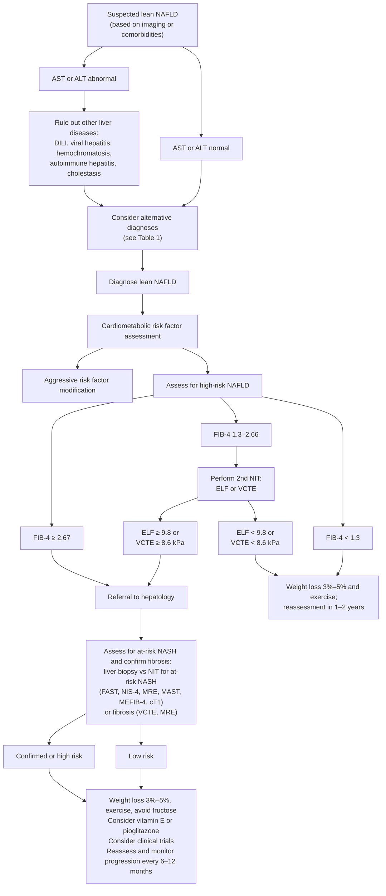

## Contents
- [[#Assessment]]
  - [[#Establishing the Diagnosis]]
  - [[#Severity Assessment]]
- [[#Differential Diagnosis]]
  - [[#Table 1 — Potential Secondary Causes of Fatty Liver in Lean Individuals]]
- [[#Diagnostics]]
  - [[#Table 2 — Stepwise Approach to Ruling Out Alternative Causes]]
  - [[#Alcohol Assessment]]
  - [[#Noninvasive Tests]]
  - [[#Liver Biopsy]]
  - [[#Genetic Testing]]
- [[#Therapeutics]]
  - [[#Lifestyle]]
  - [[#Pharmacotherapy]]
  - [[#Cardiometabolic Risk Modification]]
  - [[#HCC Surveillance]]
  - [[#Monitoring Intervals]]
- [[#See Also]]
- [[#Sources]]

---

*Lean NAFLD is the normal-BMI phenotype of [[nafld-masld|NAFLD/MASLD]]. This page carries what is specific to it; the general MASLD definition, nomenclature, cut-points, and F2–F3 pharmacotherapy live on [[nafld-masld]].*

*[[aga-2022-lean-nafld]] issues **15 numbered Best Practice Advice (BPA) statements** and is **ungraded** — it attaches no evidence grade or strength of recommendation to any statement. BPA numbers below are the source's own.*

---

## Assessment

### Establishing the Diagnosis

**Definition (BPA 1) — the BMI cut-point is ethnicity-qualified; it is not a single number:**

| Race / ancestry | BMI defining lean NAFLD |
|---|---|
| **Non-Asian race** | **<25 kg/m²** |
| **Asian race** | **<23 kg/m²** |

- Lean NAFLD = NAFLD **in an individual who does not have an overweight or obese BMI**.
- Reference bands behind the cut-points: CDC/WHO normal range **18.5–24.9 kg/m²** · overweight **25–29.9** · grade 1 obesity **30–34.9**. WHO applies a lower cutoff for **Asian ancestry — overweight 23–27.5, obesity >27.5 kg/m²** — recognizing metabolic risk at a lower BMI.
- Term **lean NAFLD** (normal-range BMI with race-based cutoffs) is preferred over *nonobese NAFLD*, though the two are often used interchangeably.
- ⚠ Supersedes the **≤25 / ≤23 kg/m²** "normal-weight NAFLD" definition in [[aga-2021-lifestyle-modification-nafld]] (both are AGA Clinical Practice Updates; 2022 is newer). The practical divergence is confined to a BMI of exactly 25.0 or 23.0.
- The update predates the MASLD/MASH nomenclature change; given >99% overlap between NAFLD- and MASLD-defined populations, its advice applies to lean MASLD.

**Epidemiology:**

- **7%–20%** of people with NAFLD are lean; at 10%–20% this is **≈8–10 million US adults**.
- Global NAFLD/NASH Registry: ~**6.8%** of biopsy-confirmed NASH is lean — older, more often Asian, fewer metabolic-syndrome components, but **similar risk for advanced fibrosis**.
- NHANES III: **10.8%** of lean individuals had evidence of NAFLD — older, more frequently men.

**Natural history — lean is not a benign phenotype:**

- Cross-sectionally, lean patients have a **lower** prevalence of advanced fibrosis and [[cirrhosis]] than overweight/obese patients with NAFLD.
- Biopsy-confirmed cohort, median **8.4 y** follow-up: lean participants had a **higher risk of liver-related death** (they also had higher baseline advanced fibrosis in that study).
- >**1300** biopsy-confirmed subjects (Europe/Australia): lean NAFLD had **less severe histology**, yet over ~**7.5 y** nearly **5%** had liver-related events despite most maintaining a lean BMI.
- Swedish population registry, ~**20 y**: lower baseline fibrosis stage but a **higher risk of developing severe liver disease** than nonlean NAFLD.
- → lean NAFLD progresses **independent of weight gain** and should not be classified as benign.

**Who to screen (BPA 4, 5):**

- **Do NOT screen the lean general population** — NAFLD prevalence among lean individuals is relatively low.
- **DO screen lean individuals older than 40 years with T2DM**, then risk-stratify for advanced fibrosis.
- Consider NAFLD **across the BMI range** in anyone with metabolic disease (T2DM, dyslipidemia, hypertension), elevated liver biochemical tests, or incidentally noted hepatic steatosis. **The initial diagnostic approach is the same for lean and nonlean patients**; elevated liver chemistries get the standard evaluation, including for [[drug-induced-liver-injury]] and chronic liver disease (see [[abnormal-liver-chemistries]]).
- Society positions differ: EASL/EASD/EASO screen all patients with obesity or metabolic syndrome; ADA evaluates for NASH/fibrosis in T2DM with elevated liver tests or fatty liver on ultrasound; **AASLD does not endorse NAFLD screening** and cites limited cost-effectiveness in T2DM. The AGA position here is the narrow middle.

### Severity Assessment

**Risk-stratify every lean patient for hepatic fibrosis to identify advanced fibrosis or cirrhosis (BPA 3).**

**Lean-specific staging algorithm (Figure 1):**

*Figure 1 — Management and treatment algorithm in patients with suspected lean NAFLD. ([[aga-2022-lean-nafld]])*

**Cut-points used by this pathway:**

| Step | Result | Action |
|---|---|---|
| **1 — FIB-4** | **<1.3** | Weight loss 3%–5% + exercise; reassess in **1–2 years** |
| | **1.3–2.66** | Perform a **second NIT — ELF or VCTE** |
| | **≥2.67** | **Refer to hepatology** |
| **2 — second NIT** | **ELF ≥9.8 or VCTE ≥8.6 kPa** | **Refer to hepatology** → assess for at-risk NASH and confirm fibrosis |
| | **ELF <9.8 or VCTE <8.6 kPa** | Weight loss 3%–5% + exercise; reassess in **1–2 years** |

> ⚠ **These are not the general MASLD cut-points.** This lean-specific pathway refers on **FIB-4 ≥2.67** and rules in on **VCTE ≥8.6 kPa / ELF ≥9.8**. [[aasld-2023-nafld]] instead grades VCTE as **<8 kPa rule-out / 8–12 kPa indeterminate / ≥12 kPa rule-in** for advanced fibrosis (its ELF rule-in is the same 9.8). The **8.6 kPa** figure belongs to this sequential lean pathway only; the general two-tier thresholds, the cirrhosis bands, and the drug-candidacy NIT windows are on [[nafld-masld]]. AASLD 2023 is the newer document and is what the general page asserts.

**Sequential testing is the point (BPA 11).** Two serologic tests, or a serologic plus an imaging test, minimize indeterminate results and improve accuracy:

- FIB-4 → TE in English primary-care clinics: **nearly 7-fold increased diagnostic rate** for advanced fibrosis.
- Meta-analysis >**5700** patients: sequential FIB-4 + TE improved both sensitivity and specificity for ruling advanced fibrosis in or out.
- A **FIB-4 + ELF** care pathway reduced referral of patients with mild disease.
- Data specific to lean NAFLD are limited, but sequential serum + elastography testing may increase NIT accuracy in this population.

---

## Differential Diagnosis

*Workup: see [[abnormal-liver-chemistries]].*

Lean NAFLD is a diagnosis of exclusion in a body habitus that does not itself explain steatosis, so the secondary-cause differential is wider than in nonlean NAFLD (BPA 7). Causes of **lean NAFLD itself** include diet (high-fructose, high-fat), changes in fat distribution (visceral obesity), and changes in body composition (lipodystrophy in HIV and non-HIV persons).

### Table 1 — Potential Secondary Causes of Fatty Liver in Lean Individuals

| Liver-related | Systemic |
|---|---|
| **Specific liver conditions** · Chronic [[hepatitis-c\|hepatitis C]] (especially genotype 3) · [[wilson-disease\|Wilson's disease]] · A1 antitrypsin · Liver diseases of pregnancy — [[acute-fatty-liver-of-pregnancy\|acute fatty liver of pregnancy]]; HELLP (hemolysis, elevated liver enzymes, low platelet count) syndrome · [[drug-induced-liver-injury\|Drug-induced liver injury]] — methotrexate, amiodarone, corticosteroids, valproic acid, tetracycline, amphetamines; HIV medications (cART: didanosine, stavudine, zidovudine) | **Endocrine** — hypothyroidism; hypopituitarism; polycystic ovary syndrome; growth hormone insufficiency **Other genetic disorders** — lysosomal acid lipase deficiency; familial hypobetalipoproteinemia B; abetalipoproteinemia; urea cycle disorders; hereditary fructose intolerance; glycogen storage disease; fatty acid oxidation disorders; autosomal recessive carbamoyl phosphate synthetase I deficiency **Environmental toxins** — metals (arsenic, cadmium, mercury, lead); chloralkenes (vinyl chloride, trichloroethylene, perchloroethylene); herbicides, pesticides **Nutritional effects** — total parenteral nutrition; malnutrition/kwashiorkor disease; acute weight loss (e.g. [[bariatric-surgery\|bariatric surgery]], prolonged fasting); short bowel syndrome; [[celiac-disease\|celiac disease]] |

Also to be excluded before calling it lean NAFLD (from the algorithm's first step): [[alcohol-associated-liver-disease\|covert alcohol use]], viral hepatitis, [[hereditary-hemochromatosis\|hemochromatosis]], [[autoimmune-hepatitis\|autoimmune hepatitis]], and cholestatic disease.

---

## Diagnostics

### Table 2 — Stepwise Approach to Ruling Out Alternative Causes

**Consider these more common alternative diagnoses in most lean patients with suspected NAFLD:**

| Diagnosis | Diagnostic tool | Clinical management |
|---|---|---|
| Covert alcohol use | Alcohol Use Disorders Identification Test; carbohydrate-deficient transferrin; phosphatidylethanol | Alcohol cessation counseling |
| [[hepatitis-c\|Hepatitis C]] | Hepatitis C antibody / RNA | [[direct-acting-antivirals\|Direct-acting antiviral]] therapy |
| [[celiac-disease\|Celiac disease]] | Tissue transglutaminase/IgA level | Gluten-free diet |
| Hypothyroidism | Thyroid-stimulating hormone level | Levothyroxine |
| [[drug-induced-liver-injury\|Drug-induced liver injury]] | Review medications: methotrexate, amiodarone, corticosteroids, valproic acid, tetracycline, amphetamines; HIV medications (cART: didanosine, stavudine, zidovudine) | Consider alternative medications, if possible |

**Consider these additional alternative diagnoses depending on clinical suspicion:**

| Clinical scenario | Diagnosis | Diagnostic tool | Clinical management |
|---|---|---|---|
| Muscle weakness and/or neurologic symptoms; low alkaline phosphatase level | [[wilson-disease\|Wilson's disease]] | Ceruloplasmin (low); 24-h urinary copper level | Copper chelation therapy |
| Chronic obstructive pulmonary disease; family history | α-1 antitrypsin deficiency | Genetic testing | α-1 antitrypsin protein infusions; lung/liver transplantation |
| Pregnancy | [[acute-fatty-liver-of-pregnancy\|Acute fatty liver of pregnancy]]; HELLP syndrome | Liver biochemical tests; hepatic ultrasound; platelet count | Delivery |
| Irregular menses; hirsutism; acne; male-pattern baldness; infertility | Polycystic ovary syndrome | Testosterone; luteinizing hormone; follicle-stimulating hormone | Hormonal birth control |
| Reduced muscle strength; short stature; dyslipidemia | Hypopituitarism / growth hormone deficiency | Low growth hormone | Referral to endocrinologist |
| Lipid abnormalities | Hypobetalipoproteinemia | Low triglycerides, apoB, LDL levels; genetic testing | Vitamin E supplementation |
| Lipid abnormalities | *ABHD5* insufficiency | Elevated triglycerides and LDL levels | Family counseling |
| Hepatomegaly; microvesicular steatosis; splenomegaly; malabsorption; steatorrhea; lipid abnormalities | Lysosomal acid lipase deficiency | High LDL; low high-density lipoprotein level; lysosomal acid lipase enzyme activity | Sebelipase alfa treatment |
| Lipodystrophy | Familial partial lipodystrophy syndromes; secondary lipodystrophy from HIV | Low leptin | Leptin replacement therapy |
| Muscle weakness and fatigue | Mitochondrial disorders | Elevated lactate | Dietary restriction/supplementation |
| Mental status changes | Urea cycle disorders (e.g. ornithine transcarbamylase deficiency or carbamoyl phosphate synthetase I deficiency) | High blood ammonia | Prevent excess ammonia formation |

### Alcohol Assessment

**Query alcohol consumption patterns routinely in every patient with lean NAFLD (BPA 6)** — underreported alcohol use likely contributes to misdiagnosis of NAFLD in lean individuals.

- Conventional threshold separating alcohol-related liver disease from NAFLD: intake of **more than 14 drinks/week (women) or 21 drinks/week (men)**.
- **Alcohol below that threshold still contributes to liver fat.** Higher average weekly intake below NAFLD-consistent thresholds was associated with a higher prevalence of CT-defined NAFLD; **number of drinking days per week, maximum drinks in 24 hours, and binge drinking** were each associated with increased odds of NAFLD. Ask about *pattern*, not just total.
- Sensitive biomarkers to exclude alcohol overuse:

| Biomarker | Detection window |
|---|---|
| Urine ethyl glucuronide | **3–5 days** |
| Blood phosphatidylethanol | **1–2 weeks** |

### Noninvasive Tests

*NIT categories, general cut-points, and the cross-disease framework: [[noninvasive-liver-disease-assessment]] and [[liver-stiffness-measurement]].*

**Performance in lean patients specifically:**

- Multicenter study of **709** participants with NAFLD (**11%** lean): AUROCs for identifying advanced fibrosis were generally **higher for most NITs among lean than obese participants**.
- **FIB-4 and NFS performed similarly in lean and obese patients** — notable because BMI is a component of the NFS calculation.
- NITs had **high negative predictive values**, demonstrating their usefulness at **ruling out** advanced fibrosis.
- **Vibration-controlled TE has similar performance in lean and obese patients.**
- **MRE** is thought to be **less affected by BMI or body habitus** and should be considered, when available, as a confirmatory test for fibrosis assessment; 2-dimensional MRE has been accurate in NAFLD, although studies in lean NAFLD have not been conducted.
- **ELF** = N-terminal propeptide of type III procollagen + hyaluronic acid + tissue inhibitor of metalloproteinase-1. Meta-analysis: low cutoff **7.7** → sensitivity **0.93 (95% CI 0.82–0.98)** for excluding fibrosis; high cutoff **9.80** → specificity **0.86 (95% CI 0.77–0.92)** for diagnosing fibrosis. ELF has **not been tested in lean NAFLD**; the update concludes it may be used as a confirmatory prognostic test in this population until further data are available.

**"At-risk NASH" composite tests** (NASH with F2 or greater fibrosis — the population targeted by trials and NASH-directed pharmacotherapy). **None has been evaluated in lean NAFLD**; they are extended on general-NAFLD performance:

| Test | Components | AUROC |
|---|---|---|
| **FAST** (FibroScan–AST) | CAP + liver stiffness on TE + AST | **0.80–0.85** |
| **MAST** (MR imaging–AST) | MRI-PDFF + MRE liver stiffness + AST | **0.93** derivation / **0.86** validation |
| **NIS-4** | miR-34a-5p, α-2 macroglobulin, YKL-40, glycated hemoglobin | **0.80 (95% CI 0.73–0.85)** in the discovery cohort |
| **MEFIB** (MRE + FIB-4) | MRE combined with FIB-4 | High accuracy and excellent positive predictive value for ≥F2 |

### Liver Biopsy

**Consider [[liver-biopsy|biopsy]], as the reference standard, when there is uncertainty about the contributing cause of liver injury and/or the stage of fibrosis (BPA 9).**

- Specifically: when other causes cannot be excluded through routine testing, and to help consider rarer causes of lean NAFLD (Table 2).
- Limitations: invasive; sampling error; intra- and interobserver variability.
- **Standard practice: a tissue sample ≥2 cm in length** is preferred to allow an accurate reading.
- **Brunt criteria and the Kleiner score** provide the categorical assessment of disease activity and fibrosis.

### Genetic Testing

**Current evidence is inadequate to support routine testing for genetic variants in lean NAFLD (BPA 8).**

- Up to **75%** of variable hepatic fat accumulation has been related to inherited factors.
- Most common NAFLD-related variants: ***PNPLA3* I148M, *TM6SF2* E167K, *MBOAT7*, *GCKR*, *HSD17B13***. *PNPLA3* and *TM6SF2* associate with severity of steatosis, steatohepatitis, fibrosis, cirrhosis, and risk of [[hepatocellular-carcinoma|HCC]] and mortality; *HSD17B13* is linked to robust protection against inflammation, cirrhosis, HCC, and mortality.
- Polygenic risk scores are in early stages of investigation and are **not advised for clinical use**; data on genetic variants in lean NAFLD specifically are sparse, so routine genotyping is **not advised**.

---

## Therapeutics

### Lifestyle

**Target a modest weight loss of 3%–5% with exercise, diet modification, and avoidance of fructose- and sugar-sweetened drinks (BPA 12)** — a lower target than the 7%–10% used for NASH in overweight/obese NAFLD (ladder on [[nafld-masld]]).

- >**2000** lean adults with NAFLD, median **3 y**: weight reduction was associated with NAFLD resolution in a **dose-dependent manner**.
- **12-month lifestyle RCT (Asia), nonobese and obese patients:** MR-spectroscopy liver fat improved in the intervention group regardless of obesity status; **almost one-half of nonobese individuals achieved NAFLD remission with 3%–5% weight loss — the same proportion reached in obese individuals only at 7%–10% weight loss.** At up to **6 y** of follow-up, nonobese patients in the lifestyle arm were more likely to maintain weight loss and ALT normalization.
- [[aga-2021-lifestyle-modification-nafld]] reports the same target for normal-weight NAFLD with resolution rates of **50% at 3%–5% loss and 70% at 7%–10% loss**; durability of weight loss and the effect of regain in this group are unknown.
- **Exercise:** aerobic and anaerobic activity reduce liver fat with other metabolic benefits **independent of weight loss**. Increasing physical activity and decreasing visceral fat are beneficial.
- **Fructose:** high consumption is a known risk factor for NAFLD and NASH, especially in children and adolescents. In young, nonobese individuals without metabolic risk factors, higher juice and soft-drink intake was the **single independent factor** for detection of NAFLD, contributing up to a **4-fold increased risk** vs those consuming fewer sugar-sweetened beverages. Limit fructose particularly in younger, lean patients.
- The optimal **type of diet** in lean NAFLD has not been established and should be studied further; patients may benefit from limiting fructose- and sugar-sweetened beverages.

### Pharmacotherapy

Most drug development has enrolled overweight and obese NASH patients, and **many trials exclude lean patients** — so evidence on effective pharmacotherapy in lean NASH remains inadequate.

| Agent | Who (BPA 13) | Dose | Cautions |
|---|---|---|---|
| **Vitamin E** | Lean persons with **biopsy-confirmed NASH**, **without T2DM** and **without cirrhosis** | **800 IU daily** (recommended dose; improved histology in NASH) | Concerns about potential increase in all-cause mortality, hemorrhagic stroke, and prostate cancer |
| **Pioglitazone** | Lean persons with **biopsy-confirmed NASH**, **without cirrhosis** | **30 mg orally daily** | Weight gain, peripheral edema, heart failure, fractures — PPAR-γ agonist use requires individualized assessment |

- **Biopsy confirmation is the gate:** use of either agent should be **restricted to patients with biopsy-confirmed NASH**. Both are endorsed as first-line treatment options for NASH by AASLD and EASL.
- Trial basis: PIVENS compared pioglitazone, vitamin E, and placebo in NASH **without T2DM**, reporting improvement in liver biochemistry, inflammation, and fibrosis in the vitamin E and pioglitazone arms; subsequent studies confirmed pioglitazone's benefit for NASH histology in persons **with or without** T2DM.
- **[[glp-1-receptor-agonists|GLP-1 receptor agonists]] and SGLT2 inhibitors (BPA 14):** therapeutic role in lean NAFLD is **not fully defined and requires further investigation**. Ongoing GLP-1 trials are mostly enriched with overweight and obese patients, so their use is **premature for the treatment of lean NASH** — but they **may be considered for comorbid metabolic conditions such as T2DM**. (For the general MASLD indications of [[semaglutide]], see [[nafld-masld]].)

### Cardiometabolic Risk Modification

**Evaluate lean patients with NAFLD routinely for comorbid T2DM, dyslipidemia, and hypertension (BPA 2), and treat modifiable cardiovascular risk factors aggressively.**

- Observational data are mixed: some studies show lean NAFLD has a *lower* proportion of cardiometabolic risk factors (hypertension, T2DM, metabolic syndrome) and less atherosclerotic disease than nonlean NAFLD; others show a **similar or higher** prevalence of multiple risk factors and risk scores, and **more cardiovascular events** than overweight and obese persons with NAFLD.
- Mechanistic differences reported in lean NAFLD: altered bile salt metabolism with pathologic changes in cholesterol metabolism and liver fat, and the ***TM6SF2* rs58542926 (T) allele**, which protects against diet-associated obesity relative to nonlean NAFLD.

### HCC Surveillance

**Abdominal ultrasound with or without serum α-fetoprotein, twice per year, in patients with lean NAFLD and clinical markers compatible with liver cirrhosis (BPA 15).**

- Cirrhosis, whether from NAFLD or another cause, is a well-established risk factor for incident HCC; AASLD and most guidelines recommend considering HCC screening in **all patients with cirrhosis** — lean NAFLD-related cirrhosis included.
- Factor in patient age, overall health status and comorbidities, functional status, and personal preferences for screening and willingness to undergo treatment should HCC be diagnosed. Full protocol: [[hcc-surveillance]].

### Monitoring Intervals

**Serum indices (NFS, FIB-4) and imaging (TE, MRE) may substitute for biopsy for fibrosis staging and follow-up (BPA 10)** — performed at diagnosis and repeated at intervals of **6 months to 2 years**, depending on fibrosis stage and response to intervention. The body text splits the same interval by stage:

| Fibrosis stage | Repeat NIT |
|---|---|
| **F2 or greater** | every **6 months to 1 year** |
| **F0 or F1** | every **1–2 years** |

Patients referred as high-risk and confirmed (or treated as high risk) are reassessed and monitored for disease progression every **6–12 months** (Figure 1).

---

## See Also

[[nafld-masld]], [[obesity]], [[abnormal-liver-chemistries]], [[noninvasive-liver-disease-assessment]], [[liver-stiffness-measurement]], [[liver-biopsy]], [[hcc-surveillance]], [[hepatocellular-carcinoma]], [[cirrhosis]], [[alcohol-associated-liver-disease]], [[drug-induced-liver-injury]], [[hepatitis-c]], [[celiac-disease]], [[wilson-disease]], [[hereditary-hemochromatosis]], [[autoimmune-hepatitis]], [[acute-fatty-liver-of-pregnancy]], [[direct-acting-antivirals]], [[bariatric-surgery]], [[glp-1-receptor-agonists]], [[semaglutide]]

---

## Sources

1. [[aga-2022-lean-nafld|AGA Clinical Practice Update: Diagnosis and Management of Nonalcoholic Fatty Liver Disease in Lean Individuals: Expert Review (2022)]]
2. [[aasld-2023-nafld|AASLD Practice Guidance on the Clinical Assessment and Management of Nonalcoholic Fatty Liver Disease (2023)]]
3. [[aga-2021-lifestyle-modification-nafld|AGA Clinical Practice Update on Lifestyle Modification Using Diet and Exercise to Achieve Weight Loss in the Management of Nonalcoholic Fatty Liver Disease: Expert Review (2021)]]
