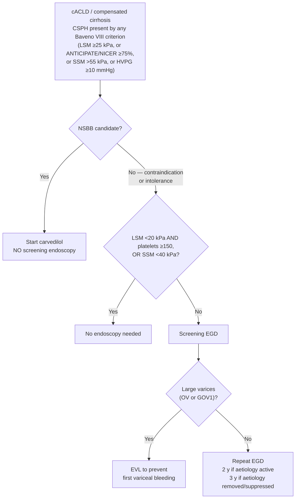

> **[[baveno-viii-2026-portal-hypertension|Baveno VIII (2026)]] supersedes [[baveno-vii-2022-portal-hypertension|Baveno VII (2022)]].** Where the two differ, this page states the Baveno VIII position and names what changed. The full old-value → new-value table lives on the source page under *What changed from Baveno VII*.

## Contents
- [[#Assessment]]
  - [[#Establishing the Diagnosis]]
  - [[#Severity Assessment]]
  - [[#Classification / Typing]]
- [[#Differential Diagnosis]]
- [[#Diagnostics]]
- [[#Therapeutics]]
  - [[#Prevention of Decompensation (Compensated Cirrhosis With CSPH)]]
  - [[#Primary Prophylaxis for Variceal Hemorrhage]]
  - [[#Acute Variceal Hemorrhage (AVH) — Initial Management]]
  - [[#Secondary Prophylaxis]]
  - [[#Prevention of Further Decompensation (Ascites, Post-Bleed)]]
  - [[#Gastric and Ectopic Varices]]
  - [[#Portal Hypertensive Gastropathy (PHG) and GAVE]]
  - [[#Special Situations]]
- [[#See Also]]
- [[#Sources]]

## Assessment

### Establishing the Diagnosis

Portal hypertension (PH) is defined as a portocaval pressure gradient (portal vein pressure minus inferior vena cava pressure) >5 mm Hg, measured as the hepatic venous pressure gradient (HVPG). The most common cause by far is [[cirrhosis|cirrhosis]] (sinusoidal/intrahepatic PH), followed by [[portal-vein-thrombosis|portal vein thrombosis]] (prehepatic) and hepatic outflow obstruction (posthepatic, e.g., [[budd-chiari-syndrome|Budd-Chiari]]).

**Classification by anatomical site:**

| Level | Examples |
|---|---|
| Prehepatic | [[portal-vein-thrombosis\|Portal vein thrombosis]], splenic vein thrombosis |
| Intrahepatic — presinusoidal | Schistosomiasis, [[primary-biliary-cholangitis\|primary biliary cholangitis]], sarcoidosis |
| Intrahepatic — sinusoidal | **Cirrhosis** (most common), [[alcohol-associated-liver-disease\|alcohol-associated hepatitis]] |
| Intrahepatic — postsinusoidal | Sinusoidal obstruction syndrome (VOD) |
| Posthepatic | [[budd-chiari-syndrome\|Budd-Chiari syndrome]], congestive hepatopathy (heart failure, constrictive pericarditis) |

**cACLD (Compensated Advanced Chronic Liver Disease):** patients likely close to cirrhosis based on LSM and platelet count, without requiring histological/radiological confirmation. Key threshold: LSM ≥15 kPa by [[liver-stiffness-measurement|transient elastography]] [[aasld-2023-portal-hypertension]]. **Throughout Baveno, "LSM" means vibration-controlled transient elastography (VCTE)** unless another modality is named.

- LSM criteria: **<10 kPa rules out cACLD** (absent other clinical/imaging signs); **10–15 kPa suggestive**; **>15 kPa highly suggestive** (1.3) [[baveno-viii-2026-portal-hypertension]]
- LSM <10 kPa → negligible 3-year risk (≤1%) of decompensation and liver-related death (1.5). **Vascular liver disease is the exception** — LSM <10 kPa *with* clinical or imaging signs of portal hypertension should raise suspicion for [[porto-sinusoidal-vascular-disorder|PSVD/NCPF]] or another vascular cause, not reassure (1.6, new in VIII)
- **"cACLD" is now the preferred term when the diagnosis rests on NITs** (1.2). Baveno VII called "cACLD" and "compensated cirrhosis" equally acceptable but not interchangeable; Baveno VIII keeps them non-interchangeable and adds the preference
- **LSM is always performed fasting** — for cACLD *and* for CSPH (1.4, changed from Baveno VII, which required fasting only on a repeat). An index LSM ≥10 kPa should be **repeated**, or complemented with another validated NIT of advanced fibrosis, before calling it cACLD

**Clinically significant portal hypertension (CSPH):** HVPG ≥10 mm Hg. CSPH marks the threshold above which clinical decompensation risk rises substantially (varices, [[ascites]], [[hepatic-encephalopathy|HE]]).

- HVPG >5 mmHg = sinusoidal PH; **≥10 mmHg = CSPH** (Baveno VII 1.10 — changed from >10 to ≥10; carried forward unchanged in Baveno VIII's summary box of still-valid statements)
- In [[primary-biliary-cholangitis|PBC]] a presinusoidal component means HVPG **underestimates** PH severity. In **[[nafld-masld|MASLD]]-related cACLD, HVPG may underestimate the true portal pressure gradient**, but an HVPG ≥10 mmHg still marks a significantly increased decompensation risk versus the lower — though not absent — risk below 10 mmHg (Baveno VIII 2.5)
- Signs of PH with HVPG <10 mmHg → rule out [[porto-sinusoidal-vascular-disorder|PSVD/NCPF]]; likewise **LSM <10 kPa with clinical/imaging signs of PH** (Baveno VIII 1.6)
- HVPG ≥16 mmHg predicts increased short-term mortality after **non-hepatic abdominal surgery**; CSPH predicts decompensation/death after liver resection for [[hepatocellular-carcinoma|HCC]] (both retained from Baveno VII in the Baveno VIII still-valid box)
- **Baveno VIII favours NITs over routine HVPG in daily practice** — the document flags its own retained HVPG statements as "to be interpreted in the context of current Baveno VIII recommendations which favor non-invasive tests over routine HVPG measurements." Statement 1.18 goes further: the paradigm is shifting from non-invasive *estimation of CSPH probability* to non-invasive *prediction of decompensation as a direct endpoint*, whose key prognostic inputs are CSPH, hepatic function, and aetiological factors

**Clinical decompensation** is defined by clinically evident [[ascites]] **or hepatic hydrothorax** caused by portal hypertension, [[variceal-upper-gi-bleeding|variceal bleeding]], or overt [[hepatic-encephalopathy|hepatic encephalopathy]] (West Haven grade ≥II) (Baveno VIII 3.3). Once decompensation occurs, median survival decreases from >12 years to <1.5 years.

**"Further decompensation":** recurrent or refractory complications; **much higher mortality than first decompensation**. Baveno VIII 4.1 replaces the Baveno VII wording with an event-specific definition — the operative criteria live on [[cirrhosis|cirrhosis → Classification / Typing]].

### Severity Assessment

**High-risk varices — the definition behind every "high-risk varices" recommendation on this page.**

| Source | High-risk varices = | Low-risk varices = |
|---|---|---|
| [[aasld-2023-portal-hypertension]] (behind GS 19, 23, 24) | **Moderate/large varices**, **OR** varices of **any size with red wale marks**, **OR** varices of **any size in a [[cirrhosis\|CTP class C]] patient** | — |
| [[baveno-vii-2022-portal-hypertension]] 7.5–7.6 (ascites setting) — **superseded** | **Large varices (≥5 mm)**, **OR** red spot signs, **OR** Child-Pugh C | **Small (<5 mm)** *and* no red signs *and* not Child-Pugh C |

- Increasing CTP class, variceal size, and red wale marks **each independently** raise first-bleed risk — the three criteria are alternatives, not requirements.
- ⚠ **The Baveno row above no longer drives a decision in the ascites setting.** [[baveno-viii-2026-portal-hypertension|Baveno VIII]] 4.4 prescribes carvedilol/cNSBB for **ascites plus varices of any size**, without the low- vs high-risk split. The size/red-sign/CTP-C definition is retained here because Baveno VIII 3.19 still turns on "**large varices**" (OV and GOV1) for EVL in NSBB-ineligible compensated patients, and because [[aasld-2023-portal-hypertension]] uses it throughout.
- If the high-risk varices are **small**, NSBB is the only technically feasible option; if **large**, both NSBB and [[variceal-upper-gi-bleeding|EVL]] are possible ([[aasld-2023-portal-hypertension]]).

**HVPG (gold standard):** the **full interpretation ladder (normal / subclinical / CSPH / ≥16 / >20) and the measurement technique live on [[hepatic-venous-pressure-gradient]]** — that page is the single home; the strata are not restated here. The two values that change management on *this* page are **≥10 mm Hg (CSPH → primary prophylaxis)** and **>20 mm Hg measured at the time of bleeding (→ pre-emptive [[tips|TIPS]])**.

> ⚠ **"HVPG ≥12 mm Hg = variceal bleeding threshold" has been removed from this page (2026-09-02).** No ingested source states it. Full-text search of [[aasld-2023-portal-hypertension]] and [[baveno-vii-2022-portal-hypertension]] finds 12 mm Hg **only** as the **post-TIPS portosystemic gradient target** ("NSBB are not required after TIPS placement if portosystemic gradient is reduced to under 12 mm Hg"). Do not refill it from memory — see the same flag on [[hepatic-venous-pressure-gradient]].

**EUS-PPG (emerging alternative).** [[interventional-eus-vascular|EUS-guided portosystemic pressure gradient]] directly and sequentially measures **hepatic vein and portal vein pressures** by needle puncture (gradient = mean portal − mean hepatic vein pressure), rather than using wedged pressure as an indirect proxy. Because it measures portal pressure directly, expert consensus favors it **over [[hepatic-venous-pressure-gradient|HVPG]] when a presinusoidal or noncirrhotic cause of PH is suspected** (where wedged pressure underestimates severity) and in MASH; its indications include all HVPG indications, and it enables a same-session "one-stop-shop" with variceal-screening EGD and EUS [[liver-biopsy|liver biopsy]] ([[wang-2026-eus-ppg-delphi-consensus]]). Technique lives on [[interventional-eus-vascular]].

![[portal-hypertension-2023-noninvasive-staging-algorithm-09.png|700x378]]
*Figure 3 — Noninvasive tests for staging and management of compensated advanced chronic liver disease (cACLD): LSM ranges, CSPH probability, endoscopy indications, LSM monitoring, and alternatives to TE. ([[aasld-2023-portal-hypertension]])*

**Noninvasive staging of cACLD — the "Rule of Five" (10-15-20-25 kPa).** AASLD 2023 Figure 1B and Baveno VIII 1.8 give the same ladder — progressively higher relative risk of decompensation and liver-related death, **independent of aetiology**.

| LSM by VCTE (kPa) | Platelets (×10⁹/L) | Interpretation |
|---|---|---|
| <10 | — | Rules out cACLD (≤1% 3-yr decompensation/death risk) — **unless** there are clinical/imaging signs of PH, which point to [[porto-sinusoidal-vascular-disorder\|vascular liver disease]] |
| 10–15 | — | Suggestive of cACLD |
| ≤15 | ≥150 | **Rules out CSPH** (NPV >90%) — Baveno VIII 1.15 (LoE 1, strong; upgraded from Baveno VII's B.2) |
| >15 | — | Highly suggestive of cACLD |
| 15 → 20 → 25 without a rule-out or rule-in criterion | — | **Indeterminate zone — CSPH unclear.** Re-evaluate at 12 months, or add SSM (1.17) |
| ≥25 | any | **Diagnostic of CSPH** — but only in **virus- and/or alcohol-related** and **non-obese (BMI <30 kg/m²) MASLD-related** cACLD (1.16b) |

> ⚠ **The Baveno VII ANTICIPATE risk bands are superseded.** Baveno VII 2.17 defined a **≥60%** CSPH-risk group as LSM 20–25 kPa with platelets <150 ×10⁹/L, or LSM 15–20 kPa with platelets <110 ×10⁹/L. Baveno VIII replaces those bands with a single **≥75% estimated probability** threshold applied to the ANTICIPATE model output (below). Do not carry the 60% bands forward.

**Diagnosing CSPH non-invasively — the three Baveno VIII rule-in criteria (1.16).** *Any one* establishes the diagnosis of CSPH; consider each criterion's limitations. This is new in Baveno VIII: VII had only the LSM ≥25 kPa limb plus probability estimates.

| Criterion | Threshold | Where it applies | Grade |
|---|---|---|---|
| **ANTICIPATE / ANTICIPATE-NASH** estimated probability of CSPH | **≥75%** | ANTICIPATE-NASH for [[nafld-masld\|MASLD]] with **obesity (BMI ≥30 kg/m²)**; ANTICIPATE otherwise | LoE 1, strong |
| **NICER** model estimated probability | **≥75%** | Aetiology-agnostic | LoE 2, strong |
| **LSM** by VCTE | **≥25 kPa** | Virus- and/or alcohol-related cACLD; **non-obese (BMI <30) MASLD**-related cACLD | LoE 1, strong |
| **SSM at 100 Hz** | **>55 kPa** | Aetiology-agnostic | LoE 2, strong |

- **Rule out** with **LSM ≤15 kPa *and* platelets ≥150 ×10⁹/L** (1.15) — both required.
- LSM + platelets and their derivatives (the ANTICIPATE models) are the **mainstay**; SSM further improves classification (1.12–1.13).
- ANTICIPATE, ANTICIPATE-NASH, and NICER are **model outputs, not bedside arithmetic** — their coefficients are not published in any ingested source, so the probability must come from the published calculator.

![[portal-hypertension-2022-baveno7-cacld-csph-algorithm-05.png|750x330]]
*Figure 4 — the Baveno VII "rule of 5" ladder for LSM by transient elastography (10-15-20-25 kPa), retained here because the ladder itself is unchanged in Baveno VIII. Read the CSPH rule-in row against the Baveno VIII criteria table above, not against this figure: the SSM and ANTICIPATE thresholds printed in Baveno VII have been revised. ([[baveno-vii-2022-portal-hypertension]])*

**Note:** "Rule of Five" cutoffs are less reliable in [[obesity]]/[[nafld-masld|MASLD]], [[primary-sclerosing-cholangitis|PSC]] with dominant strictures, and elevated ALT (>3× ULN). Non-VCTE elastography methods (MRE, pSWE, 2D-SWE) are still not validated for these specific cutoffs.

**Spleen stiffness measurement (SSM) — the Baveno VIII thresholds.** SSM now carries three separate cut-offs, each answering a different question. They are **not interchangeable**:

| Question | Threshold | Statement |
|---|---|---|
| Does this patient have CSPH? | **SSM (100 Hz) >55 kPa** rules it **in**, any aetiology | 1.16c |
| Can this NSBB-ineligible patient skip screening endoscopy? | **SSM <40 kPa** — low probability of high-risk varices | 1.19 |
| Has CSPH resolved after recompensation? | **SSM <25 kPa with LSM <15 kPa** rules CSPH **out** | 7.19b |

> ⚠ **Baveno VII's SSM numbers are superseded and must not be mixed with these.** Baveno VII 2.21 gave **SSM <21 kPa (rule out)** and **>50 kPa (rule in)**, validated only in **viral-hepatitis** cACLD. Baveno VIII gives no general SSM rule-out for CSPH, moves the rule-in to **>55 kPa at 100 Hz**, and makes it aetiology-agnostic.

**Monitoring — repeat NITs every 12 months** in cACLD (1.9; Baveno VII said LSM *could* be repeated at 12 months, VIII says NITs for CSPH *should* be). Changes in LSM carry prognostic information, but **the most recent value guides clinical decision-making** (1.10, new in VIII).

**Relative-change thresholds that mean something** — the magnitude of change that maps onto a real change in the risk of liver-related events ([[baveno-viii-2026-portal-hypertension]], Panel 2). Full context on [[liver-stiffness-measurement]]:

- **LSM by VCTE: confirmed ≥30% relative change** — in [[alcohol-associated-liver-disease|alcohol-related]] cACLD (2.3) and in MASLD-related cACLD (2.9), **particularly when it crosses the 15 kPa threshold**
- **MRE: ≥20% relative change** (2.11); **ELF: 0.5-unit absolute change** (2.12); pSWE/2D-SWE — insufficient evidence to recommend as monitoring tools (2.10)

**Confirming an abnormal LSM:** VCTE gives false positives — **always measure fasting**, repeat an index LSM ≥10 kPa, or complement it with another validated NIT of advanced fibrosis (1.4). Baveno VIII does not restate specific serum cut-offs; **the named ones (FIB-4 ≥2.67, ELF ≥9.8, FibroTest ≥0.58 alcohol/viral or ≥0.48 NAFLD) are Baveno VII's** (2.11) and are retained on [[noninvasive-liver-disease-assessment]] as such. LSM 7–10 kPa with ongoing liver injury → monitor case-by-case for progression to cACLD.

**Clinically significant LSM *decrease*** (Baveno VII 2.13, not restated in VIII): ≥20% drop with LSM <20 kPa, **or** any drop to <10 kPa.

### Classification / Typing

Cirrhosis stages (per clinical features and HVPG):

- **Compensated, no portal hypertension:** F0–F2 histology equivalent; **HVPG 1–5 mm Hg** (normal); no varices, no decompensation events
- **Compensated, mild (subclinical) PH:** F3/F4 (thin septa); **HVPG 6–9 mm Hg** — portal pressure is raised but **below the ≥10 mm Hg CSPH threshold**; lower decompensation risk
- **Compensated with CSPH:** F4 (thick septa); **HVPG ≥10 mm Hg**; ± varices; higher decompensation risk — this is the stage at which NSBB is indicated (GS 14)
- **First decompensation:** First overt event (ascites, AVH, HE)
- **Further decompensation:** Recurrent/refractory events; >20 mm Hg HVPG worsens outcomes

**Recompensation (Baveno VIII 7.1–7.19)** — the required criteria, the aetiology-specific cure definitions, and the "not recompensation" exclusions live on [[cirrhosis|cirrhosis → Recompensation]]. Its consequence for NSBB management — and the invasive and non-invasive rules for confirming that CSPH has resolved — is under [[#Therapeutics]] below.

---

## Differential Diagnosis

*Workup: see [[ascites]] for the ascites/portal-hypertension arm and [[abnormal-liver-chemistries]] for the aetiologic liver-test evaluation.*

- [[porto-sinusoidal-vascular-disorder|Porto-sinusoidal vascular disorder (PSVD)]] — the umbrella term for noncirrhotic intrahepatic PH (idiopathic portal hypertension, nodular regenerative hyperplasia, obliterative portal venopathy); biopsy required; HVPG may underestimate PH, and signs of PH with HVPG <10 mmHg or LSM <10 kPa should prompt this diagnosis (Baveno VII statement 1.13)
- [[portal-vein-thrombosis]] — presinusoidal; HVPG normal; Doppler ultrasound diagnostic
- [[budd-chiari-syndrome]] — posthepatic; caudate hypertrophy, hepatic vein outflow obstruction
- Congestive hepatopathy (right heart failure) — elevated jugular venous pressure; echo confirms; may cause false-positive HVPG
- [[primary-sclerosing-cholangitis]] — presinusoidal component; HVPG may be unreliable if dominant stricture
- Schistosomiasis — presinusoidal; periportal fibrosis ("pipestem"); travel history; eosinophilia

---

## Diagnostics

| Test | Purpose |
|---|---|
| **HVPG** | Gold standard for PH assessment; prognostic; guides treatment response |
| **Liver stiffness (VCTE/TE)** | cACLD staging; CSPH identification (see Rule of Five table above); annual monitoring |
| Platelet count | Combined with LSM for noninvasive CSPH staging |
| Abdominal ultrasound + Doppler | Portal vein patency, hepatofugal flow, splenomegaly, portosystemic collaterals, ascites |
| CT/MRI abdomen | Confirms varices, collaterals, ascites, [[hepatocellular-carcinoma\|HCC]] surveillance, PVT anatomy |
| [[upper-endoscopy\|Upper endoscopy (EGD)]] | Varices detection; high-risk features (large size, red wale marks); needed when TE unavailable or NSBB contraindicated |
| Child-Pugh score / MELD | Liver synthetic function; prognosis; TIPS candidacy (scoring components: see [[cirrhosis]]) |
| Labs | LFTs, INR, albumin, bilirubin, creatinine, CBC (thrombocytopenia = PH marker) |
| Diagnostic paracentesis | PMN count, culture, albumin (SAAG), total protein for ascites evaluation |

**When to perform EGD for varices (AASLD 2023):**

- When TE is NOT available to diagnose CSPH: screen all patients with cirrhosis
- Baveno VI criteria can avoid endoscopy: LSM <20 kPa + platelets >150 K/mm³ = very low probability of high-risk varices (GS 14-16) [[aasld-2023-portal-hypertension]]
- When TE IS available and shows CSPH: NSBB initiation can obviate need for screening endoscopy (GS 14)
- Patients on NSBB therapy: screening EGD generally unnecessary (GS 16)

**Does this patient need a screening EGD? (Baveno VIII — the NSBB question comes first)**

Screening is framed around **whether the patient will be started on an NSBB**, because the treatment target is preventing decompensation, not finding varices:

- **On an NSBB → no screening endoscopy** (3.18) — the result would not change management (they are already on the drug that both prevents decompensation and prevents a first variceal bleed)
- **Cannot start an NSBB (contraindication/intolerance) → screening EGD, *unless* LSM <20 kPa *and* platelets ≥150 ×10⁹/L (the Baveno VI criteria), *or* SSM <40 kPa** (1.19)
  - ⚠ **Baveno VIII inverts the phrasing and hardens the SSM number.** Baveno VII 2.19 made endoscopy the default when **LSM ≥20 kPa *or* platelets ≤150**, with **SSM ≤40 kPa** (2.22) as the escape. VIII states it as a single exemption clause — LSM <20 **and** platelets ≥150 — and moves the spleen threshold to **SSM <40 kPa**. The patients selected are the same; the sentence you apply at the bedside is not
- **No varices at the index EGD in an NSBB-ineligible patient → repeat the EGD**, unless they later satisfy the 1.19 exemption. **Interval: 2 years if the aetiological factor is still active, 3 years if it has been removed/suppressed** (1.20, new in VIII) — this **replaces** Baveno VII's yearly TE-plus-platelet surveillance (2.20). The follow-up is now endoscopic, not elastographic
- **Ascites and not on carvedilol/cNSBB →** carvedilol/cNSBB is indicated for any varices (4.4); if the patient cannot take it, endoscopic therapy alone prevents first variceal bleeding (4.5). See [[#Prevention of Further Decompensation (Ascites, Post-Bleed)]]
- **[[porto-sinusoidal-vascular-disorder|PSVD/NCPF]]:** the **LSM-based** cirrhosis criteria still **do not apply** (8.48) — but Baveno VIII does create a spleen-based escape: endoscopy can be avoided if **SSM <40 kPa and bilirubin <1 mg/dL** (8.47)

**When there is also [[hepatocellular-carcinoma|HCC]] (1.21–1.23, all new in VIII):**

- **Macrovascular invasion → NITs for CSPH/high-risk varices may not be applicable** at all
- **BCLC 0–C:** LSM ≤15 kPa + platelets ≥150 ×10⁹/L still rules out CSPH (NPV >90%) and **EGD may be avoided**
- **BCLC 0–A without a large (>5 cm) nodule in the right lobe:** ANTICIPATE/ANTICIPATE-NASH **≥75%** is highly suggestive of CSPH

*Source: [[baveno-viii-2026-portal-hypertension]] statements 1.19–1.23, 3.18–3.19, 8.47–8.48.*

---

## Therapeutics

### Prevention of Decompensation (Compensated Cirrhosis With CSPH)

**Goal:** Prevent first decompensation event (GS 11).

**NSBBs are the cornerstone:**

- **Carvedilol is the preferred NSBB** (GS 1) — additional anti-alpha-1 adrenergic activity reduces intrahepatic vascular resistance; greater HVPG reduction than propranolol/nadolol
- Maintenance dose: **6.25–12.5 mg/day** (GS 2); start 6.25 mg once daily, increase to twice daily after 3 days if tolerated
- Goal: SBP ≥90 mm Hg (no heart rate target for carvedilol)
- NSBBs considered for patients with cACLD + CSPH even without varices (PREDESCI trial: 51% HR reduction in first decompensation) (GS 12)
- NSBBs NOT recommended for patients without CSPH (GS 9)
- **Baveno VIII 3.15/3.16 states this as a recommendation, not a consideration:** treatment with NSBBs, **particularly carvedilol**, *is recommended* in compensated cirrhosis/cACLD with CSPH **to prevent decompensation and improve survival** (LoE 2, strong); without CSPH, NSBB **should not be used** (LoE 2, strong). Baveno VII 5.14 phrased the positive limb as "should be considered"
- **After aetiological therapy, CSPH can persist and should be reassessed** (3.14b) — cure of the aetiology does not by itself retire the NSBB question
- **With CSPH and [[hepatocellular-carcinoma|HCC]], preventing decompensation stays a relevant endpoint across all oncological stages**, independent of tumour-directed therapy (3.17)

**Absolute contraindications to NSBBs (Box 2):** Asthma, 2nd/3rd degree AV block (without pacemaker), sick sinus syndrome, extreme bradycardia (<50 bpm)
**Relative contraindications:** Psoriasis, peripheral arterial disease, COPD, pulmonary artery hypertension (controversial), insulin-dependent DM, Raynaud syndrome (GS 13)

**NSBB dose reduction/discontinuation:** If persistent SBP <90 mm Hg or severe adverse effects → reduce/discontinue; then perform EGD to assess for high-risk varices needing EVL (GS 24)

- With ascites, Baveno VII gives explicit thresholds: dose-reduce or stop for **persistent SBP <90 mmHg or MAP <65 mmHg, and/or HRS-AKI**; **re-initiate/re-titrate once BP recovers or HRS-AKI resolves**; if permanently intolerant → EVL (B.1, 7.7) [[baveno-vii-2022-portal-hypertension]]
- Baveno VII adds that HVPG measurement is not needed to decide: treat when clinically indicated, independent of the ability to measure HVPG (B.2, 5.16)

**Stopping an NSBB after the aetiology is cured/suppressed** (SVR in [[hepatitis-c|HCV]], [[chronic-hepatitis-b|HBV]] suppression, sustained alcohol abstinence) [[baveno-vii-2022-portal-hypertension]]:

- On NSBB with **no evident CSPH (LSM <25 kPa)** post-cure → repeat endoscopy, preferably after 1–2 years; **if no varices, NSBB can be discontinued** (C.2, 3.9)
- HCV cACLD with SVR, no co-factors, and consistent improvement to **LSM <12 kPa + platelets >150×10⁹/L** → discharge from portal-hypertension surveillance (LSM and endoscopy) entirely; **continue [[hcc-surveillance|HCC surveillance]]** (B.1, 3.7)
- Baveno VI criteria (LSM <20 kPa + platelets >150×10⁹/L) remain valid to rule out high-risk varices after SVR/viral suppression (B.1, 3.8)
- Overweight/obesity, diabetes, and alcohol still drive progression after cure and must be addressed (Baveno VII 3.3; Baveno VIII 3.8)
- **Complete alcohol abstinence should be favoured over reduced consumption** in [[alcohol-associated-liver-disease|alcohol-related]] cACLD — return to or continuation of drinking is a major driver of liver-related events (Baveno VIII 2.1–2.2)

**Stopping an NSBB after recompensation — Baveno VIII makes this actionable.** Baveno VII 7.24 said only "do not stop NSBBs unless CSPH resolves" and gave no way to establish resolution. Baveno VIII supplies one:

- **Discontinue carvedilol/cNSBB only if CSPH resolution is *confirmed*** (7.18) — persistence of varices or collaterals is **not** evidence that CSPH persists (7.17), and the bleeding risk from varices that persist after recompensation appears low
- **Confirm invasively:** **HVPG <10 mmHg measured off carvedilol/cNSBB** (7.16) — the "off drug" qualifier is the decision; a gradient measured on an NSBB does not answer the question
- **Confirm non-invasively** (7.19): **LSM <10 kPa** rules CSPH out; **LSM <15 kPa plus SSM <25 kPa** rules it out; **LSM >25 kPa** rules it in
- Full recompensation criteria: [[cirrhosis|cirrhosis → Recompensation]]

**Treating underlying liver disease:** Antiviral therapy ([[direct-acting-antivirals|HCV DAAs]], HBV NAs), alcohol cessation, immunosuppression ([[autoimmune-hepatitis|AIH]]) → can reduce HVPG and reverse cirrhosis in long-term follow-up (GS 10). Lifestyle modification (weight, alcohol, diet) is concurrent priority.

**Statins and anticoagulation — Baveno VIII walks the claim back.**

> ⚠ **Do not treat a statin as portal-hypertension therapy.** Baveno VII 4.1–4.2 said statin use "should be **encouraged**" where an approved indication exists, citing a portal-pressure effect (A.1) and a survival benefit (B.1). **[[baveno-viii-2026-portal-hypertension|Baveno VIII]] finds the evidence insufficient to recommend statins — or anticoagulation — to prevent decompensation, in either the compensated (3.22) or the decompensated (4.11) setting.** Both should be **used or maintained only if prescribed for their own approved indications** (LoE 2, strong). Same consortium, newer document: the Baveno VIII position governs this page. The role of statins in preventing decompensation is now an explicit research-agenda item (RA3.14).

- **Dosing caution persists:** simvastatin ≤20 mg/d in Child-Pugh B/C with close muscle and liver toxicity monitoring (Baveno VII 4.2); Baveno VIII 4.11 restates the **higher risk of statin toxicity in Child-Pugh C**
- **Aspirin** should not be discouraged where indicated — may reduce HCC, liver-related complications, and death (Baveno VII 4.3; retained in the Baveno VIII still-valid box)
- **Oral health is new:** periodontal disease is associated with a higher risk of decompensation (3.12) and **regular dental and periodontal care may decrease that risk** (3.23)

**TIPS in the compensated patient (Baveno VIII 3.20):**

- **Not recommended for the prevention of decompensation** in compensated cirrhosis/cACLD with CSPH (LoE 5, strong) — concordant with AASLD GS 21
- **Pre-operative [[tips|TIPS]] may be considered before major surgery** to reduce the risk of postoperative decompensation (LoE 4, weak) — surgery, especially major surgery, precipitates decompensation and/or [[acute-on-chronic-liver-failure|ACLF]] in patients with CSPH, with risk rising as portal hypertension worsens (3.13). Concordant with [[acg-2025-perioperative-cirrhosis]] Rec 3

### Primary Prophylaxis for Variceal Hemorrhage

**Compensated cirrhosis with CSPH + varices not previously bled:**

- **NSBB (carvedilol) preferred** — initiated when CSPH identified, varices present or not (GS 14, 23); reduces both variceal hemorrhage and decompensation
- **EVL for patients who cannot receive NSBBs** (GS 19) — repeat every 2–4 weeks until obliteration; then EGD at 6 months, then annually (GS 20)
- EVL associated with higher complication rates and mortality than NSBBs in one meta-analysis; NSBBs preferred if tolerated

**Decompensated cirrhosis:**

- Annual EGD if not on NSBBs and never bled (GS 22)
- NSBBs or EVL when high-risk varices detected; NSBBs preferred (GS 23)

### Acute Variceal Hemorrhage (AVH) — Initial Management

**Immediate (before endoscopy):**

1. **Vasoactive therapy** immediately: [[somatostatin-analogs|octreotide]] (50 mcg IV bolus → 25–50 mcg/hr × 2–5 days), somatostatin (250 mcg bolus → 250–500 mcg/hr), or terlipressin if available (GS 25–26)
2. **IV [[antibiotic-prophylaxis-cirrhosis|antibiotics]]** immediately: ceftriaxone 1 g IV q24h × 5 days (preferred in Child-Pugh C or high-resistance); de-escalate when bleeding controlled and no active infection (GS 27)
3. **Restrictive transfusion:** target Hgb ~7 g/dL; avoid overtransfusion (worsens portal pressure) (GS 28)
4. **No FFP or platelets** based on INR/platelet count targets — no evidence of benefit; FFP may cause harm (GS 29)
5. **Airway assessment:** endotracheal intubation before endoscopy if altered mental status or aspiration risk

**Endoscopy (within 12 hours of presentation) (GS 30):**

- IV erythromycin 125–250 mg × 30–120 minutes before endoscopy (improves visualization)
- **Esophageal varices → EVL** (GS 31); repeat every 2–4 weeks until obliteration post-discharge
- **Gastric/ectopic varices** → cyanoacrylate injection, TIPS, or BRTO/obliterative therapy (GS 43–47; see below)
- **Failed initial hemostasis** → balloon tamponade or esophageal stent as bridge to TIPS (GS 34)

**Preemptive TIPS (within 72h, ideally within 24h of endoscopy):**
Indicated for: CTP class B score >7 with active bleeding at endoscopy, OR CTP class C score 10–13 (GS 32). Polytetrafluoroethylene-covered stents. If TIPS not locally available → transfer. Preemptive TIPS significantly improves bleeding control and survival (PREVENT and TRANSJIP-1 trials).

**Baveno VIII 5.31–5.37 revises the criteria and removes the futility rule** [[baveno-viii-2026-portal-hypertension]]:

- **Criteria (any one):** **Child-Pugh class C 10–13 points**, **or** Child-Pugh class B >7 **with active bleeding at initial endoscopy**, **or HVPG ≥20 mmHg** at the time of AVB (LoE 1, strong). *Changed from Baveno VII, which said CTP **C <14** and HVPG **>**20 — VIII's CTP band now matches AASLD; the HVPG limb remains Baveno-only.* The Figure 3 footnote adds a candidate profile of **age <75 y, creatinine <3 mg/dL, no heart failure**
- **Missed the 72 h window? TIPS may still benefit** — within **2 weeks** for Child-Pugh C 10–13, within **1 week** for Child-Pugh B >7 with active bleeding (5.32, new in VIII, LoE 4 weak)
- **Not absolute contraindications:** [[acute-on-chronic-liver-failure|ACLF]], overt [[hepatic-encephalopathy|HE]], hyperbilirubinaemia, **MELD score**, or **severe alcohol-related hepatitis** (5.33 — VIII adds the last two to Baveno VII's list)
- **Refractory overt HE after TIPS** despite medical and interventional therapy → **may be prioritised for [[liver-transplantation|liver transplantation]]** (5.34, new)

> ⚠ **The numeric TIPS futility rule has been withdrawn.** Baveno VII 6.31 said TIPS "may be futile" at **Child-Pugh ≥14, or MELD >30 with lactate >12 mmol/L**, and [[aasld-2024-tips]] GS 23 still carries essentially that rule. **Baveno VIII 5.37 states instead that salvage TIPS should be discussed for any refractory variceal bleeding *regardless of age, Child-Pugh and MELD scores*, case-by-case**, and its research agenda asks for a new externally validated futility score (RA5.13). Newer tier-1 source governs; the older thresholds are retained on [[tips]], labelled superseded.

- Haemodynamic target: post-TIPS **PPG <12 mmHg** (near-complete protection from portal hypertensive bleeding); ≥50% relative reduction may also be useful (Baveno VII 1.23, retained)

**Post-hemostasis (patients who do NOT receive preemptive TIPS):**

- Start NSBB at discontinuation of vasoactive therapy (GS 33)
- Discontinue [[proton-pump-inhibitors|PPI]] once AVH confirmed as bleeding source (no other indications) (GS 37)
- Start [[enteral-access|enteral feeding]] once AVH controlled; variceal bands do not contraindicate NG tube (GS 36)

**Salvage/Rescue TIPS:**

- Uncontrolled AVH ("salvage") or rebleed despite vasoactive therapy + EVL ("rescue") (GS 35)

### Secondary Prophylaxis

- **NSBB + EVL** for all who did not receive preemptive TIPS (GS 38). **Baveno VIII 4.8 adds a preference: carvedilol over conventional NSBB**, *independently of what was used for primary prophylaxis* (LoE 2, strong). Baveno VII 7.8 offered traditional NSBB **or** carvedilol with no preference
- **Cannot tolerate either EVL or carvedilol/cNSBB → maintain the tolerated therapy as monotherapy** (4.9)
- **TIPS as secondary prophylaxis** only if an additional TIPS indication exists (e.g., refractory ascites) (GS 39); **TIPS should be considered when portal-hypertensive bleeding recurs despite carvedilol/cNSBB + EVL** — i.e. failure of secondary prophylaxis (Baveno VIII 4.13)
- **Bled *and* had a non-bleeding decompensating event, and ineligible for rescue/pre-emptive TIPS → consider TIPS and [[liver-transplantation|LT]]** (4.10)

### Prevention of Further Decompensation (Ascites, Post-Bleed)

*Definition of further decompensation: [[cirrhosis|cirrhosis → Classification / Typing]]. Ascites management itself: [[ascites]].*

- **Ascites + varices of any size → carvedilol/cNSBB**, both to prevent first variceal bleeding (LoE 1, strong) and to lower the risk of ascites-related complications (LoE 3, strong), **with carvedilol preferred** (Baveno VIII 4.4)
  - ⚠ **Baveno VIII drops the size stratification.** Baveno VII 7.5–7.6 split this by variceal size and features — "low-risk" (small <5 mm, no red signs, not Child-Pugh C) vs "high-risk" (≥5 mm, or red spots, or Child-Pugh C) — and made NSBB *preferred over EVL* only in the high-risk group. VIII gives one rule for any varices with ascites
- **Ineligible for carvedilol/cNSBB → endoscopic therapy alone** to prevent first variceal bleeding (4.5)
- **Dose-reduce or discontinue** carvedilol/cNSBB for persistent **SBP <90 mmHg or MAP <65 mmHg**, and/or **[[aki-in-cirrhosis|HRS-AKI]]** (4.6); **re-initiate/re-titrate once HRS-AKI resolves and/or blood pressure recovers** (4.7)
- **Aetiological treatment is recommended after the first decompensating event** to prevent further decompensation (4.2), and **aetiological cure/control improves survival** once further decompensation has occurred (6.2)
- **Statins are not recommended to prevent further decompensation**, though they continue for their own approved indications, weighing the higher toxicity risk in Child-Pugh C (4.11)
- **Long-term primary antibiotic prophylaxis is NOT recommended** to prevent further decompensation after a first decompensating event (4.12, LoE 2 strong) — **this reverses Baveno VII 4.6**, which recommended primary prophylaxis in selected high-SBP-risk patients. Secondary prophylaxis after an episode of [[spontaneous-bacterial-peritonitis|SBP]] is unaffected (6.21)
- **[[hepatocellular-carcinoma|HCC]] does not change the plan** — prevent further decompensation the same way, weighing life expectancy and treatment side effects (4.14); HCC is **not an absolute contraindication to [[tips|TIPS]]** for recurrent/refractory ascites or hepatic hydrothorax **unless the tumour lies along the TIPS trajectory** (4.15)
- **Frailty, malnutrition, sarcopenia and myosteatosis** affect survival and should be assessed with standardised tools (4.16); every decompensated patient gets a **structured nutritional assessment with an individualised plan and physical-activity counselling** (4.17); targeted interventions for the frail/sarcopenic (4.18). See [[nutrition-in-liver-disease]]
- **Sarcopenia and frailty alone should neither indicate nor contraindicate TIPS** (4.19)

### Gastric and Ectopic Varices

**Gastric varices (Sarin classification):** [[aasld-2023-portal-hypertension]]. **Baveno VIII 5.38 formally recommends the Sarin classification** (GOV1/2, IGV1/2) to harmonise reporting, stratify bleeding risk, and inform therapeutic strategy (LoE 3, strong) — the first Baveno statement to endorse it by name.

| Type | Location | Natural history |
|---|---|---|
| **GOV1** | Gastroesophageal varix along the **lesser curvature** (continuation of esophageal varices) | Behaves like esophageal varices; treat comparably |
| **GOV2** | Gastroesophageal varix along the **greater curvature** / fundus | **Cardiofundal** — higher treatment failure, rebleeding, mortality |
| **IGV1** | **Isolated** gastric varix in the **fundus** | **Cardiofundal** — higher treatment failure, rebleeding, mortality |
| **IGV2** | Isolated gastric varix in **other areas** of the stomach (or ectopic) | — |

- All gastric/ectopic varices indicate CSPH; evaluate for [[portal-vein-thrombosis]] (GS 40). **Baveno VIII 3.21a:** patients with gastric varices **have** CSPH and benefit from NSBBs, **particularly carvedilol**, for decompensation prevention
- **Primary prophylaxis — NSBB first, but Baveno VIII now allows local therapy when NSBB is off the table.** For **high-risk GOV2 or IGV1 (cardiofundal)** varices with an NSBB contraindication or intolerance, **endoscopic injection therapy** (LoE 2, strong), **EUS-guided therapy** (LoE 4, weak), or **transvenous obliteration** (LoE 3, weak) **can be considered in centres with expertise** (3.21b)
  - ⚠ **This changes Baveno VII 5.22**, which stated there was "no indication at present" for BRTO/BATO or TIPS in primary prophylaxis of gastric variceal bleeding in compensated patients. Concordant now with [[aasld-2023-portal-hypertension]] GS 41 (ECI for high-risk cardiofundal varices in NSBB-ineligible patients)
  - **Adding local therapy *on top of* an NSBB is not supported** — limited evidence for endoscopic injection (LoE 3), EUS-guided therapy (LoE 5) or transvenous obliteration (LoE 5) in addition to NSBB to prevent first bleeding or improve survival (3.21c). AASLD GS 42 (no TIPS or BRTO for fundal varices that have not bled) is not contradicted for the TIPS limb
- **Acute bleeding:** same initial management as esophageal AVH (vasoactive, antibiotics, restrictive transfusion, EGD within 12h) (GS 43); contrast CT to define vascular anatomy (GS 44). Baveno VIII 5.39–5.41 structures GOV2/IGV1 bleeding as a **bimodal** problem — an acute haemostasis phase and a definitive phase, run in parallel or with the shortest possible interval. Details on [[variceal-upper-gi-bleeding]]
- First-line hemostasis options for GOV2/IGV1: **ECI, TIPS, or retrograde transvenous obliteration** (BRTO/PARTO/CARTO); BRTO preferred when TIPS contraindicated (GS 45). **Baveno VIII 5.40 adds EUS-guided coil + cyanoacrylate as the preferred acute option where available**, and 5.41 makes **TIPS ± variceal embolisation, as soon as possible, the preferred *definitive* treatment**
- Post-ECI: add NSBBs; repeat ECI every 2–4 weeks until obliteration; long-term surveillance (GS 46)
- Isolated splenic vein thrombosis causing GV → splenectomy, splenic vein stenting, or splenic artery embolization (GS 47)

### Portal Hypertensive Gastropathy (PHG) and GAVE

- PHG >mild: presumed CSPH; consider prophylactic NSBB (GS 48)
- Acute PHG bleeding: vasoactive therapy × 2–5 days (GS 49)
- **Baveno VIII 5.44 orders the options explicitly:** management of PHG focuses **primarily on reducing portal pressure with NSBB**; for severe or refractory PHG bleeding, **[[tips|TIPS]] is the most effective rescue therapy**. Because endoscopic therapies do not lower portal pressure, they **provide limited benefit and are reserved for focal bleeding lesions or salvage** — a demotion from Baveno VII 7.14, which said endoscopic therapy (APC, hemospray) "may be used"
- **GAVE with serial transfusion requirement → EVL is recommended over [[argon-plasma-coagulation|argon plasma coagulation]]** (Baveno VIII 5.43, LoE 1, strong): higher eradication rates, fewer treatment sessions, and reductions in recurrent bleeding, hospitalisations and transfusion requirement. Baveno VII 6.25 had listed APC, [[radiofrequency-ablation|RFA]] and band ligation as interchangeable options
- **PHG must be distinguished from GAVE** — the treatments differ (Baveno VI/VII, retained in the Baveno VIII still-valid box)

### Special Situations

**Portal hypertension in HCC (GS 52–54):**

- AVH prevention/treatment follows same principles as non-HCC patients
- NSBB for primary prophylaxis of VH and decompensation prevention in HCC with CSPH
- Occlusive PVT: EGD to screen for varices; NSBBs or EVL when detected

**[[liver-disease-in-pregnancy|Pregnancy]] (GS 55–56):**

- All patients with cirrhosis or noncirrhotic PH planning pregnancy: EGD within 1 year of conception
- Unscreened pregnant patients: EGD early in second trimester
- Primary prophylaxis: NSBBs or EVL for medium/large varices; EVL preferred if red wale marks present
- Avoid terlipressin in AVH during pregnancy (uterine stimulation); somatostatin or octreotide preferred
- Carvedilol may cause fetal growth retardation relative to propranolol in pregnancy

**Paediatric portal hypertension — Baveno VIII's first paediatric statements (1.24–1.27)** [[baveno-viii-2026-portal-hypertension]]:

- The **two leading causes** of portal hypertension in children are **extrahepatic portal vein obstruction** (see [[portal-vein-thrombosis]]) and **advanced chronic liver disease due to biliary atresia**
- **[[liver-stiffness-measurement|LSM]] is a valuable complementary tool** to identify children at risk of PH from ACLD and to monitor progression — but **management cannot rely on LSM and/or SSM alone**: the cut-offs for presence or absence of varices are not yet validated in children
- **Integrate multiple NITs instead** — e.g. the clinical prediction rule built from the **age-adjusted Z-score for spleen length, platelet count, and serum albumin** — to predict high-risk varices and guide endoscopy intervals
- Paediatric chronic PVT management (Meso-Rex bypass, distal splenorenal shunt, annual portopulmonary surveillance) is on [[portal-vein-thrombosis]]

**Pre-TEE endoscopy (GS 57):** Routine EGD prior to transesophageal echocardiography is NOT recommended in patients with cirrhosis.

**Preoperative TIPS (GS 58):** Consider case-by-case for elective nonhepatic surgery with high surgical risk from PH; weigh against increased HE and liver failure risk. Baveno VIII 3.20b concurs — **pre-operative TIPS may be considered prior to major surgery** to reduce postoperative decompensation.

---

## See Also

[[cirrhosis]], [[variceal-upper-gi-bleeding]], [[ascites]], [[spontaneous-bacterial-peritonitis]], [[aki-in-cirrhosis]], [[hepatic-encephalopathy]], [[hepatocellular-carcinoma]], [[portal-vein-thrombosis]], [[budd-chiari-syndrome]], [[porto-sinusoidal-vascular-disorder]], [[noninvasive-liver-disease-assessment]], [[liver-stiffness-measurement]], [[hcc-surveillance]], [[liver-transplantation]], [[liver-disease-in-pregnancy]], [[hepatopulmonary-syndrome-portopulmonary-hypertension]], [[primary-sclerosing-cholangitis]], [[primary-biliary-cholangitis]], [[nafld-masld]], [[upper-endoscopy]], [[acute-on-chronic-liver-failure]], [[hepatic-venous-pressure-gradient]], [[interventional-eus-vascular]], [[abnormal-liver-chemistries]], [[liver-biopsy]], [[antibiotic-prophylaxis-cirrhosis]], [[proton-pump-inhibitors]], [[somatostatin-analogs]], [[enteral-access]], [[tips]], [[rifaximin]], [[alcohol-associated-liver-disease]], [[nutrition-in-liver-disease]], [[obesity]], [[endoscopic-ultrasound]], [[hepatitis-c]], [[chronic-hepatitis-b]], [[direct-acting-antivirals]], [[autoimmune-hepatitis]], [[argon-plasma-coagulation]], [[radiofrequency-ablation]]

---

## Sources

1. [[baveno-viii-2026-portal-hypertension|Baveno VIII — Advancing Consensus in Portal Hypertension (2026)]]
2. [[aasld-2023-portal-hypertension|AASLD 2023 Practice Guidance on Portal Hypertension and Varices in Cirrhosis]]
3. [[baveno-vii-2022-portal-hypertension|Baveno VII — Renewing Consensus in Portal Hypertension (2022)]]
4. [[acg-2025-perioperative-cirrhosis|ACG Clinical Guideline: Perioperative Risk Assessment and Management in Cirrhosis (2025)]]
5. [[aasld-2024-tips|AASLD Practice Guidance: TIPS, Variceal Embolization, and Retrograde Transvenous Obliteration (2024)]]
6. [[aasld-2022-palliative-cirrhosis|AASLD Practice Guidance: Palliative Care and Symptom-Based Management for Decompensated Cirrhosis (2022)]]
7. [[wang-2026-eus-ppg-delphi-consensus|International Expert Delphi Consensus on EUS-guided Portosystemic Pressure Gradient: Best Practices and Future Directions (2026)]]
