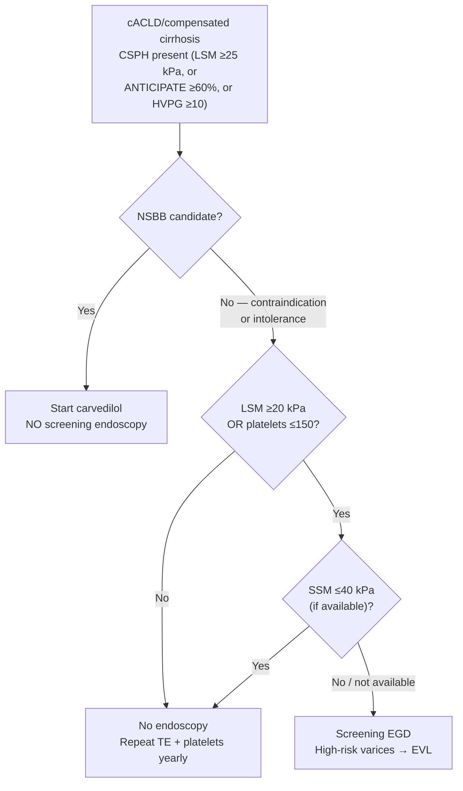

## Assessment

### Establishing the Diagnosis

Portal hypertension (PH) is defined as a portocaval pressure gradient (portal vein pressure minus inferior vena cava pressure) >5 mm Hg, measured as the hepatic venous pressure gradient (HVPG). The most common cause by far is [[cirrhosis|cirrhosis]] (sinusoidal/intrahepatic PH), followed by [[portal-vein-thrombosis|portal vein thrombosis]] (prehepatic) and hepatic outflow obstruction (posthepatic, e.g., [[budd-chiari-syndrome|Budd-Chiari]]).

**Classification by anatomical site:**

| Level | Examples |
|---|---|
| Prehepatic | [[portal-vein-thrombosis\|Portal vein thrombosis]], splenic vein thrombosis |
| Intrahepatic — presinusoidal | Schistosomiasis, [[primary-biliary-cholangitis\|primary biliary cholangitis]], sarcoidosis |
| Intrahepatic — sinusoidal | **Cirrhosis** (most common), [[alcohol-associated-liver-disease\|alcohol-associated hepatitis]] |
| Intrahepatic — postsinusoidal | Sinusoidal obstruction syndrome (VOD) |
| Posthepatic | [[budd-chiari-syndrome\|Budd-Chiari syndrome]], congestive hepatopathy (heart failure, constrictive pericarditis) |

**cACLD (Compensated Advanced Chronic Liver Disease):** A new concept denoting patients who are likely close to cirrhosis based on LSM and platelet count, without requiring histological/radiological confirmation. Key threshold: LSM ≥15 kPa by transient elastography [[aasld-2023-portal-hypertension]].

- Baveno VII LSM (TE) criteria: **<10 kPa rules out cACLD** (absent other clinical/imaging signs); **10–15 kPa suggestive**; **>15 kPa highly suggestive** (B.1) [[baveno-vii-2022-portal-hypertension]]
- "cACLD" and "compensated cirrhosis" are both acceptable terms but **not interchangeable** (B.1)
- LSM <10 kPa → negligible 3-year risk (≤1%) of decompensation and liver-related death (A.1)

**Clinically significant portal hypertension (CSPH):** HVPG ≥10 mm Hg. CSPH marks the threshold above which clinical decompensation risk rises substantially (varices, [[ascites]], HE). Complications typically manifest when HVPG ≥12 mm Hg.

- HVPG >5 mmHg = sinusoidal PH; **≥10 mmHg = CSPH** (A.1, Baveno VII 1.10 — changed from >10 to ≥10)
- In [[primary-biliary-cholangitis|PBC]] a presinusoidal component means HVPG **underestimates** PH severity (B.1); in NASH/[[nafld-masld|MASH]] cirrhosis, signs of PH can occur at HVPG <10 mmHg (C.2)
- Signs of PH with HVPG <10 mmHg → rule out [[porto-sinusoidal-vascular-disorder|PSVD]] (B.1)
- HVPG ≥16 mmHg predicts increased short-term mortality after **non-hepatic abdominal surgery** (C.1); CSPH predicts decompensation/death after liver resection for [[hepatocellular-carcinoma|HCC]] (A.1)

**Clinical decompensation** is defined by overt [[ascites]], [[variceal-upper-gi-bleeding|variceal hemorrhage]], or overt [[hepatic-encephalopathy|hepatic encephalopathy]]. Once decompensation occurs, median survival decreases from >12 years to <1.5 years.

**"Further decompensation":** Recurrent or refractory complications (recurrent variceal hemorrhage, refractory ascites, [[aki-in-cirrhosis|HRS]], [[spontaneous-bacterial-peritonitis|SBP]], [[jaundice]]); associated with much higher mortality.

### Severity Assessment

**HVPG (gold standard):**

- 1–5 mm Hg: normal
- 5–9 mm Hg: PH without CSPH (no varices, mild risk)
- ≥10 mm Hg: CSPH → risk of complications begins
- ≥12 mm Hg: variceal bleeding risk threshold
- ≥16 mm Hg: increased short-term mortality after **non-hepatic abdominal surgery** (Baveno VII 1.19) [[baveno-vii-2022-portal-hypertension]]
- ≥20 mm Hg: high-risk feature predicting treatment failure in acute variceal hemorrhage (AVH); a criterion for pre-emptive TIPS

HVPG requires transjugular or transfemoral approach; preferred at experienced centers. Balloon occlusion of hepatic vein (WHVP minus FHVP = HVPG). Triplicate measurements; quiet environment; avoid deep sedation. Full technique and interpretation: [[hepatic-venous-pressure-gradient]].

**EUS-PPG (emerging alternative).** [[interventional-eus-vascular|EUS-guided portosystemic pressure gradient]] directly and sequentially measures **hepatic vein and portal vein pressures** by needle puncture (gradient = mean portal − mean hepatic vein pressure), rather than using wedged pressure as an indirect proxy. Because it measures portal pressure directly, expert consensus favors it **over [[hepatic-venous-pressure-gradient|HVPG]] when a presinusoidal or noncirrhotic cause of PH is suspected** (where wedged pressure underestimates severity) and in MASH; its indications include all HVPG indications, and it enables a same-session "one-stop-shop" with variceal-screening EGD and EUS liver biopsy ([[wang-2026-eus-ppg-delphi-consensus]]). Technique lives on [[interventional-eus-vascular]].

![[portal-hypertension-2023-noninvasive-staging-algorithm-09.png|700x378]]
*Figure 3 — Noninvasive tests for staging and management of compensated advanced chronic liver disease (cACLD): LSM ranges, CSPH probability, endoscopy indications, LSM monitoring, and alternatives to TE. ([[aasld-2023-portal-hypertension]])*

**Noninvasive staging of cACLD — the "Rule of Five" (10-15-20-25 kPa).** AASLD 2023 Figure 1B and Baveno VII (2.9, 2.15–2.18) give the same ladder; the CSPH rule-out row and ANTICIPATE risk estimates are Baveno VII's wording.

| LSM by TE (kPa) | Platelets (×10⁹/L) | Interpretation |
|---|---|---|
| <10 | — | Rules out cACLD (≤1% 3-yr decompensation/death risk) |
| 10–15 | — | Suggestive of cACLD |
| ≤15 | ≥150 | **Rules out CSPH** (Sn/NPV >90%) (B.2) |
| >15 | — | Highly suggestive of cACLD |
| 15–20 | <110 | Certain cACLD; **CSPH risk ≥60%** (ANTICIPATE) (B.2) |
| 20–25 | <150 | Certain cACLD; **CSPH risk ≥60%** (ANTICIPATE) (B.2) |
| ≥25 | any | **Rules in CSPH** (Sp/PPV >90%) (B.1) — validated in viral/alcohol cACLD and **non-obese (BMI <30) NASH** |

ANTICIPATE-NASH (LSM + platelets + BMI) may be used in NASH-related cACLD but needs validation (C.2) [[baveno-vii-2022-portal-hypertension]].

![[portal-hypertension-2022-baveno7-cacld-csph-algorithm-05.png|750x330]]
*Figure 4 — Baveno VII "rule of 5" for LSM by transient elastography (10-15-20-25 kPa). <10 kPa excludes cACLD; ≥15 kPa (+platelets >150) begins ruling in cACLD/CSPH; LSM <20 kPa + platelets >150 = Baveno VI criteria to avoid endoscopy; ≥25 kPa assumes CSPH in HCV/HBV/ALD/non-obese NASH. Higher LSM = higher risk of decompensation and liver-related death. ([[baveno-vii-2022-portal-hypertension]])*

**Note:** "Rule of Five" cutoffs are less reliable in [[obesity]]/[[nafld-masld|NAFLD]], PSC with dominant strictures, and elevated ALT (>3× ULN). Non-TE elastography methods (MRE, pSWE, 2D-SWE) not yet validated for these specific cutoffs.

**Spleen stiffness measurement (SSM) by TE (Baveno VII 2.21–2.22)** [[baveno-vii-2022-portal-hypertension]] — in viral-hepatitis cACLD: **SSM <21 kPa rules out** and **SSM >50 kPa rules in** CSPH. In patients not on NSBBs who meet Baveno VI criteria for endoscopy (LSM >20 kPa or platelets <150 K/mm³), **SSM <40 kPa** identifies low probability of high-risk varices → endoscopy can be avoided.

**Annual LSM monitoring** in cACLD without CSPH when underlying disease is active/uncontrolled. A ≥20% increase in LSM correlates with worsening hepatic decompensation; ≥20% decrease correlates with improved mortality.

![[portal-hypertension-2022-baveno7-cacld-csph-algorithm-05.png|700x306]]
*Figure 1 — Baveno VII algorithm for the non-invasive determination of cACLD and CSPH ("rule of 5": 10-15-20-25 kPa). ([[baveno-vii-2022-portal-hypertension]])*

**Confirming an abnormal TE:** TE gives false positives — repeat an index LSM ≥10 kPa **fasting**, or corroborate with a serum fibrosis marker: FIB-4 ≥2.67, ELF ≥9.8, FibroTest ≥0.58 (alcohol/viral) or ≥0.48 (NAFLD) (B.2). LSM 7–10 kPa with ongoing liver injury → monitor case-by-case for progression to cACLD (C.2). See [[noninvasive-liver-disease-assessment]].

**Clinically significant LSM *decrease*** (associated with substantially reduced decompensation/death): ≥20% drop with LSM <20 kPa, **or** any drop to <10 kPa (C.2).

**Spleen stiffness (SSM) by TE** — in viral cACLD (untreated HCV; untreated/treated HBV): SSM <21 kPa rules out and >50 kPa rules in CSPH (B.2). In NSBB-ineligible patients who would otherwise need endoscopy by Baveno VI criteria, **SSM ≤40 kPa identifies low probability of high-risk varices → endoscopy can be avoided** (C.2).

### Classification / Typing

Cirrhosis stages (per clinical features and HVPG):

- **Compensated without CSPH:** F0–F2 histology equivalent; HVPG 3–5 mm Hg; no varices, no decompensation events
- **Compensated with CSPH:** F3/F4 (thin septa); HVPG 5–10 mm Hg; ± varices; lower decompensation risk
- **Compensated with CSPH (higher risk):** F4 (thick septa); HVPG >10 mm Hg; ± varices; higher decompensation risk
- **First decompensation:** First overt event (ascites, AVH, HE)
- **Further decompensation:** Recurrent/refractory events; >20 mm Hg HVPG worsens outcomes

**Recompensation (Baveno VII 7.22–7.24)** [[baveno-vii-2022-portal-hypertension]] — at least partial regression of the structural/functional changes of cirrhosis after removing its cause. Clinical recompensation requires **all** of:

1. Removal/suppression/cure of the primary aetiology (HCV cure, sustained HBV suppression, sustained alcohol abstinence)
2. Resolution of [[ascites]] (off diuretics) and of [[hepatic-encephalopathy|HE]] (off lactulose/rifaximin), and **no recurrent variceal haemorrhage for ≥12 months**
3. Stable improvement in liver function (albumin, INR, bilirubin)

Because CSPH may persist despite recompensation, **NSBBs should not be discontinued unless CSPH resolves**.

---

## Differential Diagnosis

- [[porto-sinusoidal-vascular-disorder|Porto-sinusoidal vascular disorder (PSVD)]] — the umbrella term for noncirrhotic intrahepatic PH (idiopathic portal hypertension, nodular regenerative hyperplasia, obliterative portal venopathy); biopsy required; HVPG may underestimate PH, and signs of PH with HVPG <10 mmHg or LSM <10 kPa should prompt this diagnosis (Baveno VII statement 1.13)
- [[portal-vein-thrombosis]] — presinusoidal; HVPG normal; Doppler ultrasound diagnostic
- [[budd-chiari-syndrome]] — posthepatic; caudate hypertrophy, hepatic vein outflow obstruction
- Congestive hepatopathy (right heart failure) — elevated jugular venous pressure; echo confirms; may cause false-positive HVPG
- [[primary-sclerosing-cholangitis]] — presinusoidal component; HVPG may be unreliable if dominant stricture
- Schistosomiasis — presinusoidal; periportal fibrosis ("pipestem"); travel history; eosinophilia

---

## Diagnostics

| Test | Purpose |
|---|---|
| **HVPG** | Gold standard for PH assessment; prognostic; guides treatment response |
| **Liver stiffness (VCTE/TE)** | cACLD staging; CSPH identification (see Rule of Five table above); annual monitoring |
| Platelet count | Combined with LSM for noninvasive CSPH staging |
| Abdominal ultrasound + Doppler | Portal vein patency, hepatofugal flow, splenomegaly, portosystemic collaterals, ascites |
| CT/MRI abdomen | Confirms varices, collaterals, ascites, [[hepatocellular-carcinoma\|HCC]] surveillance, PVT anatomy |
| [[upper-endoscopy\|Upper endoscopy (EGD)]] | Varices detection; high-risk features (large size, red wale marks); needed when TE unavailable or NSBB contraindicated |
| Child-Pugh score / MELD | Liver synthetic function; prognosis; [[tips\|TIPS]] candidacy (scoring components: see [[cirrhosis]]) |
| Labs | LFTs, INR, albumin, bilirubin, creatinine, CBC (thrombocytopenia = PH marker) |
| Diagnostic paracentesis | PMN count, culture, albumin (SAAG), total protein for ascites evaluation |

**When to perform EGD for varices (AASLD 2023):**

- When TE is NOT available to diagnose CSPH: screen all patients with cirrhosis
- Baveno VI criteria can avoid endoscopy: LSM <20 kPa + platelets >150 K/mm³ = very low probability of high-risk varices (GS 14-16) [[aasld-2023-portal-hypertension]]
- When TE IS available and shows CSPH: NSBB initiation can obviate need for screening endoscopy (GS 14)
- Patients on NSBB therapy: screening EGD generally unnecessary (GS 16)

**Does this patient need a screening EGD? (Baveno VII — the NSBB question comes first)**

Baveno VII reframes screening around **whether the patient will be started on an NSBB**, because the treatment target is preventing decompensation, not finding varices:

- **Started on an NSBB for CSPH → no screening endoscopy** (B.2, 5.17) — the result would not change management (they are already on the drug that both prevents decompensation and prevents first variceal bleed)
- **Cannot start an NSBB (contraindication/intolerance) → screening endoscopy if LSM ≥20 kPa *or* platelets ≤150×10⁹/L** (A.1, 2.19). Note "or", not "and" — either one alone triggers it
  - Exception: **SSM ≤40 kPa by TE** in that group identifies low probability of high-risk varices → endoscopy can still be avoided (C.2, 2.22)
- **Avoiding endoscopy → surveil non-invasively:** repeat TE + platelet count **yearly**; if LSM rises to ≥20 kPa or platelets fall to ≤150×10⁹/L, do the screening EGD (D.1, 2.20)
- **Ascites and not on an NSBB → screening endoscopy** (B.1, 7.3)
- **[[porto-sinusoidal-vascular-disorder|PSVD]]:** the non-invasive Baveno criteria **do not apply** — endoscopic screening is required at diagnosis (B.1/C.1, 9.21–9.22)

*Source: [[baveno-vii-2022-portal-hypertension]] statements 2.19–2.22, 5.17, 5.19, 7.3, 9.21–9.22.*

---

## Therapeutics

### Prevention of Decompensation (Compensated Cirrhosis With CSPH)

**Goal:** Prevent first decompensation event (GS 11).

**NSBBs are the cornerstone:**

- **Carvedilol is the preferred NSBB** (GS 1) — additional anti-alpha-1 adrenergic activity reduces intrahepatic vascular resistance; greater HVPG reduction than propranolol/nadolol
- Maintenance dose: **6.25–12.5 mg/day** (GS 2); start 6.25 mg once daily, increase to twice daily after 3 days if tolerated
- Goal: SBP ≥90 mm Hg (no heart rate target for carvedilol)
- NSBBs considered for patients with cACLD + CSPH even without varices (PREDESCI trial: 51% HR reduction in first decompensation) (GS 12)
- NSBBs NOT recommended for patients without CSPH (GS 9)

**Absolute contraindications to NSBBs (Box 2):** Asthma, 2nd/3rd degree AV block (without pacemaker), sick sinus syndrome, extreme bradycardia (<50 bpm)
**Relative contraindications:** Psoriasis, peripheral arterial disease, COPD, pulmonary artery hypertension (controversial), insulin-dependent DM, Raynaud syndrome (GS 13)

**NSBB dose reduction/discontinuation:** If persistent SBP <90 mm Hg or severe adverse effects → reduce/discontinue; then perform EGD to assess for high-risk varices needing EVL (GS 24)

- With ascites, Baveno VII gives explicit thresholds: dose-reduce or stop for **persistent SBP <90 mmHg or MAP <65 mmHg, and/or HRS-AKI**; **re-initiate/re-titrate once BP recovers or HRS-AKI resolves**; if permanently intolerant → EVL (B.1, 7.7) [[baveno-vii-2022-portal-hypertension]]
- Baveno VII adds that HVPG measurement is not needed to decide: treat when clinically indicated, independent of the ability to measure HVPG (B.2, 5.16)

**Stopping an NSBB after the aetiology is cured/suppressed** (SVR in HCV, HBV suppression, sustained alcohol abstinence) [[baveno-vii-2022-portal-hypertension]]:

- On NSBB with **no evident CSPH (LSM <25 kPa)** post-cure → repeat endoscopy, preferably after 1–2 years; **if no varices, NSBB can be discontinued** (C.2, 3.9)
- HCV cACLD with SVR, no co-factors, and consistent improvement to **LSM <12 kPa + platelets >150×10⁹/L** → discharge from portal-hypertension surveillance (LSM and endoscopy) entirely; **continue [[hcc-surveillance|HCC surveillance]]** (B.1, 3.7)
- Baveno VI criteria (LSM <20 kPa + platelets >150×10⁹/L) remain valid to rule out high-risk varices after SVR/viral suppression (B.1, 3.8)
- Overweight/obesity, diabetes, and alcohol still drive progression after cure and must be addressed (A.1, 3.3)
- After **recompensation** (see [[cirrhosis]]), CSPH may persist — **do not stop NSBBs unless CSPH resolves** (B.1, 7.24)

**Treating underlying liver disease:** Antiviral therapy ([[direct-acting-antivirals|HCV DAAs]], [[chronic-hepatitis-b|HBV]] NAs), alcohol cessation, immunosuppression ([[autoimmune-hepatitis|AIH]]) → can reduce HVPG and reverse cirrhosis in long-term follow-up (GS 10). Lifestyle modification (weight, alcohol, diet) is concurrent priority.

**Statins (investigational):** Simvastatin ≤20 mg/d (hepatic dosing; avoid >20 mg/d with decompensation) shows promise for decompensation/survival reduction. Use with caution (rhabdomyolysis risk with high bilirubin); 4 RCTs ongoing.

- Baveno VII: statin use should be **encouraged** where there is an approved statin indication — may lower portal pressure (A.1) and improve survival (B.1); in Child-Pugh B/C cap at simvastatin 20 mg/d with close muscle/liver toxicity monitoring, and use more restrictively in Child-Pugh C where benefit is unproven (4.1–4.2) [[baveno-vii-2022-portal-hypertension]]
- **Aspirin** should likewise not be discouraged where indicated — may reduce HCC, liver-related complications, and death (B.2, 4.3)
- **Anticoagulation** should not be discouraged where indicated; may reduce liver-related outcomes with or without [[portal-vein-thrombosis|PVT]] and improve survival (B.1, 4.11)

**TIPS not indicated** for prevention of decompensation or primary variceal hemorrhage prophylaxis (GS 21).

### Primary Prophylaxis for Variceal Hemorrhage

**Compensated cirrhosis with CSPH + varices not previously bled:**

- **NSBB (carvedilol) preferred** — initiated when CSPH identified, varices present or not (GS 14, 23); reduces both variceal hemorrhage and decompensation
- **EVL for patients who cannot receive NSBBs** (GS 19) — repeat every 2–4 weeks until obliteration; then EGD at 6 months, then annually (GS 20)
- EVL associated with higher complication rates and mortality than NSBBs in one meta-analysis; NSBBs preferred if tolerated

**Decompensated cirrhosis:**

- Annual EGD if not on NSBBs and never bled (GS 22)
- NSBBs or EVL when high-risk varices detected; NSBBs preferred (GS 23)

### Acute Variceal Hemorrhage (AVH) — Initial Management

**Immediate (before endoscopy):**

1. **Vasoactive therapy** immediately: [[somatostatin-analogs|octreotide]] (50 mcg IV bolus → 25–50 mcg/hr × 2–5 days), somatostatin (250 mcg bolus → 250–500 mcg/hr), or terlipressin if available (GS 25–26)
2. **IV antibiotics** immediately: ceftriaxone 1 g IV q24h × 5 days (preferred in Child-Pugh C or high-resistance); de-escalate when bleeding controlled and no active infection (GS 27)
3. **Restrictive transfusion:** target Hgb ~7 g/dL; avoid overtransfusion (worsens portal pressure) (GS 28)
4. **No FFP or platelets** based on INR/platelet count targets — no evidence of benefit; FFP may cause harm (GS 29)
5. **Airway assessment:** endotracheal intubation before endoscopy if altered mental status or aspiration risk

**Endoscopy (within 12 hours of presentation) (GS 30):**

- IV erythromycin 125–250 mg × 30–120 minutes before endoscopy (improves visualization)
- **Esophageal varices → EVL** (GS 31); repeat every 2–4 weeks until obliteration post-discharge
- **Gastric/ectopic varices** → cyanoacrylate injection, TIPS, or BRTO/obliterative therapy (GS 43–47; see below)
- **Failed initial hemostasis** → balloon tamponade or esophageal stent as bridge to TIPS (GS 34)

**Preemptive TIPS (within 72h, ideally within 24h of endoscopy):**
Indicated for: CTP class B score >7 with active bleeding at endoscopy, OR CTP class C score 10–13 (GS 32). Polytetrafluoroethylene-covered stents. If TIPS not locally available → transfer. Preemptive TIPS significantly improves bleeding control and survival (PREVENT and TRANSJIP-1 trials).

Baveno VII (6.27–6.31) states the criteria slightly differently and adds two points [[baveno-vii-2022-portal-hypertension]]:

- Criteria: **CTP class C <14 points, or CTP class B >7 with active bleeding at initial endoscopy, or HVPG >20 mmHg at the time of haemorrhage** (A.1) — the HVPG limb is not in the AASLD statement
- **ACLF, hepatic encephalopathy at admission, and hyperbilirubinaemia are NOT contraindications** to pre-emptive TIPS (B.1, 6.28)
- **TIPS futility:** may be futile at Child-Pugh ≥14, or MELD >30 with lactate >12 mmol/L, unless short-term transplant is planned — case-by-case (B.1/D.1, 6.31)
- Haemodynamic target: post-TIPS **PPG <12 mmHg** (near-complete protection from portal hypertensive bleeding); ≥50% relative reduction may also be useful (A.1/B.2, 1.23)

**Post-hemostasis (patients who do NOT receive preemptive TIPS):**

- Start NSBB at discontinuation of vasoactive therapy (GS 33)
- Discontinue PPI once AVH confirmed as bleeding source (no other indications) (GS 37)
- Start enteral feeding once AVH controlled; variceal bands do not contraindicate NG tube (GS 36)

**Salvage/Rescue TIPS:**

- Uncontrolled AVH ("salvage") or rebleed despite vasoactive therapy + EVL ("rescue") (GS 35)

### Secondary Prophylaxis

- **NSBB + EVL** for all who did not receive preemptive TIPS (GS 38)
- **TIPS as secondary prophylaxis** only if additional TIPS indication exists (e.g., refractory ascites) (GS 39)

### Gastric and Ectopic Varices

**Gastric varices (Sarin classification):** [[aasld-2023-portal-hypertension]]

| Type | Location | Natural history |
|---|---|---|
| **GOV1** | Gastroesophageal varix along the **lesser curvature** (continuation of esophageal varices) | Behaves like esophageal varices; treat comparably |
| **GOV2** | Gastroesophageal varix along the **greater curvature** / fundus | **Cardiofundal** — higher treatment failure, rebleeding, mortality |
| **IGV1** | **Isolated** gastric varix in the **fundus** | **Cardiofundal** — higher treatment failure, rebleeding, mortality |
| **IGV2** | Isolated gastric varix in **other areas** of the stomach (or ectopic) | — |

- All gastric/ectopic varices indicate CSPH; evaluate for [[portal-vein-thrombosis]] (GS 40)
- Primary prophylaxis: NSBBs preferred; ECI (cyanoacrylate injection) for high-risk cardiofundal (GOV2/IGV1 ≥10 mm, red wale signs, CTP B/C) who cannot receive NSBBs (GS 41)
- Neither TIPS nor BRTO for primary prophylaxis in fundal varices that have not bled (GS 42)
- **Acute bleeding:** same initial management as esophageal AVH (vasoactive, antibiotics, restrictive transfusion, EGD within 12h) (GS 43); contrast CT to define vascular anatomy (GS 44)
- First-line hemostasis options for GOV2/IGV1: **ECI, TIPS, or retrograde transvenous obliteration** (BRTO/PARTO/CARTO); BRTO preferred when TIPS contraindicated (GS 45)
- Post-ECI: add NSBBs; repeat ECI every 2–4 weeks until obliteration; long-term surveillance (GS 46)
- Isolated splenic vein thrombosis causing GV → splenectomy, splenic vein stenting, or splenic artery embolization (GS 47)

### Portal Hypertensive Gastropathy (PHG)

- PHG >mild: presumed CSPH; consider prophylactic NSBB (GS 48)
- Acute PHG bleeding: vasoactive therapy × 2–5 days (GS 49)
- Secondary prophylaxis: NSBBs (GS 50)
- Transfusion-dependent PHG despite NSBB → TIPS (GS 51)

### Special Situations

**Portal hypertension in HCC (GS 52–54):**

- AVH prevention/treatment follows same principles as non-HCC patients
- NSBB for primary prophylaxis of VH and decompensation prevention in HCC with CSPH
- Occlusive PVT: EGD to screen for varices; NSBBs or EVL when detected

**Pregnancy (GS 55–56):**

- All patients with cirrhosis or noncirrhotic PH planning pregnancy: EGD within 1 year of conception
- Unscreened pregnant patients: EGD early in second trimester
- Primary prophylaxis: NSBBs or EVL for medium/large varices; EVL preferred if red wale marks present
- Avoid terlipressin in AVH during pregnancy (uterine stimulation); somatostatin or octreotide preferred
- Carvedilol may cause fetal growth retardation relative to propranolol in pregnancy

**Pre-TEE endoscopy (GS 57):** Routine EGD prior to transesophageal echocardiography is NOT recommended in patients with cirrhosis.

**Preoperative TIPS (GS 58):** Consider case-by-case for elective nonhepatic surgery with high surgical risk from PH; weigh against increased HE and liver failure risk.

---

## See Also

[[cirrhosis]], [[variceal-upper-gi-bleeding]], [[ascites]], [[spontaneous-bacterial-peritonitis]], [[aki-in-cirrhosis]], [[hepatic-encephalopathy]], [[hepatocellular-carcinoma]], [[portal-vein-thrombosis]], [[budd-chiari-syndrome]], [[porto-sinusoidal-vascular-disorder]], [[noninvasive-liver-disease-assessment]], [[liver-stiffness-measurement]], [[hcc-surveillance]], [[liver-transplantation]], [[liver-disease-in-pregnancy]], [[hepatopulmonary-syndrome-portopulmonary-hypertension]], [[primary-sclerosing-cholangitis]], [[primary-biliary-cholangitis]], [[nafld-masld]], [[upper-endoscopy]], [[acute-on-chronic-liver-failure]], [[hepatic-venous-pressure-gradient]], [[interventional-eus-vascular]]

---

## Sources

1. [[aasld-2023-portal-hypertension|AASLD 2023 Practice Guidance on Portal Hypertension and Varices in Cirrhosis]]
2. [[baveno-vii-2022-portal-hypertension|Baveno VII — Renewing Consensus in Portal Hypertension (2022)]]
3. [[acg-2025-perioperative-cirrhosis|ACG Clinical Guideline: Perioperative Risk Assessment and Management in Cirrhosis (2025)]]
4. [[aasld-2024-tips|AASLD Practice Guidance: TIPS, Variceal Embolization, and Retrograde Transvenous Obliteration (2024)]]
5. [[aasld-2022-palliative-cirrhosis|AASLD Practice Guidance: Palliative Care and Symptom-Based Management for Decompensated Cirrhosis (2022)]]
6. [[wang-2026-eus-ppg-delphi-consensus|International Expert Delphi Consensus on EUS-guided Portosystemic Pressure Gradient: Best Practices and Future Directions (2026)]]
