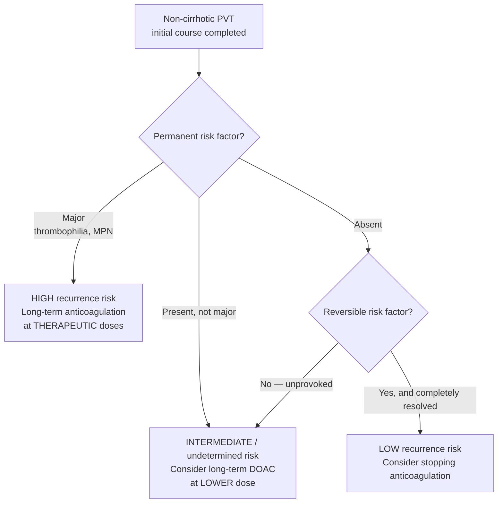

## Contents
- [[#Assessment]]
  - [[#Establishing the Diagnosis]]
  - [[#Severity Assessment]]
  - [[#Classification / Typing]]
- [[#Differential Diagnosis]]
- [[#Diagnostics]]
- [[#Therapeutics]]
  - [[#Noncirrhotic Acute PVT/MVT — Anticoagulation]]
  - [[#Noncirrhotic Chronic PVT]]
  - [[#Cirrhotic PVT — Anticoagulation]]
  - [[#Hemostasis in Cirrhosis — Key Principles]]
  - [[#Surgical / Interventional Options]]
  - [[#Paediatric PVT]]

---

## Assessment

### Establishing the Diagnosis

Portal vein thrombosis (PVT) is the partial or complete occlusion of the portal vein by thrombus. Mesenteric vein thrombosis (MVT) involves the superior mesenteric vein and can extend into or from the portal vein. Both conditions may occur in the setting of [[cirrhosis|cirrhosis]] or in noncirrhotic patients with underlying thrombophilia or local abdominal pathology.

**Presentation:**

- **Acute PVT/MVT (noncirrhotic)**: abdominal pain (often periumbilical, crampy), nausea, fever; MVT may cause intestinal ischemia with bloody diarrhea and peritoneal signs if bowel infarcts
- **Acute PVT in cirrhosis**: often discovered incidentally on surveillance imaging; may present with new or worsening [[portal-hypertension|portal hypertension]] ([[ascites]], [[variceal-upper-gi-bleeding|variceal bleeding]])
- **Chronic PVT (cavernous transformation)**: [[portal-hypertension|portal hypertension]] with splenomegaly, varices, [[ascites]]; the thrombosed portal vein is replaced by a network of collateral vessels (cavernoma); biliopathy in ~80% (portal cholangiopathy — bile duct compression by cavernoma)
- Incidentally found PVT: increasingly detected on abdominal CT for other indications

**Diagnosis** [[acg-2020-hepatic-mesenteric-circulation]]:

1. **Doppler ultrasound** — first-line; identifies thrombus, flow direction, cavernoma; sensitivity ~90% for main PVT (Strong, Very Low evidence)
2. **Contrast-enhanced CT abdomen/pelvis (portal venous phase)** — best for extent, mesenteric involvement, bowel viability; required when MVT/bowel ischemia suspected
3. **MRI/MRA** — alternative when CT contrast contraindicated; equivalent sensitivity
4. **[[upper-endoscopy|Upper endoscopy]]** — for variceal surveillance when portal hypertension is established

### Severity Assessment

| Feature | Significance |
|---|---|
| Extent: partial vs. complete main PVT | Complete main PVT + MVT: higher ischemia risk; stronger anticoagulation indication |
| Cirrhotic vs. noncirrhotic | Noncirrhotic: thrombophilia workup essential; cirrhotic: concurrent portal hypertension management |
| Bowel viability (MVT) | CT for pneumatosis/bowel wall thickening; surgical emergency if bowel infarct |
| Duration: acute vs. chronic | Acute: anticoagulation achieves recanalization in 40–75%; chronic: cavernoma established, recanalization unlikely |

### Classification / Typing

**Standardised nomenclature — [[baveno-viii-2026-portal-hypertension|Baveno VIII]] / VALDIG criteria.** Use these terms when documenting a PVT so course and treatment response can be compared over time.

**Time course and cavernoma (9.1):**

| Term | Definition |
|---|---|
| **Recent PVT** | Thrombus formed **within the last 6 months** |
| **Acute PVT** | **Symptomatic** recent PVT |
| **Chronic PVT** | Persistent portal vein obstruction lasting **>6 months**, with or without cavernoma |
| **Portal cavernoma** | **Multiple dilated peribiliary and/or gallbladder-wall veins (≥2 mm), *irrespective of the patency of the main portal vein***, developing after prior portal vein obstruction |

- ⚠ **The cavernoma definition changed.** Baveno VII described a cavernoma as a network of porto-portal collaterals with the **original PV not seen**. Baveno VIII defines it by the **calibre and location of the collateral veins (≥2 mm, peribiliary/gallbladder wall)** and explicitly decouples it from main-PV patency — so a cavernoma may be reported alongside a patent main portal vein.
- Baveno VIII also splits **recent** (a time definition) from **acute** (recent **and symptomatic**); Baveno VII used "recent" for both.

**Degree of occlusion — VALDIG PVT criteria (9.3).** Measured as the **percentage of *remnant* portal lumen (RL)** relative to the vessel's largest diameter, on **portal-venous-phase CT or MRI**, in a plane **strictly perpendicular to the main portal vein**:

| Term | Remnant lumen |
|---|---|
| **Minimal** | **RL ≥50%** |
| **Partial** | **RL <50%** |
| **Complete** | **RL = 0%** |

> ⚠ **The measured quantity is inverted from Baveno VII.** VII's Table 1 graded the clot by **how much lumen it obstructed** — "minimally occlusive" = clot obstructing <50%, "partially occlusive" = clot obstructing >50%, "completely occlusive" = no persistent lumen. Baveno VIII grades by **how much lumen remains**. The strata map onto each other (VII "partially occlusive" = VIII "partial"; VII "minimally occlusive" = VIII "minimal"), but **a percentage quoted without saying which quantity it refers to is now ambiguous** — always write "remnant lumen" or "obstructed" explicitly. Baveno VIII also adds the **imaging phase and the perpendicular plane** as part of the definition; a measurement taken obliquely is not a VALDIG measurement.

**Interval change** (Baveno VII, not revised): **Progressive / Stable / Regressive** — thrombus larger or more occlusive / unchanged / smaller or less occlusive.

**Diagnostic sequence (9.2):** **Doppler ultrasound is first-line**, showing solid intraluminal material (PVT) and/or a network of porto-portal collaterals (cavernoma). **Multiphase CT should then be performed to confirm** the diagnosis, assess local factors, determine extent, evaluate other splanchnic veins, and identify complications and signs of portal hypertension. **Contrast-enhanced MRI is an alternative.**

**Yerdel classification — the transplant-surgical grading behind "Yerdel grade IV" under [[#Surgical / Interventional Options]].** Anatomical + degree of occlusion; the four categories in ascending order, as listed by [[aasld-2021-vascular-pvt]] (Table 6):

| Category (ascending) | Definition |
|---|---|
| 1 | **<50% occlusion** of the portal vein |
| 2 | **>50% occlusion** |
| 3 | **Complete PV *and* splenic vein occlusion** |
| 4 | **Complete PV occlusion with SMV extension** |

- ⚠ [[aasld-2021-vascular-pvt]] Table 6 prints the four categories **without numbering them I–IV**; the numbering above is the order in which the source lists them. [[aasld-ast-2025-liver-transplant-candidate-evaluation]] glosses **grade IV as "complete splanchnic vein thrombosis,"** which matches the most extensive category. If the exact grade boundaries matter for a listing decision, the primary source (Yerdel 2000, *Transplantation* 69:1873) is **not ingested** — do not reconstruct them from memory.
- The same table notes Yerdel's limitation: derived **only in patients presenting for LT**, so it correlates with post-transplant survival rather than natural history.

**Clinical subtypes** (drive the treatment pathway under [[#Therapeutics]]):

| Type | Characteristics |
|---|---|
| **Noncirrhotic acute PVT** | New-onset thrombus without cirrhosis; thrombophilia or local cause; anticoagulation effective |
| **Noncirrhotic chronic PVT** | Cavernous transformation; portal biliopathy; anticoagulation reserved for specific indications |
| **Cirrhotic acute PVT** | Common (1–25% depending on stage); often incidental; may impair response to [[liver-transplantation\|liver transplantation]] |
| **Cirrhotic chronic PVT** | Cavernoma in cirrhosis; complicates [[tips\|TIPS]]/transplant planning |
| **MVT** | SMA/SMV involvement; higher bowel ischemia risk; emergency when bowel infarction present |

---

## Differential Diagnosis

*Workup: see [[ascites]] for the ascites/portal-hypertension arm of the presentation; the vascular diagnosis itself is made on Doppler ultrasound and cross-sectional imaging — see Diagnostics.*

- **Extrinsic portal vein compression** — [[pancreatic-cancer|pancreatic cancer]], lymphadenopathy, [[cholangiocarcinoma]]; no intravenous thrombus on CT
- **[[budd-chiari-syndrome|Budd-Chiari syndrome]]** — hepatic venous outflow obstruction; hepatomegaly, ascites, right upper quadrant pain; caudate lobe hypertrophy
- **[[acute-mesenteric-ischemia|Acute mesenteric ischemia]]** — SMA occlusion (arterial embolism/thrombosis); small bowel ischemia; no portal vein thrombus
- **[[colon-ischemia|Colon ischemia]]** — segmental colonic involvement; CT/[[colonoscopy]] distinguishes
- **Cirrhosis with portal hypertension alone** — no thrombus; variceal bleeding/ascites present; Doppler shows slow or reversed flow without thrombus
- **[[porto-sinusoidal-vascular-disorder|Porto-sinusoidal vascular disorder (PSVD)]]** — noncirrhotic intrahepatic PH; PVT and PSVD can **coexist**, so finding PVT does not exclude PSVD (Baveno VII 9.15) [[baveno-vii-2022-portal-hypertension]]

---

## Diagnostics

**First-line:**

- Doppler ultrasound: first-line (Strong, Very Low evidence) [[acg-2020-hepatic-mesenteric-circulation]]
- Contrast CT abdomen/pelvis: extent, MVT, bowel viability

**Thrombophilia workup — who gets one** [[aasld-2021-vascular-pvt]]:

- **No cirrhosis + no clear provoking factor → full investigation** for myeloproliferative disorders or another thrombophilic condition is warranted, **usually in consultation with hematology**
- **Cirrhosis → an extensive thrombophilia evaluation is *not* necessary**, unless family history or routine laboratory testing raises other concerns
- **Cirrhosis → it is mandatory to rule out malignant venous obstruction attributable to [[hepatocellular-carcinoma|HCC]]** with appropriate contrast-enhanced imaging

**What the noncirrhotic workup contains:**

- **JAK2 V617F mutation** — myeloproliferative neoplasm (MPN); present in ~30% of noncirrhotic PVT; MPN found in up to 40% of BCS and 25% of PVT
- Factor V Leiden, prothrombin G20210A mutation
- Antithrombin III, protein C, protein S (check off anticoagulation)
- Antiphospholipid antibody panel (lupus anticoagulant, anticardiolipin, anti-β2GPI)
- CBC and peripheral smear (for underlying MPN/polycythemia)
- Bone marrow biopsy if JAK2 negative but MPN suspected
- **Baveno VII detail** (8.2–8.5) [[baveno-vii-2022-portal-hypertension]]: finding one risk factor does **not** stop the workup — combinations are common (A.1). If JAK2 V617F is negative, pursue somatic **calreticulin (CALR)** and **JAK2 exon 12** mutations and next-generation sequencing (A.1). In any adult with primary splanchnic vein thrombosis and **no MPN driver mutation**, discuss **bone marrow biopsy with haematology irrespective of blood counts** (B.2) — particularly when no major thrombosis risk factor is present. After abdominal surgery or pancreatitis, weigh bone-marrow/liver biopsy individually given low yield (C.2)
- **If the liver is dysmorphic or liver tests persistently abnormal:** [[liver-biopsy|liver biopsy]] **and** [[hepatic-venous-pressure-gradient|HVPG]] to rule out cirrhosis or [[porto-sinusoidal-vascular-disorder|PSVD]] (Baveno VII 8.34); [[liver-stiffness-measurement|LSM]] may help exclude cirrhosis but no cut-off can yet be proposed
- **[[baveno-viii-2026-portal-hypertension|Baveno VIII]] 9.4–9.5 restructures this:** investigate **cirrhosis/cACLD** with a comprehensive workup **including LSM**, reserving liver biopsy and HVPG for inconclusive cases or when **PSVD/NCPF is suspected**. The aetiological workup should classify each risk factor as **permanent or reversible**, and each permanent one as **major (thrombophilia, myeloproliferative neoplasm) or non-major** — because that classification, not the workup itself, determines long-term anticoagulation (see [[#Noncirrhotic Acute PVT/MVT — Anticoagulation]]). The full risk-factor list is in the source's Supplementary Table S4, **which is not in the ingested file**

**Local/secondary causes:**

- Intra-abdominal inflammation: [[acute-pancreatitis|pancreatitis]], appendicitis, [[diverticulitis]], [[inflammatory-bowel-disease|IBD]], [[acute-cholecystitis|cholecystitis]]
- Surgery: splenectomy (highest PVT risk), liver resection, bowel surgery
- Pregnancy/postpartum
- Tumor invasion ([[hepatocellular-carcinoma|hepatocellular carcinoma]] tumor thrombus — enhances on arterial phase CT)

> HCC tumor thrombus must be distinguished from bland PVT: tumor thrombus is arterially enhancing, expands the lumen, and often associates with a hepatic mass.

**Liver synthetic function (if cirrhosis present):** Child-Pugh score, MELD (CTP point table, MELD 3.0 formula, and the MELD-variant comparison on [[cirrhosis]]); guides anticoagulation safety assessment.

---

## Therapeutics

### Noncirrhotic Acute PVT/MVT — Anticoagulation

**Anticoagulate all noncirrhotic patients with acute symptomatic PVT or MVT** (Strong, Low evidence) [[acg-2020-hepatic-mesenteric-circulation]]:

- Goal: recanalization (40–75% with LMWH) and prevention of bowel ischemia
- Initial: **LMWH** (enoxaparin 1 mg/kg SC BID) — flexible, predictable; preferred in acute setting
- Transition: VKA (warfarin, target INR 2–3) after stabilization; or DOAC (apixaban, rivaroxaban) — comparable efficacy in noncirrhotic patients
- Minimum duration: **≥3–6 months** (Strong, Low evidence)
- Extended indefinite anticoagulation: for underlying thrombophilia without reversible etiology (especially MPN, antiphospholipid syndrome, unprovoked thrombosis)

**Variceal prophylaxis** while anticoagulating [[acg-2020-hepatic-mesenteric-circulation]]:

- NSBBs (propranolol, carvedilol) are first-line for variceal bleeding prophylaxis in noncirrhotic PVT patients receiving anticoagulation (Strong, Low evidence)
- Endoscopic ligation for acute variceal bleeding

**[[baveno-viii-2026-portal-hypertension|Baveno VIII]] — recent (<6 mo) noncirrhotic PVT**

*Start:*

- Recent PVT **rarely resolves spontaneously**, and **recanalisation correlates with early initiation** → start **therapeutic-dose anticoagulation immediately at diagnosis** (9.6)
- **LMWH first, then transition to an oral anticoagulant** (8.5). Avoid unfractionated heparin (HIT risk) except GFR <30 mL/min or a pending invasive procedure
- **DOACs may now be the primary oral choice** (8.6) — unless there is **double/triple-positive antiphospholipid syndrome**, **pregnancy**, **severely impaired liver function (Child-Pugh C–equivalent)**, or **GFR <30 mL/min**. ⚠ **Changed from Baveno VII 8.37**, which said to switch to a **vitamin K antagonist** when possible and reserved DOACs for "selected cases"
- **Do not wait for endoscopic variceal prophylaxis.** Anticoagulation "should be initiated without delay and should not be postponed pending endoscopic prophylaxis for variceal bleeding" (8.10). ⚠ **This reverses Baveno VII 8.47**, which sequenced bleeding prophylaxis first in patients with high-risk varices
- **EVL is safe without stopping LMWH or VKA**; **data are lacking for DOACs** (8.11)

*Duration — Baveno VIII rebuilds the whole framework around the risk factor (9.5, 9.8–9.10):*

- **Aetiological workup classifies risk factors as permanent or reversible**, and permanent ones as **major (thrombophilia, myeloproliferative neoplasm) or non-major**, by recurrence risk (9.5)
- **≥6 months in all** (9.6, 9.8) — **but stopping may be considered after complete recanalisation of the portal vein at 3 months**, provided a **reversible risk factor has completely resolved** and **no permanent risk factor** is present (9.8, new)
- **Extension into SMV and/or splenic vein with no recanalisation at 6 months → continue full-dose anticoagulation for a further 6 months**; delayed recanalisation can still occur (9.9)

**Long-term anticoagulation after the initial course (9.10):**

> ⚠ **Two Baveno VII rules are gone.** (1) VII 8.39/8.45 recommended long-term AC for a permanent prothrombotic state and said it "should also be considered" without one — no dose distinction. Baveno VIII splits permanent risk factors into **major vs non-major** and prescribes **lower-dose DOAC** rather than full-dose for the non-major/unprovoked group. (2) VII 8.40's **D-dimer <500 ng/mL at 1 month after discontinuation** as a marker of low recurrence risk has been **dropped** and moved to the research agenda (RA9.4) — do not present it as current guidance.
>
> ⚠ **"Lower dose" is not quantified in the statement.** The only figure in the document is in the research agenda (RA9.3), which asks about DOACs "other than **rivaroxaban 15 mg/day**" — implying that is the studied lower dose, but Baveno VIII does not prescribe it. **Decision gap:** dose the lower-intensity DOAC from the primary trial literature, not from this page.

*Surveillance and complications:*

- **Recent extension into the SMV → assess for clinical and radiological signs of intestinal ischemia** (9.7)
- **Bowel ischemia persisting or worsening after 24–48 h of anticoagulation** — judged by clinical reassessment, **lactate**, and repeat CT — in a patient not needing immediate surgical resection → **endovascular treatment at an experienced centre**, to prevent or reduce the need for bowel resection (9.14). Baveno VII 8.44's red-flag list (persistent severe abdominal pain despite AC, bloody diarrhoea, lactic acidosis, bowel-loop distention, occlusion of second-order SMV radicles) remains the trigger to look
- **Follow-up contrast-enhanced CT at 6 months**, and continued follow-up regardless of whether AC is stopped, given recurrence risk (Baveno VII 8.42–8.43, not revised)
- **Variceal screening (9.11):** **upper GI endoscopy at diagnosis**; if no high-risk varices, **repeat at 12 months and every 2 years thereafter**. **If SSM <40 kPa, endoscopy can be spared** — the risk of high-risk varices is low. *(New in VIII: Baveno VII 8.52 gave the same interval but no spleen-stiffness escape.)*

**Septic pylephlebitis** (suppurative PVT from an intra-abdominal infection) [[aasld-2021-vascular-pvt]]: **prolonged antibiotics** adapted to the isolated organism or to anaerobic digestive flora is necessary; limited retrospective data show **concurrent anticoagulation** gives higher complete-resolution rates and fewer long-term portal-hypertensive complications.

**Intestinal ischemia** with recent PVT: **immediate** consultation with surgery, critical care, interventional radiology, and hematology; **anticoagulation is essential**, with surgery for intestinal infarction [[aasld-2021-vascular-pvt]].

### Noncirrhotic Chronic PVT

- Anticoagulation reserved for: underlying thrombophilia, thrombus extension/progression, or intestinal ischemia (Conditional, Very Low evidence) [[acg-2020-hepatic-mesenteric-circulation]]
- Duration ≥6 months when no thrombophilia and reversible etiology present
- No anticoagulation benefit for recanalization once cavernoma established
- Portal biliopathy: may require [[ercp|ERCP]], biliary stenting, or hepaticojejunostomy for obstructive cholestasis

**[[baveno-viii-2026-portal-hypertension|Baveno VIII]] — chronic PVT / cavernoma without cirrhosis**

- **Long-term anticoagulation follows the same risk-factor stratification as recent PVT** (9.10) — see the flowchart above. This replaces the separate Baveno VII 8.45 rule for past PVT/cavernoma
- **Portal vein flow restoration should be considered** in chronic PVT, with or without cavernoma, in patients with **recurrent complications of portal hypertension** or **symptomatic portal cavernoma cholangiopathy** (9.15). Techniques for chronic PVT are **angioplasty ± stenting and/or [[tips|TIPS]]** (thrombolysis and thrombectomy are for acute/recent PVT); feasibility depends on the age and extent of thrombosis and on local expertise (9.12). **TIPS is specifically included where intrahepatic resistance is increased** — [[porto-sinusoidal-vascular-disorder|PSVD/NCPF]], or PVT extending into the intrahepatic branches (9.13)
- **Variceal screening and prophylaxis:** EGD at diagnosis, then 12 months and every 2 years if no high-risk varices; **SSM <40 kPa spares endoscopy** (9.11). Acute portal-hypertensive bleeding and secondary prophylaxis are handled **as in cirrhosis** (8.12); no evidence favours EVL over NSBB for primary prophylaxis in vascular liver disease, and evidence is insufficient to prefer carvedilol over other conventional NSBBs (8.8–8.9). TIPS for refractory or recurrent portal-hypertensive bleeding (8.13); **no data support pre-emptive TIPS in vascular liver disease** (8.14)
- **Band ligation can be performed without withdrawing LMWH or vitamin K antagonists**; **data are lacking for DOACs** (8.11)
- **Meso-Rex bypass** should be considered in children with complications of portal cavernoma — see [[#Paediatric PVT]]

### Cirrhotic PVT — Anticoagulation

**Indications for anticoagulation in cirrhosis** [[acg-2020-hepatic-mesenteric-circulation]]:

- **Complete main PVT**, thrombus extending into mesenteric veins, or MVT: anticoagulate (Strong, Low evidence)
- Acute PVT in cirrhosis: ≥6 months AC (Conditional, Very Low evidence)
- Partial/segmental PVT in cirrhosis without mesenteric extension: clinical judgment; risk/benefit discussion
- Chronic PVT in cirrhosis: anticoagulate only for thrombophilia, progression, or bowel ischemia (Conditional, Very Low evidence)

**AGA 2025 chronicity/occlusion stratification** (newest guideline-tier source; Best Practice Advice, unrated) [[aga-2025-pvt-cirrhosis]]. "Recent" = **<6 months**; "chronic" = **>6 months** (PVTs not recanalized by 6 months are unlikely to recanalize with AC) — concordant with the Baveno VII standardized nomenclature under [[#Classification / Typing]] above:

| Scenario | Action |
|---|---|
| **Intestinal ischemia** (any) | **Urgent AC** + multidisciplinary team (GI/hepatology, IR, hematology, surgery); mortality up to 10–20% (BPA 4) |
| Recent (<6 mo), **<50%** occlusive **or** intrahepatic branches only, no ischemia | **Observe** with cross-sectional imaging **q3 months** until regression (BPA 5) |
| Recent (<6 mo), **>50%** occlusive **or** main PV / mesenteric involvement | **Consider AC** (BPA 6). Greater benefit: >1 vascular bed, thrombus progression, transplant candidate, inherited thrombophilia |
| Chronic (>6 mo), **complete occlusion + cavernous transformation** | **AC not advised** — recanalization futile (BPA 7) |

- **Do not delay AC** — delay lowers odds of recanalization (initiate within 6 months, ideally <2 weeks); AC does **not** increase portal-hypertensive bleeding (BPA 8).
- **Do not defer AC for variceal screening** — screen/treat varices per usual; NSBB or variceal ligation may proceed on AC (BPA 8).
- **Monitoring (BPA 10):** reimage q3 months. If clot regresses, continue AC until transplant or clot resolution (nontransplant); **discontinue for futility in nonresponders after 6 months**. Recurrence after withdrawal up to 38% (2–5 months) → continue AC after resolution in transplant-listed patients. Platelet count **<50 × 10⁹/L** carries bleeding risk (individualize; thromboelastography a promising tool).

**Preferred agents in cirrhosis** — VKA, LMWH, and DOACs are all reasonable; individualize by **Child-Turcotte-Pugh (CTP) class** (BPA 9) [[aga-2025-pvt-cirrhosis]]:

| Agent | CTP class A | CTP class B | CTP class C |
|---|---|---|---|
| VKA (warfarin) | ✔ (INR unreliable in cirrhosis) | ✔ | Avoid (unreliable INR) |
| LMWH | ✔ | ✔ | ✔ (preferred near transplant / high MELD) |
| Apixaban | ✔ | Caution | **Not advised** |
| Rivaroxaban | ✔ | **Not advised** | **Not advised** |
| Dabigatran / Edoxaban | ✔ | Caution / not advised | **Not advised** |

- DOACs offer convenience (no INR monitoring); apixaban has the most CTP-B data; rivaroxaban carries a small hepatotoxicity risk. Reversal: andexanet alfa / idarucizumab / 4-factor PCC.

**[[baveno-viii-2026-portal-hypertension|Baveno VIII]] cirrhotic-PVT statements** (newest tier-1 source; where it and AGA 2025 differ in emphasis, both are guideline-tier and Baveno VIII is newer):

*Screening and characterisation*

- **Screen for PVT simultaneously with radiological [[hcc-surveillance|HCC surveillance]]** (9.16) — Baveno VII 9.3 restricted this to potential transplant candidates; VIII applies it to patients with cirrhosis generally
- PVT with [[hepatocellular-carcinoma|HCC]] is **not proof of vascular invasion** — contrast-enhanced imaging is required, using **standardised criteria (A-VENA, [[li-rads|LI-RADS]])** (9.17). VII said only to characterise with CT/MRI/CEUS; VIII names the criteria sets

*Who to anticoagulate*

- **Any PVT in a potential liver transplant candidate → anticoagulate** (9.18). The goal is to prevent re-thrombosis or progression so a **porto-portal anastomosis** remains feasible and post-transplant morbidity/mortality falls
- **Consider anticoagulation for** (9.19): (i) **recent partial (<50% remnant lumen) or complete thrombosis of the main portal vein**; (ii) **symptomatic PVT, independently of extension**; (iii) **non-tumoral PVT with HCC, especially where locoregional therapy is indicated** — limb (iii) is new in VIII
  - ⚠ Read limb (i) against the **VALDIG remnant-lumen** convention under [[#Classification / Typing]], not against Baveno VII's "obstructing >50%" wording. They describe the same patients, from opposite ends of the vessel
- Baveno VII 9.7's separate rule for minimally occlusive trunk thrombosis that **progresses at 1–3 months** or **compromises the SMV** is not restated; VIII covers progression through the surveillance rule below

*Duration and surveillance*

- **Transplant candidates: continue anticoagulation until surgery.** Everyone else: **at least 6 months**, and **consider long-term use regardless of recanalisation** (9.20)
- **If anticoagulation is stopped → imaging at 1 month, then every 3 months** to detect recurrence or progression (9.21, new)
- **If never anticoagulated → repeat imaging within 6 weeks of diagnosis** to check for progression; if stable, **imaging every 3 months**, particularly in transplant-listed patients; **progression during follow-up is itself an indication to anticoagulate** (9.22, new)

*Agent choice and bleeding risk*

- **LMWH, VKA and DOACs are all accepted** for cirrhosis with PVT; individualise on the expected benefit–risk balance and **reassess it routinely** (9.23). Higher-bleeding-risk features named: **age, frailty, GFR <30 mL/min, decompensated liver disease, platelets <50 ×10⁹/L**
- **DOACs are safe in Child-Pugh A and may carry a lower bleeding risk than VKA**; use with caution in Child-Pugh B; **not recommended in Child-Pugh C outside research protocols** (9.24). The comparative-safety claim over VKA is new in VIII
- **No recommendation can be made on which DOAC** (9.25)

*Interventional*

- **TIPS for main portal vein thrombosis not improving on anticoagulation**, when there are (i) complications of portal hypertension, or (ii) transplant candidacy where the aim is a physiological anastomosis (9.26)
- **TIPS may be first-line** in main portal vein thrombosis with complications of portal hypertension **and a contraindication to anticoagulation** (9.27, new)
- **Routine anticoagulation after TIPS is NOT recommended** in cirrhosis with PVT (9.28, new — LoE 2, strong)

**PVR-TIPS** (portal vein revascularization with TIPS) for cirrhotic PVT (Conditional; BPA 11) [[aga-2025-pvt-cirrhosis]]:

- Can achieve portal vein recanalization when anticoagulation insufficient
- Reserved for those with **additional TIPS indications** (refractory [[ascites]], variceal bleeding) or to enable **transplant technical feasibility** (~98% revascularization in complete/near-complete occlusion in expert series; low-MELD, single-center data — limited generalizability)

### Hemostasis in Cirrhosis — Key Principles

Cirrhosis represents [[cirrhosis-hemostasis|rebalanced hemostasis]], not auto-anticoagulation [[acg-2020-hepatic-mesenteric-circulation]]:

- Do NOT use FFP prophylactically before routine procedures (Conditional, Low evidence)
- Do NOT give prophylactic platelets for routine procedures outside renal dysfunction/active bleeding (Conditional, Very Low evidence)
- Do NOT use antifibrinolytics without evidence of hyperfibrinolysis (Conditional, Very Low evidence)
- **TEG/ROTEM** (viscoelastic testing) can guide transfusion decisions better than PT/INR or platelet count (Conditional, Low evidence)

### Surgical / Interventional Options

- **[[tips|TIPS]]**: portal decompression; facilitates PVT resolution; bridges to transplant
- **Bowel resection**: emergent when MVT causes bowel infarction
- **[[liver-transplantation|Liver transplantation]]**: PVT is not an absolute contraindication but requires surgical planning; cavernoma may require technical modifications
  - **Yerdel grade IV PVT** (complete splanchnic vein thrombosis) **without sufficient collateral veins** (left gastric vein, pericholedochal collaterals) is a **relative contraindication to isolated LT** ([[aasld-ast-2025-liver-transplant-candidate-evaluation]], Rec 47, Weak, Level 2) — grade definitions under [[#Classification / Typing]]
  - Experienced centers may achieve revascularization using interventional radiology techniques; evaluate case-by-case
  - Multivisceral transplantation may be an alternative for Grade IV PVT at specialized centers (Table 6, [[aasld-ast-2025-liver-transplant-candidate-evaluation]])
- **Acute variceal bleeding with cirrhosis + PVT** follows the usual [[variceal-upper-gi-bleeding|AVB]] pathway; in selected patients **TIPS ± portal vein recanalisation** may be considered when other portal-hypertension factors are present (ascites, documented PVT progression) or the patient is a transplant candidate ([[baveno-viii-2026-portal-hypertension]] 5.45)

### Paediatric PVT

*New in [[baveno-viii-2026-portal-hypertension|Baveno VIII]] (Panel 9, statements 9.29–9.39) — the first Baveno paediatric statements. **Extrahepatic portal vein obstruction is one of the two leading causes of portal hypertension in children**, alongside advanced chronic liver disease from biliary atresia (1.24).*

**Chronic PVT in children (9.29–9.30):** defined as **complete obstruction to normal portal venous flow to the liver**; may be **congenital or acquired**; typically diagnosed on imaging. Work-up includes standard evaluation for underlying chronic liver disease, **thrombophilia investigation**, and liver biopsy where intrinsic liver disease must be excluded.

**Surgery is first-line prophylaxis, not drugs (9.31–9.35):**

| Setting | Preferred approach |
|---|---|
| **Preprimary (no varices yet) and primary prophylaxis**, with features of portal hypertension | **Meso-Rex bypass** — established criteria must be met to reach a >90% success rate, including **patency of the intrahepatic portal venous system** and surgical expertise (9.31) |
| **Secondary prophylaxis** of variceal haemorrhage | **Meso-Rex bypass preferred.** If not feasible: portal vein recanalisation, endoscopic treatment ± NSBB, or **distal splenorenal shunt** (9.34) |
| **Recurrent variceal haemorrhage** | **Distal splenorenal shunt** — provided there is **no [[hepatopulmonary-syndrome-portopulmonary-hypertension\|hepatopulmonary syndrome or portopulmonary hypertension]] and no [[hepatic-encephalopathy\|HE]]** (9.35) |
| **Life-threatening, otherwise untreatable** portal hypertensive complications | [[liver-transplantation\|Liver transplantation]] (9.37) |

- The role of **pharmacologic, endoscopic, and interventional-radiologic primary prophylaxis is not well established** in children (9.32), and management may need individualising where access to medical care is limited (9.33)
- **Annual surveillance** for children with portal hypertension and/or portosystemic shunts — spontaneous or created — **especially for portopulmonary hypertension** (9.36)
- **Neonatal recent PVT** (e.g. after umbilical catheterisation): **spontaneous resolution can occur**, so the role of anticoagulation is uncertain — **monitor for clot extension**, and consider anticoagulation for an extensive thrombus (9.38)
- **Do not extrapolate the adult cirrhotic-PVT recommendations to children** — PVT with cirrhosis is uncommon in children and the supporting evidence is insufficient (9.39)

---

## See Also

[[budd-chiari-syndrome]], [[porto-sinusoidal-vascular-disorder]], [[colon-ischemia]], [[spontaneous-bacterial-peritonitis]], [[aki-in-cirrhosis]], [[hepatocellular-carcinoma]], [[cirrhosis-hemostasis]], [[portal-hypertension]], [[variceal-upper-gi-bleeding]], [[acute-mesenteric-ischemia]], [[cholangiocarcinoma]], [[pancreatic-cancer]], [[inflammatory-bowel-disease]], [[acute-pancreatitis]], [[diverticulitis]], [[acute-cholecystitis]], [[upper-endoscopy]], [[liver-transplantation]], [[ercp]], [[cirrhosis]], [[ascites]], [[tips]], [[liver-biopsy]], [[hepatic-venous-pressure-gradient]], [[liver-stiffness-measurement]], [[hcc-surveillance]], [[li-rads]], [[hepatic-encephalopathy]], [[hepatopulmonary-syndrome-portopulmonary-hypertension]], [[anticoagulation-gi-bleeding]]

---

## Sources

1. [[baveno-viii-2026-portal-hypertension|Baveno VIII — Advancing Consensus in Portal Hypertension (2026)]]
2. [[acg-2020-hepatic-mesenteric-circulation|ACG Clinical Guideline: Disorders of the Hepatic and Mesenteric Circulation]]
3. [[aga-2025-pvt-cirrhosis|AGA Clinical Practice Update on Management of Portal Vein Thrombosis in Patients With Cirrhosis: Expert Review]]
4. [[aasld-ast-2025-liver-transplant-candidate-evaluation|AASLD AST 2025: Practice Guideline on Adult Liver Transplantation — Candidate Evaluation]]
5. [[aasld-2021-vascular-pvt|AASLD Practice Guidance: Vascular Liver Disorders, Portal Vein Thrombosis, and Procedural Bleeding in Cirrhosis (2021)]]
6. [[baveno-vii-2022-portal-hypertension|Baveno VII — Renewing Consensus in Portal Hypertension (2022)]]
