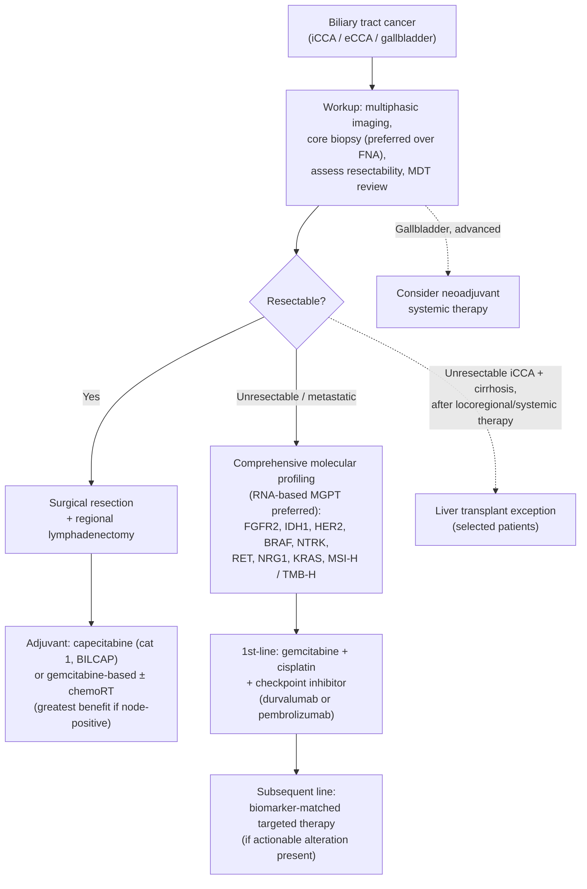

Cholangiocarcinoma (CCA) is an adenocarcinoma arising from the biliary epithelium. It is classified anatomically as **intrahepatic**, **perihilar (Klatskin)**, or **distal extrahepatic**. US incidence is ~8000 cases/year and rising; overall 5-year survival is ~10%, but earlier-stage diagnosis carries a meaningfully better prognosis (`[[asge-2023-indeterminate-biliary-strictures]]`), so prompt tissue diagnosis when a patient presents with a [[biliary-stricture|biliary stricture]] is important.

## Assessment

### Establishing the Diagnosis

CCA most often presents as a [[biliary-stricture|biliary stricture]] of undetermined etiology. Because benign mimics (`[[primary-sclerosing-cholangitis|PSC]]`, IgG4-related cholangitis, fibrotic strictures, [[chronic-pancreatitis|chronic pancreatitis]]) look similar radiographically, **tissue acquisition is required**. The risk of malignancy in a [[biliary-stricture|biliary stricture]] without an obvious mass on cross-sectional imaging is ~55%. Endoscopic sampling is preferred over percutaneous (external drain, needle-track seeding) or surgical approaches. All cross-sectional imaging should be reviewed and the patient discussed at a multidisciplinary tumor board.

### Classification / Typing

- **Intrahepatic** — within the liver parenchyma; behaves more like a hepatic mass.
- **Perihilar (Klatskin)** — at/near the biliary confluence; staged by the Bismuth-Corlette classification (see `[[biliary-stricture]]`).
- **Distal extrahepatic** — distal CBD; overlaps with the differential of pancreatic head malignancy.

## Differential Diagnosis

Pancreatic adenocarcinoma, gallbladder cancer, ampullary cancer, [[hepatocellular-carcinoma|hepatocellular carcinoma]], metastatic disease, and benign strictures ([[primary-sclerosing-cholangitis|PSC]], IgG4-related/autoimmune cholangitis, [[chronic-pancreatitis|chronic pancreatitis]], post-surgical injury). See the full `[[biliary-stricture]]` differential.

## Diagnostics

Per the ASGE guideline on malignancy in biliary strictures of undetermined etiology (`[[asge-2023-indeterminate-biliary-strictures]]`), endoscopic tissue acquisition centers on [[ercp|ERCP]]-based sampling supplemented by [[cholangioscopy]] and [[endoscopic-ultrasound|EUS]]:

| Modality | Sensitivity | Role |
|---|---|---|
| [[brush-cytology|Brush cytology]] | ~0.40 alone | Baseline first-line; low sensitivity, high specimen adequacy |
| Fluoroscopic-guided forceps biopsy | ~0.52 alone; ~0.66 with brushings | ASGE suggests **adding** to [[brush-cytology|brush cytology]] (incremental yield ~20%); best at expert centers |
| [[cholangioscopy|Cholangioscopy]]-guided biopsy | [[ercp|ERCP]]+[[cholangioscopy]] ~0.72 vs ~0.61 without | Suggested for **nondistal** strictures, prior nondiagnostic ERCP, expert centers; suboptimal for very distal CBD |
| [[endoscopic-ultrasound|EUS]]-FNA/FNB | EUS+ERCP ~0.88 vs ERCP alone ~0.61 | Suggested for **distal** strictures, prior nondiagnostic ERCP, or nodal/metastatic disease |
| [[fish|FISH]] | adds ~20% absolute | Adjunct to brushings; relatively higher role in [[primary-sclerosing-cholangitis|PSC]] |
| [[confocal-laser-endomicroscopy|pCLE]] / IDUS | pCLE ~90% sens, NPV ~94% | Adjuncts; no formal recommendation |

**Critical caution — hilar/perihilar CCA and [[liver-transplantation|liver transplantation]]:** EUS-FNA/FNB of a **hilar biliary mass** carries a needle-track / transperitoneal seeding risk that can exclude a patient from [[liver-transplantation|liver transplantation]] (the only potentially curative option for many perihilar CCA patients). If EUS is performed for a proximal/hilar stricture, the endosonographer should **not** sample the biliary mass itself; EUS-FNA of regional lymph nodes is acceptable (a positive node is already a transplant contraindication). All three ASGE recommendations are conditional with very low quality of evidence.

## Therapeutics

Management is staging- and location-dependent and beyond the scope of this diagnostic-focused page; see `[[biliary-stricture]]` for the drainage algorithm (SEMS vs plastic stents, sectorial perihilar drainage, endobiliary PDT/RFA) and `[[asge-2021-malignant-hilar-obstruction]]`. Resectable disease is managed surgically; selected perihilar CCA patients may be candidates for [[liver-transplantation|liver transplantation]] with neoadjuvant protocols — preserving transplant eligibility is why hilar-mass needle sampling is avoided.

### Oncologic Management (NCCN 2026)

Per [[nccn-2026-biliary-tract-cancers]], biliary tract cancers — gallbladder cancer, intrahepatic CCA, and perihilar/distal extrahepatic CCA — are managed on parallel site-specific pathways that share common pathology, biomarker, systemic-therapy, and radiation principles. For tissue diagnosis, **core biopsy is preferred over FNA** to provide adequate material for molecular profiling.

The overall decision logic, recreated below:

*Algorithm — NCCN biliary tract cancer management, recreated in original form (not an NCCN figure). ([[nccn-2026-biliary-tract-cancers]])*

**Surgery and adjuvant therapy.** Resection with negative margins and regional lymphadenectomy is the goal for resectable disease. After resection, **adjuvant capecitabine is a category 1 option** (BILCAP trial); gemcitabine-based regimens and fluoropyrimidine-based chemoradiation are alternatives, with the greatest benefit in node-positive disease (adjuvant therapy for up to ~6 months). Neoadjuvant systemic therapy is specifically considered for gallbladder cancer, which often presents at an advanced stage.

**Molecular biomarker testing (central to advanced disease).** Comprehensive multi-gene profiling is recommended for **all patients with unresectable or metastatic disease** who are systemic-therapy candidates, ideally with **RNA-/transcriptome-based testing to maximize detection of gene fusions**. Actionable targets include **FGFR2 fusions/rearrangements** and **IDH1 mutations** (both enriched in iCCA), **BRAF V600E**, **HER2 (ERBB2)**, **NTRK1/2/3 fusions**, **RET fusions**, **NRG1 fusions** (added in v1.2026), **KRAS G12C**, and the tumor-agnostic immunotherapy markers **MSI-H/dMMR** and **TMB-H**. ctDNA may complement tissue testing but can miss fusions.

**Systemic therapy for advanced disease.** First-line treatment is a **gemcitabine + cisplatin backbone plus a checkpoint inhibitor** (durvalumab per TOPAZ-1 or pembrolizumab per KEYNOTE-966); carboplatin may substitute when cisplatin is contraindicated. Biomarker-matched targeted agents (FGFR2-fusion inhibitors, IDH1 inhibitors, HER2-directed therapy, BRAF/MEK inhibitors, NTRK/RET inhibitors, and immunotherapy for MSI-H/dMMR or TMB-H) are used in subsequent lines when the corresponding target is present.

**Liver transplantation for iCCA.** Beyond the established neoadjuvant-protocol pathway for perihilar CCA, NCCN v1.2026 refines transplant-exception criteria for **biopsy-proven unresectable intrahepatic CCA** (or mixed [[hepatocellular-carcinoma|HCC]]-iCCA) in cirrhotic patients after locoregional/systemic therapy with a defined observation period.

See [[gallbladder-cancer]] for the gallbladder-specific pathway.

## See Also

[[primary-sclerosing-cholangitis]], [[biliary-stricture]], [[gallbladder-cancer]], [[hepatocellular-carcinoma]], [[ercp]], [[endoscopic-ultrasound]], [[cholangioscopy]], [[brush-cytology]], [[fish]], [[confocal-laser-endomicroscopy]], [[chronic-pancreatitis]], [[liver-transplantation]]

---

## Sources

1. [[asge-2021-malignant-hilar-obstruction|ASGE Guideline: Endoscopic Management of Malignant Hilar Obstruction (2021)]]
2. [[asge-2023-indeterminate-biliary-strictures|ASGE Guideline on the Role of Endoscopy in the Diagnosis of Malignancy in Biliary Strictures of Undetermined Etiology (2023)]]
3. [[nccn-2026-biliary-tract-cancers|NCCN Clinical Practice Guidelines in Oncology: Biliary Tract Cancers (Version 1.2026)]]
