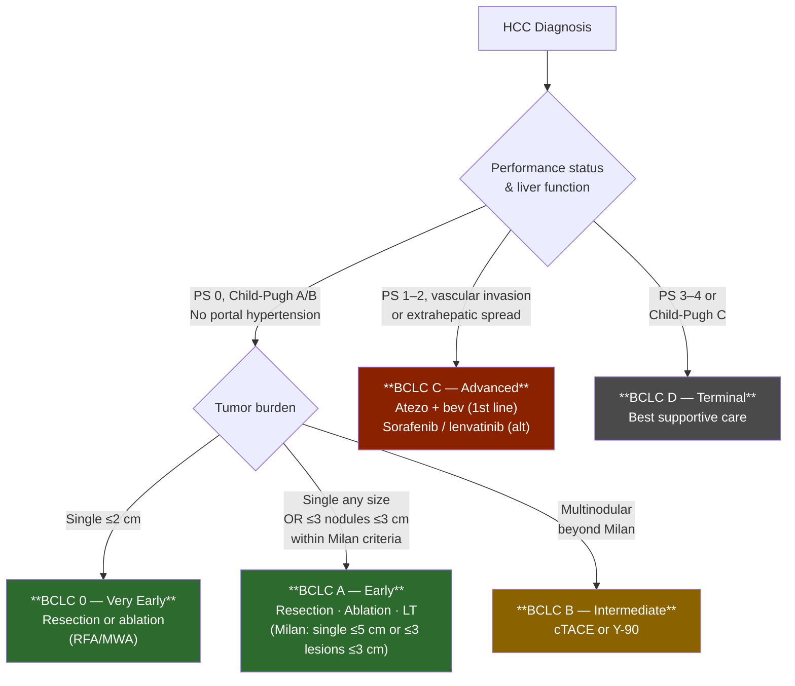

## Contents
- [[#Assessment]]
  - [[#Establishing the Diagnosis]]
  - [[#Severity Assessment]]
  - [[#HCC Surveillance]]
- [[#Differential Diagnosis]]
- [[#Diagnostics]]
- [[#Therapeutics]]
  - [[#Liver Transplantation for HCC]]
  - [[#(Neo)Adjuvant Therapy After Resection or Local Ablation]]
  - [[#Management of Recurrence After Resection or Local Ablation]]
  - [[#Post-Transplant Immunosuppression for HCC Recipients]]

---

*Partially expanded. Lectures available: HCC_By_Dr_Kemichian.md, HCC_by_Kali_Zhou.md, Disparities_in_HCC_Care.md (raw/GI Lectures+Chalk Talks/). Referenced in [[chronic-hepatitis-b]] (expanded HCC surveillance criteria), [[alcohol-associated-liver-disease]], and [[hereditary-hemochromatosis]] (HCC accounts for ~45% of cirrhosis-related HH deaths; SF >2,000 ng/mL = high risk; surveillance continues after iron depletion).*

## Assessment

### Establishing the Diagnosis

HCC is the most common primary liver cancer; arises predominantly in the setting of cirrhosis or chronic HBV infection.

**Non-invasive diagnosis (LI-RADS criteria):** In patients with cirrhosis or chronic HBV, imaging features on contrast-enhanced CT or MRI (arterial hyperenhancement + washout ± capsule) allow diagnosis without biopsy for lesions ≥1 cm.

**LI-RADS categories:** LR-1 (definitely benign) → LR-5 (definitely HCC) → LR-M (probably/possibly malignant) → LR-TIV (tumor-in-vein).

*Stub — Barcelona Clinic Liver Cancer (BCLC) staging, Child-Pugh/MELD/ALBI scoring, AFP/AFP-L3/DCP biomarkers.*

### Severity Assessment

**Barcelona Clinic Liver Cancer (BCLC) staging** drives all treatment decisions:

*Note: Adjuvant/neoadjuvant systemic therapy after resection or ablation is NOT recommended — see Therapeutics below.*

---

## Differential Diagnosis

- Cholangiocarcinoma (intrahepatic) — typically hypovascular; may require biopsy
- [[hepatocellular-adenoma]] — no washout, gadoxetate hepatobiliary phase uptake
- [[focal-nodular-hyperplasia]] — central scar, gadoxetate uptake
- Metastasis — multiple lesions, known primary; portal venous enhancement pattern
- Hemangioma — see [[hepatic-hemangioma]]; T2 bright, centripetal fill

---

## Diagnostics

*Stub — contrast-enhanced CT (triphasic), gadoxetate-enhanced MRI (preferred), AFP/DCP, liver biopsy for indeterminate lesions, EUS-FNA for hilar nodes if staging needed.*

### HCC Surveillance

Surveillance is recommended for patients at sufficient HCC risk. See expanded criteria in [[chronic-hepatitis-b]] (AASLD/IDSA 2025):

| Population | Surveillance |
|---|---|
| Cirrhosis (any etiology, including [[hereditary-hemochromatosis]]) | US ± AFP q6 months; continue after iron depletion |
| Chronic HBV without cirrhosis: Asian males ≥40, Asian females ≥50, African/North American Blacks ≥20, family history HCC | US ± AFP q6 months |
| HBV/HDV co-infection | Yes — all adults |
| HBV/HIV co-infection | Men ≥18, women ≥40 |
| Post-HBsAg loss (high-risk subgroups) | Continue per [[chronic-hepatitis-b]] criteria |

---

## Therapeutics

*Stub — BCLC-stage-driven algorithm: resection (BCLC 0/A, preserved liver function), ablation (RFA/MWA ≤3 cm), liver transplantation (Milan criteria), TACE (BCLC B), systemic therapy (atezolizumab+bevacizumab first-line for advanced disease, sorafenib alternative), palliative care. Note: ICI-based regimens carry hepatotoxicity risk — see [[immune-checkpoint-inhibitor-hepatitis]].*

### Liver Transplantation for HCC

Per [[aasld-ast-2025-liver-transplant-candidate-evaluation]] (Recs 5–8):

**Eligibility:**
- All patients with HCC **without extrahepatic metastases** should be evaluated for LT (Strong, Level 1)
- **Milan criteria** (single lesion ≤5 cm or ≤3 lesions each ≤3 cm, no macrovascular invasion, no extrahepatic spread) remain the standard for transplant listing (Strong, Level 2)
- HCC beyond Milan: reserve for patients demonstrating **favorable tumor biology**; downstaging to within Milan criteria using locoregional therapy is acceptable (Strong, Level 2)

**Pre-transplant imaging workup** (Strong, Level 2):
- Multiphasic contrast-enhanced abdominal CT or MRI — interpreted at a transplant center
- Staging CT chest to rule out thoracic metastases
- Abdominal imaging from community settings should be re-reviewed at a UNOS transplant center

**AFP requirements** (Strong, Level 2):
- AFP must be **<1000 ng/mL** prior to transplantation
- If AFP was ever >1000 ng/mL, it must be brought down to **<500 ng/mL** (using locoregional HCC therapy) prior to proceeding

**Waitlist management:**
- Serial abdominal staging every 3 months while awaiting transplant; CT chest staging every 6–12 months
- 6-month observation period on waitlist required before MELD exception for HCC (per UNOS); exception: patients with complete response after T1 or T2 HCC following surgery or locoregional therapy who recur within 6–60 months may receive MELD exception without the 6-month wait (NLRB review)
- Bridging locoregional therapies (TACE, RFA, SBRT) maintain patients within transplantation criteria and assess tumor biology

**Portal vein tumor invasion (PVTT):**
- Transplantation may be feasible after complete resolution of thrombus with locoregional or systemic treatment; insufficient data to recommend routinely; evaluate case-by-case

**Patients with extrahepatic HCC:** Not candidates for LT

### (Neo)Adjuvant Therapy After Resection or Local Ablation

**Standard of care: active surveillance.** As of 2025, there are no FDA-approved adjuvant or neoadjuvant systemic therapies for HCC. Surveillance for recurrence is the current standard of care after resection or local ablation with the intention of cure — including in patients with high risk of recurrence. [[aasld-2025-hcc-critical-update]]

**AASLD advises against adjuvant and neoadjuvant systemic therapy** (Guidance Statement 32, Revised; Level 1, Strong Recommendation). This recommendation is based on:

- **IMbrave050 (phase III RCT):** Adjuvant atezolizumab+bevacizumab vs. active surveillance in high-risk HCC after resection/ablation. At the first interim analysis (median follow-up 17.4 months), a positive RFS result was reported (HR=0.72, 95% CI: 0.56–0.93; 12-month RFS 78% vs. 65%). However, at the second interim analysis (median follow-up 35.1 months), this benefit was **not sustained** (HR=0.90, 95% CI: 0.72–1.12). Overall survival remained non-significant and immature (OS HR=1.26, 95% CI: 0.85–1.87; >80% alive at 2 years in both arms). The risk/benefit ratio does not support adjuvant use.
- **STORM trial (adjuvant sorafenib):** No improvement in RFS versus placebo (HR=0.94, 95% CI: 0.78–1.13).
- **Preoperative TACE** in patients with large resectable HCC does not improve RFS and may increase risk of interval tumor progression, precluding surgical resectability.
- **HCV eradication** with direct-acting antivirals does not increase HCC recurrence risk and improves survival — this is appropriate co-management but is not a tumor-directed adjuvant strategy.

**Neoadjuvant systemic therapy:** Early-phase proof-of-principle studies are promising (neoadjuvant cabozantinib+nivolumab achieved margin-negative resection in 80% and major pathologic response in 42% of 15 patients; nivolumab±ipilimumab yielded 30% major pathologic response in 20 resected patients), but current data do not support routine neoadjuvant use. Phase II–III RCTs are ongoing.

**Ongoing adjuvant trials** (results pending): KEYNOTE-937 (pembrolizumab), CheckMate-9DX (nivolumab), EMERALD-2 (durvalumab+bevacizumab), camrelizumab+apatinib. (Neo)adjuvant therapies should be considered only in the context of a clinical trial.

### Management of Recurrence After Resection or Local Ablation

Per the AASLD 2025 revised Figure 11, post-resection/ablation recurrence is managed by recurrence pattern:

![[hcc-2025-recurrence-algorithm-2.png]]
*Figure 11 (Revised) — Management of HCC recurrence after complete response to resection or local ablation. ([[aasld-2025-hcc-critical-update]])*

| Recurrence Pattern | Recommended Approach |
|---|---|
| Within Milan Criteria | Salvage liver transplantation (for eligible patients) |
| Liver-localized beyond Milan, within downstaging criteria | Liver-directed therapy; consider liver transplantation if successfully downstaged |
| Vascular invasion, extrahepatic spread, or TACE-unsuitable disease | First-line systemic therapy |

### Post-Transplant Immunosuppression for HCC Recipients

Per [[aasld-ast-2025-liver-transplant-graft-complications]] (Rec 32, Weak, Level 3):

**mTOR inhibitor-based immunosuppression** may be considered in adult LT recipients transplanted for HCC within Milan criteria to improve recurrence-free survival up to 3 years post-LT.

Key evidence:
- Meta-analysis of 17 observational studies + 6 RCTs: mTOR inhibitor-based IS reduces HCC recurrence overall (RR 0.67, 95% CI 0.56–0.82) and improves 3-year RFS in within-Milan cases (RR 1.13, 95% CI 1.03–1.23)
- **Sirolimus (SRL)**: 2 mg/day after month 1; trough 4–10 ng/mL; SRL-based IS has stronger RFS and overall survival signal than EVL at 1, 3, and 5 years
- **Everolimus (EVL)**: 1 mg BID after month 1; trough 3–8 ng/mL; pooled 1-year and 3-year RFS comparable to CNI-based therapy; less compelling data than SRL
- **Caution**: Sirolimus carries FDA black box warning for hepatic artery thrombosis — no increased HAT risk in meta-analysis (3 studies, n=849); EVL shows no increased HAT risk
- No significant benefit for HCC outside Milan criteria (RR 0.95, 95% CI 0.83–1.1 for 3-year RFS)
- mTOR inhibitors may also mitigate CNI nephrotoxicity in HCC recipients (see [[liver-transplantation]] Rec 33)

**HCC surveillance post-LT**:
- CT or MRI every 6–12 months; AFP as adjunct; risk of recurrence persists, especially beyond Milan criteria ([[aasld-2012-liver-transplant-long-term]], Rec 42–43)
- mTOR inhibitors (sirolimus/everolimus) may be used in HCC LT recipients to reduce recurrence risk while also mitigating CNI nephrotoxicity — see [[liver-transplantation]]
- Oncologic surveillance per non-graft complications guidelines; [[post-transplant-lymphoproliferative-disorder]] risk elevated with intensified IS
