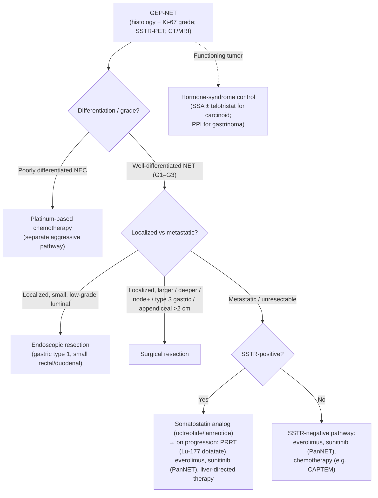

Gastroenteropancreatic neuroendocrine tumors (GEP-NETs) are epithelial neoplasms arising from diffuse neuroendocrine cells of the GI tract and pancreas. They range from indolent, incidentally found lesions to aggressive metastatic disease, and may be **nonfunctioning** (most) or **functioning** (secreting hormones that produce clinical syndromes). Management is site-, size-, and grade-specific and multidisciplinary, spanning endoscopic resection, surgery, somatostatin analogs, peptide receptor radionuclide therapy, and systemic agents ([[nccn-2026-net]]).

## Assessment

### Establishing the Diagnosis

Diagnosis requires **histology** with neuroendocrine immunohistochemical markers (synaptophysin, chromogranin A, INSM1) plus a Ki-67 proliferation index and mitotic count to assign grade. Anatomic imaging with **multiphasic (arterial + portal-venous) CT or MRI** localizes and stages the primary and metastases. **Somatostatin-receptor (SSTR) functional imaging** — SSTR-PET/CT or SSTR-PET/MRI using ⁶⁸Ga-DOTATATE, ⁶⁴Cu-DOTATATE, or ⁶⁸Ga-DOTATOC — detects occult and SSTR-expressing disease and selects patients for receptor-targeted therapy; a distinct pathway addresses SSTR-negative tumors.

Biochemical workup is **site- and syndrome-directed** rather than universal:

- **Gastric:** [[upper-endoscopy|EGD]] with mapped biopsies, fasting serum gastrin (off [[proton-pump-inhibitors|PPI]], which falsely elevates it), and gastric pH; vitamin B12 in suspected [[atrophic-gastritis]].
- **Pancreatic, functioning:** syndrome-specific hormones — gastrin (gastrinoma/[[peptic-ulcer-disease|Zollinger-Ellison]]), insulin/proinsulin/C-peptide during supervised fasting (insulinoma), glucagon (glucagonoma), VIP (VIPoma).
- **Midgut / suspected carcinoid syndrome:** 24-h urinary 5-HIAA (serotonin metabolite); chromogranin A as a nonspecific adjunct.

### Severity Assessment

Prognosis is driven by **grade, differentiation, primary site, and stage (tumor burden / metastases)**. Well-differentiated G1 tumors are often indolent; G2 and well-differentiated G3 tumors behave more aggressively; poorly differentiated neuroendocrine carcinoma (NEC) is highly aggressive and follows a separate, chemotherapy-led pathway. Liver metastatic burden and a functioning (hormone-secreting) phenotype add morbidity.

### Classification / Typing

**WHO grading (well-differentiated NET vs NEC), by Ki-67 and mitoses:**

| Category | Differentiation | Ki-67 | Mitoses (/2 mm²) |
|---|---|---|---|
| NET G1 | Well | <3% | <2 |
| NET G2 | Well | 3–20% | 2–20 |
| NET G3 | Well | >20% | >20 |
| NEC (small/large cell) | Poor | typically >20% (often >55%) | >20 |
| MiNEN | Mixed | — | — |

**Gastric NET subtypes** (mechanistically distinct, dictating therapy):

- **Type 1** — secondary to autoimmune [[atrophic-gastritis]]/hypergastrinemia; multiple small indolent lesions; usually endoscopically managed.
- **Type 2** — gastrinoma-driven (Zollinger-Ellison), frequently MEN1-associated.
- **Type 3** — normal gastrin, sporadic, larger and more aggressive; typically surgical.

## Differential Diagnosis

*Workup of a luminal NET presenting as a mucosal mound: see [[subepithelial-lesion]].*

By presentation: [[pancreatic-cancer|pancreatic adenocarcinoma]] and other solid pancreatic masses, [[pancreatic-cysts|cystic pancreatic neoplasms]], [[colorectal-cancer]] and other GI [[gastric-premalignant-conditions|epithelial malignancies]], lymphoma, [[gastrointestinal-stromal-tumor|GI stromal tumor]] and [[subepithelial-lesion|other subepithelial lesions]], metastatic disease, and — for functioning tumors — non-neoplastic causes of the relevant hormonal syndrome (e.g., PPI-induced hypergastrinemia mimicking gastrinoma; reactive hypoglycemia mimicking insulinoma). Multifocal duodenopancreatic NETs, gastrinoma, or coexisting primary hyperparathyroidism should prompt evaluation for **MEN1**.

## Diagnostics

- **Histology + IHC + grading** — synaptophysin/chromogranin A/INSM1 with Ki-67 and mitotic count; the foundation of diagnosis and the principal determinant of management pathway.
- **Multiphasic CT or MRI (abdomen ± pelvis)** — anatomic staging of primary and metastases.
- **SSTR-PET (DOTATATE/DOTATOC)** — functional staging; identifies SSTR-positive disease eligible for somatostatin analogs and PRRT.
- **[[upper-endoscopy|EGD]] / [[endoscopic-ultrasound|EUS]]** — luminal visualization, biopsy, depth-of-invasion and nodal assessment for gastric, duodenal, and rectal lesions; EUS also localizes small PanNETs.
- **[[colonoscopy]]** — detection and resection of rectal and colonic NETs (rectal NETs are frequently found incidentally at screening).
- **Syndrome-specific biochemistry** — gastrin, insulin/C-peptide, glucagon, VIP, 24-h urinary 5-HIAA, chromogranin A, as clinically directed.

## Therapeutics

- **Endoscopic resection** — preferred for small, low-grade, superficial luminal tumors without nodal involvement: most gastric type 1 lesions, small (<1 cm, sometimes ≤2 cm) rectal NETs, and select small non-ampullary duodenal NETs.
- **Surgical resection** — for larger, higher-grade, deeper, or node-positive tumors and most type 3 gastric NETs; appendiceal NETs **>2 cm** (or incompletely resected / node-positive) warrant right hemicolectomy, whereas tumors <1 cm are cured by simple appendectomy. Pancreatic resection (enucleation or formal pancreatectomy) for PanNETs, with observation reasonable for very small (<1–2 cm) nonfunctioning PanNETs in selected patients.
- **Somatostatin analogs** ([[somatostatin-analogs|octreotide LAR, lanreotide]]) — first-line for symptom control in functioning tumors and for antiproliferative tumor-growth control in SSTR-positive metastatic disease.
- **Peptide receptor radionuclide therapy (PRRT)** — lutetium **Lu 177 dotatate** for progressive SSTR-positive disease; the NETTER-2 trial supports first-line use in advanced grade 2–3 GEP-NETs.
- **Targeted/cytotoxic systemic therapy** — everolimus (GI and pancreatic NET), sunitinib (PanNET), and chemotherapy regimens (e.g., capecitabine/temozolomide for PanNET; platinum-based for high-grade NEC) depending on grade, site, and burden.
- **Liver-directed therapy** — resection, ablation, or embolization for dominant hepatic metastatic disease.
- **Carcinoid syndrome management** — somatostatin analogs ± telotristat (for refractory diarrhea); octreotide must be available intraoperatively to treat carcinoid crisis.

### NCCN Treatment Algorithm

*Algorithm — NCCN GEP-NET management (GI/pancreatic scope), recreated in original form (not an NCCN figure). ([[nccn-2026-net]])*

## See Also

[[atrophic-gastritis]], [[gastric-premalignant-conditions]], [[peptic-ulcer-disease]], [[pancreatic-cancer]], [[pancreatic-cysts]], [[colorectal-cancer]], [[gastrointestinal-stromal-tumor]], [[subepithelial-lesion]], [[somatostatin-analogs]], [[proton-pump-inhibitors]], [[endoscopic-ultrasound]], [[upper-endoscopy]], [[colonoscopy]]

---

## Sources

1. [[nccn-2026-net|NCCN Clinical Practice Guidelines in Oncology: Neuroendocrine and Adrenal Tumors (Version 1.2026)]]
