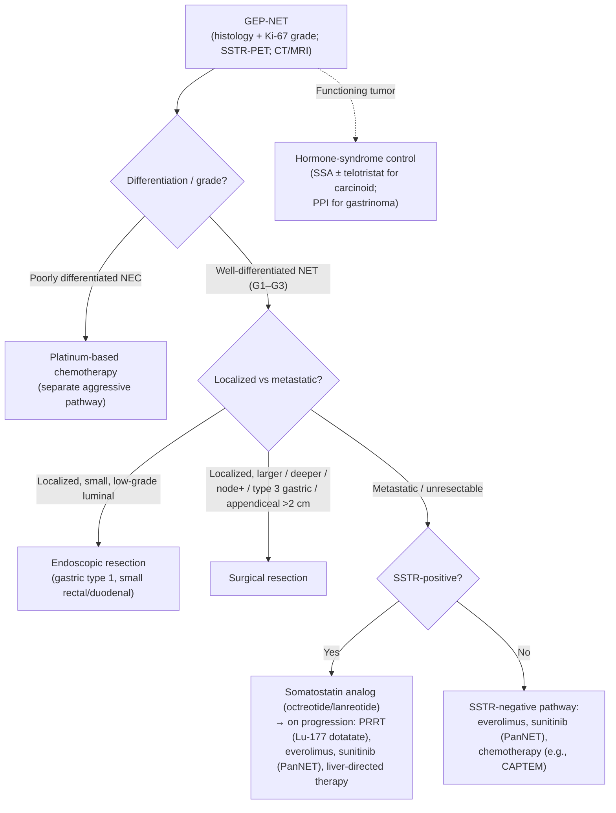

Gastroenteropancreatic neuroendocrine tumors (GEP-NETs) are epithelial neoplasms arising from diffuse neuroendocrine cells of the GI tract and pancreas. They range from indolent, incidentally found lesions to aggressive metastatic disease, and may be **nonfunctioning** (most) or **functioning** (secreting hormones that produce clinical syndromes). Management is site-, size-, and grade-specific and multidisciplinary, spanning endoscopic resection, surgery, [[somatostatin-analogs|somatostatin analogs]], peptide receptor radionuclide therapy, and systemic agents ([[nccn-2026-net]]).

## Contents
- [[#Assessment]]
  - [[#Establishing the Diagnosis]]
  - [[#Severity Assessment]]
  - [[#Classification / Typing]]
  - [[#Staging (AJCC Version 9, 2023)]]
- [[#Differential Diagnosis]]
- [[#Diagnostics]]
- [[#Therapeutics]]
  - [[#Well-Differentiated G3 — the 55% Split]]
  - [[#NCCN Treatment Algorithm]]
- [[#See Also]]
- [[#Sources]]

## Assessment

### Establishing the Diagnosis

Diagnosis requires **histology** with neuroendocrine immunohistochemical markers (synaptophysin, chromogranin A, INSM1) plus a Ki-67 proliferation index and mitotic count to assign grade. Anatomic imaging with **multiphasic (arterial + portal-venous) CT or MRI** localizes and stages the primary and metastases. **Somatostatin-receptor (SSTR) functional imaging** — SSTR-PET/CT or SSTR-PET/MRI using ⁶⁸Ga-DOTATATE, ⁶⁴Cu-DOTATATE, or ⁶⁸Ga-DOTATOC — detects occult and SSTR-expressing disease and selects patients for receptor-targeted therapy; a distinct pathway addresses SSTR-negative tumors.

Biochemical workup is **site- and syndrome-directed** rather than universal:

- **Gastric:** [[upper-endoscopy|EGD]] with mapped biopsies, fasting serum gastrin (off [[proton-pump-inhibitors|PPI]], which falsely elevates it), and gastric pH; vitamin B12 in suspected [[atrophic-gastritis]].
- **Pancreatic, functioning:** syndrome-specific hormones — gastrin (gastrinoma/[[peptic-ulcer-disease|Zollinger-Ellison]]), insulin/proinsulin/C-peptide during supervised fasting (insulinoma), glucagon (glucagonoma), VIP (VIPoma).
- **Midgut / suspected carcinoid syndrome:** 24-h urinary 5-HIAA (serotonin metabolite); chromogranin A as a nonspecific adjunct.

### Severity Assessment

Prognosis is driven by **grade, differentiation, primary site, and stage (tumor burden / metastases)**. Well-differentiated G1 tumors are often indolent; G2 and well-differentiated G3 tumors behave more aggressively; poorly differentiated neuroendocrine carcinoma (NEC) is highly aggressive and follows a separate, chemotherapy-led pathway. Liver metastatic burden and a functioning (hormone-secreting) phenotype add morbidity.

Grade (Ki-67 / mitotic rate) is the dominant driver and is fully specified below; **stage** supplies the T and N strata that the Therapeutics table conditions on — see [[#Staging (AJCC Version 9, 2023)]].

### Classification / Typing

**2019 WHO classification and grading** (reproduced in [[nccn-2026-net]], Principles of Pathology):

| Terminology | Differentiation | Grade | Mitotic rate (/2 mm²) | Ki-67 index |
|---|---|---|---|---|
| NET, G1 | Well | Low | <2 | <3% |
| NET, G2 | Well | Intermediate | 2–20 | 3%–20% |
| NET, G3 | Well | High | >20 | >20% |
| NEC, small cell (SCNEC) | Poor | High (not formally graded — high by definition) | >20 | >20% |
| NEC, large cell (LCNEC) | Poor | High (not formally graded) | >20 | >20% |
| MiNEN | Well or poor (variable) | Variable | Variable | Variable |

- **Grade-assignment rule (the part that decides):** mitotic rate is counted per **2 mm²** (= 10 HPF at 40×, ocular field 0.5 mm) over a total area of 10 mm²; Ki-67 is counted in ≥500 cells in the **hot spot**. **The final grade is whichever of the two indexes places the tumor in the *higher* grade category** — they are not averaged and Ki-67 does not automatically win.
- Report the **exact** Ki-67 percentage, not a range, and repeat Ki-67 on every metachronously sampled specimen (grade drifts over time).
- **Ki-67 55% is a separate, therapy-level cutoff**, not a grading boundary — see [[#Well-Differentiated G3 — the 55% Split]].

**Gastric NET subtypes** — NCCN describes **four** categories (types 1, 2, 3, and "other"); the first three are mechanistically distinct and dictate therapy:

| Type | Gastrin | Mechanism / setting | Behavior |
|---|---|---|---|
| **Type 1** | High | Antrum-sparing [[atrophic-gastritis\|chronic atrophic gastritis]] → high gastric pH → loss of acid feedback on antral G cells → hypergastrinemia → ECL hyperplasia. Supportive findings (not all required): atrophic gastritis on biopsy, elevated gastric pH, B-12 deficiency, positive anti-intrinsic factor antibodies | Indolent, typically **multifocal**; metastases **<5%** |
| **Type 2** | High | Gastrinoma / [[peptic-ulcer-disease\|Zollinger-Ellison]] with **low** gastric pH (acid hypersecretion), frequently MEN1-associated | Rare; multifocal |
| **Type 3** | **Normal** | Sporadic, unifocal | More aggressive; usually surgical |
| **"Other"** | — | Residual NCCN category | — |

### Staging (AJCC Version 9, 2023)

**AJCC v9 (2023) TNM for *well-differentiated* NET (G1, G2, and G3)**, reproduced in [[nccn-2026-net]] (ST-1 – ST-8). It does **not** apply to poorly differentiated NEC, which is staged as carcinoma of its site. **T is site-specific — the same tumor size means a different T in the stomach, appendix, and rectum**, which is exactly why the Therapeutics table below reads differently per site.

**T — primary tumor, by site:**

| Site | T1 | T2 | T3 | T4 |
|---|---|---|---|---|
| **Stomach** | Invades mucosa or submucosa **and ≤1 cm** | Invades muscularis propria **or >1 cm** | Through the muscularis propria into subserosal tissue, without penetrating the overlying serosa | Invades visceral peritoneum (serosa), or other organs/adjacent structures |
| **Duodenum** | Invades mucosa or submucosa **only, and ≤1 cm** | Invades muscularis propria **or >1 cm** | Invades the **pancreas or peripancreatic adipose tissue** | Invades visceral peritoneum (serosa) or other organs |
| **Ampulla of Vater** | **≤1 cm** *and* confined within the **sphincter of Oddi** | Invades through the sphincter into duodenal submucosa or muscularis propria, **or >1 cm** | *(as duodenum)* | *(as duodenum)* |
| **Jejunum / ileum** | Invades mucosa or submucosa **and ≤1 cm** | Invades muscularis propria **or >1 cm** | Through the muscularis propria into subserosal tissue, without penetrating the overlying serosa | Invades visceral peritoneum (serosa), or other organs/adjacent structures |
| **Appendix** | **≤2 cm** | **>2 cm but ≤4 cm** | **>4 cm**, *or* subserosal invasion, *or* involvement of the **mesoappendix** | Perforates the peritoneum, or directly invades other adjacent organs/structures (abdominal wall, skeletal muscle) — **excluding** direct mural extension into the subserosa of adjacent bowel |
| **Colon / rectum** | Invades mucosa or submucosa **and ≤2 cm** — **T1a ≤1 cm**, **T1b >1 but ≤2 cm** | Invades muscularis propria, **or >2 cm** with mucosal/submucosal invasion | Through the muscularis propria into subserosal tissue, without penetrating the overlying serosa | Invades visceral peritoneum (serosa), or other organs/adjacent structures |
| **Pancreas** | Limited to the pancreas\*, **≤2 cm** | Limited to the pancreas\*, **>2 cm but ≤4 cm** | Limited to the pancreas\*, **>4 cm**; *or* invading the duodenum, ampulla of Vater, or common bile duct | Invading adjacent organs (stomach, spleen, colon, adrenal gland) **or the wall of a large vessel** (celiac axis, SMA/SMV, splenic artery/vein, gastroduodenal artery/vein, portal vein) |

\* *"Limited to the pancreas" means no invasion of adjacent organs or of a large-vessel wall; **extension into peripancreatic adipose tissue is NOT a basis for staging**.*
*Multiple tumors: assign T from the **largest** tumor and flag it — `pT3(4)` or `pT3(m)`.*

**N and M:**

- **N0** = no regional nodal involvement; **N1** = regional node(s) involved — at every site above.
- **Only jejunum/ileum has an N2**, and the split is a decision: **N1 = fewer than 12 involved nodes**; **N2 = large mesenteric masses (>2 cm) and/or extensive nodal deposits (≥12)**, especially those encasing the superior mesenteric vessels. *Mesenteric masses ≤2 cm are reported but do not affect stage.*
- **M1a** metastasis confined to the liver · **M1b** ≥1 extrahepatic site (lung, ovary, nonregional node, peritoneum, bone) · **M1c** both hepatic and extrahepatic.

**Prognostic stage groups:**

| Stage | Stomach · duodenum/ampulla · jejunum-ileum · appendix · pancreas | Colon / rectum |
|---|---|---|
| **I** | T1, N0, M0 | T1, N0, M0 |
| **II** | **T2 or T3**, N0, M0 | **IIA** T2 N0 M0 · **IIB** T3 N0 M0 |
| **III** | **T4 N0 M0**, *or* **any T with nodal disease** (N1; jejunum/ileum N1 **or** N2), M0 | **IIIA** T4 N0 M0 · **IIIB** any T, N1, M0 |
| **IV** | Any T, any N, **M1** | Any T, any N, **M1** |

*Note what this does to the Therapeutics table: a **rectal** NET of 1.8 cm confined to the submucosa is **T1b** (endoscopic/transanal excision territory), but the same 1.8 cm tumor reaching the muscularis propria is **T2** → radical resection. In the **appendix**, T is pure size plus mesoappendiceal/subserosal invasion, which is why the ≤2 cm / >2 cm line drives appendectomy vs right hemicolectomy.*

## Differential Diagnosis

*Workup of a luminal NET presenting as a mucosal mound: see [[subepithelial-lesion]].*

By presentation:

- **Pancreatic mass** — [[pancreatic-cancer|pancreatic adenocarcinoma]] and other solid pancreatic masses; [[pancreatic-cysts|cystic pancreatic neoplasms]].
- **Luminal mass** — [[gastrointestinal-stromal-tumor|GI stromal tumor]] and [[subepithelial-lesion|other subepithelial lesions]]; [[colorectal-cancer]] and other GI [[gastric-premalignant-conditions|epithelial malignancies]]; lymphoma; metastatic disease.
- **Functioning tumor** — non-neoplastic causes of the relevant hormonal syndrome (e.g. PPI-induced hypergastrinemia mimicking gastrinoma; reactive hypoglycemia mimicking insulinoma).
- **Syndromic clue:** multifocal duodenopancreatic NETs, gastrinoma, or coexisting primary hyperparathyroidism should prompt evaluation for **MEN1**.

## Diagnostics

- **Histology + IHC + grading** — synaptophysin/chromogranin A/INSM1 with Ki-67 and mitotic count; the foundation of diagnosis and the principal determinant of management pathway.
- **Multiphasic CT or MRI (abdomen ± pelvis)** — anatomic staging of primary and metastases.
- **SSTR-PET (DOTATATE/DOTATOC)** — functional staging; identifies SSTR-positive disease eligible for somatostatin analogs and PRRT.
- **[[upper-endoscopy|EGD]] / [[endoscopic-ultrasound|EUS]]** — luminal visualization, biopsy, depth-of-invasion and nodal assessment for gastric, duodenal, and rectal lesions; EUS also localizes small PanNETs.
- **[[colonoscopy]]** — detection and resection of rectal and colonic NETs (rectal NETs are frequently found incidentally at screening).
- **Syndrome-specific biochemistry** — gastrin, insulin/C-peptide, glucagon, VIP, 24-h urinary 5-HIAA, chromogranin A, as clinically directed.

## Therapeutics

**Localized disease — the size/site thresholds that decide endoscopy vs surgery** ([[nccn-2026-net]]). *T strata below are AJCC v9 and are site-specific — see [[#Staging (AJCC Version 9, 2023)]].*

| Site | Endoscopic / local resection | Surgical resection | Surveillance after resection |
|---|---|---|---|
| **Gastric, type 1** (hypergastrinemic) | Endoscopic resection of tumors **>1 cm**; smaller lesions managed endoscopically/observed | Rare; type 1 tumors **>2 cm** need multiphasic CT/MRI workup first | EGD at **1 y**, then every **1–3 y**. Gastrin and chromogranin A are **uninformative** in type 1 (gastrin stays high) — after baseline, don't follow them |
| **Gastric, type 2** (gastrinoma) | Endoscopic resection of tumors **>1 cm** | Per gastrinoma pathway — find and treat the gastrin-producing tumor | EGD at **1 y**, then as clinically indicated (if endoscopically resected) |
| **Gastric, type 3** (normal gastrin) | Only for **small (<1 cm), superficial, low-grade** tumors; wedge resection also an option if **no** regional lymphadenopathy on [[endoscopic-ultrasound\|EUS]]/imaging | Partial or total gastrectomy with regional lymphadenectomy (**preferred**), by tumor location | — |
| **Rectal** | **<1 cm incidental** → complete endoscopic resection with negative margins may suffice. **≤2 cm or T1 (minimally invasive)** → endoscopic or transanal excision. For **1–2 cm**, consider exam under anesthesia and/or EUS *before* the procedure — go to radical resection if muscularis propria invasion or node-positive | **>2 cm, node-positive, or T2–T4** → low anterior resection (rarely APR); neoadjuvant/definitive chemoRT in selected cases | If margins indeterminate + **G1** → endoscopy at **6–12 mo** for residual disease; residual or **G2** → follow the all-other-rectal-tumors pathway. **1–2 cm:** imaging at 6 and 12 mo, then as indicated |
| **Appendiceal** | **≤2 cm** → simple appendectomy is sufficient for most (metastases uncommon) | **>2 cm**, or *any* size with incomplete resection or positive nodes/margins → stage with multiphasic CT/MRI ± SSTR imaging, then **right hemicolectomy**. For **1–2 cm with poor prognostic features** (lymphovascular or mesoappendiceal invasion, atypical histology) some NCCN institutions also do right hemicolectomy | **<1 cm:** none. **1–2 cm:** optional multiphasic imaging q2–5 y by clinicopathologic features. **>2 cm:** multiphasic CT/MRI at 12 wk–12 mo post-resection, then q12–24 mo for **10 years** |
| **Pancreatic (PanNET), nonfunctioning** | — | Enucleation or formal pancreatectomy | **G1 PanNET <2 cm can be safely observed — that is the recommended course**; **G2** PanNETs of the same size should be considered for **surgery**. Grade, not size alone, is the decision |
| **Duodenal, non-ampullary** | **≤1 cm, G1/G2, LVI-negative** → consider endoscopic resection. Technique by size: **<0.5 cm** → polypectomy or [[endoscopic-mucosal-resection\|EMR]]; **0.5–1 cm** → EMR, [[endoscopic-submucosal-dissection\|ESD]], or [[endoscopic-full-thickness-resection\|eFTR]] pending local expertise | **>1 cm, G3, LVI-positive, or NEC** → multidisciplinary discussion including surgical evaluation. **R1** resection → surgical evaluation if repeat endoscopic resection is not an option | **R0:** surveillance not well established — consider **annual endoscopy for 5 years** |
| **Duodenal, periampullary** | Not a straight-to-endoscopy lesion — **multidisciplinary discussion including surgical evaluation** | Per that discussion | — |

- **When to get EUS first in a duodenal NET** ([[nccn-2026-net]]) — EUS to determine depth of invasion for **any** dNET with: periampullary involvement, **size >1 cm**, extension beyond the submucosa on initial sampling or EUS, functional dNET, ulceration, **Grade 3**, or **positive LVI** on initial sampling. Any one of these is enough.
- **Rectal NETs are not uniformly benign despite the best overall prognosis of any NET site** — a retrospective review found metastases in **66% of 87** patients with well-differentiated rectal NETs measuring **11–19 mm**, which is why the 1–2 cm band gets pre-procedure EUS/EUA rather than reflex snare.
- **Somatostatin analogs** (octreotide LAR, lanreotide) — first-line for symptom control in functioning tumors and for antiproliferative tumor-growth control in SSTR-positive metastatic disease.
- **Peptide receptor radionuclide therapy (PRRT)** — lutetium **Lu 177 dotatate** for progressive SSTR-positive disease; the NETTER-2 trial supports first-line use in advanced grade 2–3 GEP-NETs.
- **Targeted/cytotoxic systemic therapy** — everolimus (GI and pancreatic NET), sunitinib (PanNET), and chemotherapy regimens (e.g., capecitabine/temozolomide for PanNET; platinum-based for high-grade NEC) depending on grade, site, and burden.
- **Liver-directed therapy** — resection, ablation, or embolization for dominant hepatic metastatic disease.
- **Carcinoid syndrome management** — somatostatin analogs ± telotristat (for refractory diarrhea); octreotide must be available intraoperatively to treat carcinoid crisis.
- **5-HIAA collection is diet- and drug-sensitive** — for 48 h before and during a 24-h urine collection, avoid avocado, banana, cantaloupe, eggplant, pineapple, plum, tomato, hickory nuts/pecans, plantain, kiwi, dates, grapefruit, honeydew, walnuts; acetaminophen, ephedrine, diazepam, nicotine, guaifenesin, and phenobarbital raise 5-HIAA. A normal 5-HIAA does **not** exclude a NET in a symptomatic patient.

### Well-Differentiated G3 — the 55% Split

For **locally advanced / metastatic well-differentiated G3 NETs**, NCCN routes by tumor biology rather than grade alone:

| Biology | Features | Implication |
|---|---|---|
| **Favorable** | Relatively **low Ki-67 (<55%)**, slow growing, **SSTR-PET positive** | NET-directed pathway (SSA, PRRT, targeted agents) |
| **Unfavorable** | Relatively **high Ki-67 (≥55%)**, faster growing, **SSTR-PET negative** | Behaves like NEC — chemotherapy-led pathway; neoadjuvant chemo considered case-by-case |

NCCN flags the 55% cutoff explicitly as **data-limited**: Ki-67 is heterogeneous within a tumor and drifts across serial biopsies, so pathologic *and* clinical features must both inform the decision. Consider both FDG-PET and DOTATATE-PET when PRRT is on the table.

### NCCN Treatment Algorithm

*Algorithm — NCCN GEP-NET management (GI/pancreatic scope), recreated in original form (not an NCCN figure). ([[nccn-2026-net]])*

---

## See Also

[[atrophic-gastritis]], [[gastric-premalignant-conditions]], [[peptic-ulcer-disease]], [[pancreatic-cancer]], [[pancreatic-cysts]], [[colorectal-cancer]], [[gastrointestinal-stromal-tumor]], [[subepithelial-lesion]], [[somatostatin-analogs]], [[proton-pump-inhibitors]], [[endoscopic-ultrasound]], [[upper-endoscopy]], [[colonoscopy]], [[endoscopic-mucosal-resection]], [[endoscopic-submucosal-dissection]], [[endoscopic-full-thickness-resection]]

---

## Sources

1. [[nccn-2026-net|NCCN Clinical Practice Guidelines in Oncology: Neuroendocrine and Adrenal Tumors (Version 1.2026)]]
