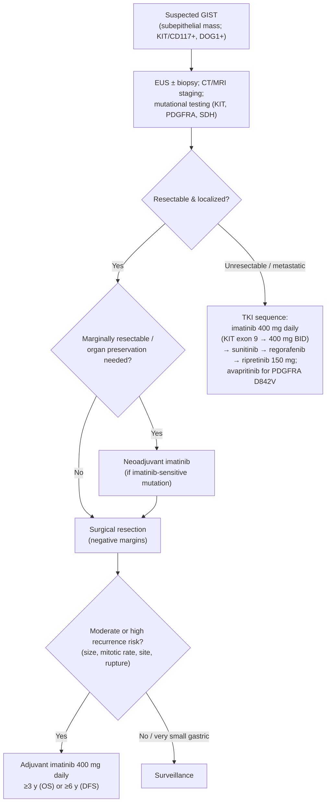

## Contents
- [[#Assessment]]
  - [[#Establishing the Diagnosis]]
  - [[#Severity Assessment]]
  - [[#Classification / Typing]]
- [[#Differential Diagnosis]]
- [[#Diagnostics]]
- [[#Therapeutics]]
  - [[#NCCN Treatment Algorithm]]
- [[#See Also]]
- [[#Sources]]

## Assessment

### Establishing the Diagnosis

GISTs typically present as a subepithelial mass (often gastric), sometimes with GI bleeding, early satiety, or as an incidental finding. They characteristically express **KIT (CD117)** and **DOG1** on immunohistochemistry. Because GISTs are friable and can rupture/seed, biopsy is approached carefully; [[endoscopic-ultrasound|EUS]]-guided sampling is commonly used for gastric subepithelial lesions, and percutaneous biopsy of a readily resectable lesion is generally avoided. **Mutational testing is essential** — it is both diagnostic and predictive of therapy response.

### Severity Assessment

Malignant potential is estimated from **tumor size, mitotic rate, and primary site** — gastric GISTs behave more favorably than small-bowel or rectal tumors of equivalent size and mitotic rate (small-intestinal GISTs ~40–50% malignant vs ~20–25% gastric). **Tumor rupture** (spontaneous or at surgery) confers high risk of recurrence ([[acg-2023-subepithelial-lesions]], [[asge-2017-subepithelial-lesions]]).

**EUS features of malignancy** ([[acg-2023-subepithelial-lesions]]): heterogeneous echotexture, large size (>3–5 cm), irregular margins, anechoic/cystic spaces, echogenic foci, malignant-appearing nodes. **≥2 features** → sensitivity for malignancy 80–100%; absence of all of irregular border / echogenic foci / cystic spaces → malignancy in only 0–11%. **Tumor size is the only feature that correlates with mitotic index** — EUS does not reliably predict mitotic rate in 2–5 cm GISTs, so final malignant potential is set by surgical pathology.

**Malignant potential by size × mitotic rate × site (AFIP/Miettinen data).** This is the table that assigns the **risk stratum** — and the stratum is the decision, because adjuvant imatinib is offered at **moderate *or* high** risk (see Therapeutics). Two caveats stated by [[nccn-2026-gist]]: the assessment applies best to **KIT- or PDGFRA-positive** GIST (**SDH-deficient GIST are more unpredictable**), and it is determined **without prior exposure to TKI therapy**. Mitotic rate is counted in the most proliferative area and reported **per 50 HPF = 5 mm²** (≈20–25 HPF on a modern 40× lens).

*Gastric GIST — [[nccn-2026-gist]] Table 1, with the College of American Pathologists (CAP) risk category:*

| Tumor size | Mitotic rate | Metastasis rate | **Risk per CAP** |
|---|---|---|---|
| ≤2 cm | ≤5/50 HPF | 0% | **None** |
| ≤2 cm | >5/50 HPF | 0%\* | **None** |
| >2–≤5 cm | ≤5/50 HPF | 1.9% | **Very low** |
| >2–≤5 cm | >5/50 HPF | 16% | **Moderate** |
| >5–≤10 cm | ≤5/50 HPF | 3.6% | **Low** |
| >5–≤10 cm | >5/50 HPF | 55% | **High** |
| >10 cm | ≤5/50 HPF | 12% | **Moderate** |
| >10 cm | >5/50 HPF | 86% | **High** |

\* *Predicted rate based on a tumor category with very small numbers.*

*Non-gastric GIST (small bowel **and** colorectal) — [[nccn-2026-gist]] Table 2. For sites not listed (esophagus, mesentery, peritoneum), **use the jejunum/ileum criteria**.*

| Tumor size | Mitotic rate | Metastasis rate | **Risk per CAP** |
|---|---|---|---|
| ≤2 cm | ≤5/50 HPF | 0% | **None** |
| ≤2 cm | >5/50 HPF | 50%–54% | *Insufficient data* — **High** |
| >2–≤5 cm | ≤5/50 HPF | 1.9%–8.5% | **Low** |
| >2–≤5 cm | >5/50 HPF | 50%–73% | **High** |
| >5–≤10 cm | ≤5/50 HPF | 24% | *Insufficient data* — **Moderate** |
| >5–≤10 cm | >5/50 HPF | 85% | *Insufficient data* — **High** |
| >10 cm | ≤5/50 HPF | 34%–57% | **High** |
| >10 cm | >5/50 HPF | 71%–90% | **High** |

- **Read the two tables against each other — site changes the stratum at identical size and mitotic rate.** A 4 cm, >5-mitosis GIST is **Moderate** risk in the stomach and **High** risk in the small bowel or rectum; a 3 cm, low-mitosis lesion is **Very low** gastric but **Low** non-gastric. This is why *all* nongastric GISTs are resected regardless of size (Therapeutics), and why colorectal GIST **<2 cm with mitotic activity can still recur and metastasize** ([[nccn-2026-gist]]).
- **Older figures on the record:** [[asge-2017-subepithelial-lesions]] Tables 3–4 print the same AFIP dataset with coarser bands — gastric ≤2 cm >5 mitoses as **<4%** (vs NCCN's 0%), gastric **>2–≤10 cm** ≤5 mitoses pooled as **<4%**, and small-intestine-specific values of 2% (>2–5 cm, ≤5), 73% (>2–5 cm, >5), 25% (>5–10 cm, ≤5), and 50%–90% (>10 cm, >5). Same guideline tier; **NCCN 2026 is newer and governs**, and only NCCN carries the CAP risk category.
- ⚠ **Decision gap (residual).** **Tumor rupture** is a stated risk factor — NCCN notes "some stratification schemes have included tumor rupture, which has been associated with a much higher risk of recurrence" — but **neither ingested source quantifies it or places a ruptured tumor into a named stratum**. The **modified-NIH (Joensuu) classification** and the Joensuu prognostic contour maps, which do, are cited by NCCN but **not reproduced in any ingested source**; consult them directly when rupture is the deciding feature. Do not infer the bands.

### Classification / Typing

By driver mutation ([[nccn-2026-gist]]):

- **KIT-mutant** — most common; exon 11 (majority, imatinib-sensitive) and exon 9 (requires higher-dose imatinib).
- **PDGFRA-mutant** — includes the imatinib-resistant **D842V** variant (treated with **avapritinib**).
- **SDH-deficient ("wild-type")** — lacks KIT/PDGFRA mutations; often gastric, in younger patients; associated with **Carney triad** and **Carney-Stratakis syndrome**; more indolent and less TKI-responsive; prompts germline/syndrome evaluation.

## Differential Diagnosis

*Workup: see [[subepithelial-lesion]].*

Other subepithelial lesions: leiomyoma, schwannoma, [[gastroenteropancreatic-neuroendocrine-tumors|neuroendocrine tumor]], lipoma, glomus tumor, ectopic pancreas, and metastasis; gastric [[gastric-adenocarcinoma|adenocarcinoma]] or lymphoma when the lesion is not clearly subepithelial.

## Diagnostics

[[endoscopic-ultrasound|EUS]] characterizes the layer of origin (typically muscularis propria) and enables tissue sampling; CT/MRI defines extent and metastases (liver and peritoneum are the usual sites); immunohistochemistry (**KIT/CD117, DOG1**) confirms diagnosis; **mutational analysis (KIT, PDGFRA, and SDH where indicated)** guides therapy.

## Therapeutics

Per [[nccn-2026-gist]]:

- **Localized, resectable — resect vs surveil ([[acg-2023-subepithelial-lesions]], [[asge-2017-subepithelial-lesions]]):**
  - **<2 cm gastric** — surveillance *or* resection both acceptable (insufficient evidence); surveil if **no** high-risk features (irregular borders, cystic spaces, ulceration, echogenic foci, heterogeneity); if resecting, endoscopic methods are an acceptable alternative to surgery.
  - **>2 cm gastric** — resect.
  - **All nongastric GIST** (esophageal, small-bowel, colorectal) — resect regardless of size.
  - Surgical resection is with negative margins (no routine lymphadenectomy); for **very large** GISTs confirm tissue first to permit neoadjuvant imatinib.
- **Neoadjuvant imatinib:** to downsize marginally resectable tumors or preserve organ function (EGJ, duodenum, rectum); confirm an imatinib-sensitive mutation first (it is acceptable to start while mutational analysis is pending).
- **Adjuvant imatinib — who, and for how long:**
  - **Who:** patients at **significant risk of recurrence — moderate *or* high risk** (not just high risk). Assign the stratum from the size × mitotic-rate × site tables under [[#Severity Assessment]]. **Category 1** following complete resection with **no** preoperative imatinib; **category 2A** following complete resection **after** preoperative imatinib.
  - **Duration:** optimal duration is **unknown**. Data support **≥3 years** for high-risk disease (on an **overall-survival** benefit) **or ≥6 years** (on a **disease-free-survival** benefit). The 3-year figure is the OS-based floor, not a stopping rule.
  - **Who not to treat:** data **do not support routine adjuvant use** in GIST **without a KIT mutation**, or with an **imatinib-resistant PDGFRA mutation**.
- **Imatinib dosing** — the dose is the decision, and it is mutation-dependent:
  - **Standard dose 400 mg daily.**
  - **KIT exon 9 → 400 mg BID (800 mg/day).** At 400 mg daily, exon 9 tumors have a lower response rate and PFS than exon 11; 400 mg BID gave significantly superior PFS (61% relative risk reduction, *P* = .0013) in exon 9 tumors (EORTC 62005), and a higher response rate (67% vs 17%, SWOG S0033/CALGB 150105).
  - **On progression at 400 mg daily:** escalate **up to 800 mg daily (400 mg BID) as tolerated**, or switch to sunitinib (category 1).
- **Unresectable/metastatic:** **imatinib first-line** (category 1; dose per mutation above) → **sunitinib** (2nd) → **regorafenib** (3rd) → **ripretinib 150 mg** (4th); **avapritinib** for **PDGFRA D842V**. Imatinib is **not** recommended for imatinib-insensitive PDGFRA exon 18 mutations, especially D842V. Continue TKI therapy in responding disease; surgery/ablation may be considered for limited/focal progression.

### NCCN Treatment Algorithm

*Algorithm — NCCN GIST management, recreated in original form (not an NCCN figure). ([[nccn-2026-gist]])*

---

## See Also

[[subepithelial-lesion]], [[gastric-adenocarcinoma]], [[gastroenteropancreatic-neuroendocrine-tumors]], [[endoscopic-ultrasound]], [[endoscopic-submucosal-dissection]], [[endoscopic-full-thickness-resection]], [[upper-endoscopy]], [[esophageal-cancer]]

---

## Sources

1. [[nccn-2026-gist|NCCN Clinical Practice Guidelines in Oncology: Gastrointestinal Stromal Tumors (GIST) (Version 1.2026)]]
2. [[acg-2023-subepithelial-lesions|ACG 2023: Diagnosis and Management of Gastrointestinal Subepithelial Lesions]]
3. [[asge-2017-subepithelial-lesions|ASGE 2017: The Role of Endoscopy in Subepithelial Lesions of the GI Tract]]
