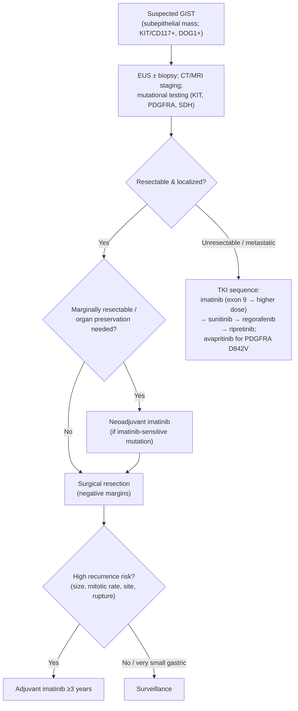

## Assessment

### Establishing the Diagnosis

GISTs typically present as a subepithelial mass (often gastric), sometimes with GI bleeding, early satiety, or as an incidental finding. They characteristically express **KIT (CD117)** and **DOG1** on immunohistochemistry. Because GISTs are friable and can rupture/seed, biopsy is approached carefully; [[endoscopic-ultrasound|EUS]]-guided sampling is commonly used for gastric subepithelial lesions, and percutaneous biopsy of a readily resectable lesion is generally avoided. **Mutational testing is essential** — it is both diagnostic and predictive of therapy response.

### Severity Assessment

Malignant potential is estimated from **tumor size, mitotic rate, and primary site** — gastric GISTs behave more favorably than small-bowel or rectal tumors of equivalent size and mitotic rate (small-intestinal GISTs ~40–50% malignant vs ~20–25% gastric). **Tumor rupture** (spontaneous or at surgery) confers high risk of recurrence. Metastatic risk rises with size — up to **86%** for >10 cm high-mitotic-rate lesions ([[acg-2023-subepithelial-lesions]], [[asge-2017-subepithelial-lesions]]).

**EUS features of malignancy** ([[acg-2023-subepithelial-lesions]]): heterogeneous echotexture, large size (>3–5 cm), irregular margins, anechoic/cystic spaces, echogenic foci, malignant-appearing nodes. **≥2 features** → sensitivity for malignancy 80–100%; absence of all of irregular border / echogenic foci / cystic spaces → malignancy in only 0–11%. **Tumor size is the only feature that correlates with mitotic index** — EUS does not reliably predict mitotic rate in 2–5 cm GISTs, so final malignant potential is set by surgical pathology.

⚠ **Decision gap (narrowed).** The surveil-vs-resect thresholds are now on-page (see Therapeutics), but the full **modified-NIH / AFIP size × mitotic-rate prognostic table** that assigns a resected GIST to a recurrence-risk stratum for **adjuvant imatinib** is not reproduced: NCCN's licence bars its proprietary version and [[asge-2017-subepithelial-lesions]] references but did not reproduce the AFIP table. **Consult the AFIP / NCCN risk-stratification table directly** before deciding on adjuvant therapy.

### Classification / Typing

By driver mutation ([[nccn-2026-gist]]):

- **KIT-mutant** — most common; exon 11 (majority, imatinib-sensitive) and exon 9 (requires higher-dose imatinib).
- **PDGFRA-mutant** — includes the imatinib-resistant **D842V** variant (treated with **avapritinib**).
- **SDH-deficient ("wild-type")** — lacks KIT/PDGFRA mutations; often gastric, in younger patients; associated with **Carney triad** and **Carney-Stratakis syndrome**; more indolent and less TKI-responsive; prompts germline/syndrome evaluation.

## Differential Diagnosis

*Workup: see [[subepithelial-lesion]].*

Other subepithelial lesions: leiomyoma, schwannoma, [[gastroenteropancreatic-neuroendocrine-tumors|neuroendocrine tumor]], lipoma, glomus tumor, ectopic pancreas, and metastasis; gastric [[gastric-adenocarcinoma|adenocarcinoma]] or lymphoma when the lesion is not clearly subepithelial.

## Diagnostics

[[endoscopic-ultrasound|EUS]] characterizes the layer of origin (typically muscularis propria) and enables tissue sampling; CT/MRI defines extent and metastases (liver and peritoneum are the usual sites); immunohistochemistry (**KIT/CD117, DOG1**) confirms diagnosis; **mutational analysis (KIT, PDGFRA, and SDH where indicated)** guides therapy.

## Therapeutics

Per [[nccn-2026-gist]]:

- **Localized, resectable — resect vs surveil ([[acg-2023-subepithelial-lesions]], [[asge-2017-subepithelial-lesions]]):**
  - **<2 cm gastric** — surveillance *or* resection both acceptable (insufficient evidence); surveil if **no** high-risk features (irregular borders, cystic spaces, ulceration, echogenic foci, heterogeneity); if resecting, endoscopic methods are an acceptable alternative to surgery.
  - **>2 cm gastric** — resect.
  - **All nongastric GIST** (esophageal, small-bowel, colorectal) — resect regardless of size.
  - Surgical resection is with negative margins (no routine lymphadenectomy); for **very large** GISTs confirm tissue first to permit neoadjuvant imatinib.
- **Neoadjuvant imatinib:** to downsize marginally resectable tumors or preserve organ function (EGJ, duodenum, rectum); confirm an imatinib-sensitive mutation first.
- **Adjuvant imatinib for ≥3 years** for high-risk resected GIST (by size/mitotic rate/site; rupture = high risk).
- **Unresectable/metastatic:** **imatinib first-line** (higher dose for KIT exon 9) → **sunitinib** (2nd) → **regorafenib** (3rd) → **ripretinib** (4th); **avapritinib** for **PDGFRA D842V**. Continue TKI therapy in responding disease; surgery/ablation may be considered for limited/focal progression.

### NCCN Treatment Algorithm

*Algorithm — NCCN GIST management, recreated in original form (not an NCCN figure). ([[nccn-2026-gist]])*

## See Also

[[subepithelial-lesion]], [[gastric-adenocarcinoma]], [[gastroenteropancreatic-neuroendocrine-tumors]], [[endoscopic-ultrasound]], [[upper-endoscopy]], [[esophageal-cancer]]

---

## Sources

1. [[nccn-2026-gist|NCCN Clinical Practice Guidelines in Oncology: Gastrointestinal Stromal Tumors (GIST) (Version 1.2026)]]
2. [[acg-2023-subepithelial-lesions|ACG 2023: Diagnosis and Management of Gastrointestinal Subepithelial Lesions]]
3. [[asge-2017-subepithelial-lesions|ASGE 2017: The Role of Endoscopy in Subepithelial Lesions of the GI Tract]]
