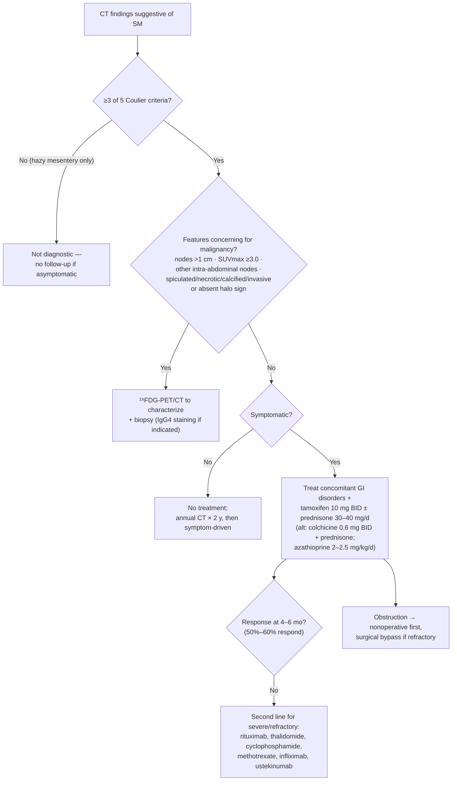

Idiopathic disorder of the bowel mesentery characterized by **inflammation, fat necrosis, and fibrosis**. Many historical names — mesenteric panniculitis, retractile mesenteritis, "misty mesentery," mesenteric lipodystrophy, liposclerotic mesenteritis, mesenteric Weber-Christian disease, xanthogranulomatous mesenteritis, idiopathic mesenteric fibrosis, inflammatory pseudotumor, systemic nodular panniculitis — all represent a **continuum of one disease** with differing ratios of fibrosis, fat necrosis, and inflammation; "sclerosing mesenteritis" (SM) is the proposed unifying term. Found on **0.6%–1.1%** of retrospective CT series; mean age ~55 y, more often male and White. Most are incidental and never need treatment.

## Contents
- [[#Assessment]]
  - [[#Establishing the Diagnosis]]
  - [[#Severity Assessment]]
- [[#Differential Diagnosis]]
- [[#Diagnostics]]
  - [[#When to Biopsy]]
  - [[#Follow-Up Imaging]]
- [[#Therapeutics]]
  - [[#Management Algorithm]]
- [[#See Also]]
- [[#Sources]]

## Assessment

### Establishing the Diagnosis

**Imaging-led — a presumptive diagnosis is made on CT without biopsy** in most cases when the criteria below are met and there are no alarm features.

**Coulier CT diagnostic criteria — the five features (≥3 suggests SM):**

| # | Feature |
|---|---|
| 1 | Hazy mesenteric fat mass **displacing intestine** |
| 2 | **Higher attenuation** in the mesenteric fat mass than adjacent mesentery, with **no enhancement** on IV contrast |
| 3 | Presence of lymph nodes **<1 cm** |
| 4 | **Hypoattenuated halo sign** around central vessels (the "fat ring sign") |
| 5 | Thin surrounding **fibrotic pseudocapsule** |

- **≥3 of 5 → suggestive of SM.** No single sign is diagnostic.
- **A hazy mesentery *without* nodes, halo sign, or pseudocapsule is NOT diagnostic** and, absent other symptoms, typically needs **no follow-up**.
- **Alarm features that change the plan:** fever, night sweats, unintentional weight loss. In their absence, with characteristic imaging, malignancy risk is very low and biopsy can be omitted. **Calcifications and retraction of surrounding bowel** mark more severe disease and possible malignancy → usually warrants biopsy unless [[autoimmune-pancreatitis|IgG4-related disease]] is established.
- **Fever should prompt evaluation for infection** before it is attributed to SM.

**Symptoms** — up to **60%** of patients with SM findings on CT are asymptomatic (likely an underestimate, since asymptomatic people are not all imaged). Among the symptomatic:

| Symptom | Frequency |
|---|---|
| Abdominal pain (most common) | up to **75%** |
| [[abdominal-bloating-and-distention\|Bloating]] | 10%–25% |
| [[chronic-diarrhea\|Diarrhea]] or [[chronic-constipation\|constipation]] | 10%–25% |
| [[nausea-and-vomiting\|Nausea and vomiting]] | 5%–15% |
| Weight loss | ~20% |

- A **palpable abdominal mass is often absent**.
- No higher prevalence of autoimmunity, but possibly increased rates of metabolic syndrome, [[obesity]], coronary artery disease, and urolithiasis.
- **Labs:** ESR and CRP may be elevated but not in all cases; the literature is scant and their role in management/follow-up is **uncertain**.

### Severity Assessment

- Only **1%–6%** of patients presenting with SM imaging findings require treatment in population series — but ~**50%** are treated initially in referral-center cohorts, with more requiring treatment over time.
- **Features suggesting a more severe course (all six from the source):**
  1. Omental, retroperitoneal, pelvic-fat, or **colonic mesentery** involvement
  2. Bowel obstruction/ischemia, venous thrombosis/thromboembolism, sepsis, protein-losing enteropathy, or renal failure
  3. **Marked** CRP or ESR elevation
  4. Coexisting autoimmune disease
  5. Arterial narrowing
  6. [[ascites]]
- Except in the most severe cases, most patients — treated or not — reach **stable disease without radiologic progression after 2 years**.

## Differential Diagnosis

*Workup is imaging-based (CT; MRI preferred for desmoid); biopsy is reserved for features concerning for malignancy — see [[#When to Biopsy]].*

| Condition | Distinguishing imaging features |
|---|---|
| **Non-Hodgkin lymphoma** | Mesenteric infiltration or mass hard to separate from SM on imaging alone; mesenteric node enlargement ± non-mesenteric nodes or splenomegaly |
| **Peritoneal carcinomatosis** | [[ascites\|Ascites]] + multiple enhancing mesenteric/peritoneal/omental nodules; desmoplastic reaction with fibrotic retraction can mimic SM |
| **Carcinoid / [[gastroenteropancreatic-neuroendocrine-tumors\|neuroendocrine tumor]]** | Usually focal bowel and liver lesions; atypical mesentery-only cases occur |
| **Mesenteric fibromatosis (desmoid)** | Common in [[familial-adenomatous-polyposis\|FAP]]; multifocal, non-inflamed mass-like/infiltrative, encases vessels and bowel. **MRI is the preferred test** |
| **Encapsulating peritoneal sclerosis** | Usually peritoneal dialysis; bowel encased in thickened peritoneum ("cocoon"), cauliflower appearance; ascites pockets 90%, peritoneal calcification 70% |
| **Retroperitoneal fibrosis** | Fibrotic mass from distal aorta (L4–L5) to iliacs encasing ureters; hydronephrosis, medial ureteral deviation; back/flank rather than focal abdominal pain. Can look identical histologically and can coexist |
| **Pseudomyxoma peritonei** | Mucinous ascites loculated along peritoneal surfaces; scalloped organ contours |
| **IgG4-related disease** | Can appear invasive with lymphadenopathy; **only half** have elevated serum IgG4. Biopsy generally required |
| Other | [[gastrointestinal-stromal-tumor\|GIST]], sarcoma, mesenteric edema (hypoalbuminemia, [[cirrhosis]], CHF, trauma), infections (mycobacteria, cryptococcus, schistosomiasis, HIV, cholera) |

**Relationship to cancer.** Current evidence does **not** support SM as a paraneoplastic syndrome, but findings overlap with lymphoma, gynecologic malignancy, and carcinoid. A **mesenteric mass or intra-abdominal lymph node >10 mm** raises suspicion for underlying malignancy. In a prospective study of >400 SM patients the rate of subsequent malignancy was **1%** — all B-cell lymphomas, all with either a soft-tissue nodule >10 mm or abdominopelvic lymphadenopathy. SM has also been reported **after immune checkpoint inhibitor therapy** (often asymptomatic, generally steroid-responsive).

## Diagnostics

- **CT abdomen/pelvis** — the primary modality; apply the Coulier criteria above.
- **¹⁸FDG-PET/CT** — helpful when features concerning for malignancy are present, both to characterize and to identify accessible nodes for biopsy.
- **Serum IgG4** — a surgical biopsy with IgG4 staining may be required if the IgG4 level is **normal** and the imaging is **not** diagnostic for SM.

### When to Biopsy

**Not needed** if imaging is classic for SM and there is no cancer concern. **Consider biopsy** if any of the following malignancy-concerning features are present:

1. Associated lymph nodes **>1 cm**
2. Lymph nodes with **SUVmax ≥3.0** on ¹⁸FDG-PET/CT
3. Lymphadenopathy in **another intra-abdominal location**
4. **Spiculated, necrotic, calcified, or invasive** appearance — including **absence of the central halo sign**

### Follow-Up Imaging

- Published recommendations vary widely — from **no repeat imaging** to **annual imaging for up to 5 years**. A meta-analysis of 4 case-control studies found no detectable increased cancer risk; another study found a small long-term increased lymphoma risk in those without initial malignant features, **80% detectable in the first year**.
- **Suggested approach for asymptomatic cases without initial malignancy-concerning features: annual CT for 2 years** to confirm stability, then imaging only for concerning symptoms.
- During follow-up, **significant growth of the mesenteric mass or new lymphadenopathy → biopsy**.

## Therapeutics

Treatment is aimed at **symptom relief** — there is limited evidence that treatment improves imaging or prevents complications, and **no controlled trials exist**; drug selection rests on open-label studies and case reports.

- **Asymptomatic → no treatment**, follow per above.
- **General measures:** treat concomitant GI disorders ([[chronic-constipation|constipation]], [[gerd|GERD]], [[irritable-bowel-syndrome|IBS]]); tricyclic antidepressants are used by one author for the mild pain of SM.

| Agent | Dose | Notes |
|---|---|---|
| **Prednisone** monotherapy | **30–40 mg/day**; in the large retrospective series typically started at **40 mg/day for 3–4 months, then tapered 5 mg/week** | May improve short-term symptoms; **long-term use not advised** (side effects). Benefit typically lost after discontinuation |
| **Tamoxifen** (most commonly used) | **10 mg twice daily**, alone or with prednisone 30–40 mg/day; with combination therapy taper prednisone after **3 months** and continue tamoxifen for maintenance (duration undetermined). In responders with mild side effects, **10 mg daily** may maintain response | Chosen for antifibrotic activity against TGF-β; actual mechanism unknown. **Side effects:** antiestrogenic (hot flashes, sweating, vaginal bleeding), alopecia, fatigue, thrombosis, thrombocytopenia, elevated liver enzymes. **Contraindicated** with history of venous thrombosis, pulmonary embolism, or significant cerebrovascular/cardiovascular/peripheral vascular disease; **active tobacco use is a relative contraindication** |
| **Colchicine** + prednisone | **0.6 mg twice daily** with **prednisone 40 mg/day**, tapering prednisone after 3 months | ~**50%** response in a small series. GI side effects may limit use; **contraindicated in renal insufficiency** |
| **[[thiopurines\|Azathioprine]]** | **2–2.5 mg/kg/day** ([[inflammatory-bowel-disease\|IBD]]-style dosing) in normal TPMT metabolizers | Slow onset — co-administer prednisone early |
| Rituximab, thalidomide, cyclophosphamide, methotrexate, infliximab, [[il-23-and-il-12-23-inhibitors\|ustekinumab]] | — | Limited data; significant toxicity potential; **reserved as second line for severe, refractory disease** |

- **Response:** maximal response to prednisone and tamoxifen occurs at **4–6 months**, with **50%–60% of patients responding**.

**Severe disease / complications:**
- **Bowel obstruction** — nonoperative management when feasible; **surgical bypass** if that fails. Complete resection is usually impossible because of vascular compromise and disease extent.
- **Chronic mesenteric ischemia** from mesenteric vascular obstruction — consider revascularization, but **few are candidates**: endovascular is limited by long-segment or distal vessel involvement, and surgical revascularization is rarely feasible because of the extensive inflammation. (Contrast with [[acute-mesenteric-ischemia]].)
- **Radiation therapy** — equivocal success.
- **Surgery does not cure SM** — in one study only **10%** of surgical patients required no further treatment. Persistent or recurrent post-surgical symptoms → treat medically as for nonobstructive symptoms.

### Management Algorithm

*Algorithm — evaluation and treatment of sclerosing mesenteritis, recreated in text form from the narrative of [[aga-2025-sclerosing-mesenteritis]]. The source's own Figure 2 flowchart is a raster image and has not been captured (see note below).*

> ⚠ **Evidence quality — all of the above is expert opinion.** [[aga-2025-sclerosing-mesenteritis]] is an AGA Clinical Practice Update *Commentary*: it carries **no formal Best Practice Advice statements and no evidence ratings**. The **optimal drug regimen and treatment duration are not established**, and the evidence that any of these agents relieves symptoms is limited.

> ⚠ **Figures not captured.** The source's Figure 1 (four CT images: A classic halo/pseudocapsule, B calcified mass with bowel retraction, C "misty mesentery," D calcified mass with retraction and bowel thickening) and Figure 2 (management algorithm) are raster figures in the PDF and are not yet embedded — PDF image-extraction tooling was unavailable on this pass.

---

## See Also

[[acute-mesenteric-ischemia]], [[ascites]], [[gastrointestinal-stromal-tumor]], [[gastroenteropancreatic-neuroendocrine-tumors]], [[familial-adenomatous-polyposis]], [[irritable-bowel-syndrome]], [[chronic-constipation]], [[chronic-diarrhea]], [[gerd]], [[nausea-and-vomiting]], [[abdominal-bloating-and-distention]], [[inflammatory-bowel-disease]], [[thiopurines]], [[obesity]], [[cirrhosis]], [[autoimmune-pancreatitis]], [[il-23-and-il-12-23-inhibitors]]

---

## Sources

1. [[aga-2025-sclerosing-mesenteritis|AGA Clinical Practice Update on Sclerosing Mesenteritis: Commentary]]
