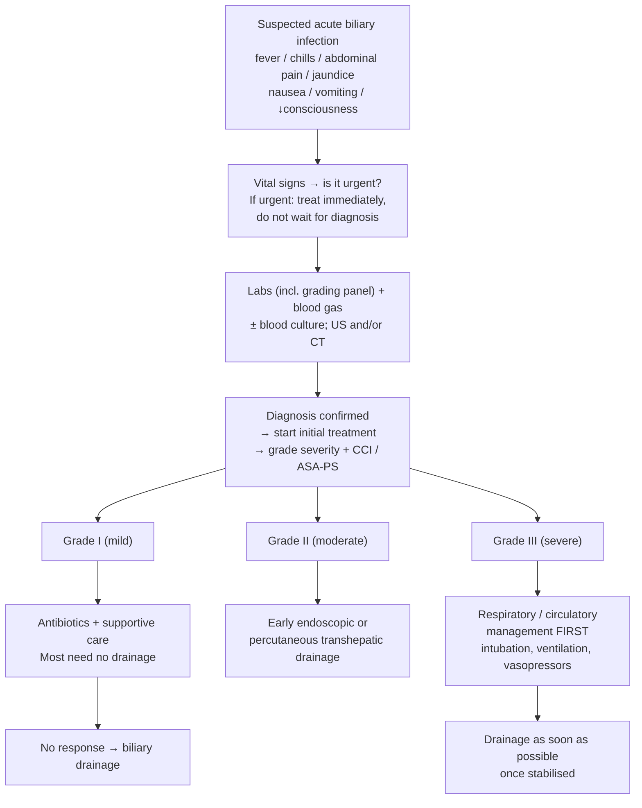

# Acute Cholangitis

Bacterial infection of an obstructed biliary tree. Two decisions drive the whole disease: **what grade is it** and **when does the bile duct get drained**.

## Contents
- [[#Assessment]]
  - [[#Establishing the Diagnosis]]
  - [[#Severity Assessment]]
- [[#Differential Diagnosis]]
- [[#Diagnostics]]
- [[#Therapeutics]]
  - [[#Initial Treatment — All Grades]]
  - [[#Biliary Drainage — Timing]]
  - [[#Grade-Specific Management]]
  - [[#Treating the Underlying Cause]]
  - [[#Transfer]]
- [[#See Also]]
- [[#Sources]]

---

## Assessment

### Establishing the Diagnosis

- **Suspect on any ONE of:** fever, chills, abdominal pain, [[jaundice]], nausea, vomiting, disturbance of consciousness. One symptom is enough to trigger the workup. ([[tg18-2018-cholangitis-flowchart]])
- **Vital signs are the first step**, to decide whether the situation is urgent: BP, HR, respiratory rate, temperature, urine volume, SpO₂, consciousness level. **If urgent, start treatment immediately — do not wait for the definitive diagnosis.** ([[tg18-2018-cholangitis-flowchart]])
- **Exam:** consciousness level, palpebral conjunctival icterus, site and severity of tenderness, peritoneal irritation. Murphy's sign points to [[acute-cholecystitis|acute cholecystitis]] instead.
- ⚠ **"Charcot's triad" is not defined in any ingested source** — full-text search of TG18, [[asge-2021-cholangitis]] and the rest of the biliary corpus returns zero hits for Charcot, Reynolds or Courvoisier. The eponym is deliberately not stated here as sourced content (same finding recorded on [[jaundice]]).

**TG18 diagnostic criteria — three domains, and the rule that combines them:**

| Domain | What it covers |
|---|---|
| **A — Systemic inflammation** | fever / systemic inflammatory response |
| **B — Cholestasis** | jaundice, abnormal liver chemistries |
| **C — Imaging** | biliary dilatation, or evidence of the etiology (stricture, stone, stent) |

- **Suspected diagnosis** = **one** item from **A** *plus* **one** from **either B or C**.
- **Definite diagnosis** = **one** item from **A, B *and* C** — all three domains.
- *The combination rule is the decision:* systemic inflammation is mandatory in both, and it is the presence of **both** B **and** C that converts suspected into definite.
- **Source:** these three domains and the suspected/definite rule are stated in the introduction of [[jagtap-2026-urgent-vs-early-ercp-cholangitis]], which enrolled on them; that trial defined obstructive jaundice as **total bilirubin ≥2.5 mg/dL *and* ALP >1.5× ULN *and* a dilated bile duct on cross-sectional imaging.**

> ⚠ **Residual gap — the individual A-1/A-2/B-1/B-2/C-1/C-2 items and their lab cut-points are still not in the corpus.** The ingested TG18 file is an accepted manuscript that only cross-references its Table 1; the domain structure and combination rule above are recoverable only second-hand (from the RCT that used them). The itemised criteria with thresholds would require ingesting **Kiriyama S. *Diagnostic and severity grading criteria for acute cholangitis in TG18*, J Hepatobiliary Pancreat Sci 2018** (TG18 reference [6]). Do not reconstruct them from memory. See [[tg18-2018-cholangitis-flowchart]] → *Contradictions / Open Questions*.

### Severity Assessment

**TG18 severity assessment criteria** — graded at diagnosis and **reassessed frequently** with response to initial treatment. ([[tg18-2018-cholangitis-flowchart]])

| Grade | Rule | Criteria |
|---|---|---|
| **III — severe** | **any ONE** organ dysfunction | **Cardiovascular:** dopamine ≥5 μg/kg/min **or** noradrenaline required · **Neurological:** disturbance of consciousness · **Respiratory:** PaO₂/FiO₂ <300 · **Renal:** oliguria **or** creatinine >2.0 mg/dL · **Hepatic:** PT-INR >1.5 · **Coagulation:** platelet count <10⁴/μL ⚠ |
| **II — moderate** | **any TWO** of five | WBC **>12,000** or **<4,000** ⚠ · temperature **≥39 °C** · age **≥75 y** · total bilirubin **≥5 mg/dL** · albumin **< (lower limit of normal × 0.7) g/dL** ⚠ |
| **I — mild** | meets **neither** Grade II nor Grade III | — |

- **The rules differ and the difference is the decision:** Grade III needs only **one** organ dysfunction; Grade II needs **two** of the five criteria — a single criterion (age ≥75 alone, bilirubin ≥5 alone) does **not** make cholangitis moderate.
- **Grade II is defined by its therapeutic implication:** not severe, but **requires early biliary drainage**.
- **Grade III is sepsis-induced organ damage**, not simply "sick-looking."
- ⚠ **Four caveats, all from the same cause — the source's Table 3 is missing and these are transcribed from its running text.** (1) **The comparison operators are not recoverable from the ingested file.** In the accepted manuscript the `<`, `>`, `≥` and `μ` glyphs are unmapped and drop out of text extraction: the sentence reads literally *"WBC 12,000 or 4000, temperature 39 ºC, age 75 years, total bilirubin 5 mg/dL"* and *"dopamine 5 g/kg/min … PaO2/FiO2 ratio 300 … PT-INR 1.5 … platelet count 104/L"*. **The only operator that survives verbatim is creatinine ">2.0".** Every other direction shown in the table above is read off the criterion's clinical sense, not off the source text — do not quote them as verbatim TG18 wording. (2) The **WBC** criterion is printed **without units** (not in the ingested file, so not asserted here). (3) The **albumin** cutoff is printed as "<(lower limit of normal value × 0.73 g/dL)", whose parenthesis placement is internally inconsistent. (4) The **platelet** cutoff is printed as **<10⁴/μL** (i.e. <10,000/μL), far below the usual coagulation-dysfunction threshold and likely a typesetting loss. See [[tg18-2018-cholangitis-flowchart]] before relying on any of these.
- **General status** is graded alongside severity, using the **Charlson Comorbidity Index (CCI)** and the **ASA Physical Status classification**.

---

## Differential Diagnosis

*Workup: see [[jaundice]].*

- [[acute-cholecystitis|Acute cholecystitis]] — Murphy's sign, gallbladder wall thickening/pericholecystic fluid; bile duct not obstructed.
- [[choledocholithiasis|Choledocholithiasis]] without infection — obstruction and cholestasis, no systemic inflammatory response.
- [[acute-pancreatitis|Acute pancreatitis]], including gallstone pancreatitis — may coexist.
- [[cholangiocarcinoma|Cholangiocarcinoma]] and [[pancreatic-cancer|pancreatic cancer]] — malignant obstruction, which may present with or be complicated by cholangitis.
- [[biliary-stricture|Biliary stricture]] — benign or malignant, including post-surgical and anastomotic.
- [[primary-sclerosing-cholangitis|Primary sclerosing cholangitis]] — recurrent cholangitis on a background of multifocal strictures.

---

## Diagnostics

**Blood tests — drawn for diagnosis *and* for severity grading**, so the grading panel must be sent up front: ([[tg18-2018-cholangitis-flowchart]])

- WBC, platelet count, CRP, albumin
- ALP, GGT, AST, ALT, bilirubin
- BUN, creatinine, PT and **PT-INR**
- **Blood gas analysis**
- **Blood culture — preferably if high fever is present.** If it was not drawn as part of the initial response, **it must be taken before antibiotics are given.** ([[tg18-2018-cholangitis-flowchart]])
- **If biliary drainage is performed, bile samples must always be sent for culture.**

*Note how directly this maps onto the grading table: platelets, albumin, bilirubin, creatinine, PT-INR and WBC are all severity criteria, which is why they are sent at presentation rather than reactively.*

**Imaging:**

- **Abdominal ultrasound and/or CT — at least one.** ([[tg18-2018-cholangitis-flowchart]])
- **Ultrasound first** — minimally invasive, widely available, simple, cheap. Limitation: results are easily affected by operator skill and patient condition.
- **What imaging is for:** inflammation itself is difficult to assess in cholangitis. Imaging evaluates **bile duct dilatation**, and **occlusion/stenosis or calculus and its cause**.
- [[mri-mrcp|MRCP]] and [[endoscopic-ultrasound|EUS]] characterise the level and cause of obstruction — see [[choledocholithiasis]] for the ASGE risk stratification that decides between them and direct [[ercp|ERCP]].

---

## Therapeutics

### Initial Treatment — All Grades

- **Sufficient IV fluids, antibiotics, and analgesia**, monitoring BP, heart rate, and urine volume. **In shock, start before the definitive diagnosis.** ([[tg18-2018-cholangitis-flowchart]])
  - ⚠ **Gap — no antimicrobial regimen is in the corpus.** *Drainage and antibiotics are the two pillars of treatment*, but the ingested TG18 flowchart article deliberately defers all agent choice, dose, and duration to a companion paper: **Gomi H. *TG18: Antimicrobial therapy for acute cholangitis and cholecystitis*, J Hepatobiliary Pancreat Sci 2018** (TG18 ref [13]), which is **not ingested**. [[asge-2021-cholangitis]] does not supply one either. Do not write a regimen from memory.
- **When acute cholecystitis coexists** (it sometimes does), decide the strategy on the **severity of both diseases plus the patient's general status** — not on the cholangitis grade alone. ([[tg18-2018-cholangitis-flowchart]])
- **Fast the patient in principle**, so emergency drainage can proceed immediately. *(No high-quality evidence either way.)*
- **Give analgesia proactively and early.** An RCT of IV morphine vs placebo in ER abdominal pain found **no difference in diagnostic accuracy** — fear of masking physical signs should not delay it.
  - ⚠ **Caution:** opioids (morphine, pentazocine, and similar non-opioids) **contract the sphincter of Oddi** and may raise biliary pressure.
- **Escalate to emergency drainage** with organ support if the patient deteriorates: shock (hypotension), disturbance of consciousness, acute dyspnea, acute renal dysfunction, hepatic dysfunction, or DIC (falling platelet count).

### Biliary Drainage — Timing

**The wiki follows [[asge-2021-cholangitis]] (2021, newer guideline) for the operative window. Its three recommendations, with their GRADE labels as published:**

| # | Recommendation | Strength | Quality |
|---|---|---|---|
| **1** | [[ercp\|ERCP]] over percutaneous transhepatic biliary drainage (PTBD) | Conditional | Very low |
| **2** | ERCP in **≤48 h** compared with **>48 h** | Conditional | Very low |
| **3** | Combine biliary drainage with **sphincterotomy and stone removal**, rather than stent placement without attempted stone removal | Conditional | Low |

- **The 48-hour line is not a biological threshold.** ASGE chose it because it "is the cut-point in the preponderance of literature on the topic and addresses the workforce and financial concerns of weekend procedures." ([[asge-2021-cholangitis]])
- **Supporting data for ≤48 h:** in 4,570 cholangitis admissions, ERCP within 48 h reduced inpatient mortality (OR 0.5), 30-day mortality (OR 0.5, 95% CI 0.3–0.7) and 30-day readmission (OR 0.6, 95% CI 0.5–0.7) vs >48 h — **significant in both mild-to-moderate and severe** disease. Delay **>72 h** raised a composite of death/organ failure/ICU admission (OR 5.5, P=.004). ([[asge-2021-cholangitis]])
- **ASGE does *not* recommend <24 h for Grade III.** Its own reading of the evidence: "ERCP in <24 hours or 24 to 48 hours versus >48 hours appears to shorten the length of hospitalization but **does not impact inpatient or 30-day mortality, organ failure, or other core clinical outcomes.**" The one carve-out is narrower than "severe": **in septic shock *not responding to fluid resuscitation*, ERCP <24 h "may be considered"** — a suggestion, not a recommendation, and conditioned on refractoriness rather than on Tokyo grade. ([[asge-2021-cholangitis]])
- **Mild-to-moderate (Grade I–II): do not reflexively rush to <24 h.** Urgent (<24 h) drainage is **not superior** to early (24–48 h) — same 30-day mortality (3.95% vs 6.58%) and organ failure — and **roughly doubles post-ERCP adverse events** (17.1% vs 9.2%; RR 2.03), mainly **haemorrhage** (10.5% vs 3.3%), from sphincterotomy on an oedematous papilla in an under-resuscitated septic patient. **Resuscitate, then drain within 24–48 h.** ([[jagtap-2026-urgent-vs-early-ercp-cholangitis]])
- **Malignant biliary obstruction — not timing — is the dominant predictor of 30-day mortality** (HR ~5). ([[jagtap-2026-urgent-vs-early-ercp-cholangitis]])
- *Under question in septic shock:* in Grade III cholangitis with septic shock, ERCP **<24 h of vasopressor initiation** gave **no survival advantage** over 24–48 h (30-d mortality HR 1.07, 95% CI 0.81–1.42) and looked worse than 48–72 h (HR 1.47, 1.00–2.16) — likely confounded by the sickest being drained first. ⚠ **DDW 2026 abstract, retrospective** — below guideline and RCT evidence; hypothesis-generating, does **not** change the emergent-drainage recommendation. ([[aloysius-2026-ercp-timing-septic-shock-cholangitis]])

> **Contradiction on the record.** TG18 (2018) cites observational Japan–Taiwan data favouring drainage **within 24 h for moderate cholangitis** (mortality **1.7% vs 3.4%**, p=0.0172; no difference in mild or severe) — its own CQ 1 answer is graded **Level D**. The newer same-tier guideline ([[asge-2021-cholangitis]]) sets the window at 48 h, and the 2026 RCT found harm in compressing it. The page follows the newer guideline; TG18's signal is recorded, not followed. ([[tg18-2018-cholangitis-flowchart]])

### Grade-Specific Management

**TG18 flowchart for acute cholangitis (Figure 2):** ([[tg18-2018-cholangitis-flowchart]])

- **Grade I (mild):** initial treatment including antibiotics is sufficient in most cases; **most patients do not require biliary drainage.** Drain **if there is no response** to initial treatment. **Postoperative cholangitis** usually improves on antibiotics alone — drainage not usually required.
- **Grade II (moderate):** **early endoscopic or percutaneous transhepatic biliary drainage is indicated.**
- **Grade III (severe):** condition may deteriorate rapidly. **Respiratory/circulatory management first** — tracheal intubation → artificial ventilation, vasopressors. Drainage **as soon as possible after the patient's condition has been improved** by initial treatment and organ support. *"Stabilise, then drain."*

**Severe cholangitis complicated by DIC:** **recombinant human soluble thrombomodulin (rTM) may be considered (Level D, future research question).** Two small case series — DIC resolution better with rTM (83.3% vs 52.8%, p<0.01) but **no mortality difference** (13.3% vs 27.8%, p=0.26); recommended only on the grounds that no serious side effects were seen. Value of heparin, antithrombin III, and protease inhibitors in cholangitis is **unclear**. ([[tg18-2018-cholangitis-flowchart]])

### Treating the Underlying Cause

- **Combine drainage with sphincterotomy and stone removal at the index ERCP, rather than decompression alone** — **unless the patient is too unstable to tolerate the more extensive endoscopic treatment**, which is the guideline's own and only stated exception (Rec 3, conditional / low). ([[asge-2021-cholangitis]])
- **Grade I–II:** TG18 permits **single-stage** endoscopic sphincterotomy (EST) + choledocholithotomy **together with** biliary drainage — a change from TG13, which made it elective in moderate disease.
  - ⚠ **The guideline flags its own evidence as insufficient:** in the one RCT, post-ERCP complications were significantly **higher** with single-stage than two-stage lithotomy (**6/35 = 17.1% vs 0/33 = 0%, p=0.025**). "Caution is required."
- **Grade II–III:** treat the underlying etiology **after the general condition has improved**, not during resuscitation.
- Stratification of stone probability, difficult-stone technique, and gallstone-pancreatitis rules: see [[choledocholithiasis]] and [[ercp]].

### Transfer

- If a hospital **cannot perform endoscopic or percutaneous transhepatic drainage, or cannot provide intensive care**, patients with **moderate or severe** cholangitis should preferably be **transferred to a centre that can — irrespective of whether those treatments turn out to be required.** ([[tg18-2018-cholangitis-flowchart]])

---

## See Also

[[choledocholithiasis]], [[acute-cholecystitis]], [[ercp]], [[jaundice]], [[biliary-stricture]], [[cholangiocarcinoma]], [[acute-pancreatitis]], [[primary-sclerosing-cholangitis]], [[endoscopic-ultrasound]], [[mri-mrcp]], [[abnormal-liver-chemistries]], [[cholangioscopy]]

---

## Sources

1. [[tg18-2018-cholangitis-flowchart|Tokyo Guidelines 2018: Initial Management of Acute Biliary Infection and Flowchart for Acute Cholangitis]]
2. [[asge-2021-cholangitis|ASGE Guideline: Management of Acute Cholangitis (2021)]]
3. [[jagtap-2026-urgent-vs-early-ercp-cholangitis|Urgent versus Early ERCP in Mild-to-Moderate Acute Cholangitis: A Randomised Controlled Trial (Jagtap 2026)]]
4. [[aloysius-2026-ercp-timing-septic-shock-cholangitis|Vasopressor-Indexed Timing of ERCP and Survival in Septic Shock from Tokyo Grade III Cholangitis (Aloysius 2026, DDW abstract)]]
5. [[asge-2019-choledocholithiasis|ASGE 2019: Endoscopic Management of Choledocholithiasis]]
