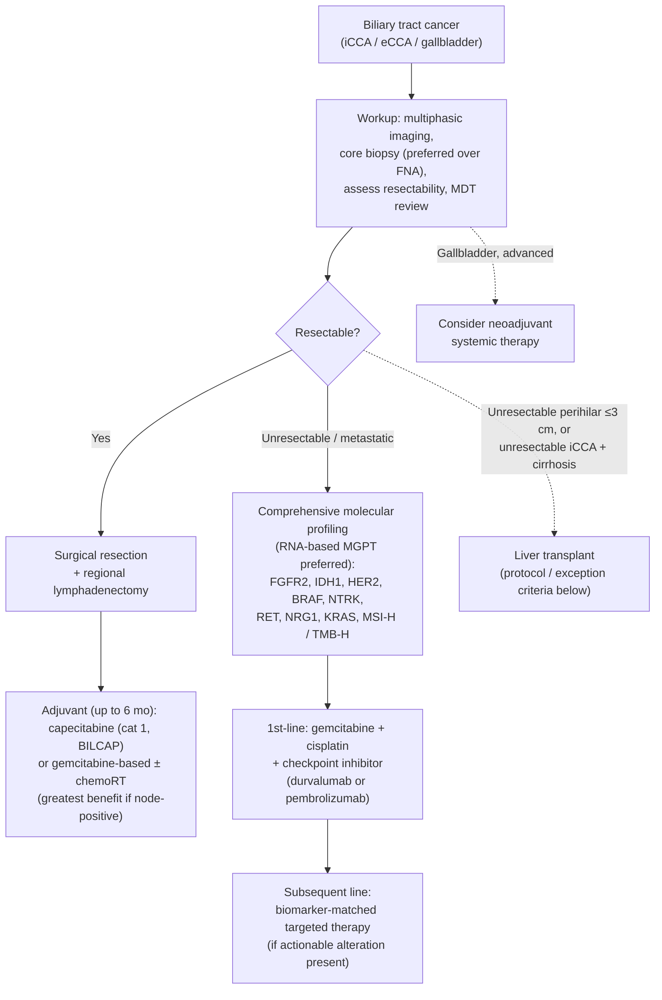

Cholangiocarcinoma (CCA) is an adenocarcinoma arising from the biliary epithelium, classified anatomically as **intrahepatic (iCCA)**, **perihilar (Klatskin)**, or **distal extrahepatic**. US incidence is ~8000 cases/year and rising; overall 5-year survival ~10%, but earlier-stage diagnosis carries a meaningfully better prognosis ([[asge-2023-indeterminate-biliary-strictures]]) — so prompt tissue diagnosis when a patient presents with a [[biliary-stricture|biliary stricture]] matters.

## Contents
- [[#Assessment]]
  - [[#Establishing the Diagnosis]]
  - [[#Classification / Typing]]
  - [[#Staging (AJCC 8th ed., 2017)]]
- [[#Differential Diagnosis]]
- [[#Diagnostics]]
  - [[#Workup]]
  - [[#Tissue Acquisition]]
- [[#Therapeutics]]
  - [[#Overall Pathway]]
  - [[#Resectability and Surgery]]
  - [[#Liver Transplantation]]
  - [[#Adjuvant Therapy]]
  - [[#Molecular Biomarker Testing]]
  - [[#Systemic Therapy for Advanced Disease]]
  - [[#Drainage and Palliation]]
  - [[#Surveillance After Resection]]
- [[#See Also]]
- [[#Sources]]

## Assessment

### Establishing the Diagnosis

- Most often presents as a **biliary stricture of undetermined etiology**; risk of malignancy in a stricture without an obvious mass on cross-sectional imaging is **~55%**.
- Benign mimics look similar radiographically ([[primary-sclerosing-cholangitis|PSC]], IgG4-related cholangitis, fibrotic strictures, [[chronic-pancreatitis|chronic pancreatitis]]) → **tissue acquisition is required**.
- Early-stage CCA may show only mild liver-test changes, **particularly alkaline phosphatase**.
- Endoscopic sampling is preferred over percutaneous (external drain, needle-track seeding) or surgical approaches.
- **Review all cross-sectional imaging at a multidisciplinary tumor board**, with early surgical consultation — *before* biliary drainage in a jaundiced patient — to assess resectability ([[nccn-2026-biliary-tract-cancers]]).

### Classification / Typing

| Type | Location | Behavior |
|---|---|---|
| **Intrahepatic (iCCA)** | Within liver parenchyma | Behaves more like a hepatic mass; overlaps with [[hepatocellular-carcinoma\|HCC]] on imaging (consider AFP; see [[li-rads]]) |
| **Perihilar (Klatskin)** | Arising in the main lobar ducts proximal to the cystic duct, at/near the confluence | Requires major hepatectomy; transplant pathway exists |
| **Distal extrahepatic** | Between the cystic-duct/CHD confluence and the ampulla | Overlaps with the differential of pancreatic head malignancy; treated by pancreaticoduodenectomy |

*(Ampulla of Vater tumors are staged separately.)*

**Perihilar sub-classification systems** ([[nccn-2026-biliary-tract-cancers]]):

- **Bismuth-Corlette** — four types by extent of *biliary* involvement (criteria live on [[biliary-stricture]]). It **omits vascular encasement, nodal involvement, distant metastases, and liver atrophy**, and — like AJCC staging — is **not useful for predicting resectability or survival**. Use it to describe ductal extent, not to decide operability.
- **Blumgart** — preoperative system that **does** predict resectability, likelihood of metastatic disease, and survival. Classifies hilar CCA into three stages (T1–T3) by (1) location and extent of bile duct involvement, (2) presence/absence of portal venous invasion, and (3) hepatic lobar atrophy. Increasing T stage correlates with lower R0 rate, more distant metastatic disease, and lower median survival.
  - *Gap:* the actual T1/T2/T3 cut-points of the Blumgart system are **not reproduced in any ingested source** (NCCN cites Jarnagin 2001 and Matsuo 2012). Those primary papers would be needed — do not infer the strata.

### Staging (AJCC 8th ed., 2017)

Reproduced in [[nccn-2026-biliary-tract-cancers]]. Each site has its own T definitions; N and M are shared in form.

**Intrahepatic bile duct**

| T | Criterion |
|---|---|
| Tis | Carcinoma in situ (intraductal tumor) |
| T1a | Solitary tumor **≤5 cm**, no vascular invasion |
| T1b | Solitary tumor **>5 cm**, no vascular invasion |
| T2 | Solitary tumor **with** intrahepatic vascular invasion, **or** multiple tumors (± vascular invasion) |
| T3 | Tumor perforating the visceral peritoneum |
| T4 | Tumor involving local extrahepatic structures by direct invasion |

N0/N1 = absent/present regional nodal metastasis. Stage IIIB = T4 N0 M0 **or** any T N1 M0; Stage IV = any M1.

**Perihilar bile duct**

| T | Criterion |
|---|---|
| Tis | Carcinoma in situ / high-grade dysplasia |
| T1 | Confined to the bile duct, extending up to the muscle layer or fibrous tissue |
| T2a | Beyond the bile duct wall into surrounding **adipose tissue** |
| T2b | Invades adjacent **hepatic parenchyma** |
| T3 | Invades **unilateral** branches of the portal vein or hepatic artery |
| T4 | Invades **main portal vein or its branches bilaterally**, or the **common hepatic artery**; or unilateral second-order biliary radicals bilaterally with contralateral portal vein or hepatic artery involvement |

| N | Criterion |
|---|---|
| N1 | **1–3** positive nodes (hilar, cystic duct, common bile duct, hepatic artery, posterior pancreatoduodenal, portal vein) |
| N2 | **≥4** positive nodes from those sites |

Stage IIIB = T4 N0 M0; IIIC = any T N1 M0; IVA = any T N2 M0; IVB = M1.

**Distal bile duct** — staged by **depth of invasion into the duct wall**:

| T | Criterion |
|---|---|
| T1 | Depth **<5 mm** |
| T2 | Depth **5–12 mm** |
| T3 | Depth **>12 mm** |
| T4 | Involves the **celiac axis, superior mesenteric artery, and/or common hepatic artery** |

N1 = 1–3 nodes; N2 = ≥4 nodes. Stage IIIB = T4 with any N, M0; Stage IV = M1.

Histologic grade (all sites): G1 well / G2 moderately / G3 poorly differentiated.

## Differential Diagnosis

*Workup: see [[biliary-stricture]].*

[[pancreatic-cancer|Pancreatic adenocarcinoma]], [[gallbladder-cancer|gallbladder cancer]], ampullary cancer, [[hepatocellular-carcinoma|hepatocellular carcinoma]], metastatic disease, and benign strictures (PSC, IgG4-related/autoimmune cholangitis, chronic pancreatitis, post-surgical injury).

## Diagnostics

### Workup

Per [[nccn-2026-biliary-tract-cancers]], for suspected extrahepatic CCA presenting with pain, jaundice, abnormal LFTs, or obstruction/abnormality on imaging:

- **Multiphasic abdomen/pelvis CT or MRI with IV contrast**, explicitly assessing **vascular invasion**; plus **chest CT ± contrast**.
- **Biliary-protocol imaging and cholangiography** — **MRCP is preferred** ([[mri-mrcp]]); [[ercp|ERCP]]/PTC are used more for *therapeutic* intervention.
- **Perform imaging before biliary decompression** — decompression degrades local staging accuracy and therefore the surgical-candidacy assessment.
- **LFTs**; consider **CEA** and **CA 19-9** as *baseline* values only — neither should be used to confirm the diagnosis (CA 19-9 also rises with cholestasis/cholangitis). Consider a baseline CA 19-9 **after** biliary decompression.
- Consider **serum IgG4** to exclude IgG4-related sclerosing cholangitis (refer such patients to an expert center).
- Consider **[[endoscopic-ultrasound|EUS]] — after surgical consultation**, not before.

### Tissue Acquisition

The modality-by-modality sampling algorithm and per-test yields — [[brush-cytology|brush cytology]], fluoroscopic forceps biopsy, [[cholangioscopy]]-directed biopsy, [[endoscopic-ultrasound|EUS]]-FNA/FNB, [[fish|FISH]], [[confocal-laser-endomicroscopy|pCLE]]/IDUS — live on [[biliary-stricture]]. CCA-specific points:

- **Core biopsy is preferred over FNA** — molecular profiling needs adequate tissue ([[nccn-2026-biliary-tract-cancers]]).
- **Establish resection/transplant candidacy *before* biopsy.** In a potential transplant candidate, refer to the transplant center first; **transperitoneal and surgical biopsy may be contraindicated**, and for a hilar mass, needle-track/transperitoneal seeding can permanently exclude the patient from [[liver-transplantation|liver transplantation]] — the only potentially curative option for many perihilar CCA patients. If EUS is done for a proximal/hilar stricture, sample **regional lymph nodes only, never the biliary mass** (a positive node is already a transplant contraindication, so nodal sampling costs nothing). All three ASGE 2023 recommendations on stricture sampling are conditional with very low quality of evidence.
- Pathology reporting: establish cholangiocyte differentiation (histology ± IHC and albumin ISH); report small-vessel invasion and poor/undifferentiated grade; for iCCA report **small-duct vs large-duct** histologic type; report background liver disease, fibrosis stage, and presence/absence of [[cirrhosis|cirrhosis]].

## Therapeutics

### Overall Pathway

*Algorithm — NCCN biliary tract cancer management, recreated in original form (not an NCCN figure). ([[nccn-2026-biliary-tract-cancers]])*

### Resectability and Surgery

**Hilar CCA — the operative definition of resectable** ([[nccn-2026-biliary-tract-cancers]]):

- The tumor must be resectable **together with the involved biliary tree and the involved hemi-liver**, with a reasonable chance of a **margin-negative (R0)** resection, **and** the contralateral liver must retain **intact arterial inflow, portal inflow, and biliary drainage**.
- **Contraindications found at exploration:** distant metastatic disease to liver, peritoneum, or **lymph nodes beyond the porta hepatis**. Further exploration must then confirm local resectability.
- Because hilar tumors abut/invade the central liver, resection is a **major hepatectomy on the involved side plus caudate resection** to clear the confluence.
- **Future liver remnant (FLR)** must be assessed (biliary drainage + volumetrics); with a small FLR, consider preoperative **biliary drainage of the FLR** and **contralateral portal vein embolization**.
- Portal vein and/or hepatic artery resection–reconstruction may be required. Reconstruction is generally **Roux-en-Y hepaticojejunostomy**; regional lymphadenectomy of the porta hepatis is performed; **frozen section of proximal and distal duct margins** is recommended if further resection is feasible.

**Distal CCA:** rule out distant metastatic disease, confirm local resectability, then **pancreaticoduodenectomy** with typical reconstruction; consider frozen section of the proximal bile-duct margin.

### Liver Transplantation

- **Perihilar CCA:** patients with **unresectable** perihilar/hilar CCA measuring **≤3 cm in radial diameter**, with **no intrahepatic or extrahepatic metastases** and **no nodal disease** — and likewise patients with [[primary-sclerosing-cholangitis|PSC]] — may be considered for transplantation **at a center with a UNOS-approved CCA transplant protocol** (neoadjuvant protocol). All three conditions must hold together; any one failing removes the pathway.
- **iCCA (transplant exception points, NCCN v1.2026):** **biopsy-proven** iCCA or mixed [[hepatocellular-carcinoma|HCC]]-iCCA **and** presence of [[cirrhosis|cirrhosis]] **and** unresectable **and** having received locoregional or systemic therapy **and** **6 months** from diagnosis or last treatment **with no new lesions and no extrahepatic disease**. Consider hepatology referral.

### Adjuvant Therapy

- **Adjuvant capecitabine is a category 1 option** after resection (BILCAP); gemcitabine-based regimens and fluoropyrimidine-based chemoradiation are alternatives.
- **Duration: up to 6 months.** Greatest benefit in **node-positive** disease.
- Neoadjuvant systemic therapy is specifically considered for [[gallbladder-cancer|gallbladder cancer]], which often presents advanced.

### Molecular Biomarker Testing

Comprehensive multi-gene profiling is recommended for **all patients with unresectable or metastatic disease** who are systemic-therapy candidates, ideally **RNA-/transcriptome-based to maximize detection of gene fusions**. Actionable targets: **FGFR2 fusions/rearrangements** and **IDH1 mutations** (both enriched in iCCA), **BRAF V600E**, **HER2 (ERBB2)**, **NTRK1/2/3 fusions**, **RET fusions**, **NRG1 fusions** (added v1.2026), **KRAS G12C**, plus tumor-agnostic **MSI-H/dMMR** and **TMB-H**. ctDNA may complement tissue testing but can miss fusions. Consider germline testing/genetic counseling for dMMR/MSI-H tumors or a family history suggestive of BRCA1/2 pathogenic variants.

### Systemic Therapy for Advanced Disease

First-line is a **gemcitabine + cisplatin backbone plus a checkpoint inhibitor** (durvalumab per TOPAZ-1, or pembrolizumab per KEYNOTE-966); carboplatin may substitute when cisplatin is contraindicated. Biomarker-matched agents (FGFR2-fusion inhibitors, IDH1 inhibitors, HER2-directed therapy, BRAF/MEK inhibitors, NTRK/RET inhibitors, immunotherapy for MSI-H/dMMR or TMB-H) are used in subsequent lines when the target is present.

### Drainage and Palliation

Drainage decisions (SEMS vs plastic stents, sectorial perihilar drainage, endobiliary PDT/[[radiofrequency-ablation|RFA]]) live on [[biliary-stricture]] and [[asge-2021-malignant-hilar-obstruction]]. Consider biliary drainage for jaundice **before** starting systemic therapy.

### Surveillance After Resection

- **Multiphasic abdomen/pelvis CT or MRI with IV contrast plus chest CT ± contrast every 3–6 months for 2 years, then every 6–12 months for up to 5 years**, or as clinically indicated (schedule based on BILCAP).

## See Also

[[biliary-stricture]], [[primary-sclerosing-cholangitis]], [[gallbladder-cancer]], [[pancreatic-cancer]], [[hepatocellular-carcinoma]], [[ercp]], [[endoscopic-ultrasound]], [[cholangioscopy]], [[brush-cytology]], [[fish]], [[confocal-laser-endomicroscopy]], [[chronic-pancreatitis]], [[liver-transplantation]], [[cirrhosis]], [[mri-mrcp]], [[li-rads]], [[radiofrequency-ablation]]

---

## Sources

1. [[nccn-2026-biliary-tract-cancers|NCCN Clinical Practice Guidelines in Oncology: Biliary Tract Cancers (Version 1.2026)]]
2. [[asge-2023-indeterminate-biliary-strictures|ASGE Guideline on the Role of Endoscopy in the Diagnosis of Malignancy in Biliary Strictures of Undetermined Etiology (2023)]]
3. [[asge-2021-malignant-hilar-obstruction|ASGE Guideline: Endoscopic Management of Malignant Hilar Obstruction (2021)]]
