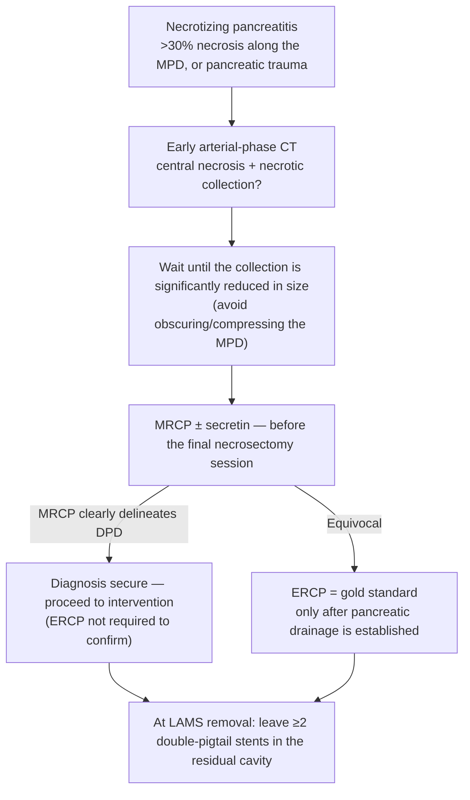

# Disconnected Pancreatic Duct (DPD) and DPD Syndrome

*The duct is **completely** severed — that is what separates DPD from a partial duct disruption/leak, and it is why the two are managed differently. [[uspg-2025-disconnected-pancreatic-duct|USPG 2025]] is a consensus statement: it carries **no GRADE ratings and no numbered recommendations**, so nothing on this page should be read as a graded recommendation.*

## Contents
- [[#Assessment]]
  - [[#Establishing the Diagnosis]]
  - [[#Severity Assessment]]
  - [[#Classification / Typing]]
- [[#Differential Diagnosis]]
- [[#Diagnostics]]
  - [[#When to Evaluate]]
  - [[#Diagnostic Modalities]]
  - [[#Pitfalls]]
- [[#Therapeutics]]
  - [[#Drainage Route]]
  - [[#Pancreatic Duct (Transpapillary) Stents]]
  - [[#Double-Pigtail Stents After LAMS Removal]]
  - [[#Surgery]]
- [[#See Also]]
- [[#Sources]]

---

## Assessment

### Establishing the Diagnosis

**The three definitions — USPG 2025 standard set** (proposed explicitly so future cohort studies are comparable; the lack of a shared definition is why reported prevalence varies so widely):

| Term | Definition [[uspg-2025-disconnected-pancreatic-duct]] |
|---|---|
| **Disrupted pancreatic duct / pancreatic duct leak** | **Incomplete/partial** lack of continuity of the main pancreatic duct (MPD). Contrast extravasation (leak) from a side branch or the MPD at pancreatography, with **the MPD itself at least partially intact** |
| **Disconnected pancreatic duct (DPD)** | **Complete (circumferential)** lack of ductal continuity between viable secreting pancreatic tissue — typically between the duct in the head, the duct in the body, and the tail — and the downstream pancreatic parenchyma |
| **DPD syndrome (DPDS)** | Recurrent pancreatitis, abdominal pain, recurrent fluid collection(s), and/or any other symptoms **due to the undrained pancreatic segment** caused by DPD |

- **Mechanism:** necrosis and disruption of the MPD leave **no continuity between the duct in the left-sided (body/tail) pancreas and the GI lumen**, producing a persistent pancreatic fistula that most often presents as a peripancreatic fluid collection ([[aga-2020-cpu-pancreatic-necrosis]]).
- **Settings:** [[acute-pancreatitis|necrotizing pancreatitis]], pancreatic trauma, and [[chronic-pancreatitis|chronic pancreatitis]]. The likely underlying risk factor is **necrotizing pancreatitis itself**.
- **Historical:** "disconnected duct syndrome"/"disconnected pancreas" coined by Kozarek and Traverso (1996); Nealon et al. found the recurrence rate of associated fluid collections for **true disconnection after initial drainage was 100%**. Sandrasegaran et al. (2007) proposed 3 imaging criteria — ≥2 cm parenchymal necrosis, viable upstream tissue, contrast extravasation from the MPD.

**Whom to suspect** [[uspg-2025-disconnected-pancreatic-duct]]:

- Any patient with a **large area (>30%) of pancreatic necrosis along the course of the MPD**, particularly **neck and body** necrosis with viable enhancing upstream parenchyma on CECT — high likelihood of DPD.
- **Pancreatic trauma** — ≥30% of blunt pancreatic injuries sustain complete MPD injury with disrupted duct continuity.
- Enlarging or refractory fluid collections; **persistent amylase-rich fluid from a percutaneous drain**.
- **Recurrence of a large fluid collection after transgastric stent removal** — strongly suggests DPD *or* duct leak.

**Radiographic criteria — DPD should be suggested when BOTH are present** (axial, coronal and sagittal images ± MRCP) [[uspg-2025-disconnected-pancreatic-duct]]:

1. Focal pancreatic glandular necrosis or collection, **or** absence of viable pancreatic parenchyma, **of at least 2 cm**; **and**
2. **Viable (i.e. enhancing) pancreatic tissue upstream** (i.e. toward the pancreatic tail) from the site of focal necrosis and/or collection.

**Additional supportive features** (not required):

- A **dilated *or* nondilated** upstream MPD that **terminates into a pancreatic fluid collection (PFC) at 90°**.
- **Secretin-enhanced MRCP** showing extravasation from the pancreatic duct into a PFC, or freely from the duct in and around the pancreas, in a patient with viable/enhancing upstream tissue.

**By stage of illness:**

| Stage | Diagnostic statement [[uspg-2025-disconnected-pancreatic-duct]] |
|---|---|
| **Acute stage of necrotizing pancreatitis** | Suspect DPD with **central pancreatic necrosis plus an acute necrotic fluid collection**, typically in the lesser sac |
| **Late recovery stage** | Diagnosis can be made with a **visible gap of at least 1 cm** between the upstream and distal MPD on [[mri-mrcp\|MRCP]], **or** nonfilling of the upstream duct with or without contrast leak on [[ercp\|ERCP]] |
| **Ideal imaging sequence** | Early **arterial-phase CT**, then **MRCP later, after drainage of the collection** |

### Severity Assessment

- **No graded severity score or stage exists for DPD** in any ingested source — ⚠ flagged gap, not filled. Burden is carried by the consequences below.
- **DPD is one of only two significant risk factors for poor clinical outcomes** in this population — the other being **necrotizing pancreatitis** itself (large cohort studies, irrespective of treatment modality).
- **Associated with** ICU admission, organ failure, infected necrosis, pancreatic intervention, and prolonged length of stay.
- **Long-term sequelae:** recurrent fluid collections, recurrent pancreatitis, chronic pancreatitis, **high rates of endocrine insufficiency**, persistent pancreatic fistulas, and need for pancreatic surgery. New diabetes is reported in a significant percentage of DPDS patients **even without resection** ([[aga-2020-cpu-pancreatic-necrosis]]). See also [[exocrine-pancreatic-insufficiency]].

**Prevalence — reported as a range, deliberately** [[uspg-2025-disconnected-pancreatic-duct]]:

| Population | Figure |
|---|---|
| Severe necrotizing pancreatitis | **28%–74%** — ⚠ the true incidence is **not known**; do not collapse this to a single number. The spread reflects varying definitions, few prospective studies, and differing diagnostic technique, treatment, etiology, and timing of evaluation |
| Necrosis **>50%** of the gland | **72%** had MPD disruption (complete *or* partial) vs **46%** with <50% necrosis (Jang et al.) |
| After **open surgical necrosectomy** | as high as **92%** |
| **Blunt pancreatic trauma** | at least **30%** with complete MPD injury |

### Classification / Typing

**DPD vs ductal disruption/leak — the distinction that decides therapy.** Getting this wrong changes management: routine transpapillary [[#Pancreatic Duct (Transpapillary) Stents|pancreatic duct stenting]] is **not** recommended in DPD, while it is *not* excluded for disruption/leak.

| Feature | **DPD** (complete) | **Ductal disruption / leak** (partial) |
|---|---|---|
| Glandular bridge | **Absent** — ≥2 cm of nonviable parenchyma | **Present** — a bridge of viable glandular tissue, compressed by adjacent inflammation or PFC |
| MPD appearance | Complete circumferential loss of continuity | MPD **thinned or disrupted but visible and intact**, even if strictured |
| Angle at which the duct enters the collection | **90°** | **Oblique** |
| Upstream MPD | May be dilated **or** nondilated | May be dilated **or** nondilated |
| Secretin-MRCP | Extravasation into the PFC / around the pancreas with viable upstream tissue | Same appearance, **but with an intact MPD still visible** |

*Source: [[uspg-2025-disconnected-pancreatic-duct]]. ⚠ Figure 1 of the source (A: ERCP cutoff; B: CT body necrosis; C: MRCP; D: EUS showing 90° duct entry) could not be captured — PDF image tooling is unavailable in this environment.*

---

## Differential Diagnosis

*No diagnostic schema covers the disconnected duct; the workup lives on this page under [[#Diagnostics]]. For the undifferentiated recurrent-attack presentation, see [[recurrent-acute-pancreatitis]].*

- **Pancreatic duct disruption / leak (partial)** — the principal mimic; separated by the [[#Classification / Typing|criteria table above]]. Bridging a partial disruption succeeds **>80%** of the time vs **55%** for complete disruption, so the distinction is also a technical prediction.
- **Pancreatic fluid collection / walled-off necrosis without DPD** — a recurrent or persistent collection after drainage raises DPD but does not establish it; collections may also recur after **stent migration** with no disconnection, and conversely may **not** recur despite migration.
- **Chronic pancreatitis with ductal stricture** — CP is one of the settings in which DPD arises; an MPD that is strictured yet **visible and continuous** is disruption/stricture, not disconnection.
- **Falsely positive MRI** — a large collection impinging on or obscuring the duct can mimic disconnection (see [[#Pitfalls]]).

---

## Diagnostics

### When to Evaluate

- ERCP **<5 days** after diagnosis of **mild** pancreatitis uniformly showed an **intact duct**; in **severe** pancreatitis with necrosis, disruption was documented as early as **5 to 18 days** after diagnosis.
- ERCP within **1 week** of admission: MPD disruption in **30.5%** (disruption not specifically defined). So disruption — and probably disconnection — can be found early; whether the incidence rises over time, or after transluminal necrosectomy, is unknown.
- **Optimal approach: evaluate before the final necrosectomy session** — if DPD is diagnosed then, long-term double-pigtail plastic stenting of the residual cavity (after LAMS removal) may be warranted.
- **Timing matters most once the collection(s) have resolved and long-term management after stent removal is being considered.**
- **Accuracy is optimized when the necrotic collection is significantly reduced in size** — a large collection obstructs the view of the MPD or compresses the duct.
- For patients managed **percutaneously or by other minimally invasive routes**, timing should follow the anticipated management decision; if DPD is suspected, use MRCP ± secretin as for endoscopic therapy.
- **No consensus on optimal timing exists** — prospective studies required.

### Diagnostic Modalities

| Modality | Performance / statement [[uspg-2025-disconnected-pancreatic-duct]] |
|---|---|
| **ERCP (pancreatography)** | **Gold standard**, and would be ideal for initial diagnosis — identifies complete ductal obstruction or a large leak at the level of the collection with absent filling of the upstream pancreas. **But early ERCP without established pancreatic drainage risks converting sterile to infected necrosis and worsening pancreatitis, and should be avoided** |
| **MRCP ± secretin** | **88% sensitivity, 100% specificity** (systematic review and meta-analysis). In one series MRCP confirmed **21 of 23 (91%)** ERCP-proven disruptions, and every patient without disruption on ERCP was confirmed by MRCP. **If MRCP clearly delineates DPD, the diagnosis is secure enough to intervene** — ERCP is not required to confirm |
| **[[endoscopic-ultrasound\|EUS]]** | **100% sensitivity vs ERCP** — ⚠ **a single prospective study (n = 31)**, stated conditionally ("if confirmed"). Would be especially useful because EUS-directed necrosectomy is now standard. Shows the MPD entering the necrotic area at 90° |
| **CT** | Few comparative studies. **Nonenhancement in the neck/body compared with head and tail strongly suggests disruption or disconnection**; a collection along the course of the MPD with viable enhancing upstream parenchyma is highly suggestive. In 26 surgically proven DPD, ERCP showed obstruction at the level of the collection with contrast extravasation in **54%** |
| **Clinical** | **Recurrence of large fluid collections after transgastric stent removal** strongly suggests DPD or duct leak |

### Pitfalls

- **MRI can be falsely positive** if a large collection impinges on or obscures the duct. Significant glandular necrosis is usually first seen on CT **~1 week into a severe attack**; MRI at that point is unreliable for duct integrity.
- **Specificity has rarely been reported** across the comparison studies — the literature is dominated by sensitivity. The 100% specificity figure comes from one systematic review of MRCP ± secretin.
- **Secretin does not exacerbate the disease** (the initial safety concern was not borne out), but its **incremental benefit over MRCP alone in the acute phase requires further study**, weighed against cost, reduced availability, and safety.
- MRCP **before transmural stent removal** may reduce recurrence of fluid collections, because double-pigtail plastic stents can then be left when DPD is identified.

---

## Therapeutics

### Drainage Route

- **Endoscopic transmural drainage is superior to transpapillary drainage** (systematic reviews): success **>90%** transmural vs **~55%** transpapillary. ⚠ Caveat stated by the source: these studies mix pseudocysts and necrosis and use differing DPD definitions.
- Full pancreatic-fluid-collection drainage technique, stent choice (LAMS vs plastic), and direct endoscopic necrosectomy live on [[acute-pancreatitis]] — not repeated here.
- Long-term indwelling transmural stents may reduce recurrence after main-duct disruption in the body/tail ([[asge-2016-pancreatic-fluid-collections]]).

### Pancreatic Duct (Transpapillary) Stents

- **Against routine use — and the scope of that statement matters:** *"In contrast to patients with pancreatic duct disruption/leak, there is insufficient evidence to recommend routine use of pancreatic duct stents in DPD"*, which would require routine pancreatography. The position is about **DPD specifically**; the disruption/leak case is **left open**.
- **Crossing the disconnection with a guidewire is very difficult — failure rates 50% to 100%**; given the anatomic defect this is unsurprising, and **many experts do not suggest an attempt.**
- **Bridging success depends on the lesion:** **complete disruption 55%** vs **partial disruption (leak) over 80%** (Ni et al.).
- **If a center performs pancreatography routinely for diagnosis**, an attempt at bridging may be warranted — but because of the risk of **contaminating the necrosis, it should likely only be attempted after successful transmural drainage.**
- Some operators place a PD stent **even when the DPD cannot be bridged**, to potentially reduce post-ERCP pancreatitis risk.
- **Unanswered:** no study has compared long-term double-pigtail stents in a residual cavity vs a bridging PD stent; a long-term trial of transmural drainage ± PD stenting is needed, as is exploration of **EUS or percutaneous rendezvous** techniques.

### Double-Pigtail Stents After LAMS Removal

- **Position: at least 2 double-pigtail stent(s) placed in a residual cavity is warranted** (stated as the group's position until further data are available) — aligning with **current ESGE guidelines**, which recommend long-term indwelling plastic stents following drainage for DPD.
- **Evidence** — systematic review and meta-analysis, **16 studies, N = 1285**, long-term double-pigtail plastic stents vs a single stent:

| Outcome | Long-term double-pigtail | Single stent | Effect |
|---|---|---|---|
| Recurrent fluid collection | **3%** | 23% | OR 0.22 (95% CI 0.09–0.52) |
| Reintervention | **2%** | 14% | OR 0.35 (95% CI 0.16–0.78) |

- If the collection was **initially treated with multiple plastic stents, these can remain indefinitely**, assuming drainage was successful.
- Where LAMS are removed but a double-pigtail stent **cannot** be placed (cavity too small/decompressed, or technical reasons) → **higher rate of recurrent fluid collections.**
- **Migration:** recurrent collections after transmural stent placement all occurred with migration **<6 months** after placement; patients with migration **after 6 months were asymptomatic** (Rana et al.). In another series **17 of 36 (47%)** migrated spontaneously, yet recurrence occurred in only one. Periodic follow-up to confirm stent position is therefore needed to interpret long-term outcomes.
- **Complications are infrequent but can be significant:** **8%** had **colon perforation, 5 to 33 months** after placement; small bowel obstruction from migration also reported. Overall, indefinite indwelling double-pigtail transgastric stents **appear safe** in DPD.
- ⚠ **Explicitly unknown — do not fill in:** the ideal **number** (beyond "at least 2"), **size**, and **length** of stents; **whether/when to remove** them; the impact of migration on recurrence; and whether recurrent collections are symptomatic enough to warrant therapy. Gradual atrophy of the disconnected segment may eventually diminish enzyme secretion and obviate long-term drainage.

### Surgery

- **The role of surgery has become more limited** with advanced minimally invasive endoscopic and percutaneous techniques. In the acute phase, endoscopic and minimally invasive surgical techniques are highly successful, coupled with percutaneous drainage where necessary.
- On long-term follow-up, **recurrent pancreatitis in the excluded segment, abdominal pain, and recurrent fluid collections are most often managed without surgery.**
- **Where feasible, Roux-en-Y drainage appears to be the best surgical option, given the reduced rate of complications** — it may be necessary for a **dilated pancreatic duct or a collection in the remaining undrained segment**.
- **Pancreatic tail resection** may be required: **technically more difficult, higher complication rate than Roux-en-Y, and complicated by insufficiency.**
- **Fistula output threshold:** persistent **low-output fistulas (<200 mL/day) generally close spontaneously**; larger tracts may require advanced endoscopic techniques, which are highly successful.
- **Choice of operation is dictated by:** the patient's symptoms, volume of pancreatic tail remnant, presence of ductal dilatation, presence of **left-sided [[portal-hypertension|portal hypertension]]**, and the patient's overall condition. Surgical referral within a **multidisciplinary team** remains important; the choice depends heavily on local expertise and the anatomy of the undrained remnant or fistulous tract. [[uspg-2025-disconnected-pancreatic-duct]]

**⚠ Conflict with the older [[aga-2020-cpu-pancreatic-necrosis|AGA 2020 CPU]] — this page follows USPG 2025** (same tier, newer publication date). AGA 2020 **BPA 14** states that for a **disconnected left pancreatic remnant after mid-body necrosis**, definitive management is **distal pancreatectomy** in patients with reasonable operative candidacy, and that **insufficient evidence supports long-term transenteric endoscopic stenting** (calling EUS-guided transmural stenting a **temporizing** measure). USPG 2025 reverses that emphasis: long-term double-pigtail transmural stenting is the default, and surgery is reserved. If resection is chosen, AGA 2020 gives the operative detail:

- **Two windows:** **subacute — within the first 30–60 days of illness, concurrent with debridement** (one procedure and a concise disease course, but relatively high periprocedural morbidity — transfusion, postoperative pancreatic fistula, longer stay, readmission); or **elective distal pancreatectomy several months later**, once physiology has recovered.
- **Expect laparotomy with concomitant splenectomy** even electively — inflammation and fibrosis obliterate tissue planes, and splenic vein thrombosis with sinistral hypertension is common.
- **Consider concurrent islet autotransplantation** when the remnant is of substantive size.

---

## See Also

[[acute-pancreatitis]], [[chronic-pancreatitis]], [[recurrent-acute-pancreatitis]], [[exocrine-pancreatic-insufficiency]], [[ercp]], [[endoscopic-ultrasound]], [[mri-mrcp]], [[pancreatic-cysts]], [[portal-hypertension]]

---

## Sources

1. [[uspg-2025-disconnected-pancreatic-duct|Management of the Disconnected Pancreatic Duct in Pancreatic Necrosis (USPG 2025)]]
2. [[aga-2020-cpu-pancreatic-necrosis|AGA Clinical Practice Update: Management of Pancreatic Necrosis (2020)]]
3. [[asge-2016-pancreatic-fluid-collections|ASGE Guideline: The Role of Endoscopy in the Diagnosis and Treatment of Inflammatory Pancreatic Fluid Collections (2016)]]
