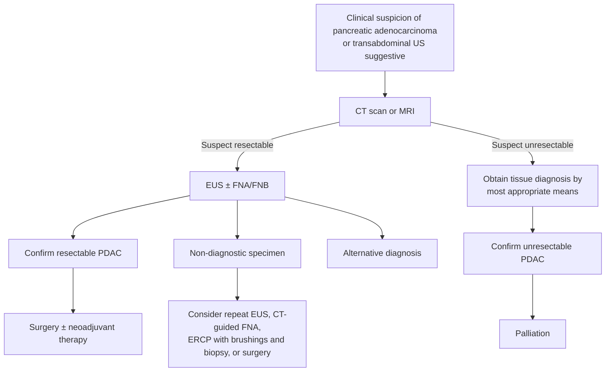

Pancreatic ductal adenocarcinoma (PDAC) is the dominant malignancy of the exocrine pancreas and the disease meant by "pancreatic cancer" in most clinical contexts. Biologically aggressive, usually diagnosed late; lifetime incidence ~1.6%, ~10% 5-year survival; ~3% of new US cancers and ~8% of cancer deaths in 2020 ([[asge-2022-pancreatic-cancer-screening]]). Stage at diagnosis dominates prognosis: 93% 10-year survival for stage 0 and 34%–39% 5-year survival for stage I, versus ~80% of patients presenting with advanced/inoperable disease.

## Contents
- [[#Assessment]]
  - [[#Establishing the Diagnosis]]
  - [[#Staging and Resectability]]
  - [[#Risk Stratification / Genetic Susceptibility]]
  - [[#High-Risk Surveillance]]
- [[#Differential Diagnosis]]
- [[#Diagnostics]]
  - [[#Diagnostic Algorithm]]
  - [[#Imaging]]
  - [[#EUS Tissue Acquisition]]
  - [[#Tumor Markers]]
- [[#Therapeutics]]
  - [[#Surgery and Systemic Therapy]]
  - [[#Endoscopic Palliation]]
  - [[#Harms of a Surveillance Program]]
- [[#See Also]]
- [[#Sources]]

## Assessment

### Establishing the Diagnosis

- **Presentation (symptomatic disease — late):** painless [[jaundice|jaundice]] (head lesions obstructing the bile duct), weight loss, epigastric/back pain, new-onset diabetes, anorexia.
  - Head lesions → cholestatic biochemistry (↑ bilirubin, ↑ alkaline phosphatase). **Body/tail lesions typically have normal liver biochemistry** because there is no biliary obstruction — so they present at a more advanced stage and are less often resectable ([[asge-2016-solid-pancreatic-neoplasia]]).
- **Screen-detected disease** (high-risk individuals) is instead found as small solid lesions, high-grade dysplasia, or grade III pancreatic intraepithelial neoplasia ([[asge-2022-pancreatic-cancer-screening]]).
- **Sequence:** cross-sectional imaging (pancreas-protocol CT or MRI/[[mri-mrcp|MRCP]]) first — it detects, localizes, and determines resectability — then endoscopy for tissue when the patient is not going directly to surgery.
- **Tissue is not always required:** if CT findings strongly suggest a resectable carcinoma and the patient is an operative candidate, direct referral for resection (e.g. pancreaticoduodenectomy) is reasonable.

### Staging and Resectability

TNM staging of pancreatic adenocarcinoma (AJCC 7th ed., as reproduced in [[asge-2016-solid-pancreatic-neoplasia|ASGE 2016]]):

| | Criterion |
|---|---|
| **Tx** | Primary tumor cannot be assessed |
| **T0** | No evidence of primary tumor |
| **Tis** | Carcinoma in situ |
| **T1** | Limited to the pancreas, **≤2 cm** greatest dimension |
| **T2** | Limited to the pancreas, **>2 cm** greatest dimension |
| **T3** | Extends beyond the pancreas **without** involvement of the celiac axis or superior mesenteric artery (SMA) |
| **T4** | Involves the **celiac axis or the SMA** — *unresectable primary tumor* |
| **NX / N0 / N1** | Nodes not assessable / no regional nodal metastasis / regional nodal metastasis |
| **M0 / M1** | No distant metastasis / distant metastasis |

| Stage | T | N | M |
|---|---|---|---|
| 0 | Tis | N0 | M0 |
| IA | T1 | N0 | M0 |
| IB | T2 | N0 | M0 |
| IIA | T3 | N0 | M0 |
| IIB | T1–T3 | N1 | M0 |
| III | T4 | Any N | M0 |
| IV | Any T | Any N | M1 |

- **The single arterial criterion that defines an unresectable primary in this system is celiac-axis or SMA involvement (T4).**
- **Gap — borderline-resectable criteria are not in an ingested source.** The degree-of-contact definitions that separate *resectable* from *borderline-resectable* from *locally advanced* (e.g. ≤180° vs >180° tumor–vessel contact with SMA/celiac axis/common hepatic artery, and SMV–portal vein contact with or without reconstructable involvement) are **not** stated in any guideline currently in `raw/`. The NCCN Pancreatic Adenocarcinoma guideline would be needed; do not infer them from this table. See also the venous-invasion caveat: CT stages resectability by detecting tumor extension, liver metastases, and **invasion of vascular structures**, but ASGE 2016 gives no numeric contact thresholds.
- **Version caveat:** the table above is AJCC **7th** edition. Whether and how the 8th edition changed pancreatic T definitions is not documented in any ingested source.

### Risk Stratification / Genetic Susceptibility

Germline pathogenic variants account for a meaningful share of PDAC — [[brca-pathogenic-variants|BRCA1/2]] variants are present in up to 7% of all pancreatic cancer patients. Conditions conferring increased risk:

- **[[brca-pathogenic-variants|BRCA2]]** — pooled RR ~5.1; lifetime risk to age 80 ~5.2%–7.4%.
- **[[brca-pathogenic-variants|BRCA1]]** — pooled RR ~1.9; lifetime risk ~3.5%–3.8% (lower than BRCA2; may not clearly cross the 5% high-risk threshold).
- **PALB2** pathogenic variant.
- **[[familial-pancreatic-cancer|Familial pancreatic cancer (FPC)]]** — kindreds with ≥2 first-degree relatives with pancreatic cancer and no known hereditary cancer syndrome; thought to be autosomal-dominant inheritance of a rare allele.
- **[[fammm-syndrome|Familial atypical multiple mole melanoma (FAMMM)]]** — high relative risk.
- **[[peutz-jeghers-syndrome|Peutz-Jeghers syndrome]]** — among the highest relative risks.
- **ATM** heterozygotes with a first- or second-degree relative with pancreatic cancer.
- **[[lynch-syndrome|Lynch syndrome]]** with a first- or second-degree relative with pancreatic cancer.
- **[[hereditary-pancreatitis|Autosomal-dominant hereditary pancreatitis]]**.

*The list above is ordinal, not quantitative: the **relative risk of pancreatic cancer for each syndrome** (from Peutz-Jeghers at the top down to ATM), paired with its screening start age, is tabulated on [[pancreatic-cancer-screening]] from [[acg-2015-hereditary-gi-cancer]] — consult it before deciding whether a given carrier crosses the threshold to screen.*

Per [[asge-2022-pancreatic-cancer-screening|ASGE 2022]], BRCA1/2 carriers should be considered for screening **regardless of family history** of pancreatic cancer, because ~2 of 3 BRCA-associated cancers would otherwise be missed. A family history of pancreatic cancer *not* meeting FPC criteria confers ~2-fold increased risk but is generally not an indication for screening on its own; diabetes, older age, smoking, [[obesity]], and [[chronic-pancreatitis|chronic pancreatitis]] raise risk to a lesser degree than the genetic conditions above.

### High-Risk Surveillance

Full ASGE 2022 framework lives on [[pancreatic-cancer-screening|high-risk pancreatic cancer surveillance]]. In brief: screening is suggested for individuals at increased genetic risk; modality is [[endoscopic-ultrasound|EUS]], MRI/MRCP, or EUS alternating with MRI; interval is **annual**; starting age varies by condition (BRCA1/2, PALB2, FPC, ATM, Lynch → age 50 or 10 years before the youngest affected relative; FAMMM → 40; Peutz-Jeghers → 35; [[hereditary-pancreatitis|hereditary pancreatitis]] → 40).

## Differential Diagnosis

*Workup: see [[jaundice]].*

- Other solid pancreatic masses: [[gastroenteropancreatic-neuroendocrine-tumors|neuroendocrine tumor]], metastasis, lymphoma, solid pseudopapillary neoplasm.
- Mass-forming or autoimmune (IgG4-related) [[chronic-pancreatitis|chronic pancreatitis]] — a correct pathologic diagnosis of lymphoma or autoimmune pancreatitis mimicking PDAC may preclude surgery.
- Cystic neoplasms with a solid component — see [[pancreatic-cysts|pancreatic cysts]] (IPMN, mucinous cystic neoplasm).
- [[cholangiocarcinoma|Distal cholangiocarcinoma]] and ampullary carcinoma (overlapping obstructive presentation).

## Diagnostics

### Diagnostic Algorithm

*Algorithm — evaluation and management of suspected pancreatic adenocarcinoma, recreated from Figure 1. ([[asge-2016-solid-pancreatic-neoplasia]])*

### Imaging

- **CT (pancreas protocol)** — most widely available; multidetector CT with fast contrast injection and precisely timed acquisition. Stages and assesses resectability by detecting tumor extension, liver metastases, and vascular invasion. **Insensitive for lesions <2 cm.**
- **MRI / [[mri-mrcp|MRCP]]** — comparable to CT; may be superior for tumor detection and better characterizes small hepatic lesions.
- **MRI/MRCP for surveillance** — contrast-enhanced, ≥1.5-T magnet with phased-array coils (3-T may better detect small lesions); preferred when avoiding invasive testing or anesthesia risk.
- **Percutaneous (CT-guided) biopsy** — sensitivity up to 95%, but **needle-track seeding is reported** and peritoneal carcinomatosis was significantly more common after percutaneous than EUS-guided sampling (16.3% vs 2.2%, *P* < .025) — hence EUS is preferred for tissue.

### EUS Tissue Acquisition

[[endoscopic-ultrasound|EUS]] is the most sensitive modality for small solid lesions (in surveillance, almost all solid cancers were detected only by EUS, not MRI); a **linear-array** echoendoscope outperforms a radial one for detecting pancreatic lesions (82% vs 67%). ASGE 2024 recommendations for EUS-guided tissue acquisition (EUS-TA):

| Recommendation | Strength / evidence |
|---|---|
| **FNB needles over FNA needles** | Strong / moderate |
| **22-gauge over 25-gauge** needles | Conditional / moderate |
| **Fork-tip or Franseen** FNB needles over alternative designs | Strong / moderate |
| **Against routine ROSE** (rapid on-site cytopathology evaluation) | Conditional / low |

- **Technique:** linear echoendoscope; color Doppler to avoid interposed vessels; fanning technique; suction with slow stylet withdrawal and/or a 5–20 mL syringe; keep the needle tip echoendoscopically visible; express tissue with an air flush (reinsert stylet if that fails).
- **Passes:** FNB → **2–4 passes**, sample directly into a **10% formalin** jar; FNA → **4–7 passes**, into **CytoLyt** (or use ROSE). Macroscopic on-site evaluation can guide pass number.
- **Switch to 25-gauge** if the 22-gauge needle cannot be advanced into the lesion, or when manipulability will be limited (e.g. excessive endoscope torquing).
- **When ROSE is still worth considering:** prior nondiagnostic EUS; lesion unclear or obscured by artifact (stent, pancreatitis); a preliminary diagnosis would drive an immediate decision (biliary stent selection, celiac plexus neurolysis, management of gastric outlet obstruction).

### Tumor Markers

- **CA 19-9** — the only FDA-approved biomarker in routine PDAC management, used for **prognosis and disease burden (recurrence/progression)**, *not* for early detection or diagnosis: elevated in the majority of pancreatic cancer patients but with both false positives and false negatives. Falsely low in Lewis-antigen-negative individuals.

## Therapeutics

### Surgery and Systemic Therapy

- **Surgical resection** (Whipple/pancreaticoduodenectomy, distal pancreatectomy) is the only curative option, reserved for resectable/borderline-resectable disease — making early/screen-detected diagnosis the principal lever on survival (60% of screen-detected cancers were resectable/borderline-resectable vs ~20% of symptom-detected).
- **Chemotherapy** — FOLFIRINOX and gemcitabine-based regimens (neoadjuvant, adjuvant, palliative). Homologous-recombination-deficient (BRCA1/2, PALB2) tumors are sensitive to platinum-based regimens and PARP inhibitors (e.g. maintenance **olaparib** in germline BRCA-mutated metastatic disease). *Doses and cycle intervals are not given in any ingested source.*

### Endoscopic Palliation

**Biliary obstruction.** Endoscopic stenting is the preferred modality for symptomatic malignant biliary (and/or gastroduodenal) obstruction in unresectable PDAC. The general drainage algorithm lives on [[biliary-stricture]]; the mass-specific stent-choice rules ([[asge-2024-solid-pancreatic-masses|ASGE 2024]]) are:

| Situation | Stent |
|---|---|
| Distal malignant biliary obstruction, [[ercp\|ERCP]] planned | **SEMS over plastic** (conditional/low) |
| SEMS being placed | **Covered over uncovered** (conditional/low) |
| Pancreatic mass with **unconfirmed** malignancy | **Against uncovered SEMS** (strong/low) |
| Simultaneous EUS-TA + high suspicion of malignancy | Covered SEMS |
| No simultaneous EUS-TA | ERCP with tissue acquisition + plastic stent |
| Liver metastases or expected survival **<3 mo** | Plastic |
| Surgical resection planned **within 3 mo** | Plastic |

- Technique: consider biliary sphincterotomy before stent insertion in a native papilla; use a **10-mm** fully or partially covered SEMS; shortest length that bridges the stricture while remaining **2 cm below the hepatic hilum**; with the gallbladder in situ, terminate the proximal end **below the cystic duct take-off**.
- **Avoid preoperative [[ercp|ERCP]]** for resectable PDAC with obstructive jaundice in the absence of cholangitis unless operative resection will be substantially delayed — preoperative biliary drainage increases perioperative complications ([[asge-2016-solid-pancreatic-neoplasia]]).

**Pain — celiac plexus neurolysis (CPN).** In unresectable pancreatic cancer with abdominal pain, ASGE 2024 suggests CPN as an **adjunct to** medical analgesic therapy (conditional/low):

- **When:** pain refractory to medical therapy, or opioid adverse effects not well tolerated.
- **How:** by EUS or percutaneously. If EUS — use a **≥22-gauge FNA needle** (not the same needle used for EUS-TA); central or bilateral injection of **10–20 mL of 99% alcohol**; give **1 L IV normal saline** periprocedurally; monitor **~2 hours** post-procedure with vital signs and orthostatic parameters.

**Other.** **EUS-guided fiducial placement** when image-guided radiotherapy is planned ([[asge-2016-solid-pancreatic-neoplasia]]).

### Harms of a Surveillance Program

Weigh before enrolling a high-risk individual: across screened cohorts, low-yield pancreatic surgery occurred in **2.8% overall but 46.6% of those operated**, with a **~19.9% perioperative adverse-event rate** among operated patients ([[asge-2022-pancreatic-cancer-screening]]). Counsel on benefits and harms before enrollment.

## See Also

[[pancreatic-cancer-screening]], [[endoscopic-ultrasound]], [[ercp]], [[mri-mrcp]], [[jaundice]], [[biliary-stricture]], [[pancreatic-cysts]], [[chronic-pancreatitis]], [[cholangiocarcinoma]], [[gastroenteropancreatic-neuroendocrine-tumors]], [[brca-pathogenic-variants]], [[familial-pancreatic-cancer]], [[fammm-syndrome]], [[peutz-jeghers-syndrome]], [[lynch-syndrome]], [[hereditary-pancreatitis]], [[obesity]]

---

## Sources

1. [[asge-2022-pancreatic-cancer-screening|ASGE Guideline on Screening for Pancreatic Cancer in Individuals with Genetic Susceptibility: Summary and Recommendations (2022)]]
2. [[asge-2024-solid-pancreatic-masses|ASGE Guideline: Role of Endoscopy in Solid Pancreatic Masses (2024)]]
3. [[asge-2016-solid-pancreatic-neoplasia|ASGE Guideline: The Role of Endoscopy in the Diagnosis and the Management of Solid Pancreatic Neoplasia (2016)]]
4. [[acg-2018-pancreatic-cysts|ACG 2018: Diagnosis and Management of Pancreatic Cysts]]
5. [[acg-2015-hereditary-gi-cancer|ACG 2015: Genetic Testing and Management of Hereditary Gastrointestinal Cancer Syndromes]]
