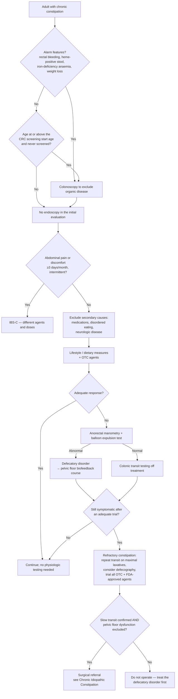

## Contents
- [[#Definition / Scope]]
  - [[#What counts as abnormal]]
  - [[#The three physiologic subtypes]]
- [[#Differential Diagnosis]]
  - [[#Secondary causes to exclude before labelling it primary]]
- [[#Diagnostic Algorithm]]
- [[#Key Tests]]
  - [[#Which test answers which question]]
  - [[#Test conditions that change the answer]]
- [[#Red Flags / Alarm Features]]
- [[#See Also]]
- [[#Sources]]

---

## Definition / Scope

The adult presenting with **infrequent and/or unsatisfactory defecation** — how to separate primary (gut–brain) constipation from a secondary cause, and then which of the three physiologic subtypes is driving it. Not a defined diagnosis; management endpoints live on [[chronic-idiopathic-constipation]] and [[defecation-disorders]].

- **Prevalence:** chronic constipation (CC) affects **8%–12% of the US population**; **3 million patients per year** seek clinical evaluation [[aga-2026-refractory-constipation]]
- **Nomenclature:** *chronic constipation*, *chronic idiopathic constipation*, and *functional constipation* are **interchangeable terms** [[aga-2026-refractory-constipation]]. [[rome-v-2026-dgbi|Rome V]] (2026) formalised this — "chronic constipation" (bowel-DGBI category **C2**) replaced Rome IV's "functional constipation", dropping the word *functional*
- **Separate Rome V entities that are not C2:** **C6 opioid-induced constipation**; **F3 dyssynergic defecation** (an anorectal disorder). Rome V **removed the umbrella category "functional defecation disorders"** as too broad — it swept in structural conditions such as [[rectal-prolapse|rectal prolapse]] and perineal descent [[rome-v-2026-dgbi]]
- **Refractory constipation (RC)** = infrequent and/or unsatisfactory bowel habits, with or without abdominal pain, **despite an adequate trial of lifestyle, dietary, medical, and (when indicated) pelvic floor [[biofeedback-therapy|biofeedback]] therapy**, in an adult who satisfies criteria for CC or constipation-predominant IBS (BPA 1) [[aga-2026-refractory-constipation]]
  - **The label needs one of four operational criteria, not just the narrative above.** International consensus definitions quoted by [[aga-2026-refractory-constipation]] require "infrequent and/or unsatisfactory bowel habits" **plus any one** of:
    1. Inadequate number of bowel movements most of the time, **and complete bowel movements on fewer than 3 days/week**
    2. **Straining on most occasions**, or worsening straining
    3. **No improvement in stool consistency on current therapy, and Bristol stool scale score <3**
    4. Insufficient improvement of another sign or symptom of CC on current treatment
  - This matters because RC is what triggers the whole downstream arm — repeat transit on a maximal laxative regimen, defecography, off-label agents, and the surgical conversation below

> **Gap — the itemised Rome criteria are not in an ingested source.** The Rome V document in `raw/` is the process/overview paper: it prints the **taxonomy** and the **changes** from Rome IV, but not the numbered symptom items and their ≥25%-of-defecations thresholds. The symptom list currently carried on [[chronic-idiopathic-constipation]] is not traceable to an ingested file. The full *Rome V Criteria* volume (or the Rome V bowel-disorders chapter) would be needed before those items can be asserted here.

### What counts as abnormal

Most patients hold misconceptions about normal bowel habit, so the normal range is decision content in its own right [[aga-2026-refractory-constipation]]:

| Parameter | Normal range in the US population |
|---|---|
| Stool frequency | **~95%** of individuals fall between **3 bowel movements/day and 3 bowel movements/week** |
| Stool consistency | **90%** have an average **Bristol 3–5 (men)** and **Bristol 2–6 (women)** |

> ⚠ **Decision gap — the Bristol Stool Form Scale itself is corpus-blocked.** The consistency row above (and the Bristol <3 entry criterion used by [[aga-2026-refractory-constipation]]) can only be applied if you can map a stool to a Bristol type, and **no ingested source defines the 7 types** — the corpus uses the scale without printing it (same block flagged on [[chronic-diarrhea]], where "Bristol 6–7" anchors the definition of diarrhea). Ingest the primary Bristol/Lewis-Heaton scale paper to close it; do not reconstruct the types from memory.

### The three physiologic subtypes

| Subtype | What is wrong | How it is proven | Where it is managed |
|---|---|---|---|
| **Normal-transit** | Neither transit nor evacuation is measurably impaired | Normal colonic transit, normal [[anorectal-manometry\|ARM]] + balloon expulsion test (BET) | [[chronic-idiopathic-constipation]] |
| **Slow-transit** | Delayed colonic transit ("colonic inertia") | **Colonic transit testing off treatment**, ideally repeated **on a maximal laxative regimen** to document refractoriness [[aga-2026-refractory-constipation]] | [[chronic-idiopathic-constipation]] |
| **Defecatory disorder** | Inadequate rectal propulsive forces and/or impaired relaxation or paradoxical contraction of the external anal sphincter and/or puborectalis | ARM + BET (± defecography) — see [[defecation-disorders]] | [[biofeedback-therapy\|Biofeedback]], not secretagogues |

**Prevalence of the defecatory arm:** approximately **37%** of CC patients who undergo pelvic floor testing have dyssynergic defecation [[aga-2026-refractory-constipation]] — which is why ARM + BET sits early in the algorithm rather than at the end.

---

## Differential Diagnosis

**The first fork is IBS-C vs chronic constipation, and Rome V moved it.** Abdominal pain *or discomfort* must be present **≥3 days per month in the last 3 months** to qualify as [[irritable-bowel-syndrome|IBS]] — Rome IV required **≥1 day per week** over the previous 3 months. Rome V also **re-included "abdominal discomfort"** (removed in Rome IV) and added that the pain/discomfort **must not be continuous** (continuous pain points to a centrally mediated abdominal pain syndrome) [[rome-v-2026-dgbi]]. Net effect: **more patients now sort into IBS-C and fewer into chronic constipation** than under Rome IV — the pharmacologic recommendations differ by dose and agent, so the label matters.

| Alternative | Discriminating feature |
|---|---|
| [[irritable-bowel-syndrome\|IBS-C]] | Abdominal pain/discomfort ≥3 days/month, intermittent, related to defecation |
| Opioid-induced constipation (Rome V **C6**) | Clear temporal link to opioid initiation/escalation |
| [[defecation-disorders\|Defecatory disorder]] | Outlet symptoms; abnormal ARM/BET/imaging |
| [[colorectal-cancer\|Colorectal cancer]] / benign colonic stricture | Alarm features (below); [[colonoscopy]] indicated |
| [[colon-ischemia\|Ischaemic]], post-surgical, or [[inflammatory-bowel-disease\|IBD]]-related stricture | Endoscopically dilatable; identified at colonoscopy [[asge-2014-constipation]] |
| [[rectal-prolapse\|Rectal prolapse]] / [[rectal-prolapse#Solitary Rectal Ulcer Syndrome\|solitary rectal ulcer syndrome]] | Solitary rectal ulcer at endoscopy suggests underlying prolapse [[asge-2014-constipation]] |
| Hirschsprung disease | Suspected cases need [[anorectal-manometry\|ARM]] **plus deep biopsy**, not colonoscopy alone [[asge-2014-constipation]] |
| Neurogenic bowel dysfunction | Known neurologic disease; transanal irrigation is a recognised adjunct [[aga-2026-refractory-constipation]] |

### Secondary causes to exclude before labelling it primary

Patients should be **thoroughly evaluated for secondary causes** before being called refractory [[aga-2026-refractory-constipation]]:

- **Medications** — the most common iatrogenic cause. Opioid-induced or opioid-exacerbated constipation; **anticholinergic agents including antipsychotics**; **iron supplements**. In many patients these *exacerbate* pre-existing constipation rather than cause it
- **Disordered eating**
- **Comorbid neurological disease** (including autonomic dysfunction — see the off-label pyridostigmine option on [[chronic-idiopathic-constipation]])
- **Metabolic/organic conditions excluded from the CIC evidence base** — hypothyroidism and [[celiac-disease|celiac disease]] were explicit exclusions when the CIC pharmacologic recommendations were derived, as were opioid-induced constipation and IBS-C [[aga-acg-2023-constipation]]

---

## Diagnostic Algorithm

*The ACG 2021 evaluation figure for suspected defecatory disorder is reproduced on [[defecation-disorders]]; it is not duplicated here.*

---

## Key Tests

### Which test answers which question

| Test | Question it answers | When to order |
|---|---|---|
| **[[colonoscopy]]** | Is there organic colorectal disease? | **Not** part of the initial evaluation absent alarm features or suspicion of organic GI disease *(ASGE 2014, moderate quality)*. Order it for rectal bleeding, heme-positive stool, iron-deficiency anaemia, or weight loss; **before surgical therapy** for chronic constipation; or for age-appropriate [[colorectal-cancer-screening\|CRC screening]] not yet done [[asge-2014-constipation]] |
| **[[anorectal-manometry\|ARM]] + balloon expulsion test (BET)** | Is this a defecatory disorder? | **Most patients with CC** should have ARM + BET (and complete a biofeedback course when indicated) **before being labelled refractory** [[aga-2026-refractory-constipation]]. ACG 2021 requires **both** tests to diagnose a defecatory disorder; **Rome V accepts any 1 of 3** (balloon expulsion, manometry, or imaging) and has **dropped EMG** — see the version table on [[defecation-disorders]] |
| **Colonic transit testing** (radiopaque markers or wireless motility capsule) | Is transit slow, and is it slow *despite* treatment? | After ARM + BET. Wireless motility capsules additionally quantify **regional** gut transit. Order it **off treatment** to document slow transit and **ideally again on a maximal laxative regimen** to document refractoriness [[aga-2026-refractory-constipation]] |
| **Defecography (barium or MR)** | Is there a structural cause, or does imaging resolve a discordant ARM/BET? | When clinical features suggest a structural abnormality, or **ARM and BET are inconclusive/discordant**, or pelvic organ prolapse is clinically suspected [[acg-2021-anorectal-disorders]], [[aga-2026-refractory-constipation]] |
| **Gastric emptying / regional gut transit** | Is there upper-gut dysmotility that predicts a poor surgical outcome? | **Preoperatively.** Recurrent constipation and poor quality of life after colectomy were more common in patients with pre-existing upper GI dysmotility [[aga-2026-refractory-constipation]] |

**Defecography — modality choice** [[aga-2026-refractory-constipation]]:

| | Barium defecography | MR defecography |
|---|---|---|
| Position | **Seated** — preferable when the question is **rectal evacuation** | Supine |
| Radiation | Yes | **None** |
| Strengths | Evacuation dynamics | More precise pelvic organ prolapse and pelvic floor motion; identifies **>90%** of large rectocele, enterocele and/or peritoneocele in patients with clinical DD features and a **normal BET** |
| Limits | Radiation exposure | Less widely available, more expensive |

Findings identified on defecography: inadequate or excessive widening of the **anorectal angle** and/or **perineal descent** during defecation; internal intussusception; solitary rectal ulcer; rectocele; rectal prolapse; enterocele; bladder and uterovaginal prolapse. Anatomic findings are **more likely to be clinically relevant** when the ARM is normal with impaired contrast evacuation, or when the **rectocele is >4 cm** [[aga-2026-refractory-constipation]].

### Test conditions that change the answer

- **Colonic transit:** stop **laxatives for ≥7 days** and **medications that delay colon transit for ≥2 weeks** before testing. Day-to-day reproducibility is poor in dyssynergic defecation and colonic inertia, so **repeat testing may be necessary** — in some patients while taking laxatives [[aga-2026-refractory-constipation]]
- **Each abnormal anorectal test finding is highly specific** for a defecatory disorder — a lower rectoanal gradient on manometry, a prolonged BET, and reduced evacuation on defecography. Defecography is most useful in the patient with an **abnormal gradient on ARM and a normal BET** [[aga-2026-refractory-constipation]]
- **Normalisation of the BET after biofeedback** suggests the defecatory disorder has resolved [[aga-2026-refractory-constipation]]
- **Bowel preparation:** chronic constipation is an independent risk factor for inadequate prep — use a more aggressive cleansing regimen [[asge-2014-constipation]]

---

## Red Flags / Alarm Features

**Colonoscopy to exclude organic disease** *(ASGE 2014, high quality)* — any of [[asge-2014-constipation]]:

- **Rectal bleeding**
- **Heme-positive stool**
- **Iron-deficiency anaemia** — see [[iron-deficiency-anemia]]
- **Weight loss**
- …and in every patient **prior to surgical therapy** for chronic constipation

**Screening-driven, not alarm-driven:** ASGE 2014 recommends colonoscopy for patients **>50 years** presenting with constipation who have not previously had CRC screening *(high quality)* [[asge-2014-constipation]]. **[[acg-2021-crc-screening|ACG 2021]] subsequently moved average-risk screening initiation to age 45** *(conditional, very low certainty)* — same tier, newer publication, so use **45** for the screening question; the alarm-feature indications above are unchanged.

**Therapeutic indications for colonoscopy** *(ASGE 2014, moderate quality)*: dilation of benign colonic strictures, and creation of a percutaneous cecostomy, when clinically appropriate and feasible. **There is no role for endoscopy in stool disimpaction** [[asge-2014-constipation]].

**Do not proceed to surgery** until slow-transit constipation is confirmed **and** pelvic floor dysfunction is excluded — only patients with no ongoing defecatory disorder should be offered colectomy with ileorectal anastomosis [[aga-2026-refractory-constipation]].

---

## See Also

[[chronic-idiopathic-constipation]], [[defecation-disorders]], [[irritable-bowel-syndrome]], [[fecal-incontinence]], [[proctalgia-syndromes]], [[anorectal-manometry]], [[biofeedback-therapy]], [[sacral-nerve-stimulation]], [[colonoscopy]], [[colorectal-cancer]], [[rectal-prolapse]], [[acute-colonic-pseudo-obstruction]], [[disorders-of-gut-brain-interaction]], [[ostomy-management]]

---

## Sources

1. [[aga-2026-refractory-constipation|AGA Clinical Practice Update on Evaluation and Management of Refractory Constipation: Expert Review]]
2. [[aga-acg-2023-constipation|AGA-ACG 2023 Pharmacologic Management of Chronic Idiopathic Constipation]]
3. [[acg-2021-anorectal-disorders|ACG 2021 Clinical Guidelines: Management of Benign Anorectal Disorders]]
4. [[asge-2014-constipation|ASGE 2014: The Role of Endoscopy in the Management of Constipation]]
5. [[rome-v-2026-dgbi|Disorders of Gut–Brain Interaction and the Rome V Process]]
6. [[acg-2021-crc-screening|ACG 2021 Colorectal Cancer Screening Guidelines]]
