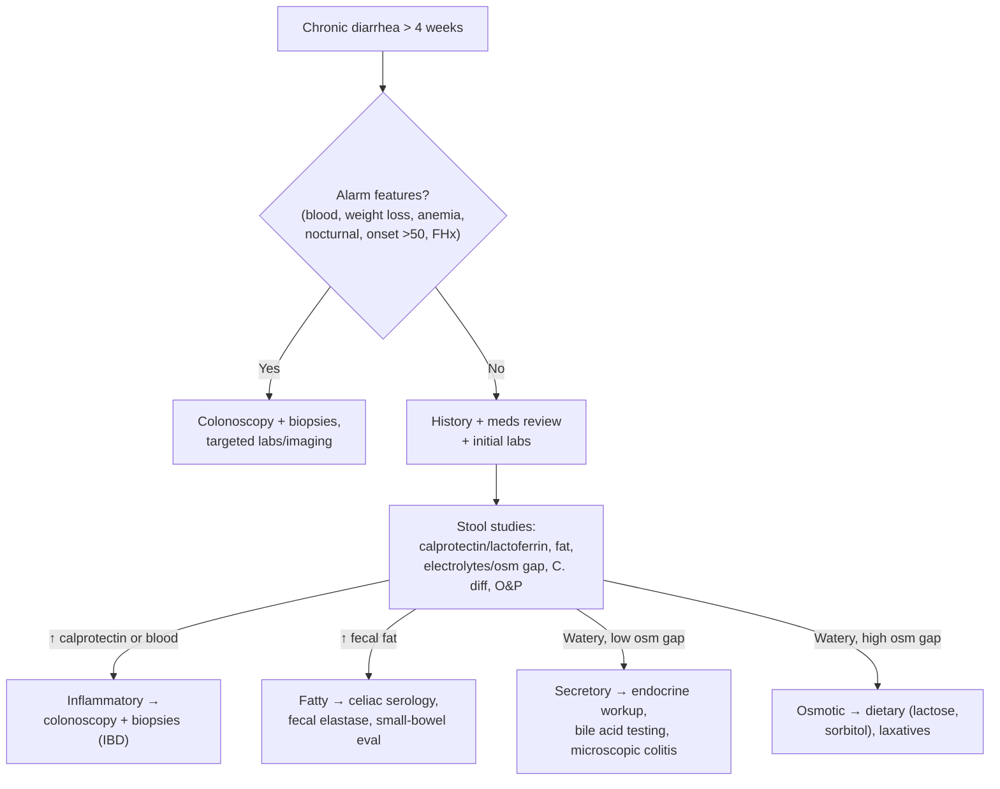

## Definition / Scope

Chronic diarrhea is decreased stool consistency (loose or watery) lasting **> 4 weeks**. This duration threshold distinguishes it from [[acute-diarrhea]] (<14 days) and persistent diarrhea (14–30 days), and shifts the differential away from infection toward non-infectious causes. Diarrhea is defined by **stool consistency** (Bristol 6–7), not frequency alone; it must be distinguished from **pseudodiarrhea** (frequent small volumes with urgency, as in proctitis or [[irritable-bowel-syndrome|IBS]]) and **[[fecal-incontinence|fecal incontinence]]**.

The most useful framework is to classify by **stool character** into watery, inflammatory, and fatty, which maps onto the underlying mechanism and the workup.

---

## Mechanistic Classification

| Type | Mechanism | Stool osmotic gap | Fasting response |
|---|---|---|---|
| **Secretory** | Net ion/fluid secretion | **Low** (<50 mOsm/kg) | Persists with fasting |
| **Osmotic** | Unabsorbed osmotically active solute | **High** (>75 mOsm/kg) | Improves with fasting |
| **Inflammatory** | Mucosal injury/exudation | Variable; blood/leukocytes | Persists |
| **Fatty (malabsorptive)** | Fat maldigestion/malabsorption | High; ↑ fecal fat | Improves with fasting |
| **Dysmotility** | Altered transit (e.g. IBS, hyperthyroidism) | Variable | Variable |

**Stool osmotic gap** = 290 − 2 × (stool Na⁺ + stool K⁺).

---

## Differential Diagnosis

### Watery — Secretory

- **[[microscopic-colitis|Microscopic colitis]]** ([[microscopic-colitis]]) — collagenous and lymphocytic; older women; normal-appearing [[colonoscopy]] requiring random biopsies; NSAID/PPI/SSRI association
- **[[bile-acid-diarrhea|Bile acid diarrhea]]** ([[bile-acid-diarrhea]]) — post-cholecystectomy, ileal disease/resection ([[crohns-disease]]), or idiopathic (overlaps IBS-D)
- **[[irritable-bowel-syndrome|IBS-D]]** — a positive Rome IV/V diagnosis, not pure exclusion; most common overall
- Endocrine — hyperthyroidism, **carcinoid syndrome**, VIPoma, gastrinoma ([[peptic-ulcer-disease|Zollinger-Ellison]]), Addison's disease, medullary thyroid carcinoma
- Drugs/toxins — chronic laxative use, metformin, colchicine, SSRIs, alcohol, PPIs
- **[[small-intestinal-bacterial-overgrowth|SIBO]]** — bloating, malabsorption; post-surgical/dysmotility risk factors
- Surgical/anatomic — post-cholecystectomy, ileal resection, short bowel

### Watery — Osmotic

- **Carbohydrate malabsorption** — lactose intolerance (most common), fructose, sorbitol/mannitol (sugar-free gum/candy)
- **Osmotic laxatives** — magnesium-, phosphate-, sulfate-containing agents; PEG
- Factitious diarrhea (surreptitious laxative use)

### Inflammatory

- **[[inflammatory-bowel-disease|Inflammatory bowel disease]]** — [[crohns-disease]], [[ulcerative-colitis]] (bloody, urgency, nocturnal, systemic features)
- **Microscopic colitis** ([[microscopic-colitis]]) — watery, *non-bloody*, but histologically inflammatory
- Chronic infections — [[clostridioides-difficile|C. difficile]], [[giardiasis|Giardia]], [[cryptosporidiosis|Cryptosporidium]], [[entamoeba-histolytica-infection|Entamoeba]], CMV (immunocompromised)
- Ischemic colitis ([[colon-ischemia]]); radiation enteritis/colitis
- **[[colorectal-cancer]]** / colonic neoplasia

### Fatty (Malabsorptive / Steatorrhea)

- **[[celiac-disease]]** — small-bowel villous atrophy; screen with anti-tTG IgA
- **Exocrine pancreatic insufficiency** — [[chronic-pancreatitis]], [[pancreatic-cancer|pancreatic cancer]]; low fecal elastase
- **[[small-intestinal-bacterial-overgrowth|SIBO]]**, Whipple's disease, tropical sprue
- Short bowel syndrome, mesenteric ischemia, bile acid deficiency (cholestasis)

---

## Diagnostic Algorithm

1. **Confirm true diarrhea** and exclude fecal incontinence, pseudodiarrhea, and overflow from constipation.
2. **History & medication review** — onset, travel, surgery, family history, dietary carbohydrates/sugar alcohols, laxatives, recent antibiotics, systemic symptoms; **fasting trial** (osmotic improves, secretory persists).
3. **Initial labs** — CBC, CMP, TSH, CRP, [[celiac-disease|anti-tTG IgA + total IgA]], and (with risk factors) HIV.
4. **Stool studies** — **fecal calprotectin or lactoferrin** (inflammatory vs. functional), fecal occult blood, [[clostridioides-difficile|C. difficile]] testing, stool electrolytes/osmotic gap, qualitative/quantitative **fecal fat**, ova & parasites or [[giardiasis|Giardia]]/[[cryptosporidiosis|Cryptosporidium]] antigen.
5. **Route by category:**
   - **Inflammatory** (↑ calprotectin, blood) → [[colonoscopy]] with biopsies for IBD; biopsy even if mucosa normal to catch [[microscopic-colitis]].
   - **Fatty** (↑ fecal fat) → confirm [[celiac-disease|celiac]], check **fecal elastase** for [[chronic-pancreatitis|EPI]], small-bowel imaging/biopsy, consider [[small-intestinal-bacterial-overgrowth|SIBO breath testing]].
   - **Watery secretory** → empiric/diagnostic **bile acid** sequestrant trial ([[bile-acid-diarrhea]]), microscopic colitis biopsies, endocrine workup (chromogranin A, gastrin, VIP, urinary 5-HIAA) if features suggest.
   - **Watery osmotic** → dietary elimination (lactose, fructose, sorbitol), screen for surreptitious laxatives (stool magnesium/phosphate).
6. **If [[irritable-bowel-syndrome|IBS-D]]** criteria met with normal alarm screen, calprotectin, and celiac serology → make a **positive diagnosis** rather than exhaustive testing.

---

## Key Tests

- **Fecal calprotectin / lactoferrin** — separates inflammatory (IBD) from functional ([[irritable-bowel-syndrome|IBS]]); normal calprotectin has high NPV for IBD.
- **Stool electrolytes & osmotic gap** — secretory (<50) vs. osmotic (>75 mOsm/kg).
- **Fecal fat** (qualitative Sudan stain / quantitative 72-h) — confirms steatorrhea/malabsorption.
- **Fecal elastase-1** — low in exocrine pancreatic insufficiency ([[chronic-pancreatitis]]).
- **[[celiac-disease|Celiac serology]]** — anti-tTG IgA with total IgA (avoid false negatives in IgA deficiency).
- **[[clostridioides-difficile|C. difficile]] testing, stool O&P / Giardia & Cryptosporidium antigen** — chronic infectious causes.
- **Bile acid testing** — SeHCAT retention, serum C4 or FGF19; or empiric sequestrant trial ([[bile-acid-diarrhea]]).
- **Endocrine panel** — TSH; chromogranin A, gastrin, VIP, calcitonin, urinary 5-HIAA when a neuroendocrine secretory cause is suspected.
- **[[colonoscopy]] with random biopsies** — IBD and **[[microscopic-colitis]]** (biopsy mandatory even if mucosa appears normal).
- **SIBO breath testing** ([[small-intestinal-bacterial-overgrowth]]) and small-bowel imaging (CTE/MRE) in malabsorptive/post-surgical patients.

---

## Role of Endoscopy (ASGE 2010)

*Endoscopy is reserved for chronic, unexplained, or treatment-refractory diarrhea — stool/labs come first. ([[asge-2010-diarrhea]])*

- **Colonoscopy + random biopsies of BOTH right and left colon** — required even when mucosa is normal; microscopic colitis is patchy and left-sided-only sampling misses it. Sigmoidoscopy is an alternative but may miss right-sided organic disease.
- **Intubate the terminal ileum** during colonoscopy; routine biopsy of normal-appearing TI is low yield (0–4.2%).
- **EGD + small-bowel biopsy** when colonoscopy is inconclusive, malabsorption is suspected, or [[celiac-disease|celiac]] serology is positive; obtain **≥4 duodenal biopsies** for suspected celiac (even if endoscopically normal).
- **Capsule endoscopy and enteroscopy are NOT recommended** for routine chronic-diarrhea evaluation (modest yield, no tissue, retention risk); reserve enteroscopy for nondiagnostic small-bowel disease.
- Diagnostic yield of colonoscopy in chronic diarrhea ~7–32%; IBD and [[microscopic-colitis]] most common. Note sodium-phosphate preps and NSAIDs can produce mucosal/terminal-ileal changes mimicking IBD.

---

## Red Flags / Alarm Features

Prompt structural evaluation (colonoscopy ± cross-sectional imaging) and lower the threshold for specialist referral:

- **Blood in stool** or positive fecal occult blood
- **Unintentional weight loss**
- **Iron deficiency anemia**
- **Nocturnal diarrhea** (organic, not functional)
- **Onset after age 50** (or new change in bowel habits)
- **Family history of IBD, [[celiac-disease|celiac disease]], or [[colorectal-cancer|colorectal cancer]]**
- **Recent antibiotics or hospitalization** ([[clostridioides-difficile|C. difficile]])
- **Severe dehydration or large-volume secretory diarrhea** (consider neuroendocrine tumor)
- **Immunocompromise** (broaden infectious differential)

---

## See Also

[[acute-diarrhea]], [[irritable-bowel-syndrome]], [[celiac-disease]], [[crohns-disease]], [[ulcerative-colitis]], [[microscopic-colitis]], [[bile-acid-diarrhea]], [[clostridioides-difficile]], [[small-intestinal-bacterial-overgrowth]], [[chronic-pancreatitis]], [[giardiasis]], [[cryptosporidiosis]], [[colon-ischemia]], [[colorectal-cancer]], [[colonoscopy]], [[disorders-of-gut-brain-interaction]]

---

## Sources

1. [[asge-2010-diarrhea|ASGE Guideline: The Role of Endoscopy in the Management of Patients With Diarrhea (2010)]]
