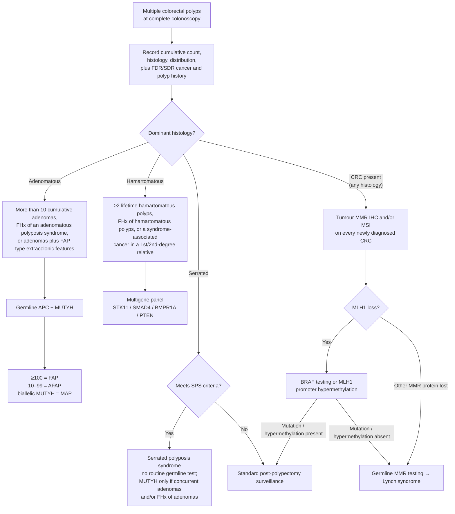

## Contents
- [[#Definition / Scope]]
- [[#Differential Diagnosis]]
  - [[#Adenomatous phenotype]]
  - [[#Hamartomatous phenotype]]
  - [[#Serrated phenotype]]
  - [[#Not a polyposis]]
- [[#Diagnostic Algorithm]]
  - [[#Thresholds that trigger genetic evaluation]]
  - [[#Serrated polyposis syndrome — clinical criteria]]
- [[#Key Tests]]
  - [[#Which genes go on the panel]]
- [[#Red Flags / Alarm Features]]
- [[#See Also]]
- [[#Sources]]

---

## Definition / Scope

The patient found to have **multiple colorectal polyps** — how to sort that phenotype into a syndrome, or out of one. Not a defined diagnosis; each endpoint below has its own disease script.

- Approximately **5–10% of cancers** are attributable to a hereditary cancer predisposition syndrome [[acg-2015-hereditary-gi-cancer]]
- The phenotype is defined by **three variables recorded at a complete [[colonoscopy]]**: cumulative polyp **number**, polyp **histology**, and polyp **distribution** (proximal vs distal, pancolonic)
- **Histology is the primary fork** — adenomatous vs hamartomatous vs serrated. Number then selects the syndrome within that arm
- **Cumulative, not per-exam.** Counts accrue across a lifetime of colonoscopies; a patient below threshold today may cross it at the next exam
- **A negative germline test does not exclude the diagnosis.** Genetic testing in a patient with a striking phenotype but no known family mutation should be comprehensive, and absence of a mutation does not rule out a clinical diagnosis — all close relatives must still be screened as if the syndrome were present [[acg-2015-hereditary-gi-cancer]]. Up to **30%** of clinically diagnosed [[familial-adenomatous-polyposis|FAP]] patients have no identifiable pathogenic *APC* variant [[asge-2020-fap]]

**Family history is part of the phenotype** [[acg-2015-hereditary-gi-cancer]]:

- Required elements: presence and **type** of cancer in **first- and second-degree relatives**, presence and (ideally) type of **polyps in first-degree relatives**
- **Age at diagnosis and lineage** (maternal vs paternal, assessed separately) noted for every diagnosis
- The three-generation pedigree is the genetics gold standard but is not feasible in general practice; FDR/SDR history is sufficient for initial risk assessment
- Self-reported family history is **>75% accurate for FDRs** for most cancers, falling to **50–80%** for more distant relatives — review records when the cancer site is in question

---

## Differential Diagnosis

### Adenomatous phenotype

| Syndrome | Defining polyp burden | Gene | Inheritance |
|---|---|---|---|
| [[familial-adenomatous-polyposis\|FAP]] | **≥100 synchronous** colorectal adenomas | *APC* (5q21) | Autosomal dominant, ~100% penetrant; up to **⅓ de novo / mosaic** |
| Attenuated FAP (AFAP) | **10–99 synchronous** adenomas ("oligopolyposis"); **<100 at presentation**; averages ~25–30 polyps; **proximal** predominance | *APC* far 5′ end, far 3′ end, or certain exon-9 locations; whole/partial gene deletions | Autosomal dominant |
| [[mutyh-associated-polyposis\|MAP]] | Most commonly **20–99** adenomas; can mimic FAP or AFAP | **Biallelic** *MUTYH* (*Y179C* and *G396D* account for >80% in European ancestry) | Autosomal **recessive** |
| Polymerase proofreading–associated polyposis (PPAP) | **Oligo-adenomatous** polyposis with early-onset colorectal and endometrial cancer | *POLE*, *POLD1* | Autosomal dominant, high penetrance |
| [[bmmrd-syndrome\|BMMRD]] | Colonic adenomatous polyposis **in a child or young adult** not explained by *APC* or *MUTYH* | **Biallelic** MMR (*PMS2*, *MSH6* most often) | Autosomal recessive |

*Yield by count* — biallelic *MUTYH* is found in **7.5–12.5%** of patients with >100 adenomas in whom no *APC* mutation is found, and in **16–40%** of patients with **15–99** adenomas who do not have FAP. It was found in **0 of 400** individuals with <4 adenomas [[acg-2015-hereditary-gi-cancer]].

*Monoallelic MUTYH* carriers are **1–2% of the general population**, with an estimated **1.5–2×** CRC risk. There is no consensus on management; one option is to manage them as an individual with an FDR with CRC — [[colonoscopy]] **every 5 years, beginning 10 years earlier than the earliest CRC diagnosis** in the family [[acg-2015-hereditary-gi-cancer]].

### Hamartomatous phenotype

| Syndrome | Discriminating feature | Gene |
|---|---|---|
| [[peutz-jeghers-syndrome\|Peutz–Jeghers syndrome]] | Perioral/buccal melanin pigmentation (>95%; lip spots **cross the vermilion border**) + histologically distinctive polyps — arborizing muscularis mucosae, **pseudoinvasion**; small bowel involved in 96% | *STK11* |
| [[juvenile-polyposis-syndrome\|Juvenile polyposis syndrome]] | Juvenile polyps: smooth, rounded, reddish, no fissures/lobulations; colorectum 98%, stomach 14%, jejunum/ileum 7%, duodenum 7% | *SMAD4*, *BMPR1A* |
| [[cowden-syndrome\|Cowden syndrome]] / PTEN hamartoma tumor syndrome (incl. Bannayan–Riley–Ruvalcaba) | **Multiple GI hamartomas or ganglioneuromas**; macrocephaly, mucocutaneous lesions | *PTEN* |
| [[hereditary-mixed-polyposis-syndrome\|Hereditary mixed polyposis syndrome]] (HMPS) | **Attenuated** colonic polyposis with an **admixture of histologies** in one polyp — adenomatous, hyperplastic, juvenile, mixed | *GREM1* (large upstream duplication) |

### Serrated phenotype

- [[serrated-polyposis-syndrome|Serrated polyposis syndrome (SPS)]] — criteria under [[#Serrated polyposis syndrome — clinical criteria]]. **No clear genetic etiology has been defined**, so routine germline testing is *not* recommended [[acg-2015-hereditary-gi-cancer]]
- Sporadic serrated/hyperplastic polyps — do not meet SPS criteria; follow standard [[colonoscopy-surveillance]]

### Not a polyposis

- [[lynch-syndrome]] — few polyps; the phenotype is **early/right-sided CRC and MMR-deficient tumours**, not polyp number. Enters this schema only because it is the other hereditary CRC syndrome to exclude
- Sporadic multiple adenomas / hyperplastic polyps below any syndrome threshold — surveillance interval only; see [[colonoscopy-surveillance]]

---

## Diagnostic Algorithm

### Thresholds that trigger genetic evaluation

| Phenotype | Threshold | Source |
|---|---|---|
| Adenomas | **>10 cumulative** colorectal adenomas; **OR** family history of one of the adenomatous polyposis syndromes; **OR** adenomas **+** FAP-type extracolonic manifestations (duodenal/ampullary adenomas, desmoid tumours [abdominal > peripheral], papillary thyroid cancer, CHRPE, epidermal cysts, osteomas) | [[acg-2015-hereditary-gi-cancer]] |
| Adenomas | **Formal recommendation:** genetic counselling and testing for **"clinical polyposis" = ≥10 adenomas on a single endoscopy *and* ≥20 adenomas during their lifetime** *(low quality)*. The guideline's supporting text lists three *alternative* triggers — ≥10 cumulative adenomatous polyps on a single colonoscopy; **OR** ≥10 adenomas **and** a personal history of CRC; **OR** ≥20 adenomatous polyps in a lifetime. **The combination rule in the recommendation is stricter than the text** — read the recommendation as the bar to clear, and the alternatives as the practical triggers | [[asge-2020-fap]] |
| Adenomas | **>10 adenomas at one exam** or **>10 cumulative lifetime adenomas** → *consider* testing, weighing absolute/cumulative number, patient age, family history of CRC, and personal polyposis features (desmoid tumour, hepatoblastoma, cribriform morular variant of papillary thyroid cancer, multifocal/bilateral CHRPE) | [[usmstf-2020-followup-colonoscopy]] |
| Hamartomatous — any | **≥2 lifetime hamartomatous polyps**; **OR** a family history of hamartomatous polyps; **OR** a hamartomatous-polyposis-syndrome–associated cancer in a **first- or second-degree relative**. Test with a **multigene panel** *(Strong, low quality)* | [[aga-2022-hamartomatous-polyposis]] |
| Peutz–Jeghers | Any **one** of: (1) **≥2 histologically confirmed** Peutz–Jeghers polyps; (2) **any number** of PJ polyps + family history of PJS in a **first-degree relative**; (3) characteristic **mucocutaneous pigmentation** + family history of PJS; (4) **any number** of PJ polyps + the characteristic mucocutaneous pigmentation *(Strong, low quality)* | [[aga-2022-hamartomatous-polyposis]] |
| Juvenile polyposis | Any **one** of: (1) **≥5 juvenile polyps of the colon or rectum**; (2) **≥2 juvenile polyps elsewhere in the GI tract**; (3) **any number** of juvenile polyps **+ ≥1 first-degree relative** with JPS *(Strong, low quality)* | [[aga-2022-hamartomatous-polyposis]] |
| PTEN hamartoma tumor syndrome | **Multiple GI hamartomas or ganglioneuromas** *(Strong, low quality)*. Full clinical criteria (major/minor) on [[cowden-syndrome]] | [[aga-2022-hamartomatous-polyposis]] |
| Serrated | Meets SPS criteria (below). **No routine germline testing**; *MUTYH* may be considered when adenomas are concurrent and/or there is a family history of adenomas | [[acg-2015-hereditary-gi-cancer]] |
| Lynch | Tumour showing **MMR deficiency** without a *BRAF* mutation or *MLH1* hypermethylation; **OR** a known family mutation; **OR** **≥5% risk of Lynch** on a risk-prediction model | [[acg-2015-hereditary-gi-cancer]] |
| BMMRD | Any clue in the red-flag list below — the phenotype is a **child or young adult**, and family history is usually **negative** because the parents are young and unaffected | [[usmstf-2017-bmmrd]] |

> **Version note — the adenoma threshold moved, and so did the logic.** [[acg-2015-hereditary-gi-cancer]] sets a **single** trigger: >10 cumulative adenomas. Both 2020 documents add a **lifetime ≥20** element that ACG 2015 does not have — [[asge-2020-fap]] joins the two with **and** in its formal recommendation, while [[usmstf-2020-followup-colonoscopy]] keeps them as alternatives (>10 at one exam **or** >10 cumulative lifetime) and makes testing a judgement call weighted by age and family history rather than an automatic referral. Where they differ, follow the 2020 documents — same tier, newer publication date.

### Serrated polyposis syndrome — clinical criteria

Any **one** of the following makes the clinical diagnosis, as reproduced in [[acg-2015-hereditary-gi-cancer]]:

- **≥5 serrated polyps proximal to the sigmoid colon, with ≥2 of these >10 mm** in diameter; **OR**
- **Any number** of serrated polyps proximal to the sigmoid colon in an individual with a **first-degree relative with serrated polyposis**; **OR**
- **>20 serrated polyps of any size**, distributed throughout the large intestine

> **Gap:** WHO revised the SPS criteria in 2019 (rectal polyps counted, thresholds changed). No ingested source carries the revision — the criteria above are the pre-2019 version as printed in ACG 2015. Also flagged on [[serrated-polyposis-syndrome]].

---

## Key Tests

| Test | Question it answers | Operative detail |
|---|---|---|
| **[[colonoscopy]] with complete clearance + [[polypectomy]]** | Cumulative count, distribution, and tissue for histology | Every polyp counts toward the lifetime total; **histology is the fork**, so all polyps need pathology |
| **Family history** | Whether the count threshold is already met by lineage alone | Cancer type in FDRs **and** SDRs; polyps in FDRs; age + maternal/paternal lineage for each [[acg-2015-hereditary-gi-cancer]] |
| **Tumour MMR IHC (MLH1/MSH2/MSH6/PMS2) and/or MSI** | Whether a CRC is mismatch-repair deficient | Perform on **all newly diagnosed CRCs**. **MLH1 loss → reflex *BRAF* testing or *MLH1* promoter hypermethylation** analysis before germline testing [[acg-2015-hereditary-gi-cancer]] |
| **Germline testing** | Confirms the syndrome and enables predictive testing of relatives | Must sit inside **pre- and post-test genetic counselling**. Two settings: comprehensive testing of a suspicious phenotype, vs single-site testing of relatives of a known carrier — where a negative result **rules the syndrome out** [[acg-2015-hereditary-gi-cancer]] |
| **[[upper-endoscopy\|Upper endoscopy]] with duodenoscopy** | Extracolonic polyp burden in adenomatous polyposis | Confirms the FAP-type phenotype; Spigelman staging and surveillance intervals live on [[familial-adenomatous-polyposis]] |
| **Tissue diagnosis in children** | BMMRD | Reasonable to perform **universal IHC and MSI on all small- and large-bowel cancers in children**. In BMMRD the MMR protein is absent in **normal, non-neoplastic tissue as well as tumour** — a pattern pathologists may misread [[usmstf-2017-bmmrd]] |

### Which genes go on the panel

| Phenotype | Genes | Source |
|---|---|---|
| Adenomatous polyposis | ***APC* + *MUTYH***. If negative and suspicion remains high, consider other genes (*POLE*, *POLD1*, *GREM1*) | [[acg-2015-hereditary-gi-cancer]], [[asge-2020-fap]] |
| Hamartomatous polyposis | **Multigene panel** (rather than sequential single-gene testing) — *STK11* (PJS), *SMAD4* / *BMPR1A* (JPS), *PTEN* (PHTS) | [[aga-2022-hamartomatous-polyposis]] |
| Suspected Lynch | *MLH1*, *MSH2*, *MSH6*, *PMS2*, and/or *EPCAM* — or the gene indicated by IHC | [[acg-2015-hereditary-gi-cancer]] |
| Serrated polyposis | None routinely; *MUTYH* only with concurrent adenomas and/or family history of adenomas | [[acg-2015-hereditary-gi-cancer]] |

---

## Red Flags / Alarm Features

**Push toward a syndrome rather than sporadic polyps:**

- **Early age at onset** of polyps or cancer; unusual **number** or **histology** of polyps/cancers [[acg-2015-hereditary-gi-cancer]]
- **FAP-type extracolonic manifestations** — duodenal/ampullary adenomas, desmoid tumours (abdominal > peripheral), papillary thyroid cancer (cribriform morular variant), CHRPE (multifocal/bilateral), epidermal cysts, osteomas, hepatoblastoma [[acg-2015-hereditary-gi-cancer]], [[usmstf-2020-followup-colonoscopy]]
- **Mucocutaneous pigmentation crossing the vermilion border** → [[peutz-jeghers-syndrome]]
- **Macrocephaly, trichilemmomas, oral papillomatosis** with GI hamartomas → [[cowden-syndrome]]
- ***SMAD4* carrier** — screen for **[[hereditary-hemorrhagic-telangiectasia|hereditary haemorrhagic telangiectasia]]**, including cardiovascular examination (epistaxis, mucocutaneous telangiectasias, AVMs) [[acg-2015-hereditary-gi-cancer]], [[aga-2022-hamartomatous-polyposis]]

**Push toward [[bmmrd-syndrome|BMMRD]]** [[usmstf-2017-bmmrd]] — any one of:

- Child or young adult with a **Lynch-syndrome cancer** (colorectal, small bowel, ureter, endometrial)
- Child or young adult with **colonic adenomatous polyposis not explained by FAP or MAP**
- Any child or young adult with cancer **plus parental consanguinity, café-au-lait macules, or neurofibromatosis features** not explained by a confirmed germline variant
- Any cancer with **abnormal MMR IHC in normal *and* tumour tissue**
- History of **brain cancer, lymphoma, or leukaemia without prior radiation**
- Any child or adult with a **hypermutated tumour**

**Push toward immediate surgical referral rather than more testing** — in FAP, AFAP, and MAP the **absolute** indications for immediate colectomy are documented or suspected cancer, or significant symptoms; **relative** indications are multiple adenomas **>6 mm**, a significant increase in adenoma number, or inability to adequately survey the colon because of multiple diminutive polyps [[acg-2015-hereditary-gi-cancer]].

---

## See Also

[[familial-adenomatous-polyposis]], [[mutyh-associated-polyposis]], [[serrated-polyposis-syndrome]], [[peutz-jeghers-syndrome]], [[juvenile-polyposis-syndrome]], [[cowden-syndrome]], [[hereditary-mixed-polyposis-syndrome]], [[bmmrd-syndrome]], [[lynch-syndrome]], [[colorectal-cancer]], [[colorectal-cancer-screening]], [[colonoscopy-surveillance]], [[colonoscopy]], [[polypectomy]], [[gastric-polyps]], [[familial-pancreatic-cancer]], [[hereditary-diffuse-gastric-cancer]], [[hereditary-hemorrhagic-telangiectasia]]

---

## Sources

1. [[acg-2015-hereditary-gi-cancer|ACG 2015: Genetic Testing and Management of Hereditary Gastrointestinal Cancer Syndromes]]
2. [[aga-2022-hamartomatous-polyposis|US Multi-Society Task Force Guideline: GI Hamartomatous Polyposis Syndromes (2022)]]
3. [[asge-2020-fap|ASGE Guideline: The Role of Endoscopy in Familial Adenomatous Polyposis Syndromes (2020)]]
4. [[usmstf-2020-followup-colonoscopy|USMSTF 2020: Recommendations for Follow-Up After Colonoscopy and Polypectomy]]
5. [[usmstf-2017-bmmrd|USMSTF 2017: Recommendations on Surveillance and Management of Biallelic Mismatch Repair Deficiency (BMMRD) Syndrome]]
