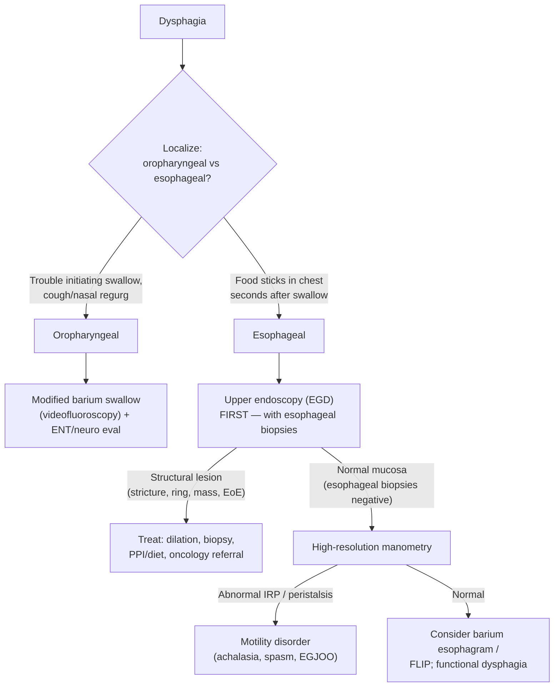

## Definition / Scope

**Dysphagia** is the sensation of impaired passage of food or liquid from the mouth to the stomach. The first and most important step is to localize the problem, because it cleanly splits the differential and the workup:

- **Oropharyngeal (transfer) dysphagia** — difficulty *initiating* a swallow; food sticks "in the throat." Often accompanied by coughing/choking, nasal regurgitation, drooling, or aspiration. Usually **neuromuscular** in origin.
- **Esophageal (transport) dysphagia** — food sticks "in the chest" seconds after swallowing. Localized retrosternally. Usually a **structural** (mechanical) or **motility** problem.

Distinguish dysphagia from related symptoms:

- **Odynophagia** — *painful* swallowing; suggests mucosal injury (infectious or pill esophagitis, severe reflux/erosive disease, malignancy).
- **Globus** — persistent sensation of a lump in the throat *between* swallows, relieved by swallowing; not true dysphagia (see [[laryngopharyngeal-symptoms]]).
- **Functional dysphagia** — a Rome IV [[disorders-of-gut-brain-interaction|DGBI]] diagnosed after structural, motility, and mucosal (eosinophilic) causes are excluded.

The single most useful historical discriminator in esophageal dysphagia is **solids vs. liquids**:

- **Solids only, progressive** → think mechanical obstruction (stricture, ring, [[esophageal-cancer|carcinoma]]).
- **Solids and liquids equally, from the outset** → think a motility disorder ([[achalasia]], spasm).
- **Solids intermittent, non-progressive** → think a web/ring (e.g. Schatzki ring) or [[eosinophilic-esophagitis|EoE]].

---

## Differential Diagnosis

### Oropharyngeal Dysphagia

**Neuromuscular (most common):**

- Stroke (most common cause overall) and other CNS disease (Parkinson's disease, multiple sclerosis, ALS, brainstem lesions)
- Myopathies and neuromuscular junction disease — myasthenia gravis (fatigable), polymyositis/dermatomyositis, muscular dystrophy
- Cricopharyngeal (upper esophageal sphincter) dysfunction / [[achalasia]] of the UES

**Structural:**

- Zenker's diverticulum — regurgitation of undigested food, halitosis, gurgling
- Cervical osteophytes, head and neck malignancy, prior surgery/radiation
- Thyromegaly, proximal esophageal web (Plummer-Vinson, with [[iron-deficiency-anemia|iron deficiency]])

### Esophageal Dysphagia

**Mechanical / structural:**

- **Peptic stricture** — distal, from chronic [[gerd]]; progressive solid-food dysphagia
- **[[eosinophilic-esophagitis]]** — leading cause in younger adults (esp. men); food impaction, rings ("trachealization"), atopy
- **Schatzki ring** — intermittent solid-food dysphagia, classic "steakhouse syndrome"
- **[[esophageal-cancer]]** — progressive solids → liquids, weight loss, anemia (alarm presentation)
- **[[barretts-esophagus]]**-associated stricture; pill esophagitis; radiation stricture
- **Extrinsic compression** — mediastinal mass, vascular (dysphagia lusoria), large left atrium

**Motility:**

- **[[achalasia]]** — dysphagia to solids *and* liquids, regurgitation, weight loss; diagnosed on [[high-resolution-manometry|HRM]] ([[chicago-classification-v4|Chicago Classification]] types I–III)
- **[[esophagogastric-junction-outflow-obstruction|EGJ outflow obstruction (EGJOO)]]** — manometric pattern requiring corroboration with [[flip-panometry|FLIP]]/timed barium and symptoms
- **[[distal-esophageal-spasm]]** — premature contractions; dysphagia + chest pain
- **[[hypercontractile-esophagus]]** (jackhammer) and **[[ineffective-esophageal-motility]]**
- [[esophageal-dysfunction-systemic-disease|Scleroderma / systemic sclerosis]] — absent peristalsis + hypotensive LES, severe reflux

**Mucosal / inflammatory:**

- Erosive esophagitis from [[gerd]]; [[infectious-esophagitis|infectious esophagitis]] (Candida, HSV, CMV — especially immunocompromised; usually odynophagia); pill esophagitis (doxycycline, bisphosphonates, NSAIDs, KCl)

**Immune-mediated / systemic (often nonspecific endoscopy — high index of suspicion):**

- [[lymphocytic-esophagitis|Lymphocytic esophagitis]] — women >60, rings/stricture, dysphagia
- [[esophageal-dysfunction-systemic-disease|Esophageal manifestations of systemic disease]] — connective tissue disease (SSc, MCTD, SLE, Sjögren's, myositis), esophageal [[crohns-disease|Crohn's]], hypereosinophilic syndrome/EGPA, and dermatologic disease (esophageal lichen planus, pemphigus vulgaris)

---

## Diagnostic Algorithm

1. **Localize** oropharyngeal vs. esophageal by history — this determines the first test.
2. **Oropharyngeal** → **modified barium swallow (videofluoroscopic swallow study)** with speech-language pathology; pursue the underlying neuromuscular or structural cause (ENT, neurology). Nasendoscopy/FEES for aspiration assessment.
3. **Esophageal** → **[[upper-endoscopy|EGD]] first** in nearly all cases — it is diagnostic and therapeutic (dilation), and allows biopsy. **Obtain esophageal biopsies even when the mucosa looks normal** to exclude [[eosinophilic-esophagitis|EoE]] (≥6 biopsies, proximal + distal).
4. If EGD is **normal** (including negative EoE biopsies), proceed to **[[high-resolution-manometry|HRM]]** to evaluate motility ([[chicago-classification-v4|Chicago Classification v4.0]]).
5. **Barium esophagram** (incl. timed barium / tablet barium) is a useful adjunct — it can reveal subtle rings/webs, extrinsic compression, or a "bird's beak" of achalasia, and is sometimes done before EGD when a proximal lesion or Zenker's is suspected.
6. **[[flip-panometry|FLIP]]** complements HRM for inconclusive EGJOO and for characterizing the EGJ when manometry is equivocal.

---

## Key Tests

- **[[upper-endoscopy|EGD]]** — first-line for esophageal dysphagia; direct visualization, biopsy (mucosal disease, EoE, malignancy), and therapeutic dilation of strictures/rings.
- **Esophageal biopsies for EoE** — ≥6 biopsies from ≥2 levels; required even with normal-appearing mucosa.
- **Modified barium swallow / videofluoroscopy** — test of choice for **oropharyngeal** dysphagia; assesses transfer mechanics and aspiration.
- **Barium esophagram / timed barium esophagram** — structural and functional overview; sensitive for rings, webs, subtle strictures, extrinsic compression; timed barium quantifies achalasia emptying.
- **[[high-resolution-manometry|High-resolution manometry]]** — gold standard for esophageal motility disorders; interpreted by [[chicago-classification-v4|Chicago Classification v4.0]].
- **[[flip-panometry|FLIP panometry]]** — adjunct measuring EGJ distensibility and secondary peristalsis; clarifies EGJOO and achalasia when HRM is inconclusive.
- **Ambulatory [[reflux-testing|reflux testing]]** ([[ambulatory-reflux-monitoring]]) — when [[gerd|GERD]] is suspected as the driver of a peptic stricture or dysphagia.

---

## Red Flags / Alarm Features

Prompt expedited [[upper-endoscopy|EGD]] (and raise concern for malignancy):

- **Progressive dysphagia** (solids → liquids over weeks–months)
- **Unintentional weight loss**
- **Odynophagia**
- **GI bleeding or iron deficiency anemia**
- **Age ≥ 60 with new-onset dysphagia**
- **Recurrent aspiration or aspiration pneumonia**
- **A palpable neck/supraclavicular mass or lymphadenopathy**
- **Food impaction** (acute, with inability to handle secretions) — emergent endoscopy; strongly associated with [[eosinophilic-esophagitis|EoE]] and rings

---

## See Also

[[eosinophilic-esophagitis]], [[infectious-esophagitis]], [[lymphocytic-esophagitis]], [[esophageal-dysfunction-systemic-disease]], [[achalasia]], [[gerd]], [[esophageal-cancer]], [[barretts-esophagus]], [[distal-esophageal-spasm]], [[hypercontractile-esophagus]], [[ineffective-esophageal-motility]], [[high-resolution-manometry]], [[chicago-classification-v4]], [[flip-panometry]], [[upper-endoscopy]], [[laryngopharyngeal-symptoms]], [[disorders-of-gut-brain-interaction]], [[iron-deficiency-anemia]]
