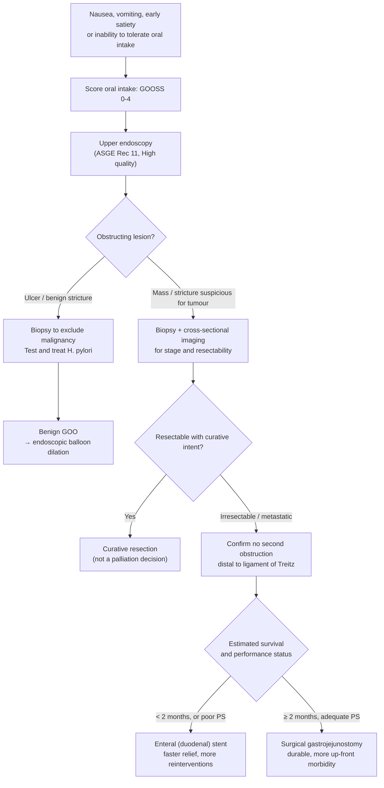

## Contents
- [[#Definition / Scope]]
  - [[#GOOSS — Gastric Outlet Obstruction Scoring System]]
- [[#Differential Diagnosis]]
- [[#Diagnostic Algorithm]]
- [[#Key Tests]]
- [[#Treatment Selection]]
  - [[#Benign GOO]]
  - [[#Malignant GOO — the prognosis threshold]]
  - [[#Procedural specifications]]
  - [[#After the procedure]]
- [[#Red Flags / Alarm Features]]
- [[#See Also]]
- [[#Sources]]

---

## Definition / Scope

- **Mechanical obstruction of gastric outflow.** Anatomically the ingested trials bound it as obstruction extending from the **distal one third of the stomach to the distal duodenum** ([[jeurnink-2010-sustent-goo|SUSTENT]]) — equivalently, **pyloric region to the third part of the duodenum** ([[kastelijn-2023-enduro-protocol|ENDURO]]).
- **Symptoms scale with severity:** early satiety → nausea → vomiting → complete inability to tolerate oral intake.
- **Why it must be treated, not observed:** poor clinical condition from vomiting, dehydration, and malnutrition develops quickly. The aim of palliation in malignant GOO is to maintain oral intake and stabilize quality of life.
- **How often it complicates pancreatic cancer — the two ingested sources differ slightly:** [[jeurnink-2010-sustent-goo|SUSTENT]] states **10–20%** of patients with pancreatic cancer develop obstructive symptoms during the disease course; [[kastelijn-2023-enduro-protocol|ENDURO]] states **15–20%** will develop GOO. Same tier, and the newer figure sits inside the older range — treat the answer as "roughly one in six".
- **Scope note:** this page is the home of the **GOOSS score** and the **malignant-GOO treatment-selection rule**. Benign (peptic) GOO dilation outcomes live on [[peptic-ulcer-disease]]; feeding-route selection lives on [[enteral-access]].

### GOOSS — Gastric Outlet Obstruction Scoring System

The standardized food-intake instrument used to define eligibility, measure response, and time the decision to escalate. **Both ingested trials enrol only GOOSS 0–1 and define treatment success as reaching GOOSS ≥2.**

| Score | Oral intake |
|---|---|
| **0** | No oral intake |
| **1** | Liquids only |
| **2** | **Soft solids** ← threshold for "able to eat"; the primary endpoint in both trials |
| **3** | Almost complete diet |
| **4** | Full diet |

---

## Differential Diagnosis

*This page is itself the workup schema; the entries below are the causes to distinguish.*

**Malignant** — the dominant cause in the ingested corpus:

| Cause | Note |
|---|---|
| **[[pancreatic-cancer\|Pancreatic adenocarcinoma]]** | **Most common cause.** 28 of 39 SUSTENT patients |
| **[[gastric-adenocarcinoma\|Distal gastric cancer]]** | |
| Periampullary / papillary carcinoma | Stent across the ampulla may block later biliary access — see below |
| Duodenal carcinoma | |
| [[cholangiocarcinoma\|Bile duct carcinoma]] | |
| Lymphoma | |
| **Extrinsic compression from metastases** to duodenum or jejunum | |

**Benign:**

- **[[peptic-ulcer-disease\|Peptic ulcer disease]]** — the principal benign cause. **Active ulcers are found in up to one third of patients endoscoped for GOO** ([[asge-2010-pud]]).

**Must be excluded before committing to a bypass — these change the operation, not just the diagnosis:**

- **Additional or more distal strictures in the GI tract.** Both trials exclude them; ENDURO specifically excludes obstruction **distal to the ligament of Treitz with small-intestinal dilation/ileus**. A gastrojejunostomy or stent proximal to a second downstream obstruction will not restore intake.
- **Ileus / dysmotility masquerading as mechanical obstruction** — ENDURO's post-procedure algorithm requires excluding ileus (distended abdomen, absent or high-pitched peristalsis, no passage of flatus or faeces) before attributing failure to the anastomosis.
- **Prior gastric, periampullary, or duodenal surgery**, or a prior gastrojejunostomy/stent for the same condition — excluded from both trials, so the trial-derived rules below do not transfer to these patients.

---

## Diagnostic Algorithm

*Figure 1 — Workup and treatment-selection pathway. Endoscopy step from [[asge-2010-pud]]; the 2-month prognosis threshold from [[jeurnink-2010-sustent-goo]], restated as current standard of care in [[kastelijn-2023-enduro-protocol]].*

---

## Key Tests

| Test | Role |
|---|---|
| **Upper endoscopy** | **Recommended for the evaluation of GOO — ASGE 2010 Rec 11, High quality of evidence.** Confirms the obstruction, localizes it, and — critically — **biopsies to separate benign from malignant**, which is the branch point of the whole algorithm. Also the therapeutic access for benign dilation. |
| **Biopsy of the obstructing lesion** | Malignant gastric lesions can look endoscopically benign; the benign-vs-malignant call cannot be made on appearance alone ([[asge-2010-pud]]). |
| **Cross-sectional imaging** | Establishes irresectability/metastatic disease — the precondition for treating GOO as a palliative problem at all. Also confirms GOO radiologically (an accepted alternative to endoscopic confirmation in ENDURO) and screens for a second, more distal obstruction. |
| **WHO / ECOG performance status** | Not a "test" but a required input: performance status plus estimated survival selects the palliative procedure. **WHO 4 (bedbound 100% of the time) was an exclusion** from SUSTENT — such patients were not studied and the rule below does not cover them. |
| **GOOSS score** | Baseline severity, treatment response, and the day-5 escalation trigger. |

---

## Treatment Selection

### Benign GOO

- **Endoscopic balloon dilation** is suggested for benign GOO — [[asge-2010-pud]] Rec 12, **Low** quality of evidence (note the weak grade).
- Short-term relief is good but **restenosis is common and about half ultimately need surgery**; patients requiring **more than 2 dilations** are at high risk of endoscopic failure. Full outcome figures, including the perforation rate, are on [[peptic-ulcer-disease]].
- Treat the underlying ulcer diathesis in parallel — [[helicobacter-pylori-infection|H. pylori]] eradication, acid suppression ([[proton-pump-inhibitors|PPI]]).

### Malignant GOO — the prognosis threshold

**The decision rule is keyed to expected survival, because the two options fail in opposite directions and their outcome curves cross at roughly 30–60 days.**

| | **Enteral (duodenal) stent** | **Surgical gastrojejunostomy** |
|---|---|---|
| **Choose when** | Expected survival **< 2 months** | Expected survival **≥ 2 months** *and* adequate performance status |
| Median days to GOOSS ≥2 | **5** | 8 |
| Food intake at 60 days | Worse | **Better** |
| Median days alive with GOOSS ≥2 | 50 | **72** |
| Median hospital stay | **7 days** | 15 days |
| Recurrent obstructive symptoms | 8 in 5 patients | 1 in 1 patient |
| Reinterventions | 10 in 7 patients | 2 in 2 patients |
| Late major complications | 5 in 3 patients | **0** |
| Median survival | 56 days | 78 days (**not different**, P = .19) |
| Quality of life | No difference between arms | |
| Mean total cost per patient | **$11,720** | $16,536 |

*All figures from [[jeurnink-2010-sustent-goo]] (n = 39: 18 GJJ, 21 stent).*

**Three qualifiers that must travel with these numbers:**

1. **Statistical caveat, stated by the authors themselves.** The trial ran many comparisons on 39 patients. Bonferroni correction **would remove every nominally significant finding except those at P < .001** — i.e. only the cost differences survive. The efficacy and reintervention differences are **descriptive signals**, not established effects.
2. **The major-complication difference is definitional.** Major complications were 6 (in 4 patients) after stenting versus 0 after surgery — but **when stent obstruction is not counted as a major complication, the rates do not differ** (P = .4).
3. **The surgical arm was mostly open surgery.** 16 of 18 gastrojejunostomies were **open**, only 2 laparoscopic. The 8-day time-to-eating and 15-day stay therefore **overstate the penalty of a modern laparoscopic bypass**.

**Why stents fail late:** obstruction by **food debris** and by **tumour ingrowth/overgrowth** through the uncovered mesh — the recognized weakness of uncovered designs. Covered stents trade ingrowth for a **higher migration** risk. Stent obstruction occurs in **up to 30%** of cases (ENDURO background).

**Biliary access is part of the stent decision.** A duodenal stent deployed **across the ampulla of Vater can foreclose [[ercp|ERCP]] access to the bile duct**. Of 4 SUSTENT stent-arm patients who later developed CBD obstruction, only 1 could be managed endoscopically; 2 required percutaneous drainage. **Consider placing a CBD stent up front** if biliary obstruction is anticipated — see [[biliary-stricture]].

**EUS-guided gastroenterostomy (EUS-GE) — position in this corpus.** A **20-mm lumen-apposing metal stent (LAMS)** placed endoscopically between the stomach and a jejunal loop distal to the obstruction, proposed as combining the speed of stenting with the durability of surgery. **The ingested corpus contains no outcome data comparing EUS-GE with surgery or with enteral stenting.** [[kastelijn-2023-enduro-protocol|ENDURO]] is the randomized trial designed to answer exactly this question and is a **protocol reporting no results**. Until its results paper is ingested, this page states EUS-GE technique only and asserts nothing about its comparative efficacy or safety. Known hazard: EUS-GE is **technically demanding**, and **LAMS misdeployment can cause jejunal perforation and peritonitis**.

### Procedural specifications

*Techniques as protocolized in [[kastelijn-2023-enduro-protocol]]; stent specification from [[jeurnink-2010-sustent-goo]].*

- **Enteral stent:** uncovered Enteral Wallflex, **22 mm diameter**, 60 / 90 / 120 mm length; over a guidewire under combined endoscopic and fluoroscopic monitoring.
- **EUS-GE:** deep sedation with propofol, **preferably two advanced endoscopists**. Clear residual gastric contents; place a feeding tube or nasobiliary drain distal to the stenosis. Identify the post-stenotic loop by flushing **saline mixed with indigo carmine**. **Direct puncture** with an **electrocautery-enhanced delivery system**; deploy a **20 × 10 mm LAMS**, distal flange first with traction against the bowel wall, then the proximal flange. Confirm by **backflow of dyed saline into the stomach**. **Do not balloon-dilate the stent immediately** — let it expand naturally.
- **Surgical gastrojejunostomy:** laparoscopic, **antecolic side-to-side**, **no Roux-en-Y**; 60-mm stapler; **biliary limb (bile duct to anastomosis) at least 50 cm**; nasogastric tube post-operatively. A feeding jejunostomy is not routinely constructed.
- **Excessive gastric residual volume** preventing safe sedation → **reschedule after extensive gastric decompression**. This is not a technical failure.
- **Do not perform biliary intervention in the same session** as EUS-GE or surgical bypass.

### After the procedure

- **Persistent obstruction** = nausea, **vomiting more than twice in 24 h**, or inability to tolerate at least soft solids. Manage with nil per mouth, nasogastric tube, and prokinetics (metoclopramide, domperidone, or erythromycin).
- **Day-5 escalation trigger:** if intake is still **GOOSS 0–1 on post-procedure day 5**, place a **jejunal feeding tube endoscopically** — after excluding ileus. Endoscopic placement simultaneously assesses anastomotic/stent patency. Parenteral nutrition only if jejunal feeding is not tolerated.
- **Do not re-endoscope through a LAMS within the first 6 weeks** of placement — the fistula tract may not be mature.
- **Recurrent obstructive symptoms → upper endoscopy.** (*Persistent* = within 4 weeks of treatment; *recurrent* = more than 4 weeks after — [[jeurnink-2010-sustent-goo]].)
- **Stop pre-existing tube feeding** after the procedure to give oral intake a fair trial; restart only if the patient demonstrably cannot maintain adequate intake.
- **Feeding route:** GOO is a stated indication for **small-bowel rather than gastric** enteral access ([[aga-2025-endoscopic-enteral-access]]) — see [[enteral-access]]. Small-bowel feeds need reduced and cycled rates to prevent dumping.

---

## Red Flags / Alarm Features

- **GOOSS 0 (no oral intake at all)** — dehydration and malnutrition develop quickly; this is not a watch-and-wait situation.
- **Vomiting more than twice in 24 h**, or still GOOSS 0–1 **five days after** a bypass or stent — trigger for endoscopic jejunal feeding access.
- **Endoscopically benign-looking gastric lesion** — appearance does not exclude malignancy; biopsy is mandatory.
- **New jaundice or cholangitis after duodenal stenting** — the stent may have crossed the ampulla and blocked ERCP access; anticipate percutaneous drainage.
- **Suspicion of a second, more distal obstruction** (small-bowel dilation, ileus) — a proximal bypass will not work.
- **WHO performance status 4** — outside the evidence base for either palliative procedure.
- **Suspected perforation after balloon dilation or EUS-GE** — pyloric dilation carries a meaningful perforation rate ([[peptic-ulcer-disease]]); LAMS misdeployment causes jejunal perforation and peritonitis.

---

## See Also

[[peptic-ulcer-disease]], [[pancreatic-cancer]], [[gastric-adenocarcinoma]], [[enteral-access]], [[endoscopic-ultrasound]], [[endoscopic-oncology]], [[upper-endoscopy]], [[ercp]], [[biliary-stricture]], [[nausea-and-vomiting]], [[gastroparesis]], [[helicobacter-pylori-infection]]

---

## Sources

1. [[jeurnink-2010-sustent-goo|Surgical gastrojejunostomy or endoscopic stent placement for the palliation of malignant gastric outlet obstruction (SUSTENT study): a multicenter randomized trial]]
2. [[kastelijn-2023-enduro-protocol|EUS-guided gastroenterostomy versus surgical gastrojejunostomy for palliation of malignant gastric outlet obstruction (ENDURO): study protocol for a randomized controlled trial]]
3. [[asge-2010-pud|ASGE Guideline: The Role of Endoscopy in the Management of Patients With Peptic Ulcer Disease (2010)]]
4. [[aga-2025-endoscopic-enteral-access|AGA 2025 Clinical Practice Update on Endoscopic Enteral Access]]
