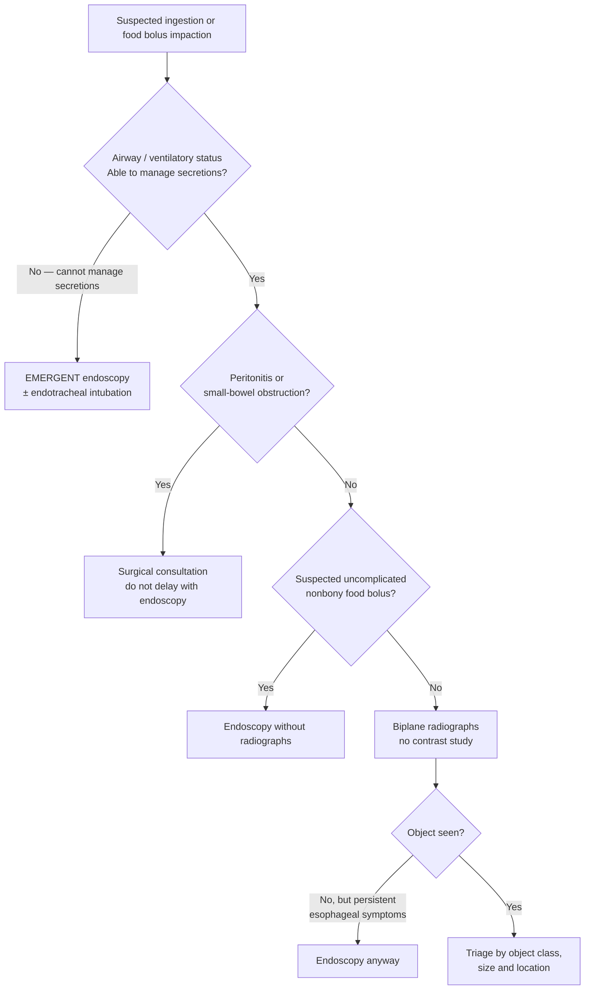

## Contents
- [[#Definition / Scope]]
  - [[#Who Ingests]]
  - [[#Where Objects Get Stuck]]
- [[#Differential Diagnosis]]
  - [[#Underlying Esophageal Pathology Behind a Food Bolus Impaction]]
  - [[#Conditions to Exclude at Presentation]]
- [[#Diagnostic Algorithm]]
  - [[#Step 1 — Airway and Surgical Screen]]
  - [[#Step 2 — Localize the Object]]
  - [[#Step 3 — Timing Triage]]
  - [[#Step 4 — Size and Length Thresholds]]
  - [[#Step 5 — Object-Class Management]]
  - [[#Step 6 — Endoscopic Technique]]
  - [[#Step 7 — Post-Retrieval Obligations]]
  - [[#Non-Operative Observation and Follow-Up]]
- [[#Key Tests]]
- [[#Red Flags / Alarm Features]]
- [[#See Also]]
- [[#Sources]]

---

## Definition / Scope

- Covers **true foreign body ingestion** (nonfood objects) and **esophageal food bolus impaction** — the most common esophageal foreign body in adults in the Western world is impacted meat or other food.
- **Most pass spontaneously** — ≥80% of foreign objects pass without intervention in pre-endoscopic series. The task is identifying the minority that will not.
- Intentional ingestion is different: endoscopic intervention **63%–76%**, surgical intervention **12%–16%**.
- Mortality extremely low — no deaths in 852 adults; 1 death in 2206 children across compiled series.
- Once past the esophagus, most foreign bodies — **including sharp objects** — pass uneventfully, typically in **4–6 days**.

### Who Ingests

| Group | Detail |
|---|---|
| Children | Majority of all ingestions; peak incidence **6 months–6 years** |
| Button battery ingestion | Children **<5 years** most likely; sources = hearing aids, watches, games, toys, calculators |
| Adults, true (nonfood) FB | Psychiatric disorders, developmental delay, alcohol intoxication, incarcerated individuals seeking secondary gain (release to a medical facility). Multiple objects and repeat episodes common |
| Edentulous adults | Obstructing food bolus, or ingestion of their own dental prosthesis |
| Prior GI surgery / congenital gut malformation | Increased risk of impaction, perforation, obstruction |
| Food bolus impaction | Often have **underlying esophageal pathology directly causing the impaction** |

### Where Objects Get Stuck

- Impaction, perforation, or obstruction occurs at **GI angulations or narrowing**.
- Named levels in the guideline:
  - **Cricopharyngeus / upper esophageal sphincter** — proximal impaction; ENT consult advised at or above this level; direct laryngoscopy or rigid esophagoscopy may be needed.
  - **Esophagus** — the pressure point; anything lodged here has a 24-hour ceiling.
  - **Pylorus** — objects >2.5 cm in diameter are less likely to pass it.
  - **Duodenum** — objects >6 cm in length are likely to have difficulty passing it.
- Objects that increase perforation risk: sharp and pointed objects, animal or fish bones, bread bag clips, magnets, medication blister packs.

---

## Differential Diagnosis

*Underlying swallowing disorder — full differential and workup: see [[dysphagia]].*

### Underlying Esophageal Pathology Behind a Food Bolus Impaction

| Cause | Detail |
|---|---|
| [[eosinophilic-esophagitis\|Eosinophilic esophagitis]] | Reported in **as many as 33%** of patients with food bolus obstruction — must be actively looked for, not assumed absent |
| Esophageal stricture | Present in a subset; dilation after extraction is generally safe when a stricture is found, and reduces recurrence |

### Conditions to Exclude at Presentation

- **Aspirated object** (airway rather than esophagus) — biplane radiographs help exclude.
- **Perforation** — oropharyngeal or proximal esophageal perforation causes neck swelling, erythema, tenderness, or crepitus; free mediastinal or peritoneal air on radiograph.
- **Peritonitis** and **small-bowel obstruction** — these require surgery, and endoscopy must not delay surgical consultation.
- Note: the **area of discomfort often does not correlate with the site of impaction**, and symptoms frequently occur well after ingestion — so reported location is not a localizing test.
- In young children, mentally impaired adults, and psychiatric illness, presentation may be nonspecific: choking, refusal to eat, vomiting, drooling, wheezing, blood-stained saliva, or respiratory distress.

---

## Diagnostic Algorithm

### Step 1 — Airway and Surgical Screen

- Assess ventilatory status and airway first.
- **Unable to manage secretions** = high aspiration risk → emergent endoscopy.
- Endotracheal intubation (typically under general anesthesia) for: proximal esophageal foreign bodies needing airway protection, objects difficult to remove, multiple objects, and when rigid esophagoscopy is planned.
- Pediatric cases often need general anesthesia + endotracheal intubation — smaller, more compliant airways raise the risk of airway obstruction during endoscopy.
- Most adult cases can be managed with conscious [[endoscopy-sedation|sedation]].
- Screen for peritonitis / small-bowel obstruction — surgery, and endoscopy must not delay the surgical consult.

### Step 2 — Localize the Object

- **Biplane radiographs** first for suspected true foreign bodies — confirm location, size, shape, and number, and help exclude an aspirated object.
- **Do not use contrast studies** before removal — aspiration risk, and contrast coats the object and mucosa, compromising subsequent [[upper-endoscopy|endoscopy]] (ASGE 2011 Rec 1, ⊕◯◯◯).
- **Negative radiograph does not end the workup** — persistent esophageal symptoms should be evaluated by endoscopy even when imaging is negative, and many sharp-pointed objects are radiolucent.
- **Suspected uncomplicated nonbony food bolus** (no perforation, no respiratory distress) → proceed to endoscopy **without** radiographs.

### Step 3 — Timing Triage

*ASGE 2011, Table 2. "Urgent" is anchored numerically in the text: esophageal foreign objects and food impactions should be removed **within 24 hours** — delay reduces the likelihood of successful removal and increases complications including perforation. The guideline attaches **no hour value to "emergent"** (it is defined by indication, not by a clock).*

| Urgency | Situation |
|---|---|
| **Emergent** | Esophageal obstruction — patient **unable to manage secretions** |
| **Emergent** | **Disk battery in the esophagus** |
| **Emergent** | **Sharp-pointed object in the esophagus** |
| **Urgent** (within 24 h) | Esophageal foreign object that is **not** sharp-pointed |
| **Urgent** (within 24 h) | Esophageal **food impaction without complete obstruction** |
| **Urgent** (within 24 h) | Sharp-pointed object in the **stomach or duodenum** |
| **Urgent** (within 24 h) | Object **>6 cm in length at or above the proximal duodenum** |
| **Urgent** (within 24 h) | **Magnets within endoscopic reach** |
| **Nonurgent** | Coin in the esophagus in an **asymptomatic** patient — may be observed **12–24 h** before endoscopic removal |
| **Nonurgent** | Object in the **stomach with diameter >2.5 cm** |
| **Nonurgent** | **Disk or cylindrical battery in the stomach without signs of GI injury** — may be observed up to **48 h**; remove if still there beyond 48 h |

- Timing depends on patient age and clinical condition; the size, shape, content, and anatomic location of the object(s); and time since ingestion. The judgment is of the risks of **aspiration, obstruction, or perforation**.
- Most clinically stable patients without high-grade obstruction do **not** need urgent endoscopy — the object commonly passes on its own.
- Consent issues in mentally incompetent patients may delay removal beyond 24 h, but the 24-hour standard should be attempted whenever possible.
- In children the duration of an esophageal foreign body is often unknown; some advocate urgent removal in this group because of transmural erosion and fistula formation.

### Step 4 — Size and Length Thresholds

| Threshold | Anatomic reason | Action |
|---|---|---|
| **Diameter >2.5 cm**, object in the stomach | Less likely to pass the **pylorus** | Endoscopic removal suggested (⊕◯◯◯ — "limited data exist to support this recommendation") |
| **Length >6 cm**, at or above the proximal duodenum | Likely to have difficulty passing the **duodenum** | Endoscopic removal, urgent timing. Supporting data: 112 of 139 objects >6 cm remained proximal to the pylorus at endoscopy |
| **Disk battery >20 mm diameter**, in the stomach **>48 h** (repeat radiograph) | Large-diameter battery | Remove |
| Any battery (disk or cylindrical) remaining in the stomach **>48 h** | — | Retrieve |
| Object failing to pass beyond the **stomach by 3–4 weeks** | — | Endoscopic removal |
| Object **distal to the duodenum**, same location **>1 week**, not endoscopically reachable | — | Consider surgical removal |
| Sharp-pointed object failing to progress after **3 days** (daily radiographs) | — | Consider surgery |

### Step 5 — Object-Class Management

| Object class | Location | Management |
|---|---|---|
| **Food bolus** | Esophagus | En bloc removal, piecemeal removal, or the **gentle push technique** — all acceptable (Rec 4, ⊕⊕⊕◯). Complete obstruction → emergent (Rec 3, ⊕⊕◯◯) |
| **Disk (button) battery** | Esophagus | **Emergent removal** (Rec 7, ⊕⊕◯◯) — liquefaction necrosis and perforation occur rapidly. If it cannot be retrieved, **push it into the stomach** and retrieve there with a basket or net |
| **Disk battery** | Beyond esophagus | No retrieval needed **unless signs of GI tract injury**, or >20 mm diameter sitting in the stomach >48 h. Past the duodenum, **85% pass within 72 h**. **Emetics are not beneficial** and have caused retrograde migration back into the esophagus; cathartics and acid suppression have no proven role (GI lavage may expedite passage) |
| **Cylindrical battery** | Stomach | Limited data; in one retrospective series no life-threatening symptoms and 18% minor/moderate symptoms. Retrieve if **>48 h in the stomach**, or if signs of GI injury. Ask whether the battery had an **encasement defect** before ingestion |
| **Magnets** | Within endoscopic reach | **Urgent removal of all magnets** (Rec 8, ⊕⊕◯◯). Beyond reach → close observation + surgical consultation for nonprogression. Remove even when **only 1 magnet** is seen on radiograph or reported — undetected additional magnets or co-ingested metal cause the injury |
| **Magnets — mechanism** | Any | Attraction across bowel wall (magnet–magnet or magnet–metal) traps bowel between the objects → pressure necrosis, fistula, perforation, obstruction, volvulus, peritonitis |
| **Sharp-pointed objects** | Esophagus | **Medical emergency.** At or above the cricopharyngeus → direct laryngoscopy is an option; otherwise rigid or flexible endoscopy |
| **Sharp-pointed objects** | Stomach / proximal duodenum | Retrieve endoscopically **if it can be done safely** (Rec 6, ⊕⊕◯◯) — complication risk from a sharp-pointed object is **as high as 35%**. Otherwise daily radiographs; surgery if no progression after 3 days |
| **Long objects (>6 cm)** | At or above proximal duodenum | Remove — toothbrushes, eating utensils. Use a **>45 cm overtube** past the gastroesophageal junction |
| **Coins** | Esophagus | Observe 12–24 h if asymptomatic; remove within 24 h if no spontaneous passage (Rec 9, ⊕⊕◯◯). **Drooling, chest pain, or stridor → emergent removal.** Distal esophageal coins pass spontaneously more often than proximal — **56% vs 27%** in a randomized prospective trial |
| **Coins** | Stomach / beyond | Most pass without obstruction; serial radiographs. Zinc toxicity reported after massive ingestion of pennies minted after 1982 |
| **Narcotic packets (body packing)** | Any | **Do not attempt endoscopic removal** (Rec 10, ⊕⊕◯◯) — rupture and leakage can be fatal. Surgery if packets fail to progress or there are signs of intestinal obstruction. Suspected rupture → surgery **plus** urgent medical consultation for drug toxicity |
| **Small-bowel objects** | Small bowel | Single- and [[device-assisted-enteroscopy\|double-balloon enteroscopy]] can access the small intestine — case reports of retrieving retained video [[capsule-endoscopy\|capsules]] and obstruction-prone objects. Data limited; weigh patient stability, accessory availability, procedure length, and antegrade vs retrograde approach |

- Foreign bodies **at or above the level of the cricopharyngeus** → otorhinolaryngology consultation suggested (Rec 2, ⊕◯◯◯).

### Step 6 — Endoscopic Technique

- **Flexible endoscopy is first-line.** Retrospective comparison: **0 perforations in 76** flexible cases vs **2 of 63 (3.2%, P < .002)** with rigid esophagoscopy.
- **Rigid esophagoscopy** retains a role for proximal objects impacted at the upper esophageal sphincter / hypopharynx — it protects the airway without an overtube.
- Standard or therapeutic endoscopes preferred; small-caliber transnasal removal has been reported.
- **Retrieval devices:** rat-tooth and alligator forceps, polypectomy snares, polyp graspers, Dormia baskets, retrieval nets, magnetic probes, friction-fit adaptors, banding caps. **Practice grasping a duplicate object before the procedure** to pick the device and the grasp.
  - Smooth, round objects → **retrieval net or basket**; the net was superior in a prospective in vivo study.
  - Disk battery in the esophagus → stone retrieval basket or retrieval net; alternatively a **through-the-scope balloon** passed distal to the battery, inflated, and withdrawn — balloon, battery, and endoscope come out as a unit. **An overtube or endotracheal tube is essential for airway protection** during this maneuver.
  - Long object → grasp with snare or basket, draw into the **>45 cm overtube**, and withdraw object + overtube + endoscope **in one motion** so the grasp is not lost inside the overtube.
- **Overtube** — protects the airway, eases repeat passage for multiple objects or piecemeal food bolus clearance, and shields esophageal mucosa from laceration by sharp objects. Use a **longer overtube that crosses the gastroesophageal junction** for sharp or pointed objects distal to the esophagus. Overtube use is less common in children (insertion injury risk); newer softer tubes may mitigate this in older children.
- **Protector hood** — in the absence of an overtube, a foreign body protector hood is recommended to protect the esophagus during removal of sharp or pointed objects.
- **Sharp objects: orient the point trailing** during extraction; that plus an overtube or protector hood minimizes mucosal injury.
- **Do not use nonendoscopic retrieval** (fluoroscopic forceps, Foley catheter balloon, magnet-tipped nasogastric tube) — no airway protection, no direct view of the esophagus for underlying pathology or mucosal injury, no control of the object. Endoscopic approaches are recommended.
- Objects not easily grasped in the esophagus may be **advanced into the stomach**, where retrieval is often easier — provided visualization is adequate.
- **Push technique for food bolus:** gentle pressure on the **center** of the bolus. If advancement fails, reduce bolus size piecemeal, then reapply gentle pressure. Two large series reported **no perforations in 375 patients**; perforation remains a risk if excessive force is used.
- **Glucagon 1.0 mg IV** — may relax the distal esophagus and allow spontaneous passage while endoscopy is being arranged. Effectiveness is contested (a single small randomized study showed no significant improvement over placebo); it is relatively safe and remains an acceptable option, but **must not delay definitive endoscopic removal**.
- **Papain and other proteolytic enzymes should never be used** — hypernatremia, mucosal erosion, and esophageal perforation have resulted.

### Step 7 — Post-Retrieval Obligations

- **Biopsy the esophagus after a food impaction when EoE is suspected** — take biopsies of the **mid and distal esophagus**; EoE is found in as many as 33% of food bolus impactions.
- **Dilation:** generally safe after food bolus extraction when an esophageal stricture is present, and reduces recurrence. **Defer dilation pending pathology results** when EoE is suspected, and use caution after a prolonged impaction.

### Non-Operative Observation and Follow-Up

- Conservative outpatient management is appropriate for most **asymptomatic gastric** foreign bodies (some authors favour early endoscopic removal).
- If endoscopy is deferred: **regular diet**, and the patient observes stools for passage of the object.
- **Radiograph intervals:**
  - Small blunt objects, asymptomatic → **weekly** radiographs; passage may take as long as 4 weeks.
  - Sharp-pointed object beyond endoscopic retrieval → **daily** radiographs.
  - Battery past the duodenum → radiograph every **3–4 days**.
- Instruct the patient to report immediately: **abdominal pain, vomiting, persistent temperature elevations, hematemesis, or melena.**

---

## Key Tests

| Test | Role | Limits |
|---|---|---|
| **Biplane radiographs** | First-line for suspected true foreign body — identifies most true foreign objects, steak bones, and free mediastinal or peritoneal air; gives location, size, shape, number; helps exclude an aspirated object | **Not readily seen:** fish or chicken bones, wood, plastic, glass, thin metal objects |
| **Contrast radiography** | **Avoid before removal** (Rec 1) | Aspiration risk; contrast coats the object and mucosa and compromises subsequent endoscopy |
| **CT** | May be useful; helpful for narcotic packets | May not detect radiolucent objects; sensitivity improved with **3-dimensional reconstruction**; false-negative scans reported in body packing |
| **Metal detector** | Localizes most swallowed metal objects; especially helpful in pediatric patients | Metal objects only |
| **Upper endoscopy** | Diagnostic **and** therapeutic; indicated for persistent esophageal symptoms even when radiographs are negative; proceed without radiographs for uncomplicated nonbony food bolus | — |
| **Esophageal biopsy (mid + distal)** | After food impaction when EoE is suspected | Dilation may be deferred pending results |

---

## Red Flags / Alarm Features

**Emergent endoscopy (do not wait):**
- Inability to manage secretions / complete esophageal obstruction.
- Disk battery lodged in the esophagus.
- Sharp-pointed object lodged in the esophagus.
- Coin in the esophagus **with** drooling, chest pain, or stridor.

**Surgery, not endoscopy:**
- Peritonitis — immediate surgical evaluation.
- Small-bowel obstruction.
- Narcotic packets: failure to progress, signs of intestinal obstruction, or suspected rupture (add urgent medical consultation for drug toxicity).
- Sharp-pointed object failing to progress after 3 days; object distal to the duodenum stationary >1 week and out of endoscopic reach.

**Signs of perforation:**
- Neck swelling, erythema, tenderness, or crepitus (oropharyngeal / proximal esophageal perforation).
- Free mediastinal or peritoneal air on radiograph.

**Nonspecific presentations that still warrant urgency** (young children, mentally impaired adults, psychiatric illness): choking, refusal to eat, vomiting, drooling, wheezing, blood-stained saliva, respiratory distress.

**Symptoms the patient must report during observation:** abdominal pain, vomiting, persistent temperature elevations, hematemesis, melena.

---

## See Also

[[eosinophilic-esophagitis]], [[dysphagia]], [[upper-endoscopy]], [[endoscopy-sedation]], [[device-assisted-enteroscopy]], [[capsule-endoscopy]]

---

## Sources

1. [[asge-2011-foreign-body-ingestion|ASGE Guideline: Management of Ingested Foreign Bodies and Food Impactions (2011)]]
