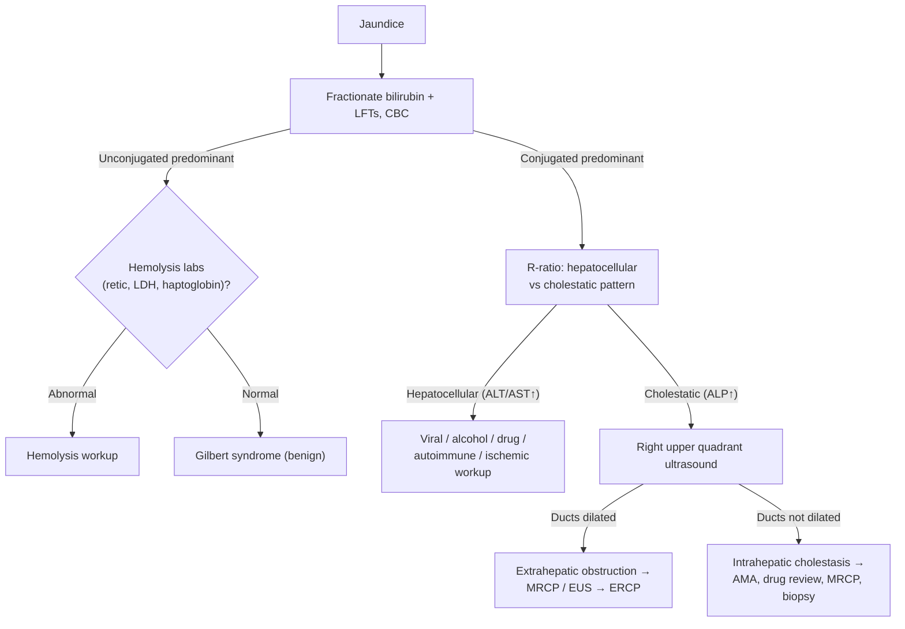

## Contents
- [[#Definition / Scope]]
- [[#Differential Diagnosis]]
  - [[#Unconjugated (Indirect) Hyperbilirubinemia]]
  - [[#Conjugated (Direct) — Hepatocellular]]
  - [[#Conjugated (Direct) — Cholestatic / Obstructive]]
- [[#Diagnostic Algorithm]]
- [[#Key Tests]]
- [[#Red Flags / Alarm Features]]
- [[#See Also]]

---

## Definition / Scope

**Jaundice** (icterus) is yellow discoloration of skin, sclerae, and mucous membranes from bilirubin deposition, clinically detectable when total bilirubin exceeds ~2–3 mg/dL. The first branch point is **bilirubin fractionation**:

- **Unconjugated (indirect) hyperbilirubinemia** — excess production (hemolysis), impaired uptake, or impaired conjugation. Bilirubin is **not** water-soluble → **no bilirubinuria**.
- **Conjugated (direct) hyperbilirubinemia** — hepatocellular dysfunction or impaired excretion/biliary obstruction. Bilirubin is water-soluble → **dark urine** and (with obstruction) **pale stools, pruritus**.

Conjugated cases are then split by the **R-ratio / pattern of liver enzymes** into **hepatocellular** (ALT/AST-predominant) versus **cholestatic** (ALP-predominant) injury — the same framework used on the [[abnormal-liver-chemistries]] page (R = (ALT/ULN) ÷ (ALP/ULN); >5 hepatocellular, <2 cholestatic, 2–5 mixed).

---

## Differential Diagnosis

### Unconjugated (Indirect) Hyperbilirubinemia

- **Hemolysis** — hereditary (G6PD deficiency, spherocytosis, sickle cell) or acquired (autoimmune, microangiopathic); check haptoglobin, LDH, reticulocytes, smear
- **Gilbert syndrome** — common, benign; mild unconjugated rise with fasting/illness; normal enzymes and CBC
- **Crigler-Najjar** (rare), ineffective erythropoiesis, resorption of large hematoma
- Neonatal/physiologic jaundice (distinct pediatric pathway)

### Conjugated (Direct) — Hepatocellular

- **Viral hepatitis** — [[hepatitis-c]], [[chronic-hepatitis-b]], hepatitis A/E
- **[[alcohol-associated-liver-disease|Alcohol-associated hepatitis]]** — AST:ALT >2, often very high bilirubin
- **[[drug-induced-liver-injury]]** — acetaminophen and idiosyncratic DILI; herbal/dietary supplements
- **[[autoimmune-hepatitis]]**, ischemic hepatitis ("shock liver"), Wilson disease ([[wilson-disease]])
- **Cirrhosis / decompensation** of any chronic liver disease (e.g. [[nafld-masld|MASLD]])
- Inherited excretion defects — Dubin-Johnson, Rotor (benign conjugated)

### Conjugated (Direct) — Cholestatic / Obstructive

**Extrahepatic (mechanical) obstruction:**

- **[[choledocholithiasis]]** — most common; ± ascending cholangitis (Charcot's triad)
- **Malignant biliary obstruction** — pancreatic head cancer, [[cholangiocarcinoma]], ampullary tumor, gallbladder cancer ([[biliary-stricture|biliary stricture differential]])
- **Benign strictures** — post-surgical, chronic pancreatitis ([[chronic-pancreatitis]]), IgG4 disease ([[biliary-stricture]])

**Intrahepatic cholestasis:**

- **[[primary-biliary-cholangitis]]** (AMA-positive), **[[primary-sclerosing-cholangitis]]** (MRCP beading; PSC-IBD)
- Drug-induced cholestasis, infiltrative disease (sarcoid, amyloid, malignancy), TPN, sepsis
- Cholestasis of pregnancy and other [[liver-disease-in-pregnancy|pregnancy-related liver disease]]

---

## Diagnostic Algorithm

1. **Fractionate bilirubin** and obtain LFTs and CBC.
2. **Unconjugated** → check **hemolysis labs** (reticulocytes, LDH, haptoglobin, smear). If normal and enzymes normal → **Gilbert syndrome** (no further workup). If hemolytic → hematology workup.
3. **Conjugated** → classify by **R-ratio** ([[abnormal-liver-chemistries]]) into hepatocellular vs. cholestatic.
   - **Hepatocellular** → viral serologies ([[hepatitis-c]], [[chronic-hepatitis-b]], A/E), alcohol history, medication/supplement review ([[drug-induced-liver-injury]]), autoimmune markers ([[autoimmune-hepatitis|ANA/SMA/IgG]]), ceruloplasmin in young patients ([[wilson-disease]]).
   - **Cholestatic** → **right upper quadrant ultrasound first** to assess for **biliary dilation**.
4. **Ducts dilated → extrahepatic obstruction:** characterize with **MRCP** or **[[endoscopic-ultrasound|EUS]]**; proceed to **[[ercp|ERCP]]** for therapeutic relief (stone extraction, stent) and tissue sampling ([[biliary-stricture]]). Cholangitis → urgent drainage + antibiotics.
5. **Ducts not dilated → intrahepatic cholestasis:** check **AMA** ([[primary-biliary-cholangitis|PBC]]), MRCP for [[primary-sclerosing-cholangitis|PSC]], review drugs, consider liver biopsy.

---

## Key Tests

- **Fractionated bilirubin** — conjugated vs. unconjugated; defines the entire pathway.
- **Liver enzymes + R-ratio** — hepatocellular vs. cholestatic pattern ([[abnormal-liver-chemistries]]).
- **Hemolysis panel** — reticulocyte count, LDH, haptoglobin, peripheral smear, Coombs.
- **Urinalysis** — bilirubinuria indicates conjugated hyperbilirubinemia (absent in unconjugated).
- **Right upper quadrant ultrasound** — first imaging in cholestasis; detects biliary dilation, stones, masses.
- **MRCP / [[endoscopic-ultrasound|EUS]]** — noninvasive (MRCP) and tissue-capable (EUS-FNB) characterization of biliary/pancreatic obstruction.
- **[[ercp|ERCP]]** — therapeutic for extrahepatic obstruction (stones, stent) with sampling; not for diagnosis alone.
- **Serologies & autoantibodies** — viral hepatitis panel, AMA ([[primary-biliary-cholangitis|PBC]]), ANA/SMA/IgG ([[autoimmune-hepatitis|AIH]]), IgG4; ceruloplasmin ([[wilson-disease]]).
- **Liver biopsy** — selected intrahepatic cholestasis/hepatocellular cases without a clear diagnosis.

---

## Red Flags / Alarm Features

- **Acute liver failure features** — encephalopathy + coagulopathy (INR ≥1.5) → see [[acute-liver-failure]]; urgent transplant-center referral
- **Ascending cholangitis** — Charcot's triad (fever, jaundice, RUQ pain) ± Reynolds' pentad (+ hypotension, confusion) → urgent biliary drainage
- **Painless jaundice with weight loss** — pancreaticobiliary malignancy (Courvoisier's sign: palpable nontender gallbladder)
- **Marked coagulopathy or rising bilirubin/INR** — severe hepatic dysfunction
- **Signs of sepsis** in the setting of biliary obstruction

---

## See Also

[[abnormal-liver-chemistries]], [[choledocholithiasis]], [[biliary-stricture]], [[cholangiocarcinoma]], [[primary-biliary-cholangitis]], [[primary-sclerosing-cholangitis]], [[drug-induced-liver-injury]], [[autoimmune-hepatitis]], [[alcohol-associated-liver-disease]], [[hepatitis-c]], [[chronic-hepatitis-b]], [[wilson-disease]], [[acute-liver-failure]], [[chronic-pancreatitis]], [[ercp]], [[endoscopic-ultrasound]], [[liver-disease-in-pregnancy]]
