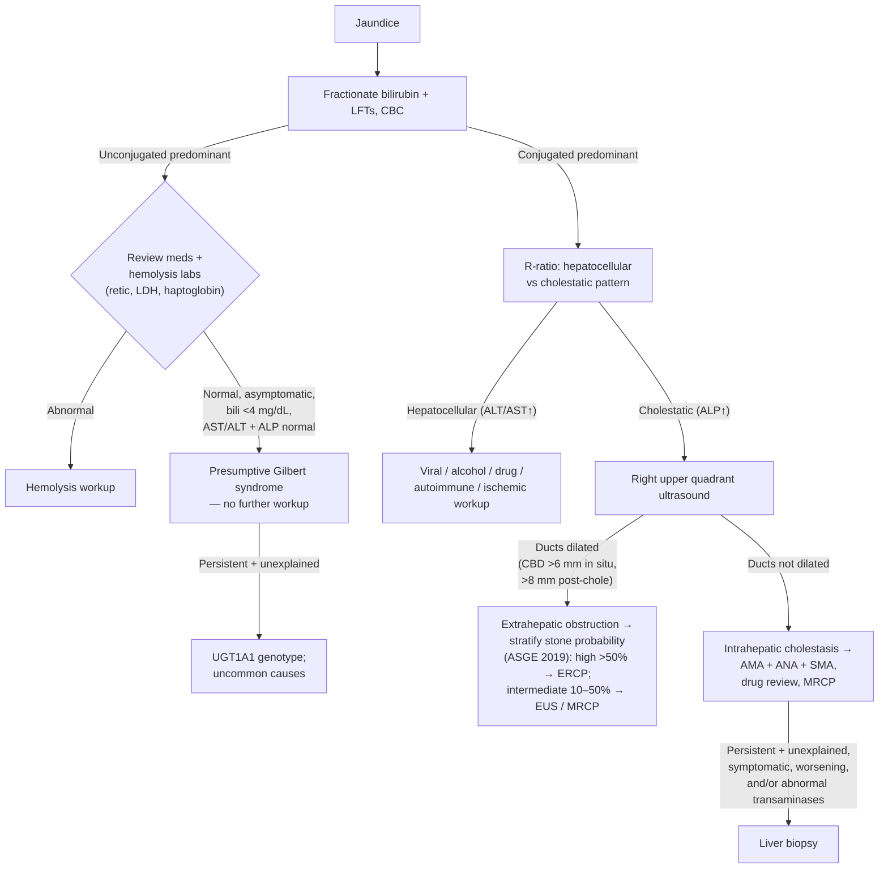

## Definition / Scope

**Jaundice** (icterus) is yellow discoloration of skin, sclerae, and mucous membranes from bilirubin deposition, clinically detectable when total bilirubin exceeds ~2–3 mg/dL. The first branch point is **bilirubin fractionation**:

- **Unconjugated (indirect) hyperbilirubinemia** — excess production (hemolysis), impaired uptake, or impaired conjugation. Bilirubin is **not** water-soluble → **no bilirubinuria**.
- **Conjugated (direct) hyperbilirubinemia** — hepatocellular dysfunction or impaired excretion/biliary obstruction. Bilirubin is water-soluble → **dark urine** and (with obstruction) **pale stools, pruritus**.

Conjugated cases are then split by the **R-ratio / pattern of liver enzymes** into **hepatocellular** (ALT/AST-predominant) versus **cholestatic** (ALP-predominant) injury — the same framework used on the [[abnormal-liver-chemistries]] page (R = (ALT value ÷ ALT ULN) ÷ (ALP value ÷ ALP ULN); **>5 hepatocellular, <2 cholestatic, 2–5 mixed**) ([[acg-2017-liver-chemistries]]).

**Isolated hyperbilirubinemia** is a distinct pattern in the same scheme: **bilirubin elevated with normal ALP *and* normal AST/ALT** — that combination, not the bilirubin alone, is what sends you down the Gilbert/hemolysis branch rather than the injury branches.

> ⚠ **Source-provenance flag.** The bilirubin-fractionation branch point, the R-ratio, and the Gilbert rule below (**3–7%** prevalence; presumptive at total bilirubin **<4 mg/dL** with normal enzymes) all come from [[acg-2017-liver-chemistries]], this page's only source. The ALF criteria below are credited separately to [[acg-2023-alf]]. Three items are **not** in any ingested source and remain flagged: the **~2–3 mg/dL** clinical-detection threshold for icterus, **Charcot's triad / Reynolds' pentad**, and **Courvoisier's sign**. Do not treat them as sourced by ACG 2017.
>
> **Correction (2026-08-26 lint, re-confirmed 2026-09-02) — the cholangitis eponyms are not a missing-guideline problem.** The [[tg18-2018-cholangitis-flowchart|Tokyo Guidelines 2018]] and [[asge-2021-cholangitis|ASGE 2021 cholangitis]] guidelines **are** ingested. A **full-text scan of all 295 non-lecture PDFs in `raw/`** (2026-09-02) returns **zero** hits for "Charcot" and "Courvoisier"; every "Reynold" hit is an author surname, not Reynolds' pentad. The eponyms are absent from the whole corpus rather than awaiting one guideline, and would need the primary eponymous literature. What *is* sourced is better than the eponyms anyway: the **TG18 diagnostic trigger and the Grade I/II/III severity criteria** live on [[acute-cholangitis]] — use that page, not Charcot's triad, to decide urgency and drainage timing.

---

## Differential Diagnosis

### Unconjugated (Indirect) Hyperbilirubinemia

- **Hemolysis** — hereditary (G6PD deficiency, spherocytosis, sickle cell) or acquired (autoimmune, microangiopathic); reduced haptoglobin, ↑reticulocytes, ↑LDH, smear. **Magnitude check:** hemolysis *infrequently* drives bilirubin **>5 mg/dL** unless there is co-existent renal disease, liver disease, or severe acute hemolysis — a higher bilirubin in isolation argues against pure hemolysis ([[acg-2017-liver-chemistries]]).
- **Gilbert syndrome** — most common cause of unconjugated hyperbilirubinemia; **3–7% of the US population**; UDP-glucuronyltransferase defect → reduced hepatic conjugation. Total bilirubin **almost never exceeds 6 mg/dL and is usually <3 mg/dL**; fasting or significant illness raises the unconjugated fraction **2- to 3-fold** (falls with eating or phenobarbital). See the presumptive-diagnosis criteria below.
- **Crigler-Najjar** (rare), ineffective erythropoiesis, resorption of large hematoma, hyperthyroidism, medications, post-transfusion
- Neonatal/physiologic jaundice (distinct pediatric pathway)

**Presumptive Gilbert — all five must hold ([[acg-2017-liver-chemistries]]):**

| # | Criterion |
|---|---|
| 1 | Patient is **asymptomatic and otherwise healthy** |
| 2 | **Mild unconjugated** hyperbilirubinemia — **total bilirubin <4 mg/dL** |
| 3 | **Medications** that cause hyperbilirubinemia excluded |
| 4 | **Evidence of hemolysis** excluded |
| 5 | **Serum transaminases *and* alkaline phosphatase normal** (both — not transaminases alone) |

- All five met → presumptive Gilbert; **additional evaluation is not routinely necessary**.
- If the elevation is **persistent and otherwise unexplained** → confirmatory **UGT1A1 genotype** testing, and evaluate the uncommon causes in ACG 2017 Table 6.

### Conjugated (Direct) — Hepatocellular

- **Viral hepatitis** — [[hepatitis-c]], [[chronic-hepatitis-b]], hepatitis A/E
- **[[alcohol-associated-liver-disease|Alcohol-associated hepatitis]]** — AST:ALT >2, often very high bilirubin
- **[[drug-induced-liver-injury]]** — acetaminophen and idiosyncratic DILI; herbal/dietary supplements
- **[[autoimmune-hepatitis]]**, ischemic hepatitis ("shock liver"), [[wilson-disease|Wilson disease]]
- **[[cirrhosis|Cirrhosis]] / decompensation** of any chronic liver disease (e.g. [[nafld-masld|MASLD]])
- Inherited excretion defects — Dubin-Johnson, Rotor (benign conjugated)

### Conjugated (Direct) — Cholestatic / Obstructive

**Extrahepatic (mechanical) obstruction:**

- **[[choledocholithiasis]]** — most common; ± **[[acute-cholangitis|ascending cholangitis]]** (Charcot's triad; TG18 grading on that page)
- **Malignant biliary obstruction** — [[pancreatic-cancer|pancreatic head cancer]], [[cholangiocarcinoma]], [[ampullary-adenoma|ampullary tumor]], [[gallbladder-cancer|gallbladder cancer]] ([[biliary-stricture|biliary stricture differential]])
- **Benign strictures** — post-surgical, [[chronic-pancreatitis|chronic pancreatitis]], IgG4 disease

**Intrahepatic cholestasis:**

- **[[primary-biliary-cholangitis]]** (AMA-positive), **[[primary-sclerosing-cholangitis]]** ([[mri-mrcp|MRCP]] beading; PSC-[[inflammatory-bowel-disease|IBD]])
- Drug-induced cholestasis, infiltrative disease (sarcoid, amyloid, malignancy), [[nutrition-in-hospitalized-patients|TPN]], sepsis
- [[intrahepatic-cholestasis-of-pregnancy|Cholestasis of pregnancy]] and other [[liver-disease-in-pregnancy|pregnancy-related liver disease]]

---

## Diagnostic Algorithm

1. **Fractionate bilirubin** and obtain LFTs and CBC.
2. **Unconjugated** → **review medications** and check **hemolysis labs** (reticulocytes, LDH, haptoglobin, smear). If both are clean and the five criteria above are met → **presumptive Gilbert syndrome**, no further workup. If hemolytic → hematology workup.
3. **Conjugated** → classify by **R-ratio** ([[abnormal-liver-chemistries]]) into hepatocellular vs. cholestatic.
   - **Hepatocellular** → viral serologies ([[hepatitis-c]], [[chronic-hepatitis-b]], A/E), alcohol history, medication/supplement review ([[drug-induced-liver-injury]]), autoimmune markers ([[autoimmune-hepatitis|ANA/SMA/IgG]]), ceruloplasmin in young patients ([[wilson-disease]]).
   - **Cholestatic** → **right upper quadrant ultrasound first** to assess for **biliary dilation**. **"Dilated" has a number: CBD >6 mm with the gallbladder in situ, >8 mm post-cholecystectomy** ([[asge-2019-choledocholithiasis]]) — full criteria on [[choledocholithiasis]].
4. **Ducts dilated → extrahepatic obstruction.** *Do not jump straight to ERCP.* **Which test comes next is set by the [[choledocholithiasis|ASGE 2019 stone-probability strata]]** — **high (>50%)** → direct **[[ercp|ERCP]]**; **intermediate (10–50%)** → **[[endoscopic-ultrasound|EUS]] or [[mri-mrcp|MRCP]]** first; **low (<10%)** → neither. The criteria table (including the combination rule that **bilirubin >4 mg/dL is high-risk only *with* a dilated duct**, either alone being intermediate) has one home: **[[choledocholithiasis]]**. ERCP then gives therapeutic relief (stone extraction, stent) and tissue sampling ([[biliary-stricture]]). Cholangitis → urgent drainage + antibiotics; **grade it (TG18 I/II/III) before choosing drainage timing — see [[acute-cholangitis]]**.
5. **Ducts not dilated → intrahepatic cholestasis:** check **AMA, ANA, *and* SMA** ([[primary-biliary-cholangitis|PBC]], [[autoimmune-hepatitis|AIH]]) — ACG 2017 names all three, not AMA alone; MRCP for [[primary-sclerosing-cholangitis|PSC]]; review drugs.
6. **When to biopsy — the criteria, not just "consider."** [[liver-biopsy|Liver biopsy]] is reserved for a bilirubin elevation (either fraction) that is **persistent and otherwise unexplained** *and* is **symptomatic, worsening over time, and/or associated with abnormal transaminases** ([[acg-2017-liver-chemistries]] Figure 5). A stable, asymptomatic, isolated elevation with normal transaminases does not meet the bar.

---

## Key Tests

- **Fractionated bilirubin** — conjugated vs. unconjugated; defines the entire pathway.
- **Liver enzymes + R-ratio** — hepatocellular vs. cholestatic pattern ([[abnormal-liver-chemistries]]).
- **Hemolysis panel** — reticulocyte count, LDH, haptoglobin, peripheral smear, Coombs.
- **Urinalysis** — bilirubinuria indicates conjugated hyperbilirubinemia (absent in unconjugated).
- **Right upper quadrant ultrasound** — first imaging in cholestasis; detects biliary dilation, stones, masses.
- **MRCP / [[endoscopic-ultrasound|EUS]]** — noninvasive (MRCP) and tissue-capable (EUS-FNB) characterization of biliary/pancreatic obstruction.
- **[[ercp|ERCP]]** — therapeutic for extrahepatic obstruction (stones, stent) with sampling; not for diagnosis alone.
- **Serologies & autoantibodies** — viral hepatitis panel, AMA ([[primary-biliary-cholangitis|PBC]]), ANA/SMA/IgG ([[autoimmune-hepatitis|AIH]]), IgG4; ceruloplasmin ([[wilson-disease]]).
- **Liver biopsy** — selected intrahepatic cholestasis/hepatocellular cases without a clear diagnosis.

---

## Red Flags / Alarm Features

- **[[acute-liver-failure|Acute liver failure]]** — illness <26 weeks in a patient **without** preexisting liver disease, with **any degree** of [[hepatic-encephalopathy|encephalopathy]] **AND** coagulopathy (**INR ≥1.5**) → urgent [[liver-transplantation|transplant]]-center referral ([[acg-2023-alf]]). Exceptions to the "no prior liver disease" rule: [[autoimmune-hepatitis|AIH]], [[budd-chiari-syndrome|Budd-Chiari]], [[wilson-disease|Wilson disease]]
- **Ascending cholangitis** — Charcot's triad (fever, jaundice, RUQ pain) ± Reynolds' pentad (+ hypotension, confusion) → urgent biliary drainage. **The eponyms are unsourced shorthand (see flag above); the operative rule is the TG18 severity grade — organ dysfunction (any one) = Grade III, two of five criteria = Grade II — which is what sets drainage timing. Criteria on [[acute-cholangitis]].**
- **Painless jaundice with weight loss** — pancreaticobiliary malignancy (Courvoisier's sign: palpable nontender gallbladder)
- **Marked coagulopathy or rising bilirubin/INR** — severe hepatic dysfunction
- **Signs of sepsis** in the setting of biliary obstruction

---

## See Also

[[abnormal-liver-chemistries]], [[choledocholithiasis]], [[acute-cholangitis]], [[biliary-stricture]], [[cholangiocarcinoma]], [[pancreatic-cancer]], [[gallbladder-cancer]], [[primary-biliary-cholangitis]], [[primary-sclerosing-cholangitis]], [[drug-induced-liver-injury]], [[autoimmune-hepatitis]], [[alcohol-associated-liver-disease]], [[hepatitis-c]], [[chronic-hepatitis-b]], [[wilson-disease]], [[budd-chiari-syndrome]], [[nafld-masld]], [[acute-liver-failure]], [[hepatic-encephalopathy]], [[liver-transplantation]], [[chronic-pancreatitis]], [[ercp]], [[endoscopic-ultrasound]], [[mri-mrcp]], [[liver-biopsy]], [[liver-disease-in-pregnancy]], [[intrahepatic-cholestasis-of-pregnancy]], [[ampullary-adenoma]], [[nutrition-in-hospitalized-patients]]

---

## Sources

1. [[acg-2017-liver-chemistries|ACG 2017: Evaluation of Abnormal Liver Chemistries]]
2. [[acg-2023-alf|ACG 2023: Acute Liver Failure]]
3. [[asge-2019-choledocholithiasis|ASGE Guideline: Endoscopic Management of Choledocholithiasis (2019)]]
4. [[tg18-2018-cholangitis-flowchart|Tokyo Guidelines 2018: Initial Management of Acute Biliary Infection and Flowchart for Acute Cholangitis]]
5. [[asge-2021-cholangitis|ASGE Guideline: Management of Acute Cholangitis (2021)]]
